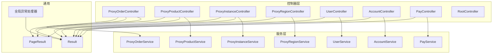
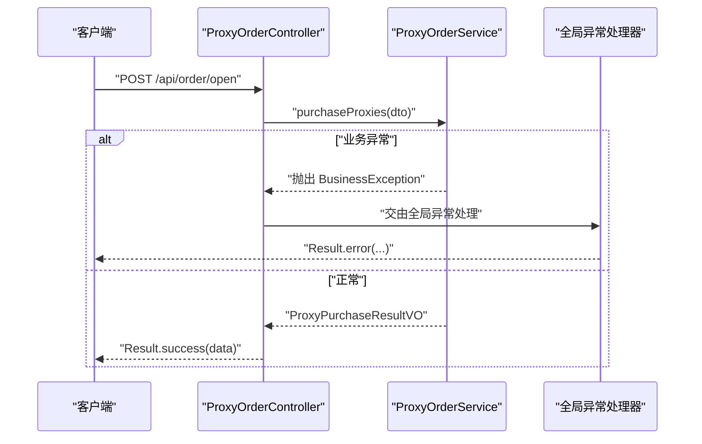
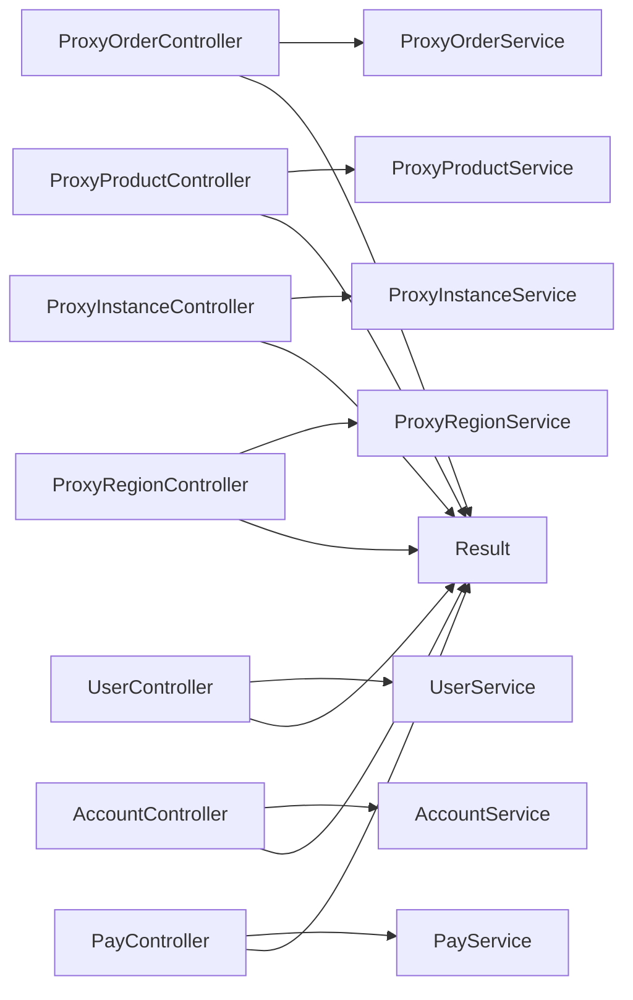

# API 接口文档

<cite>
**本文引用的文件**
- [RootController.java](file://src/main/java/cn/linkfast/controller/RootController.java)
- [ProxyOrderController.java](file://src/main/java/cn/linkfast/controller/ProxyOrderController.java)
- [ProxyProductController.java](file://src/main/java/cn/linkfast/controller/ProxyProductController.java)
- [ProxyInstanceController.java](file://src/main/java/cn/linkfast/controller/ProxyInstanceController.java)
- [ProxyRegionController.java](file://src/main/java/cn/linkfast/controller/ProxyRegionController.java)
- [UserController.java](file://src/main/java/cn/linkfast/controller/UserController.java)
- [AccountController.java](file://src/main/java/cn/linkfast/controller/AccountController.java)
- [PayController.java](file://src/main/java/cn/linkfast/controller/PayController.java)
- [ProxyOrderQueryDTO.java](file://src/main/java/cn/linkfast/dto/ProxyOrderQueryDTO.java)
- [ProxyPurchaseDTO.java](file://src/main/java/cn/linkfast/dto/ProxyPurchaseDTO.java)
- [ProxyProductQueryDTO.java](file://src/main/java/cn/linkfast/dto/ProxyProductQueryDTO.java)
- [ProxyInstanceQueryDTO.java](file://src/main/java/cn/linkfast/dto/ProxyInstanceQueryDTO.java)
- [AreaDTO.java](file://src/main/java/cn/linkfast/dto/AreaDTO.java)
- [ProxyOrderVO.java](file://src/main/java/cn/linkfast/vo/ProxyOrderVO.java)
- [ProxyProductVO.java](file://src/main/java/cn/linkfast/vo/ProxyProductVO.java)
- [ProxyInstanceVO.java](file://src/main/java/cn/linkfast/vo/ProxyInstanceVO.java)
- [Result.java](file://src/main/java/cn/linkfast/common/Result.java)
- [PageResult.java](file://src/main/java/cn/linkfast/common/PageResult.java)
- [GlobalExceptionHandler.java](file://src/main/java/cn/linkfast/exception/GlobalExceptionHandler.java)
- [BusinessException.java](file://src/main/java/cn/linkfast/exception/BusinessException.java)
- [NoRollbackBusinessException.java](file://src/main/java/cn/linkfast/exception/NoRollbackBusinessException.java)
- [test-api.http](file://test-api.http)
</cite>

## 目录
1. [简介](#简介)
2. [项目结构](#项目结构)
3. [核心组件](#核心组件)
4. [架构总览](#架构总览)
5. [详细组件分析](#详细组件分析)
6. [依赖分析](#依赖分析)
7. [性能与扩展性](#性能与扩展性)
8. [故障排查指南](#故障排查指南)
9. [结论](#结论)
10. [附录](#附录)

## 简介
本文件为 Link-Fast 项目的 API 接口文档，覆盖订单管理、产品管理、实例管理、区域管理、用户管理、账户管理和支付管理等模块。文档提供各端点的 HTTP 方法、URL 模式、请求参数、响应格式、状态码说明与错误处理机制，并给出常见使用场景的请求/响应示例路径与最佳实践建议。同时说明认证机制、安全考虑与限流策略现状，以及版本管理、兼容性与迁移建议。

## 项目结构
后端采用 Spring MVC 控制器层，统一返回包装类 Result；各业务模块通过独立 Controller 提供 RESTful 接口，DTO/VO 负责参数与响应数据结构定义，异常由全局处理器统一拦截与转换。

图表来源
- [ProxyOrderController.java:26-85](file://src/main/java/cn/linkfast/controller/ProxyOrderController.java#L26-L85)
- [ProxyProductController.java:19-33](file://src/main/java/cn/linkfast/controller/ProxyProductController.java#L19-L33)
- [ProxyInstanceController.java:20-50](file://src/main/java/cn/linkfast/controller/ProxyInstanceController.java#L20-L50)
- [ProxyRegionController.java:19-35](file://src/main/java/cn/linkfast/controller/ProxyRegionController.java#L19-L35)
- [UserController.java:17-84](file://src/main/java/cn/linkfast/controller/UserController.java#L17-L84)
- [AccountController.java:12-21](file://src/main/java/cn/linkfast/controller/AccountController.java#L12-L21)
- [PayController.java:19-34](file://src/main/java/cn/linkfast/controller/PayController.java#L19-L34)
- [Result.java](file://src/main/java/cn/linkfast/common/Result.java)
- [PageResult.java](file://src/main/java/cn/linkfast/common/PageResult.java)
- [GlobalExceptionHandler.java](file://src/main/java/cn/linkfast/exception/GlobalExceptionHandler.java)

章节来源
- [RootController.java:14-18](file://src/main/java/cn/linkfast/controller/RootController.java#L14-L18)

## 核心组件
- 统一响应包装：Result<T> 用于封装成功/失败响应；PageResult<T> 用于分页查询结果。
- 全局异常处理：GlobalExceptionHandler 将业务异常与运行时异常统一转换为标准响应。
- 数据传输对象：各模块 DTO 定义请求参数与校验规则。
- 视图对象：VO 仅暴露前端所需字段，避免敏感信息泄露。

章节来源
- [Result.java](file://src/main/java/cn/linkfast/common/Result.java)
- [PageResult.java](file://src/main/java/cn/linkfast/common/PageResult.java)
- [GlobalExceptionHandler.java](file://src/main/java/cn/linkfast/exception/GlobalExceptionHandler.java)
- [BusinessException.java](file://src/main/java/cn/linkfast/exception/BusinessException.java)
- [NoRollbackBusinessException.java](file://src/main/java/cn/linkfast/exception/NoRollbackBusinessException.java)

## 架构总览
以下序列图展示一次典型“创建代理订单”的调用链路，体现控制器、服务层与异常处理的协作。

图表来源
- [ProxyOrderController.java:44-46](file://src/main/java/cn/linkfast/controller/ProxyOrderController.java#L44-L46)
- [ProxyOrderController.java:55-64](file://src/main/java/cn/linkfast/controller/ProxyOrderController.java#L55-L64)
- [GlobalExceptionHandler.java](file://src/main/java/cn/linkfast/exception/GlobalExceptionHandler.java)

## 详细组件分析

### 订单管理
- 接口概览
  - GET /api/order/list
    - 功能：分页查询订单列表
    - 请求参数：见“请求参数定义”
    - 响应：Result<PageResult<ProxyOrderVO>>
    - 状态码：200 成功；400 参数校验失败；500 服务器异常
  - POST /api/order/open
    - 功能：开通代理（创建订单）
    - 请求体：ProxyPurchaseDTO
    - 响应：Result<ProxyPurchaseResultVO>
    - 状态码：200 成功；400 参数校验失败；500 服务器异常
  - POST /api/order/renew
    - 功能：续费代理实例
    - 请求体：ProxyRenewDTO
    - 响应：Result<ProxyRenewResultVO>
    - 状态码：200 成功；业务异常时 Result.error(...)
  - POST /api/order/release
    - 功能：释放代理实例
    - 请求体：ProxyReleaseDTO
    - 响应：Result<ProxyReleaseResultVO>
    - 状态码：200 成功；业务异常时 Result.error(...)

- 请求参数定义
  - ProxyOrderQueryDTO
    - 字段：status（可选）、pageNum（必填，≥1）、pageSize（必填，1~100）、orderNo（可选）、orderType（可选）
  - ProxyPurchaseDTO
    - 字段：payPassword（必填）、totalQuantity（必填）、params（必填，订单项列表）

- 响应模型
  - ProxyOrderVO：包含平台订单号、订单类型、金额、实例总数、买家用户ID、创建时间等

- 错误处理
  - 参数校验失败：返回 Result.error，状态码通常为 400
  - 业务异常：捕获 BusinessException 后返回 Result.error(msg)
  - 其他异常：捕获 Exception 后返回通用错误提示

- 示例参考
  - 请求示例：见 [test-api.http](file://test-api.http)
  - 响应示例：见 [ProxyOrderController.java:37-38](file://src/main/java/cn/linkfast/controller/ProxyOrderController.java#L37-L38)、[ProxyOrderController.java:45-46](file://src/main/java/cn/linkfast/controller/ProxyOrderController.java#L45-L46)

章节来源
- [ProxyOrderController.java:26-85](file://src/main/java/cn/linkfast/controller/ProxyOrderController.java#L26-L85)
- [ProxyOrderQueryDTO.java:19-57](file://src/main/java/cn/linkfast/dto/ProxyOrderQueryDTO.java#L19-L57)
- [ProxyPurchaseDTO.java:10-18](file://src/main/java/cn/linkfast/dto/ProxyPurchaseDTO.java#L10-L18)
- [ProxyOrderVO.java:14-47](file://src/main/java/cn/linkfast/vo/ProxyOrderVO.java#L14-L47)

### 产品管理
- 接口概览
  - GET /api/proxy-product/list
    - 功能：分页查询代理产品列表
    - 请求参数：countryCode（可选）、cityCode（可选）、pageNum（必填，≥1）、pageSize（必填，1~100）、proxyType（可选，多值）
    - 响应：Result<PageResult<ProxyProductVO>>
    - 状态码：200 成功；400 参数校验失败；500 服务器异常

- 响应模型
  - ProxyProductVO：包含产品编号、名称、代理类型、国家/省份/城市代码、协议、详情、单位、最小时长、成本价、库存等

- 示例参考
  - 请求示例：见 [test-api.http](file://test-api.http)
  - 响应示例：见 [ProxyProductController.java:30-32](file://src/main/java/cn/linkfast/controller/ProxyProductController.java#L30-L32)

章节来源
- [ProxyProductController.java:19-33](file://src/main/java/cn/linkfast/controller/ProxyProductController.java#L19-L33)
- [ProxyProductQueryDTO.java:17-51](file://src/main/java/cn/linkfast/dto/ProxyProductQueryDTO.java#L17-L51)
- [ProxyProductVO.java:14-31](file://src/main/java/cn/linkfast/vo/ProxyProductVO.java#L14-L31)

### 实例管理
- 接口概览
  - GET /api/instance/list
    - 功能：分页查询代理实例列表
    - 请求参数：proxyType（可选，多值）、status（可选）、pageNum（必填，≥1）、pageSize（必填，1~100）、countryCode（可选）、cityCode（可选）、ip（可选，模糊）
    - 响应：Result<PageResult<ProxyInstanceVO>>
    - 状态码：200 成功；400 参数校验失败；500 服务器异常
  - PUT /api/instance/remark
    - 功能：更新代理实例备注
    - 请求体：ProxyInstanceRemarkDTO（包含 instanceNo 与 remark）
    - 响应：Result<Void>
    - 状态码：200 成功；400 参数校验失败；500 服务器异常

- 响应模型
  - ProxyInstanceVO：包含 IP、端口、地区编码、状态、用户名、密码、实例编号、是否可续费、订单号、产品号、购买周期单位与时长、到期时间、备注、创建时间等

- 示例参考
  - 请求示例：见 [test-api.http](file://test-api.http)
  - 响应示例：见 [ProxyInstanceController.java:32-35](file://src/main/java/cn/linkfast/controller/ProxyInstanceController.java#L32-L35)、[ProxyInstanceController.java:44-47](file://src/main/java/cn/linkfast/controller/ProxyInstanceController.java#L44-L47)

章节来源
- [ProxyInstanceController.java:20-50](file://src/main/java/cn/linkfast/controller/ProxyInstanceController.java#L20-L50)
- [ProxyInstanceQueryDTO.java:14-58](file://src/main/java/cn/linkfast/dto/ProxyInstanceQueryDTO.java#L14-L58)
- [ProxyInstanceVO.java:13-41](file://src/main/java/cn/linkfast/vo/ProxyInstanceVO.java#L13-L41)

### 区域管理
- 接口概览
  - GET /api/area/tree
    - 功能：获取地域树形列表
    - 请求参数：codes（可选，地域代码列表）
    - 响应：Result<List<AreaDTO>>
    - 状态码：200 成功；500 服务器异常

- 数据模型
  - AreaDTO：包含 code、name、cname、children（下级地域）

- 示例参考
  - 请求示例：见 [test-api.http](file://test-api.http)
  - 响应示例：见 [ProxyRegionController.java:31-34](file://src/main/java/cn/linkfast/controller/ProxyRegionController.java#L31-L34)

章节来源
- [ProxyRegionController.java:19-35](file://src/main/java/cn/linkfast/controller/ProxyRegionController.java#L19-L35)
- [AreaDTO.java:13-35](file://src/main/java/cn/linkfast/dto/AreaDTO.java#L13-L35)

### 用户管理
- 接口概览
  - GET /api/users
    - 功能：获取所有用户
    - 响应：Result<List<User>>
    - 状态码：200 成功；500 服务器异常
  - GET /api/users/{id}
    - 功能：根据 ID 获取用户
    - 响应：Result<User> 或 404
    - 状态码：200 成功；404 用户不存在；500 服务器异常
  - POST /api/users
    - 功能：创建用户
    - 请求体：User
    - 响应：Result<User>
    - 状态码：200 成功；500 服务器异常
  - PUT /api/users/{id}
    - 功能：更新用户
    - 请求体：User
    - 响应：Result<User> 或 404
    - 状态码：200 成功；404 用户不存在；500 服务器异常
  - DELETE /api/users/{id}
    - 功能：删除用户
    - 响应：Result<String> 或 404
    - 状态码：200 成功；404 用户不存在；500 服务器异常

- 示例参考
  - 请求示例：见 [test-api.http](file://test-api.http)

章节来源
- [UserController.java:17-84](file://src/main/java/cn/linkfast/controller/UserController.java#L17-L84)

### 账户管理
- 接口概览
  - GET /api/account/info
    - 功能：获取账户信息
    - 响应：Result<AccountInfoVO>
    - 状态码：200 成功；500 服务器异常

- 示例参考
  - 请求示例：见 [test-api.http](file://test-api.http)

章节来源
- [AccountController.java:12-21](file://src/main/java/cn/linkfast/controller/AccountController.java#L12-L21)

### 支付管理
- 接口概览
  - POST /api/pay/verify
    - 功能：校验支付密码
    - 请求体：PayPasswordDTO（包含 payPassword）
    - 响应：Result<PayPasswordVO>
    - 状态码：200 成功；400 参数校验失败；500 服务器异常

- 示例参考
  - 请求示例：见 [test-api.http](file://test-api.http)

章节来源
- [PayController.java:19-34](file://src/main/java/cn/linkfast/controller/PayController.java#L19-L34)

## 依赖分析
- 控制器与服务层：各 Controller 通过构造注入方式依赖对应 Service，职责清晰、耦合度低。
- 统一响应与异常：Result/Result.error 与全局异常处理器确保错误语义一致。
- DTO/VO：严格区分请求参数与响应视图，降低前后端耦合与数据泄露风险。

图表来源
- [ProxyOrderController.java:26-85](file://src/main/java/cn/linkfast/controller/ProxyOrderController.java#L26-L85)
- [ProxyProductController.java:19-33](file://src/main/java/cn/linkfast/controller/ProxyProductController.java#L19-L33)
- [ProxyInstanceController.java:20-50](file://src/main/java/cn/linkfast/controller/ProxyInstanceController.java#L20-L50)
- [ProxyRegionController.java:19-35](file://src/main/java/cn/linkfast/controller/ProxyRegionController.java#L19-L35)
- [UserController.java:17-84](file://src/main/java/cn/linkfast/controller/UserController.java#L17-L84)
- [AccountController.java:12-21](file://src/main/java/cn/linkfast/controller/AccountController.java#L12-L21)
- [PayController.java:19-34](file://src/main/java/cn/linkfast/controller/PayController.java#L19-L34)
- [Result.java](file://src/main/java/cn/linkfast/common/Result.java)

## 性能与扩展性
- 分页参数限制：pageNum、pageSize 在 DTO 层已做最小值与最大值约束，防止超大分页请求导致数据库压力过大。
- 异常快速失败：业务异常被捕获并直接返回 Result.error，避免长时间事务占用。
- 建议优化方向
  - 对高频查询增加缓存（如产品列表、地域树）以降低数据库负载
  - 对订单/实例列表查询增加索引与必要字段覆盖
  - 对外部回调接口增加幂等性设计与去重队列

[本节为通用建议，无需列出章节来源]

## 故障排查指南
- 常见问题定位
  - 参数校验失败：检查 DTO 字段是否满足约束（必填、范围、格式），查看 Result.error 返回的错误信息
  - 业务异常：捕获 BusinessException 后返回 Result.error(msg)，需结合日志定位具体原因
  - 未知异常：捕获 Exception 后返回通用错误提示，建议开启更详细的日志以便复盘
- 日志与监控
  - 控制器层对关键操作有日志输出，便于回溯
  - 建议接入统一日志与链路追踪系统，提升可观测性

章节来源
- [ProxyOrderController.java:55-64](file://src/main/java/cn/linkfast/controller/ProxyOrderController.java#L55-L64)
- [ProxyOrderController.java:72-82](file://src/main/java/cn/linkfast/controller/ProxyOrderController.java#L72-L82)
- [GlobalExceptionHandler.java](file://src/main/java/cn/linkfast/exception/GlobalExceptionHandler.java)

## 结论
本项目通过清晰的控制器分层、统一的响应包装与严格的参数校验，提供了稳定可靠的 RESTful API。建议在生产环境中进一步完善鉴权、限流与缓存策略，并持续演进版本管理与兼容性保障机制，以支撑更大规模的业务增长。

[本节为总结性内容，无需列出章节来源]

## 附录

### 统一响应与分页
- 成功响应：Result.success(data)
- 失败响应：Result.error(code, message) 或 Result.error(message)
- 分页响应：PageResult<T> 包含 total、records 等字段

章节来源
- [Result.java](file://src/main/java/cn/linkfast/common/Result.java)
- [PageResult.java](file://src/main/java/cn/linkfast/common/PageResult.java)

### 认证机制、安全与限流
- 认证机制：当前仓库未发现显式的鉴权与令牌校验逻辑，建议在网关或控制器层引入基于 Token/JWT 的鉴权方案
- 安全考虑：支付相关接口（如校验支付密码）建议启用 HTTPS、参数加密与二次校验
- 限流策略：建议在网关层或应用层增加基于 IP/用户维度的限流，防止恶意刷单与资源滥用

[本节为通用建议，无需列出章节来源]

### API 版本管理与迁移
- 版本命名：建议采用路径前缀版本化，如 /api/v1/...，并在文档中标注废弃时间线
- 兼容性：新增字段采用可选策略，变更字段提供过渡期并保留旧字段
- 迁移指南：发布新版本时提供字段变更清单与迁移脚本，配合灰度发布与回滚预案

[本节为通用建议，无需列出章节来源]

### 第三方对接与最佳实践
- 对接流程
  - 申请接入：提供企业信息与回调地址，获取渠道商账号与密钥
  - 环境准备：先在沙箱环境联调，再切换至生产
  - 接口调用：遵循统一响应与参数校验，确保请求幂等与错误快速反馈
- 最佳实践
  - 使用 HTTPS 与签名验证，防止请求被篡改
  - 对批量操作设置合理的分页与并发限制
  - 对回调接口进行重试与去重处理，保证数据一致性

[本节为通用建议，无需列出章节来源]