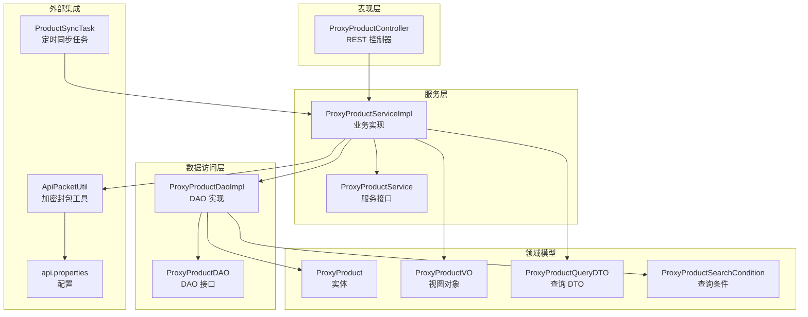
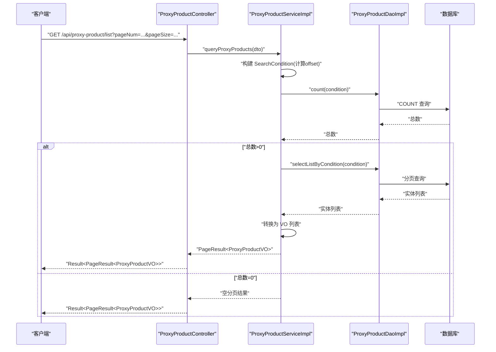
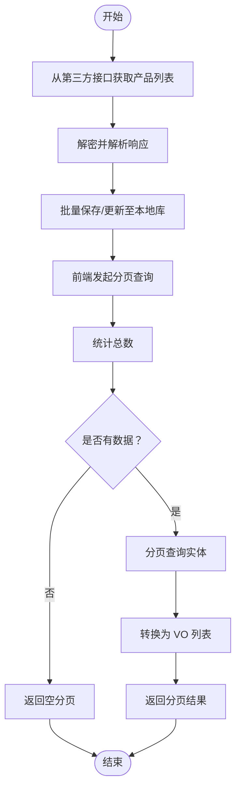
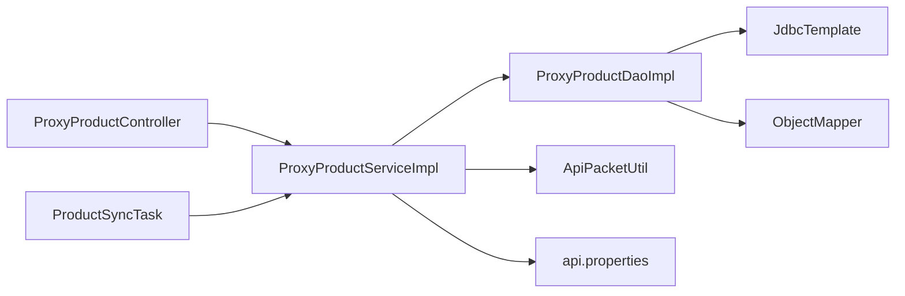

# 产品管理 API

<cite>
**本文引用的文件**
- [ProxyProductController.java](file://src/main/java/cn/linkfast/controller/ProxyProductController.java)
- [ProxyProductService.java](file://src/main/java/cn/linkfast/service/ProxyProductService.java)
- [ProxyProductServiceImpl.java](file://src/main/java/cn/linkfast/service/impl/ProxyProductServiceImpl.java)
- [ProxyProductDAO.java](file://src/main/java/cn/linkfast/dao/ProxyProductDAO.java)
- [ProxyProductDaoImpl.java](file://src/main/java/cn/linkfast/dao/impl/ProxyProductDaoImpl.java)
- [ProxyProductQueryDTO.java](file://src/main/java/cn/linkfast/dto/ProxyProductQueryDTO.java)
- [ProxyProductSearchCondition.java](file://src/main/java/cn/linkfast/dto/ProxyProductSearchCondition.java)
- [ProxyProductVO.java](file://src/main/java/cn/linkfast/vo/ProxyProductVO.java)
- [ProxyProduct.java](file://src/main/java/cn/linkfast/entity/ProxyProduct.java)
- [ProductSyncTask.java](file://src/main/java/cn/linkfast/task/ProductSyncTask.java)
- [ApiPacketUtil.java](file://src/main/java/cn/linkfast/utils/ApiPacketUtil.java)
- [api.properties](file://src/main/resources/api.properties)
- [获取代理产品列表接口.md](file://docs/api/internal/获取代理产品列表接口.md)
- [ProxyProductControllerTest.java](file://src/test/java/cn/linkfast/controller/ProxyProductControllerTest.java)
</cite>

## 目录
1. [简介](#简介)
2. [项目结构](#项目结构)
3. [核心组件](#核心组件)
4. [架构总览](#架构总览)
5. [详细组件分析](#详细组件分析)
6. [依赖分析](#依赖分析)
7. [性能考虑](#性能考虑)
8. [故障排查指南](#故障排查指南)
9. [结论](#结论)
10. [附录](#附录)

## 简介
本文件为产品管理模块的 API 接口文档，聚焦于代理产品的查询、搜索与管理能力。内容涵盖：
- 产品查询接口的请求参数、分页机制与返回结构
- 产品数据结构（含价格、库存、规格参数等）
- 产品分类与可用区域的查询入口
- 产品搜索的过滤条件与排序规则
- 产品详情展示、价格查询与可用性检查流程
- 产品状态管理、动态定价与促销活动的集成方式
- 缓存策略、性能优化与并发控制最佳实践

## 项目结构
产品管理模块采用典型的分层架构：Controller → Service → DAO → Entity/VO/DTO，配合定时任务进行第三方产品数据同步。

图表来源
- [ProxyProductController.java:1-34](file://src/main/java/cn/linkfast/controller/ProxyProductController.java#L1-L34)
- [ProxyProductServiceImpl.java:1-175](file://src/main/java/cn/linkfast/service/impl/ProxyProductServiceImpl.java#L1-L175)
- [ProxyProductDaoImpl.java:1-286](file://src/main/java/cn/linkfast/dao/impl/ProxyProductDaoImpl.java#L1-L286)
- [ProxyProduct.java:1-99](file://src/main/java/cn/linkfast/entity/ProxyProduct.java#L1-L99)
- [ProxyProductVO.java:1-31](file://src/main/java/cn/linkfast/vo/ProxyProductVO.java#L1-L31)
- [ProxyProductQueryDTO.java:1-52](file://src/main/java/cn/linkfast/dto/ProxyProductQueryDTO.java#L1-L52)
- [ProxyProductSearchCondition.java:1-18](file://src/main/java/cn/linkfast/dto/ProxyProductSearchCondition.java#L1-L18)
- [ProductSyncTask.java:1-96](file://src/main/java/cn/linkfast/task/ProductSyncTask.java#L1-L96)
- [ApiPacketUtil.java:1-103](file://src/main/java/cn/linkfast/utils/ApiPacketUtil.java#L1-L103)
- [api.properties:1-31](file://src/main/resources/api.properties#L1-L31)

章节来源
- [ProxyProductController.java:1-34](file://src/main/java/cn/linkfast/controller/ProxyProductController.java#L1-L34)
- [ProxyProductServiceImpl.java:1-175](file://src/main/java/cn/linkfast/service/impl/ProxyProductServiceImpl.java#L1-L175)
- [ProxyProductDaoImpl.java:1-286](file://src/main/java/cn/linkfast/dao/impl/ProxyProductDaoImpl.java#L1-L286)
- [ProxyProduct.java:1-99](file://src/main/java/cn/linkfast/entity/ProxyProduct.java#L1-L99)
- [ProxyProductVO.java:1-31](file://src/main/java/cn/linkfast/vo/ProxyProductVO.java#L1-L31)
- [ProxyProductQueryDTO.java:1-52](file://src/main/java/cn/linkfast/dto/ProxyProductQueryDTO.java#L1-L52)
- [ProxyProductSearchCondition.java:1-18](file://src/main/java/cn/linkfast/dto/ProxyProductSearchCondition.java#L1-L18)
- [ProductSyncTask.java:1-96](file://src/main/java/cn/linkfast/task/ProductSyncTask.java#L1-L96)
- [ApiPacketUtil.java:1-103](file://src/main/java/cn/linkfast/utils/ApiPacketUtil.java#L1-L103)
- [api.properties:1-31](file://src/main/resources/api.properties#L1-L31)

## 核心组件
- 控制器：提供对外的 GET /api/proxy-product/list 接口，负责参数绑定与结果包装。
- 服务层：实现查询、同步、响应解析与 DTO/VO 转换；封装与第三方 API 的通信细节。
- DAO 层：负责 SQL 拼接、分页查询、计数与批量写入；RowMapper 解析 JSON 字段。
- 领域模型：ProxyProduct 实体承载丰富的产品规格与扩展字段；VO 仅暴露前端所需字段。
- 定时任务：周期性从第三方拉取产品清单并入库，保证本地数据新鲜度。
- 加密封包：统一处理加密、签名与请求组装，屏蔽第三方接口细节。

章节来源
- [ProxyProductController.java:24-33](file://src/main/java/cn/linkfast/controller/ProxyProductController.java#L24-L33)
- [ProxyProductServiceImpl.java:121-141](file://src/main/java/cn/linkfast/service/impl/ProxyProductServiceImpl.java#L121-L141)
- [ProxyProductDaoImpl.java:192-214](file://src/main/java/cn/linkfast/dao/impl/ProxyProductDaoImpl.java#L192-L214)
- [ProxyProduct.java:13-66](file://src/main/java/cn/linkfast/entity/ProxyProduct.java#L13-L66)
- [ProxyProductVO.java:14-31](file://src/main/java/cn/linkfast/vo/ProxyProductVO.java#L14-L31)
- [ProductSyncTask.java:35-62](file://src/main/java/cn/linkfast/task/ProductSyncTask.java#L35-L62)
- [ApiPacketUtil.java:56-90](file://src/main/java/cn/linkfast/utils/ApiPacketUtil.java#L56-L90)

## 架构总览
下图展示了“产品列表查询”的端到端调用链路，包括参数校验、分页计算、DAO 查询、VO 转换与返回。

图表来源
- [ProxyProductController.java:29-33](file://src/main/java/cn/linkfast/controller/ProxyProductController.java#L29-L33)
- [ProxyProductServiceImpl.java:122-141](file://src/main/java/cn/linkfast/service/impl/ProxyProductServiceImpl.java#L122-L141)
- [ProxyProductDaoImpl.java:192-214](file://src/main/java/cn/linkfast/dao/impl/ProxyProductDaoImpl.java#L192-L214)

## 详细组件分析

### 接口：获取代理产品列表
- 路径：/api/proxy-product/list
- 方法：GET
- 参数：
  - 必填：pageNum（≥1）、pageSize（1~100）
  - 可选：countryCode、cityCode、proxyType[]（数组）
- 返回：Result<PageResult<ProxyProductVO>>
- 分页：total、totalPages、pageNum、pageSize、list
- 示例与规范详见文档：[获取代理产品列表接口.md](file://docs/api/internal/获取代理产品列表接口.md)

章节来源
- [ProxyProductController.java:29-33](file://src/main/java/cn/linkfast/controller/ProxyProductController.java#L29-L33)
- [ProxyProductQueryDTO.java:17-51](file://src/main/java/cn/linkfast/dto/ProxyProductQueryDTO.java#L17-L51)
- [ProxyProductSearchCondition.java:11-17](file://src/main/java/cn/linkfast/dto/ProxyProductSearchCondition.java#L11-L17)
- [ProxyProductServiceImpl.java:56-71](file://src/main/java/cn/linkfast/service/impl/ProxyProductServiceImpl.java#L56-L71)
- [ProxyProductServiceImpl.java:121-141](file://src/main/java/cn/linkfast/service/impl/ProxyProductServiceImpl.java#L121-L141)
- [ProxyProductDaoImpl.java:202-214](file://src/main/java/cn/linkfast/dao/impl/ProxyProductDaoImpl.java#L202-L214)
- [ProxyProductVO.java:19-31](file://src/main/java/cn/linkfast/vo/ProxyProductVO.java#L19-L31)
- [获取代理产品列表接口.md:12-126](file://docs/api/internal/获取代理产品列表接口.md#L12-L126)

### 数据模型与字段说明
- 实体 ProxyProduct（部分关键字段）
  - 产品标识：productNo、productName
  - 地区信息：countryCode、stateCode、cityCode
  - 规格参数：proxyType、protocol、duration、unit、bandWidth、flow、cpu、memory
  - 价格与库存：costPrice、retailPrice、inventory
  - 其他：enable、supplierCode、assignIp、productType、时间戳等
  - JSON 扩展：cidrBlocks、offlineCidrBlocks、projectList
- 视图对象 ProxyProductVO（前端展示）
  - 仅包含前端渲染所需字段，避免敏感信息泄露
- 查询 DTO 与条件
  - ProxyProductQueryDTO：pageNum/pageSize 校验与 countryCode/cityCode/proxyType[]
  - ProxyProductSearchCondition：DAO 层 SQL 拼接使用的条件对象

章节来源
- [ProxyProduct.java:17-66](file://src/main/java/cn/linkfast/entity/ProxyProduct.java#L17-L66)
- [ProxyProductVO.java:19-31](file://src/main/java/cn/linkfast/vo/ProxyProductVO.java#L19-L31)
- [ProxyProductQueryDTO.java:22-51](file://src/main/java/cn/linkfast/dto/ProxyProductQueryDTO.java#L22-L51)
- [ProxyProductSearchCondition.java:12-16](file://src/main/java/cn/linkfast/dto/ProxyProductSearchCondition.java#L12-L16)

### 价格计算与库存管理
- 价格字段
  - costPrice：成本价（数据库字段）
  - retailPrice：零售价（数据库字段，默认值在测试中验证为 0.00）
- 库存字段
  - inventory：库存数量（数据库字段）
- 订单侧库存校验
  - 在下单流程中，会基于 productNo 与 proxyType[] 从第三方查询产品并校验库存，不足则抛出业务异常
- 动态定价与促销
  - 当前代码未见直接的价格计算逻辑；如需动态定价/促销，可在服务层增加策略适配或在 VO 层补充计算字段（建议以扩展字段形式，避免破坏现有接口）

章节来源
- [ProxyProduct.java:30-33](file://src/main/java/cn/linkfast/entity/ProxyProduct.java#L30-L33)
- [ProxyProductServiceImpl.java:155-172](file://src/main/java/cn/linkfast/service/impl/ProxyProductServiceImpl.java#L155-L172)
- [ProxyProductDAOTest.java:84-92](file://src/test/java/cn/linkfast/dao/ProxyProductDAOTest.java#L84-L92)

### 产品分类、规格参数与可用区域
- 分类维度
  - proxyType：代理类型（数组过滤）
  - protocol：协议类型（HTTP/SOCKS5）
  - productType：产品类型
- 规格参数
  - duration、unit、bandWidth、flow、cpu、memory 等
- 可用区域
  - countryCode、stateCode、cityCode 支持三级筛选
- 产品详情
  - detail：产品描述
  - assignIp、supplierCode、cidrBlocks、projectList 等扩展信息

章节来源
- [ProxyProductQueryDTO.java:25-50](file://src/main/java/cn/linkfast/dto/ProxyProductQueryDTO.java#L25-L50)
- [ProxyProductSearchCondition.java:12-16](file://src/main/java/cn/linkfast/dto/ProxyProductSearchCondition.java#L12-L16)
- [ProxyProduct.java:20-49](file://src/main/java/cn/linkfast/entity/ProxyProduct.java#L20-L49)
- [ProxyProductDaoImpl.java:40-98](file://src/main/java/cn/linkfast/dao/impl/ProxyProductDaoImpl.java#L40-L98)

### 搜索过滤、排序与分页
- 过滤条件
  - countryCode、cityCode（字符串匹配）
  - proxyType[]（IN 条件）
- 排序规则
  - 当前 DAO 未显式指定 ORDER BY，默认按主键或其他索引顺序返回
- 分页机制
  - pageNum/pageSize 映射为 limit/offset，DAO 层追加 LIMIT ? OFFSET ?

章节来源
- [ProxyProductServiceImpl.java:56-71](file://src/main/java/cn/linkfast/service/impl/ProxyProductServiceImpl.java#L56-L71)
- [ProxyProductDaoImpl.java:216-234](file://src/main/java/cn/linkfast/dao/impl/ProxyProductDaoImpl.java#L216-L234)
- [ProxyProductDaoImpl.java:209-213](file://src/main/java/cn/linkfast/dao/impl/ProxyProductDaoImpl.java#L209-L213)

### 产品详情展示、价格查询与可用性检查流程
- 详情展示
  - 通过 /api/proxy-product/list 返回的 VO 列表包含前端所需字段
- 价格查询
  - costPrice/retailPrice 由服务层从第三方接口获取并入库，前端通过 VO 获取
- 可用性检查
  - 下单前对 inventory 进行校验，不足则拒绝订单

图表来源
- [ProxyProductServiceImpl.java:104-119](file://src/main/java/cn/linkfast/service/impl/ProxyProductServiceImpl.java#L104-L119)
- [ProxyProductServiceImpl.java:121-141](file://src/main/java/cn/linkfast/service/impl/ProxyProductServiceImpl.java#L121-L141)
- [ProxyProductDaoImpl.java:100-190](file://src/main/java/cn/linkfast/dao/impl/ProxyProductDaoImpl.java#L100-L190)

### 状态管理、动态定价与促销集成
- 状态管理
  - enable 字段用于启用/停用产品
- 动态定价与促销
  - 当前未见直接实现；建议在服务层引入定价策略或在 VO 层增加计算字段，避免影响现有接口契约

章节来源
- [ProxyProduct.java:46-46](file://src/main/java/cn/linkfast/entity/ProxyProduct.java#L46-L46)

### 第三方接口集成与安全
- 环境切换
  - 通过 api.properties 的 api.ipv.env 切换 sandbox/prod
- 加密封包
  - ApiPacketUtil 负责 params 加密、版本号、appKey、reqId 等封装
- 同步流程
  - ProductSyncTask 周期性拉取并入库

章节来源
- [api.properties:2-5](file://src/main/resources/api.properties#L2-L5)
- [ApiPacketUtil.java:40-51](file://src/main/java/cn/linkfast/utils/ApiPacketUtil.java#L40-L51)
- [ApiPacketUtil.java:56-90](file://src/main/java/cn/linkfast/utils/ApiPacketUtil.java#L56-L90)
- [ProductSyncTask.java:35-62](file://src/main/java/cn/linkfast/task/ProductSyncTask.java#L35-L62)

## 依赖分析
- 控制器依赖服务接口，服务实现依赖 DAO、工具类与配置
- DAO 依赖 JDBC 模板与 Jackson 进行 RowMapper 与 JSON 转换
- 定时任务依赖服务接口进行同步

图表来源
- [ProxyProductController.java:22-22](file://src/main/java/cn/linkfast/controller/ProxyProductController.java#L22-L22)
- [ProxyProductServiceImpl.java:38-41](file://src/main/java/cn/linkfast/service/impl/ProxyProductServiceImpl.java#L38-L41)
- [ProxyProductDaoImpl.java:34-35](file://src/main/java/cn/linkfast/dao/impl/ProxyProductDaoImpl.java#L34-L35)
- [ApiPacketUtil.java:22-34](file://src/main/java/cn/linkfast/utils/ApiPacketUtil.java#L22-L34)
- [api.properties:1-31](file://src/main/resources/api.properties#L1-L31)
- [ProductSyncTask.java:26-26](file://src/main/java/cn/linkfast/task/ProductSyncTask.java#L26-L26)

章节来源
- [ProxyProductController.java:1-34](file://src/main/java/cn/linkfast/controller/ProxyProductController.java#L1-L34)
- [ProxyProductServiceImpl.java:1-175](file://src/main/java/cn/linkfast/service/impl/ProxyProductServiceImpl.java#L1-L175)
- [ProxyProductDaoImpl.java:1-286](file://src/main/java/cn/linkfast/dao/impl/ProxyProductDaoImpl.java#L1-L286)
- [ApiPacketUtil.java:1-103](file://src/main/java/cn/linkfast/utils/ApiPacketUtil.java#L1-L103)
- [api.properties:1-31](file://src/main/resources/api.properties#L1-L31)
- [ProductSyncTask.java:1-96](file://src/main/java/cn/linkfast/task/ProductSyncTask.java#L1-L96)

## 性能考虑
- 分页与计数
  - 先 count 再分页查询，避免一次性加载全量数据
- 批量写入
  - DAO 使用批量更新，减少往返次数
- JSON 字段解析
  - RowMapper 中手动解析 JSON 字段，注意空值与异常兜底
- 缓存策略建议
  - 对高频查询（如地区/类型/协议组合）引入 Redis 缓存，设置合理 TTL
  - 对只读列表数据可缓存分页结果，结合版本号或时间戳失效
- 并发控制
  - 同步任务使用调度框架，避免重复执行
  - 下单前库存校验建议使用数据库层面的原子性操作或分布式锁

## 故障排查指南
- 参数校验失败
  - pageNum/pageSize 缺失或越界会导致 400
- 第三方接口异常
  - 响应 code 非 200 时抛出异常，检查 appKey/appSecret/env 配置
- 数据库异常
  - JSON 字段解析失败时回退为空集合，关注日志
- 集成测试
  - 可参考单元测试用例验证接口行为

章节来源
- [ProxyProductControllerTest.java:52-83](file://src/test/java/cn/linkfast/controller/ProxyProductControllerTest.java#L52-L83)
- [ProxyProductServiceImpl.java:155-172](file://src/main/java/cn/linkfast/service/impl/ProxyProductServiceImpl.java#L155-L172)
- [ProxyProductDaoImpl.java:259-271](file://src/main/java/cn/linkfast/dao/impl/ProxyProductDaoImpl.java#L259-L271)

## 结论
本产品管理 API 以清晰的分层设计实现了代理产品的查询与管理，具备完善的分页、过滤与第三方同步能力。建议后续在以下方面持续优化：
- 引入缓存与限流策略，提升高并发场景下的稳定性
- 在服务层扩展动态定价与促销集成点，保持接口契约稳定
- 增强日志与监控，覆盖关键路径与异常分支

## 附录
- 接口文档参考：[获取代理产品列表接口.md](file://docs/api/internal/获取代理产品列表接口.md)
- 集成测试参考：[ProxyProductControllerTest.java:1-101](file://src/test/java/cn/linkfast/controller/ProxyProductControllerTest.java#L1-L101)