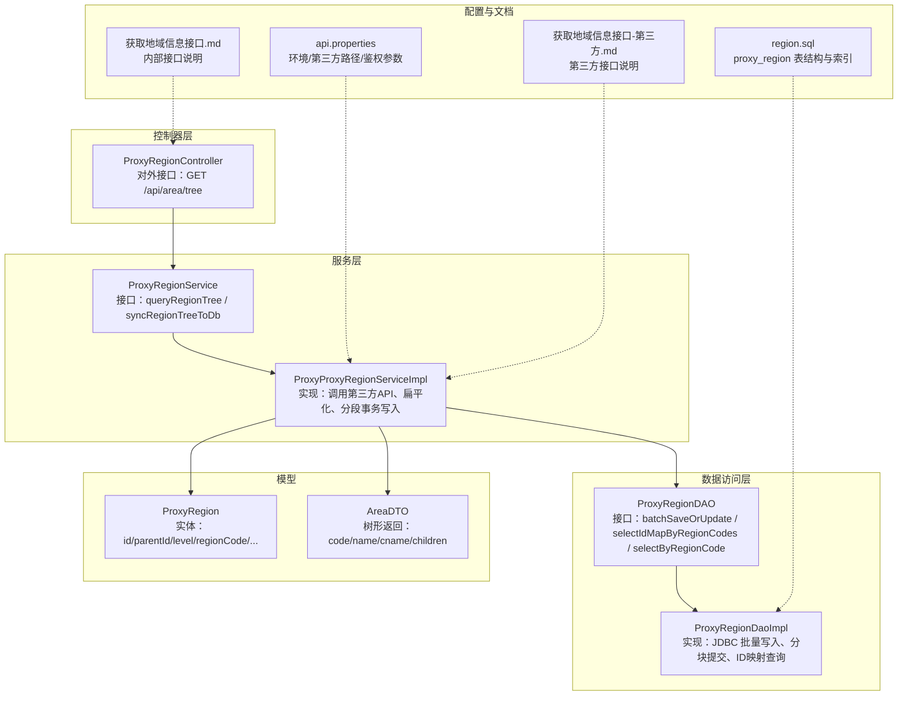
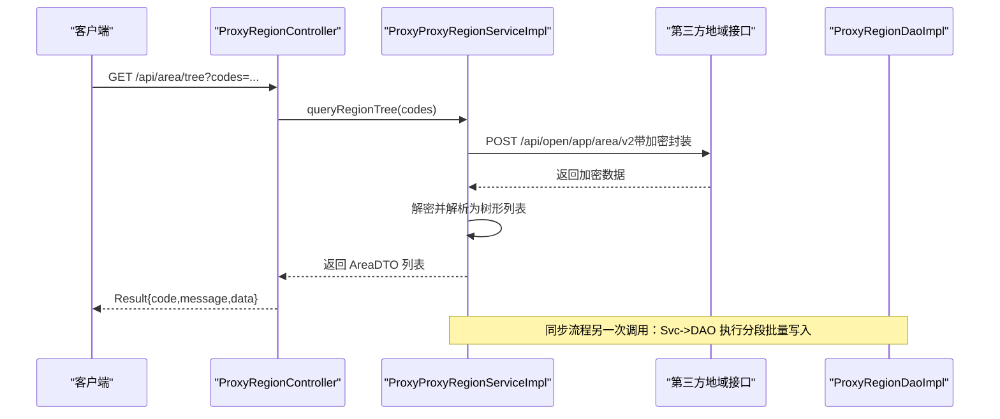
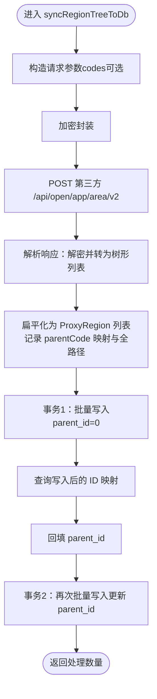
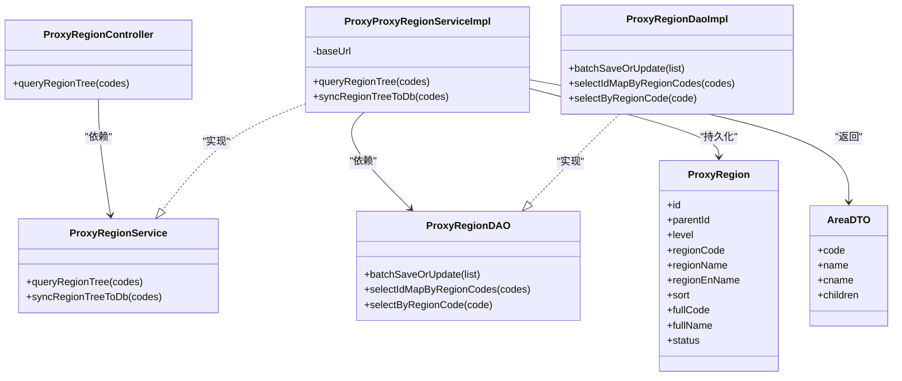

# 区域管理 API

<cite>
**本文引用的文件**
- [ProxyRegionController.java](file://src/main/java/cn/linkfast/controller/ProxyRegionController.java)
- [ProxyRegionService.java](file://src/main/java/cn/linkfast/service/ProxyRegionService.java)
- [ProxyProxyRegionServiceImpl.java](file://src/main/java/cn/linkfast/service/impl/ProxyProxyRegionServiceImpl.java)
- [ProxyRegionDAO.java](file://src/main/java/cn/linkfast/dao/ProxyRegionDAO.java)
- [ProxyRegionDaoImpl.java](file://src/main/java/cn/linkfast/dao/impl/ProxyRegionDaoImpl.java)
- [ProxyRegion.java](file://src/main/java/cn/linkfast/entity/ProxyRegion.java)
- [AreaDTO.java](file://src/main/java/cn/linkfast/dto/AreaDTO.java)
- [获取地域信息接口.md](file://docs/api/internal/获取地域信息接口.md)
- [获取地域信息接口-第三方.md](file://docs/api/third-party/获取地域信息接口-第三方.md)
- [region.sql](file://docs/database/region.sql)
- [api.properties](file://src/main/resources/api.properties)
- [ProxyRegionServiceImplTest.java](file://src/test/java/cn/linkfast/service/Impl/ProxyRegionServiceImplTest.java)
- [ProxyRegionIT.java](file://src/test/java/cn/linkfast/service/Impl/ProxyRegionIT.java)
</cite>

## 目录
1. [简介](#简介)
2. [项目结构](#项目结构)
3. [核心组件](#核心组件)
4. [架构总览](#架构总览)
5. [详细组件分析](#详细组件分析)
6. [依赖分析](#依赖分析)
7. [性能考虑](#性能考虑)
8. [故障排查指南](#故障排查指南)
9. [结论](#结论)
10. [附录](#附录)

## 简介
本文件为区域管理模块的完整 API 接口文档，聚焦地理区域信息的查询、获取与管理能力。系统以“洲-国家-州省-城市”四级树形结构组织区域数据，提供如下能力：
- 树形结构查询：支持按区域编码列表进行筛选，或返回全量树
- 第三方同步：从外部“获取地域信息接口”拉取并落库，支持全量与增量同步
- 数据模型：统一的实体与 DTO，便于前后端交互与扩展
- 数据库设计：针对层级、父子关系与全路径编码建立索引，支撑高效查询
- 集成测试：提供单元与集成测试样例，验证树形查询与同步流程

## 项目结构
围绕区域管理的核心文件与职责如下：
- 控制器层：对外暴露查询接口，封装返回结构
- 服务层：定义查询与同步接口，实现业务逻辑
- 数据访问层：封装批量写入、ID 映射与按编码查询
- 实体与 DTO：描述区域节点与树形返回结构
- 文档与配置：内部与第三方接口文档、环境与路径配置
- 测试：覆盖查询与同步的测试用例

图表来源
- [ProxyRegionController.java:19-35](file://src/main/java/cn/linkfast/controller/ProxyRegionController.java#L19-L35)
- [ProxyRegionService.java:10-21](file://src/main/java/cn/linkfast/service/ProxyRegionService.java#L10-L21)
- [ProxyProxyRegionServiceImpl.java:30-154](file://src/main/java/cn/linkfast/service/impl/ProxyProxyRegionServiceImpl.java#L30-L154)
- [ProxyRegionDAO.java:11-36](file://src/main/java/cn/linkfast/dao/ProxyRegionDAO.java#L11-L36)
- [ProxyRegionDaoImpl.java:27-153](file://src/main/java/cn/linkfast/dao/impl/ProxyRegionDaoImpl.java#L27-L153)
- [ProxyRegion.java:14-31](file://src/main/java/cn/linkfast/entity/ProxyRegion.java#L14-L31)
- [AreaDTO.java:13-36](file://src/main/java/cn/linkfast/dto/AreaDTO.java#L13-L36)
- [api.properties:1-31](file://src/main/resources/api.properties#L1-L31)
- [获取地域信息接口.md:1-109](file://docs/api/internal/获取地域信息接口.md#L1-L109)
- [获取地域信息接口-第三方.md:1-30](file://docs/api/third-party/获取地域信息接口-第三方.md#L1-L30)
- [region.sql:1-20](file://docs/database/region.sql#L1-L20)

章节来源
- [ProxyRegionController.java:19-35](file://src/main/java/cn/linkfast/controller/ProxyRegionController.java#L19-L35)
- [ProxyRegionService.java:10-21](file://src/main/java/cn/linkfast/service/ProxyRegionService.java#L10-L21)
- [ProxyProxyRegionServiceImpl.java:30-154](file://src/main/java/cn/linkfast/service/impl/ProxyProxyRegionServiceImpl.java#L30-L154)
- [ProxyRegionDAO.java:11-36](file://src/main/java/cn/linkfast/dao/ProxyRegionDAO.java#L11-L36)
- [ProxyRegionDaoImpl.java:27-153](file://src/main/java/cn/linkfast/dao/impl/ProxyRegionDaoImpl.java#L27-L153)
- [ProxyRegion.java:14-31](file://src/main/java/cn/linkfast/entity/ProxyRegion.java#L14-L31)
- [AreaDTO.java:13-36](file://src/main/java/cn/linkfast/dto/AreaDTO.java#L13-L36)
- [api.properties:1-31](file://src/main/resources/api.properties#L1-L31)
- [获取地域信息接口.md:1-109](file://docs/api/internal/获取地域信息接口.md#L1-L109)
- [获取地域信息接口-第三方.md:1-30](file://docs/api/third-party/获取地域信息接口-第三方.md#L1-L30)
- [region.sql:1-20](file://docs/database/region.sql#L1-L20)

## 核心组件
- 控制器：提供树形查询接口，接收可选的区域编码列表参数，返回统一结果包装
- 服务接口：定义树形查询与第三方同步接口
- 服务实现：封装第三方 API 调用、加密封装、响应解析、树形扁平化、分段事务写入
- DAO 接口与实现：提供批量保存/更新、按编码映射 ID、按编码查询
- 实体与 DTO：统一描述区域节点与树形返回结构
- 配置：环境切换、第三方基础 URL 与路径、鉴权参数
- 文档：内部与第三方接口说明、数据库表结构与索引

章节来源
- [ProxyRegionController.java:19-35](file://src/main/java/cn/linkfast/controller/ProxyRegionController.java#L19-L35)
- [ProxyRegionService.java:10-21](file://src/main/java/cn/linkfast/service/ProxyRegionService.java#L10-L21)
- [ProxyProxyRegionServiceImpl.java:30-154](file://src/main/java/cn/linkfast/service/impl/ProxyProxyRegionServiceImpl.java#L30-L154)
- [ProxyRegionDAO.java:11-36](file://src/main/java/cn/linkfast/dao/ProxyRegionDAO.java#L11-L36)
- [ProxyRegionDaoImpl.java:27-153](file://src/main/java/cn/linkfast/dao/impl/ProxyRegionDaoImpl.java#L27-L153)
- [ProxyRegion.java:14-31](file://src/main/java/cn/linkfast/entity/ProxyRegion.java#L14-L31)
- [AreaDTO.java:13-36](file://src/main/java/cn/linkfast/dto/AreaDTO.java#L13-L36)
- [api.properties:1-31](file://src/main/resources/api.properties#L1-L31)
- [获取地域信息接口.md:1-109](file://docs/api/internal/获取地域信息接口.md#L1-L109)
- [获取地域信息接口-第三方.md:1-30](file://docs/api/third-party/获取地域信息接口-第三方.md#L1-L30)
- [region.sql:1-20](file://docs/database/region.sql#L1-L20)

## 架构总览
系统采用典型的分层架构：Web 控制器负责请求接入与结果封装；服务层负责业务编排与第三方集成；DAO 层负责数据库操作；模型层承载数据结构。

图表来源
- [ProxyRegionController.java:30-35](file://src/main/java/cn/linkfast/controller/ProxyRegionController.java#L30-L35)
- [ProxyProxyRegionServiceImpl.java:63-86](file://src/main/java/cn/linkfast/service/impl/ProxyProxyRegionServiceImpl.java#L63-L86)
- [ProxyRegionDaoImpl.java:37-52](file://src/main/java/cn/linkfast/dao/impl/ProxyRegionDaoImpl.java#L37-L52)
- [获取地域信息接口.md:1-109](file://docs/api/internal/获取地域信息接口.md#L1-L109)
- [获取地域信息接口-第三方.md:1-30](file://docs/api/third-party/获取地域信息接口-第三方.md#L1-L30)

## 详细组件分析

### 控制器：树形查询接口
- 接口路径：/api/area/tree
- 方法：GET
- 参数：
  - codes：字符串数组，可选；不传则返回全部地域树
- 返回：统一结果包装，data 为树形列表（AreaDTO）

章节来源
- [ProxyRegionController.java:19-35](file://src/main/java/cn/linkfast/controller/ProxyRegionController.java#L19-L35)
- [获取地域信息接口.md:7-23](file://docs/api/internal/获取地域信息接口.md#L7-L23)

### 服务接口与实现
- 服务接口定义：
  - queryRegionTree：按编码列表查询树形结构
  - syncRegionTreeToDb：从第三方接口同步树到本地数据库
- 实现要点：
  - 环境初始化：根据配置选择沙盒或生产基础 URL
  - 请求封装：对请求参数进行加密封装后发送
  - 响应处理：校验状态码、解密并反序列化为树形列表
  - 扁平化：将树形结构展平为实体列表，记录父子关系与全路径
  - 分段事务：先写入临时 parent_id=0，再查询 ID 并回填 parent_id，两次 upsert 保证一致性
  - 批量写入：DAO 层分块提交，避免长事务与网络超时

图表来源
- [ProxyProxyRegionServiceImpl.java:88-154](file://src/main/java/cn/linkfast/service/impl/ProxyProxyRegionServiceImpl.java#L88-L154)
- [ProxyRegionDaoImpl.java:37-52](file://src/main/java/cn/linkfast/dao/impl/ProxyRegionDaoImpl.java#L37-L52)

章节来源
- [ProxyRegionService.java:10-21](file://src/main/java/cn/linkfast/service/ProxyRegionService.java#L10-L21)
- [ProxyProxyRegionServiceImpl.java:30-154](file://src/main/java/cn/linkfast/service/impl/ProxyProxyRegionServiceImpl.java#L30-L154)

### 数据访问层：批量写入与 ID 映射
- 批量保存/更新：
  - 使用 INSERT ... ON DUPLICATE KEY UPDATE
  - 分块大小固定，避免一次性提交过大导致通信超时
  - 返回值按成功计数，兼容不同数据库驱动行为
- ID 映射查询：
  - 将 region_code 列表分块查询，构建 code->id 映射
- 按编码查询：
  - 提供按 region_code 查询单条记录的能力

章节来源
- [ProxyRegionDAO.java:11-36](file://src/main/java/cn/linkfast/dao/ProxyRegionDAO.java#L11-L36)
- [ProxyRegionDaoImpl.java:27-153](file://src/main/java/cn/linkfast/dao/impl/ProxyRegionDaoImpl.java#L27-L153)

### 数据模型：实体与 DTO
- 实体 ProxyRegion
  - 字段：id、parentId、level、regionCode、regionName、regionEnName、sort、fullCode、fullName、status、createTime、updateTime
  - 用途：持久化存储，支持层级、父子关系与全路径
- DTO AreaDTO
  - 字段：code、name、cname、children
  - 用途：对外返回树形结构，支持递归嵌套

章节来源
- [ProxyRegion.java:14-31](file://src/main/java/cn/linkfast/entity/ProxyRegion.java#L14-L31)
- [AreaDTO.java:13-36](file://src/main/java/cn/linkfast/dto/AreaDTO.java#L13-L36)

### 数据库设计：proxy_region
- 主键与唯一索引：id（自增）、uk_region_code（唯一）
- 索引策略：
  - idx_parent_id：加速查询某父节点下的子节点
  - idx_level：加速按层级查询
  - idx_level_parent_id：优化级联查询（核心）
  - idx_full_code：按全路径快速检索
- 层级含义：level=1 洲，2 国家，3 州/省，4 城市

章节来源
- [region.sql:1-20](file://docs/database/region.sql#L1-L20)

### 配置与第三方接口
- 环境与路径：
  - api.ipv.env：sandbox 或 prod
  - api.ipv.sandbox_url / api.ipv.prod_url：基础 URL
  - api.ipv.path.area_list：第三方地域接口路径
- 第三方接口：
  - 请求路径：/api/open/app/area/v2
  - 参数：codes（可选，数组）
  - 返回：树形节点（code/name/cname/children）

章节来源
- [api.properties:1-31](file://src/main/resources/api.properties#L1-L31)
- [获取地域信息接口-第三方.md:1-30](file://docs/api/third-party/获取地域信息接口-第三方.md#L1-L30)

### 测试与验证
- 单元测试：
  - 覆盖不传 codes 与传入 codes 的两种场景
  - 输出格式化 JSON，便于观察树形结构
- 集成测试：
  - 真实请求第三方接口并写入本地数据库
  - 不使用事务回滚，验证真实落库效果
  - 支持全量与按 codes 同步

章节来源
- [ProxyRegionServiceImplTest.java:26-66](file://src/test/java/cn/linkfast/service/Impl/ProxyRegionServiceImplTest.java#L26-L66)
- [ProxyRegionIT.java:48-85](file://src/test/java/cn/linkfast/service/Impl/ProxyRegionIT.java#L48-L85)

## 依赖分析
- 控制器依赖服务接口
- 服务实现依赖 DAO 接口、第三方工具与配置
- DAO 实现依赖 JDBC 模板与数据库
- 模型之间通过 DTO 与实体相互映射

图表来源
- [ProxyRegionController.java:19-35](file://src/main/java/cn/linkfast/controller/ProxyRegionController.java#L19-L35)
- [ProxyRegionService.java:10-21](file://src/main/java/cn/linkfast/service/ProxyRegionService.java#L10-L21)
- [ProxyProxyRegionServiceImpl.java:30-154](file://src/main/java/cn/linkfast/service/impl/ProxyProxyRegionServiceImpl.java#L30-L154)
- [ProxyRegionDAO.java:11-36](file://src/main/java/cn/linkfast/dao/ProxyRegionDAO.java#L11-L36)
- [ProxyRegionDaoImpl.java:27-153](file://src/main/java/cn/linkfast/dao/impl/ProxyRegionDaoImpl.java#L27-L153)
- [ProxyRegion.java:14-31](file://src/main/java/cn/linkfast/entity/ProxyRegion.java#L14-L31)
- [AreaDTO.java:13-36](file://src/main/java/cn/linkfast/dto/AreaDTO.java#L13-L36)

## 性能考虑
- 批量写入分块：
  - DAO 层将批量操作拆分为固定大小的块，降低单次提交耗时与网络中断风险
- 事务分段：
  - 先写入占位 parent_id=0，再回填 parent_id，两次 upsert 减少锁竞争与长事务占用
- 索引优化：
  - 为父节点、层级、层级+父节点、全路径建立索引，提升查询与级联效率
- 环境与超时：
  - 根据环境选择基础 URL；注意第三方与数据库的超时配置，避免长时间阻塞
- 缓存建议（最佳实践）：
  - 前端可缓存树形结构与常用编码映射
  - 服务端可对热点区域进行内存缓存，设置 TTL 与失效策略
  - 结合版本号或时间戳实现缓存失效与灰度更新

章节来源
- [ProxyRegionDaoImpl.java:37-52](file://src/main/java/cn/linkfast/dao/impl/ProxyRegionDaoImpl.java#L37-L52)
- [ProxyProxyRegionServiceImpl.java:117-154](file://src/main/java/cn/linkfast/service/impl/ProxyProxyRegionServiceImpl.java#L117-L154)
- [region.sql:1-20](file://docs/database/region.sql#L1-L20)

## 故障排查指南
- 第三方接口异常：
  - 检查环境配置与 appKey/appSecret 是否正确
  - 关注响应状态码与错误消息，必要时重试或降级
- 同步失败：
  - 确认网络可达性与超时设置
  - 观察日志中“找不到 parentId”的警告，检查上游数据是否完整
- 数据库写入问题：
  - 确认唯一索引 uk_region_code 是否冲突
  - 检查分块大小与事务隔离级别，避免死锁
- 前端显示异常：
  - 核对返回的树形结构字段与层级映射
  - 若出现重复 regionCode，需在上游清洗或去重

章节来源
- [ProxyProxyRegionServiceImpl.java:83-85](file://src/main/java/cn/linkfast/service/impl/ProxyProxyRegionServiceImpl.java#L83-L85)
- [ProxyProxyRegionServiceImpl.java:140-147](file://src/main/java/cn/linkfast/service/impl/ProxyProxyRegionServiceImpl.java#L140-L147)
- [ProxyRegionDaoImpl.java:54-101](file://src/main/java/cn/linkfast/dao/impl/ProxyRegionDaoImpl.java#L54-L101)
- [api.properties:1-31](file://src/main/resources/api.properties#L1-L31)

## 结论
该区域管理模块以清晰的分层设计实现了树形区域数据的查询与同步。通过第三方接口与本地数据库的配合，结合批量写入与分段事务，保障了大规模数据的稳定落库。配合完善的索引与配置管理，系统具备良好的扩展性与可维护性。建议在生产环境中进一步完善缓存、监控与版本管理机制，确保高并发与实时更新场景下的稳定性。

## 附录

### API 定义与示例
- 接口：GET /api/area/tree
- 参数：
  - codes：可选，字符串数组
- 返回：统一结果包装，data 为树形列表（AreaDTO）

章节来源
- [获取地域信息接口.md:7-23](file://docs/api/internal/获取地域信息接口.md#L7-L23)

### 数据模型与索引
- 实体字段：id、parentId、level、regionCode、regionName、regionEnName、sort、fullCode、fullName、status、createTime、updateTime
- 索引：唯一索引（region_code），以及多处辅助索引（父节点、层级、层级+父节点、全路径）

章节来源
- [ProxyRegion.java:14-31](file://src/main/java/cn/linkfast/entity/ProxyRegion.java#L14-L31)
- [region.sql:1-20](file://docs/database/region.sql#L1-L20)

### 同步流程与最佳实践
- 同步步骤：请求第三方 -> 解密解析 -> 扁平化 -> 分段事务写入 -> 回填 parent_id
- 最佳实践：分块提交、事务拆分、缓存与版本控制、监控与告警

章节来源
- [ProxyProxyRegionServiceImpl.java:88-154](file://src/main/java/cn/linkfast/service/impl/ProxyProxyRegionServiceImpl.java#L88-L154)
- [ProxyRegionDaoImpl.java:37-52](file://src/main/java/cn/linkfast/dao/impl/ProxyRegionDaoImpl.java#L37-L52)