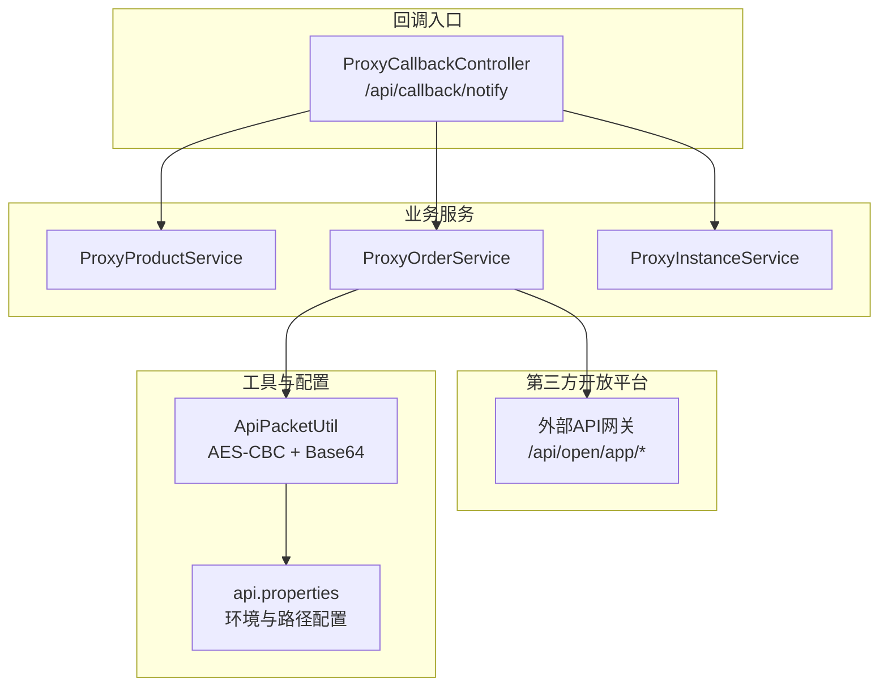
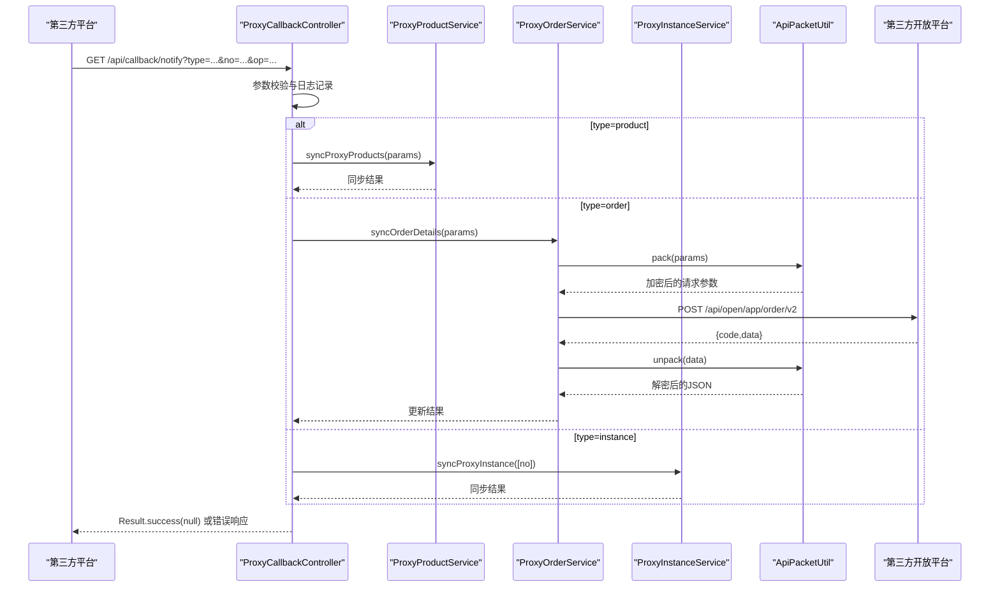
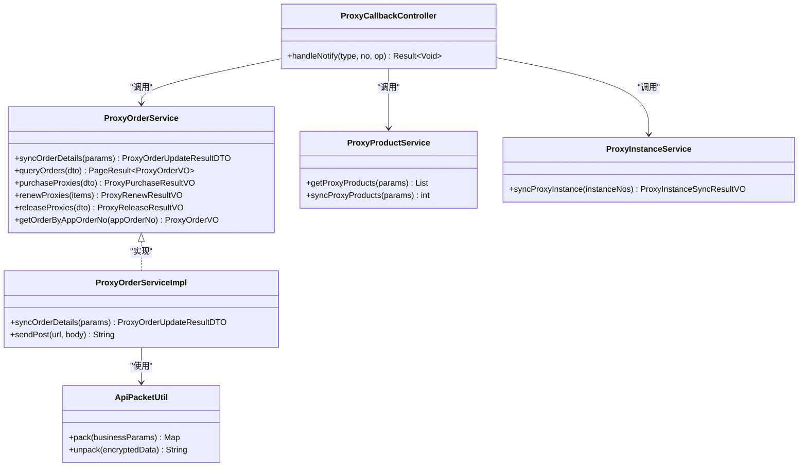
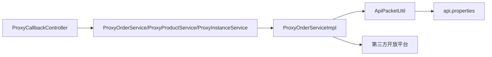

# 回调通知 API

<cite>
**本文引用的文件**
- [ProxyCallbackController.java](file://src/main/java/cn/linkfast/controller/ProxyCallbackController.java)
- [ProxyOrderServiceImpl.java](file://src/main/java/cn/linkfast/service/impl/ProxyOrderServiceImpl.java)
- [ApiPacketUtil.java](file://src/main/java/cn/linkfast/utils/ApiPacketUtil.java)
- [ProxyOrderUpdateResultDTO.java](file://src/main/java/cn/linkfast/dto/ProxyOrderUpdateResultDTO.java)
- [ProxyOrderService.java](file://src/main/java/cn/linkfast/service/ProxyOrderService.java)
- [ProxyInstanceService.java](file://src/main/java/cn/linkfast/service/ProxyInstanceService.java)
- [ProxyProductService.java](file://src/main/java/cn/linkfast/service/ProxyProductService.java)
- [ProxyInstanceSyncResultVO.java](file://src/main/java/cn/linkfast/vo/ProxyInstanceSyncResultVO.java)
- [api.properties](file://src/main/resources/api.properties)
- [ProxyCallbackControllerIT.java](file://src/test/java/cn/linkfast/controller/ProxyCallbackControllerIT.java)
</cite>

## 目录
1. [简介](#简介)
2. [项目结构](#项目结构)
3. [核心组件](#核心组件)
4. [架构总览](#架构总览)
5. [详细组件分析](#详细组件分析)
6. [依赖分析](#依赖分析)
7. [性能考虑](#性能考虑)
8. [故障排查指南](#故障排查指南)
9. [结论](#结论)
10. [附录](#附录)

## 简介
本文件面向第三方服务回调通知模块，系统化说明回调接收、验证与处理机制，覆盖订单状态变更、实例状态更新与支付结果通知等场景。文档重点包括：
- 回调地址与参数规范
- 消息格式与签名验证（AES-CBC + Base64）
- 重复回调防护与幂等性保障
- 异步处理与消息队列策略建议
- 重试机制与失败处理流程
- 监控、日志与异常告警
- 安全最佳实践（防重放、数据完整性）
- 测试、调试与故障排查指南

## 项目结构
回调通知模块位于控制器层，统一入口为回调控制器；业务处理通过服务层对接第三方开放平台，使用工具类完成报文加解密与参数封装。

图表来源
- [ProxyCallbackController.java:1-95](file://src/main/java/cn/linkfast/controller/ProxyCallbackController.java#L1-L95)
- [ProxyOrderServiceImpl.java:1-782](file://src/main/java/cn/linkfast/service/impl/ProxyOrderServiceImpl.java#L1-L782)
- [ApiPacketUtil.java:1-106](file://src/main/java/cn/linkfast/utils/ApiPacketUtil.java#L1-L106)
- [api.properties:1-31](file://src/main/resources/api.properties#L1-L31)

章节来源
- [ProxyCallbackController.java:1-95](file://src/main/java/cn/linkfast/controller/ProxyCallbackController.java#L1-L95)
- [ProxyOrderServiceImpl.java:1-782](file://src/main/java/cn/linkfast/service/impl/ProxyOrderServiceImpl.java#L1-L782)
- [ApiPacketUtil.java:1-106](file://src/main/java/cn/linkfast/utils/ApiPacketUtil.java#L1-L106)
- [api.properties:1-31](file://src/main/resources/api.properties#L1-L31)

## 核心组件
- 回调统一入口控制器：接收第三方回调，按 type 分发至不同业务处理。
- 订单同步服务：向第三方查询订单详情并落库，处理响应解密与异常分支。
- 产品与实例同步服务：按需触发产品/实例的同步任务。
- 报文加解密工具：统一封装请求参数与响应解密。
- 配置中心：环境切换、第三方接口路径与密钥管理。

章节来源
- [ProxyCallbackController.java:21-95](file://src/main/java/cn/linkfast/controller/ProxyCallbackController.java#L21-L95)
- [ProxyOrderServiceImpl.java:89-136](file://src/main/java/cn/linkfast/service/impl/ProxyOrderServiceImpl.java#L89-L136)
- [ProxyProductService.java:1-28](file://src/main/java/cn/linkfast/service/ProxyProductService.java#L1-L28)
- [ProxyInstanceService.java:1-48](file://src/main/java/cn/linkfast/service/ProxyInstanceService.java#L1-L48)
- [ApiPacketUtil.java:55-106](file://src/main/java/cn/linkfast/utils/ApiPacketUtil.java#L55-L106)
- [api.properties:1-31](file://src/main/resources/api.properties#L1-L31)

## 架构总览
回调通知的整体处理链路如下：

图表来源
- [ProxyCallbackController.java:42-94](file://src/main/java/cn/linkfast/controller/ProxyCallbackController.java#L42-L94)
- [ProxyOrderServiceImpl.java:91-136](file://src/main/java/cn/linkfast/service/impl/ProxyOrderServiceImpl.java#L91-L136)
- [ApiPacketUtil.java:58-92](file://src/main/java/cn/linkfast/utils/ApiPacketUtil.java#L58-L92)
- [api.properties:14-31](file://src/main/resources/api.properties#L14-L31)

## 详细组件分析

### 回调统一入口：ProxyCallbackController
- 接口路径：/api/callback/notify
- 方法：GET
- 参数：
  - type：变更类型，支持 product、order、instance
  - no：变更编号（产品编号/订单编号/实例编号）
  - op：操作类型（如 update、add），实例回调不携带该参数
- 处理逻辑：
  - 仅处理产品、订单、实例三类回调；
  - 订单回调会调用服务层向第三方查询订单详情并落库；
  - 产品回调触发产品同步；
  - 实例回调触发实例同步；
  - 统一返回 Result.success(null)，确保第三方收到成功响应。

章节来源
- [ProxyCallbackController.java:34-94](file://src/main/java/cn/linkfast/controller/ProxyCallbackController.java#L34-L94)

### 订单同步处理：ProxyOrderService.syncOrderDetails
- 功能：根据订单号从第三方查询订单详情，解密并落库，返回更新统计。
- 关键步骤：
  - 组装请求 URL 与业务参数；
  - 调用工具类进行参数加密；
  - 发送请求并解析响应；
  - 解密 data 字段为 JSON；
  - 补全实例本地字段（如 appOrderNo、orderId、userId、unit、duration 等）；
  - 事务内批量更新订单与实例数据，返回更新行数统计。
- 返回值：ProxyOrderUpdateResultDTO，包含订单主表、明细表与实例表的更新行数。

章节来源
- [ProxyOrderServiceImpl.java:89-136](file://src/main/java/cn/linkfast/service/impl/ProxyOrderServiceImpl.java#L89-L136)
- [ProxyOrderUpdateResultDTO.java:1-39](file://src/main/java/cn/linkfast/dto/ProxyOrderUpdateResultDTO.java#L1-L39)

### 报文加解密：ApiPacketUtil
- 加密方式：AES-CBC + Base64
- 请求封装：统一添加版本、加密方式、appKey、reqId 等公共字段
- 响应解密：对 data 字段进行 Base64 解码与 AES-CBC 解密
- 配置来源：从 api.properties 读取环境、appKey、appSecret 与接口路径

章节来源
- [ApiPacketUtil.java:55-106](file://src/main/java/cn/linkfast/utils/ApiPacketUtil.java#L55-L106)
- [api.properties:1-31](file://src/main/resources/api.properties#L1-L31)

### 实例与产品同步
- 产品同步：根据产品编号与代理类型集合触发同步
- 实例同步：根据实例编号列表触发同步，返回预期更新数与实际更新数

章节来源
- [ProxyCallbackController.java:49-89](file://src/main/java/cn/linkfast/controller/ProxyCallbackController.java#L49-L89)
- [ProxyProductService.java:17-22](file://src/main/java/cn/linkfast/service/ProxyProductService.java#L17-L22)
- [ProxyInstanceService.java:16-22](file://src/main/java/cn/linkfast/service/ProxyInstanceService.java#L16-L22)
- [ProxyInstanceSyncResultVO.java:1-19](file://src/main/java/cn/linkfast/vo/ProxyInstanceSyncResultVO.java#L1-L19)

### 类关系图（代码级）

图表来源
- [ProxyCallbackController.java:28-32](file://src/main/java/cn/linkfast/controller/ProxyCallbackController.java#L28-L32)
- [ProxyOrderService.java:15-61](file://src/main/java/cn/linkfast/service/ProxyOrderService.java#L15-L61)
- [ProxyOrderServiceImpl.java:37-45](file://src/main/java/cn/linkfast/service/impl/ProxyOrderServiceImpl.java#L37-L45)
- [ApiPacketUtil.java:20-36](file://src/main/java/cn/linkfast/utils/ApiPacketUtil.java#L20-L36)
- [ProxyProductService.java:15-28](file://src/main/java/cn/linkfast/service/ProxyProductService.java#L15-L28)
- [ProxyInstanceService.java:14-48](file://src/main/java/cn/linkfast/service/ProxyInstanceService.java#L14-L48)

## 依赖分析
- 控制器依赖服务接口，服务实现依赖工具类与第三方接口路径配置
- 订单同步流程依赖 AES-CBC 解密与 JSON 解析
- 配置集中于 api.properties，支持沙盒与生产环境切换

图表来源
- [ProxyCallbackController.java:28-32](file://src/main/java/cn/linkfast/controller/ProxyCallbackController.java#L28-L32)
- [ProxyOrderServiceImpl.java:37-45](file://src/main/java/cn/linkfast/service/impl/ProxyOrderServiceImpl.java#L37-L45)
- [ApiPacketUtil.java:24-53](file://src/main/java/cn/linkfast/utils/ApiPacketUtil.java#L24-L53)
- [api.properties:1-31](file://src/main/resources/api.properties#L1-L31)

章节来源
- [ProxyOrderServiceImpl.java:37-45](file://src/main/java/cn/linkfast/service/impl/ProxyOrderServiceImpl.java#L37-L45)
- [ApiPacketUtil.java:24-53](file://src/main/java/cn/linkfast/utils/ApiPacketUtil.java#L24-L53)
- [api.properties:1-31](file://src/main/resources/api.properties#L1-L31)

## 性能考虑
- 异步处理：服务层在部分场景使用异步线程池更新产品库存，避免阻塞主流程
- 批量更新：订单同步阶段一次性查询并批量更新，减少数据库往返
- 缓存与重试：建议在网关层引入轻量缓存与指数退避重试，降低第三方抖动影响
- 日志与指标：建议埋点记录回调耗时、解密耗时、重试次数与失败原因，便于容量规划与问题定位

## 故障排查指南
- 回调未生效
  - 检查回调地址是否正确暴露，参数是否包含 type/no/op
  - 查看控制器日志，确认分发逻辑是否命中对应类型
- 订单同步失败
  - 检查第三方响应是否为 200，data 是否存在且非空
  - 核对 AES 密钥与 IV 配置，确认解密是否成功
  - 关注异常分支：连接失败、响应为空、JSON 非法、解密失败等
- 重复回调导致脏写
  - 当前实现以“成功响应”作为幂等信号；建议在业务层增加去重标记（如回调唯一标识）与幂等检查
- 测试验证
  - 可参考集成测试用例，构造订单回调参数并断言响应与数据库一致性

章节来源
- [ProxyCallbackControllerIT.java:48-77](file://src/test/java/cn/linkfast/controller/ProxyCallbackControllerIT.java#L48-L77)
- [ProxyOrderServiceImpl.java:343-451](file://src/main/java/cn/linkfast/service/impl/ProxyOrderServiceImpl.java#L343-L451)
- [ProxyOrderServiceImpl.java:521-634](file://src/main/java/cn/linkfast/service/impl/ProxyOrderServiceImpl.java#L521-L634)
- [ProxyOrderServiceImpl.java:637-779](file://src/main/java/cn/linkfast/service/impl/ProxyOrderServiceImpl.java#L637-L779)

## 结论
回调通知模块通过统一入口与清晰的分发逻辑，实现了对产品、订单与实例三类变更的自动化处理。结合 AES-CBC 加解密与严格的异常分支处理，系统在安全性与稳定性方面具备良好基础。建议进一步完善重复回调防护与消息队列异步化策略，以提升吞吐与可靠性。

## 附录

### 接口定义与参数规范
- 接口路径：/api/callback/notify
- 方法：GET
- 参数：
  - type：变更类型（product/order/instance）
  - no：变更编号（产品编号/订单编号/实例编号）
  - op：操作类型（如 update、add），实例回调不携带该参数
- 返回：
  - 成功：Result.success(null)
  - 失败：Result.error(...)，并记录错误日志

章节来源
- [ProxyCallbackController.java:34-94](file://src/main/java/cn/linkfast/controller/ProxyCallbackController.java#L34-L94)

### 消息格式与签名验证
- 请求封装：ApiPacketUtil.pack 将业务参数序列化为 JSON，AES-CBC 加密并 Base64 编码，附加版本、加密方式、appKey、reqId
- 响应解密：ApiPacketUtil.unpack 对 data 字段进行 Base64 解码与 AES-CBC 解密
- 配置来源：api.properties 中的环境、appKey、appSecret 与接口路径

章节来源
- [ApiPacketUtil.java:58-106](file://src/main/java/cn/linkfast/utils/ApiPacketUtil.java#L58-L106)
- [api.properties:1-31](file://src/main/resources/api.properties#L1-L31)

### 重复处理防护与幂等性
- 当前幂等依据：第三方回调成功即视为幂等，避免重复处理
- 建议增强：在业务层引入回调唯一标识（如 reqId 或回调流水号）与去重表，确保多次回调不重复写入

### 异步处理与消息队列
- 现状：服务层在库存更新等场景使用异步线程池
- 建议：将回调处理纳入消息队列（如 RabbitMQ/Kafka），实现削峰填谷与重试容错

### 重试机制与失败处理
- 订单/续费/释放等对外请求均内置最多 3 次重试，连接失败可安全回滚，响应读取失败则抛出不可回滚异常
- 建议：在网关层统一接入指数退避与熔断降级，避免雪崩

### 监控、日志与异常告警
- 日志：控制器与服务层均输出详细日志，包含请求参数、响应内容与异常堆栈
- 建议：接入统一日志平台与告警系统，对回调成功率、耗时与异常进行实时监控

### 安全最佳实践
- 防重放：建议在回调入口增加时间戳校验与签名验证（如 HMAC-SHA256），并限制时间窗口
- 数据完整性：严格校验响应 code、data 存在性与 JSON 合法性
- 密钥管理：密钥与 IV 从配置中心加载，避免硬编码