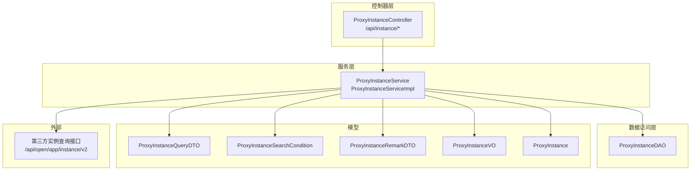
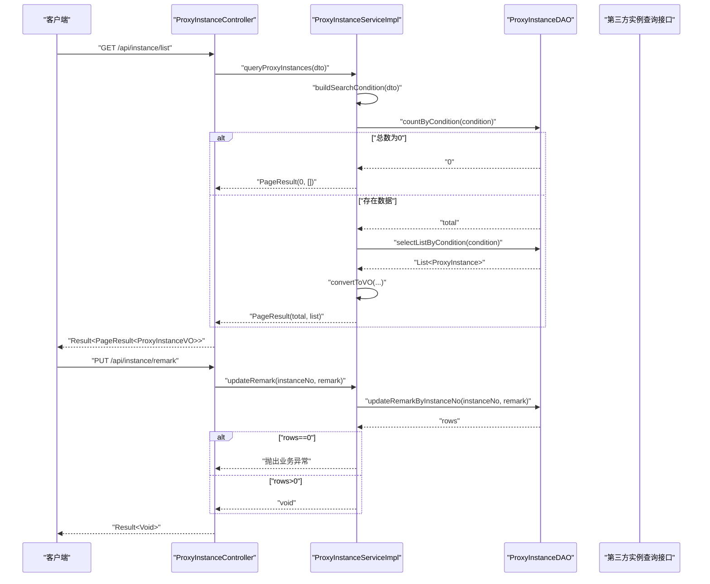
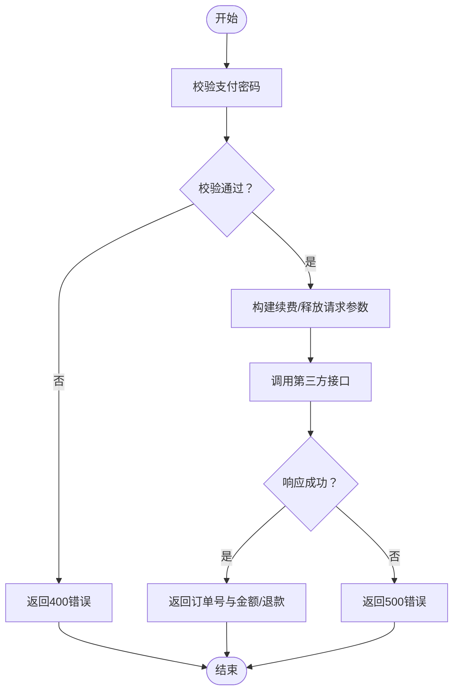
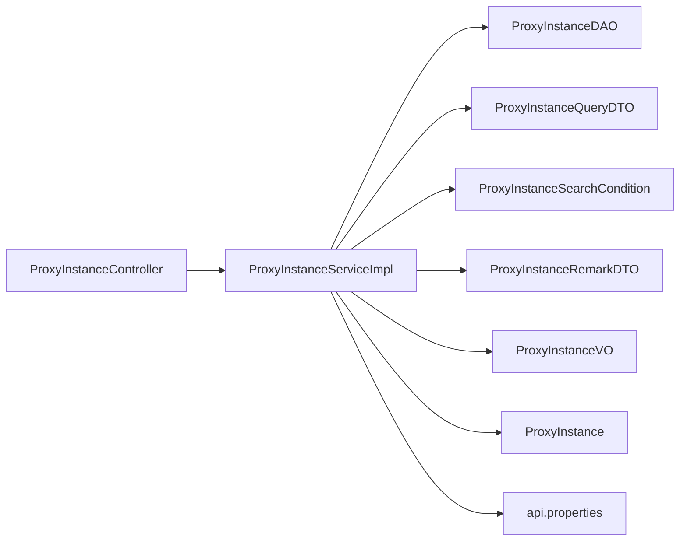

# 实例管理 API

<cite>
**本文引用的文件**
- [ProxyInstanceController.java](file://src/main/java/cn/linkfast/controller/ProxyInstanceController.java)
- [ProxyInstanceService.java](file://src/main/java/cn/linkfast/service/ProxyInstanceService.java)
- [ProxyInstanceServiceImpl.java](file://src/main/java/cn/linkfast/service/impl/ProxyInstanceServiceImpl.java)
- [ProxyInstanceDAO.java](file://src/main/java/cn/linkfast/dao/ProxyInstanceDAO.java)
- [ProxyInstanceQueryDTO.java](file://src/main/java/cn/linkfast/dto/ProxyInstanceQueryDTO.java)
- [ProxyInstanceSearchCondition.java](file://src/main/java/cn/linkfast/dto/ProxyInstanceSearchCondition.java)
- [ProxyInstanceRemarkDTO.java](file://src/main/java/cn/linkfast/dto/ProxyInstanceRemarkDTO.java)
- [ProxyInstanceVO.java](file://src/main/java/cn/linkfast/vo/ProxyInstanceVO.java)
- [ProxyInstance.java](file://src/main/java/cn/linkfast/entity/ProxyInstance.java)
- [api.properties](file://src/main/resources/api.properties)
- [获取代理实例列表接口.md](file://docs/api/internal/获取代理实例列表接口.md)
- [更新代理实例备注接口.md](file://docs/api/internal/更新代理实例备注接口.md)
- [续费代理实例接口.md](file://docs/api/internal/续费代理实例接口.md)
- [释放代理实例接口.md](file://docs/api/internal/释放代理实例接口.md)
</cite>

## 目录
1. [简介](#简介)
2. [项目结构](#项目结构)
3. [核心组件](#核心组件)
4. [架构总览](#架构总览)
5. [详细组件分析](#详细组件分析)
6. [依赖分析](#依赖分析)
7. [性能考虑](#性能考虑)
8. [故障排查指南](#故障排查指南)
9. [结论](#结论)
10. [附录](#附录)

## 简介
本文件为“实例管理”模块的 API 接口文档，聚焦于代理实例的查询、状态管理与备注更新能力，并结合仓库内现有接口文档，补充续费、释放等业务流程的接口规范与调用方式。文档同时对实例状态定义、生命周期管理、搜索条件与过滤规则、排序选项、批量操作、备注维护机制、健康检查与告警集成、调度与故障转移等主题进行系统化说明，帮助开发者与运维人员快速理解并正确使用实例管理相关接口。

## 项目结构
围绕实例管理的后端实现采用典型的分层架构：
- 控制器层：对外暴露 REST API，负责参数接收与响应封装
- 服务层：编排业务流程，协调 DAO 与第三方接口
- 数据访问层：封装数据库查询与更新
- DTO/VO/Entity：数据传输与展示模型
- 配置资源：第三方接口域名、路径与密钥配置

图表来源
- [ProxyInstanceController.java:1-52](file://src/main/java/cn/linkfast/controller/ProxyInstanceController.java#L1-L52)
- [ProxyInstanceService.java:1-37](file://src/main/java/cn/linkfast/service/ProxyInstanceService.java#L1-L37)
- [ProxyInstanceServiceImpl.java:1-195](file://src/main/java/cn/linkfast/service/impl/ProxyInstanceServiceImpl.java#L1-L195)
- [ProxyInstanceDAO.java:1-47](file://src/main/java/cn/linkfast/dao/ProxyInstanceDAO.java#L1-L47)
- [ProxyInstanceQueryDTO.java:1-60](file://src/main/java/cn/linkfast/dto/ProxyInstanceQueryDTO.java#L1-L60)
- [ProxyInstanceSearchCondition.java:1-53](file://src/main/java/cn/linkfast/dto/ProxyInstanceSearchCondition.java#L1-L53)
- [ProxyInstanceRemarkDTO.java:1-23](file://src/main/java/cn/linkfast/dto/ProxyInstanceRemarkDTO.java#L1-L23)
- [ProxyInstanceVO.java:1-42](file://src/main/java/cn/linkfast/vo/ProxyInstanceVO.java#L1-L42)
- [ProxyInstance.java:1-57](file://src/main/java/cn/linkfast/entity/ProxyInstance.java#L1-L57)
- [api.properties:1-31](file://src/main/resources/api.properties#L1-L31)

章节来源
- [ProxyInstanceController.java:1-52](file://src/main/java/cn/linkfast/controller/ProxyInstanceController.java#L1-L52)
- [ProxyInstanceService.java:1-37](file://src/main/java/cn/linkfast/service/ProxyInstanceService.java#L1-L37)
- [ProxyInstanceServiceImpl.java:1-195](file://src/main/java/cn/linkfast/service/impl/ProxyInstanceServiceImpl.java#L1-L195)
- [ProxyInstanceDAO.java:1-47](file://src/main/java/cn/linkfast/dao/ProxyInstanceDAO.java#L1-L47)
- [ProxyInstanceQueryDTO.java:1-60](file://src/main/java/cn/linkfast/dto/ProxyInstanceQueryDTO.java#L1-L60)
- [ProxyInstanceSearchCondition.java:1-53](file://src/main/java/cn/linkfast/dto/ProxyInstanceSearchCondition.java#L1-L53)
- [ProxyInstanceRemarkDTO.java:1-23](file://src/main/java/cn/linkfast/dto/ProxyInstanceRemarkDTO.java#L1-L23)
- [ProxyInstanceVO.java:1-42](file://src/main/java/cn/linkfast/vo/ProxyInstanceVO.java#L1-L42)
- [ProxyInstance.java:1-57](file://src/main/java/cn/linkfast/entity/ProxyInstance.java#L1-L57)
- [api.properties:1-31](file://src/main/resources/api.properties#L1-L31)

## 核心组件
- 控制器：提供实例列表查询与备注更新两个接口，分别对应 GET /api/instance/list 与 PUT /api/instance/remark
- 服务层：实现分页查询、备注更新、第三方实例同步与响应解析
- DAO 层：提供分页查询、计数、批量更新与备注更新能力
- 模型层：包含查询 DTO、搜索条件、备注 DTO、展示 VO 与实体类
- 配置资源：定义第三方接口域名、路径与密钥

章节来源
- [ProxyInstanceController.java:25-48](file://src/main/java/cn/linkfast/controller/ProxyInstanceController.java#L25-L48)
- [ProxyInstanceService.java:10-35](file://src/main/java/cn/linkfast/service/ProxyInstanceService.java#L10-L35)
- [ProxyInstanceServiceImpl.java:90-158](file://src/main/java/cn/linkfast/service/impl/ProxyInstanceServiceImpl.java#L90-L158)
- [ProxyInstanceDAO.java:11-45](file://src/main/java/cn/linkfast/dao/ProxyInstanceDAO.java#L11-L45)
- [ProxyInstanceQueryDTO.java:14-58](file://src/main/java/cn/linkfast/dto/ProxyInstanceQueryDTO.java#L14-L58)
- [ProxyInstanceSearchCondition.java:11-51](file://src/main/java/cn/linkfast/dto/ProxyInstanceSearchCondition.java#L11-L51)
- [ProxyInstanceRemarkDTO.java:10-22](file://src/main/java/cn/linkfast/dto/ProxyInstanceRemarkDTO.java#L10-L22)
- [ProxyInstanceVO.java:12-41](file://src/main/java/cn/linkfast/vo/ProxyInstanceVO.java#L12-L41)
- [ProxyInstance.java:12-53](file://src/main/java/cn/linkfast/entity/ProxyInstance.java#L12-L53)
- [api.properties:14-31](file://src/main/resources/api.properties#L14-L31)

## 架构总览
实例管理模块通过控制器接收请求，服务层完成参数校验、条件构建、DAO 查询与第三方接口调用，最终以 VO 形式返回给前端。备注更新直接走 DAO 层并返回统一结果包装。

图表来源
- [ProxyInstanceController.java:31-48](file://src/main/java/cn/linkfast/controller/ProxyInstanceController.java#L31-L48)
- [ProxyInstanceServiceImpl.java:90-158](file://src/main/java/cn/linkfast/service/impl/ProxyInstanceServiceImpl.java#L90-L158)
- [ProxyInstanceDAO.java:27-44](file://src/main/java/cn/linkfast/dao/ProxyInstanceDAO.java#L27-L44)

## 详细组件分析

### 接口一：实例列表查询（分页）
- 接口路径：/api/instance/list
- 方法：GET
- 功能：分页查询代理实例列表，支持多维过滤与模糊匹配
- 请求参数（Query）
  - pageNum：必填，≥1
  - pageSize：必填，1≤pageSize≤100
  - proxyType：可选，数组，支持多值
  - status：可选，整型状态码
  - countryCode：可选，国家代码
  - cityCode：可选，城市代码
  - ip：可选，IP 地址（模糊匹配）

- 返回结构
  - 外层 Result：code、message、data
  - data：PageResult
    - total、totalPages、pageNum、pageSize、list
  - list：ProxyInstanceVO 数组，包含 ip、port、regionId、regionName、status、username、pwd、instanceNo、renew、orderNo、productNo、unit、duration、userExpired、remark、createTime 等字段

- 分页与排序
  - 分页：基于 pageNum 与 pageSize 计算 offset，limit=pageSize
  - 排序：当前实现未显式指定排序字段，遵循数据库默认顺序或索引顺序

- 过滤规则
  - proxyType 支持多值过滤
  - status 精确过滤
  - countryCode/cityCode 精确过滤
  - ip 支持模糊匹配

- 复杂度与性能
  - 查询复杂度主要受数据库索引影响；建议在常用过滤字段（如 instanceNo、status、countryCode、cityCode、ip）建立合适索引
  - pageSize 上限为 100，避免一次性返回过多数据

- 错误处理
  - 参数校验失败：返回 400
  - 服务器异常：返回 500

章节来源
- [ProxyInstanceController.java:31-36](file://src/main/java/cn/linkfast/controller/ProxyInstanceController.java#L31-L36)
- [ProxyInstanceServiceImpl.java:90-126](file://src/main/java/cn/linkfast/service/impl/ProxyInstanceServiceImpl.java#L90-L126)
- [ProxyInstanceServiceImpl.java:128-150](file://src/main/java/cn/linkfast/service/impl/ProxyInstanceServiceImpl.java#L128-L150)
- [ProxyInstanceDAO.java:27-35](file://src/main/java/cn/linkfast/dao/ProxyInstanceDAO.java#L27-L35)
- [ProxyInstanceQueryDTO.java:19-58](file://src/main/java/cn/linkfast/dto/ProxyInstanceQueryDTO.java#L19-L58)
- [ProxyInstanceSearchCondition.java:19-51](file://src/main/java/cn/linkfast/dto/ProxyInstanceSearchCondition.java#L19-L51)
- [ProxyInstanceVO.java:17-41](file://src/main/java/cn/linkfast/vo/ProxyInstanceVO.java#L17-L41)
- [获取代理实例列表接口.md:14-135](file://docs/api/internal/获取代理实例列表接口.md#L14-L135)

### 接口二：更新实例备注
- 接口路径：/api/instance/remark
- 方法：PUT
- 功能：更新指定实例的备注；remark 为空字符串表示清空备注
- 请求体
  - instanceNo：必填，平台实例编号
  - remark：可选，备注内容

- 返回结构
  - 成功：Result<Void>，data 为 null
  - 参数校验失败：返回 400
  - 实例不存在：返回 400

- 错误处理
  - instanceNo 为空：参数校验失败
  - updateRemarkByInstanceNo 返回 0：抛出业务异常提示“实例不存在”

- 批量能力
  - 当前接口为单实例备注更新；批量更新可通过扩展服务层方法实现

章节来源
- [ProxyInstanceController.java:44-48](file://src/main/java/cn/linkfast/controller/ProxyInstanceController.java#L44-L48)
- [ProxyInstanceServiceImpl.java:152-158](file://src/main/java/cn/linkfast/service/impl/ProxyInstanceServiceImpl.java#L152-L158)
- [ProxyInstanceDAO.java:40-44](file://src/main/java/cn/linkfast/dao/ProxyInstanceDAO.java#L40-L44)
- [ProxyInstanceRemarkDTO.java:14-22](file://src/main/java/cn/linkfast/dto/ProxyInstanceRemarkDTO.java#L14-L22)
- [更新代理实例备注接口.md:12-80](file://docs/api/internal/更新代理实例备注接口.md#L12-L80)

### 接口三：实例续费（补充）
- 接口路径：/api/order/renew
- 方法：POST
- 功能：对一个或多个实例进行续费，支持批量
- 请求体
  - payPassword：必填，支付密码（6 位数字）
  - items：必填，数组，每个元素包含 instanceNo、unit、duration、cycleTimes

- 续费周期计算规则
  - duration=1 且 unit=1（按天计费）：cycleTimes = 用户选择月数 × 30
  - duration=1 且 unit=3（按月计费）：cycleTimes = 用户选择月数
  - duration=30 且 unit=1（按 30 天/月计费）：cycleTimes = 用户选择月数
  - duration=1 且 unit=4（按年计费）：cycleTimes 固定为 1（仅支持 12 个月）

- 返回结构
  - data：ProxyRenewResultVO，包含 appOrderNo、orderNo、status、amount

- 错误处理
  - 支付密码错误：返回 400
  - 参数校验失败：返回 400
  - 第三方业务错误或系统异常：返回 500

章节来源
- [续费代理实例接口.md:1-140](file://docs/api/internal/续费代理实例接口.md#L1-L140)

### 接口四：实例释放（补充）
- 接口路径：/api/order/release
- 方法：POST
- 功能：对一个或多个实例进行释放，支持批量
- 请求体
  - payPassword：必填，支付密码（6 位数字）
  - instanceNos：必填，实例编号数组

- 返回结构
  - data：ProxyReleaseResultVO，包含 appOrderNo、orderNo、status、amount

- 错误处理
  - 支付密码错误：返回 400
  - 参数校验失败：返回 400
  - 第三方业务错误或系统异常：返回 500

章节来源
- [释放代理实例接口.md:1-112](file://docs/api/internal/释放代理实例接口.md#L1-L112)

### 实例状态定义、转换与生命周期
- 状态枚举（来自接口文档）
  - 1=待创建
  - 2=创建中
  - 3=运行中
  - 6=已停止
  - 10=关闭
  - 11=释放

- 生命周期要点
  - 新购后进入“待创建/创建中”，随后变为“运行中”
  - “已停止”通常由外部触发或到期导致
  - “关闭”与“释放”为终止态，释放后不再产生费用或服务

- 状态转换建议
  - 建议在服务层增加状态机校验，防止非法转换
  - 对于“释放”操作，应在业务层确保只对“运行中/已停止”等可释放状态执行

章节来源
- [获取代理实例列表接口.md:25-27](file://docs/api/internal/获取代理实例列表接口.md#L25-L27)

### 实例搜索条件、过滤规则与排序选项
- 搜索条件
  - 代理类型：proxyType（数组，多值）
  - 实例状态：status（单值）
  - 地域：countryCode、cityCode（精确）
  - IP：ip（模糊匹配）
  - 分页：pageNum、pageSize（上限 100）

- 过滤规则
  - 多值类型字段使用数组传参
  - 精确匹配用于国家/城市/状态
  - IP 支持模糊匹配

- 排序选项
  - 当前实现未显式指定排序字段；如需稳定排序，建议在 DAO 层增加 ORDER BY 子句（例如按 createTime DESC）

章节来源
- [ProxyInstanceQueryDTO.java:22-58](file://src/main/java/cn/linkfast/dto/ProxyInstanceQueryDTO.java#L22-L58)
- [ProxyInstanceSearchCondition.java:29-51](file://src/main/java/cn/linkfast/dto/ProxyInstanceSearchCondition.java#L29-L51)
- [ProxyInstanceServiceImpl.java:112-126](file://src/main/java/cn/linkfast/service/impl/ProxyInstanceServiceImpl.java#L112-L126)

### 实例详情查询、状态监控与批量操作
- 详情查询
  - 列表接口已覆盖主要展示字段；如需更细粒度详情，可在服务层扩展 VO 或新增详情接口
- 状态监控
  - 建议在定时任务中拉取第三方实例状态并更新本地状态字段
  - 结合“续费/释放”接口，实现到期自动续费与到期释放策略
- 批量操作
  - 备注更新当前为单实例；可通过服务层扩展批量更新方法
  - 续费与释放接口已支持批量

章节来源
- [ProxyInstanceVO.java:17-41](file://src/main/java/cn/linkfast/vo/ProxyInstanceVO.java#L17-L41)
- [ProxyInstanceServiceImpl.java:152-158](file://src/main/java/cn/linkfast/service/impl/ProxyInstanceServiceImpl.java#L152-L158)
- [续费代理实例接口.md:63-63](file://docs/api/internal/续费代理实例接口.md#L63-L63)
- [释放代理实例接口.md:35-35](file://docs/api/internal/释放代理实例接口.md#L35-L35)

### 实例备注的添加、修改与删除机制
- 添加/修改：PUT /api/instance/remark，remark 为空字符串表示清空
- 删除：与清空相同，传空字符串即可
- 一致性：若需跨实例统一管理备注，可在服务层增加批量更新方法

章节来源
- [ProxyInstanceRemarkDTO.java:14-22](file://src/main/java/cn/linkfast/dto/ProxyInstanceRemarkDTO.java#L14-L22)
- [ProxyInstanceServiceImpl.java:152-158](file://src/main/java/cn/linkfast/service/impl/ProxyInstanceServiceImpl.java#L152-L158)
- [更新代理实例备注接口.md:19-19](file://docs/api/internal/更新代理实例备注接口.md#L19-L19)

### 实例续费、释放与故障处理流程
- 续费流程
  - 校验支付密码
  - 计算 cycleTimes（依据 duration+unit 与用户选择月数）
  - 调用第三方续费接口，返回订单号与金额
- 释放流程
  - 校验支付密码
  - 调用第三方释放接口，返回订单号与退款金额
- 故障处理
  - 支付密码错误：返回 400
  - 参数校验失败：返回 400
  - 第三方业务错误或系统异常：返回 500

图表来源
- [续费代理实例接口.md:101-139](file://docs/api/internal/续费代理实例接口.md#L101-L139)
- [释放代理实例接口.md:73-111](file://docs/api/internal/释放代理实例接口.md#L73-L111)

### 健康检查、性能指标与告警机制集成
- 健康检查
  - 建议在网关或探针中对 /api/instance/list 与 /api/instance/remark 进行可用性探测
- 性能指标
  - 记录接口 QPS、P95/P99 延迟、错误率
  - 关注第三方实例查询接口的响应时间与成功率
- 告警机制
  - 当第三方接口错误率或延迟超过阈值时触发告警
  - 对续费/释放接口的 400/500 错误进行聚合告警

[本节为通用实践建议，无需特定文件来源]

### 实例调度、负载均衡与故障转移
- 调度
  - 在查询时按地域（countryCode/cityCode）与状态（status）进行过滤，结合前端轮询策略实现调度
- 负载均衡
  - 对第三方实例查询接口进行多活部署与限流，避免单点瓶颈
- 故障转移
  - 对第三方接口设置重试与熔断策略，必要时切换备用域名

[本节为通用实践建议，无需特定文件来源]

## 依赖分析
- 控制器依赖服务层
- 服务层依赖 DAO、DTO/VO、实体类与第三方接口配置
- DAO 依赖数据库（具体实现位于实现类中）
- 第三方接口配置来源于 api.properties

图表来源
- [ProxyInstanceController.java:23-23](file://src/main/java/cn/linkfast/controller/ProxyInstanceController.java#L23-L23)
- [ProxyInstanceServiceImpl.java:40-46](file://src/main/java/cn/linkfast/service/impl/ProxyInstanceServiceImpl.java#L40-L46)
- [ProxyInstanceDAO.java:11-45](file://src/main/java/cn/linkfast/dao/ProxyInstanceDAO.java#L11-L45)
- [ProxyInstanceQueryDTO.java:14-58](file://src/main/java/cn/linkfast/dto/ProxyInstanceQueryDTO.java#L14-L58)
- [ProxyInstanceSearchCondition.java:11-51](file://src/main/java/cn/linkfast/dto/ProxyInstanceSearchCondition.java#L11-L51)
- [ProxyInstanceRemarkDTO.java:10-22](file://src/main/java/cn/linkfast/dto/ProxyInstanceRemarkDTO.java#L10-L22)
- [ProxyInstanceVO.java:12-41](file://src/main/java/cn/linkfast/vo/ProxyInstanceVO.java#L12-L41)
- [ProxyInstance.java:12-53](file://src/main/java/cn/linkfast/entity/ProxyInstance.java#L12-L53)
- [api.properties:14-31](file://src/main/resources/api.properties#L14-L31)

章节来源
- [ProxyInstanceController.java:23-23](file://src/main/java/cn/linkfast/controller/ProxyInstanceController.java#L23-L23)
- [ProxyInstanceServiceImpl.java:40-46](file://src/main/java/cn/linkfast/service/impl/ProxyInstanceServiceImpl.java#L40-L46)
- [ProxyInstanceDAO.java:11-45](file://src/main/java/cn/linkfast/dao/ProxyInstanceDAO.java#L11-L45)
- [ProxyInstanceQueryDTO.java:14-58](file://src/main/java/cn/linkfast/dto/ProxyInstanceQueryDTO.java#L14-L58)
- [ProxyInstanceSearchCondition.java:11-51](file://src/main/java/cn/linkfast/dto/ProxyInstanceSearchCondition.java#L11-L51)
- [ProxyInstanceRemarkDTO.java:10-22](file://src/main/java/cn/linkfast/dto/ProxyInstanceRemarkDTO.java#L10-L22)
- [ProxyInstanceVO.java:12-41](file://src/main/java/cn/linkfast/vo/ProxyInstanceVO.java#L12-L41)
- [ProxyInstance.java:12-53](file://src/main/java/cn/linkfast/entity/ProxyInstance.java#L12-L53)
- [api.properties:14-31](file://src/main/resources/api.properties#L14-L31)

## 性能考虑
- 分页限制：pageSize 最大 100，避免超大数据集一次性返回
- 索引优化：在 status、countryCode、cityCode、ip、instanceNo 等常用过滤字段建立索引
- 缓存策略：对高频查询（如地域名称拼接）进行缓存，减少重复查询
- 异步处理：对第三方接口调用采用异步或队列化，避免阻塞主线程
- 超时与重试：为第三方接口设置合理超时与指数退避重试

[本节提供通用指导，无需特定文件来源]

## 故障排查指南
- 参数校验失败
  - 检查 pageNum、pageSize、instanceNo 等必填字段是否满足范围要求
- 实例不存在
  - 确认 instanceNo 是否正确；备注更新返回 0 行时会抛出业务异常
- 第三方接口异常
  - 查看日志中的响应码与消息；确认 api.properties 中的域名与路径配置是否正确
- 续费/释放失败
  - 核对支付密码；检查 items/instanceNos 数组是否为空；关注第三方返回的业务错误信息

章节来源
- [ProxyInstanceServiceImpl.java:152-158](file://src/main/java/cn/linkfast/service/impl/ProxyInstanceServiceImpl.java#L152-L158)
- [更新代理实例备注接口.md:61-79](file://docs/api/internal/更新代理实例备注接口.md#L61-L79)
- [续费代理实例接口.md:101-139](file://docs/api/internal/续费代理实例接口.md#L101-L139)
- [释放代理实例接口.md:73-111](file://docs/api/internal/释放代理实例接口.md#L73-L111)

## 结论
实例管理模块提供了稳定的实例查询与备注更新能力，并通过配置化的第三方接口路径与密钥，实现了对上游服务的灵活适配。结合续费与释放接口，可形成完整的实例生命周期管理闭环。建议在实际生产中进一步完善状态机校验、批量操作扩展、缓存与异步处理策略，以提升稳定性与性能。

[本节为总结性内容，无需特定文件来源]

## 附录
- 第三方接口路径配置参考
  - 实例查询：/api/open/app/instance/v2
  - 续费：/api/open/app/instance/renew/v2
  - 释放：/api/open/app/instance/release/v2

章节来源
- [api.properties:20-31](file://src/main/resources/api.properties#L20-L31)