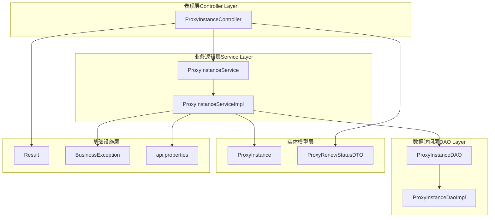
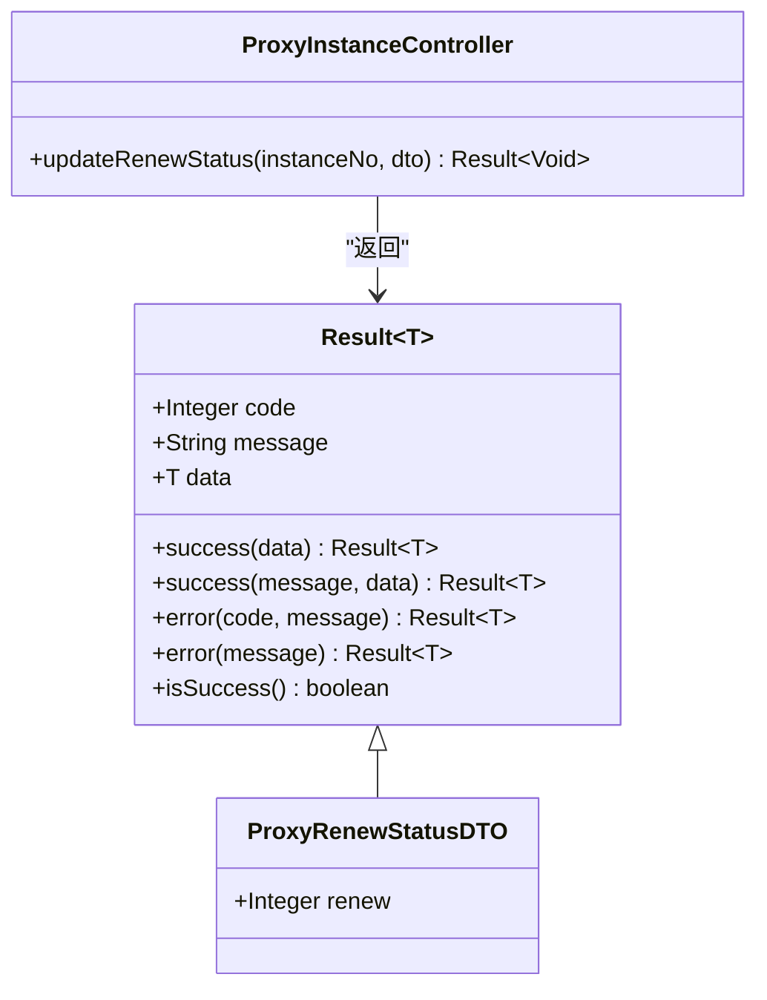
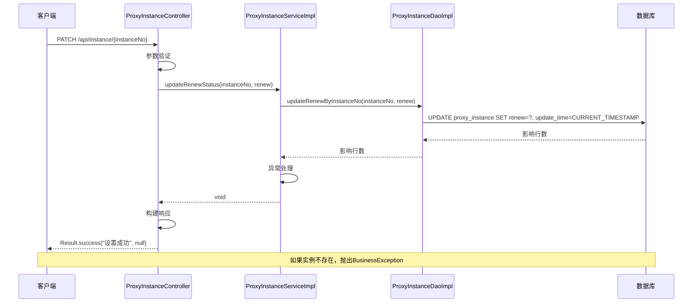
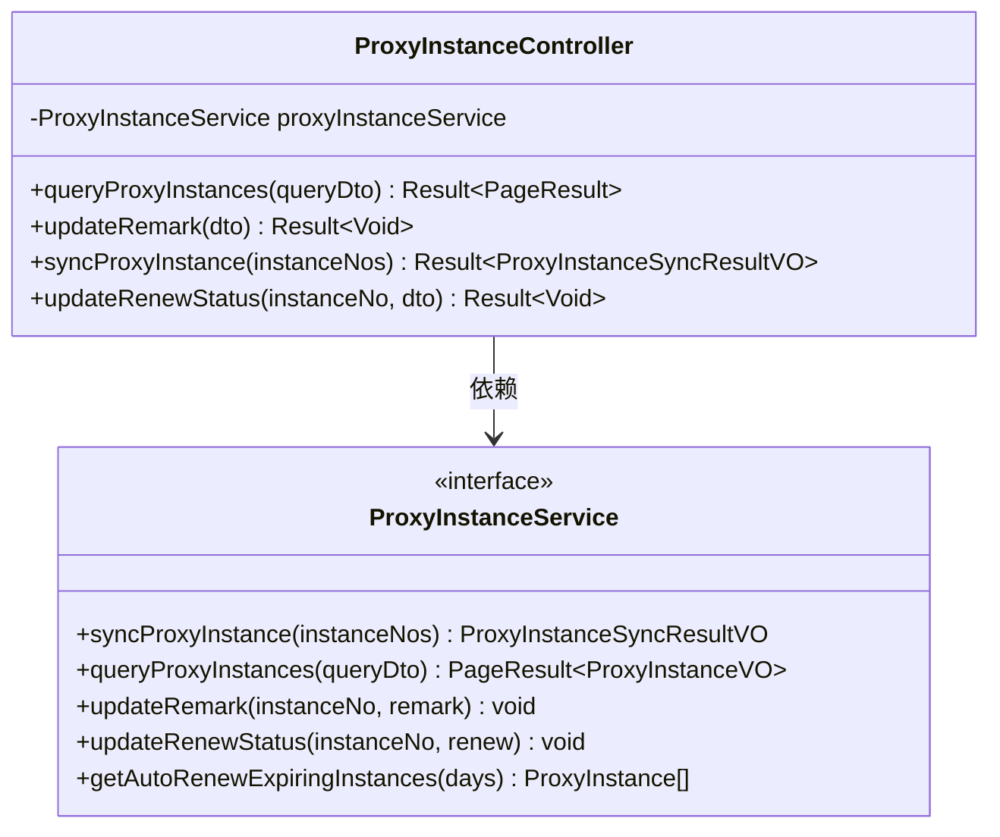
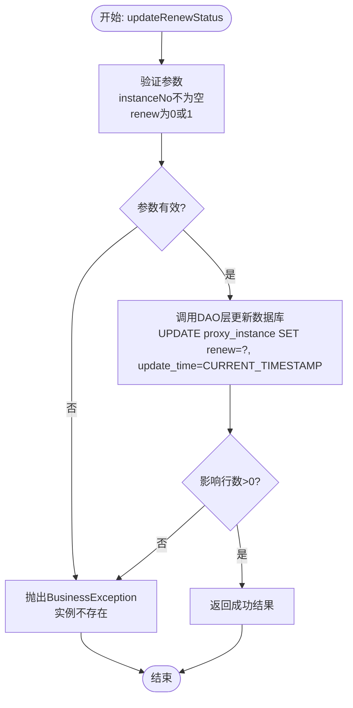
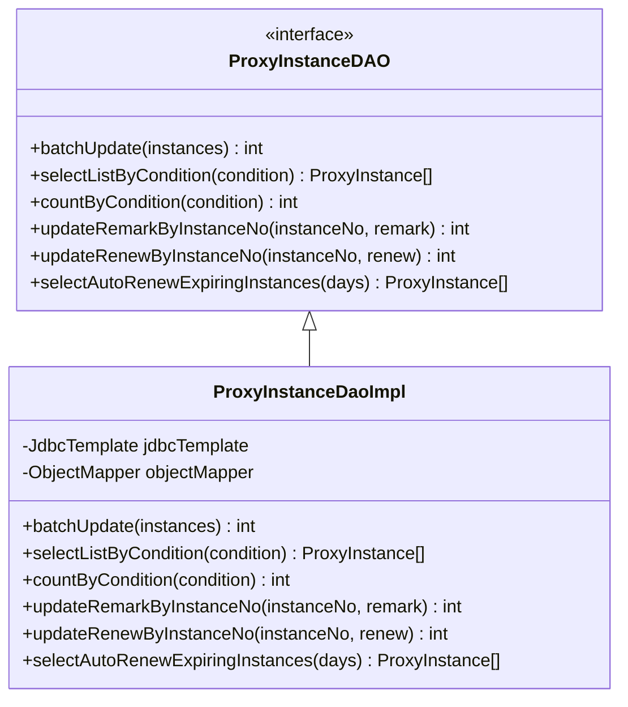
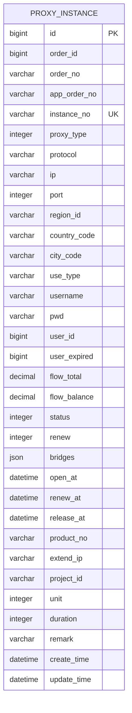
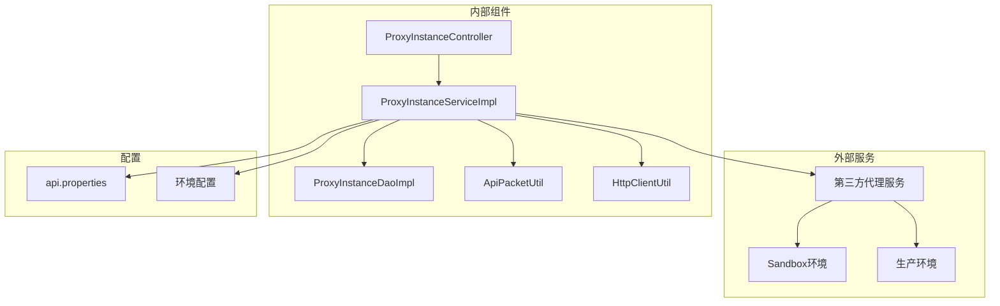
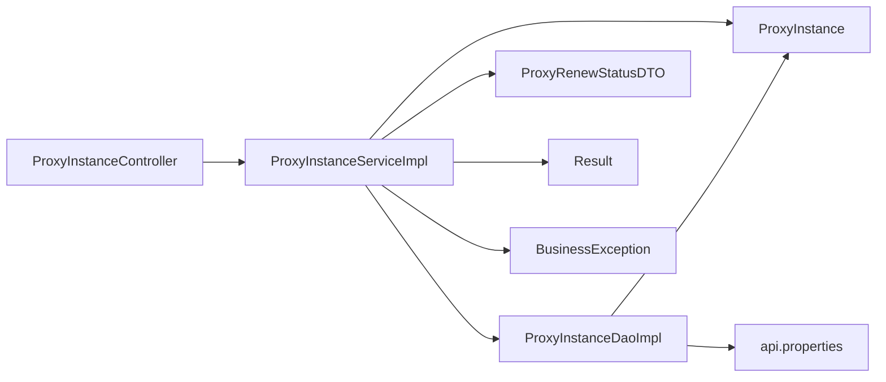
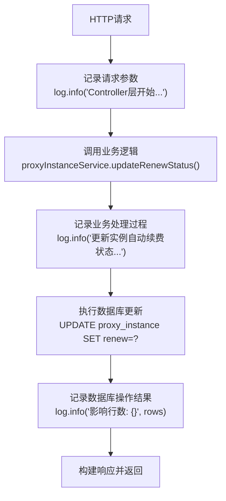

# 变更代理实例自动续费状态接口

<cite>
**本文档引用的文件**
- [变更代理实例自动续费状态接口.md](file://docs/api/internal/变更代理实例自动续费状态接口.md)
- [ProxyInstanceController.java](file://src/main/java/cn/linkfast/controller/ProxyInstanceController.java)
- [ProxyInstanceService.java](file://src/main/java/cn/linkfast/service/ProxyInstanceService.java)
- [ProxyInstanceServiceImpl.java](file://src/main/java/cn/linkfast/service/impl/ProxyInstanceServiceImpl.java)
- [ProxyInstanceDAO.java](file://src/main/java/cn/linkfast/dao/ProxyInstanceDAO.java)
- [ProxyInstanceDaoImpl.java](file://src/main/java/cn/linkfast/dao/impl/ProxyInstanceDaoImpl.java)
- [ProxyRenewStatusDTO.java](file://src/main/java/cn/linkfast/dto/ProxyRenewStatusDTO.java)
- [ProxyInstance.java](file://src/main/java/cn/linkfast/entity/ProxyInstance.java)
- [Result.java](file://src/main/java/cn/linkfast/common/Result.java)
- [BusinessException.java](file://src/main/java/cn/linkfast/exception/BusinessException.java)
- [api.properties](file://src/main/resources/api.properties)
</cite>

## 目录
1. [简介](#简介)
2. [项目结构](#项目结构)
3. [核心组件](#核心组件)
4. [架构概览](#架构概览)
5. [详细组件分析](#详细组件分析)
6. [依赖关系分析](#依赖关系分析)
7. [性能考虑](#性能考虑)
8. [故障排除指南](#故障排除指南)
9. [结论](#结论)

## 简介

本文档详细介绍了变更代理实例自动续费状态接口的设计与实现。该接口允许用户通过PATCH请求修改代理实例的自动续费状态，支持开启（renew=1）和关闭（renew=0）两种状态。接口采用RESTful设计风格，遵循HTTP标准，提供统一的响应格式和错误处理机制。

该接口是代理管理系统中的重要功能模块，用于自动化管理代理实例的生命周期，确保用户能够根据需要灵活控制代理服务的续费行为。

## 项目结构

该项目采用典型的三层架构设计，包含以下主要层次：

**图表来源**
- [ProxyInstanceController.java:1-94](file://src/main/java/cn/linkfast/controller/ProxyInstanceController.java#L1-L94)
- [ProxyInstanceService.java:1-56](file://src/main/java/cn/linkfast/service/ProxyInstanceService.java#L1-L56)
- [ProxyInstanceServiceImpl.java:1-247](file://src/main/java/cn/linkfast/service/impl/ProxyInstanceServiceImpl.java#L1-L247)

**章节来源**
- [ProxyInstanceController.java:1-94](file://src/main/java/cn/linkfast/controller/ProxyInstanceController.java#L1-L94)
- [ProxyInstanceService.java:1-56](file://src/main/java/cn/linkfast/service/ProxyInstanceService.java#L1-L56)
- [ProxyInstanceServiceImpl.java:1-247](file://src/main/java/cn/linkfast/service/impl/ProxyInstanceServiceImpl.java#L1-L247)

## 核心组件

### 接口定义

变更代理实例自动续费状态接口是一个RESTful API，具有以下特征：

- **HTTP方法**: PATCH
- **URL路径**: `/api/instance/{instanceNo}`
- **Content-Type**: application/json
- **返回格式**: application/json

### 请求参数

接口接受两个主要参数：

1. **路径参数** (`instanceNo`)
   - 类型: String
   - 必填: 是
   - 说明: 代理实例编号

2. **请求体参数** (`renew`)
   - 类型: Integer
   - 必填: 是
   - 说明: 自动续费状态（0=关闭，1=开启）

### 响应格式

接口返回统一的响应格式，包含状态码、消息和数据：

**图表来源**
- [Result.java:1-59](file://src/main/java/cn/linkfast/common/Result.java#L1-L59)
- [ProxyRenewStatusDTO.java:1-22](file://src/main/java/cn/linkfast/dto/ProxyRenewStatusDTO.java#L1-L22)
- [ProxyInstanceController.java:78-90](file://src/main/java/cn/linkfast/controller/ProxyInstanceController.java#L78-L90)

**章节来源**
- [变更代理实例自动续费状态接口.md:1-95](file://docs/api/internal/变更代理实例自动续费状态接口.md#L1-L95)
- [ProxyRenewStatusDTO.java:11-22](file://src/main/java/cn/linkfast/dto/ProxyRenewStatusDTO.java#L11-L22)
- [Result.java:10-59](file://src/main/java/cn/linkfast/common/Result.java#L10-L59)

## 架构概览

该接口采用经典的MVC架构模式，实现了清晰的职责分离：

**图表来源**
- [ProxyInstanceController.java:85-90](file://src/main/java/cn/linkfast/controller/ProxyInstanceController.java#L85-L90)
- [ProxyInstanceServiceImpl.java:199-205](file://src/main/java/cn/linkfast/service/impl/ProxyInstanceServiceImpl.java#L199-L205)
- [ProxyInstanceDaoImpl.java:173-179](file://src/main/java/cn/linkfast/dao/impl/ProxyInstanceDaoImpl.java#L173-L179)

## 详细组件分析

### 控制器层分析

#### ProxyInstanceController

控制器层负责处理HTTP请求和响应，实现了接口的入口点：

**图表来源**
- [ProxyInstanceController.java:21-94](file://src/main/java/cn/linkfast/controller/ProxyInstanceController.java#L21-L94)
- [ProxyInstanceService.java:14-56](file://src/main/java/cn/linkfast/service/ProxyInstanceService.java#L14-L56)

控制器层的关键特性：
- 使用`@PatchMapping`注解处理PATCH请求
- 通过`@Validated`注解启用参数验证
- 统一的日志记录机制
- 标准化的异常处理

**章节来源**
- [ProxyInstanceController.java:78-90](file://src/main/java/cn/linkfast/controller/ProxyInstanceController.java#L78-L90)

### 业务逻辑层分析

#### ProxyInstanceServiceImpl

业务逻辑层实现了核心业务逻辑，包括参数验证、数据处理和异常管理：

**图表来源**
- [ProxyInstanceServiceImpl.java:199-205](file://src/main/java/cn/linkfast/service/impl/ProxyInstanceServiceImpl.java#L199-L205)
- [ProxyInstanceDaoImpl.java:173-179](file://src/main/java/cn/linkfast/dao/impl/ProxyInstanceDaoImpl.java#L173-L179)

业务逻辑层的关键特性：
- 使用事务注解确保数据一致性
- 实现了完整的参数验证
- 提供了详细的日志记录
- 包含异常处理机制

**章节来源**
- [ProxyInstanceServiceImpl.java:199-205](file://src/main/java/cn/linkfast/service/impl/ProxyInstanceServiceImpl.java#L199-L205)

### 数据访问层分析

#### ProxyInstanceDaoImpl

数据访问层负责与数据库交互，提供了高效的CRUD操作：

**图表来源**
- [ProxyInstanceDAO.java:11-63](file://src/main/java/cn/linkfast/dao/ProxyInstanceDAO.java#L11-L63)
- [ProxyInstanceDaoImpl.java:27-209](file://src/main/java/cn/linkfast/dao/impl/ProxyInstanceDaoImpl.java#L27-L209)

数据访问层的关键特性：
- 使用JDBC模板进行数据库操作
- 实现了批量更新优化
- 提供了条件查询功能
- 支持JSON数据的序列化和反序列化

**章节来源**
- [ProxyInstanceDaoImpl.java:173-179](file://src/main/java/cn/linkfast/dao/impl/ProxyInstanceDaoImpl.java#L173-L179)

### 数据模型分析

#### ProxyInstance实体

代理实例实体包含了所有相关的业务字段：

**图表来源**
- [ProxyInstance.java:13-57](file://src/main/java/cn/linkfast/entity/ProxyInstance.java#L13-L57)

实体模型的关键字段：
- `instance_no`: 唯一标识符，用于关联操作
- `renew`: 自动续费状态字段
- `user_expired`: 用户到期时间戳
- `update_time`: 最后更新时间

**章节来源**
- [ProxyInstance.java:13-57](file://src/main/java/cn/linkfast/entity/ProxyInstance.java#L13-L57)

## 依赖关系分析

### 外部依赖

系统依赖于多个外部组件和服务：

**图表来源**
- [ProxyInstanceServiceImpl.java:44-56](file://src/main/java/cn/linkfast/service/impl/ProxyInstanceServiceImpl.java#L44-L56)
- [api.properties:1-31](file://src/main/resources/api.properties#L1-L31)

### 内部依赖关系

**图表来源**
- [ProxyInstanceController.java:27](file://src/main/java/cn/linkfast/controller/ProxyInstanceController.java#L27)
- [ProxyInstanceServiceImpl.java:39-42](file://src/main/java/cn/linkfast/service/impl/ProxyInstanceServiceImpl.java#L39-L42)

**章节来源**
- [ProxyInstanceController.java:27](file://src/main/java/cn/linkfast/controller/ProxyInstanceController.java#L27)
- [ProxyInstanceServiceImpl.java:39-42](file://src/main/java/cn/linkfast/service/impl/ProxyInstanceServiceImpl.java#L39-L42)

## 性能考虑

### 数据库优化

1. **索引策略**: `instance_no`字段作为主键，确保查询效率
2. **批量操作**: 使用批量更新减少数据库往返次数
3. **条件查询**: 支持多条件组合查询，提高查询灵活性

### 缓存策略

系统目前未实现缓存机制，但可以考虑：
- 对频繁查询的实例信息进行缓存
- 实现LRU缓存策略
- 设置合理的缓存过期时间

### 异步处理

对于高并发场景，可以考虑：
- 异步执行续费状态更新
- 使用消息队列处理批量操作
- 实现重试机制处理临时性故障

## 故障排除指南

### 常见问题及解决方案

#### 参数验证失败

**问题**: `renew`参数为空或超出范围
**解决方案**: 
- 确保请求体包含有效的`renew`字段
- 值只能为0或1
- 检查JSON格式正确性

#### 实例不存在

**问题**: 指定的`instanceNo`在数据库中不存在
**解决方案**:
- 验证实例编号的正确性
- 确认实例状态正常
- 检查数据库连接配置

#### 数据库连接异常

**问题**: 数据库操作失败
**解决方案**:
- 检查数据库连接字符串
- 验证数据库服务状态
- 查看数据库权限配置

### 日志分析

系统提供了详细的日志记录，便于问题诊断：

**图表来源**
- [ProxyInstanceController.java:86-89](file://src/main/java/cn/linkfast/controller/ProxyInstanceController.java#L86-L89)
- [ProxyInstanceServiceImpl.java:200-204](file://src/main/java/cn/linkfast/service/impl/ProxyInstanceServiceImpl.java#L200-L204)

**章节来源**
- [ProxyInstanceController.java:86-89](file://src/main/java/cn/linkfast/controller/ProxyInstanceController.java#L86-L89)
- [ProxyInstanceServiceImpl.java:200-204](file://src/main/java/cn/linkfast/service/impl/ProxyInstanceServiceImpl.java#L200-L204)

## 结论

变更代理实例自动续费状态接口是一个设计良好的RESTful API，具有以下特点：

1. **清晰的架构设计**: 采用分层架构，职责分离明确
2. **完善的参数验证**: 使用Bean Validation确保数据完整性
3. **统一的响应格式**: 提供一致的API体验
4. **健壮的异常处理**: 覆盖各种异常场景
5. **详细的日志记录**: 便于问题诊断和监控

该接口为代理管理系统提供了重要的自动化能力，用户可以通过简单的API调用实现复杂的业务逻辑。建议在未来版本中考虑添加更多的监控指标、缓存机制和异步处理能力，以进一步提升系统的性能和可靠性。