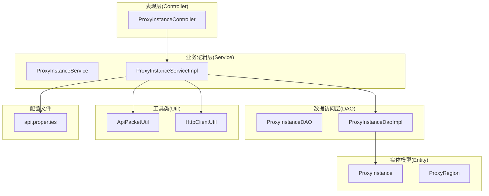
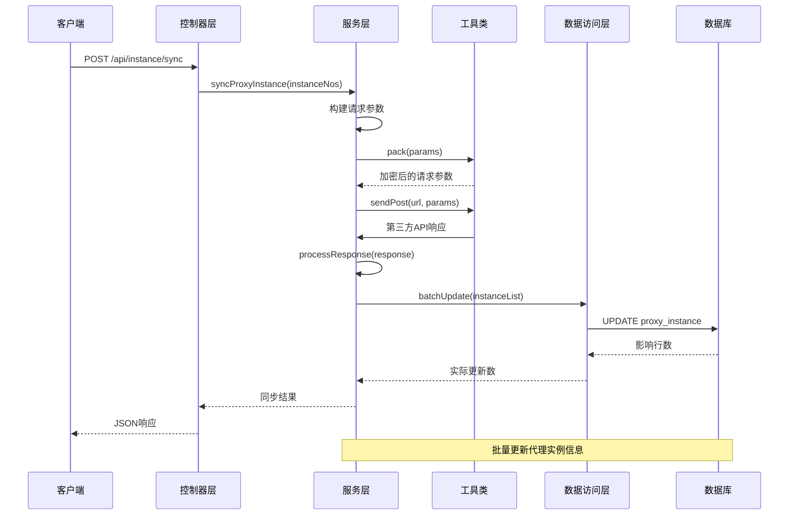
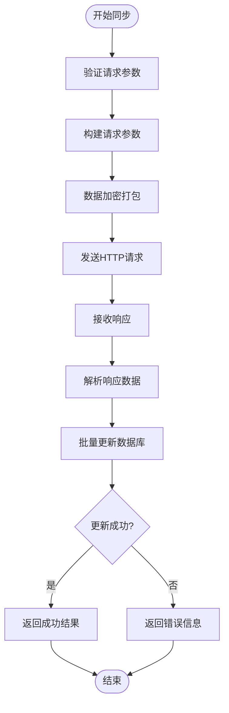
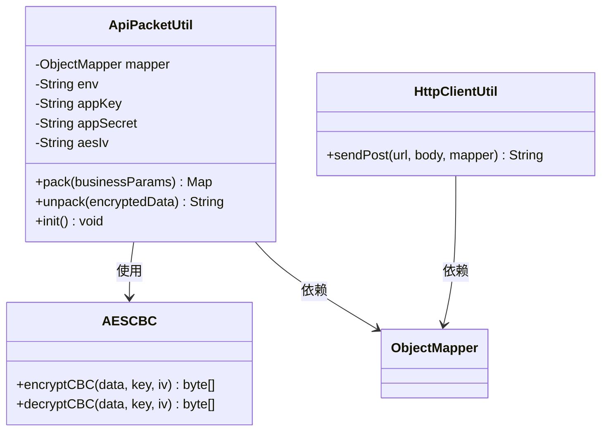
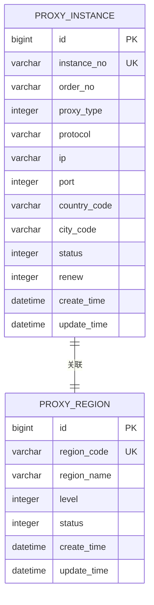
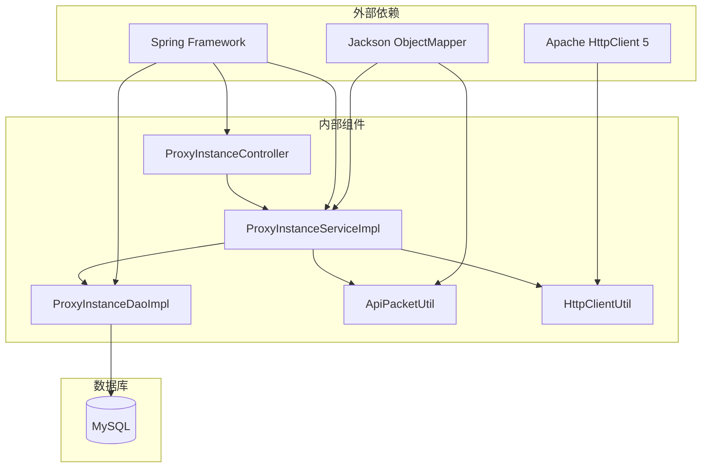

# 同步代理实例接口

<cite>
**本文档引用的文件**
- [ProxyInstanceController.java](file://src/main/java/cn/linkfast/controller/ProxyInstanceController.java)
- [ProxyInstanceService.java](file://src/main/java/cn/linkfast/service/ProxyInstanceService.java)
- [ProxyInstanceServiceImpl.java](file://src/main/java/cn/linkfast/service/impl/ProxyInstanceServiceImpl.java)
- [ProxyInstanceDAO.java](file://src/main/java/cn/linkfast/dao/ProxyInstanceDAO.java)
- [ProxyInstanceDaoImpl.java](file://src/main/java/cn/linkfast/dao/impl/ProxyInstanceDaoImpl.java)
- [ProxyInstance.java](file://src/main/java/cn/linkfast/entity/ProxyInstance.java)
- [ProxyInstanceQueryDTO.java](file://src/main/java/cn/linkfast/dto/ProxyInstanceQueryDTO.java)
- [ProxyInstanceSearchCondition.java](file://src/main/java/cn/linkfast/dto/ProxyInstanceSearchCondition.java)
- [ProxyInstanceSyncResultVO.java](file://src/main/java/cn/linkfast/vo/ProxyInstanceSyncResultVO.java)
- [ProxyInstanceVO.java](file://src/main/java/cn/linkfast/vo/ProxyInstanceVO.java)
- [ApiPacketUtil.java](file://src/main/java/cn/linkfast/utils/ApiPacketUtil.java)
- [HttpClientUtil.java](file://src/main/java/cn/linkfast/utils/HttpClientUtil.java)
- [api.properties](file://src/main/resources/api.properties)
- [同步代理实例接口.md](file://docs/api/internal/同步代理实例接口.md)
</cite>

## 目录
1. [简介](#简介)
2. [项目结构](#项目结构)
3. [核心组件](#核心组件)
4. [架构概览](#架构概览)
5. [详细组件分析](#详细组件分析)
6. [依赖关系分析](#依赖关系分析)
7. [性能考虑](#性能考虑)
8. [故障排除指南](#故障排除指南)
9. [结论](#结论)

## 简介

同步代理实例接口是LinkFast项目中的核心功能模块，负责从第三方代理服务提供商拉取最新的代理实例信息，并将其同步到本地数据库中。该接口支持批量同步操作，能够处理大量代理实例的数据更新需求。

该接口采用RESTful API设计，通过POST请求接收代理实例编号数组，然后执行以下流程：
1. 从第三方API获取最新的实例数据
2. 解密和解析响应数据
3. 批量更新本地数据库中的实例信息
4. 返回同步结果统计信息

## 项目结构

基于MVC架构模式，项目采用分层设计：



**图表来源**
- [ProxyInstanceController.java:1-94](file://src/main/java/cn/linkfast/controller/ProxyInstanceController.java#L1-L94)
- [ProxyInstanceServiceImpl.java:1-247](file://src/main/java/cn/linkfast/service/impl/ProxyInstanceServiceImpl.java#L1-L247)
- [ProxyInstanceDaoImpl.java:1-209](file://src/main/java/cn/linkfast/dao/impl/ProxyInstanceDaoImpl.java#L1-L209)

**章节来源**
- [ProxyInstanceController.java:18-94](file://src/main/java/cn/linkfast/controller/ProxyInstanceController.java#L18-L94)
- [ProxyInstanceService.java:11-56](file://src/main/java/cn/linkfast/service/ProxyInstanceService.java#L11-L56)

## 核心组件

### 控制器层 - ProxyInstanceController

控制器层负责处理HTTP请求和响应，提供RESTful API接口。主要功能包括：

- **同步代理实例接口** (`/api/instance/sync`): 接收实例编号数组，调用服务层执行同步操作
- **实例列表查询接口** (`/api/instance/list`): 支持分页查询代理实例
- **备注更新接口** (`/api/instance/remark`): 更新代理实例备注信息
- **自动续费状态更新接口** (`/api/instance/{instanceNo}`): 修改实例自动续费状态

### 服务层 - ProxyInstanceServiceImpl

服务层实现业务逻辑，包含核心的同步功能：

- **syncProxyInstance**: 主要同步方法，执行完整的数据同步流程
- **queryProxyInstances**: 实例查询功能
- **updateRemark**: 备注更新功能  
- **updateRenewStatus**: 自动续费状态更新功能

### 数据访问层 - ProxyInstanceDaoImpl

DAO层负责数据库操作：

- **batchUpdate**: 批量更新代理实例信息
- **selectListByCondition**: 条件查询实例列表
- **countByCondition**: 统计符合条件的实例数量
- **updateRemarkByInstanceNo**: 更新实例备注
- **updateRenewByInstanceNo**: 更新自动续费状态

**章节来源**
- [ProxyInstanceController.java:29-90](file://src/main/java/cn/linkfast/controller/ProxyInstanceController.java#L29-L90)
- [ProxyInstanceServiceImpl.java:87-119](file://src/main/java/cn/linkfast/service/impl/ProxyInstanceServiceImpl.java#L87-L119)
- [ProxyInstanceDaoImpl.java:32-88](file://src/main/java/cn/linkfast/dao/impl/ProxyInstanceDaoImpl.java#L32-L88)

## 架构概览

同步代理实例接口采用经典的三层架构设计，各层职责清晰分离：



**图表来源**
- [ProxyInstanceController.java:61-76](file://src/main/java/cn/linkfast/controller/ProxyInstanceController.java#L61-L76)
- [ProxyInstanceServiceImpl.java:87-119](file://src/main/java/cn/linkfast/service/impl/ProxyInstanceServiceImpl.java#L87-L119)
- [ProxyInstanceDaoImpl.java:32-88](file://src/main/java/cn/linkfast/dao/impl/ProxyInstanceDaoImpl.java#L32-L88)

## 详细组件分析

### 同步流程详解

#### 请求处理流程



**图表来源**
- [ProxyInstanceServiceImpl.java:87-119](file://src/main/java/cn/linkfast/service/impl/ProxyInstanceServiceImpl.java#L87-L119)
- [ApiPacketUtil.java:58-92](file://src/main/java/cn/linkfast/utils/ApiPacketUtil.java#L58-L92)
- [HttpClientUtil.java:27-44](file://src/main/java/cn/linkfast/utils/HttpClientUtil.java#L27-L44)

#### 数据加密解密机制

系统采用AES-CBC加密算法确保数据传输安全：



**图表来源**
- [ApiPacketUtil.java:18-106](file://src/main/java/cn/linkfast/utils/ApiPacketUtil.java#L18-L106)
- [HttpClientUtil.java:15-46](file://src/main/java/cn/linkfast/utils/HttpClientUtil.java#L15-L46)

### 数据模型设计

#### 实体类关系图



**图表来源**
- [ProxyInstance.java:13-57](file://src/main/java/cn/linkfast/entity/ProxyInstance.java#L13-L57)
- [ProxyRegion.java:14-33](file://src/main/java/cn/linkfast/entity/ProxyRegion.java#L14-L33)

#### 查询条件设计

系统支持灵活的查询条件组合：

| 查询字段 | 类型 | 说明 | 条件示例 |
|---------|------|------|---------|
| proxyType | Integer[] | 代理类型数组 | [1,2,3] |
| status | Integer | 实例状态 | 1 |
| countryCode | String | 国家代码 | "CN" |
| cityCode | String | 城市代码 | "BJ" |
| ip | String | IP地址(模糊查询) | "%192.168%" |
| instanceNo | String | 实例编号(精确查询) | "c_123456" |

**章节来源**
- [ProxyInstanceSearchCondition.java:16-56](file://src/main/java/cn/linkfast/dto/ProxyInstanceSearchCondition.java#L16-L56)
- [ProxyInstanceQueryDTO.java:19-63](file://src/main/java/cn/linkfast/dto/ProxyInstanceQueryDTO.java#L19-L63)

### API接口规范

#### 接口定义

| 属性 | 值 |
|------|-----|
| 接口地址 | `/api/instance/sync` |
| 请求方法 | `POST` |
| 内容类型 | `application/json` |
| 返回格式 | `application/json` |

#### 请求体结构

```json
[
    "c_gz3h2igp6dz9cq3",
    "c_gjhfpkxyqjx2n76"
]
```

#### 响应数据结构

| 字段 | 类型 | 说明 |
|------|------|------|
| code | Integer | 状态码：200=成功，400=参数错误，500=系统错误 |
| message | String | 提示信息 |
| data | Object | 同步结果数据 |

#### 同步结果数据

| 字段 | 类型 | 说明 |
|------|------|------|
| expectedCount | Integer | 预期更新数(第三方返回的实例数量) |
| actualCount | Integer | 实际更新数(数据库实际影响行数) |

**章节来源**
- [同步代理实例接口.md:1-96](file://docs/api/internal/同步代理实例接口.md#L1-L96)
- [ProxyInstanceSyncResultVO.java:13-19](file://src/main/java/cn/linkfast/vo/ProxyInstanceSyncResultVO.java#L13-L19)

## 依赖关系分析

### 组件依赖图



**图表来源**
- [ProxyInstanceController.java:1-16](file://src/main/java/cn/linkfast/controller/ProxyInstanceController.java#L1-L16)
- [ProxyInstanceServiceImpl.java:1-27](file://src/main/java/cn/linkfast/service/impl/ProxyInstanceServiceImpl.java#L1-L27)
- [ProxyInstanceDaoImpl.java:1-17](file://src/main/java/cn/linkfast/dao/impl/ProxyInstanceDaoImpl.java#L1-L17)

### 关键依赖特性

1. **配置管理**: 通过`api.properties`统一管理第三方API配置
2. **环境切换**: 支持沙盒环境(sandbox)和生产环境(prod)自动切换
3. **事务管理**: 同步操作使用Spring声明式事务保证数据一致性
4. **批量处理**: 采用JDBC批处理优化数据库操作性能

**章节来源**
- [api.properties:1-31](file://src/main/resources/api.properties#L1-L31)
- [ProxyInstanceServiceImpl.java:78-85](file://src/main/java/cn/linkfast/service/impl/ProxyInstanceServiceImpl.java#L78-L85)

## 性能考虑

### 批量处理优化

系统采用多种策略优化性能：

1. **批量数据库更新**: 使用JDBC批处理减少数据库往返次数
2. **N+1查询优化**: 批量加载地域信息避免重复查询
3. **条件查询优化**: 动态拼接SQL条件提高查询效率
4. **连接池管理**: 使用Apache HttpClient连接池复用HTTP连接

### 缓存策略

- **地域信息缓存**: 批量查询后缓存地域映射关系
- **配置信息缓存**: 应用启动时加载并缓存API配置
- **加密密钥缓存**: 避免重复计算AES IV值

### 异常处理机制

- **超时控制**: HTTP请求设置合理的超时时间
- **重试机制**: 对网络异常提供有限次重试
- **降级策略**: 第三方API不可用时提供本地缓存数据

## 故障排除指南

### 常见问题及解决方案

#### 同步失败问题

| 问题类型 | 可能原因 | 解决方案 |
|---------|---------|---------|
| 第三方API错误 | 签名验证失败 | 检查appKey和appSecret配置 |
| 数据库连接异常 | 连接池耗尽 | 增加连接池大小或优化查询 |
| 网络超时 | 网络不稳定 | 增加重试次数和超时时间 |
| 数据解析错误 | 响应格式异常 | 检查响应数据结构和编码 |

#### 性能问题诊断

1. **查询慢**: 检查SQL索引是否完善
2. **内存占用高**: 优化批量处理大小
3. **CPU使用率高**: 减少不必要的字符串操作

#### 日志分析要点

- **请求日志**: 记录完整的请求参数和响应数据
- **性能日志**: 记录关键操作的执行时间
- **错误日志**: 详细记录异常堆栈信息

**章节来源**
- [ProxyInstanceController.java:64-76](file://src/main/java/cn/linkfast/controller/ProxyInstanceController.java#L64-L76)
- [ProxyInstanceServiceImpl.java:215-244](file://src/main/java/cn/linkfast/service/impl/ProxyInstanceServiceImpl.java#L215-L244)

## 结论

同步代理实例接口是一个设计完善的微服务模块，具有以下特点：

1. **架构清晰**: 采用标准的三层架构，职责分离明确
2. **扩展性强**: 支持环境切换和配置管理
3. **性能优秀**: 采用批量处理和缓存优化
4. **安全性高**: 数据传输采用AES加密保护
5. **可靠性好**: 完善的异常处理和监控机制

该接口为LinkFast项目提供了稳定可靠的代理实例数据同步能力，能够满足大规模代理实例管理的需求。通过合理的设计和优化，系统能够在保证数据准确性的同时，提供高效的性能表现。