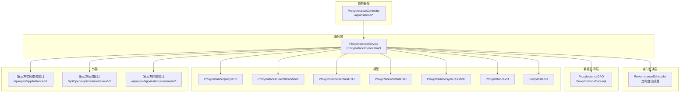
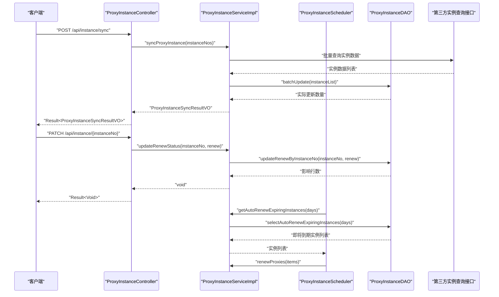
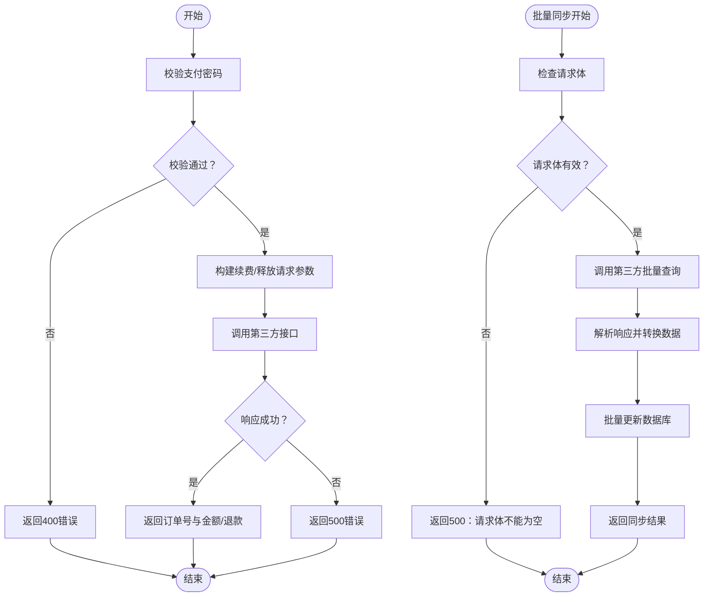
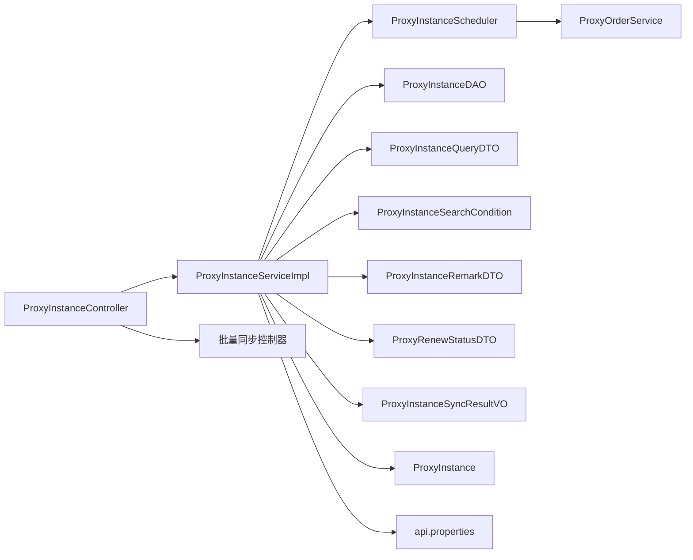

# 实例管理 API

<cite>
**本文引用的文件**
- [ProxyInstanceController.java](file://src/main/java/cn/linkfast/controller/ProxyInstanceController.java)
- [ProxyInstanceService.java](file://src/main/java/cn/linkfast/service/ProxyInstanceService.java)
- [ProxyInstanceServiceImpl.java](file://src/main/java/cn/linkfast/service/impl/ProxyInstanceServiceImpl.java)
- [ProxyInstanceDAO.java](file://src/main/java/cn/linkfast/dao/ProxyInstanceDAO.java)
- [ProxyInstanceDaoImpl.java](file://src/main/java/cn/linkfast/dao/impl/ProxyInstanceDaoImpl.java)
- [ProxyInstanceQueryDTO.java](file://src/main/java/cn/linkfast/dto/ProxyInstanceQueryDTO.java)
- [ProxyInstanceSearchCondition.java](file://src/main/java/cn/linkfast/dto/ProxyInstanceSearchCondition.java)
- [ProxyInstanceRemarkDTO.java](file://src/main/java/cn/linkfast/dto/ProxyInstanceRemarkDTO.java)
- [ProxyRenewStatusDTO.java](file://src/main/java/cn/linkfast/dto/ProxyRenewStatusDTO.java)
- [ProxyInstanceSyncResultVO.java](file://src/main/java/cn/linkfast/vo/ProxyInstanceSyncResultVO.java)
- [ProxyInstanceVO.java](file://src/main/java/cn/linkfast/vo/ProxyInstanceVO.java)
- [ProxyInstance.java](file://src/main/java/cn/linkfast/entity/ProxyInstance.java)
- [ProxyInstanceScheduler.java](file://src/main/java/cn/linkfast/task/ProxyInstanceScheduler.java)
- [ProxyInstanceControllerIT.java](file://src/test/java/cn/linkfast/controller/ProxyInstanceControllerIT.java)
- [ProxyInstanceSchedulerIT.java](file://src/test/java/cn/linkfast/task/ProxyInstanceSchedulerIT.java)
- [api.properties](file://src/main/resources/api.properties)
- [同步代理实例接口.md](file://docs/api/internal/同步代理实例接口.md)
- [变更代理实例自动续费状态接口.md](file://docs/api/internal/变更代理实例自动续费状态接口.md)
- [获取代理实例列表接口.md](file://docs/api/internal/获取代理实例列表接口.md)
- [更新代理实例备注接口.md](file://docs/api/internal/更新代理实例备注接口.md)
- [续费代理实例接口.md](file://docs/api/internal/续费代理实例接口.md)
- [释放代理实例接口.md](file://docs/api/internal/释放代理实例接口.md)
</cite>

## 更新摘要
**变更内容**
- 新增批量实例同步接口，支持批量获取第三方实例数据并更新本地数据库
- 新增自动续费状态管理接口，支持实时开启/关闭实例自动续费功能
- 新增定时自动续费任务，实现即将到期实例的自动化续费
- 新增批量更新优化，提升大规模数据同步性能
- 新增性能监控指标，包括查询耗时统计和批量更新结果追踪

## 目录
1. [简介](#简介)
2. [项目结构](#项目结构)
3. [核心组件](#核心组件)
4. [架构总览](#架构总览)
5. [详细组件分析](#详细组件分析)
6. [依赖分析](#依赖分析)
7. [性能考虑](#性能考虑)
8. [故障排查指南](#故障排查指南)
9. [结论](#结论)
10. [附录](#附录)

## 简介
本文件为"实例管理"模块的 API 接口文档，聚焦于代理实例的查询、状态管理与备注更新能力，并结合仓库内现有接口文档，补充续费、释放等业务流程的接口规范与调用方式。文档同时对实例状态定义、生命周期管理、搜索条件与过滤规则、排序选项、批量操作、备注维护机制、健康检查与告警集成、调度与故障转移等主题进行系统化说明，帮助开发者与运维人员快速理解并正确使用实例管理相关接口。

**更新** 新增批量实例同步、自动续费状态管理、定时续费任务等核心功能，提供完整的实例生命周期管理解决方案。

## 项目结构
围绕实例管理的后端实现采用典型的分层架构：
- 控制器层：对外暴露 REST API，负责参数接收与响应封装
- 服务层：编排业务流程，协调 DAO 与第三方接口
- 数据访问层：封装数据库查询与更新
- 定时任务层：处理自动续费等周期性任务
- DTO/VO/Entity：数据传输与展示模型
- 配置资源：第三方接口域名、路径与密钥配置

**图表来源**
- [ProxyInstanceController.java:1-94](file://src/main/java/cn/linkfast/controller/ProxyInstanceController.java#L1-L94)
- [ProxyInstanceService.java:1-56](file://src/main/java/cn/linkfast/service/ProxyInstanceService.java#L1-L56)
- [ProxyInstanceServiceImpl.java:1-247](file://src/main/java/cn/linkfast/service/impl/ProxyInstanceServiceImpl.java#L1-L247)
- [ProxyInstanceScheduler.java:1-80](file://src/main/java/cn/linkfast/task/ProxyInstanceScheduler.java#L1-L80)
- [ProxyInstanceDAO.java:1-63](file://src/main/java/cn/linkfast/dao/ProxyInstanceDAO.java#L1-L63)
- [ProxyInstanceDaoImpl.java:1-209](file://src/main/java/cn/linkfast/dao/impl/ProxyInstanceDaoImpl.java#L1-L209)

**章节来源**
- [ProxyInstanceController.java:1-94](file://src/main/java/cn/linkfast/controller/ProxyInstanceController.java#L1-L94)
- [ProxyInstanceService.java:1-56](file://src/main/java/cn/linkfast/service/ProxyInstanceService.java#L1-L56)
- [ProxyInstanceServiceImpl.java:1-247](file://src/main/java/cn/linkfast/service/impl/ProxyInstanceServiceImpl.java#L1-L247)
- [ProxyInstanceScheduler.java:1-80](file://src/main/java/cn/linkfast/task/ProxyInstanceScheduler.java#L1-L80)
- [ProxyInstanceDAO.java:1-63](file://src/main/java/cn/linkfast/dao/ProxyInstanceDAO.java#L1-L63)
- [ProxyInstanceDaoImpl.java:1-209](file://src/main/java/cn/linkfast/dao/impl/ProxyInstanceDaoImpl.java#L1-L209)

## 核心组件
- 控制器：提供实例列表查询、备注更新、批量同步、自动续费状态管理四个接口
- 服务层：实现分页查询、备注更新、批量同步、自动续费状态更新、定时续费任务
- DAO 层：提供分页查询、计数、批量更新、备注更新、自动续费状态更新、定时查询
- 定时任务：处理自动续费即将到期的代理实例
- 模型层：包含查询 DTO、搜索条件、备注 DTO、自动续费状态 DTO、同步结果 VO、展示 VO 与实体类
- 配置资源：定义第三方接口域名、路径与密钥

**更新** 新增批量同步和自动续费状态管理功能，完善实例生命周期管理闭环。

**章节来源**
- [ProxyInstanceController.java:25-94](file://src/main/java/cn/linkfast/controller/ProxyInstanceController.java#L25-L94)
- [ProxyInstanceService.java:14-56](file://src/main/java/cn/linkfast/service/ProxyInstanceService.java#L14-L56)
- [ProxyInstanceServiceImpl.java:37-247](file://src/main/java/cn/linkfast/service/impl/ProxyInstanceServiceImpl.java#L37-L247)
- [ProxyInstanceScheduler.java:25-80](file://src/main/java/cn/linkfast/task/ProxyInstanceScheduler.java#L25-L80)
- [ProxyInstanceDAO.java:11-63](file://src/main/java/cn/linkfast/dao/ProxyInstanceDAO.java#L11-L63)
- [ProxyInstanceDaoImpl.java:27-209](file://src/main/java/cn/linkfast/dao/impl/ProxyInstanceDaoImpl.java#L27-L209)

## 架构总览
实例管理模块通过控制器接收请求，服务层完成参数校验、条件构建、DAO 查询与第三方接口调用，最终以 VO 形式返回给前端。定时任务层负责自动续费等周期性任务的执行。批量同步功能支持大规模数据的高效处理。

**图表来源**
- [ProxyInstanceController.java:61-90](file://src/main/java/cn/linkfast/controller/ProxyInstanceController.java#L61-L90)
- [ProxyInstanceServiceImpl.java:89-119](file://src/main/java/cn/linkfast/service/impl/ProxyInstanceServiceImpl.java#L89-L119)
- [ProxyInstanceServiceImpl.java:207-210](file://src/main/java/cn/linkfast/service/impl/ProxyInstanceServiceImpl.java#L207-L210)
- [ProxyInstanceScheduler.java:40-79](file://src/main/java/cn/linkfast/task/ProxyInstanceScheduler.java#L40-L79)
- [ProxyInstanceDAO.java:19](file://src/main/java/cn/linkfast/dao/ProxyInstanceDAO.java#L19)
- [ProxyInstanceDaoImpl.java:32-88](file://src/main/java/cn/linkfast/dao/impl/ProxyInstanceDaoImpl.java#L32-L88)

## 详细组件分析

### 接口一：实例列表查询（分页）
- 接口路径：/api/instance/list
- 方法：GET
- 功能：分页查询代理实例列表，支持多维过滤与模糊匹配
- 请求参数（Query）
  - pageNum：必填，≥1
  - pageSize：必填，1≤pageSize≤100
  - proxyType：可选，数组，支持多值
  - status：可选，整型状态码
  - countryCode：可选，国家代码
  - cityCode：可选，城市代码
  - ip：可选，IP 地址（模糊匹配）
  - instanceNo：可选，实例编号（精确匹配）

- 返回结构
  - 外层 Result：code、message、data
  - data：PageResult
    - total、totalPages、pageNum、pageSize、list
  - list：ProxyInstanceVO 数组，包含 ip、port、regionId、regionName、status、username、pwd、instanceNo、renew、orderNo、productNo、unit、duration、userExpired、remark、createTime 等字段

- 分页与排序
  - 分页：基于 pageNum 与 pageSize 计算 offset，limit=pageSize
  - 排序：按 create_time DESC 排序，确保最新创建的实例优先显示

- 过滤规则
  - proxyType 支持多值过滤
  - status 精确过滤
  - countryCode/cityCode 精确过滤
  - ip 支持模糊匹配
  - instanceNo 支持精确匹配

- 复杂度与性能
  - 查询复杂度主要受数据库索引影响；建议在常用过滤字段（如 instanceNo、status、countryCode、cityCode、ip）建立合适索引
  - pageSize 上限为 100，避免一次性返回过多数据
  - 查询耗时统计：DAO 层已添加查询耗时日志记录

- 错误处理
  - 参数校验失败：返回 400
  - 服务器异常：返回 500

**章节来源**
- [ProxyInstanceController.java:35-40](file://src/main/java/cn/linkfast/controller/ProxyInstanceController.java#L35-L40)
- [ProxyInstanceServiceImpl.java:122-146](file://src/main/java/cn/linkfast/service/impl/ProxyInstanceServiceImpl.java#L122-L146)
- [ProxyInstanceDaoImpl.java:90-107](file://src/main/java/cn/linkfast/dao/impl/ProxyInstanceDaoImpl.java#L90-L107)
- [ProxyInstanceQueryDTO.java:19-58](file://src/main/java/cn/linkfast/dto/ProxyInstanceQueryDTO.java#L19-L58)
- [ProxyInstanceSearchCondition.java:19-51](file://src/main/java/cn/linkfast/dto/ProxyInstanceSearchCondition.java#L19-L51)
- [ProxyInstanceVO.java:17-41](file://src/main/java/cn/linkfast/vo/ProxyInstanceVO.java#L17-L41)

### 接口二：更新实例备注
- 接口路径：/api/instance/remark
- 方法：PATCH
- 功能：更新指定实例的备注；remark 为空字符串表示清空备注
- 请求体
  - instanceNo：必填，平台实例编号
  - remark：可选，备注内容

- 返回结构
  - 成功：Result<Void>，data 为 null
  - 参数校验失败：返回 400
  - 实例不存在：返回 400

- 错误处理
  - instanceNo 为空：参数校验失败
  - updateRemarkByInstanceNo 返回 0：抛出业务异常提示"实例不存在"

- 批量能力
  - 当前接口为单实例备注更新；批量更新可通过扩展服务层方法实现

**章节来源**
- [ProxyInstanceController.java:48-52](file://src/main/java/cn/linkfast/controller/ProxyInstanceController.java#L48-L52)
- [ProxyInstanceServiceImpl.java:191-197](file://src/main/java/cn/linkfast/service/impl/ProxyInstanceServiceImpl.java#L191-L197)
- [ProxyInstanceDAO.java:38-44](file://src/main/java/cn/linkfast/dao/ProxyInstanceDAO.java#L38-L44)
- [ProxyInstanceRemarkDTO.java:14-22](file://src/main/java/cn/linkfast/dto/ProxyInstanceRemarkDTO.java#L14-L22)

### 接口三：批量同步代理实例
- 接口路径：/api/instance/sync
- 方法：POST
- 功能：批量从第三方接口同步代理实例信息到本地数据库
- 请求体
  - instanceNos：必填，实例编号数组，至少包含一个实例

- 返回结构
  - data：ProxyInstanceSyncResultVO，包含 expectedCount（预期更新数）、actualCount（实际更新数）

- 批量同步流程
  1. 构造请求参数，包含实例编号数组
  2. 拼接完整请求 URL
  3. 业务参数加密封装
  4. 发送 HTTP 请求获取业务数据
  5. 解析响应并转换为 ProxyInstance 列表
  6. 批量更新数据库，返回同步结果

- 错误处理
  - 请求体为空：返回 500，提示"同步失败：请求体不能为空"
  - 第三方 API 异常：返回 500，提示"同步失败：获取实例信息API错误: [错误信息]"
  - 数据库写入异常：返回 500，提示"同步失败：批量更新代理实例异常"

- 性能优化
  - 使用批量更新 SQL，减少数据库往返次数
  - 实际更新数统计：仅统计真正发生变化的数据行数
  - 加密数据处理：支持响应数据的加密封装与解密

**新增** 批量同步功能，支持大规模实例数据的高效同步。

**章节来源**
- [ProxyInstanceController.java:61-76](file://src/main/java/cn/linkfast/controller/ProxyInstanceController.java#L61-L76)
- [ProxyInstanceService.java:16-22](file://src/main/java/cn/linkfast/service/ProxyInstanceService.java#L16-L22)
- [ProxyInstanceServiceImpl.java:89-119](file://src/main/java/cn/linkfast/service/impl/ProxyInstanceServiceImpl.java#L89-L119)
- [ProxyInstanceServiceImpl.java:215-244](file://src/main/java/cn/linkfast/service/impl/ProxyInstanceServiceImpl.java#L215-L244)
- [ProxyInstanceDAO.java:13-19](file://src/main/java/cn/linkfast/dao/ProxyInstanceDAO.java#L13-L19)
- [ProxyInstanceDaoImpl.java:32-88](file://src/main/java/cn/linkfast/dao/impl/ProxyInstanceDaoImpl.java#L32-L88)
- [ProxyInstanceSyncResultVO.java:12-18](file://src/main/java/cn/linkfast/vo/ProxyInstanceSyncResultVO.java#L12-L18)
- [同步代理实例接口.md:1-96](file://docs/api/internal/同步代理实例接口.md#L1-L96)

### 接口四：变更实例自动续费状态
- 接口路径：/api/instance/{instanceNo}
- 方法：PATCH
- 功能：实时变更指定实例的自动续费状态（开启/关闭）
- 路径参数
  - instanceNo：必填，代理实例编号

- 请求体
  - renew：必填，自动续费状态（0=关闭，1=开启）

- 返回结构
  - 成功：Result<Void>，message 为"设置成功"
  - 参数校验失败：返回 400
  - 实例不存在：返回 400

- 参数验证
  - renew 不能为空，且只能为 0 或 1
  - 通过 DTO 注解实现参数校验

- 错误处理
  - 参数校验失败：返回 400，提示具体的校验错误
  - 实例不存在：返回 400，提示"实例不存在: [instanceNo]"

**新增** 自动续费状态管理接口，支持实时控制实例的自动续费功能。

**章节来源**
- [ProxyInstanceController.java:85-90](file://src/main/java/cn/linkfast/controller/ProxyInstanceController.java#L85-L90)
- [ProxyInstanceService.java:40-46](file://src/main/java/cn/linkfast/service/ProxyInstanceService.java#L40-L46)
- [ProxyInstanceServiceImpl.java:199-205](file://src/main/java/cn/linkfast/service/impl/ProxyInstanceServiceImpl.java#L199-L205)
- [ProxyInstanceDAO.java:46-53](file://src/main/java/cn/linkfast/dao/ProxyInstanceDAO.java#L46-L53)
- [ProxyRenewStatusDTO.java:12-21](file://src/main/java/cn/linkfast/dto/ProxyRenewStatusDTO.java#L12-L21)
- [变更代理实例自动续费状态接口.md:1-95](file://docs/api/internal/变更代理实例自动续费状态接口.md#L1-L95)

### 接口五：实例续费（补充）
- 接口路径：/api/order/renew
- 方法：POST
- 功能：对一个或多个实例进行续费，支持批量
- 请求体
  - payPassword：必填，支付密码（6 位数字）
  - items：必填，数组，每个元素包含 instanceNo、unit、duration、cycleTimes

- 续费周期计算规则
  - duration=1 且 unit=1（按天计费）：cycleTimes = 用户选择月数 × 30
  - duration=1 且 unit=3（按月计费）：cycleTimes = 用户选择月数
  〜 duration=30 且 unit=1（按 30 天/月计费）：cycleTimes = 用户选择月数
  - duration=1 且 unit=4（按年计费）：cycleTimes 固定为 1（仅支持 12 个月）

- 返回结构
  - data：ProxyRenewResultVO，包含 appOrderNo、orderNo、status、amount

- 错误处理
  - 支付密码错误：返回 400
  - 参数校验失败：返回 400
  - 第三方业务错误或系统异常：返回 500

**章节来源**
- [续费代理实例接口.md:1-140](file://docs/api/internal/续费代理实例接口.md#L1-L140)

### 接口六：实例释放（补充）
- 接口路径：/api/order/release
- 方法：POST
- 功能：对一个或多个实例进行释放，支持批量
- 请求体
  - payPassword：必填，支付密码（6 位数字）
  - instanceNos：必填，实例编号数组

- 返回结构
  - data：ProxyReleaseResultVO，包含 appOrderNo、orderNo、status、amount

- 错误处理
  - 支付密码错误：返回 400
  - 参数校验失败：返回 400
  - 第三方业务错误或系统异常：返回 500

**章节来源**
- [释放代理实例接口.md:1-112](file://docs/api/internal/释放代理实例接口.md#L1-L112)

### 定时自动续费任务
- 任务配置
  - 执行时间：每天凌晨 02:00:00
  - 触发条件：查询已开启自动续费且还剩 3 天到期的代理实例
  - 执行逻辑：自动发起续费操作

- 任务流程
  1. 查询即将到期实例：getAutoRenewExpiringInstances(3)
  2. 封装续费请求：沿用实例原有的周期单位和时长
  3. 调用续费服务：renewProxies(items)
  4. 记录执行日志：成功或失败信息

- 查询条件
  - renew = 1（已开启自动续费）
  - user_expired > UNIX_TIMESTAMP(NOW())（尚未到期）
  - user_expired <= UNIX_TIMESTAMP(DATE_ADD(NOW(), INTERVAL 3 DAY))（3天内到期）

**新增** 定时自动续费功能，实现实例生命周期的自动化管理。

**章节来源**
- [ProxyInstanceScheduler.java:40-79](file://src/main/java/cn/linkfast/task/ProxyInstanceScheduler.java#L40-L79)
- [ProxyInstanceServiceImpl.java:207-210](file://src/main/java/cn/linkfast/service/impl/ProxyInstanceServiceImpl.java#L207-L210)
- [ProxyInstanceDAO.java:55-61](file://src/main/java/cn/linkfast/dao/ProxyInstanceDAO.java#L55-L61)
- [ProxyInstanceDaoImpl.java:185-193](file://src/main/java/cn/linkfast/dao/impl/ProxyInstanceDaoImpl.java#L185-L193)

### 实例状态定义、转换与生命周期
- 状态枚举（来自接口文档）
  - 1=待创建
  - 2=创建中
  - 3=运行中
  - 6=已停止
  - 10=关闭
  - 11=释放

- 生命周期要点
  - 新购后进入"待创建/创建中"，随后变为"运行中"
  - "已停止"通常由外部触发或到期导致
  - "关闭"与"释放"为终止态，释放后不再产生费用或服务
  - 自动续费状态：0=关闭，1=开启

- 状态转换建议
  - 建议在服务层增加状态机校验，防止非法转换
  - 对于"释放"操作，应在业务层确保只对"运行中/已停止"等可释放状态执行
  - 自动续费状态变更需验证实例的有效性

**更新** 新增自动续费状态管理，完善实例生命周期的自动化控制。

**章节来源**
- [获取代理实例列表接口.md:25-27](file://docs/api/internal/获取代理实例列表接口.md#L25-L27)
- [ProxyRenewStatusDTO.java:14-20](file://src/main/java/cn/linkfast/dto/ProxyRenewStatusDTO.java#L14-L20)

### 实例搜索条件、过滤规则与排序选项
- 搜索条件
  - 代理类型：proxyType（数组，多值）
  - 实例状态：status（单值）
  - 地域：countryCode、cityCode（精确）
  - IP：ip（模糊匹配）
  - 实例编号：instanceNo（精确匹配）
  - 分页：pageNum、pageSize（上限 100）

- 过滤规则
  - 多值类型字段使用数组传参
  - 精确匹配用于国家/城市/状态/实例编号
  - IP 支持模糊匹配

- 排序选项
  - 默认按 create_time DESC 排序，确保最新创建的实例优先显示
  - 如需其他排序，可在 DAO 层增加相应的 ORDER BY 子句

**更新** 新增实例编号精确匹配过滤条件，提升查询精度。

**章节来源**
- [ProxyInstanceQueryDTO.java:22-58](file://src/main/java/cn/linkfast/dto/ProxyInstanceQueryDTO.java#L22-L58)
- [ProxyInstanceSearchCondition.java:29-51](file://src/main/java/cn/linkfast/dto/ProxyInstanceSearchCondition.java#L29-L51)
- [ProxyInstanceServiceImpl.java:128-146](file://src/main/java/cn/linkfast/service/impl/ProxyInstanceServiceImpl.java#L128-L146)
- [ProxyInstanceDaoImpl.java:98](file://src/main/java/cn/linkfast/dao/impl/ProxyInstanceDaoImpl.java#L98)

### 实例详情查询、状态监控与批量操作
- 详情查询
  - 列表接口已覆盖主要展示字段；如需更细粒度详情，可在服务层扩展 VO 或新增详情接口
- 状态监控
  - 建议在定时任务中拉取第三方实例状态并更新本地状态字段
  - 结合"续费/释放"接口，实现到期自动续费与到期释放策略
  - 批量同步接口提供实时状态监控能力
- 批量操作
  - 备注更新当前为单实例；可通过服务层扩展批量更新方法
  - 续费与释放接口已支持批量
  - 批量同步接口支持大规模数据的高效处理
  - 自动续费状态变更支持批量控制

**更新** 新增批量同步和批量状态变更功能，提升大规模实例管理效率。

**章节来源**
- [ProxyInstanceVO.java:17-41](file://src/main/java/cn/linkfast/vo/ProxyInstanceVO.java#L17-L41)
- [ProxyInstanceServiceImpl.java:191-205](file://src/main/java/cn/linkfast/service/impl/ProxyInstanceServiceImpl.java#L191-L205)
- [ProxyInstanceControllerIT.java:56-107](file://src/test/java/cn/linkfast/controller/ProxyInstanceControllerIT.java#L56-L107)
- [ProxyInstanceSchedulerIT.java:56-82](file://src/test/java/cn/linkfast/task/ProxyInstanceSchedulerIT.java#L56-L82)

### 实例备注的添加、修改与删除机制
- 添加/修改：PATCH /api/instance/remark，remark 为空字符串表示清空
- 删除：与清空相同，传空字符串即可
- 一致性：若需跨实例统一管理备注，可在服务层增加批量更新方法

**章节来源**
- [ProxyInstanceRemarkDTO.java:14-22](file://src/main/java/cn/linkfast/dto/ProxyInstanceRemarkDTO.java#L14-L22)
- [ProxyInstanceServiceImpl.java:191-197](file://src/main/java/cn/linkfast/service/impl/ProxyInstanceServiceImpl.java#L191-L197)

### 实例续费、释放与故障处理流程
- 续费流程
  - 校验支付密码
  - 计算 cycleTimes（依据 duration+unit 与用户选择月数）
  - 调用第三方续费接口，返回订单号与金额
- 释放流程
  - 校验支付密码
  - 调用第三方释放接口，返回订单号与退款金额
- 故障处理
  - 支付密码错误：返回 400
  - 参数校验失败：返回 400
  - 第三方业务错误或系统异常：返回 500
- 批量同步故障处理
  - 请求体为空：返回 500，提示具体的错误信息
  - 第三方 API 异常：返回 500，包含详细的错误描述
  - 数据库写入异常：返回 500，提示批量更新异常

**更新** 新增批量同步的详细故障处理机制。

**图表来源**
- [续费代理实例接口.md:101-139](file://docs/api/internal/续费代理实例接口.md#L101-L139)
- [释放代理实例接口.md:73-111](file://docs/api/internal/释放代理实例接口.md#L73-L111)
- [ProxyInstanceController.java:61-76](file://src/main/java/cn/linkfast/controller/ProxyInstanceController.java#L61-L76)
- [ProxyInstanceServiceImpl.java:89-119](file://src/main/java/cn/linkfast/service/impl/ProxyInstanceServiceImpl.java#L89-L119)

### 健康检查、性能指标与告警机制集成
- 健康检查
  - 建议在网关或探针中对 /api/instance/list、/api/instance/sync、/api/instance/remark 进行可用性探测
  - 定时任务执行情况监控：记录任务执行时间、处理实例数量、成功率
- 性能指标
  - 记录接口 QPS、P95/P99 延迟、错误率
  - 关注第三方实例查询接口的响应时间与成功率
  - 批量同步性能：统计批量更新的吞吐量和成功率
  - 查询耗时监控：DAO 层已记录查询耗时日志
- 告警机制
  - 当第三方接口错误率或延迟超过阈值时触发告警
  - 对续费/释放接口的 400/500 错误进行聚合告警
  - 批量同步失败告警：当 expectedCount 与 actualCount 不一致时
  - 定时任务失败告警：任务执行异常或处理实例数量为 0 时

**更新** 新增批量同步和定时任务的性能监控指标。

**章节来源**
- [ProxyInstanceDaoImpl.java:102-106](file://src/main/java/cn/linkfast/dao/impl/ProxyInstanceDaoImpl.java#L102-L106)
- [ProxyInstanceScheduler.java:40-79](file://src/main/java/cn/linkfast/task/ProxyInstanceScheduler.java#L40-L79)

### 实例调度、负载均衡与故障转移
- 调度
  - 在查询时按地域（countryCode/cityCode）与状态（status）进行过滤，结合前端轮询策略实现调度
  - 自动续费实例优先调度：在定时任务中优先处理即将到期的实例
- 负载均衡
  - 对第三方实例查询接口进行多活部署与限流，避免单点瓶颈
  - 批量同步任务分批执行，避免瞬时大量请求冲击第三方接口
- 故障转移
  - 对第三方接口设置重试与熔断策略，必要时切换备用域名
  - 批量同步失败时的补偿机制：记录失败实例编号，支持重试处理

**更新** 新增自动续费调度和批量同步的故障转移策略。

**章节来源**
- [ProxyInstanceScheduler.java:40-79](file://src/main/java/cn/linkfast/task/ProxyInstanceScheduler.java#L40-L79)
- [ProxyInstanceServiceImpl.java:89-119](file://src/main/java/cn/linkfast/service/impl/ProxyInstanceServiceImpl.java#L89-L119)

## 依赖分析
- 控制器依赖服务层
- 服务层依赖 DAO、定时任务、DTO/VO、实体类与第三方接口配置
- DAO 依赖数据库（具体实现位于实现类中）
- 定时任务依赖服务层和订单服务
- 第三方接口配置来源于 api.properties

**图表来源**
- [ProxyInstanceController.java:27](file://src/main/java/cn/linkfast/controller/ProxyInstanceController.java#L27)
- [ProxyInstanceService.java:40-46](file://src/main/java/cn/linkfast/service/ProxyInstanceService.java#L40-L46)
- [ProxyInstanceServiceImpl.java:27-28](file://src/main/java/cn/linkfast/service/impl/ProxyInstanceServiceImpl.java#L27-L28)
- [ProxyInstanceScheduler.java:27-28](file://src/main/java/cn/linkfast/task/ProxyInstanceScheduler.java#L27-L28)

**章节来源**
- [ProxyInstanceController.java:27](file://src/main/java/cn/linkfast/controller/ProxyInstanceController.java#L27)
- [ProxyInstanceService.java:40-46](file://src/main/java/cn/linkfast/service/ProxyInstanceService.java#L40-L46)
- [ProxyInstanceServiceImpl.java:27-28](file://src/main/java/cn/linkfast/service/impl/ProxyInstanceServiceImpl.java#L27-L28)
- [ProxyInstanceScheduler.java:27-28](file://src/main/java/cn/linkfast/task/ProxyInstanceScheduler.java#L27-L28)

## 性能考虑
- 分页限制：pageSize 最大 100，避免超大数据集一次性返回
- 索引优化：在 status、countryCode、cityCode、ip、instanceNo 等常用过滤字段建立索引
- 缓存策略：对高频查询（如地域名称拼接）进行缓存，减少重复查询
- 异步处理：对第三方接口调用采用异步或队列化，避免阻塞主线程
- 超时与重试：为第三方接口设置合理超时与指数退避重试
- 批量优化：批量同步使用批量更新 SQL，减少数据库往返次数
- 查询优化：DAO 层已添加查询耗时日志，便于性能监控和优化
- 内存管理：批量处理时注意内存使用，避免 OOM 异常

**更新** 新增批量处理和查询性能优化策略。

**章节来源**
- [ProxyInstanceDaoImpl.java:32-88](file://src/main/java/cn/linkfast/dao/impl/ProxyInstanceDaoImpl.java#L32-L88)
- [ProxyInstanceDaoImpl.java:102-106](file://src/main/java/cn/linkfast/dao/impl/ProxyInstanceDaoImpl.java#L102-L106)

## 故障排查指南
- 参数校验失败
  - 检查 pageNum、pageSize、instanceNo 等必填字段是否满足范围要求
  - 检查 renew 参数是否为 0 或 1
- 实例不存在
  - 确认 instanceNo 是否正确；备注更新和自动续费状态更新返回 0 行时会抛出业务异常
- 第三方接口异常
  - 查看日志中的响应码与消息；确认 api.properties 中的域名与路径配置是否正确
- 续费/释放失败
  - 核对支付密码；检查 items/instanceNos 数组是否为空；关注第三方返回的业务错误信息
- 批量同步失败
  - 检查请求体是否为空；查看具体的错误信息（签名错误、网络异常等）
  - 验证实例编号的有效性；检查数据库连接状态
- 定时任务异常
  - 查看任务执行日志；检查数据库查询结果
  - 验证第三方续费接口的可用性

**更新** 新增批量同步和定时任务的故障排查指南。

**章节来源**
- [ProxyInstanceServiceImpl.java:191-205](file://src/main/java/cn/linkfast/service/impl/ProxyInstanceServiceImpl.java#L191-L205)
- [ProxyInstanceControllerIT.java:96-107](file://src/test/java/cn/linkfast/controller/ProxyInstanceControllerIT.java#L96-L107)
- [ProxyInstanceSchedulerIT.java:56-82](file://src/test/java/cn/linkfast/task/ProxyInstanceSchedulerIT.java#L56-L82)

## 结论
实例管理模块提供了稳定的实例查询与备注更新能力，并通过配置化的第三方接口路径与密钥，实现了对上游服务的灵活适配。结合续费与释放接口，可形成完整的实例生命周期管理闭环。新增的批量同步、自动续费状态管理和定时续费任务功能，进一步提升了实例管理的自动化水平和效率。建议在实际生产中进一步完善状态机校验、批量操作扩展、缓存与异步处理策略，以及监控告警体系，以提升稳定性与性能。

**更新** 新增批量同步、自动续费管理等核心功能，提供完整的实例生命周期自动化管理方案。

## 附录
- 第三方接口路径配置参考
  - 实例查询：/api/open/app/instance/v2
  - 续费：/api/open/app/instance/renew/v2
  - 释放：/api/open/app/instance/release/v2
  - 产品查询：/api/open/app/product/query/v2
  - 订单查询：/api/open/app/order/v2
- 批量同步配置
  - 支持批量实例编号数组，至少包含一个实例
  - 返回同步结果：expectedCount（预期更新数）、actualCount（实际更新数）
- 自动续费配置
  - 定时任务：每天 02:00:00 执行
  - 查询条件：renew=1 且 3天内到期
  - 支付密码：固定值 168888（生产环境请使用安全配置）

**更新** 新增批量同步和自动续费的相关配置信息。

**章节来源**
- [api.properties:20-31](file://src/main/resources/api.properties#L20-L31)
- [ProxyInstanceControllerIT.java:56-107](file://src/test/java/cn/linkfast/controller/ProxyInstanceControllerIT.java#L56-L107)
- [ProxyInstanceScheduler.java:30-33](file://src/main/java/cn/linkfast/task/ProxyInstanceScheduler.java#L30-L33)