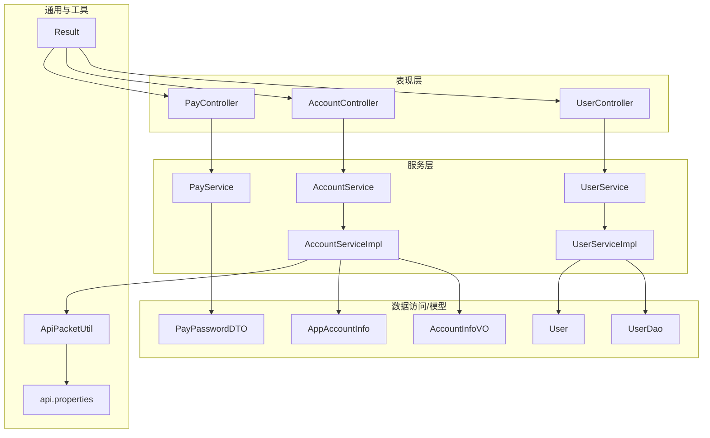
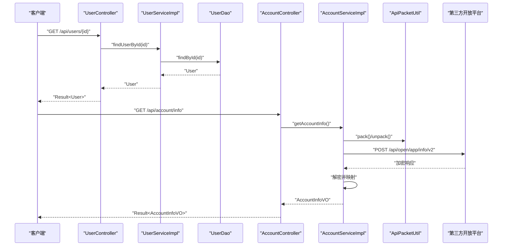
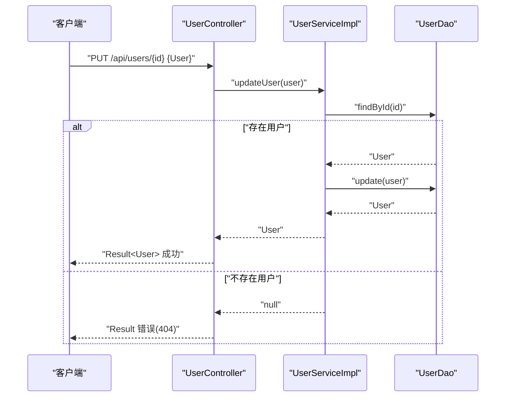
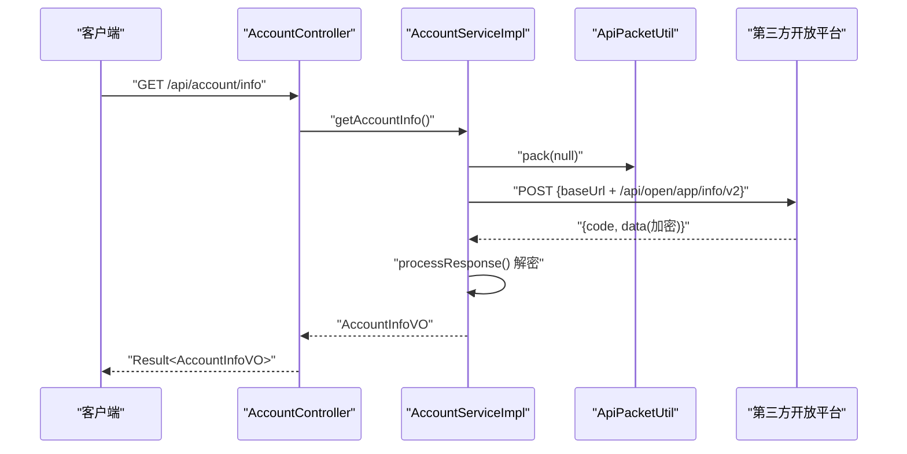
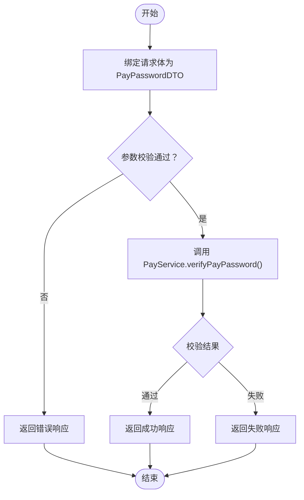
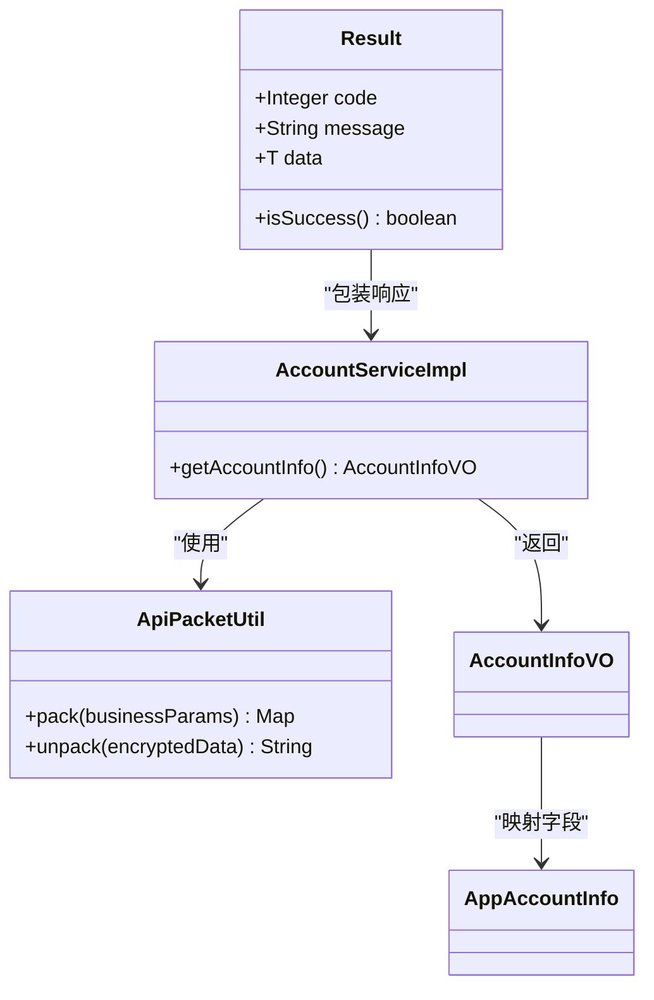
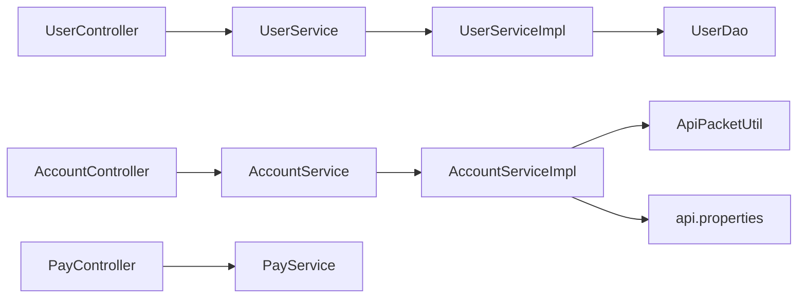

# 用户与账户 API

<cite>
**本文引用的文件**
- [UserController.java](file://src/main/java/cn/linkfast/controller/UserController.java)
- [AccountController.java](file://src/main/java/cn/linkfast/controller/AccountController.java)
- [PayController.java](file://src/main/java/cn/linkfast/controller/PayController.java)
- [UserService.java](file://src/main/java/cn/linkfast/service/UserService.java)
- [AccountService.java](file://src/main/java/cn/linkfast/service/AccountService.java)
- [PayService.java](file://src/main/java/cn/linkfast/service/PayService.java)
- [UserServiceImpl.java](file://src/main/java/cn/linkfast/service/impl/UserServiceImpl.java)
- [AccountServiceImpl.java](file://src/main/java/cn/linkfast/service/impl/AccountServiceImpl.java)
- [UserDao.java](file://src/main/java/cn/linkfast/dao/UserDao.java)
- [User.java](file://src/main/java/cn/linkfast/entity/User.java)
- [AccountInfoVO.java](file://src/main/java/cn/linkfast/vo/AccountInfoVO.java)
- [PayPasswordDTO.java](file://src/main/java/cn/linkfast/dto/PayPasswordDTO.java)
- [Result.java](file://src/main/java/cn/linkfast/common/Result.java)
- [ApiPacketUtil.java](file://src/main/java/cn/linkfast/utils/ApiPacketUtil.java)
- [AppAccountInfo.java](file://src/main/java/cn/linkfast/entity/AppAccountInfo.java)
- [api.properties](file://src/main/resources/api.properties)
- [test-api.http](file://test-api.http)
</cite>

## 目录
1. [简介](#简介)
2. [项目结构](#项目结构)
3. [核心组件](#核心组件)
4. [架构总览](#架构总览)
5. [详细组件分析](#详细组件分析)
6. [依赖分析](#依赖分析)
7. [性能考虑](#性能考虑)
8. [故障排查指南](#故障排查指南)
9. [结论](#结论)
10. [附录](#附录)

## 简介
本文件为“用户与账户”模块的 API 接口文档，覆盖以下能力：
- 用户信息管理：查询、创建、更新、删除
- 账户信息查询：余额与信用额度等
- 支付密码验证：校验用户支付密码
- 安全机制：请求加密、解密与签名（基于配置的密钥与 AES-CBC）
- 外部对接：通过统一工具类对接第三方开放平台接口

说明：
- 当前仓库未包含完整的“交易记录、账单管理、支付密码设置/修改”的后端实现；本文在“功能范围”与“流程说明”中明确标注缺失部分，以便后续扩展时参考。

## 项目结构
后端采用典型的分层架构：Controller -> Service -> DAO/Entity/VO/DTO，配合通用响应包装类与外部接口工具类。

图表来源
- [UserController.java:16-85](file://src/main/java/cn/linkfast/controller/UserController.java#L16-L85)
- [AccountController.java:11-24](file://src/main/java/cn/linkfast/controller/AccountController.java#L11-L24)
- [PayController.java:17-37](file://src/main/java/cn/linkfast/controller/PayController.java#L17-L37)
- [UserServiceImpl.java:15-55](file://src/main/java/cn/linkfast/service/impl/UserServiceImpl.java#L15-L55)
- [AccountServiceImpl.java:18-83](file://src/main/java/cn/linkfast/service/impl/AccountServiceImpl.java#L18-L83)
- [ApiPacketUtil.java:18-106](file://src/main/java/cn/linkfast/utils/ApiPacketUtil.java#L18-L106)
- [api.properties:1-31](file://src/main/resources/api.properties#L1-L31)

章节来源
- [UserController.java:16-85](file://src/main/java/cn/linkfast/controller/UserController.java#L16-L85)
- [AccountController.java:11-24](file://src/main/java/cn/linkfast/controller/AccountController.java#L11-L24)
- [PayController.java:17-37](file://src/main/java/cn/linkfast/controller/PayController.java#L17-L37)
- [UserServiceImpl.java:15-55](file://src/main/java/cn/linkfast/service/impl/UserServiceImpl.java#L15-L55)
- [AccountServiceImpl.java:18-83](file://src/main/java/cn/linkfast/service/impl/AccountServiceImpl.java#L18-L83)
- [ApiPacketUtil.java:18-106](file://src/main/java/cn/linkfast/utils/ApiPacketUtil.java#L18-L106)
- [api.properties:1-31](file://src/main/resources/api.properties#L1-L31)

## 核心组件
- 控制器层
  - 用户控制器：提供用户列表、详情、创建、更新、删除接口
  - 账户控制器：提供账户信息查询接口
  - 支付密码控制器：提供支付密码校验接口
- 服务层
  - 用户服务接口与实现：封装用户 CRUD 逻辑
  - 账户服务接口与实现：对接第三方开放平台，查询账户信息
  - 支付服务接口：定义支付密码校验契约（当前未见具体实现）
- 数据与模型
  - 用户实体、账户信息 VO、支付密码 DTO
- 工具与通用
  - 统一响应包装类
  - API 数据包工具类：负责请求打包、加密、解密与参数组装
  - 配置文件：环境、密钥、第三方接口路径

章节来源
- [UserController.java:16-85](file://src/main/java/cn/linkfast/controller/UserController.java#L16-L85)
- [AccountController.java:11-24](file://src/main/java/cn/linkfast/controller/AccountController.java#L11-L24)
- [PayController.java:17-37](file://src/main/java/cn/linkfast/controller/PayController.java#L17-L37)
- [UserService.java:9-35](file://src/main/java/cn/linkfast/service/UserService.java#L9-L35)
- [AccountService.java:5-7](file://src/main/java/cn/linkfast/service/AccountService.java#L5-L7)
- [PayService.java:8-17](file://src/main/java/cn/linkfast/service/PayService.java#L8-L17)
- [UserServiceImpl.java:15-55](file://src/main/java/cn/linkfast/service/impl/UserServiceImpl.java#L15-L55)
- [AccountServiceImpl.java:18-83](file://src/main/java/cn/linkfast/service/impl/AccountServiceImpl.java#L18-L83)
- [User.java:6-74](file://src/main/java/cn/linkfast/entity/User.java#L6-L74)
- [AccountInfoVO.java:6-15](file://src/main/java/cn/linkfast/vo/AccountInfoVO.java#L6-L15)
- [PayPasswordDTO.java:12-24](file://src/main/java/cn/linkfast/dto/PayPasswordDTO.java#L12-L24)
- [Result.java:10-59](file://src/main/java/cn/linkfast/common/Result.java#L10-L59)
- [ApiPacketUtil.java:18-106](file://src/main/java/cn/linkfast/utils/ApiPacketUtil.java#L18-L106)
- [api.properties:1-31](file://src/main/resources/api.properties#L1-L31)

## 架构总览
下图展示了用户与账户相关接口的端到端调用链路，包括请求进入、服务处理、外部接口调用与响应封装。

图表来源
- [UserController.java:36-45](file://src/main/java/cn/linkfast/controller/UserController.java#L36-L45)
- [UserServiceImpl.java:28-30](file://src/main/java/cn/linkfast/service/impl/UserServiceImpl.java#L28-L30)
- [UserDao.java:18-19](file://src/main/java/cn/linkfast/dao/UserDao.java#L18-L19)
- [AccountController.java:17-21](file://src/main/java/cn/linkfast/controller/AccountController.java#L17-L21)
- [AccountServiceImpl.java:44-64](file://src/main/java/cn/linkfast/service/impl/AccountServiceImpl.java#L44-L64)
- [ApiPacketUtil.java:58-92](file://src/main/java/cn/linkfast/utils/ApiPacketUtil.java#L58-L92)

## 详细组件分析

### 用户信息管理 API
- 功能范围
  - 查询所有用户
  - 按 ID 查询用户
  - 创建用户
  - 更新用户
  - 删除用户
- 请求与响应
  - 统一响应包装：成功时 code=200，失败时返回错误码与消息
  - 用户实体包含基础字段（用户名、邮箱、电话、年龄等）
- 错误处理
  - 未找到用户时返回 404 响应
- 安全与校验
  - 当前未见参数校验与鉴权逻辑，建议在控制器层增加参数校验与权限拦截

图表来源
- [UserController.java:60-70](file://src/main/java/cn/linkfast/controller/UserController.java#L60-L70)
- [UserServiceImpl.java:37-44](file://src/main/java/cn/linkfast/service/impl/UserServiceImpl.java#L37-L44)
- [UserDao.java:28-29](file://src/main/java/cn/linkfast/dao/UserDao.java#L28-L29)

章节来源
- [UserController.java:26-84](file://src/main/java/cn/linkfast/controller/UserController.java#L26-L84)
- [UserService.java:9-35](file://src/main/java/cn/linkfast/service/UserService.java#L9-L35)
- [UserServiceImpl.java:22-54](file://src/main/java/cn/linkfast/service/impl/UserServiceImpl.java#L22-L54)
- [UserDao.java:9-35](file://src/main/java/cn/linkfast/dao/UserDao.java#L9-L35)
- [User.java:6-74](file://src/main/java/cn/linkfast/entity/User.java#L6-L74)
- [Result.java:10-59](file://src/main/java/cn/linkfast/common/Result.java#L10-L59)

### 账户信息查询 API
- 功能范围
  - 查询账户信息（余额、信用额度等）
- 请求与响应
  - 返回值为账户信息 VO
- 外部对接
  - 通过 API 数据包工具类进行请求打包与响应解密
  - 依据环境配置选择生产或沙箱域名
- 错误处理
  - 异常捕获与日志记录，返回空以提示上层处理

图表来源
- [AccountController.java:17-21](file://src/main/java/cn/linkfast/controller/AccountController.java#L17-L21)
- [AccountServiceImpl.java:44-80](file://src/main/java/cn/linkfast/service/impl/AccountServiceImpl.java#L44-L80)
- [ApiPacketUtil.java:58-92](file://src/main/java/cn/linkfast/utils/ApiPacketUtil.java#L58-L92)
- [api.properties:25-31](file://src/main/resources/api.properties#L25-L31)

章节来源
- [AccountController.java:11-24](file://src/main/java/cn/linkfast/controller/AccountController.java#L11-L24)
- [AccountService.java:5-7](file://src/main/java/cn/linkfast/service/AccountService.java#L5-L7)
- [AccountServiceImpl.java:18-83](file://src/main/java/cn/linkfast/service/impl/AccountServiceImpl.java#L18-L83)
- [AccountInfoVO.java:6-15](file://src/main/java/cn/linkfast/vo/AccountInfoVO.java#L6-L15)
- [AppAccountInfo.java:13-50](file://src/main/java/cn/linkfast/entity/AppAccountInfo.java#L13-L50)
- [ApiPacketUtil.java:18-106](file://src/main/java/cn/linkfast/utils/ApiPacketUtil.java#L18-L106)
- [api.properties:1-31](file://src/main/resources/api.properties#L1-L31)

### 支付密码验证 API
- 功能范围
  - 校验用户输入的支付密码是否正确
- 请求与响应
  - 输入：支付密码 DTO（必填校验）
  - 输出：支付密码校验结果 VO
- 当前实现状态
  - 服务接口已定义，但未发现具体实现类；需补充实现以完成业务闭环

图表来源
- [PayController.java:30-34](file://src/main/java/cn/linkfast/controller/PayController.java#L30-L34)
- [PayService.java:16-16](file://src/main/java/cn/linkfast/service/PayService.java#L16-L16)
- [PayPasswordDTO.java:20-21](file://src/main/java/cn/linkfast/dto/PayPasswordDTO.java#L20-L21)

章节来源
- [PayController.java:17-37](file://src/main/java/cn/linkfast/controller/PayController.java#L17-L37)
- [PayService.java:8-17](file://src/main/java/cn/linkfast/service/PayService.java#L8-L17)
- [PayPasswordDTO.java:12-24](file://src/main/java/cn/linkfast/dto/PayPasswordDTO.java#L12-L24)

### 安全机制与数据加密
- 请求加密与解密
  - 使用 AES-CBC 对业务参数进行加密，Base64 编码后作为公共参数的一部分
  - 响应中的 data 字段同样采用 Base64 编码，需要解密后再解析为实体对象
- 密钥与初始化
  - 通过配置文件加载 appKey、appSecret，并按环境选择生产或沙箱密钥
  - 从 appSecret 中截取前 16 字节作为 AES IV
- 统一响应包装
  - 所有接口返回统一的 Result 结构，便于前端与网关侧统一处理

图表来源
- [ApiPacketUtil.java:18-106](file://src/main/java/cn/linkfast/utils/ApiPacketUtil.java#L18-L106)
- [AccountServiceImpl.java:18-83](file://src/main/java/cn/linkfast/service/impl/AccountServiceImpl.java#L18-L83)
- [Result.java:10-59](file://src/main/java/cn/linkfast/common/Result.java#L10-L59)
- [AccountInfoVO.java:6-15](file://src/main/java/cn/linkfast/vo/AccountInfoVO.java#L6-L15)
- [AppAccountInfo.java:13-50](file://src/main/java/cn/linkfast/entity/AppAccountInfo.java#L13-L50)

章节来源
- [ApiPacketUtil.java:18-106](file://src/main/java/cn/linkfast/utils/ApiPacketUtil.java#L18-L106)
- [AccountServiceImpl.java:44-80](file://src/main/java/cn/linkfast/service/impl/AccountServiceImpl.java#L44-L80)
- [Result.java:10-59](file://src/main/java/cn/linkfast/common/Result.java#L10-L59)
- [api.properties:1-31](file://src/main/resources/api.properties#L1-L31)

## 依赖分析
- 控制器与服务
  - 控制器仅依赖服务接口，降低耦合
  - 服务实现依赖 DAO 或外部工具类
- 外部依赖
  - 账户服务依赖第三方开放平台接口与配置文件
  - 加密工具依赖配置文件中的密钥与路径
- 可能的改进点
  - 支付密码服务缺少实现，建议新增实现类并接入安全存储
  - 用户控制器可增加参数校验注解与权限拦截

图表来源
- [UserController.java:16-85](file://src/main/java/cn/linkfast/controller/UserController.java#L16-L85)
- [UserService.java:9-35](file://src/main/java/cn/linkfast/service/UserService.java#L9-L35)
- [UserServiceImpl.java:15-55](file://src/main/java/cn/linkfast/service/impl/UserServiceImpl.java#L15-L55)
- [UserDao.java:9-35](file://src/main/java/cn/linkfast/dao/UserDao.java#L9-L35)
- [AccountController.java:11-24](file://src/main/java/cn/linkfast/controller/AccountController.java#L11-L24)
- [AccountService.java:5-7](file://src/main/java/cn/linkfast/service/AccountService.java#L5-L7)
- [AccountServiceImpl.java:18-83](file://src/main/java/cn/linkfast/service/impl/AccountServiceImpl.java#L18-L83)
- [ApiPacketUtil.java:18-106](file://src/main/java/cn/linkfast/utils/ApiPacketUtil.java#L18-L106)
- [api.properties:1-31](file://src/main/resources/api.properties#L1-L31)
- [PayController.java:17-37](file://src/main/java/cn/linkfast/controller/PayController.java#L17-L37)
- [PayService.java:8-17](file://src/main/java/cn/linkfast/service/PayService.java#L8-L17)

章节来源
- [UserController.java:16-85](file://src/main/java/cn/linkfast/controller/UserController.java#L16-L85)
- [AccountController.java:11-24](file://src/main/java/cn/linkfast/controller/AccountController.java#L11-L24)
- [PayController.java:17-37](file://src/main/java/cn/linkfast/controller/PayController.java#L17-L37)
- [UserServiceImpl.java:15-55](file://src/main/java/cn/linkfast/service/impl/UserServiceImpl.java#L15-L55)
- [AccountServiceImpl.java:18-83](file://src/main/java/cn/linkfast/service/impl/AccountServiceImpl.java#L18-L83)
- [ApiPacketUtil.java:18-106](file://src/main/java/cn/linkfast/utils/ApiPacketUtil.java#L18-L106)
- [api.properties:1-31](file://src/main/resources/api.properties#L1-L31)

## 性能考虑
- 建议
  - 对高频查询接口增加缓存策略（如 Redis），减少重复调用第三方接口
  - 对外部接口调用设置超时与重试策略，避免阻塞线程
  - 对大字段（如加密响应）避免不必要的序列化/反序列化
  - 在服务层对批量操作进行分页与限流控制

## 故障排查指南
- 常见问题定位
  - 统一响应 code 非 200：检查控制器与服务层返回包装
  - 账户信息为空：确认环境配置与第三方接口返回状态
  - 支付密码校验失败：确认 DTO 参数校验与服务实现是否完善
- 日志与监控
  - 账户服务在解密失败或异常时会记录错误日志，便于定位
  - 建议在网关或过滤器层增加请求追踪 ID，便于跨服务串联

章节来源
- [Result.java:10-59](file://src/main/java/cn/linkfast/common/Result.java#L10-L59)
- [AccountServiceImpl.java:54-63](file://src/main/java/cn/linkfast/service/impl/AccountServiceImpl.java#L54-L63)
- [PayController.java:30-34](file://src/main/java/cn/linkfast/controller/PayController.java#L30-L34)

## 结论
- 本模块已完成用户信息管理与账户信息查询的核心接口，具备统一响应与安全加密能力
- 支付密码验证接口已定义契约，建议尽快补齐实现以完善安全闭环
- 后续可在用户控制器增加参数校验与鉴权、在支付服务中引入安全存储与风控策略

## 附录

### 接口清单与规范

- 用户信息管理
  - GET /api/users：查询所有用户
  - GET /api/users/{id}：按 ID 查询用户
  - POST /api/users：创建用户
  - PUT /api/users/{id}：更新用户
  - DELETE /api/users/{id}：删除用户
- 账户信息查询
  - GET /api/account/info：查询账户信息（余额、信用额度等）
- 支付密码验证
  - POST /api/pay/verify：校验支付密码

章节来源
- [UserController.java:26-84](file://src/main/java/cn/linkfast/controller/UserController.java#L26-L84)
- [AccountController.java:17-21](file://src/main/java/cn/linkfast/controller/AccountController.java#L17-L21)
- [PayController.java:30-34](file://src/main/java/cn/linkfast/controller/PayController.java#L30-L34)

### 配置项说明
- 环境与密钥
  - 环境：prod/sandbox
  - appKey/appSecret：区分生产与沙箱
- 第三方接口路径
  - 应用信息：/api/open/app/info/v2
  - 其他路径详见配置文件

章节来源
- [api.properties:1-31](file://src/main/resources/api.properties#L1-L31)

### 示例请求
- 获取代理产品列表（示例）
  - GET /api/proxy-product/list?countryCode=US&cityCode=NY&page=1&pageSize=10

章节来源
- [test-api.http:1-3](file://test-api.http#L1-L3)