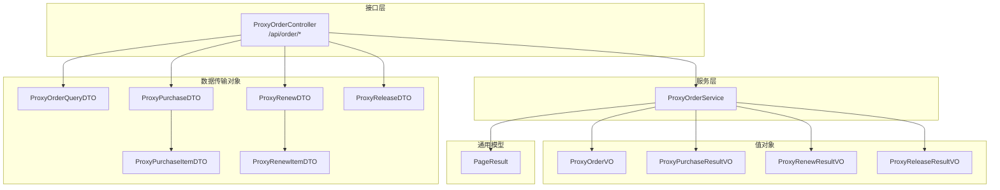
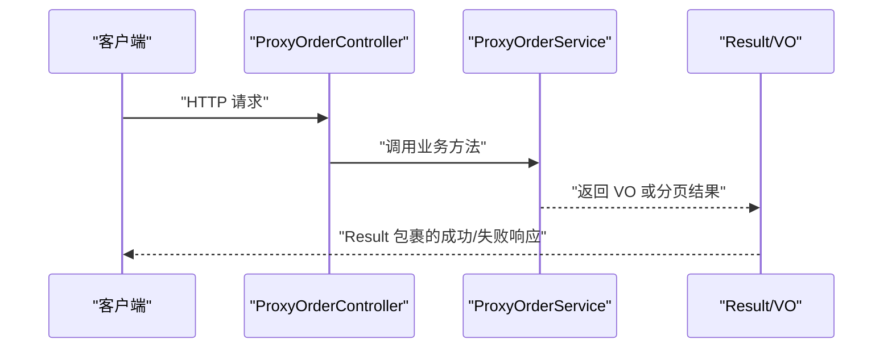
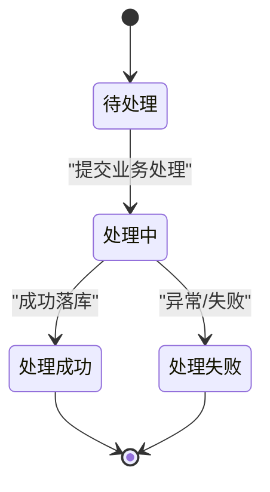
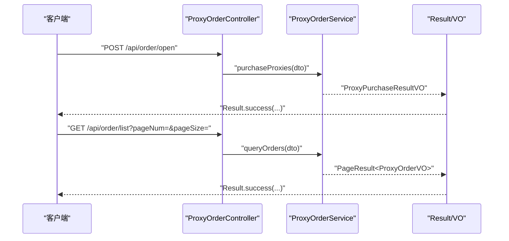
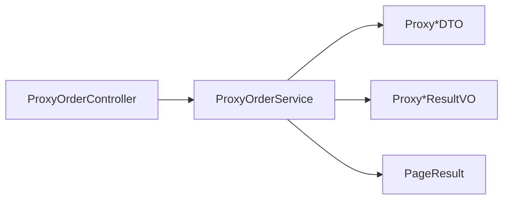

# 订单管理 API

<cite>
**本文引用的文件**
- [ProxyOrderController.java](file://src/main/java/cn/linkfast/controller/ProxyOrderController.java)
- [ProxyOrderService.java](file://src/main/java/cn/linkfast/service/ProxyOrderService.java)
- [ProxyOrderQueryDTO.java](file://src/main/java/cn/linkfast/dto/ProxyOrderQueryDTO.java)
- [ProxyPurchaseDTO.java](file://src/main/java/cn/linkfast/dto/ProxyPurchaseDTO.java)
- [ProxyRenewDTO.java](file://src/main/java/cn/linkfast/dto/ProxyRenewDTO.java)
- [ProxyReleaseDTO.java](file://src/main/java/cn/linkfast/dto/ProxyReleaseDTO.java)
- [ProxyPurchaseItemDTO.java](file://src/main/java/cn/linkfast/dto/ProxyPurchaseItemDTO.java)
- [ProxyRenewItemDTO.java](file://src/main/java/cn/linkfast/dto/ProxyRenewItemDTO.java)
- [ProxyOrderVO.java](file://src/main/java/cn/linkfast/vo/ProxyOrderVO.java)
- [ProxyPurchaseResultVO.java](file://src/main/java/cn/linkfast/vo/ProxyPurchaseResultVO.java)
- [ProxyRenewResultVO.java](file://src/main/java/cn/linkfast/vo/ProxyRenewResultVO.java)
- [ProxyReleaseResultVO.java](file://src/main/java/cn/linkfast/vo/ProxyReleaseResultVO.java)
- [PageResult.java](file://src/main/java/cn/linkfast/common/PageResult.java)
- [ProxyOrder.java](file://src/main/java/cn/linkfast/entity/ProxyOrder.java)
</cite>

## 目录
1. [简介](#简介)
2. [项目结构](#项目结构)
3. [核心组件](#核心组件)
4. [架构概览](#架构概览)
5. [详细组件分析](#详细组件分析)
6. [依赖分析](#依赖分析)
7. [性能考虑](#性能考虑)
8. [故障排查指南](#故障排查指南)
9. [结论](#结论)
10. [附录](#附录)

## 简介
本文件为“订单管理模块”的 API 接口文档，覆盖订单查询、代理购买、续费代理与释放代理等核心能力。文档从接口定义、请求/响应结构、参数校验、状态流转、错误处理到最佳实践进行系统化说明，并提供端到端的订单生命周期流程图，帮助开发者快速集成与排障。

## 项目结构
围绕订单管理的接口层、服务层、数据传输对象（DTO）、值对象（VO）与通用分页模型如下：

图表来源
- [ProxyOrderController.java:26-85](file://src/main/java/cn/linkfast/controller/ProxyOrderController.java#L26-L85)
- [ProxyOrderService.java:14-60](file://src/main/java/cn/linkfast/service/ProxyOrderService.java#L14-L60)
- [ProxyOrderQueryDTO.java:18-57](file://src/main/java/cn/linkfast/dto/ProxyOrderQueryDTO.java#L18-L57)
- [ProxyPurchaseDTO.java:9-22](file://src/main/java/cn/linkfast/dto/ProxyPurchaseDTO.java#L9-L22)
- [ProxyRenewDTO.java:12-27](file://src/main/java/cn/linkfast/dto/ProxyRenewDTO.java#L12-L27)
- [ProxyReleaseDTO.java:12-27](file://src/main/java/cn/linkfast/dto/ProxyReleaseDTO.java#L12-L27)
- [ProxyPurchaseItemDTO.java:8-25](file://src/main/java/cn/linkfast/dto/ProxyPurchaseItemDTO.java#L8-L25)
- [ProxyRenewItemDTO.java:12-19](file://src/main/java/cn/linkfast/dto/ProxyRenewItemDTO.java#L12-L19)
- [ProxyOrderVO.java:13-47](file://src/main/java/cn/linkfast/vo/ProxyOrderVO.java#L13-L47)
- [ProxyPurchaseResultVO.java:5-13](file://src/main/java/cn/linkfast/vo/ProxyPurchaseResultVO.java#L5-L13)
- [ProxyRenewResultVO.java:12-20](file://src/main/java/cn/linkfast/vo/ProxyRenewResultVO.java#L12-L20)
- [ProxyReleaseResultVO.java:14-21](file://src/main/java/cn/linkfast/vo/ProxyReleaseResultVO.java#L14-L21)
- [PageResult.java:14-37](file://src/main/java/cn/linkfast/common/PageResult.java#L14-L37)

章节来源
- [ProxyOrderController.java:26-85](file://src/main/java/cn/linkfast/controller/ProxyOrderController.java#L26-L85)
- [ProxyOrderService.java:14-60](file://src/main/java/cn/linkfast/service/ProxyOrderService.java#L14-L60)
- [PageResult.java:14-37](file://src/main/java/cn/linkfast/common/PageResult.java#L14-L37)

## 核心组件
- 控制器：提供订单查询、购买、续费、释放四个对外接口，统一返回 Result 包裹的业务结果或分页数据。
- 服务接口：定义订单查询、购买、续费、释放、按渠道商订单号查询、同步订单详情等契约。
- DTO/VO：承载请求参数、响应结果与分页容器，确保前后端契约清晰。
- 实体：订单主表及明细集合映射，用于持久化与跨层传递。

章节来源
- [ProxyOrderController.java:26-85](file://src/main/java/cn/linkfast/controller/ProxyOrderController.java#L26-L85)
- [ProxyOrderService.java:14-60](file://src/main/java/cn/linkfast/service/ProxyOrderService.java#L14-L60)
- [ProxyOrder.java:17-45](file://src/main/java/cn/linkfast/entity/ProxyOrder.java#L17-L45)

## 架构概览
下图展示订单管理的典型调用链路与数据流：

图表来源
- [ProxyOrderController.java:36-83](file://src/main/java/cn/linkfast/controller/ProxyOrderController.java#L36-L83)
- [ProxyOrderService.java:26-60](file://src/main/java/cn/linkfast/service/ProxyOrderService.java#L26-L60)

## 详细组件分析

### 接口清单与规范

- 获取订单列表（分页）
  - 方法与路径：GET /api/order/list
  - 功能：分页查询订单列表，支持按状态、订单号、订单类型过滤
  - 请求参数（ProxyOrderQueryDTO）
    - pageNum：必填，最小值 1
    - pageSize：必填，最小值 1，最大值 100
    - status：可选，订单状态
    - orderNo：可选，平台订单号
    - orderType：可选，订单类型
  - 响应：Result<PageResult<ProxyOrderVO>>
  - 错误处理：参数校验失败返回参数错误；业务异常捕获并返回友好提示
  - 示例请求
    - GET /api/order/list?pageNum=1&pageSize=20&status=3&orderType=1
  - 示例响应
    - {
        "code": 0,
        "message": "success",
        "data": {
          "total": 100,
          "totalPages": 5,
          "pageNum": 1,
          "pageSize": 20,
          "list": [
            { "orderNo": "...", "orderType": 1, "amount": 100.00, "instanceTotal": 1, "userId": 1001, "createTime": "..." },
            ...
          ]
        }
      }

- 创建代理购买订单
  - 方法与路径：POST /api/order/open
  - 功能：根据购买明细创建购买订单
  - 请求参数（ProxyPurchaseDTO）
    - payPassword：必填，支付密码
    - totalQuantity：必填，购买总数量
    - params：必填，购买明细列表（ProxyPurchaseItemDTO）
      - productNo：必填，产品编号
      - proxyType：必填，代理类型
      - countryCode/stateCode/cityCode：可选，地理区域编码
      - unit/duration/count/cycleTimes：可选，时长单位、时长、数量、周期次数
  - 响应：Result<ProxyPurchaseResultVO>
    - appOrderNo：渠道商订单号
    - orderNo：平台订单号
    - status：订单状态
    - amount：订单金额
  - 错误处理：参数校验失败返回参数错误；业务异常捕获并返回友好提示
  - 示例请求
    - {
        "payPassword": "xxx",
        "totalQuantity": 1,
        "params": [
          {
            "productNo": "P001",
            "proxyType": 1,
            "countryCode": "CN",
            "stateCode": "SH",
            "cityCode": "SH",
            "unit": 3,
            "duration": 1,
            "count": 1,
            "cycleTimes": 1
          }
        ]
      }
  - 示例响应
    - {
        "code": 0,
        "message": "success",
        "data": { "appOrderNo": "...", "orderNo": "...", "status": 1, "amount": 100.00 }
      }

- 代理续费
  - 方法与路径：POST /api/order/renew
  - 功能：对指定实例进行续费
  - 请求参数（ProxyRenewDTO）
    - payPassword：必填，支付密码
    - items：必填，至少一项（ProxyRenewItemDTO）
      - instanceNo：实例编号
      - duration：续费时长
      - unit：时长单位
      - cycleTimes：周期次数
  - 响应：Result<ProxyRenewResultVO>
    - appOrderNo：渠道商订单号
    - orderNo：平台订单号
    - status：订单状态
    - amount：订单金额
  - 错误处理：业务异常捕获并返回友好提示；未知异常兜底提示
  - 示例请求
    - {
        "payPassword": "xxx",
        "items": [
          { "instanceNo": "I001", "duration": 1, "unit": 3, "cycleTimes": 1 }
        ]
      }
  - 示例响应
    - {
        "code": 0,
        "message": "success",
        "data": { "appOrderNo": "...", "orderNo": "...", "status": 1, "amount": 100.00 }
      }

- 释放代理实例
  - 方法与路径：POST /api/order/release
  - 功能：释放指定平台实例编号的代理
  - 请求参数（ProxyReleaseDTO）
    - payPassword：必填，支付密码
    - instanceNos：必填，至少一个平台实例编号列表
  - 响应：Result<ProxyReleaseResultVO>
    - appOrderNo：渠道商订单号
    - orderNo：平台订单号
    - status：订单状态
    - amount：订单金额
  - 错误处理：业务异常捕获并返回友好提示；未知异常兜底提示
  - 示例请求
    - {
        "payPassword": "xxx",
        "instanceNos": ["I001", "I002"]
      }
  - 示例响应
    - {
        "code": 0,
        "message": "success",
        "data": { "appOrderNo": "...", "orderNo": "...", "status": 1, "amount": 100.00 }
      }

章节来源
- [ProxyOrderController.java:36-83](file://src/main/java/cn/linkfast/controller/ProxyOrderController.java#L36-L83)
- [ProxyOrderQueryDTO.java:18-57](file://src/main/java/cn/linkfast/dto/ProxyOrderQueryDTO.java#L18-L57)
- [ProxyPurchaseDTO.java:9-22](file://src/main/java/cn/linkfast/dto/ProxyPurchaseDTO.java#L9-L22)
- [ProxyRenewDTO.java:12-27](file://src/main/java/cn/linkfast/dto/ProxyRenewDTO.java#L12-L27)
- [ProxyReleaseDTO.java:12-27](file://src/main/java/cn/linkfast/dto/ProxyReleaseDTO.java#L12-L27)
- [ProxyPurchaseItemDTO.java:8-25](file://src/main/java/cn/linkfast/dto/ProxyPurchaseItemDTO.java#L8-L25)
- [ProxyRenewItemDTO.java:12-19](file://src/main/java/cn/linkfast/dto/ProxyRenewItemDTO.java#L12-L19)
- [ProxyOrderVO.java:13-47](file://src/main/java/cn/linkfast/vo/ProxyOrderVO.java#L13-L47)
- [ProxyPurchaseResultVO.java:5-13](file://src/main/java/cn/linkfast/vo/ProxyPurchaseResultVO.java#L5-L13)
- [ProxyRenewResultVO.java:12-20](file://src/main/java/cn/linkfast/vo/ProxyRenewResultVO.java#L12-L20)
- [ProxyReleaseResultVO.java:14-21](file://src/main/java/cn/linkfast/vo/ProxyReleaseResultVO.java#L14-L21)

### 参数校验与业务约束
- 分页查询
  - pageNum/pageSize 必填且有上下界限制；orderNo/orderType/status 可选
- 购买订单
  - payPassword/totalQuantity 必填；params 至少一项；每项 productNo、proxyType 必填
- 续费订单
  - payPassword 必填；items 至少一项；每项 instanceNo、duration、unit、cycleTimes 可选但需满足业务约束
- 释放订单
  - payPassword 必填；instanceNos 至少一项

章节来源
- [ProxyOrderQueryDTO.java:32-42](file://src/main/java/cn/linkfast/dto/ProxyOrderQueryDTO.java#L32-L42)
- [ProxyPurchaseDTO.java:11-18](file://src/main/java/cn/linkfast/dto/ProxyPurchaseDTO.java#L11-L18)
- [ProxyRenewDTO.java:18-25](file://src/main/java/cn/linkfast/dto/ProxyRenewDTO.java#L18-L25)
- [ProxyReleaseDTO.java:18-25](file://src/main/java/cn/linkfast/dto/ProxyReleaseDTO.java#L18-L25)

### 订单状态与流转（概念性说明）
- 订单状态（示意）
  - 1=待处理、2=处理中、3=处理成功、4=处理失败、5=部分完成
- 流程要点
  - 创建购买/续费/释放订单后进入待处理；服务层执行业务后进入处理中；最终落库成功为处理成功，异常则为处理失败
  - 事务控制由服务层注解声明，业务异常可配置不回滚

（本图为概念性说明，不直接映射具体源码）

### 数据模型与序列化
- 订单实体（ProxyOrder）
  - 关键字段：orderNo、appOrderNo、userId、type、status、totalQuantity、amount、hasRefund、instanceTotal、createTime、updateTime
  - 关联集合：instances、purchaseItems、renewItems、releaseOrderItems
- 订单列表 VO（ProxyOrderVO）
  - 关键字段：orderNo、orderType、amount、instanceTotal、userId、createTime

章节来源
- [ProxyOrder.java:17-45](file://src/main/java/cn/linkfast/entity/ProxyOrder.java#L17-L45)
- [ProxyOrderVO.java:13-47](file://src/main/java/cn/linkfast/vo/ProxyOrderVO.java#L13-L47)

### 错误处理机制
- 控制器层
  - 参数校验失败：由 Spring 校验框架拦截并返回参数错误
  - 业务异常（BusinessException）：捕获后返回 Result.error(message)
  - 未知异常：兜底错误消息
- 服务层
  - 续费/释放使用带 noRollbackFor 的事务注解，允许业务异常不回滚

章节来源
- [ProxyOrderController.java:55-83](file://src/main/java/cn/linkfast/controller/ProxyOrderController.java#L55-L83)
- [ProxyOrderService.java:41-51](file://src/main/java/cn/linkfast/service/ProxyOrderService.java#L41-L51)

### 订单生命周期流程（端到端）
以下序列图展示从创建购买订单到查询列表的完整流程：

图表来源
- [ProxyOrderController.java:44-39](file://src/main/java/cn/linkfast/controller/ProxyOrderController.java#L44-L39)
- [ProxyOrderService.java:26-31](file://src/main/java/cn/linkfast/service/ProxyOrderService.java#L26-L31)

## 依赖分析
- 控制器依赖服务接口，通过构造注入实现解耦
- DTO/VO 作为跨层契约，避免直接暴露实体
- 服务接口声明事务语义，明确业务异常是否回滚
- 分页模型 PageResult 作为通用容器，减少重复封装

图表来源
- [ProxyOrderController.java:26-85](file://src/main/java/cn/linkfast/controller/ProxyOrderController.java#L26-L85)
- [ProxyOrderService.java:14-60](file://src/main/java/cn/linkfast/service/ProxyOrderService.java#L14-L60)
- [PageResult.java:14-37](file://src/main/java/cn/linkfast/common/PageResult.java#L14-L37)

章节来源
- [ProxyOrderController.java:26-85](file://src/main/java/cn/linkfast/controller/ProxyOrderController.java#L26-L85)
- [ProxyOrderService.java:14-60](file://src/main/java/cn/linkfast/service/ProxyOrderService.java#L14-L60)
- [PageResult.java:14-37](file://src/main/java/cn/linkfast/common/PageResult.java#L14-L37)

## 性能考虑
- 分页参数上限控制：pageSize 最大 100，避免超大数据量一次性返回
- 批量操作：购买/续费/释放均支持列表参数，建议前端按需聚合，减少网络往返
- 异步处理建议：对于耗时较长的续费/释放，可在服务层引入异步任务与状态轮询，避免阻塞请求线程
- 缓存策略：对高频查询（如订单状态统计）可引入缓存，降低数据库压力
- 日志与监控：对关键业务（支付密码校验、实例编号校验）增加埋点与告警

（本节为通用建议，不直接分析具体源码）

## 故障排查指南
- 参数校验失败
  - 现象：返回参数错误
  - 排查：确认必填字段、数值范围、列表非空
- 业务异常
  - 现象：Result.error(message)，日志输出业务异常信息
  - 排查：查看服务层抛出的 BusinessException 消息，定位业务规则触发点
- 未知异常
  - 现象：兜底错误消息
  - 排查：检查服务层未捕获异常、外部依赖超时或失败
- 续费/释放失败
  - 现象：状态停留在待处理或失败
  - 排查：核对实例编号是否存在、支付密码是否正确、是否有足够余额

章节来源
- [ProxyOrderController.java:55-83](file://src/main/java/cn/linkfast/controller/ProxyOrderController.java#L55-L83)

## 结论
订单管理模块以清晰的 DTO/VO 契约与严格的参数校验为基础，结合服务层事务与错误处理机制，提供了稳定可靠的订单生命周期管理能力。建议在生产环境中配合异步处理、缓存与监控体系，持续优化用户体验与系统稳定性。

## 附录
- 响应通用结构
  - 成功：{ "code": 0, "message": "success", "data": ... }
  - 失败：{ "code": 非0, "message": "错误描述", "data": null }
- 常见状态码约定
  - 0：成功
  - 非0：失败（具体含义由后端定义）

（本节为通用说明，不直接分析具体源码）