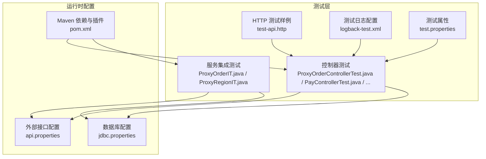
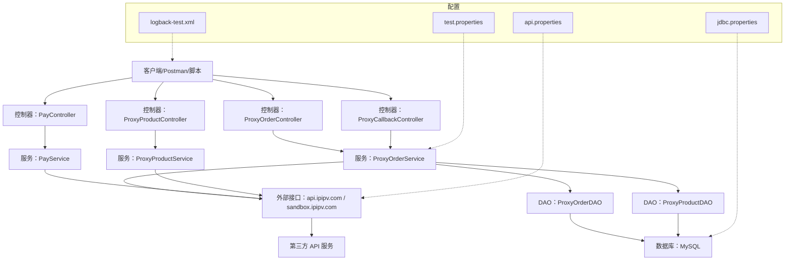
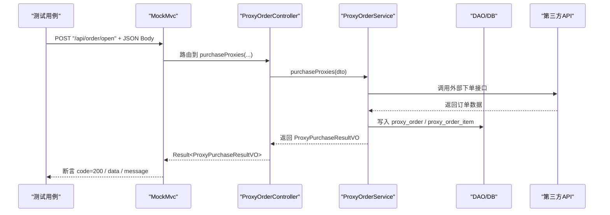
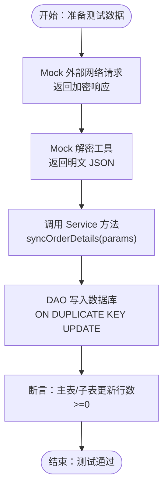
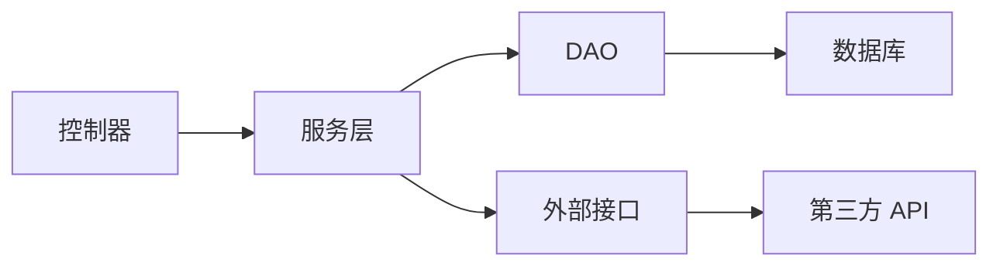

# API 测试

<cite>
**本文引用的文件**
- [README.md](file://README.md)
- [pom.xml](file://pom.xml)
- [test-api.http](file://test-api.http)
- [src/main/resources/api.properties](file://src/main/resources/api.properties)
- [src/main/resources/jdbc.properties](file://src/main/resources/jdbc.properties)
- [src/test/resources/test.properties](file://src/test/resources/test.properties)
- [src/test/resources/logback-test.xml](file://src/test/resources/logback-test.xml)
- [src/main/java/cn/linkfast/controller/ProxyOrderController.java](file://src/main/java/cn/linkfast/controller/ProxyOrderController.java)
- [src/test/java/cn/linkfast/controller/ProxyOrderControllerTest.java](file://src/test/java/cn/linkfast/controller/ProxyOrderControllerTest.java)
- [src/test/java/cn/linkfast/controller/PayControllerTest.java](file://src/test/java/cn/linkfast/controller/PayControllerTest.java)
- [src/test/java/cn/linkfast/controller/ProxyCallbackControllerTest.java](file://src/test/java/cn/linkfast/controller/ProxyCallbackControllerTest.java)
- [src/test/java/cn/linkfast/controller/ProxyProductControllerTest.java](file://src/test/java/cn/linkfast/controller/ProxyProductControllerTest.java)
- [src/test/java/cn/linkfast/service/Impl/ProxyOrderIT.java](file://src/test/java/cn/linkfast/service/Impl/ProxyOrderIT.java)
- [src/test/java/cn/linkfast/service/Impl/ProxyRegionIT.java](file://src/test/java/cn/linkfast/service/Impl/ProxyRegionIT.java)
- [docs/database/region.sql](file://docs/database/region.sql)
</cite>

## 目录
1. [简介](#简介)
2. [项目结构](#项目结构)
3. [核心组件](#核心组件)
4. [架构总览](#架构总览)
5. [详细组件分析](#详细组件分析)
6. [依赖分析](#依赖分析)
7. [性能考虑](#性能考虑)
8. [故障排查指南](#故障排查指南)
9. [结论](#结论)
10. [附录](#附录)

## 简介
本文件面向 Link-Fast 项目的 API 测试，提供从测试设计、Postman 集合说明、参数化与数据驱动、自动化脚本、测试环境与数据准备、性能与压力测试、测试报告与覆盖率统计、到持续集成与自动化流水线的完整方案。内容基于仓库现有测试用例与配置进行提炼与扩展，帮助测试工程师快速落地高质量的 API 测试。

## 项目结构
- 测试相关的关键位置：
  - 接口测试样例：test-api.http
  - Spring MVC 单元/集成测试：src/test/java/cn/linkfast/controller 与 src/test/java/cn/linkfast/service/Impl
  - 测试配置：src/test/resources/test.properties、logback-test.xml
  - 外部接口配置：src/main/resources/api.properties
  - 数据库连接配置：src/main/resources/jdbc.properties
  - Maven 插件与依赖：pom.xml
  - 数据库初始化脚本：docs/database/region.sql

图表来源
- [test-api.http:1-3](file://test-api.http#L1-L3)
- [src/test/java/cn/linkfast/controller/ProxyOrderControllerTest.java:1-323](file://src/test/java/cn/linkfast/controller/ProxyOrderControllerTest.java#L1-L323)
- [src/test/java/cn/linkfast/controller/PayControllerTest.java:1-89](file://src/test/java/cn/linkfast/controller/PayControllerTest.java#L1-L89)
- [src/test/java/cn/linkfast/service/Impl/ProxyOrderIT.java:1-178](file://src/test/java/cn/linkfast/service/Impl/ProxyOrderIT.java#L1-L178)
- [src/test/java/cn/linkfast/service/Impl/ProxyRegionIT.java:1-87](file://src/test/java/cn/linkfast/service/Impl/ProxyRegionIT.java#L1-L87)
- [src/test/resources/logback-test.xml:1-49](file://src/test/resources/logback-test.xml#L1-L49)
- [src/test/resources/test.properties:1-3](file://src/test/resources/test.properties#L1-L3)
- [src/main/resources/api.properties:1-31](file://src/main/resources/api.properties#L1-L31)
- [src/main/resources/jdbc.properties:1-39](file://src/main/resources/jdbc.properties#L1-L39)
- [pom.xml:1-278](file://pom.xml#L1-L278)

章节来源
- [README.md:1-1](file://README.md#L1-L1)
- [pom.xml:1-278](file://pom.xml#L1-L278)
- [test-api.http:1-3](file://test-api.http#L1-L3)
- [src/test/resources/test.properties:1-3](file://src/test/resources/test.properties#L1-L3)
- [src/test/resources/logback-test.xml:1-49](file://src/test/resources/logback-test.xml#L1-L49)
- [src/main/resources/api.properties:1-31](file://src/main/resources/api.properties#L1-L31)
- [src/main/resources/jdbc.properties:1-39](file://src/main/resources/jdbc.properties#L1-L39)

## 核心组件
- 接口测试样例：提供基础的 GET/POST 请求示例，便于 Postman 导入与手工验证。
- 控制器测试：基于 Spring MVC Test 与 MockMvc，覆盖参数校验、错误场景、以及与第三方的真实交互。
- 服务集成测试：通过 Spy/Mock 与真实 DAO/Service 的组合，验证订单同步、地域树同步等端到端流程。
- 测试配置：禁用定时任务、自定义测试日志输出路径、以及测试环境下的外部接口开关。
- Maven 插件：集成测试插件用于执行 IT 类，统一构建与测试生命周期。

章节来源
- [test-api.http:1-3](file://test-api.http#L1-L3)
- [src/test/java/cn/linkfast/controller/ProxyOrderControllerTest.java:1-323](file://src/test/java/cn/linkfast/controller/ProxyOrderControllerTest.java#L1-L323)
- [src/test/java/cn/linkfast/controller/PayControllerTest.java:1-89](file://src/test/java/cn/linkfast/controller/PayControllerTest.java#L1-L89)
- [src/test/java/cn/linkfast/service/Impl/ProxyOrderIT.java:1-178](file://src/test/java/cn/linkfast/service/Impl/ProxyOrderIT.java#L1-L178)
- [src/test/java/cn/linkfast/service/Impl/ProxyRegionIT.java:1-87](file://src/test/java/cn/linkfast/service/Impl/ProxyRegionIT.java#L1-L87)
- [src/test/resources/test.properties:1-3](file://src/test/resources/test.properties#L1-L3)
- [src/test/resources/logback-test.xml:1-49](file://src/test/resources/logback-test.xml#L1-L49)
- [pom.xml:252-274](file://pom.xml#L252-L274)

## 架构总览
下图展示 API 测试在系统中的位置与依赖关系，包括控制器、服务层、DAO 层、外部接口与数据库。

图表来源
- [src/main/java/cn/linkfast/controller/ProxyOrderController.java:1-86](file://src/main/java/cn/linkfast/controller/ProxyOrderController.java#L1-L86)
- [src/main/resources/api.properties:1-31](file://src/main/resources/api.properties#L1-L31)
- [src/main/resources/jdbc.properties:1-39](file://src/main/resources/jdbc.properties#L1-L39)
- [src/test/resources/test.properties:1-3](file://src/test/resources/test.properties#L1-L3)
- [src/test/resources/logback-test.xml:1-49](file://src/test/resources/logback-test.xml#L1-L49)

## 详细组件分析

### Postman 测试集合设计与最佳实践
- 设计思路
  - 分层组织：按模块划分集合（订单、支付、产品、回调、地域），每个集合包含环境变量与预请求脚本。
  - 参数化：使用环境变量 countryCode、cityCode、pageNum、pageSize、payPassword 等，支持多环境切换。
  - 数据驱动：通过 CSV/JSON 文件批量导入不同入参，覆盖边界与异常场景。
  - 自动化：结合 Newman 或内置脚本，执行断言与提取变量，形成可重复的回归套件。
- 请求参数配置
  - 订单创建：校验 payPassword、orderType、totalQuantity、params 列表的必填与格式。
  - 续费/释放：校验 instanceNo、unit、duration、cycleTimes 等字段。
  - 产品列表：pageNum/pageSize 必填，countryCode/cityCode 可选。
  - 支付密码校验：仅校验 payPassword 字段。
- 响应验证
  - HTTP 状态码：200 正常，400/参数错误，5xx 异常。
  - 业务字段：code=200、data、message、分页 total、订单号、实例号、金额等。
  - 结果一致性：与数据库落库状态、第三方回调回写结果保持一致。

章节来源
- [test-api.http:1-3](file://test-api.http#L1-L3)
- [src/test/java/cn/linkfast/controller/ProxyOrderControllerTest.java:56-102](file://src/test/java/cn/linkfast/controller/ProxyOrderControllerTest.java#L56-L102)
- [src/test/java/cn/linkfast/controller/PayControllerTest.java:48-86](file://src/test/java/cn/linkfast/controller/PayControllerTest.java#L48-L86)
- [src/test/java/cn/linkfast/controller/ProxyProductControllerTest.java:47-98](file://src/test/java/cn/linkfast/controller/ProxyProductControllerTest.java#L47-L98)

### 控制器测试（MockMvc）与断言策略
- 订单创建（/api/order/open）
  - 缺少请求体/空 JSON：期望 code=400，message 存在。
  - 缺少支付密码：参数校验失败，code=400。
  - 错误支付密码：返回 400，message 存在。
  - params 为空：业务异常，返回错误。
  - 完整合法参数：集成测试，期望返回 ProxyPurchaseResultVO，包含 appOrderNo、orderNo、status、amount。
- 续费（/api/order/renew）
  - 全链路集成测试：断言订单主表与明细表落库、第三方接口响应、回写 orderNo/amount、状态字段。
- 释放（/api/order/release）
  - 与续费类似，断言释放流程与回写状态。
- 支付密码校验（/api/pay/verify）
  - 错误密码：data.passed=false，message="支付密码错误"。
  - 正确密码：data.passed=true，message="支付密码正确"。
- 产品列表（/api/proxy-product/list）
  - 传入 pageNum/pageSize：期望 code=200，data.list 非空，total>0。
  - 不传参数：参数校验失败。
- 回调通知（/api/callback/notify）
  - 传入 type/no/op：期望 HTTP 200，code=200，第三方数据同步至数据库。

图表来源
- [src/test/java/cn/linkfast/controller/ProxyOrderControllerTest.java:271-320](file://src/test/java/cn/linkfast/controller/ProxyOrderControllerTest.java#L271-L320)
- [src/main/java/cn/linkfast/controller/ProxyOrderController.java:44-46](file://src/main/java/cn/linkfast/controller/ProxyOrderController.java#L44-L46)

章节来源
- [src/test/java/cn/linkfast/controller/ProxyOrderControllerTest.java:56-320](file://src/test/java/cn/linkfast/controller/ProxyOrderControllerTest.java#L56-L320)
- [src/test/java/cn/linkfast/controller/PayControllerTest.java:48-86](file://src/test/java/cn/linkfast/controller/PayControllerTest.java#L48-L86)
- [src/test/java/cn/linkfast/controller/ProxyProductControllerTest.java:47-98](file://src/test/java/cn/linkfast/controller/ProxyProductControllerTest.java#L47-L98)
- [src/test/java/cn/linkfast/controller/ProxyCallbackControllerTest.java:48-85](file://src/test/java/cn/linkfast/controller/ProxyCallbackControllerTest.java#L48-L85)

### 服务集成测试（数据驱动与断言）
- 订单同步（ProxyOrderIT）
  - 使用 Spy 包装真实 Service，Mock 外部网络请求与解密工具，验证数据库写入行数与一致性。
  - 关键断言：主表/子表更新行数>=0，返回结果非空。
- 地域树同步（ProxyRegionIT）
  - 真实请求第三方 /api/open/app/area/v2，批量写入本地 region 表。
  - 关键断言：同步前后 region 表记录数递增，超时控制与网络异常处理。

图表来源
- [src/test/java/cn/linkfast/service/Impl/ProxyOrderIT.java:68-177](file://src/test/java/cn/linkfast/service/Impl/ProxyOrderIT.java#L68-L177)

章节来源
- [src/test/java/cn/linkfast/service/Impl/ProxyOrderIT.java:68-177](file://src/test/java/cn/linkfast/service/Impl/ProxyOrderIT.java#L68-L177)
- [src/test/java/cn/linkfast/service/Impl/ProxyRegionIT.java:48-85](file://src/test/java/cn/linkfast/service/Impl/ProxyRegionIT.java#L48-L85)

### 测试环境配置与测试数据准备
- 环境配置
  - 外部接口：api.properties 提供 prod/sandbox 环境、appKey/appSecret、各接口路径。
  - 数据库：jdbc.properties 提供生产/测试库连接串（注释掉测试库示例）。
  - 测试开关：test.properties 禁用定时任务，避免测试期间自动同步产品数据。
- 测试数据
  - 初始化：使用 docs/database/region.sql 初始化地域表。
  - 产品与订单：通过控制器/服务测试触发真实落库，或使用测试专用数据。
  - 日志：logback-test.xml 输出到系统临时目录，便于 CI 收集。

章节来源
- [src/main/resources/api.properties:1-31](file://src/main/resources/api.properties#L1-L31)
- [src/main/resources/jdbc.properties:1-39](file://src/main/resources/jdbc.properties#L1-L39)
- [src/test/resources/test.properties:1-3](file://src/test/resources/test.properties#L1-L3)
- [src/test/resources/logback-test.xml:1-49](file://src/test/resources/logback-test.xml#L1-L49)
- [docs/database/region.sql](file://docs/database/region.sql)

### 性能测试与压力测试实施方案
- 并发测试
  - 工具：JMeter/LoadRunner/K6。
  - 场景：同一用户并发创建订单、查询产品列表、发起续费/释放。
  - 指标：并发用户数、RPS、P95/P99 延迟、错误率。
- 负载测试
  - 渐进式加压：从 10 并发逐步提升至 200 并发，观察系统瓶颈。
  - 关注点：数据库连接池、第三方接口限流、GC 峰值。
- 稳定性测试
  - 长时间运行：2-4 小时稳定运行，监控内存泄漏、连接泄露。
  - 异常注入：模拟第三方接口超时/5xx，验证降级与重试策略。
- 建议指标
  - 响应时间：P95/P99 < 2s（根据业务调整）
  - 错误率：< 0.1%
  - 吞吐：RPS 与资源利用率平衡点

[本节为通用指导，不直接分析具体文件]

### 测试报告与覆盖率统计
- 报告生成
  - 单元测试：Surefire 插件生成 XML 报告，CI 平台可解析。
  - 集成测试：Failsafe 插件生成报告，与单元测试合并。
  - Postman/Newman：导出 HTML/XML 报告，包含断言与集合统计。
- 覆盖率
  - 使用 JaCoCo 插件统计代码覆盖率，目标行覆盖率≥80%，分支覆盖率≥70%。
  - 重点覆盖：控制器参数校验、异常分支、第三方接口回写逻辑。
- 缺陷跟踪
  - 问题分类：阻塞性/功能缺陷/性能退化/兼容性。
  - 生命周期：发现→复现→修复→回归→关闭，关联测试用例与构建号。

[本节为通用指导，不直接分析具体文件]

### 持续集成与自动化流水线
- Maven 生命周期
  - 编译、测试、打包：mvn clean package
  - 单元测试：mvn test（默认）
  - 集成测试：mvn verify（启用 failsafe 插件）
- CI 配置要点
  - 环境变量：设置 api.properties 的 env、appKey/appSecret；设置 jdbc.properties 的连接串。
  - 依赖安装：MySQL、第三方 API 可用性检查。
  - 测试执行：先执行单元测试，再执行集成测试，失败即刻停止。
  - 报告归档：测试报告与覆盖率上传至 CI 平台。
- 建议流水线阶段
  - Build：编译与依赖安装
  - Unit Test：JUnit 5 单元测试
  - Integration Test：Failsafe 执行 IT 类
  - Report：生成覆盖率与测试报告
  - Deploy：制品发布（可选）

章节来源
- [pom.xml:252-274](file://pom.xml#L252-L274)

## 依赖分析
- 组件耦合
  - 控制器依赖服务层；服务层依赖 DAO 与外部接口；DAO 依赖数据库。
  - 测试通过 Mock/Spy 降低对外部系统的耦合，提高稳定性与可控性。
- 外部依赖
  - 外部接口：api.ipipv.com/sandbox.ipipv.com，受 appKey/appSecret 与环境配置影响。
  - 数据库：MySQL，连接池与超时参数在 jdbc.properties 中配置。
- 循环依赖
  - 代码层未见循环依赖；测试层通过依赖注入与 Mock 避免循环。

图表来源
- [src/main/java/cn/linkfast/controller/ProxyOrderController.java:1-86](file://src/main/java/cn/linkfast/controller/ProxyOrderController.java#L1-L86)
- [src/main/resources/api.properties:1-31](file://src/main/resources/api.properties#L1-L31)
- [src/main/resources/jdbc.properties:1-39](file://src/main/resources/jdbc.properties#L1-L39)

章节来源
- [src/main/java/cn/linkfast/controller/ProxyOrderController.java:1-86](file://src/main/java/cn/linkfast/controller/ProxyOrderController.java#L1-L86)
- [src/main/resources/api.properties:1-31](file://src/main/resources/api.properties#L1-L31)
- [src/main/resources/jdbc.properties:1-39](file://src/main/resources/jdbc.properties#L1-L39)

## 性能考虑
- 数据库优化
  - 连接池参数：在 jdbc.properties 中合理设置初始大小、最大活跃数、最大等待时间。
  - SQL 优化：批量写入、索引命中、避免 N+1 查询。
- 外部接口
  - 超时与重试：合理设置 socket/connect 超时，增加指数退避重试。
  - 限流与熔断：在服务层增加限流与熔断策略，防止雪崩。
- 测试执行
  - 并发度控制：避免测试相互干扰，隔离数据库与第三方接口。
  - 资源回收：及时关闭连接、清理临时数据。

[本节为通用指导，不直接分析具体文件]

## 故障排查指南
- 常见问题
  - 参数校验失败：检查请求体 JSON 结构、必填字段、枚举值范围。
  - 支付密码错误：确认 payPassword 与服务端校验规则一致。
  - 外部接口异常：检查 api.properties 的 env、appKey/appSecret、网络连通性。
  - 数据库连接失败：核对 jdbc.properties 的 URL、用户名、密码与权限。
- 定位手段
  - 查看测试日志：logback-test.xml 输出到系统临时目录，包含业务与服务器日志。
  - 断言失败：结合打印的响应体与数据库状态，定位问题环节。
  - 集成测试：通过 Spy/Mock 定位真实调用与回写逻辑。

章节来源
- [src/test/resources/logback-test.xml:1-49](file://src/test/resources/logback-test.xml#L1-L49)
- [src/test/java/cn/linkfast/controller/ProxyOrderControllerTest.java:56-102](file://src/test/java/cn/linkfast/controller/ProxyOrderControllerTest.java#L56-L102)
- [src/test/java/cn/linkfast/service/Impl/ProxyOrderIT.java:145-177](file://src/test/java/cn/linkfast/service/Impl/ProxyOrderIT.java#L145-L177)

## 结论
通过将 Postman 集合、MockMvc 控制器测试、以及基于 Spy 的服务集成测试相结合，并配合完善的测试环境与数据准备、性能与稳定性测试、以及 CI 流水线，Link-Fast 的 API 测试体系能够覆盖从参数校验、业务流程到第三方集成与数据库落库的全链路场景。建议持续完善参数化与数据驱动策略，引入自动化报告与覆盖率统计，确保质量与效率双提升。

## 附录
- Postman 集合建议
  - 环境：prod/sandbox，包含 baseUrl、appKey、appSecret、payPassword、数据库连接信息。
  - 预请求脚本：动态生成时间戳、签名（如需要）、随机参数。
  - 测试脚本：断言 code/message/data 字段，提取变量用于后续请求。
- 数据驱动文件
  - CSV/JSON：包含不同 countryCode/cityCode、pageNum/pageSize、payPassword、订单参数等。
- 自动化脚本
  - Newman：执行集合，生成报告，失败退出码。
  - K6/JMeter：性能与压力测试脚本，输出统计报表。

[本节为通用指导，不直接分析具体文件]