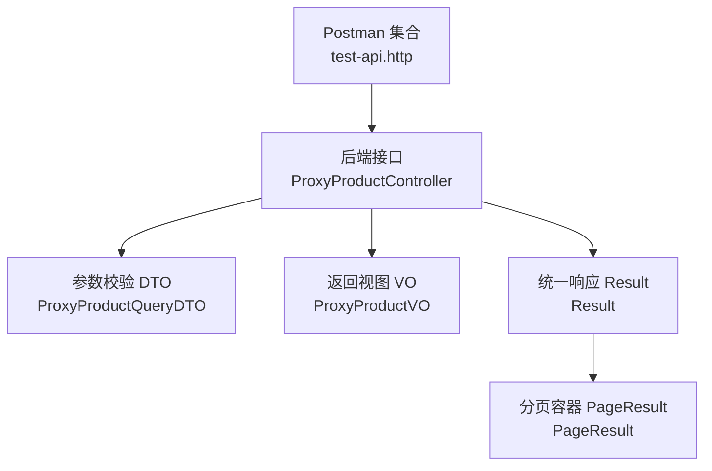
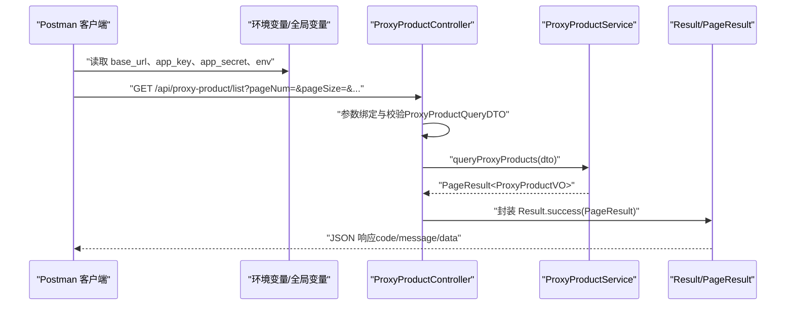
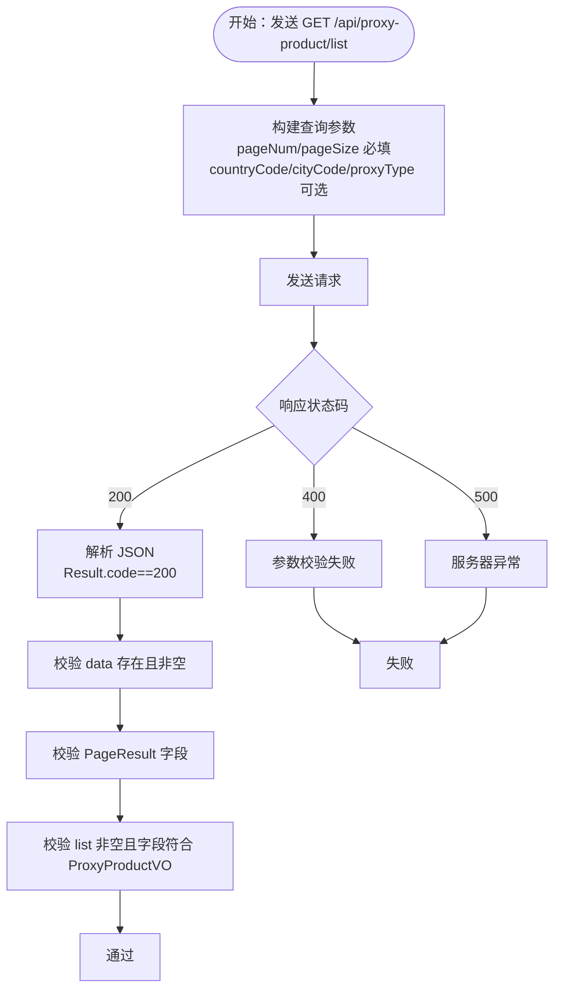
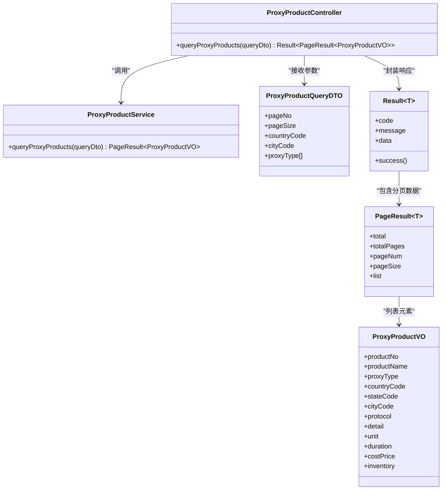

# Postman 测试集合

<cite>
**本文引用的文件**
- [test-api.http](file://test-api.http)
- [获取代理产品列表接口.md](file://docs/api/internal/获取代理产品列表接口.md)
- [ProxyProductController.java](file://src/main/java/cn/linkfast/controller/ProxyProductController.java)
- [ProxyProductQueryDTO.java](file://src/main/java/cn/linkfast/dto/ProxyProductQueryDTO.java)
- [ProxyProductVO.java](file://src/main/java/cn/linkfast/vo/ProxyProductVO.java)
- [Result.java](file://src/main/java/cn/linkfast/common/Result.java)
- [PageResult.java](file://src/main/java/cn/linkfast/common/PageResult.java)
- [ProxyProductControllerTest.java](file://src/test/java/cn/linkfast/controller/ProxyProductControllerTest.java)
- [test.properties](file://src/test/resources/test.properties)
- [logback-test.xml](file://src/test/resources/logback-test.xml)
- [ApiPacketUtil.java](file://src/main/java/cn/linkfast/utils/ApiPacketUtil.java)
</cite>

## 目录
1. [简介](#简介)
2. [项目结构](#项目结构)
3. [核心组件](#核心组件)
4. [架构总览](#架构总览)
5. [详细组件分析](#详细组件分析)
6. [依赖关系分析](#依赖关系分析)
7. [性能考虑](#性能考虑)
8. [故障排查指南](#故障排查指南)
9. [结论](#结论)
10. [附录](#附录)

## 简介
本文件面向 Link-Fast 项目的 Postman 测试集合使用与维护，重点围绕 test-api.http 中定义的“获取代理产品列表”等核心 API 接口进行测试配置说明。内容涵盖集合组织结构、环境变量与全局变量配置、请求构建与参数设置、认证与签名策略、响应验证、测试环境切换、测试数据准备与清理、以及导入导出与团队协作最佳实践。

## 项目结构
- 测试集合文件位于仓库根目录，命名为 test-api.http，其中包含若干 HTTP 请求片段，当前至少包含“获取代理产品列表”这一接口。
- 后端接口实现位于 src/main/java/cn/linkfast/controller/ 下的 ProxyProductController，提供 /api/proxy-product/list GET 接口。
- 参数校验与数据传输对象位于 src/main/java/cn/linkfast/dto/ 与 src/main/java/cn/linkfast/vo/。
- 统一响应包装类与分页容器位于 src/main/java/cn/linkfast/common/。
- 相关接口文档位于 docs/api/internal/ 获取代理产品列表接口.md，包含接口规范、参数说明与示例。

图表来源
- [test-api.http](file://test-api.http)
- [ProxyProductController.java](file://src/main/java/cn/linkfast/controller/ProxyProductController.java)
- [ProxyProductQueryDTO.java](file://src/main/java/cn/linkfast/dto/ProxyProductQueryDTO.java)
- [ProxyProductVO.java](file://src/main/java/cn/linkfast/vo/ProxyProductVO.java)
- [Result.java](file://src/main/java/cn/linkfast/common/Result.java)
- [PageResult.java](file://src/main/java/cn/linkfast/common/PageResult.java)

章节来源
- [test-api.http](file://test-api.http)
- [ProxyProductController.java](file://src/main/java/cn/linkfast/controller/ProxyProductController.java)
- [获取代理产品列表接口.md](file://docs/api/internal/获取代理产品列表接口.md)

## 核心组件
- Postman 集合与环境
  - 集合：在 Postman 中导入 test-api.http 后，即可看到“获取代理产品列表”等请求片段。
  - 环境：建议为不同环境（开发、测试、生产）分别配置环境变量，如 base_url、app_key、app_secret、env 等。
  - 全局变量：用于跨环境共享的常量，如默认分页参数、超时时间等。
- 接口契约
  - 控制器路径：/api/proxy-product/list
  - 方法：GET
  - 内容类型：application/x-www-form-urlencoded（通过 Query 参数传递）
  - 返回格式：application/json
- 参数与校验
  - 必填：pageNum、pageSize
  - 可选：countryCode、cityCode、proxyType[]
  - 校验规则：pageNum≥1；pageSize≥1 且 ≤100
- 响应结构
  - 外层 Result：code、message、data
  - data 为 PageResult：total、totalPages、pageNum、pageSize、list
  - list 中每个元素为 ProxyProductVO 字段集合

章节来源
- [test-api.http](file://test-api.http)
- [获取代理产品列表接口.md](file://docs/api/internal/获取代理产品列表接口.md)
- [ProxyProductController.java](file://src/main/java/cn/linkfast/controller/ProxyProductController.java)
- [ProxyProductQueryDTO.java](file://src/main/java/cn/linkfast/dto/ProxyProductQueryDTO.java)
- [ProxyProductVO.java](file://src/main/java/cn/linkfast/vo/ProxyProductVO.java)
- [Result.java](file://src/main/java/cn/linkfast/common/Result.java)
- [PageResult.java](file://src/main/java/cn/linkfast/common/PageResult.java)

## 架构总览
下图展示了从 Postman 到后端接口的调用链路，以及参数与响应的流转关系。

图表来源
- [test-api.http](file://test-api.http)
- [ProxyProductController.java](file://src/main/java/cn/linkfast/controller/ProxyProductController.java)
- [ProxyProductQueryDTO.java](file://src/main/java/cn/linkfast/dto/ProxyProductQueryDTO.java)
- [Result.java](file://src/main/java/cn/linkfast/common/Result.java)
- [PageResult.java](file://src/main/java/cn/linkfast/common/PageResult.java)

## 详细组件分析

### “获取代理产品列表”接口测试
- 请求构建
  - 方法：GET
  - 路径：/api/proxy-product/list
  - 查询参数：pageNum、pageSize（必填），countryCode、cityCode、proxyType[]（可选）
- 认证与签名
  - 若接口涉及签名或鉴权，需在 Postman 的 Headers 或 Pre-request Script/Tests 中配置 app_key、app_secret、env 等参数，并按服务端签名规则生成签名。
  - 服务端签名工具类 ApiPacketUtil 提供了从配置读取 appKey/appSecret/env 的能力，可作为 Postman 签名逻辑的参考。
- 响应验证
  - 校验外层 Result 的 code=200
  - 校验 data 存在且非空
  - 校验 PageResult 字段完整性（total、totalPages、pageNum、pageSize、list）
  - 校验 list 中元素符合 ProxyProductVO 字段定义
- 参数边界与错误场景
  - 缺少必填参数或参数越界（pageNum<1、pageSize<1 或 >100）应返回 400 参数校验失败
  - 服务器异常应返回 500 系统异常

图表来源
- [test-api.http](file://test-api.http)
- [获取代理产品列表接口.md](file://docs/api/internal/获取代理产品列表接口.md)
- [ProxyProductController.java](file://src/main/java/cn/linkfast/controller/ProxyProductController.java)
- [ProxyProductQueryDTO.java](file://src/main/java/cn/linkfast/dto/ProxyProductQueryDTO.java)
- [ProxyProductVO.java](file://src/main/java/cn/linkfast/vo/ProxyProductVO.java)
- [Result.java](file://src/main/java/cn/linkfast/common/Result.java)
- [PageResult.java](file://src/main/java/cn/linkfast/common/PageResult.java)

章节来源
- [test-api.http](file://test-api.http)
- [获取代理产品列表接口.md](file://docs/api/internal/获取代理产品列表接口.md)
- [ProxyProductController.java](file://src/main/java/cn/linkfast/controller/ProxyProductController.java)
- [ProxyProductQueryDTO.java](file://src/main/java/cn/linkfast/dto/ProxyProductQueryDTO.java)
- [ProxyProductVO.java](file://src/main/java/cn/linkfast/vo/ProxyProductVO.java)
- [Result.java](file://src/main/java/cn/linkfast/common/Result.java)
- [PageResult.java](file://src/main/java/cn/linkfast/common/PageResult.java)

### Postman 集合组织与环境变量配置
- 集合组织
  - 建议按模块划分：代理产品、代理实例、代理订单、地域信息、回调与支付等。
  - 每个请求片段包含：请求头、查询参数、预处理脚本（签名）、断言脚本（响应校验）。
- 环境变量
  - 开发环境：base_url=http://localhost:8080
  - 测试环境：base_url=https://test-api.example.com
  - 生产环境：base_url=https://api.example.com
  - 公共变量：app_key、app_secret、env（sandbox/prod）、默认分页参数（pageNum=1、pageSize=10）
- 全局变量
  - 默认超时、并发数、日志开关等

章节来源
- [test-api.http](file://test-api.http)
- [ApiPacketUtil.java](file://src/main/java/cn/linkfast/utils/ApiPacketUtil.java)

### 认证与签名策略
- 若接口启用签名，建议在 Pre-request Script 中：
  - 读取 app_key、app_secret、env、timestamp、nonce、params
  - 按服务端规则对参数排序并拼接，计算摘要，生成签名
  - 将签名写入请求头或查询参数
- 服务端签名工具参考：ApiPacketUtil 从配置读取 appKey/appSecret/env，便于前后端一致

章节来源
- [ApiPacketUtil.java](file://src/main/java/cn/linkfast/utils/ApiPacketUtil.java)

### 响应验证与断言
- 断言建议：
  - 状态码：200
  - 头部：Content-Type=application/json
  - JSON 结构：Result.code=200、data 存在
  - 分页：total、totalPages、pageNum、pageSize 合法
  - 列表：list 非空且字段齐全
- 参考服务端测试断言：ProxyProductControllerTest 中对 status().isOk()、jsonPath("$.code")、data 存在性与字段的断言

章节来源
- [ProxyProductControllerTest.java](file://src/test/java/cn/linkfast/controller/ProxyProductControllerTest.java)

## 依赖关系分析
- 控制器依赖服务层，服务层返回 PageResult<ProxyProductVO>，控制器再封装为 Result。
- DTO 用于接收与校验请求参数，VO 用于输出展示。
- 统一响应 Result 提供成功/失败的标准化输出。

图表来源
- [ProxyProductController.java](file://src/main/java/cn/linkfast/controller/ProxyProductController.java)
- [ProxyProductQueryDTO.java](file://src/main/java/cn/linkfast/dto/ProxyProductQueryDTO.java)
- [ProxyProductVO.java](file://src/main/java/cn/linkfast/vo/ProxyProductVO.java)
- [Result.java](file://src/main/java/cn/linkfast/common/Result.java)
- [PageResult.java](file://src/main/java/cn/linkfast/common/PageResult.java)

章节来源
- [ProxyProductController.java](file://src/main/java/cn/linkfast/controller/ProxyProductController.java)
- [ProxyProductQueryDTO.java](file://src/main/java/cn/linkfast/dto/ProxyProductQueryDTO.java)
- [ProxyProductVO.java](file://src/main/java/cn/linkfast/vo/ProxyProductVO.java)
- [Result.java](file://src/main/java/cn/linkfast/common/Result.java)
- [PageResult.java](file://src/main/java/cn/linkfast/common/PageResult.java)

## 性能考虑
- 分页参数控制：合理设置 pageSize，避免一次性返回过多数据导致网络与解析压力。
- 并发与超时：在 Postman 环境变量中设置合理的超时与并发上限，避免阻塞。
- 日志与断言：减少不必要的日志输出与复杂断言，提升批量执行效率。

## 故障排查指南
- 常见问题
  - 参数缺失或越界：检查 pageNum、pageSize 是否满足最小值与最大值约束。
  - 签名失败：核对 app_key、app_secret、env、时间戳、随机串与参数排序规则。
  - 环境切换错误：确认 base_url 与环境变量匹配。
- 日志定位
  - 测试环境日志输出至 ${java.io.tmpdir}/linkfast-test/ 目录，便于排查。
- 自动化与回归
  - 可结合 Newman 执行集合，结合断言与报告进行回归测试。

章节来源
- [logback-test.xml](file://src/test/resources/logback-test.xml)
- [test.properties](file://src/test/resources/test.properties)

## 结论
通过 Postman 集合与环境变量的规范化配置，结合服务端 DTO/VO 与统一响应结构，能够高效地完成核心接口的测试与验证。建议在团队内统一签名与断言规范，配合环境切换与日志策略，持续提升测试效率与质量。

## 附录

### 测试环境配置与切换
- 环境变量建议
  - 开发：base_url=http://localhost:8080、app_key、app_secret、env=sandbox
  - 测试：base_url=https://test-api.example.com、app_key、app_secret、env=sandbox
  - 生产：base_url=https://api.example.com、app_key、app_secret、env=prod
- 切换步骤
  - 在 Postman 顶部选择对应环境
  - 确认请求中的 {{base_url}}、{{app_key}}、{{app_secret}}、{{env}} 已正确替换

章节来源
- [test-api.http](file://test-api.http)
- [ApiPacketUtil.java](file://src/main/java/cn/linkfast/utils/ApiPacketUtil.java)

### 测试数据准备与清理
- 准备
  - 通过系统初始化任务或手动同步，确保数据库存在代理产品数据。
  - 在测试环境关闭定时任务，避免自动同步干扰测试数据稳定性。
- 清理
  - 使用测试专用的最小化数据集，避免影响其他环境。
  - 批量执行后清理临时数据或回滚事务（若支持）。

章节来源
- [test.properties](file://src/test/resources/test.properties)
- [logback-test.xml](file://src/test/resources/logback-test.xml)

### 导入导出、版本管理与团队协作
- 导入导出
  - 导入：在 Postman 中选择“Import”，添加 test-api.http 或集合 JSON。
  - 导出：选择集合 → Export，保存为 v2.1 或 v2.0 格式以便版本兼容。
- 版本管理
  - 使用 Git 管理集合文件，每次变更提交并标注版本号。
  - 在 README 或 docs 中记录集合更新日志与注意事项。
- 团队协作
  - 统一命名规范与环境变量命名，避免冲突。
  - 在 Pre-request Script 中集中处理签名与鉴权，减少重复配置。
  - 使用断言与环境变量驱动的参数，提升可维护性。