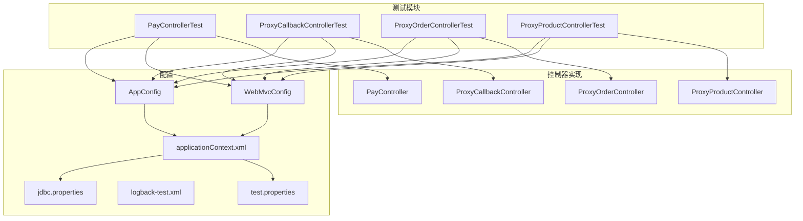
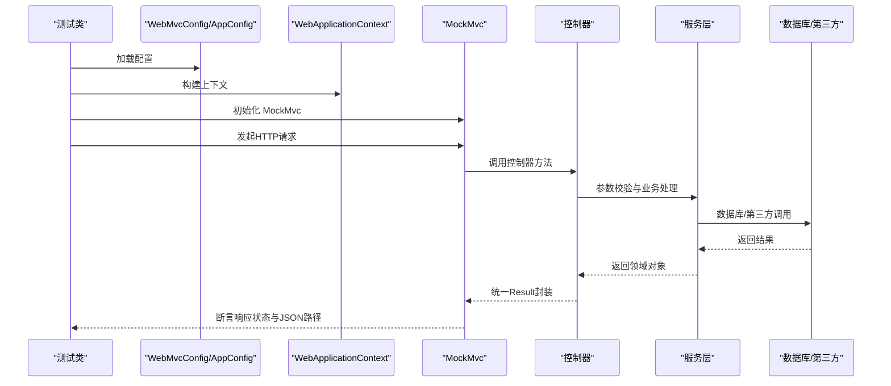
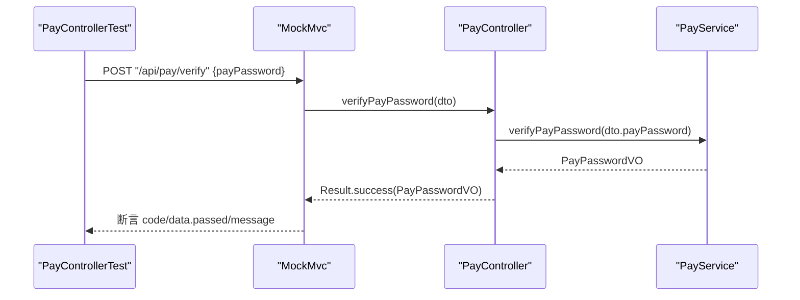
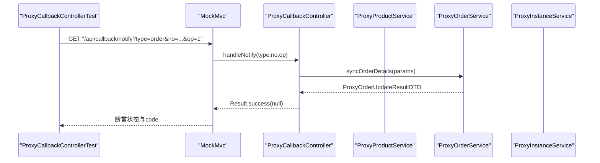
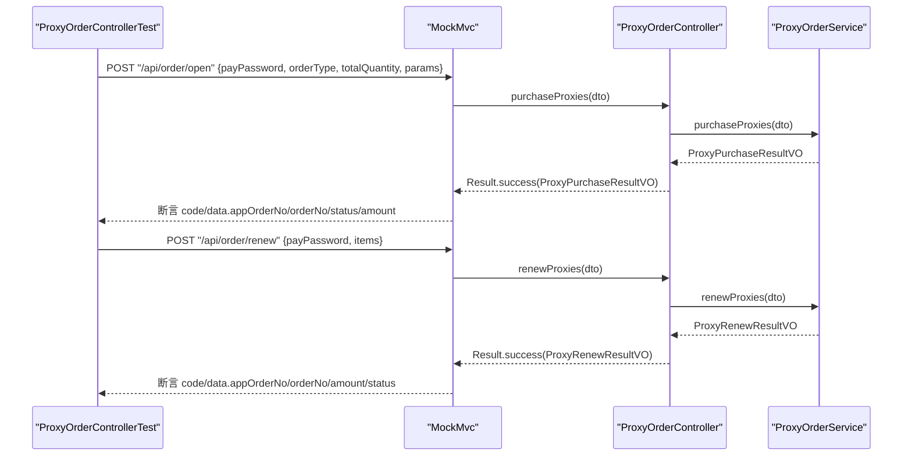
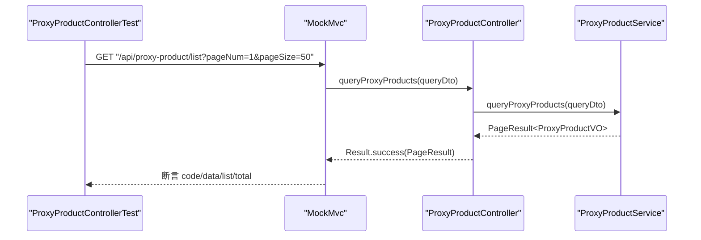
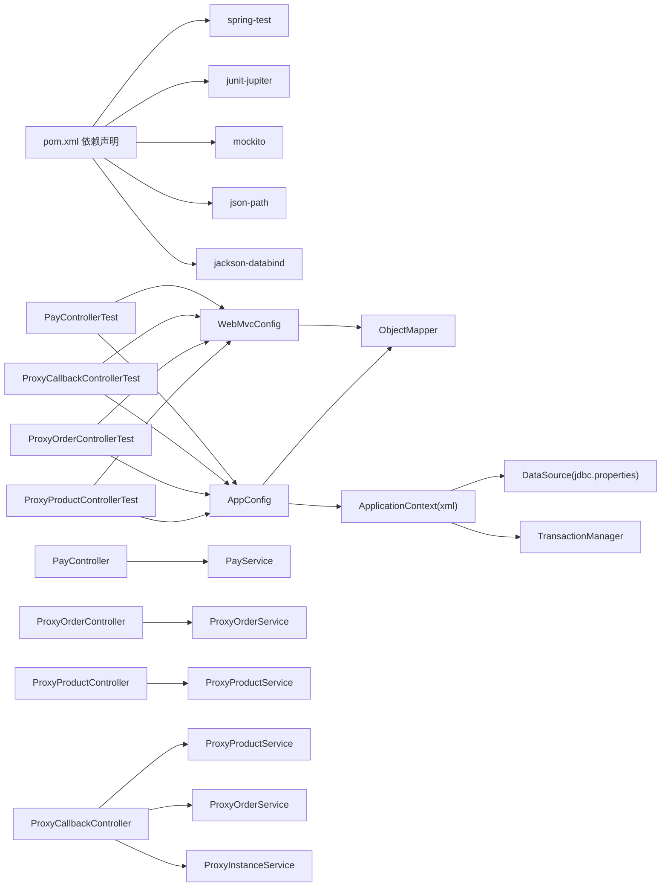

# 控制器测试

<cite>
**本文引用的文件**
- [PayControllerTest.java](file://src/test/java/cn/linkfast/controller/PayControllerTest.java)
- [ProxyCallbackControllerTest.java](file://src/test/java/cn/linkfast/controller/ProxyCallbackControllerTest.java)
- [ProxyOrderControllerTest.java](file://src/test/java/cn/linkfast/controller/ProxyOrderControllerTest.java)
- [ProxyProductControllerTest.java](file://src/test/java/cn/linkfast/controller/ProxyProductControllerTest.java)
- [AppConfig.java](file://src/main/java/cn/linkfast/config/AppConfig.java)
- [WebMvcConfig.java](file://src/main/java/cn/linkfast/config/WebMvcConfig.java)
- [PayController.java](file://src/main/java/cn/linkfast/controller/PayController.java)
- [ProxyOrderController.java](file://src/main/java/cn/linkfast/controller/ProxyOrderController.java)
- [ProxyProductController.java](file://src/main/java/cn/linkfast/controller/ProxyProductController.java)
- [ProxyCallbackController.java](file://src/main/java/cn/linkfast/controller/ProxyCallbackController.java)
- [applicationContext.xml](file://src/main/resources/applicationContext.xml)
- [jdbc.properties](file://src/main/resources/jdbc.properties)
- [logback-test.xml](file://src/test/resources/logback-test.xml)
- [test.properties](file://src/test/resources/test.properties)
- [pom.xml](file://pom.xml)
</cite>

## 目录
1. [引言](#引言)
2. [项目结构](#项目结构)
3. [核心组件](#核心组件)
4. [架构总览](#架构总览)
5. [详细组件分析](#详细组件分析)
6. [依赖分析](#依赖分析)
7. [性能考虑](#性能考虑)
8. [故障排查指南](#故障排查指南)
9. [结论](#结论)
10. [附录](#附录)

## 引言
本文件面向 Link-Fast 项目的控制器层测试，聚焦以下控制器的单元与集成测试：PayControllerTest、ProxyCallbackControllerTest、ProxyOrderControllerTest、ProxyProductControllerTest。文档从测试策略、Mock 与断言、请求参数验证、异常处理、响应数据验证、测试环境搭建、测试数据准备与清理、以及测试覆盖率与质量评估等方面进行系统化梳理，帮助开发者快速理解与改进测试实践。

## 项目结构
控制器测试位于 src/test/java/cn/linkfast/controller 目录下，每个测试类对应一个控制器，采用 Spring Boot 测试风格，基于 WebMvcConfig 与 AppConfig 构建 Web 上下文，使用 MockMvc 发起 HTTP 请求，结合 Jackson 进行 JSON 序列化与反序列化，断言响应状态码与 JSON 路径表达式。

图表来源
- [PayControllerTest.java:1-89](file://src/test/java/cn/linkfast/controller/PayControllerTest.java#L1-L89)
- [ProxyCallbackControllerTest.java:1-87](file://src/test/java/cn/linkfast/controller/ProxyCallbackControllerTest.java#L1-L87)
- [ProxyOrderControllerTest.java:1-323](file://src/test/java/cn/linkfast/controller/ProxyOrderControllerTest.java#L1-L323)
- [ProxyProductControllerTest.java:1-101](file://src/test/java/cn/linkfast/controller/ProxyProductControllerTest.java#L1-L101)
- [AppConfig.java:1-36](file://src/main/java/cn/linkfast/config/AppConfig.java#L1-L36)
- [WebMvcConfig.java:1-62](file://src/main/java/cn/linkfast/config/WebMvcConfig.java#L1-L62)
- [applicationContext.xml:1-67](file://src/main/resources/applicationContext.xml#L1-L67)
- [jdbc.properties:1-39](file://src/main/resources/jdbc.properties#L1-L39)
- [logback-test.xml:1-49](file://src/test/resources/logback-test.xml#L1-L49)
- [test.properties:1-3](file://src/test/resources/test.properties#L1-L3)

章节来源
- [PayControllerTest.java:1-89](file://src/test/java/cn/linkfast/controller/PayControllerTest.java#L1-L89)
- [ProxyCallbackControllerTest.java:1-87](file://src/test/java/cn/linkfast/controller/ProxyCallbackControllerTest.java#L1-L87)
- [ProxyOrderControllerTest.java:1-323](file://src/test/java/cn/linkfast/controller/ProxyOrderControllerTest.java#L1-L323)
- [ProxyProductControllerTest.java:1-101](file://src/test/java/cn/linkfast/controller/ProxyProductControllerTest.java#L1-L101)
- [AppConfig.java:1-36](file://src/main/java/cn/linkfast/config/AppConfig.java#L1-L36)
- [WebMvcConfig.java:1-62](file://src/main/java/cn/linkfast/config/WebMvcConfig.java#L1-L62)
- [applicationContext.xml:1-67](file://src/main/resources/applicationContext.xml#L1-L67)
- [jdbc.properties:1-39](file://src/main/resources/jdbc.properties#L1-L39)
- [logback-test.xml:1-49](file://src/test/resources/logback-test.xml#L1-L49)
- [test.properties:1-3](file://src/test/resources/test.properties#L1-L3)

## 核心组件
- 测试基座
  - 使用 SpringExtension 与 @ContextConfiguration 加载 AppConfig 与 WebMvcConfig，构建 WebApplicationContext。
  - 使用 MockMvcBuilders.webAppContextSetup(...) 构建 MockMvc，发起 HTTP 请求。
  - 使用 ObjectMapper 进行请求体与响应体的 JSON 序列化/反序列化。
- 断言策略
  - 响应状态断言：status().isOk() 等。
  - JSON 路径断言：jsonPath("$.code").value(...)、jsonPath("$.data.passed").value(...) 等。
  - 结果对象断言：解析 Result<T> 或 PageResult<T> 后断言 code、data、list、total 等字段。
- 集成测试
  - 部分测试依赖真实数据库与第三方 API，如续费订单与回调同步，通过打印响应体辅助定位问题。
- 参数校验与异常处理
  - 通过构造非法请求体或缺失参数，验证控制器与全局异常处理返回统一的 Result 结构。

章节来源
- [PayControllerTest.java:30-86](file://src/test/java/cn/linkfast/controller/PayControllerTest.java#L30-L86)
- [ProxyOrderControllerTest.java:56-320](file://src/test/java/cn/linkfast/controller/ProxyOrderControllerTest.java#L56-L320)
- [ProxyProductControllerTest.java:52-83](file://src/test/java/cn/linkfast/controller/ProxyProductControllerTest.java#L52-L83)
- [ProxyCallbackControllerTest.java:56-85](file://src/test/java/cn/linkfast/controller/ProxyCallbackControllerTest.java#L56-L85)

## 架构总览
控制器测试围绕“配置加载 → Web 上下文构建 → MockMvc 请求 → 响应断言”的流程展开。控制器层通过 @Validated 参数校验与异常处理，统一返回 Result<T> 结构；测试通过 jsonPath 与强类型反序列化进行断言。

图表来源
- [WebMvcConfig.java:19-62](file://src/main/java/cn/linkfast/config/WebMvcConfig.java#L19-L62)
- [AppConfig.java:14-36](file://src/main/java/cn/linkfast/config/AppConfig.java#L14-L36)
- [PayController.java:17-35](file://src/main/java/cn/linkfast/controller/PayController.java#L17-L35)
- [ProxyOrderController.java:23-85](file://src/main/java/cn/linkfast/controller/ProxyOrderController.java#L23-L85)
- [ProxyProductController.java:17-34](file://src/main/java/cn/linkfast/controller/ProxyProductController.java#L17-L34)
- [ProxyCallbackController.java:22-92](file://src/main/java/cn/linkfast/controller/ProxyCallbackController.java#L22-L92)

## 详细组件分析

### PayControllerTest 分析
- 测试目标
  - 验证支付密码校验接口在错误与正确密码下的响应一致性。
- 设计思路
  - 构造请求体 Map，填充 payPassword 字段，POST 到 /api/pay/verify。
  - 使用 jsonPath 断言 code、data.passed、data.message。
- Mock 与断言
  - 使用 WebMvcConfig 与 AppConfig 构建上下文，MockMvc 发起请求。
  - 断言响应状态为 200，并校验 Result.code 与 data 字段。
- 参数验证与异常处理
  - 该测试未覆盖参数缺失场景（控制器层有 @Validated），可补充空请求体与缺失字段的用例。
- 响应数据验证
  - 通过 jsonPath 校验 data.passed 与 data.message 的期望值。

图表来源
- [PayControllerTest.java:52-86](file://src/test/java/cn/linkfast/controller/PayControllerTest.java#L52-L86)
- [PayController.java:30-34](file://src/main/java/cn/linkfast/controller/PayController.java#L30-L34)

章节来源
- [PayControllerTest.java:30-86](file://src/test/java/cn/linkfast/controller/PayControllerTest.java#L30-L86)
- [PayController.java:17-35](file://src/main/java/cn/linkfast/controller/PayController.java#L17-L35)

### ProxyCallbackControllerTest 分析
- 测试目标
  - 验证回调接口在收到第三方通知后，能够正确触发产品/订单/实例的同步逻辑，并返回统一 Result。
- 设计思路
  - GET /api/callback/notify，携带 type/no/op 参数，断言响应状态与 code。
  - 通过打印响应体辅助定位业务执行结果。
- Mock 与断言
  - 使用 MockMvc 发起 GET 请求，断言状态码与 JSON 路径。
  - 通过 ObjectMapper 读取响应体，断言 code 字段非缺失。
- 参数验证与异常处理
  - 控制器内部对不同 type 分支处理，异常通过日志记录并返回 Result.error；测试关注接口返回稳定性（HTTP 200 + Result）。
- 响应数据验证
  - 断言 code 存在且为数值型，最终断言 code 不等于 -1。

图表来源
- [ProxyCallbackControllerTest.java:56-85](file://src/test/java/cn/linkfast/controller/ProxyCallbackControllerTest.java#L56-L85)
- [ProxyCallbackController.java:40-91](file://src/main/java/cn/linkfast/controller/ProxyCallbackController.java#L40-L91)

章节来源
- [ProxyCallbackControllerTest.java:30-85](file://src/test/java/cn/linkfast/controller/ProxyCallbackControllerTest.java#L30-L85)
- [ProxyCallbackController.java:22-92](file://src/main/java/cn/linkfast/controller/ProxyCallbackController.java#L22-L92)

### ProxyOrderControllerTest 分析
- 测试目标
  - 验证订单创建与续费接口在多种输入条件下的行为，包括参数缺失、参数错误、Content-Type 错误、以及完整合法参数的集成测试。
- 设计思路
  - 构造不同请求体（空体、缺字段、错误密码、空 params、合法参数等），分别断言响应状态与 Result 结构。
  - 续费全链路测试：断言本地订单主表、明细表入库，第三方接口响应与回写，以及控制器返回字段正确性。
- Mock 与断言
  - 使用 jsonPath 断言 code 与 message；使用 ObjectMapper 反序列化为 Result<T>，断言 data 字段。
  - 全链路测试断言：appOrderNo、orderNo、amount、status 均非空且符合预期。
- 参数验证与异常处理
  - 控制器层对 DTO 使用 @Validated，参数校验失败返回统一 Result；Content-Type 错误由全局异常处理器捕获，返回 HTTP 200 + JSON 错误。
- 响应数据验证
  - 对于续费全链路，断言 data.amount > 0、data.status=1，以及 appOrderNo/orderNo 均非空。

图表来源
- [ProxyOrderControllerTest.java:56-320](file://src/test/java/cn/linkfast/controller/ProxyOrderControllerTest.java#L56-L320)
- [ProxyOrderController.java:44-65](file://src/main/java/cn/linkfast/controller/ProxyOrderController.java#L44-L65)

章节来源
- [ProxyOrderControllerTest.java:38-320](file://src/test/java/cn/linkfast/controller/ProxyOrderControllerTest.java#L38-L320)
- [ProxyOrderController.java:23-85](file://src/main/java/cn/linkfast/controller/ProxyOrderController.java#L23-L85)

### ProxyProductControllerTest 分析
- 测试目标
  - 验证分页查询代理产品列表接口在合法参数与缺失参数下的行为。
- 设计思路
  - GET /api/proxy-product/list?pageNum=1&pageSize=50，断言 code=200、data 存在、list 非空、total>0。
  - 缺失参数场景用于观察参数校验与异常处理表现。
- Mock 与断言
  - 使用 jsonPath 断言 code=200 与 data 存在。
  - 使用 ObjectMapper 反序列化为 Result<PageResult<ProxyProductVO>>，断言 data.list 与 data.total。
- 参数验证与异常处理
  - 控制器层对查询 DTO 使用 @Validated，参数校验失败返回统一 Result；测试关注接口返回稳定性与数据完整性。
- 响应数据验证
  - 断言 data 不为空、list 非空且 total>0。

图表来源
- [ProxyProductControllerTest.java:52-83](file://src/test/java/cn/linkfast/controller/ProxyProductControllerTest.java#L52-L83)
- [ProxyProductController.java:29-33](file://src/main/java/cn/linkfast/controller/ProxyProductController.java#L29-L33)

章节来源
- [ProxyProductControllerTest.java:32-83](file://src/test/java/cn/linkfast/controller/ProxyProductControllerTest.java#L32-L83)
- [ProxyProductController.java:17-34](file://src/main/java/cn/linkfast/controller/ProxyProductController.java#L17-L34)

## 依赖分析
- 测试依赖
  - Spring Test、JUnit 5、Mockito、Hamcrest、JsonPath、Jackson。
- 配置依赖
  - WebMvcConfig 负责注册 Jackson 消息转换器与 CORS；AppConfig 负责业务层组件扫描与 ObjectMapper 注入。
- 数据源依赖
  - applicationContext.xml 通过 jdbc.properties 注入数据源、JdbcTemplate、事务管理器；test.properties 在测试环境禁用定时任务。
- 控制器依赖
  - 各控制器依赖对应 Service 层，统一返回 Result<T>，异常通过控制器层捕获并返回统一结构。

图表来源
- [pom.xml:1-200](file://pom.xml#L1-L200)
- [WebMvcConfig.java:22-39](file://src/main/java/cn/linkfast/config/WebMvcConfig.java#L22-L39)
- [AppConfig.java:24-35](file://src/main/java/cn/linkfast/config/AppConfig.java#L24-L35)
- [applicationContext.xml:14-67](file://src/main/resources/applicationContext.xml#L14-L67)
- [jdbc.properties:1-39](file://src/main/resources/jdbc.properties#L1-L39)
- [PayController.java:20-34](file://src/main/java/cn/linkfast/controller/PayController.java#L20-L34)
- [ProxyOrderController.java:26-83](file://src/main/java/cn/linkfast/controller/ProxyOrderController.java#L26-L83)
- [ProxyProductController.java:19-33](file://src/main/java/cn/linkfast/controller/ProxyProductController.java#L19-L33)
- [ProxyCallbackController.java:24-91](file://src/main/java/cn/linkfast/controller/ProxyCallbackController.java#L24-L91)

章节来源
- [pom.xml:1-200](file://pom.xml#L1-L200)
- [applicationContext.xml:14-67](file://src/main/resources/applicationContext.xml#L14-L67)
- [jdbc.properties:1-39](file://src/main/resources/jdbc.properties#L1-L39)
- [WebMvcConfig.java:19-62](file://src/main/java/cn/linkfast/config/WebMvcConfig.java#L19-L62)
- [AppConfig.java:14-36](file://src/main/java/cn/linkfast/config/AppConfig.java#L14-L36)

## 性能考虑
- 测试并发与资源占用
  - 集成测试涉及数据库与第三方 API，建议控制并发度，避免连接池耗尽与第三方限流。
- 日志与输出
  - 测试日志输出至临时目录，便于排查但需注意磁盘占用；可在 CI 环境限制日志大小。
- 断言策略
  - 优先使用 jsonPath 进行轻量断言，必要时再进行强类型反序列化，平衡断言效率与准确性。

## 故障排查指南
- 常见问题
  - 参数缺失或类型错误：检查请求体字段与 Content-Type，确保为 APPLICATION_JSON。
  - 数据库连接失败：核对 jdbc.properties 中的 URL、用户名与密码；确认 MySQL 服务可用。
  - 第三方接口不可用：检查回调与续费接口的外部依赖，必要时在测试中降级或模拟。
- 排查步骤
  - 打印响应体，定位 code 与 message。
  - 检查日志输出（测试日志配置），确认业务日志与异常栈。
  - 核对测试属性（test.properties）是否禁用了定时任务等影响测试的因素。

章节来源
- [ProxyOrderControllerTest.java:128-140](file://src/test/java/cn/linkfast/controller/ProxyOrderControllerTest.java#L128-L140)
- [ProxyCallbackControllerTest.java:68-85](file://src/test/java/cn/linkfast/controller/ProxyCallbackControllerTest.java#L68-L85)
- [logback-test.xml:1-49](file://src/test/resources/logback-test.xml#L1-L49)
- [test.properties:1-3](file://src/test/resources/test.properties#L1-L3)

## 结论
上述控制器测试覆盖了参数校验、异常处理、响应结构统一与部分集成场景。建议后续补充：
- 对 PayController 的参数缺失与非法字段用例；
- 对 ProxyOrderController 的更多边界条件（如超长参数、非法枚举值）；
- 对 ProxyProductController 的参数校验失败场景；
- 引入测试隔离与数据清理策略（如事务回滚、临时表或测试专用库）；
- 增加测试覆盖率统计与质量门禁。

## 附录

### 测试环境搭建
- Maven 依赖
  - Spring Test、JUnit 5、Mockito、JsonPath、Jackson 已在 pom.xml 中声明。
- 配置加载
  - 通过 @ContextConfiguration 加载 AppConfig 与 WebMvcConfig，构建 WebApplicationContext。
- 数据库
  - 通过 applicationContext.xml 与 jdbc.properties 注入数据源；测试环境可通过 test.properties 覆盖配置。
- 日志
  - 使用 logback-test.xml 输出到系统临时目录，便于本地与 CI 排查。

章节来源
- [pom.xml:1-200](file://pom.xml#L1-L200)
- [AppConfig.java:14-36](file://src/main/java/cn/linkfast/config/AppConfig.java#L14-L36)
- [WebMvcConfig.java:19-62](file://src/main/java/cn/linkfast/config/WebMvcConfig.java#L19-L62)
- [applicationContext.xml:14-67](file://src/main/resources/applicationContext.xml#L14-L67)
- [jdbc.properties:1-39](file://src/main/resources/jdbc.properties#L1-L39)
- [logback-test.xml:1-49](file://src/test/resources/logback-test.xml#L1-L49)
- [test.properties:1-3](file://src/test/resources/test.properties#L1-L3)

### 测试数据准备与清理
- 准备
  - 使用真实数据库时，确保目标产品与订单数据存在；对于续费测试，确保实例编号有效。
- 清理
  - 建议在测试前后执行回滚或删除操作，避免污染共享数据库；可在事务测试中使用 @Transactional 并在结束后回滚。
- 隔离
  - 使用独立的测试数据库或命名空间，避免与其他测试或环境冲突。

### 测试覆盖率与质量评估
- 覆盖率
  - 建议使用 JaCoCo 或 IDE 插件统计行覆盖率与分支覆盖率，目标覆盖控制器层主要分支。
- 质量指标
  - 用例数量与分支覆盖、失败用例的可重复性、断言粒度与可读性、日志与输出的可观测性。