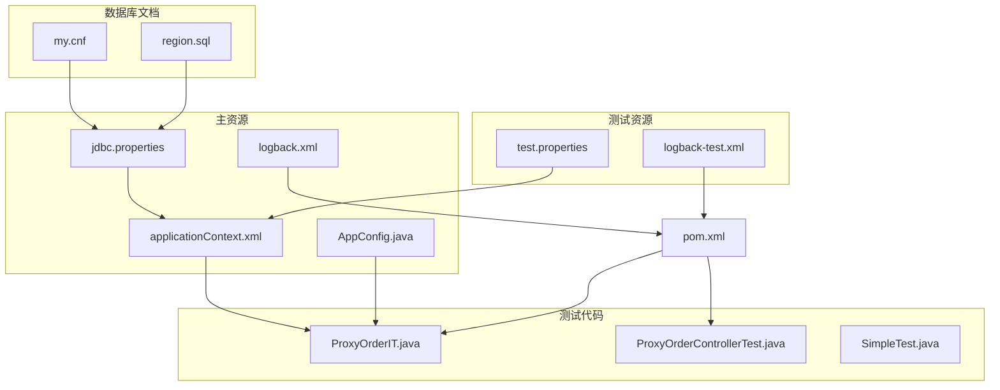
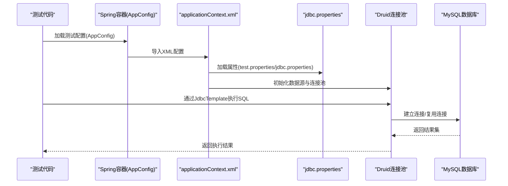
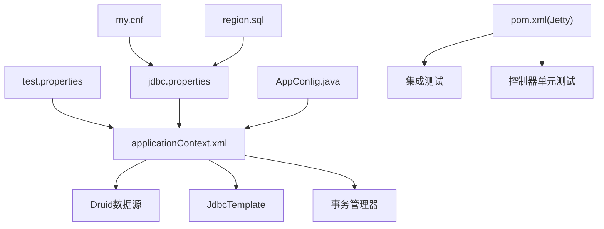

# 测试配置与环境

<cite>
**本文引用的文件**
- [src/test/resources/test.properties](file://src/test/resources/test.properties)
- [src/test/resources/logback-test.xml](file://src/test/resources/logback-test.xml)
- [src/main/resources/jdbc.properties](file://src/main/resources/jdbc.properties)
- [src/main/resources/logback.xml](file://src/main/resources/logback.xml)
- [src/main/resources/applicationContext.xml](file://src/main/resources/applicationContext.xml)
- [src/main/java/cn/linkfast/config/AppConfig.java](file://src/main/java/cn/linkfast/config/AppConfig.java)
- [pom.xml](file://pom.xml)
- [docs/database/my.cnf](file://docs/database/my.cnf)
- [docs/database/region.sql](file://docs/database/region.sql)
- [src/test/java/cn/linkfast/service/Impl/ProxyOrderIT.java](file://src/test/java/cn/linkfast/service/Impl/ProxyOrderIT.java)
- [src/test/java/cn/linkfast/controller/ProxyOrderControllerTest.java](file://src/test/java/cn/linkfast/controller/ProxyOrderControllerTest.java)
- [src/test/java/cn/linkfast/SimpleTest.java](file://src/test/java/cn/linkfast/SimpleTest.java)
</cite>

## 目录
1. [简介](#简介)
2. [项目结构](#项目结构)
3. [核心组件](#核心组件)
4. [架构总览](#架构总览)
5. [详细组件分析](#详细组件分析)
6. [依赖分析](#依赖分析)
7. [性能考虑](#性能考虑)
8. [故障排除指南](#故障排除指南)
9. [结论](#结论)
10. [附录](#附录)

## 简介
本文件面向 Link-Fast 项目的测试配置与环境，系统化说明测试环境的配置文件与运行机制，重点覆盖以下方面：
- 测试属性配置文件 test.properties 的作用与参数含义
- 测试日志配置 logback-test.xml 的结构与输出策略
- 测试数据库连接配置与连接池行为
- 测试服务器（Jetty）的端口与上下文路径设置
- 测试环境搭建步骤：数据库初始化、测试数据准备、工具安装
- 测试配置最佳实践：版本管理、环境变量、敏感信息保护
- 维护与故障排除方法，以及配置优化建议

## 项目结构
测试相关的配置与资源主要分布在以下位置：
- 测试资源：src/test/resources 下包含测试属性与日志配置
- 主资源：src/main/resources 下包含 JDBC、日志与 Spring XML 配置
- 测试代码：src/test/java 下包含控制器、服务、DAO、集成测试等
- 文档与数据库：docs/database 下包含 MySQL 配置与表结构

**图表来源**
- [src/test/resources/test.properties:1-3](file://src/test/resources/test.properties#L1-L3)
- [src/test/resources/logback-test.xml:1-49](file://src/test/resources/logback-test.xml#L1-L49)
- [src/main/resources/jdbc.properties:1-34](file://src/main/resources/jdbc.properties#L1-L34)
- [src/main/resources/logback.xml:1-49](file://src/main/resources/logback.xml#L1-L49)
- [src/main/resources/applicationContext.xml:1-67](file://src/main/resources/applicationContext.xml#L1-L67)
- [src/main/java/cn/linkfast/config/AppConfig.java:1-36](file://src/main/java/cn/linkfast/config/AppConfig.java#L1-L36)
- [src/test/java/cn/linkfast/service/Impl/ProxyOrderIT.java:1-178](file://src/test/java/cn/linkfast/service/Impl/ProxyOrderIT.java#L1-L178)
- [src/test/java/cn/linkfast/controller/ProxyOrderControllerTest.java:1-178](file://src/test/java/cn/linkfast/controller/ProxyOrderControllerTest.java#L1-L178)
- [docs/database/my.cnf:1-68](file://docs/database/my.cnf#L1-L68)
- [docs/database/region.sql:1-20](file://docs/database/region.sql#L1-L20)
- [pom.xml:1-294](file://pom.xml#L1-L294)

**章节来源**
- [src/test/resources/test.properties:1-3](file://src/test/resources/test.properties#L1-L3)
- [src/test/resources/logback-test.xml:1-49](file://src/test/resources/logback-test.xml#L1-L49)
- [src/main/resources/jdbc.properties:1-34](file://src/main/resources/jdbc.properties#L1-L34)
- [src/main/resources/logback.xml:1-49](file://src/main/resources/logback.xml#L1-L49)
- [src/main/resources/applicationContext.xml:1-67](file://src/main/resources/applicationContext.xml#L1-L67)
- [src/main/java/cn/linkfast/config/AppConfig.java:1-36](file://src/main/java/cn/linkfast/config/AppConfig.java#L1-L36)
- [pom.xml:1-294](file://pom.xml#L1-L294)
- [docs/database/my.cnf:1-68](file://docs/database/my.cnf#L1-L68)
- [docs/database/region.sql:1-20](file://docs/database/region.sql#L1-L20)

## 核心组件
- 测试属性配置 test.properties
  - 作用：在测试环境中禁用定时任务，避免自动同步产品数据干扰测试
  - 影响范围：通过 Spring XML property-placeholder 引入，影响所有基于测试配置的 Bean 行为
- 测试日志配置 logback-test.xml
  - 作用：为测试环境定制日志输出，分别输出到业务日志、服务器日志与控制台，并使用系统临时目录存储
  - 输出策略：按日期滚动，保留历史天数有限，避免生产环境污染
- 数据库连接配置
  - jdbc.properties：定义 MySQL 驱动、URL、用户名与密码
  - applicationContext.xml：通过 property-placeholder 加载上述属性，构建 Druid 连接池与 JdbcTemplate
- 测试服务器配置（Jetty）
  - pom.xml 中的 jetty-maven-plugin：配置上下文路径与端口，便于本地快速启动测试服务
- 测试代码与集成测试
  - ProxyOrderIT：集成测试，加载 AppConfig，使用真实 DAO 并通过 Mock 工具跳过外部网络调用
  - ProxyOrderControllerTest：控制器单元测试，使用 MockMvc 验证参数校验与异常处理

**章节来源**
- [src/test/resources/test.properties:1-3](file://src/test/resources/test.properties#L1-L3)
- [src/test/resources/logback-test.xml:1-49](file://src/test/resources/logback-test.xml#L1-L49)
- [src/main/resources/jdbc.properties:1-34](file://src/main/resources/jdbc.properties#L1-L34)
- [src/main/resources/applicationContext.xml:14-15](file://src/main/resources/applicationContext.xml#L14-L15)
- [pom.xml:275-290](file://pom.xml#L275-L290)
- [src/test/java/cn/linkfast/service/Impl/ProxyOrderIT.java:34-36](file://src/test/java/cn/linkfast/service/Impl/ProxyOrderIT.java#L34-L36)
- [src/test/java/cn/linkfast/controller/ProxyOrderControllerTest.java:31-32](file://src/test/java/cn/linkfast/controller/ProxyOrderControllerTest.java#L31-L32)

## 架构总览
测试环境的关键交互流程如下：

**图表来源**
- [src/main/java/cn/linkfast/config/AppConfig.java:24-24](file://src/main/java/cn/linkfast/config/AppConfig.java#L24-L24)
- [src/main/resources/applicationContext.xml:14-15](file://src/main/resources/applicationContext.xml#L14-L15)
- [src/main/resources/jdbc.properties:1-34](file://src/main/resources/jdbc.properties#L1-L34)
- [src/test/java/cn/linkfast/service/Impl/ProxyOrderIT.java:42-53](file://src/test/java/cn/linkfast/service/Impl/ProxyOrderIT.java#L42-L53)

## 详细组件分析

### 测试属性配置 test.properties
- 文件位置与作用
  - 位于 src/test/resources/test.properties
  - 在测试环境中禁用定时任务，避免自动同步产品数据
- 配置加载机制
  - 通过 applicationContext.xml 的 property-placeholder 同时引入 test.properties
  - 该属性会影响相关 Bean 的行为（例如任务开关）
- 最佳实践
  - 将测试专用属性集中于此，避免污染主配置
  - 使用注释明确用途，便于团队协作与维护

**章节来源**
- [src/test/resources/test.properties:1-3](file://src/test/resources/test.properties#L1-L3)
- [src/main/resources/applicationContext.xml:14-15](file://src/main/resources/applicationContext.xml#L14-L15)

### 测试日志配置 logback-test.xml
- 文件位置与作用
  - 位于 src/test/resources/logback-test.xml
  - 为测试环境定制日志输出，分别输出到业务日志、服务器日志与控制台
- 结构与输出策略
  - 业务日志：输出到系统临时目录，按日期滚动，保留有限历史
  - 服务器日志：输出到系统临时目录，按日期滚动，保留有限历史
  - 控制台输出：统一格式，便于本地调试
- 与生产日志的区别
  - 生产日志通过系统属性 LOG_PATH 指定路径，测试日志固定在临时目录
  - 生产日志保留更多历史天数，测试日志更简洁

**章节来源**
- [src/test/resources/logback-test.xml:1-49](file://src/test/resources/logback-test.xml#L1-L49)
- [src/main/resources/logback.xml:1-49](file://src/main/resources/logback.xml#L1-L49)

### 数据库连接配置
- jdbc.properties
  - 定义 MySQL 驱动、URL、用户名与密码
  - URL 参数包含字符集、时区、批处理、多查询、预编译缓存、超时与自动重连等
- applicationContext.xml
  - 通过 property-placeholder 同时引入 jdbc.properties 与 test.properties
  - 构建 Druid 数据源、JdbcTemplate 与事务管理器
- 连接池行为
  - 初始连接数、最小空闲、最大活跃、最大等待时间等
  - 空闲连接回收策略与泄露连接检测
- 与生产环境差异
  - 生产日志通过 -DLOG_PATH 指定路径，测试日志在临时目录
  - 生产环境保留更多历史日志，测试环境更轻量

**章节来源**
- [src/main/resources/jdbc.properties:1-34](file://src/main/resources/jdbc.properties#L1-L34)
- [src/main/resources/applicationContext.xml:14-52](file://src/main/resources/applicationContext.xml#L14-L52)

### 测试服务器配置（Jetty）
- pom.xml 中的 jetty-maven-plugin
  - 上下文路径：/（与生产一致）
  - 端口：8080（便于本地调试）
- 使用场景
  - 本地快速启动测试服务，配合控制器测试与集成测试
  - 集成测试中可结合 Mock 工具进行端到端验证

**章节来源**
- [pom.xml:275-290](file://pom.xml#L275-L290)

### 测试代码与集成测试
- ProxyOrderIT（集成测试）
  - 加载 AppConfig，注入真实 DAO 与 ObjectMapper
  - 使用 Mockito Spy 与 Mock 工具跳过外部网络调用，真实持久化到数据库
  - 验证订单与实例表的更新行数
- ProxyOrderControllerTest（控制器单元测试）
  - 使用 MockMvc 验证参数校验、异常处理与响应结构
  - 通过全局异常处理器捕获并返回标准错误结构

**章节来源**
- [src/test/java/cn/linkfast/service/Impl/ProxyOrderIT.java:34-66](file://src/test/java/cn/linkfast/service/Impl/ProxyOrderIT.java#L34-L66)
- [src/test/java/cn/linkfast/controller/ProxyOrderControllerTest.java:31-52](file://src/test/java/cn/linkfast/controller/ProxyOrderControllerTest.java#L31-L52)

## 依赖分析
测试配置与运行依赖关系如下：

**图表来源**
- [src/test/resources/test.properties:1-3](file://src/test/resources/test.properties#L1-L3)
- [src/main/resources/applicationContext.xml:14-65](file://src/main/resources/applicationContext.xml#L14-L65)
- [src/main/java/cn/linkfast/config/AppConfig.java:24-24](file://src/main/java/cn/linkfast/config/AppConfig.java#L24-L24)
- [pom.xml:275-290](file://pom.xml#L275-L290)
- [docs/database/my.cnf:1-68](file://docs/database/my.cnf#L1-L68)
- [docs/database/region.sql:1-20](file://docs/database/region.sql#L1-L20)

**章节来源**
- [src/test/resources/test.properties:1-3](file://src/test/resources/test.properties#L1-L3)
- [src/main/resources/applicationContext.xml:14-65](file://src/main/resources/applicationContext.xml#L14-L65)
- [src/main/java/cn/linkfast/config/AppConfig.java:24-24](file://src/main/java/cn/linkfast/config/AppConfig.java#L24-L24)
- [pom.xml:275-290](file://pom.xml#L275-L290)
- [docs/database/my.cnf:1-68](file://docs/database/my.cnf#L1-L68)
- [docs/database/region.sql:1-20](file://docs/database/region.sql#L1-L20)

## 性能考虑
- 连接池与超时
  - 连接池空闲回收周期与 MySQL wait_timeout 需匹配，避免连接被服务端回收导致测试失败
  - 连接超时、读写超时与最大连接数需根据批量操作场景调优
- 日志滚动与磁盘占用
  - 测试日志滚动策略与历史保留天数应与 CI/CD 环境的磁盘空间策略协调
- 测试并发与事务
  - 集成测试中避免长时间持有连接，合理拆分事务边界，减少连接竞争
- 网络与外部依赖
  - 集成测试中通过 Mock 工具隔离外部依赖，降低网络波动对测试稳定性的影响

[本节为通用指导，无需特定文件引用]

## 故障排除指南
- 数据库连接失败
  - 检查 jdbc.properties 中的 URL、用户名与密码是否正确
  - 使用 SimpleTest 验证直连是否可用
  - 核对 MySQL 服务状态与防火墙规则
- 连接池回收导致断连
  - 检查 MySQL 服务端 wait_timeout 与客户端连接池回收策略是否匹配
  - 调整连接池空闲回收时间或增加 wait_timeout
- 日志输出异常
  - 确认测试日志配置是否生效（logback-test.xml）
  - 检查系统临时目录权限与磁盘空间
- 集成测试失败
  - 确认 Jetty 端口未被占用，上下文路径与测试期望一致
  - 检查 Mock 工具的桩函数是否正确返回预期数据
- 参数校验与异常处理
  - 控制器测试中关注全局异常处理器的返回结构，确保错误码与消息符合预期

**章节来源**
- [src/test/java/cn/linkfast/SimpleTest.java:1-27](file://src/test/java/cn/linkfast/SimpleTest.java#L1-L27)
- [docs/database/my.cnf:32-42](file://docs/database/my.cnf#L32-L42)
- [src/test/resources/logback-test.xml:1-49](file://src/test/resources/logback-test.xml#L1-L49)
- [pom.xml:275-290](file://pom.xml#L275-L290)
- [src/test/java/cn/linkfast/controller/ProxyOrderControllerTest.java:58-100](file://src/test/java/cn/linkfast/controller/ProxyOrderControllerTest.java#L58-L100)

## 结论
本文系统梳理了 Link-Fast 项目的测试配置与环境，明确了 test.properties 与 logback-test.xml 的作用与配置要点，解释了数据库连接配置与连接池行为，给出了测试服务器的端口与上下文路径设置，并提供了测试环境搭建、维护与故障排除的实操建议。遵循本文的最佳实践，可显著提升测试的稳定性与可维护性。

[本节为总结性内容，无需特定文件引用]

## 附录

### 测试环境搭建指南
- 安装与准备
  - JDK 17、Maven、MySQL 8.x、IDE（推荐 IntelliJ IDEA）
- 数据库初始化
  - 创建数据库与用户，导入区域表结构（region.sql）
  - 调整 MySQL 配置（my.cnf），确保 wait_timeout、最大连接数与超时参数满足批量操作需求
- 测试数据准备
  - 在测试环境中准备必要的基础数据（如产品、地区等），或在集成测试中通过 DAO 写入
- 工具安装
  - 安装 Jetty Maven 插件，确保端口 8080 可用
  - 准备数据库直连工具（SimpleTest）以验证连接
- 运行测试
  - 执行单元测试与集成测试，观察日志输出与数据库变更

**章节来源**
- [docs/database/region.sql:1-20](file://docs/database/region.sql#L1-L20)
- [docs/database/my.cnf:32-48](file://docs/database/my.cnf#L32-L48)
- [src/test/java/cn/linkfast/SimpleTest.java:1-27](file://src/test/java/cn/linkfast/SimpleTest.java#L1-L27)
- [pom.xml:275-290](file://pom.xml#L275-L290)

### 测试配置最佳实践
- 版本管理
  - 将 test.properties 与 logback-test.xml 纳入版本控制，确保团队一致性
- 环境变量
  - 生产环境通过系统属性 LOG_PATH 指定日志路径，测试环境使用临时目录
- 敏感信息安全
  - jdbc.properties 中的用户名与密码应妥善保管，避免提交到版本库
  - 使用环境变量或外部配置中心替代硬编码
- 配置优先级
  - 测试属性优先于主配置，确保测试环境独立可控
- 日志策略
  - 测试日志滚动与保留策略应与 CI/CD 环境协调，避免磁盘压力

**章节来源**
- [src/test/resources/test.properties:1-3](file://src/test/resources/test.properties#L1-L3)
- [src/test/resources/logback-test.xml:1-49](file://src/test/resources/logback-test.xml#L1-L49)
- [src/main/resources/logback.xml:1-49](file://src/main/resources/logback.xml#L1-L49)
- [src/main/resources/jdbc.properties:33-34](file://src/main/resources/jdbc.properties#L33-L34)