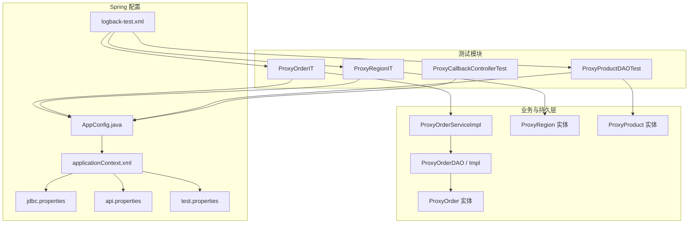
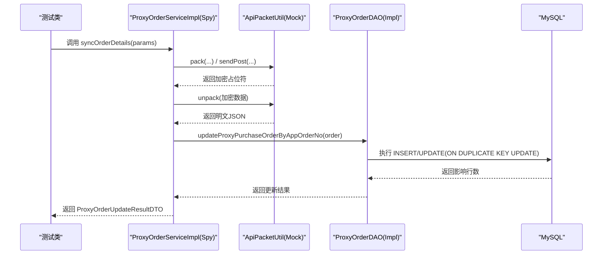
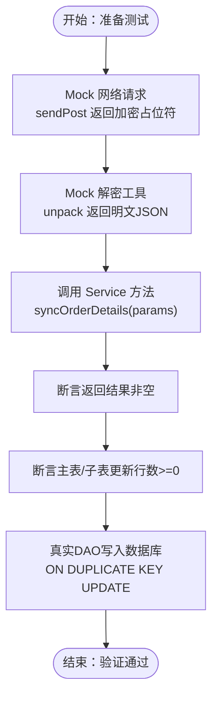
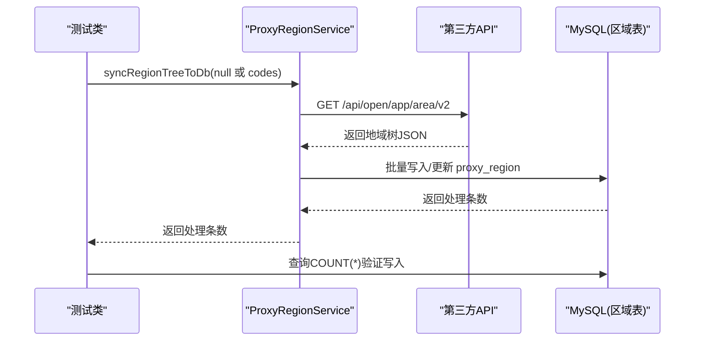
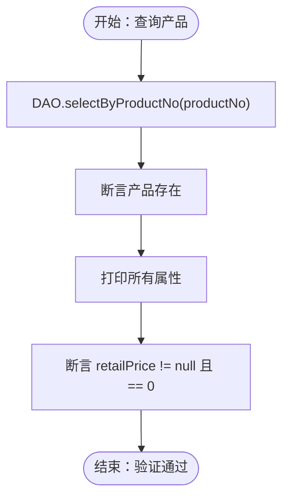
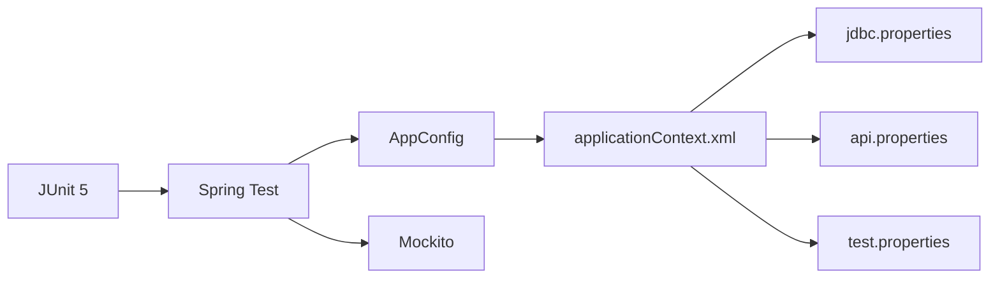

# 集成测试

<cite>
**本文引用的文件**
- [ProxyOrderIT.java](file://src/test/java/cn/linkfast/service/Impl/ProxyOrderIT.java)
- [ProxyRegionIT.java](file://src/test/java/cn/linkfast/service/Impl/ProxyRegionIT.java)
- [ProxyProductDAOTest.java](file://src/test/java/cn/linkfast/dao/ProxyProductDAOTest.java)
- [AppConfig.java](file://src/main/java/cn/linkfast/config/AppConfig.java)
- [applicationContext.xml](file://src/main/resources/applicationContext.xml)
- [jdbc.properties](file://src/main/resources/jdbc.properties)
- [api.properties](file://src/main/resources/api.properties)
- [test.properties](file://src/test/resources/test.properties)
- [logback-test.xml](file://src/test/resources/logback-test.xml)
- [ProxyOrderDAO.java](file://src/main/java/cn/linkfast/dao/ProxyOrderDAO.java)
- [ProxyOrderDaoImpl.java](file://src/main/java/cn/linkfast/dao/impl/ProxyOrderDaoImpl.java)
- [ProxyRegion.java](file://src/main/java/cn/linkfast/entity/ProxyRegion.java)
- [ProxyProduct.java](file://src/main/java/cn/linkfast/entity/ProxyProduct.java)
- [ProxyOrder.java](file://src/main/java/cn/linkfast/entity/ProxyOrder.java)
- [ProxyCallbackControllerTest.java](file://src/test/java/cn/linkfast/controller/ProxyCallbackControllerTest.java)
- [pom.xml](file://pom.xml)
</cite>

## 目录
1. [简介](#简介)
2. [项目结构](#项目结构)
3. [核心组件](#核心组件)
4. [架构总览](#架构总览)
5. [详细组件分析](#详细组件分析)
6. [依赖分析](#依赖分析)
7. [性能考虑](#性能考虑)
8. [故障排除指南](#故障排除指南)
9. [结论](#结论)
10. [附录](#附录)

## 简介
本文件面向 Link-Fast 项目的集成测试，聚焦以下测试类与场景：
- ProxyOrderIT：验证订单同步流程，通过 Mock 外部网络请求，真实持久化到数据库，覆盖主表与子表的更新逻辑。
- ProxyRegionIT：验证地域树同步流程，真实请求第三方 API 并写入本地数据库，不进行事务回滚，适合全量/按 codes 同步验证。
- ProxyProductDAOTest：验证 DAO 层按产品编号查询并断言关键字段（如零售价）的正确性。

文档将从设计原则、环境搭建、测试流程、依赖注入与事务管理、调试技巧等方面进行系统化说明，并提供可视化图示帮助理解。

## 项目结构
集成测试位于 src/test 下，采用 JUnit 5 + Spring Test + Mockito 的组合：
- 测试类通过 @ContextConfiguration 加载 AppConfig，间接引入 applicationContext.xml 中的数据源、JdbcTemplate、事务管理器等基础设施。
- 测试资源通过 classpath:jdbc.properties、api.properties、test.properties 提供运行时配置。
- 日志通过 logback-test.xml 输出到系统临时目录，便于定位问题。

图表来源
- [ProxyOrderIT.java:34-37](file://src/test/java/cn/linkfast/service/Impl/ProxyOrderIT.java#L34-L37)
- [ProxyRegionIT.java:37-39](file://src/test/java/cn/linkfast/service/Impl/ProxyRegionIT.java#L37-L39)
- [ProxyProductDAOTest.java:14-15](file://src/test/java/cn/linkfast/dao/ProxyProductDAOTest.java#L14-L15)
- [AppConfig.java:24](file://src/main/java/cn/linkfast/config/AppConfig.java#L24)
- [applicationContext.xml:14-65](file://src/main/resources/applicationContext.xml#L14-L65)
- [jdbc.properties:1-39](file://src/main/resources/jdbc.properties#L1-L39)
- [api.properties:1-31](file://src/main/resources/api.properties#L1-L31)
- [test.properties:1-3](file://src/test/resources/test.properties#L1-L3)
- [logback-test.xml:1-49](file://src/test/resources/logback-test.xml#L1-L49)

章节来源
- [pom.xml:1-200](file://pom.xml#L1-L200)

## 核心组件
- AppConfig：声明 @EnableTransactionManagement，导入 applicationContext.xml，并在根容器暴露 ObjectMapper，供测试与业务层共享。
- applicationContext.xml：集中配置数据源、JdbcTemplate、事务管理器与注解驱动，统一加载 jdbc.properties、api.properties、test.properties。
- 测试配置：test.properties 禁用定时任务，避免测试期间自动同步产品数据；logback-test.xml 输出到系统临时目录，便于排查。

章节来源
- [AppConfig.java:14-36](file://src/main/java/cn/linkfast/config/AppConfig.java#L14-L36)
- [applicationContext.xml:14-65](file://src/main/resources/applicationContext.xml#L14-L65)
- [test.properties:1-3](file://src/test/resources/test.properties#L1-L3)
- [logback-test.xml:1-49](file://src/test/resources/logback-test.xml#L1-L49)

## 架构总览
集成测试围绕“真实服务 + 部分外部依赖 Mock”的策略展开：
- 服务层通过 Spring 注入 DAO、ObjectMapper、PayService、AppOrderNoGenerator 等依赖。
- 对外网络请求通过 Mockito Spy 与 Mock 工具类拦截，以避免真实网络波动影响测试稳定性。
- 数据库操作由真实 DAO 执行，结合 ON DUPLICATE KEY UPDATE 等语句验证主表与子表更新行数。

图表来源
- [ProxyOrderIT.java:68-177](file://src/test/java/cn/linkfast/service/Impl/ProxyOrderIT.java#L68-L177)
- [ProxyOrderDAO.java:10-80](file://src/main/java/cn/linkfast/dao/ProxyOrderDAO.java#L10-L80)
- [ProxyOrderDaoImpl.java:25-31](file://src/main/java/cn/linkfast/dao/impl/ProxyOrderDaoImpl.java#L25-L31)

## 详细组件分析

### ProxyOrderIT：订单同步集成测试
- 设计原则
  - 通过 Mockito Spy 包装真实 Service，拦截 sendPost 与 pack/unpack，跳过真实网络请求，确保测试稳定。
  - 使用真实 DAO 执行数据库写入，验证主表与子表更新行数，确保 ON DUPLICATE KEY UPDATE 逻辑正确。
- 关键步骤
  - 准备模拟响应与明文 JSON。
  - 打桩 sendPost 返回加密占位符，打桩 ApiPacketUtil.unpack 返回明文 JSON，打桩 pack 返回空 Map。
  - 调用 syncOrderDetails，断言返回结果非空，并验证主表/子表更新行数。
- 依赖注入与事务
  - 通过 @ContextConfiguration(AppConfig.class) 加载 Spring 上下文，自动注入 ProxyOrderDAO、ObjectMapper、PayService 等。
  - 未使用 @Transactional，测试不自动回滚，但方法内事务仍按 Spring 配置提交，数据会落库。
- 结果验证
  - 断言主表与子表更新行数均非负，确保数据库写入成功。

图表来源
- [ProxyOrderIT.java:68-177](file://src/test/java/cn/linkfast/service/Impl/ProxyOrderIT.java#L68-L177)

章节来源
- [ProxyOrderIT.java:34-37](file://src/test/java/cn/linkfast/service/Impl/ProxyOrderIT.java#L34-L37)
- [ProxyOrderIT.java:55-66](file://src/test/java/cn/linkfast/service/Impl/ProxyOrderIT.java#L55-L66)
- [ProxyOrderIT.java:68-177](file://src/test/java/cn/linkfast/service/Impl/ProxyOrderIT.java#L68-L177)
- [ProxyOrderDAO.java:10-80](file://src/main/java/cn/linkfast/dao/ProxyOrderDAO.java#L10-L80)
- [ProxyOrderDaoImpl.java:25-31](file://src/main/java/cn/linkfast/dao/impl/ProxyOrderDaoImpl.java#L25-L31)

### ProxyRegionIT：地域树同步集成测试
- 设计原则
  - 真实请求第三方 /api/open/app/area/v2，按 codes 或全量同步地域树，写入本地 proxy_region 表。
  - 不使用 @Transactional，Spring 测试不会自动回滚，数据会保留，适合验证真实网络与数据库写入。
- 关键步骤
  - 全量同步：传入 null，统计同步前后 region 表记录数，断言同步后大于 0。
  - 按 codes 同步：传入 ["CN","US"]，断言写入至少 1 条，并再次校验 region 表记录数。
- 依赖注入与事务
  - 通过 @ContextConfiguration(AppConfig.class) 加载 Spring 上下文，注入 ProxyRegionService 与 JdbcTemplate。
  - 未使用 @Transactional，方法内事务正常提交，数据保留。
- 注意事项
  - 第三方对 codes 过滤不严格，可能返回较大子树；批量写入已按 DAO 分块执行；如遇 MySQL 断连，检查服务端 wait_timeout/net_read_timeout。

图表来源
- [ProxyRegionIT.java:48-85](file://src/test/java/cn/linkfast/service/Impl/ProxyRegionIT.java#L48-L85)

章节来源
- [ProxyRegionIT.java:22-36](file://src/test/java/cn/linkfast/service/Impl/ProxyRegionIT.java#L22-L36)
- [ProxyRegionIT.java:37-39](file://src/test/java/cn/linkfast/service/Impl/ProxyRegionIT.java#L37-L39)
- [ProxyRegionIT.java:48-85](file://src/test/java/cn/linkfast/service/Impl/ProxyRegionIT.java#L48-L85)
- [ProxyRegion.java:8-33](file://src/main/java/cn/linkfast/entity/ProxyRegion.java#L8-L33)

### ProxyProductDAOTest：产品查询与字段断言
- 设计原则
  - 通过 ProxyProductDAO.selectByProductNo 查询指定产品，断言产品存在并打印所有属性。
  - 重点验证 retailPrice 字段：数据库实际值为 0.00，断言其不为 null 且等于 0。
- 关键步骤
  - 设置 productNo，调用 DAO 查询。
  - 打印并断言 retailPrice 不为 null 且等于 0。
- 依赖注入与事务
  - 通过 @ContextConfiguration(AppConfig.class) 加载 Spring 上下文，注入 ProxyProductDAO。
  - 未使用 @Transactional，测试不自动回滚。

图表来源
- [ProxyProductDAOTest.java:21-92](file://src/test/java/cn/linkfast/dao/ProxyProductDAOTest.java#L21-L92)
- [ProxyProduct.java:13-99](file://src/main/java/cn/linkfast/entity/ProxyProduct.java#L13-L99)

章节来源
- [ProxyProductDAOTest.java:14-15](file://src/test/java/cn/linkfast/dao/ProxyProductDAOTest.java#L14-L15)
- [ProxyProductDAOTest.java:21-92](file://src/test/java/cn/linkfast/dao/ProxyProductDAOTest.java#L21-L92)
- [ProxyProduct.java:13-99](file://src/main/java/cn/linkfast/entity/ProxyProduct.java#L13-L99)

### 与控制器集成测试的关联（概念性说明）
- ProxyCallbackControllerTest 展示了基于 Web 的集成测试思路：通过 MockMvc 发起回调请求，验证接口返回码与业务状态，并期望数据库被真实更新。
- 该模式与 ProxyOrderIT 的“真实持久化”理念一致，区别在于入口从服务层切换到控制器层。

章节来源
- [ProxyCallbackControllerTest.java:26-73](file://src/test/java/cn/linkfast/controller/ProxyCallbackControllerTest.java#L26-L73)

## 依赖分析
- 测试框架与工具
  - JUnit 5：提供测试生命周期与断言能力。
  - Spring Test：加载 ApplicationContext，支持 @ContextConfiguration 与 @Autowired。
  - Mockito：提供 spy、mock、when/doReturn 等 API，用于行为打桩与依赖替换。
- Spring 配置依赖
  - AppConfig 导入 applicationContext.xml，后者负责数据源、JdbcTemplate、事务管理器与注解驱动。
  - 测试通过 classpath:jdbc.properties、api.properties、test.properties 注入运行时配置。
- Maven 依赖
  - spring-test、spring-jdbc、spring-tx、junit-jupiter、mockito-core 等。

图表来源
- [pom.xml:22-185](file://pom.xml#L22-L185)
- [AppConfig.java:24](file://src/main/java/cn/linkfast/config/AppConfig.java#L24)
- [applicationContext.xml:14-15](file://src/main/resources/applicationContext.xml#L14-L15)
- [jdbc.properties:1-39](file://src/main/resources/jdbc.properties#L1-L39)
- [api.properties:1-31](file://src/main/resources/api.properties#L1-L31)
- [test.properties:1-3](file://src/test/resources/test.properties#L1-L3)

章节来源
- [pom.xml:1-200](file://pom.xml#L1-L200)

## 性能考虑
- 连接池与超时
  - applicationContext.xml 中配置了 Druid 连接池的核心参数与空闲连接回收策略，有助于在批量写入场景下保持连接可用性。
- 网络请求与 Mock
  - 对外网络请求通过 Mockito 拦截，减少测试执行时间与外部依赖波动的影响。
- 日志输出
  - logback-test.xml 将业务日志与服务器日志输出到系统临时目录，便于快速定位问题，避免频繁 IO 抖动。

章节来源
- [applicationContext.xml:17-52](file://src/main/resources/applicationContext.xml#L17-L52)
- [logback-test.xml:1-49](file://src/test/resources/logback-test.xml#L1-L49)

## 故障排除指南
- 数据库连接失败
  - 检查 jdbc.properties 中的 url、username、password 是否正确。
  - 确认数据库可达，必要时参考 SimpleTest 的连接方式验证。
- 第三方接口不可用或返回异常
  - 确认 api.properties 中的 env、URL、appKey、appSecret 配置正确。
  - 对于 ProxyRegionIT，注意 codes 参数可能导致返回较大子树，必要时分批处理。
- 测试不回滚导致数据残留
  - ProxyRegionIT 未使用 @Transactional，数据会保留；如需回滚，可在测试类上添加 @Transactional 并确保 Service 方法上有 @Transactional。
- 日志定位
  - 查看 ${java.io.tmpdir}/linkfast-test/ 下的日志文件，关注业务日志与控制台输出。

章节来源
- [jdbc.properties:1-39](file://src/main/resources/jdbc.properties#L1-L39)
- [api.properties:1-31](file://src/main/resources/api.properties#L1-L31)
- [ProxyRegionIT.java:22-36](file://src/test/java/cn/linkfast/service/Impl/ProxyRegionIT.java#L22-L36)
- [logback-test.xml:1-49](file://src/test/resources/logback-test.xml#L1-L49)

## 结论
本文档系统梳理了 Link-Fast 项目的三项关键集成测试：订单同步（ProxyOrderIT）、地域树同步（ProxyRegionIT）与产品查询（ProxyProductDAOTest）。通过“真实服务 + 部分外部依赖 Mock”的策略，既保证了测试的稳定性，又验证了真实数据库写入与外部 API 交互。测试环境通过 Spring 配置与 Maven 依赖统一管理，具备良好的可维护性与可扩展性。

## 附录
- 测试执行建议
  - 在本地或 CI 环境中，先确保数据库与第三方 API 可达，再运行测试。
  - 对于 ProxyRegionIT，建议先执行全量同步，再执行按 codes 同步，最后清理数据或使用备份恢复。
- 配置文件清单
  - jdbc.properties：数据库连接参数
  - api.properties：第三方 API 环境与接口路径
  - test.properties：测试专用开关（如禁用定时任务）
  - logback-test.xml：测试日志输出配置

章节来源
- [jdbc.properties:1-39](file://src/main/resources/jdbc.properties#L1-L39)
- [api.properties:1-31](file://src/main/resources/api.properties#L1-L31)
- [test.properties:1-3](file://src/test/resources/test.properties#L1-L3)
- [logback-test.xml:1-49](file://src/test/resources/logback-test.xml#L1-L49)