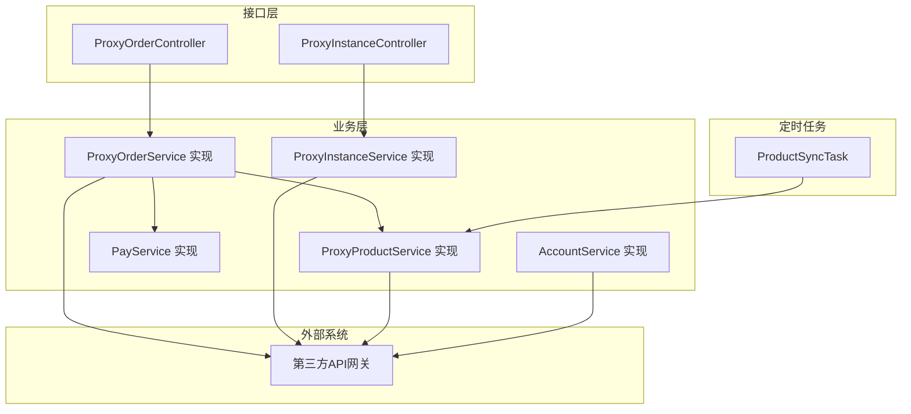
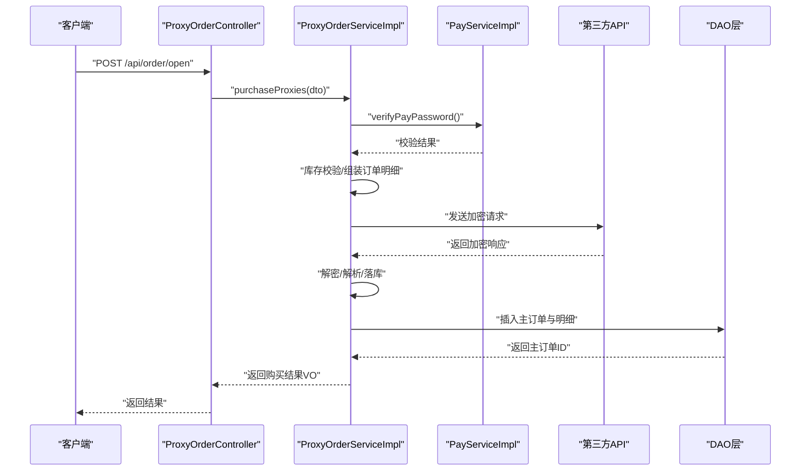
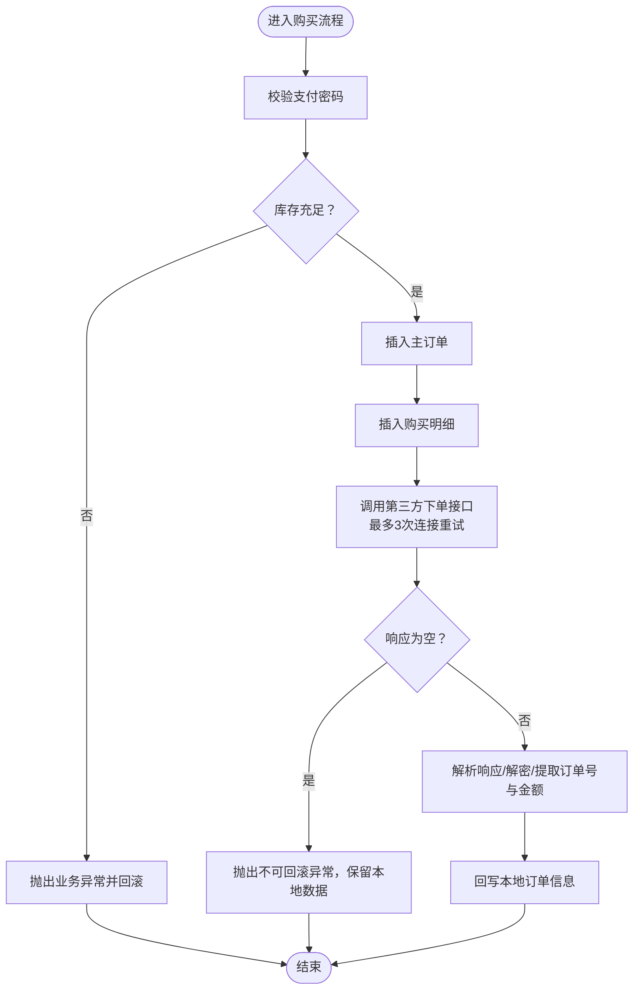
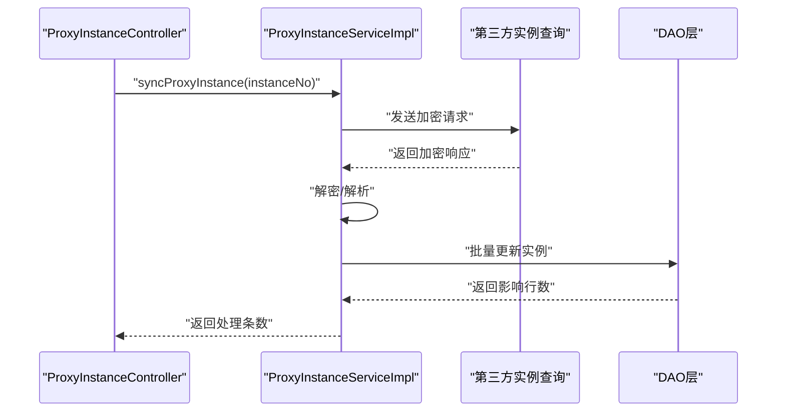
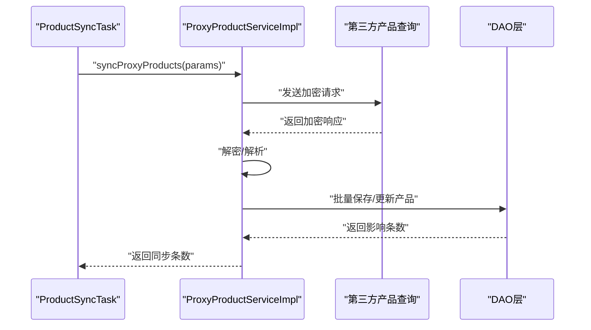
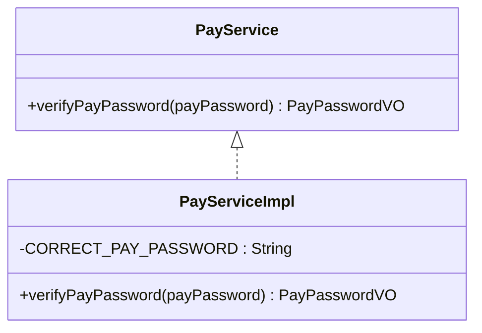
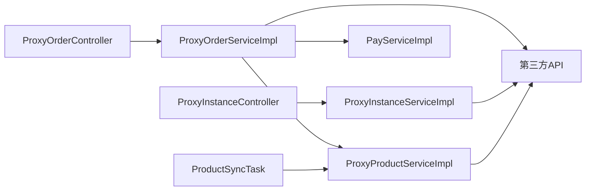

# 业务逻辑实现

<cite>
**本文引用的文件**
- [ProxyOrderServiceImpl.java](file://src/main/java/cn/linkfast/service/impl/ProxyOrderServiceImpl.java)
- [ProxyInstanceServiceImpl.java](file://src/main/java/cn/linkfast/service/impl/ProxyInstanceServiceImpl.java)
- [ProxyProductServiceImpl.java](file://src/main/java/cn/linkfast/service/impl/ProxyProductServiceImpl.java)
- [PayServiceImpl.java](file://src/main/java/cn/linkfast/service/impl/PayServiceImpl.java)
- [AccountServiceImpl.java](file://src/main/java/cn/linkfast/service/impl/AccountServiceImpl.java)
- [ProductSyncTask.java](file://src/main/java/cn/linkfast/task/ProductSyncTask.java)
- [ProxyOrderService.java](file://src/main/java/cn/linkfast/service/ProxyOrderService.java)
- [ProxyInstanceService.java](file://src/main/java/cn/linkfast/service/ProxyInstanceService.java)
- [ProxyProductService.java](file://src/main/java/cn/linkfast/service/ProxyProductService.java)
- [PayService.java](file://src/main/java/cn/linkfast/service/PayService.java)
- [ProxyOrderController.java](file://src/main/java/cn/linkfast/controller/ProxyOrderController.java)
- [ProxyInstanceController.java](file://src/main/java/cn/linkfast/controller/ProxyInstanceController.java)
- [ProxyOrder.java](file://src/main/java/cn/linkfast/entity/ProxyOrder.java)
- [ProxyInstance.java](file://src/main/java/cn/linkfast/entity/ProxyInstance.java)
- [ProxyProduct.java](file://src/main/java/cn/linkfast/entity/ProxyProduct.java)
</cite>

## 目录
1. [引言](#引言)
2. [项目结构](#项目结构)
3. [核心组件](#核心组件)
4. [架构总览](#架构总览)
5. [详细组件分析](#详细组件分析)
6. [依赖分析](#依赖分析)
7. [性能考虑](#性能考虑)
8. [故障排查指南](#故障排查指南)
9. [结论](#结论)
10. [附录](#附录)

## 引言
本文件面向 Link-Fast 项目的业务逻辑实现，聚焦 Service 层的订单处理流程、产品管理逻辑、实例生命周期管理、支付处理机制与账户管理功能。文档将系统性阐述业务规则、异常处理策略、事务管理机制、状态转换、数据一致性保障、定时任务（产品同步）工作原理，并提供调用关系图与执行流程说明，辅以性能优化建议、并发处理机制与错误恢复方案，帮助开发者进行扩展与定制。

## 项目结构
项目采用典型的分层架构：Controller（接口层）、Service（业务层）、DAO（数据访问层）、Entity/VO（数据模型与展示对象）、Task（定时任务）、Config（配置与调度）、Utils（工具类）。Service 层通过对外部第三方 API 的封装与调用，完成订单、实例、产品、账户等核心业务闭环。

图表来源
- [ProxyOrderController.java:23-85](file://src/main/java/cn/linkfast/controller/ProxyOrderController.java#L23-L85)
- [ProxyInstanceController.java:17-51](file://src/main/java/cn/linkfast/controller/ProxyInstanceController.java#L17-L51)
- [ProxyOrderServiceImpl.java:37-87](file://src/main/java/cn/linkfast/service/impl/ProxyOrderServiceImpl.java#L37-L87)
- [ProxyInstanceServiceImpl.java:38-69](file://src/main/java/cn/linkfast/service/impl/ProxyInstanceServiceImpl.java#L38-L69)
- [ProxyProductServiceImpl.java:30-84](file://src/main/java/cn/linkfast/service/impl/ProxyProductServiceImpl.java#L30-L84)
- [PayServiceImpl.java:11-30](file://src/main/java/cn/linkfast/service/impl/PayServiceImpl.java#L11-L30)
- [AccountServiceImpl.java:21-42](file://src/main/java/cn/linkfast/service/impl/AccountServiceImpl.java#L21-L42)
- [ProductSyncTask.java:23-62](file://src/main/java/cn/linkfast/task/ProductSyncTask.java#L23-L62)

章节来源
- [ProxyOrderController.java:23-85](file://src/main/java/cn/linkfast/controller/ProxyOrderController.java#L23-L85)
- [ProxyInstanceController.java:17-51](file://src/main/java/cn/linkfast/controller/ProxyInstanceController.java#L17-L51)

## 核心组件
- 订单服务（ProxyOrderService 实现）：负责订单创建（购买）、续费、释放、订单查询与第三方同步；内置支付密码校验、库存校验、幂等与重试策略、异常分类与事务控制。
- 实例服务（ProxyInstanceService 实现）：负责实例同步、分页查询、备注更新；对接第三方实例查询接口。
- 产品服务（ProxyProductService 实现）：负责产品查询、批量同步与分页查询；定时任务驱动产品数据同步。
- 支付服务（PayService 实现）：支付密码校验（当前为硬编码校验，后续可接入配置或数据库）。
- 账户服务（AccountService 实现）：账户余额与信用额度查询。
- 定时任务（ProductSyncTask）：每 30 分钟同步产品清单，启动后立即执行一次自检。

章节来源
- [ProxyOrderServiceImpl.java:37-87](file://src/main/java/cn/linkfast/service/impl/ProxyOrderServiceImpl.java#L37-L87)
- [ProxyInstanceServiceImpl.java:38-69](file://src/main/java/cn/linkfast/service/impl/ProxyInstanceServiceImpl.java#L38-L69)
- [ProxyProductServiceImpl.java:30-84](file://src/main/java/cn/linkfast/service/impl/ProxyProductServiceImpl.java#L30-L84)
- [PayServiceImpl.java:11-30](file://src/main/java/cn/linkfast/service/impl/PayServiceImpl.java#L11-L30)
- [AccountServiceImpl.java:21-42](file://src/main/java/cn/linkfast/service/impl/AccountServiceImpl.java#L21-L42)
- [ProductSyncTask.java:23-62](file://src/main/java/cn/linkfast/task/ProductSyncTask.java#L23-L62)

## 架构总览
Service 层通过统一的加密封包工具与 HTTP 工具与第三方 API 交互，使用 Jackson 解析响应，按需解密并持久化。事务边界严格区分“可回滚”与“不可回滚”的业务场景，避免重复扣款或重复落库。

图表来源
- [ProxyOrderController.java:44-47](file://src/main/java/cn/linkfast/controller/ProxyOrderController.java#L44-L47)
- [ProxyOrderServiceImpl.java:198-458](file://src/main/java/cn/linkfast/service/impl/ProxyOrderServiceImpl.java#L198-L458)
- [PayServiceImpl.java:18-29](file://src/main/java/cn/linkfast/service/impl/PayServiceImpl.java#L18-L29)

## 详细组件分析

### 订单处理流程（购买/续费/释放）
- 购买流程（purchaseProxies）
  - 支付密码校验：调用支付服务进行校验。
  - 库存校验：对每个购买项查询产品库存并校验。
  - 订单落库：先插入主订单，再插入购买明细。
  - 第三方下单：构造业务参数，加密后请求第三方下单接口，内置最多 3 次连接级重试；对“已发送但读取失败”场景抛出不可回滚异常，避免重复扣款。
  - 结果回写：解密响应后提取订单号与金额，回写本地订单。
  - 事务策略：默认回滚；当第三方已落库场景抛出不可回滚异常时，不回滚本地数据。
- 续费流程（renewProxies）
  - 流程与购买类似，但针对实例续费场景，参数包含实例编号、周期单位与时长、循环次数等。
  - 同样具备连接级重试与不可回滚异常保护。
- 释放流程（releaseProxies）
  - 输入为实例编号列表，调用第三方释放接口，同样具备重试与异常保护。
- 订单查询与同步
  - queryOrders：DTO 转条件，分页查询与计数，实体转 VO。
  - syncOrderDetails：从第三方同步订单详情，补全本地实例字段并批量更新。

图表来源
- [ProxyOrderServiceImpl.java:198-458](file://src/main/java/cn/linkfast/service/impl/ProxyOrderServiceImpl.java#L198-L458)

章节来源
- [ProxyOrderServiceImpl.java:198-458](file://src/main/java/cn/linkfast/service/impl/ProxyOrderServiceImpl.java#L198-L458)
- [ProxyOrderService.java:14-60](file://src/main/java/cn/linkfast/service/ProxyOrderService.java#L14-L60)
- [ProxyOrderController.java:44-83](file://src/main/java/cn/linkfast/controller/ProxyOrderController.java#L44-L83)
- [ProxyOrder.java:19-45](file://src/main/java/cn/linkfast/entity/ProxyOrder.java#L19-L45)

### 实例生命周期管理
- 实例同步（syncProxyInstance）
  - 从第三方查询单个实例，解密后批量更新本地实例表。
- 实例查询（queryProxyInstances）
  - DTO 转条件，分页查询并拼接国家/城市中文名称。
- 备注更新（updateRemark）
  - 更新实例备注，若未找到实例则抛出业务异常。

图表来源
- [ProxyInstanceController.java:25-36](file://src/main/java/cn/linkfast/controller/ProxyInstanceController.java#L25-L36)
- [ProxyInstanceServiceImpl.java:71-88](file://src/main/java/cn/linkfast/service/impl/ProxyInstanceServiceImpl.java#L71-L88)

章节来源
- [ProxyInstanceServiceImpl.java:71-191](file://src/main/java/cn/linkfast/service/impl/ProxyInstanceServiceImpl.java#L71-L191)
- [ProxyInstanceService.java:10-37](file://src/main/java/cn/linkfast/service/ProxyInstanceService.java#L10-L37)
- [ProxyInstanceController.java:25-48](file://src/main/java/cn/linkfast/controller/ProxyInstanceController.java#L25-L48)
- [ProxyInstance.java:13-57](file://src/main/java/cn/linkfast/entity/ProxyInstance.java#L13-L57)

### 产品管理逻辑
- 产品查询（getProxyProducts）
  - 从第三方查询产品列表，解密后返回实体列表。
- 产品同步（syncProxyProducts）
  - 从第三方查询并批量保存/更新本地产品表。
- 产品分页查询（queryProxyProducts）
  - 条件查询与分页，实体转 VO。
- 定时任务（ProductSyncTask）
  - 每 30 分钟同步一次全部代理类型的产品清单；应用启动后 5 秒执行一次自检同步。

图表来源
- [ProductSyncTask.java:35-62](file://src/main/java/cn/linkfast/task/ProductSyncTask.java#L35-L62)
- [ProxyProductServiceImpl.java:104-119](file://src/main/java/cn/linkfast/service/impl/ProxyProductServiceImpl.java#L104-L119)

章节来源
- [ProxyProductServiceImpl.java:88-174](file://src/main/java/cn/linkfast/service/impl/ProxyProductServiceImpl.java#L88-L174)
- [ProxyProductService.java:15-28](file://src/main/java/cn/linkfast/service/ProxyProductService.java#L15-L28)
- [ProductSyncTask.java:35-95](file://src/main/java/cn/linkfast/task/ProductSyncTask.java#L35-L95)
- [ProxyProduct.java:15-99](file://src/main/java/cn/linkfast/entity/ProxyProduct.java#L15-L99)

### 支付处理机制
- 支付密码校验（PayServiceImpl）
  - 当前为硬编码校验，返回通过/不通过及消息；后续可替换为数据库或配置中心。

图表来源
- [PayService.java:8-17](file://src/main/java/cn/linkfast/service/PayService.java#L8-L17)
- [PayServiceImpl.java:11-30](file://src/main/java/cn/linkfast/service/impl/PayServiceImpl.java#L11-L30)

章节来源
- [PayServiceImpl.java:11-30](file://src/main/java/cn/linkfast/service/impl/PayServiceImpl.java#L11-L30)
- [PayService.java:8-17](file://src/main/java/cn/linkfast/service/PayService.java#L8-L17)

### 账户管理功能
- 账户信息查询（AccountServiceImpl）
  - 调用第三方账户信息接口，解密后封装为 VO 返回。

章节来源
- [AccountServiceImpl.java:44-80](file://src/main/java/cn/linkfast/service/impl/AccountServiceImpl.java#L44-L80)

## 依赖分析
- 控制器到服务：Controller 仅依赖 Service 接口，保持接口与实现解耦。
- 服务到外部：Service 依赖支付服务、产品/实例/账户服务与第三方 API，通过工具类进行加密封包与 HTTP 调用。
- 事务边界：订单相关操作使用声明式事务，明确 noRollbackFor 不回滚场景，避免重复扣款。
- 定时任务：ProductSyncTask 依赖 ProxyProductService，通过 Spring 定时注解调度。

图表来源
- [ProxyOrderController.java:28-85](file://src/main/java/cn/linkfast/controller/ProxyOrderController.java#L28-L85)
- [ProxyInstanceController.java:23-51](file://src/main/java/cn/linkfast/controller/ProxyInstanceController.java#L23-L51)
- [ProxyOrderServiceImpl.java:43-45](file://src/main/java/cn/linkfast/service/impl/ProxyOrderServiceImpl.java#L43-L45)
- [ProxyInstanceServiceImpl.java:40-43](file://src/main/java/cn/linkfast/service/impl/ProxyInstanceServiceImpl.java#L40-L43)
- [ProxyProductServiceImpl.java:39-40](file://src/main/java/cn/linkfast/service/impl/ProxyProductServiceImpl.java#L39-L40)
- [ProductSyncTask.java:26-26](file://src/main/java/cn/linkfast/task/ProductSyncTask.java#L26-L26)

章节来源
- [ProxyOrderController.java:28-85](file://src/main/java/cn/linkfast/controller/ProxyOrderController.java#L28-L85)
- [ProxyInstanceController.java:23-51](file://src/main/java/cn/linkfast/controller/ProxyInstanceController.java#L23-L51)
- [ProxyOrderServiceImpl.java:43-45](file://src/main/java/cn/linkfast/service/impl/ProxyOrderServiceImpl.java#L43-L45)
- [ProxyInstanceServiceImpl.java:40-43](file://src/main/java/cn/linkfast/service/impl/ProxyInstanceServiceImpl.java#L40-L43)
- [ProxyProductServiceImpl.java:39-40](file://src/main/java/cn/linkfast/service/impl/ProxyProductServiceImpl.java#L39-L40)
- [ProductSyncTask.java:26-26](file://src/main/java/cn/linkfast/task/ProductSyncTask.java#L26-L26)

## 性能考虑
- 异步库存校验后的产品信息更新：在购买流程中对库存充足的场景，使用异步任务更新产品表，降低下单主路径延迟。
- 连接级重试：对“连接建立失败”场景进行最多 3 次指数退避式重试，避免瞬时网络抖动导致失败。
- 批量更新：实例同步与产品批量保存均采用批量写入，减少数据库往返。
- 分页查询：订单与实例查询均支持分页，避免一次性加载大量数据。
- 缓存与降级：建议在支付密码校验、产品查询等热点接口引入缓存；对第三方接口增加超时与熔断策略（可在工具层扩展）。

## 故障排查指南
- 订单创建失败
  - 若第三方响应为空或非法 JSON，将抛出不可回滚异常，需人工核对订单结果并保留本地数据。
  - 若连接失败超过重试上限，将回滚本地数据，建议检查网络连通性与第三方可用性。
- 库存不足
  - 购买前会校验库存，不足时抛出业务异常；请检查产品库存与下单数量。
- 实例同步失败
  - 若第三方返回非 200 或 data 节点缺失/为空，将抛出异常；请检查实例编号与第三方状态。
- 定时任务未执行
  - 检查任务开关与 Cron 表达式；确认应用已启用调度配置。

章节来源
- [ProxyOrderServiceImpl.java:344-451](file://src/main/java/cn/linkfast/service/impl/ProxyOrderServiceImpl.java#L344-L451)
- [ProxyInstanceServiceImpl.java:163-191](file://src/main/java/cn/linkfast/service/impl/ProxyInstanceServiceImpl.java#L163-L191)
- [ProductSyncTask.java:35-62](file://src/main/java/cn/linkfast/task/ProductSyncTask.java#L35-L62)

## 结论
Link-Fast 的 Service 层围绕“订单—实例—产品—支付—账户”形成闭环，通过严格的异常分类与事务边界划分，有效避免重复扣款与重复落库风险；通过定时任务与批量更新提升性能与一致性。建议后续在支付密码校验、第三方限流与熔断、缓存策略等方面进一步完善，以增强系统稳定性与扩展性。

## 附录
- 业务状态定义（示例）
  - 订单状态：1=待处理、2=处理中、3=处理成功、4=处理失败、5=部分完成
  - 实例状态：由第三方维护，本地仅同步
- 数据一致性保障
  - 订单主从表分离、明细批量写入；实例与产品批量更新；对不可回滚场景采用异常隔离与人工核对