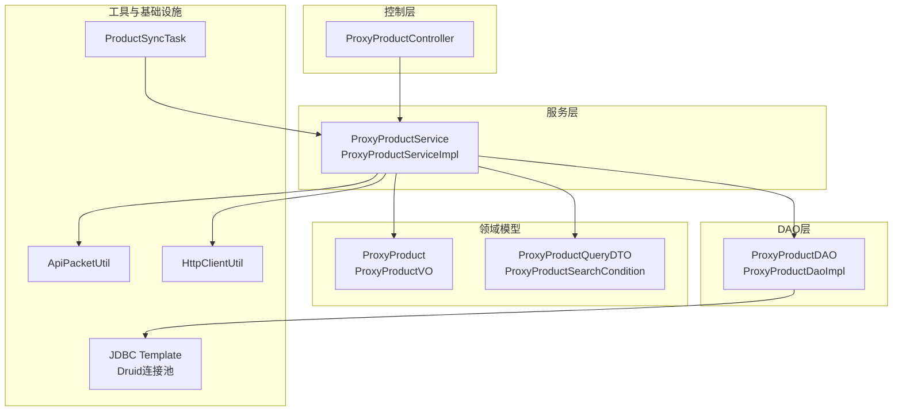
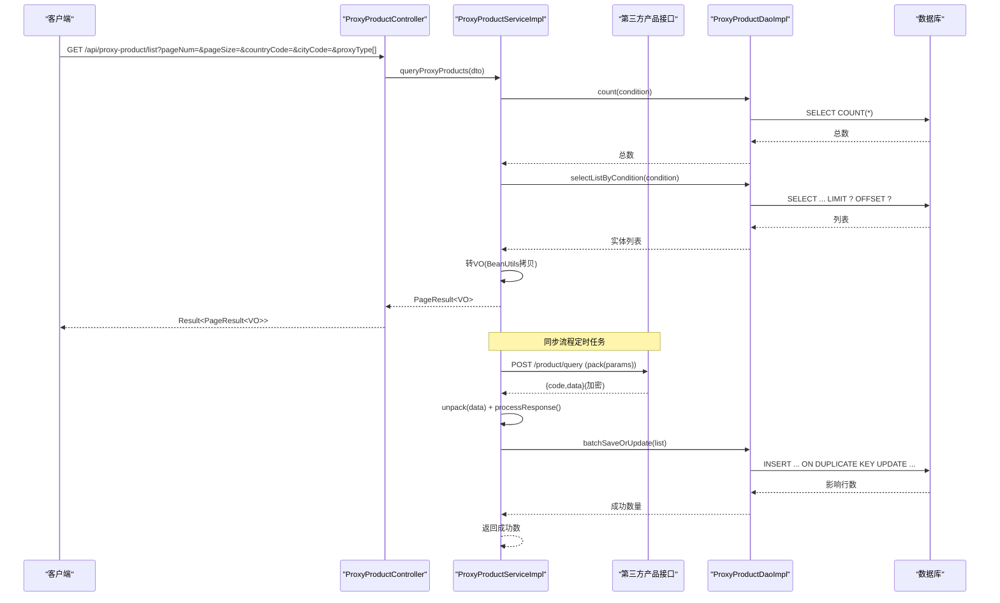
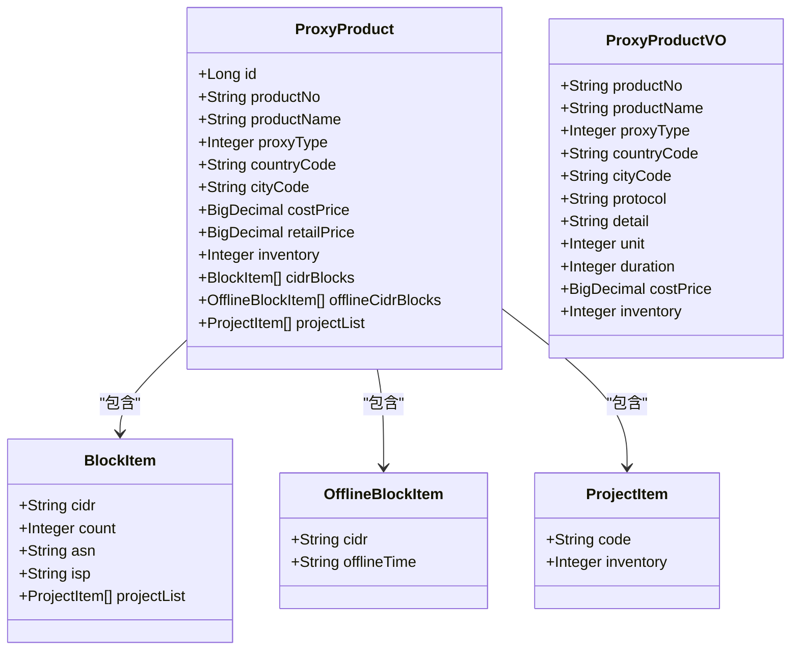
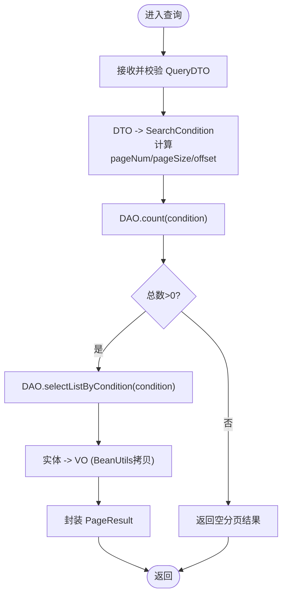
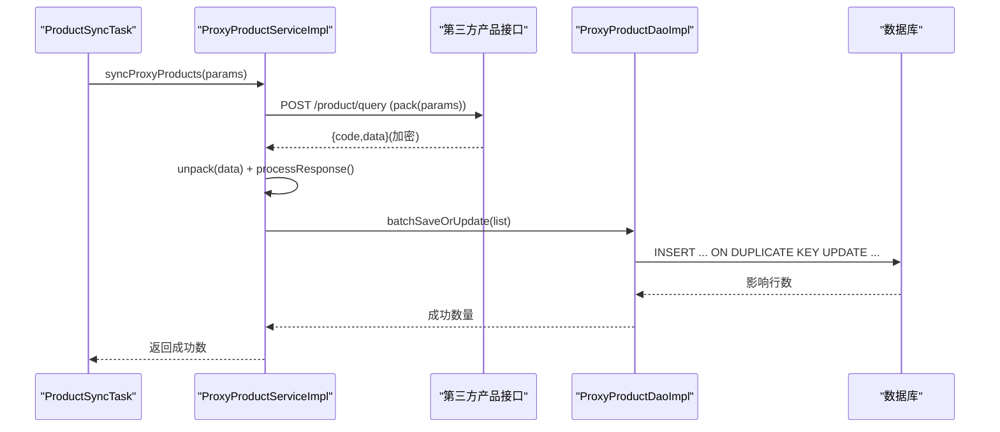
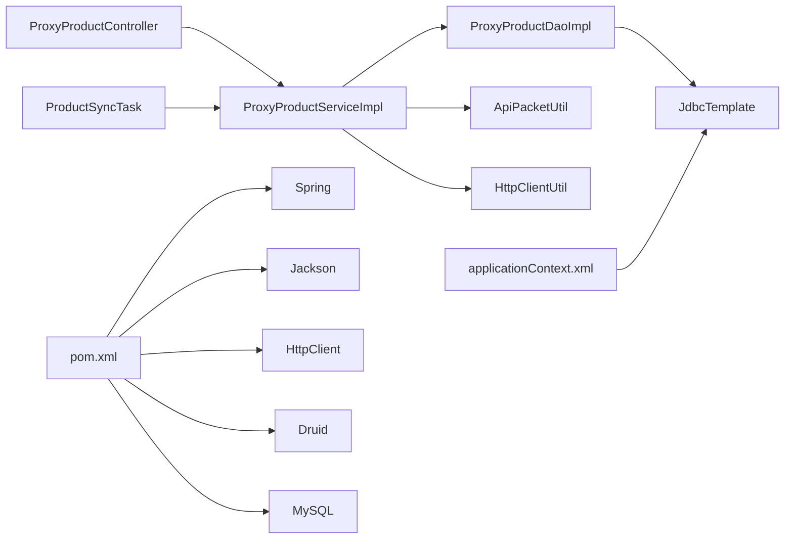

# 产品管理业务逻辑

<cite>
**本文引用的文件**
- [ProxyProduct.java](file://src/main/java/cn/linkfast/entity/ProxyProduct.java)
- [ProxyProductVO.java](file://src/main/java/cn/linkfast/vo/ProxyProductVO.java)
- [ProxyProductQueryDTO.java](file://src/main/java/cn/linkfast/dto/ProxyProductQueryDTO.java)
- [ProxyProductSearchCondition.java](file://src/main/java/cn/linkfast/dto/ProxyProductSearchCondition.java)
- [ProxyProductService.java](file://src/main/java/cn/linkfast/service/ProxyProductService.java)
- [ProxyProductServiceImpl.java](file://src/main/java/cn/linkfast/service/impl/ProxyProductServiceImpl.java)
- [ProxyProductDAO.java](file://src/main/java/cn/linkfast/dao/ProxyProductDAO.java)
- [ProxyProductDaoImpl.java](file://src/main/java/cn/linkfast/dao/impl/ProxyProductDaoImpl.java)
- [ProxyProductController.java](file://src/main/java/cn/linkfast/controller/ProxyProductController.java)
- [ProductSyncTask.java](file://src/main/java/cn/linkfast/task/ProductSyncTask.java)
- [ApiPacketUtil.java](file://src/main/java/cn/linkfast/utils/ApiPacketUtil.java)
- [HttpClientUtil.java](file://src/main/java/cn/linkfast/utils/HttpClientUtil.java)
- [applicationContext.xml](file://src/main/resources/applicationContext.xml)
- [pom.xml](file://pom.xml)
</cite>

## 目录
1. [引言](#引言)
2. [项目结构](#项目结构)
3. [核心组件](#核心组件)
4. [架构总览](#架构总览)
5. [详细组件分析](#详细组件分析)
6. [依赖分析](#依赖分析)
7. [性能考虑](#性能考虑)
8. [故障排查指南](#故障排查指南)
9. [结论](#结论)
10. [附录](#附录)

## 引言
本文件面向产品管理业务，围绕代理产品的查询、库存管理与价格计算机制进行系统化文档化。内容涵盖产品数据模型设计（属性定义、价格体系、库存策略）、搜索与过滤实现（多条件查询与排序规则）、缓存与实时同步策略、业务规则（价格校验、库存扣减、状态管理）、批量处理与异步更新机制，以及扩展与定制指导原则。目标是帮助开发者快速理解并高效扩展产品管理能力。

## 项目结构
系统采用经典的分层架构：控制层负责请求接入与参数校验；服务层承载业务逻辑与第三方接口交互；DAO层负责数据持久化与复杂查询；工具层提供加密、网络请求等通用能力；定时任务负责产品数据的异步同步。

图表来源
- [ProxyProductController.java:1-34](file://src/main/java/cn/linkfast/controller/ProxyProductController.java#L1-L34)
- [ProxyProductServiceImpl.java:1-175](file://src/main/java/cn/linkfast/service/impl/ProxyProductServiceImpl.java#L1-L175)
- [ProxyProductDaoImpl.java:1-286](file://src/main/java/cn/linkfast/dao/impl/ProxyProductDaoImpl.java#L1-L286)
- [ProxyProduct.java:1-99](file://src/main/java/cn/linkfast/entity/ProxyProduct.java#L1-L99)
- [ProxyProductVO.java:1-31](file://src/main/java/cn/linkfast/vo/ProxyProductVO.java#L1-L31)
- [ProxyProductQueryDTO.java:1-52](file://src/main/java/cn/linkfast/dto/ProxyProductQueryDTO.java#L1-L52)
- [ProxyProductSearchCondition.java:1-18](file://src/main/java/cn/linkfast/dto/ProxyProductSearchCondition.java#L1-L18)
- [ApiPacketUtil.java:1-103](file://src/main/java/cn/linkfast/utils/ApiPacketUtil.java#L1-L103)
- [HttpClientUtil.java:1-45](file://src/main/java/cn/linkfast/utils/HttpClientUtil.java#L1-L45)
- [ProductSyncTask.java:1-96](file://src/main/java/cn/linkfast/task/ProductSyncTask.java#L1-L96)
- [applicationContext.xml:1-67](file://src/main/resources/applicationContext.xml#L1-L67)

章节来源
- [ProxyProductController.java:1-34](file://src/main/java/cn/linkfast/controller/ProxyProductController.java#L1-L34)
- [ProxyProductServiceImpl.java:1-175](file://src/main/java/cn/linkfast/service/impl/ProxyProductServiceImpl.java#L1-L175)
- [ProxyProductDaoImpl.java:1-286](file://src/main/java/cn/linkfast/dao/impl/ProxyProductDaoImpl.java#L1-L286)
- [applicationContext.xml:1-67](file://src/main/resources/applicationContext.xml#L1-L67)

## 核心组件
- 控制器：接收分页查询请求，参数绑定至查询DTO，调用服务层并返回统一结果包装。
- 服务层：负责与第三方产品接口通信、解析响应、批量落库、本地分页查询与VO转换。
- DAO层：提供批量保存/更新、条件查询、计数、按编号查询等能力，含JSON字段序列化/反序列化。
- 领域模型：产品实体、展示VO、查询DTO与DAO条件对象。
- 工具层：请求打包与解包（AES+Base64）、HTTP客户端封装。
- 定时任务：周期性从第三方同步产品数据，支持启动即同步保障初始化。

章节来源
- [ProxyProductController.java:1-34](file://src/main/java/cn/linkfast/controller/ProxyProductController.java#L1-L34)
- [ProxyProductService.java:1-28](file://src/main/java/cn/linkfast/service/ProxyProductService.java#L1-L28)
- [ProxyProductServiceImpl.java:1-175](file://src/main/java/cn/linkfast/service/impl/ProxyProductServiceImpl.java#L1-L175)
- [ProxyProductDAO.java:1-25](file://src/main/java/cn/linkfast/dao/ProxyProductDAO.java#L1-L25)
- [ProxyProductDaoImpl.java:1-286](file://src/main/java/cn/linkfast/dao/impl/ProxyProductDaoImpl.java#L1-L286)
- [ProxyProduct.java:1-99](file://src/main/java/cn/linkfast/entity/ProxyProduct.java#L1-L99)
- [ProxyProductVO.java:1-31](file://src/main/java/cn/linkfast/vo/ProxyProductVO.java#L1-L31)
- [ProxyProductQueryDTO.java:1-52](file://src/main/java/cn/linkfast/dto/ProxyProductQueryDTO.java#L1-L52)
- [ProxyProductSearchCondition.java:1-18](file://src/main/java/cn/linkfast/dto/ProxyProductSearchCondition.java#L1-L18)
- [ApiPacketUtil.java:1-103](file://src/main/java/cn/linkfast/utils/ApiPacketUtil.java#L1-L103)
- [HttpClientUtil.java:1-45](file://src/main/java/cn/linkfast/utils/HttpClientUtil.java#L1-L45)
- [ProductSyncTask.java:1-96](file://src/main/java/cn/linkfast/task/ProductSyncTask.java#L1-L96)

## 架构总览
系统通过REST接口对外提供产品查询能力，内部通过服务层与第三方接口交互，完成产品数据的拉取与落库；DAO层承担本地查询与批量写入职责；定时任务保障数据的持续同步与初始化补全。

图表来源
- [ProxyProductController.java:1-34](file://src/main/java/cn/linkfast/controller/ProxyProductController.java#L1-L34)
- [ProxyProductServiceImpl.java:1-175](file://src/main/java/cn/linkfast/service/impl/ProxyProductServiceImpl.java#L1-L175)
- [ProxyProductDaoImpl.java:1-286](file://src/main/java/cn/linkfast/dao/impl/ProxyProductDaoImpl.java#L1-L286)
- [ApiPacketUtil.java:1-103](file://src/main/java/cn/linkfast/utils/ApiPacketUtil.java#L1-L103)
- [HttpClientUtil.java:1-45](file://src/main/java/cn/linkfast/utils/HttpClientUtil.java#L1-L45)

## 详细组件分析

### 数据模型与价格/库存体系
- 产品实体包含基础属性（编号、名称、国家/城市代码、协议、用途限制等）、价格字段（成本价、零售价）、库存字段（inventory）、规格字段（带宽、流量、CPU、内存等），以及若干布尔/枚举开关字段。
- JSON字段：支持存储CIDR块、离线块、项目清单等复杂结构，DAO层提供序列化/反序列化工具，保证空值安全与容错。
- 展示VO：仅暴露前端所需字段，避免敏感信息外泄，便于后续扩展字段映射与格式化。

图表来源
- [ProxyProduct.java:1-99](file://src/main/java/cn/linkfast/entity/ProxyProduct.java#L1-L99)
- [ProxyProductVO.java:1-31](file://src/main/java/cn/linkfast/vo/ProxyProductVO.java#L1-L31)

章节来源
- [ProxyProduct.java:1-99](file://src/main/java/cn/linkfast/entity/ProxyProduct.java#L1-L99)
- [ProxyProductVO.java:1-31](file://src/main/java/cn/linkfast/vo/ProxyProductVO.java#L1-L31)
- [ProxyProductDaoImpl.java:37-98](file://src/main/java/cn/linkfast/dao/impl/ProxyProductDaoImpl.java#L37-L98)

### 查询与过滤逻辑
- 查询DTO：支持国家/城市代码、页码、页大小、代理类型列表等参数；页码与页大小具备校验约束。
- 条件构建：服务层将DTO转换为DAO条件对象，计算offset；DAO层拼接WHERE子句，支持country_code、city_code与proxy_type IN集合。
- 分页与计数：先count再查询，确保分页组件正确显示总页数；DAO层统一LIMIT/OFFSET。
- 排序规则：当前实现未显式指定ORDER BY，默认按主键或索引顺序；如需稳定排序，可在DAO层增加ORDER BY子句。

图表来源
- [ProxyProductQueryDTO.java:1-52](file://src/main/java/cn/linkfast/dto/ProxyProductQueryDTO.java#L1-L52)
- [ProxyProductSearchCondition.java:1-18](file://src/main/java/cn/linkfast/dto/ProxyProductSearchCondition.java#L1-L18)
- [ProxyProductServiceImpl.java:121-141](file://src/main/java/cn/linkfast/service/impl/ProxyProductServiceImpl.java#L121-L141)
- [ProxyProductDaoImpl.java:192-234](file://src/main/java/cn/linkfast/dao/impl/ProxyProductDaoImpl.java#L192-L234)

章节来源
- [ProxyProductQueryDTO.java:1-52](file://src/main/java/cn/linkfast/dto/ProxyProductQueryDTO.java#L1-L52)
- [ProxyProductSearchCondition.java:1-18](file://src/main/java/cn/linkfast/dto/ProxyProductSearchCondition.java#L1-L18)
- [ProxyProductServiceImpl.java:56-71](file://src/main/java/cn/linkfast/service/impl/ProxyProductServiceImpl.java#L56-L71)
- [ProxyProductDaoImpl.java:202-234](file://src/main/java/cn/linkfast/dao/impl/ProxyProductDaoImpl.java#L202-L234)

### 价格计算与库存管理
- 价格字段：成本价与零售价均以高精度数值类型存储；展示层仅暴露必要字段，避免泄露内部定价策略。
- 库存策略：库存字段作为总量控制，DAO层提供批量更新能力；当前未见显式的库存扣减逻辑，建议在下单/购买流程中补充原子性扣减与回滚策略。
- 价格验证：建议在服务层增加价格校验规则（如成本价不高于零售价、非负数、精度限制等），并在入库前统一校验。

章节来源
- [ProxyProduct.java:31-46](file://src/main/java/cn/linkfast/entity/ProxyProduct.java#L31-L46)
- [ProxyProductVO.java:29-30](file://src/main/java/cn/linkfast/vo/ProxyProductVO.java#L29-L30)
- [ProxyProductDaoImpl.java:100-190](file://src/main/java/cn/linkfast/dao/impl/ProxyProductDaoImpl.java#L100-L190)

### 缓存与实时同步机制
- 缓存策略：当前未发现应用层缓存实现；建议对高频查询（如国家/城市维度）引入Redis缓存，设置合理TTL与失效策略。
- 实时同步：定时任务每30分钟从第三方接口同步产品数据；启动后5秒执行一次初始化同步，确保数据库有初始数据。
- 第三方接口：通过工具类进行请求打包（版本号、加密方式、appKey、reqId、params等），并进行AES CBC加密与Base64编码；响应解密后解析为产品列表，再批量落库。

图表来源
- [ProductSyncTask.java:35-62](file://src/main/java/cn/linkfast/task/ProductSyncTask.java#L35-L62)
- [ProxyProductServiceImpl.java:103-119](file://src/main/java/cn/linkfast/service/impl/ProxyProductServiceImpl.java#L103-L119)
- [ApiPacketUtil.java:56-90](file://src/main/java/cn/linkfast/utils/ApiPacketUtil.java#L56-L90)
- [HttpClientUtil.java:27-43](file://src/main/java/cn/linkfast/utils/HttpClientUtil.java#L27-L43)
- [ProxyProductDaoImpl.java:100-190](file://src/main/java/cn/linkfast/dao/impl/ProxyProductDaoImpl.java#L100-L190)

章节来源
- [ProductSyncTask.java:1-96](file://src/main/java/cn/linkfast/task/ProductSyncTask.java#L1-L96)
- [ProxyProductServiceImpl.java:103-119](file://src/main/java/cn/linkfast/service/impl/ProxyProductServiceImpl.java#L103-L119)
- [ApiPacketUtil.java:1-103](file://src/main/java/cn/linkfast/utils/ApiPacketUtil.java#L1-L103)
- [HttpClientUtil.java:1-45](file://src/main/java/cn/linkfast/utils/HttpClientUtil.java#L1-L45)

### 业务规则说明
- 价格验证：建议在入库前校验成本价与零售价的合法性（非负、精度、大小关系）。
- 库存扣减：在下单/购买环节执行原子性扣减，失败时回滚；并发场景下建议使用分布式锁或数据库层面的CAS更新。
- 产品状态管理：实体包含启用标志字段，可用于逻辑删除或灰度发布；建议在查询时默认过滤启用状态。
- 参数校验：查询DTO对页码与页大小进行范围校验，避免异常请求。

章节来源
- [ProxyProductQueryDTO.java:35-45](file://src/main/java/cn/linkfast/dto/ProxyProductQueryDTO.java#L35-L45)
- [ProxyProduct.java:46-47](file://src/main/java/cn/linkfast/entity/ProxyProduct.java#L46-L47)

### 批量处理与异步更新
- 批量保存/更新：DAO层使用JDBC批处理与ON DUPLICATE KEY UPDATE，提升写入效率；返回成功数量便于统计。
- 异步更新：定时任务与启动检查任务分别负责周期性同步与初始化补全，降低对在线查询的影响。

章节来源
- [ProxyProductDaoImpl.java:100-190](file://src/main/java/cn/linkfast/dao/impl/ProxyProductDaoImpl.java#L100-L190)
- [ProductSyncTask.java:35-62](file://src/main/java/cn/linkfast/task/ProductSyncTask.java#L35-L62)

### 扩展与定制指导
- 新增查询维度：在查询DTO与DAO条件中扩展字段，DAO层拼接对应WHERE子句；注意IN集合的参数绑定。
- 新增展示字段：在VO中添加字段，服务层在转换时进行映射；避免泄露敏感信息。
- 价格/库存策略扩展：在服务层增加校验与策略逻辑，必要时引入缓存与分布式锁。
- 第三方接口适配：通过工具类统一请求打包与解包，保持接口一致性。

章节来源
- [ProxyProductQueryDTO.java:1-52](file://src/main/java/cn/linkfast/dto/ProxyProductQueryDTO.java#L1-L52)
- [ProxyProductSearchCondition.java:1-18](file://src/main/java/cn/linkfast/dto/ProxyProductSearchCondition.java#L1-L18)
- [ProxyProductServiceImpl.java:146-153](file://src/main/java/cn/linkfast/service/impl/ProxyProductServiceImpl.java#L146-L153)
- [ApiPacketUtil.java:56-90](file://src/main/java/cn/linkfast/utils/ApiPacketUtil.java#L56-L90)

## 依赖分析
- 控制器依赖服务层；服务层依赖DAO、工具类与配置；DAO依赖JDBC模板与对象映射；定时任务依赖服务层。
- 外部依赖：Spring Web/MVC、JDBC、Jackson、Apache HttpClient、Druid连接池、MySQL驱动等。

图表来源
- [ProxyProductController.java:1-34](file://src/main/java/cn/linkfast/controller/ProxyProductController.java#L1-L34)
- [ProxyProductServiceImpl.java:1-175](file://src/main/java/cn/linkfast/service/impl/ProxyProductServiceImpl.java#L1-L175)
- [ProxyProductDaoImpl.java:1-286](file://src/main/java/cn/linkfast/dao/impl/ProxyProductDaoImpl.java#L1-L286)
- [applicationContext.xml:1-67](file://src/main/resources/applicationContext.xml#L1-L67)
- [pom.xml:1-278](file://pom.xml#L1-L278)

章节来源
- [pom.xml:22-212](file://pom.xml#L22-L212)
- [applicationContext.xml:1-67](file://src/main/resources/applicationContext.xml#L1-L67)

## 性能考虑
- 批量写入：使用JDBC批处理与ON DUPLICATE KEY UPDATE，减少往返次数；建议分批提交并监控影响行数。
- 查询优化：为常用过滤字段建立索引（如country_code、city_code、proxy_type）；避免SELECT *，仅取必要列。
- 连接池：Druid连接池已配置保活、空闲回收、泄露检测等策略，确保稳定性与资源利用率。
- 缓存：对热点数据引入Redis缓存，降低DB压力；结合TTL与失效策略，保证一致性与性能平衡。
- 定时任务：30分钟同步间隔适中，避免频繁拉取第三方接口；启动即同步确保初始数据完整。

章节来源
- [ProxyProductDaoImpl.java:100-190](file://src/main/java/cn/linkfast/dao/impl/ProxyProductDaoImpl.java#L100-L190)
- [applicationContext.xml:14-52](file://src/main/resources/applicationContext.xml#L14-L52)
- [ProductSyncTask.java:35-62](file://src/main/java/cn/linkfast/task/ProductSyncTask.java#L35-L62)

## 故障排查指南
- HTTP请求失败：检查第三方接口URL、环境配置与网络连通性；关注状态码与错误消息。
- 解密失败：确认环境配置（沙盒/生产）与密钥长度；确保IV截取正确。
- JSON解析异常：DAO层对JSON字段提供容错回退为空集合；若仍失败，检查第三方返回格式。
- 批量写入异常：捕获异常并记录日志，定位具体批次与字段；核对数据库字段类型与长度。
- 定时任务未执行：确认任务开关与Cron表达式；检查日志输出与异常堆栈。

章节来源
- [HttpClientUtil.java:27-43](file://src/main/java/cn/linkfast/utils/HttpClientUtil.java#L27-L43)
- [ApiPacketUtil.java:39-51](file://src/main/java/cn/linkfast/utils/ApiPacketUtil.java#L39-L51)
- [ProxyProductDaoImpl.java:259-271](file://src/main/java/cn/linkfast/dao/impl/ProxyProductDaoImpl.java#L259-L271)
- [ProductSyncTask.java:35-62](file://src/main/java/cn/linkfast/task/ProductSyncTask.java#L35-L62)

## 结论
本系统通过清晰的分层设计与完善的工具链，实现了代理产品的查询、同步与落库能力。建议后续在价格/库存策略、缓存与一致性、查询排序与索引优化等方面进一步完善，以满足更高性能与可靠性需求。同时，通过DTO/VO分离与严格的参数校验，确保接口协议与数据模型的解耦与安全。

## 附录
- 配置文件位置：Spring上下文配置、数据库连接池、事务管理等。
- 依赖清单：Spring、Jackson、HttpClient、Druid、MySQL等。

章节来源
- [applicationContext.xml:1-67](file://src/main/resources/applicationContext.xml#L1-L67)
- [pom.xml:22-212](file://pom.xml#L22-L212)