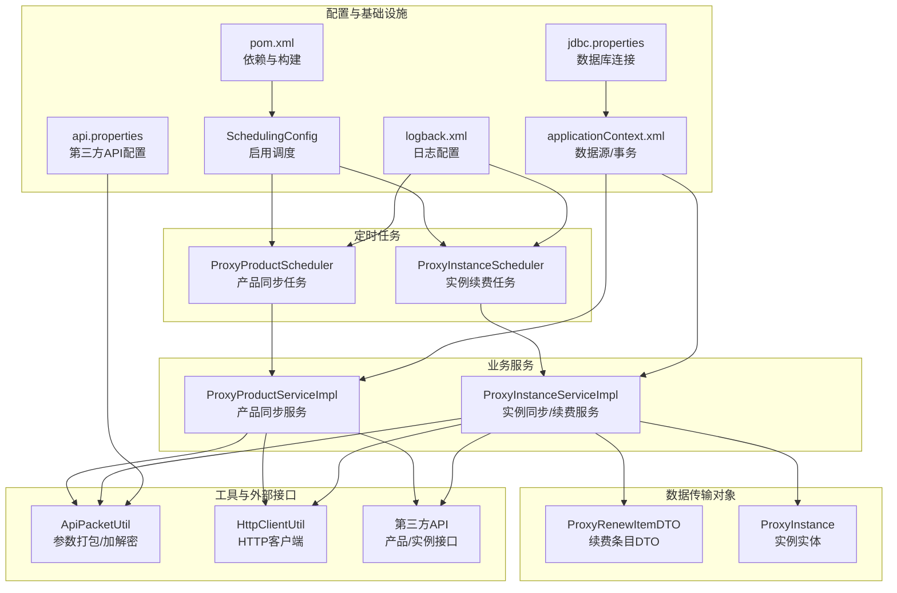
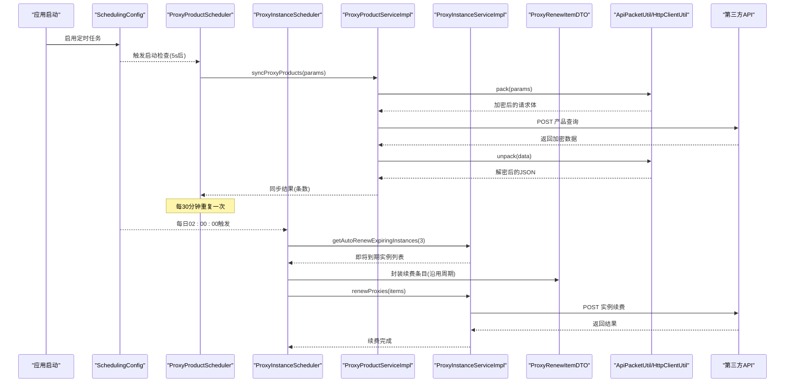
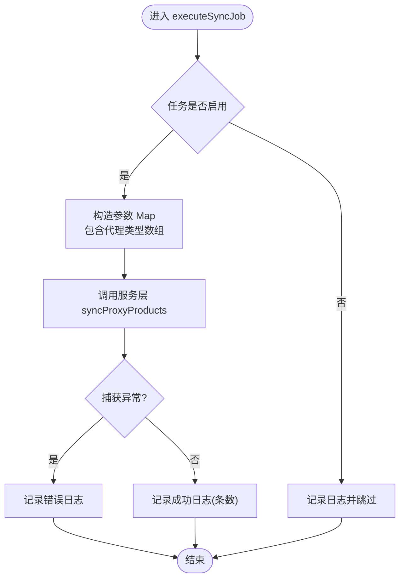
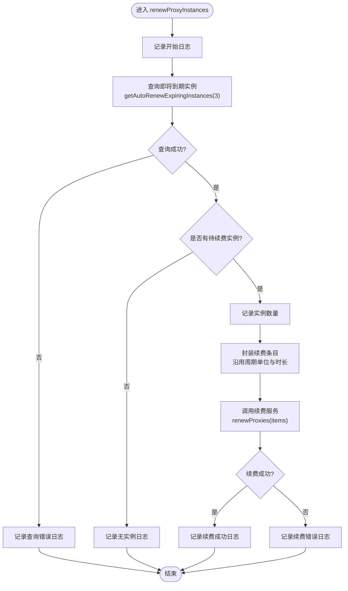
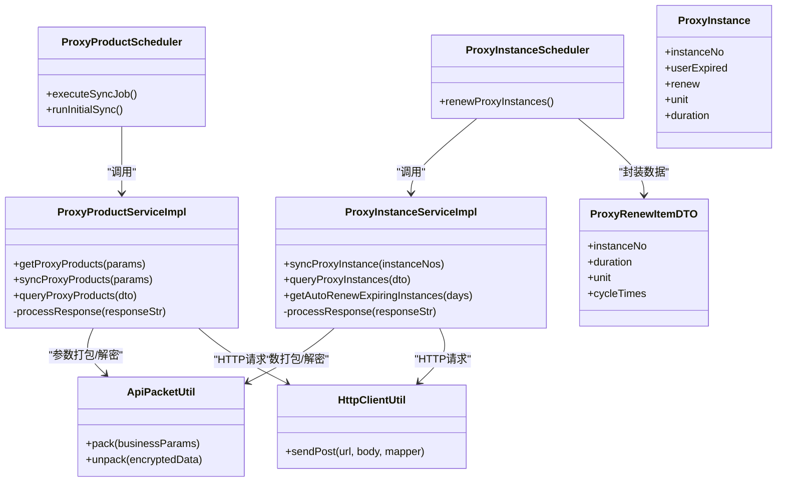
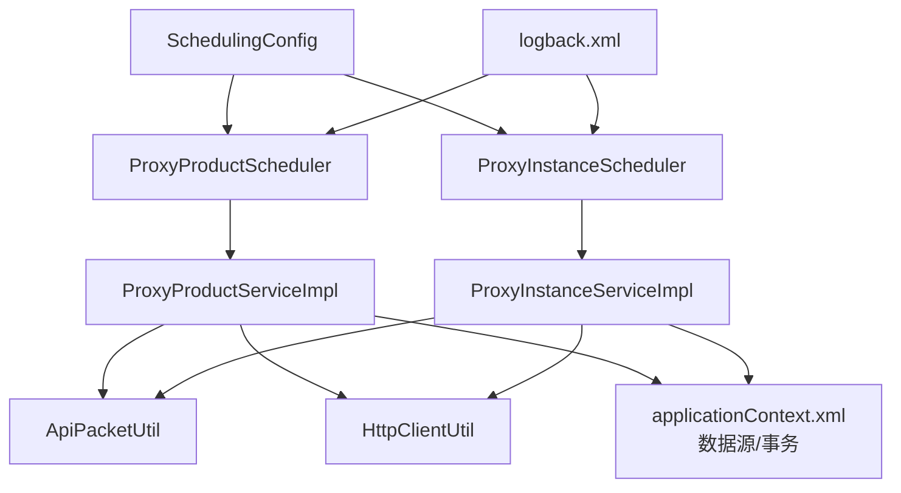

# 定时任务实现

<cite>
**本文引用的文件**   
- [SchedulingConfig.java](file://src/main/java/cn/linkfast/config/SchedulingConfig.java)
- [ProxyProductScheduler.java](file://src/main/java/cn/linkfast/task/ProxyProductScheduler.java)
- [ProxyInstanceScheduler.java](file://src/main/java/cn/linkfast/task/ProxyInstanceScheduler.java)
- [ProxyInstanceServiceImpl.java](file://src/main/java/cn/linkfast/service/impl/ProxyInstanceServiceImpl.java)
- [ProxyRenewItemDTO.java](file://src/main/java/cn/linkfast/dto/ProxyRenewItemDTO.java)
- [ProxyInstance.java](file://src/main/java/cn/linkfast/entity/ProxyInstance.java)
- [ProxyInstanceSchedulerIT.java](file://src/test/java/cn/linkfast/task/ProxyInstanceSchedulerIT.java)
- [applicationContext.xml](file://src/main/resources/applicationContext.xml)
- [logback.xml](file://src/main/resources/logback.xml)
- [jdbc.properties](file://src/main/resources/jdbc.properties)
- [api.properties](file://src/main/resources/api.properties)
- [pom.xml](file://pom.xml)
</cite>

## 目录
1. [简介](#简介)
2. [项目结构](#项目结构)
3. [核心组件](#核心组件)
4. [架构总览](#架构总览)
5. [详细组件分析](#详细组件分析)
6. [依赖关系分析](#依赖关系分析)
7. [性能考虑](#性能考虑)
8. [故障排除指南](#故障排除指南)
9. [结论](#结论)
10. [附录](#附录)

## 简介
本文件面向"定时任务实现"的技术文档，聚焦于产品同步任务与实例续费任务的调度机制、执行频率、同步策略、配置方法、监控与日志、异常处理与重试、与业务系统的集成方式、性能优化策略以及故障排除与维护指导。文档基于实际代码进行分析，帮助开发者快速理解与扩展定时任务能力。

## 项目结构
定时任务相关代码位于以下位置：
- 配置与开关：cn.linkfast.config.SchedulingConfig
- 任务调度器：cn.linkfast.task.ProxyProductScheduler、cn.linkfast.task.ProxyInstanceScheduler
- 业务服务：cn.linkfast.service.impl.ProxyProductServiceImpl、cn.linkfast.service.impl.ProxyInstanceServiceImpl
- DTO与实体：cn.linkfast.dto.ProxyRenewItemDTO、cn.linkfast.entity.ProxyInstance
- 工具类：cn.linkfast.utils.ApiPacketUtil、cn.linkfast.utils.HttpClientUtil
- 资源配置：applicationContext.xml、logback.xml、jdbc.properties、api.properties
- 依赖管理：pom.xml

**图表来源**
- [SchedulingConfig.java:1-10](file://src/main/java/cn/linkfast/config/SchedulingConfig.java#L1-L10)
- [ProxyProductScheduler.java:1-96](file://src/main/java/cn/linkfast/task/ProxyProductScheduler.java#L1-L96)
- [ProxyInstanceScheduler.java:1-81](file://src/main/java/cn/linkfast/task/ProxyInstanceScheduler.java#L1-L81)
- [ProxyInstanceServiceImpl.java:1-247](file://src/main/java/cn/linkfast/service/impl/ProxyInstanceServiceImpl.java#L1-L247)
- [ProxyRenewItemDTO.java:1-19](file://src/main/java/cn/linkfast/dto/ProxyRenewItemDTO.java#L1-L19)
- [ProxyInstance.java:1-57](file://src/main/java/cn/linkfast/entity/ProxyInstance.java#L1-L57)
- [ApiPacketUtil.java:1-106](file://src/main/java/cn/linkfast/utils/ApiPacketUtil.java#L1-L106)
- [HttpClientUtil.java:1-46](file://src/main/java/cn/linkfast/utils/HttpClientUtil.java#L1-L46)
- [applicationContext.xml:1-67](file://src/main/resources/applicationContext.xml#L1-L67)
- [logback.xml:1-49](file://src/main/resources/logback.xml#L1-L49)
- [jdbc.properties:1-34](file://src/main/resources/jdbc.properties#L1-L34)
- [api.properties:1-31](file://src/main/resources/api.properties#L1-L31)
- [pom.xml:1-294](file://pom.xml#L1-L294)

**章节来源**
- [SchedulingConfig.java:1-10](file://src/main/java/cn/linkfast/config/SchedulingConfig.java#L1-L10)
- [applicationContext.xml:1-67](file://src/main/resources/applicationContext.xml#L1-L67)
- [logback.xml:1-49](file://src/main/resources/logback.xml#L1-L49)
- [pom.xml:1-294](file://pom.xml#L1-L294)

## 核心组件
- 调度开关与容器
  - SchedulingConfig：通过注解启用 Spring 定时任务功能，作为全局开关。
- 产品同步任务
  - ProxyProductScheduler：定时拉取第三方产品列表，支持启动即检查与周期性同步。
- 实例续费任务
  - ProxyInstanceScheduler：每日凌晨执行，查询即将到期实例并自动续费。
- 业务服务
  - ProxyProductServiceImpl：封装第三方产品接口调用、参数打包、响应解析与入库。
  - ProxyInstanceServiceImpl：封装实例查询、地域映射、续费触发等。
- 数据传输对象
  - ProxyRenewItemDTO：续费条目数据传输对象，包含实例编号、周期单位、周期时长等。
  - ProxyInstance：代理实例实体类，包含实例基本信息、状态、到期时间等。
- 工具与外部接口
  - ApiPacketUtil：参数加密、响应解密、公共字段组装。
  - HttpClientUtil：统一 POST JSON 请求封装。
- 配置与基础设施
  - applicationContext.xml：数据源、事务、JdbcTemplate。
  - logback.xml：业务日志与服务器日志分离输出。
  - api.properties：第三方 API 环境、路径与密钥配置。
  - jdbc.properties：数据库连接参数。

**章节来源**
- [SchedulingConfig.java:1-10](file://src/main/java/cn/linkfast/config/SchedulingConfig.java#L1-L10)
- [ProxyProductScheduler.java:1-96](file://src/main/java/cn/linkfast/task/ProxyProductScheduler.java#L1-L96)
- [ProxyInstanceScheduler.java:1-81](file://src/main/java/cn/linkfast/task/ProxyInstanceScheduler.java#L1-L81)
- [ProxyInstanceServiceImpl.java:1-247](file://src/main/java/cn/linkfast/service/impl/ProxyInstanceServiceImpl.java#L1-L247)
- [ProxyRenewItemDTO.java:1-19](file://src/main/java/cn/linkfast/dto/ProxyRenewItemDTO.java#L1-L19)
- [ProxyInstance.java:1-57](file://src/main/java/cn/linkfast/entity/ProxyInstance.java#L1-L57)
- [ApiPacketUtil.java:1-106](file://src/main/java/cn/linkfast/utils/ApiPacketUtil.java#L1-L106)
- [HttpClientUtil.java:1-46](file://src/main/java/cn/linkfast/utils/HttpClientUtil.java#L1-L46)
- [applicationContext.xml:1-67](file://src/main/resources/applicationContext.xml#L1-L67)
- [logback.xml:1-49](file://src/main/resources/logback.xml#L1-L49)
- [api.properties:1-31](file://src/main/resources/api.properties#L1-L31)
- [jdbc.properties:1-34](file://src/main/resources/jdbc.properties#L1-L34)

## 架构总览
定时任务整体流程如下：
- 启动阶段：SchedulingConfig 启用调度；ProxyProductScheduler 的启动检查任务在应用启动后立即执行一次，确保初始数据存在。
- 周期执行：ProxyProductScheduler 每 30 分钟执行一次产品同步；ProxyInstanceScheduler 每天 02:00:00 执行实例续费。
- 业务调用：服务层通过 ApiPacketUtil 对参数进行加密与公共字段封装，使用 HttpClientUtil 发起 HTTP 请求，解析第三方返回并持久化。
- 日志与监控：日志分别输出到业务日志与服务器日志，便于定位问题与审计。

**图表来源**
- [SchedulingConfig.java:1-10](file://src/main/java/cn/linkfast/config/SchedulingConfig.java#L1-L10)
- [ProxyProductScheduler.java:1-96](file://src/main/java/cn/linkfast/task/ProxyProductScheduler.java#L1-L96)
- [ProxyInstanceScheduler.java:1-81](file://src/main/java/cn/linkfast/task/ProxyInstanceScheduler.java#L1-L81)
- [ProxyInstanceServiceImpl.java:208-210](file://src/main/java/cn/linkfast/service/impl/ProxyInstanceServiceImpl.java#L208-L210)
- [ProxyRenewItemDTO.java:1-19](file://src/main/java/cn/linkfast/dto/ProxyRenewItemDTO.java#L1-L19)
- [ApiPacketUtil.java:1-106](file://src/main/java/cn/linkfast/utils/ApiPacketUtil.java#L1-L106)
- [HttpClientUtil.java:1-46](file://src/main/java/cn/linkfast/utils/HttpClientUtil.java#L1-L46)

## 详细组件分析

### 产品同步任务（ProxyProductScheduler）
- 调度策略
  - 周期任务：每 30 分钟执行一次，使用 cron 表达式。
  - 启动检查：应用启动 5 秒后执行一次，确保数据库初始数据存在。
- 参数与策略
  - 固定拉取全部代理类型，支持扩展按国家/供应商过滤。
  - 支持通过配置项动态启用/禁用任务。
- 执行流程
  - 构造参数 Map，包含代理类型数组；
  - 调用服务层同步方法，内部完成加密、请求、解密与入库；
  - 记录开始/结束与异常日志。
- 异常处理
  - 任务级 try-catch 记录致命错误，避免中断调度线程。

**图表来源**
- [ProxyProductScheduler.java:35-62](file://src/main/java/cn/linkfast/task/ProxyProductScheduler.java#L35-L62)
- [ProxyProductServiceImpl.java:104-119](file://src/main/java/cn/linkfast/service/impl/ProxyProductServiceImpl.java#L104-L119)

**章节来源**
- [ProxyProductScheduler.java:35-62](file://src/main/java/cn/linkfast/task/ProxyProductScheduler.java#L35-L62)
- [ProxyProductServiceImpl.java:104-119](file://src/main/java/cn/linkfast/service/impl/ProxyProductServiceImpl.java#L104-L119)

### 实例续费任务（ProxyInstanceScheduler）
- 调度策略
  - 每天凌晨 02:00:00 执行，使用 Spring 6 标准 cron 表达式格式。
- 核心配置
  - EXPIRING_SOON_DAYS：距离到期天数阈值为 3 天。
  - AUTO_RENEW_PAY_PASSWORD：固定支付密码"168888"。
- 业务逻辑
  - 查询已开启自动续费且距离到期不足 3 天的实例；
  - 将实例封装为 ProxyRenewItemDTO 列表，沿用原有周期单位与时长；
  - 调用续费服务，记录结果。
- 异常处理
  - 查询失败与续费失败均记录错误日志，避免中断调度。
- 集成测试验证
  - ProxyInstanceSchedulerIT 提供完整的集成测试，验证续费流程的正确性。

**图表来源**
- [ProxyInstanceScheduler.java:40-79](file://src/main/java/cn/linkfast/task/ProxyInstanceScheduler.java#L40-L79)
- [ProxyInstanceServiceImpl.java:208-210](file://src/main/java/cn/linkfast/service/impl/ProxyInstanceServiceImpl.java#L208-L210)
- [ProxyInstanceSchedulerIT.java:58-192](file://src/test/java/cn/linkfast/task/ProxyInstanceSchedulerIT.java#L58-L192)

**章节来源**
- [ProxyInstanceScheduler.java:40-79](file://src/main/java/cn/linkfast/task/ProxyInstanceScheduler.java#L40-L79)
- [ProxyInstanceServiceImpl.java:208-210](file://src/main/java/cn/linkfast/service/impl/ProxyInstanceServiceImpl.java#L208-L210)
- [ProxyInstanceSchedulerIT.java:58-192](file://src/test/java/cn/linkfast/task/ProxyInstanceSchedulerIT.java#L58-L192)

### 数据传输对象与实体类
- ProxyRenewItemDTO
  - instanceNo：代理实例编号
  - duration：周期时长
  - unit：周期单位
  - cycleTimes：续费周期次数，默认为 1
- ProxyInstance
  - 包含实例基本信息：instanceNo、userExpired、renew、unit、duration
  - 时间戳字段：userExpired（到期时间，秒）
  - 状态字段：renew（是否自动续费）

**章节来源**
- [ProxyRenewItemDTO.java:13-18](file://src/main/java/cn/linkfast/dto/ProxyRenewItemDTO.java#L13-L18)
- [ProxyInstance.java:18-50](file://src/main/java/cn/linkfast/entity/ProxyInstance.java#L18-L50)

### 业务服务与工具链
- 参数打包与加解密（ApiPacketUtil）
  - 根据环境选择 appKey/appSecret；
  - 生成 AES CBC IV（取密钥前 16 字节）；
  - pack：将业务参数序列化为 JSON，AES CBC 加密并 Base64 编码，附加公共字段；
  - unpack：对响应 data 字段进行 Base64 解码与 AES CBC 解密。
- HTTP 请求封装（HttpClientUtil）
  - 统一封装 POST JSON 请求；
  - 成功返回响应字符串，失败返回包含状态码的 JSON，便于上层按业务 code 解析。
- 产品同步服务（ProxyProductServiceImpl）
  - getProxyProducts：按条件查询第三方产品；
  - syncProxyProducts：同步并批量保存/更新；
  - queryProxyProducts：分页查询并 VO 转换；
  - processResponse：解析响应、解密、转换为实体列表。
- 实例同步服务（ProxyInstanceServiceImpl）
  - syncProxyInstance：批量同步实例并批量更新；
  - queryProxyInstances：分页查询并拼接地域名称；
  - getAutoRenewExpiringInstances：查询即将到期实例；
  - processResponse：解析实例响应、解密、转换为实体列表。

**图表来源**
- [ProxyProductScheduler.java:1-96](file://src/main/java/cn/linkfast/task/ProxyProductScheduler.java#L1-L96)
- [ProxyInstanceScheduler.java:1-81](file://src/main/java/cn/linkfast/task/ProxyInstanceScheduler.java#L1-L81)
- [ProxyProductServiceImpl.java:1-175](file://src/main/java/cn/linkfast/service/impl/ProxyProductServiceImpl.java#L1-L175)
- [ProxyInstanceServiceImpl.java:1-247](file://src/main/java/cn/linkfast/service/impl/ProxyInstanceServiceImpl.java#L1-L247)
- [ProxyRenewItemDTO.java:1-19](file://src/main/java/cn/linkfast/dto/ProxyRenewItemDTO.java#L1-L19)
- [ProxyInstance.java:1-57](file://src/main/java/cn/linkfast/entity/ProxyInstance.java#L1-L57)
- [ApiPacketUtil.java:1-106](file://src/main/java/cn/linkfast/utils/ApiPacketUtil.java#L1-L106)
- [HttpClientUtil.java:1-46](file://src/main/java/cn/linkfast/utils/HttpClientUtil.java#L1-L46)

**章节来源**
- [ApiPacketUtil.java:1-106](file://src/main/java/cn/linkfast/utils/ApiPacketUtil.java#L1-L106)
- [HttpClientUtil.java:1-46](file://src/main/java/cn/linkfast/utils/HttpClientUtil.java#L1-L46)
- [ProxyProductServiceImpl.java:87-175](file://src/main/java/cn/linkfast/service/impl/ProxyProductServiceImpl.java#L87-L175)
- [ProxyInstanceServiceImpl.java:87-247](file://src/main/java/cn/linkfast/service/impl/ProxyInstanceServiceImpl.java#L87-L247)

## 依赖关系分析
- 定时任务依赖 Spring 定时注解与容器管理，通过 SchedulingConfig 启用。
- 业务服务依赖数据源与事务管理（applicationContext.xml），通过 JdbcTemplate 访问数据库。
- 第三方接口访问依赖 ApiPacketUtil（参数加密/解密）与 HttpClientUtil（HTTP 请求）。
- 日志系统通过 logback.xml 输出到业务日志与服务器日志，便于区分业务与框架日志。

**图表来源**
- [SchedulingConfig.java:1-10](file://src/main/java/cn/linkfast/config/SchedulingConfig.java#L1-L10)
- [ProxyProductScheduler.java:1-96](file://src/main/java/cn/linkfast/task/ProxyProductScheduler.java#L1-L96)
- [ProxyInstanceScheduler.java:1-81](file://src/main/java/cn/linkfast/task/ProxyInstanceScheduler.java#L1-L81)
- [ProxyProductServiceImpl.java:1-175](file://src/main/java/cn/linkfast/service/impl/ProxyProductServiceImpl.java#L1-L175)
- [ProxyInstanceServiceImpl.java:1-247](file://src/main/java/cn/linkfast/service/impl/ProxyInstanceServiceImpl.java#L1-L247)
- [ApiPacketUtil.java:1-106](file://src/main/java/cn/linkfast/utils/ApiPacketUtil.java#L1-L106)
- [HttpClientUtil.java:1-46](file://src/main/java/cn/linkfast/utils/HttpClientUtil.java#L1-L46)
- [applicationContext.xml:1-67](file://src/main/resources/applicationContext.xml#L1-L67)
- [logback.xml:1-49](file://src/main/resources/logback.xml#L1-L49)

**章节来源**
- [applicationContext.xml:1-67](file://src/main/resources/applicationContext.xml#L1-L67)
- [logback.xml:1-49](file://src/main/resources/logback.xml#L1-L49)
- [pom.xml:1-294](file://pom.xml#L1-L294)

## 性能考虑
- 并发与线程模型
  - Spring TaskScheduler 默认单线程顺序执行定时任务，若任务耗时较长可能影响后续任务按时执行。建议：
    - 将 IO 密集型操作（网络请求、文件读写）与 CPU 密集型操作分离；
    - 对高频任务拆分为多个子任务，降低单次执行时长。
- 资源管理
  - 数据库连接池：applicationContext.xml 中配置了 Druid 连接池，建议结合业务峰值评估 maxActive、maxWait、timeBetweenEvictionRunsMillis 等参数。
  - HTTP 客户端：HttpClientUtil 使用默认连接池，建议根据并发与超时场景调整连接超时、socket 超时与最大连接数。
- 负载均衡与部署
  - 若存在多实例部署，建议通过任务分片或外部调度中心（如 Quartz 或消息队列）实现分布式任务，避免重复执行。
- 日志与监控
  - 使用 logback.xml 分离业务日志与服务器日志，便于定位问题与容量规划。
  - 建议增加任务执行耗时、成功率指标埋点，结合监控系统进行告警。

## 故障排除指南
- 任务未执行
  - 检查 SchedulingConfig 是否启用；确认任务类被 Spring 扫描并注册。
  - 检查任务方法是否为 public，是否包含 @Scheduled 注解。
- 任务执行异常
  - 查看业务日志（linkfast-business.log）与服务器日志（linkfast-server.log），定位异常堆栈。
  - 对于产品同步与实例续费任务，任务层已捕获异常并记录错误日志，关注日志中的错误信息与堆栈。
- 第三方接口异常
  - 检查 api.properties 中环境配置（prod/sandbox）、URL、appKey/appSecret 是否正确；
  - 检查 ApiPacketUtil 的 pack/unpack 是否正常工作，确认加密/解密流程无误。
- 数据库连接问题
  - 检查 jdbc.properties 中连接参数与网络连通性；
  - 关注 Druid 连接池配置，排查连接泄漏、超时与回收策略。
- 重试与幂等
  - 当前实现未内置重试机制，建议在服务层或工具层增加指数退避重试与幂等控制（如基于 reqId 去重）。

**章节来源**
- [logback.xml:1-49](file://src/main/resources/logback.xml#L1-L49)
- [ProxyProductScheduler.java:55-61](file://src/main/java/cn/linkfast/task/ProxyProductScheduler.java#L55-L61)
- [ProxyInstanceScheduler.java:46-51](file://src/main/java/cn/linkfast/task/ProxyInstanceScheduler.java#L46-L51)
- [ApiPacketUtil.java:58-92](file://src/main/java/cn/linkfast/utils/ApiPacketUtil.java#L58-L92)
- [applicationContext.xml:14-67](file://src/main/resources/applicationContext.xml#L14-L67)
- [jdbc.properties:1-34](file://src/main/resources/jdbc.properties#L1-L34)

## 结论
本定时任务实现以 Spring 定时注解为核心，结合服务层与工具层完成第三方接口的数据同步与实例续费。通过明确的任务调度策略、参数加密与解密、统一的 HTTP 请求封装以及完善的日志体系，能够满足日常运营的数据一致性与续费保障需求。ProxyInstanceScheduler 的自动续费功能通过严格的到期时间阈值控制和数据封装机制，确保只有符合条件的实例才会被续费，提高了系统的安全性和可靠性。建议在高并发与多实例场景下进一步完善并发控制、重试与幂等、监控与告警机制，以提升稳定性与可观测性。

## 附录

### 配置方法与参数说明
- 任务开关与频率
  - 产品同步：cron 表达式为每 30 分钟；可通过配置项禁用任务。
  - 实例续费：cron 表达式为每日 02:00:00。
- 第三方 API 配置
  - 环境切换：api.ipv.env（prod/sandbox）；
  - 接口地址：api.ipv.prod_url/api.ipv.sandbox_url；
  - 路径：产品查询、实例查询、续费、释放等路径；
  - 密钥：appKey/appSecret。
- 数据库连接
  - jdbc.properties 中配置 driver、url、用户名、密码与连接池参数。

**章节来源**
- [ProxyProductScheduler.java:35-35](file://src/main/java/cn/linkfast/task/ProxyProductScheduler.java#L35-L35)
- [ProxyInstanceScheduler.java:40-40](file://src/main/java/cn/linkfast/task/ProxyInstanceScheduler.java#L40-L40)
- [api.properties:1-31](file://src/main/resources/api.properties#L1-L31)
- [jdbc.properties:1-34](file://src/main/resources/jdbc.properties#L1-L34)

### 任务执行监控与日志记录
- 日志输出
  - 业务日志：输出到 linkfast-business.log，按日期滚动；
  - 服务器日志：输出到 linkfast-server.log，按日期滚动；
  - 控制台输出：同时输出到控制台，便于本地调试。
- 日志级别与目标
  - 业务包（cn.linkfast）：INFO 级别，避免冒泡到 ROOT；
  - ROOT：框架与服务器日志，INFO 级别。

**章节来源**
- [logback.xml:1-49](file://src/main/resources/logback.xml#L1-L49)

### 任务与业务系统集成
- 数据同步
  - 产品同步：服务层将第三方返回的加密数据解密后批量保存/更新；
  - 实例同步：批量更新实例状态与地域信息，支持分页查询与 VO 转换。
- 状态更新与通知
  - 续费任务完成后记录成功/失败日志，建议在上层增加通知机制（如消息队列或回调）以推送结果。

**章节来源**
- [ProxyProductServiceImpl.java:104-119](file://src/main/java/cn/linkfast/service/impl/ProxyProductServiceImpl.java#L104-L119)
- [ProxyInstanceServiceImpl.java:89-119](file://src/main/java/cn/linkfast/service/impl/ProxyInstanceServiceImpl.java#L89-L119)
- [ProxyInstanceScheduler.java:73-78](file://src/main/java/cn/linkfast/task/ProxyInstanceScheduler.java#L73-L78)

### 扩展与定制指导
- 新增定时任务
  - 在 cn.linkfast.task 包下新增任务类，添加 @Component 与 @Scheduled 注解；
  - 在服务层实现业务逻辑，必要时引入 ApiPacketUtil 与 HttpClientUtil。
- 调整执行频率
  - 修改 @Scheduled 的 cron 表达式或 initialDelay/fixedDelay；
  - 注意 Spring 6 的 cron 域与时区设置。
- 增加重试与幂等
  - 在服务层增加重试策略与去重标识（如 reqId），避免重复执行。
- 监控与告警
  - 增加任务执行耗时、成功率指标，接入监控系统进行告警。