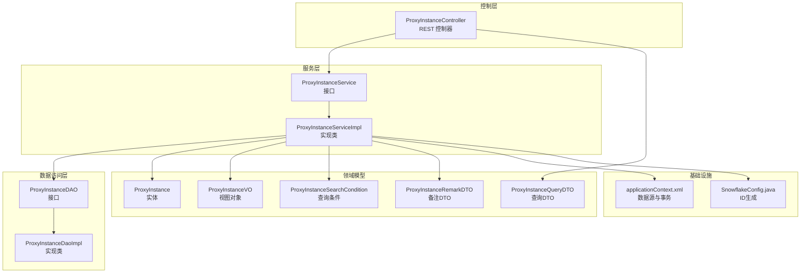
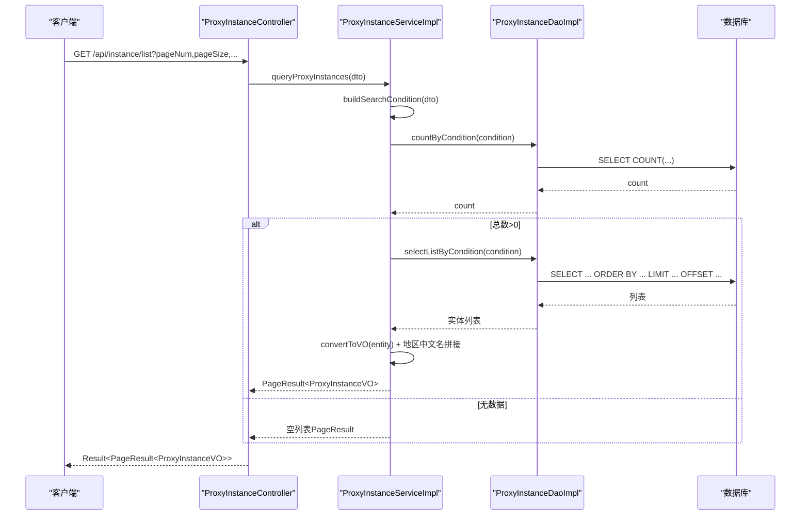
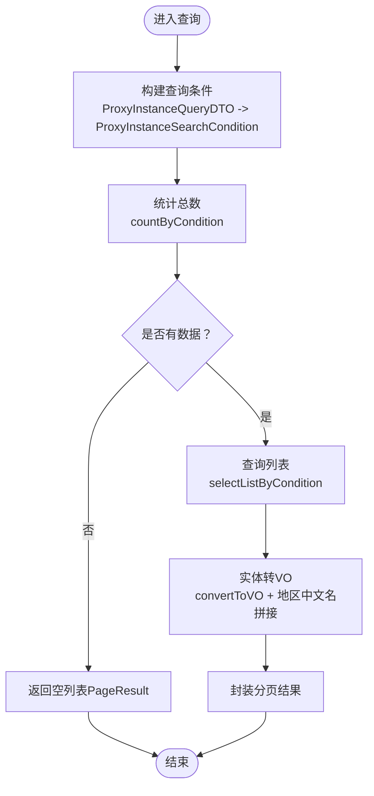
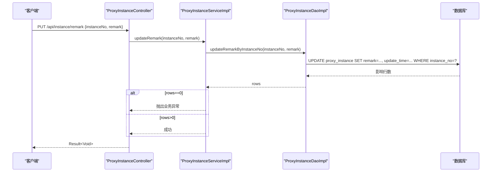
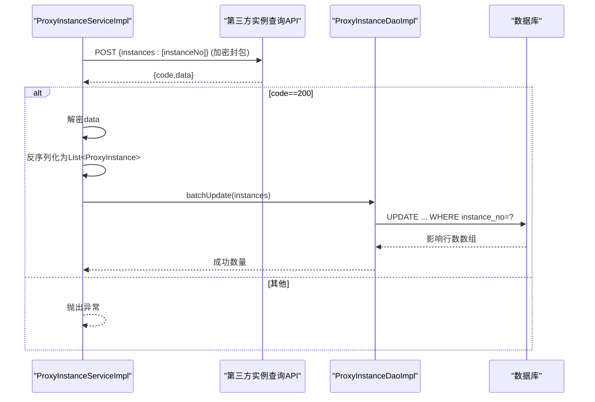
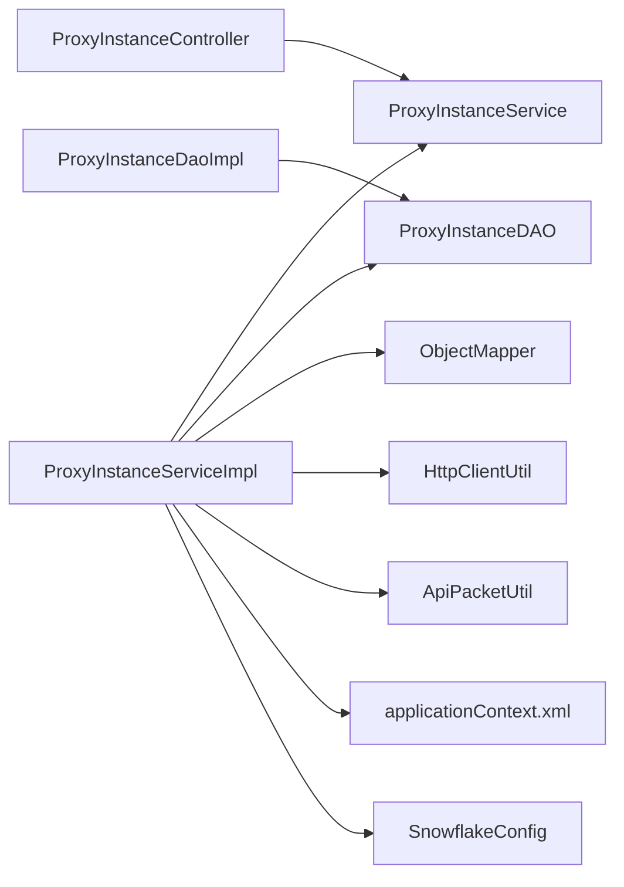

# 实例管理业务逻辑

<cite>
**本文引用的文件**
- [ProxyInstance.java](file://src/main/java/cn/linkfast/entity/ProxyInstance.java)
- [ProxyInstanceService.java](file://src/main/java/cn/linkfast/service/ProxyInstanceService.java)
- [ProxyInstanceServiceImpl.java](file://src/main/java/cn/linkfast/service/impl/ProxyInstanceServiceImpl.java)
- [ProxyInstanceController.java](file://src/main/java/cn/linkfast/controller/ProxyInstanceController.java)
- [ProxyInstanceDAO.java](file://src/main/java/cn/linkfast/dao/ProxyInstanceDAO.java)
- [ProxyInstanceDaoImpl.java](file://src/main/java/cn/linkfast/dao/impl/ProxyInstanceDaoImpl.java)
- [ProxyInstanceQueryDTO.java](file://src/main/java/cn/linkfast/dto/ProxyInstanceQueryDTO.java)
- [ProxyInstanceSearchCondition.java](file://src/main/java/cn/linkfast/dto/ProxyInstanceSearchCondition.java)
- [ProxyInstanceRemarkDTO.java](file://src/main/java/cn/linkfast/dto/ProxyInstanceRemarkDTO.java)
- [ProxyInstanceVO.java](file://src/main/java/cn/linkfast/vo/ProxyInstanceVO.java)
- [获取代理实例列表接口.md](file://docs/api/internal/获取代理实例列表接口.md)
- [更新代理实例备注接口.md](file://docs/api/internal/更新代理实例备注接口.md)
- [实例回调接口开发需求.md](file://docs/api/internal/实例回调接口开发需求.md)
- [applicationContext.xml](file://src/main/resources/applicationContext.xml)
- [SnowflakeConfig.java](file://src/main/java/cn/linkfast/config/SnowflakeConfig.java)
</cite>

## 目录
1. [简介](#简介)
2. [项目结构](#项目结构)
3. [核心组件](#核心组件)
4. [架构总览](#架构总览)
5. [详细组件分析](#详细组件分析)
6. [依赖分析](#依赖分析)
7. [性能考虑](#性能考虑)
8. [故障排查指南](#故障排查指南)
9. [结论](#结论)
10. [附录](#附录)

## 简介
本文件面向实例管理业务逻辑，围绕代理实例的生命周期管理进行系统化梳理，涵盖实例状态跟踪、实例信息查询、实例备注管理、数据模型设计、查询实现逻辑、状态转换规则、有效期与状态同步、数据一致性保障、批量处理与定时任务调度，以及扩展与定制指导。文档以代码为依据，辅以可视化图示，帮助开发者快速理解并高效扩展实例管理能力。

## 项目结构
实例管理模块采用经典的分层架构：控制层负责对外接口与参数校验；服务层承载业务规则与流程编排；数据访问层封装SQL与批量更新；实体/VO/DTO用于数据传输与查询条件建模；配置文件提供数据源与事务等基础设施支撑。

图表来源
- [ProxyInstanceController.java:17-51](file://src/main/java/cn/linkfast/controller/ProxyInstanceController.java#L17-L51)
- [ProxyInstanceService.java:10-36](file://src/main/java/cn/linkfast/service/ProxyInstanceService.java#L10-L36)
- [ProxyInstanceServiceImpl.java:35-194](file://src/main/java/cn/linkfast/service/impl/ProxyInstanceServiceImpl.java#L35-L194)
- [ProxyInstanceDAO.java:11-46](file://src/main/java/cn/linkfast/dao/ProxyInstanceDAO.java#L11-L46)
- [ProxyInstanceDaoImpl.java:24-174](file://src/main/java/cn/linkfast/dao/impl/ProxyInstanceDaoImpl.java#L24-L174)
- [ProxyInstance.java:12-56](file://src/main/java/cn/linkfast/entity/ProxyInstance.java#L12-L56)
- [ProxyInstanceVO.java:12-41](file://src/main/java/cn/linkfast/vo/ProxyInstanceVO.java#L12-L41)
- [ProxyInstanceQueryDTO.java:14-60](file://src/main/java/cn/linkfast/dto/ProxyInstanceQueryDTO.java#L14-L60)
- [ProxyInstanceSearchCondition.java:11-52](file://src/main/java/cn/linkfast/dto/ProxyInstanceSearchCondition.java#L11-L52)
- [ProxyInstanceRemarkDTO.java:9-22](file://src/main/java/cn/linkfast/dto/ProxyInstanceRemarkDTO.java#L9-L22)
- [applicationContext.xml:14-67](file://src/main/resources/applicationContext.xml#L14-L67)
- [SnowflakeConfig.java:16-48](file://src/main/java/cn/linkfast/config/SnowflakeConfig.java#L16-L48)

章节来源
- [ProxyInstanceController.java:17-51](file://src/main/java/cn/linkfast/controller/ProxyInstanceController.java#L17-L51)
- [ProxyInstanceServiceImpl.java:35-194](file://src/main/java/cn/linkfast/service/impl/ProxyInstanceServiceImpl.java#L35-L194)
- [ProxyInstanceDaoImpl.java:24-174](file://src/main/java/cn/linkfast/dao/impl/ProxyInstanceDaoImpl.java#L24-L174)
- [applicationContext.xml:14-67](file://src/main/resources/applicationContext.xml#L14-L67)

## 核心组件
- 控制器：提供“实例列表查询”和“更新实例备注”的HTTP接口，负责参数接收与结果封装。
- 服务层：实现业务规则与流程编排，包括第三方实例同步、分页查询、备注更新、地域名称拼接、环境URL选择等。
- DAO层：封装SQL构建与执行，支持批量更新、条件查询、计数、按实例编号更新备注。
- 领域模型：实体ProxyInstance承载实例完整属性；VO ProxyInstanceVO输出给前端；DTO用于输入参数与查询条件建模。
- 基础设施：Spring JDBC数据源、事务管理、ID生成器。

章节来源
- [ProxyInstanceController.java:17-51](file://src/main/java/cn/linkfast/controller/ProxyInstanceController.java#L17-L51)
- [ProxyInstanceService.java:10-36](file://src/main/java/cn/linkfast/service/ProxyInstanceService.java#L10-L36)
- [ProxyInstanceServiceImpl.java:35-194](file://src/main/java/cn/linkfast/service/impl/ProxyInstanceServiceImpl.java#L35-L194)
- [ProxyInstanceDAO.java:11-46](file://src/main/java/cn/linkfast/dao/ProxyInstanceDAO.java#L11-L46)
- [ProxyInstanceDaoImpl.java:24-174](file://src/main/java/cn/linkfast/dao/impl/ProxyInstanceDaoImpl.java#L24-L174)
- [ProxyInstance.java:12-56](file://src/main/java/cn/linkfast/entity/ProxyInstance.java#L12-L56)
- [ProxyInstanceVO.java:12-41](file://src/main/java/cn/linkfast/vo/ProxyInstanceVO.java#L12-L41)
- [ProxyInstanceQueryDTO.java:14-60](file://src/main/java/cn/linkfast/dto/ProxyInstanceQueryDTO.java#L14-L60)
- [ProxyInstanceSearchCondition.java:11-52](file://src/main/java/cn/linkfast/dto/ProxyInstanceSearchCondition.java#L11-L52)
- [ProxyInstanceRemarkDTO.java:9-22](file://src/main/java/cn/linkfast/dto/ProxyInstanceRemarkDTO.java#L9-L22)

## 架构总览
实例管理遵循“控制层-服务层-数据访问层-数据库”的分层设计，配合DTO/VO隔离接口与内部模型，通过JDBC模板执行SQL，结合Spring事务保障一致性。

图表来源
- [ProxyInstanceController.java:31-36](file://src/main/java/cn/linkfast/controller/ProxyInstanceController.java#L31-L36)
- [ProxyInstanceServiceImpl.java:90-110](file://src/main/java/cn/linkfast/service/impl/ProxyInstanceServiceImpl.java#L90-L110)
- [ProxyInstanceDaoImpl.java:90-115](file://src/main/java/cn/linkfast/dao/impl/ProxyInstanceDaoImpl.java#L90-L115)

## 详细组件分析

### 数据模型与状态枚举
- 实例实体ProxyInstance包含实例标识、订单关联、网络参数、地域信息、认证凭据、流量与有效期、状态、桥接地址、时间戳、产品与项目标识、备注及创建/更新时间等字段。
- 状态枚举参考接口文档中的状态定义：1=待创建、2=创建中、3=运行中、6=已停止、10=关闭、11=释放。
- 时间戳统一为秒级userExpired，便于前端与外部系统对接。

章节来源
- [ProxyInstance.java:12-56](file://src/main/java/cn/linkfast/entity/ProxyInstance.java#L12-L56)
- [实例回调接口开发需求.md:52-52](file://docs/api/internal/实例回调接口开发需求.md#L52-L52)

### 查询实现逻辑（多维搜索、状态过滤、分页）
- 查询入口：控制器接收ProxyInstanceQueryDTO，服务层将其转换为ProxyInstanceSearchCondition并计算offset。
- SQL拼接：DAO层按条件动态拼接proxyType IN、status、countryCode、cityCode、ip LIKE等条件。
- 分页：按create_time倒序排序，使用LIMIT与OFFSET实现分页。
- 结果映射：实体列表转换为ProxyInstanceVO，同时拼接地区中文名（国家-城市）。

图表来源
- [ProxyInstanceServiceImpl.java:112-126](file://src/main/java/cn/linkfast/service/impl/ProxyInstanceServiceImpl.java#L112-L126)
- [ProxyInstanceDaoImpl.java:90-148](file://src/main/java/cn/linkfast/dao/impl/ProxyInstanceDaoImpl.java#L90-L148)
- [ProxyInstanceServiceImpl.java:128-150](file://src/main/java/cn/linkfast/service/impl/ProxyInstanceServiceImpl.java#L128-L150)

章节来源
- [ProxyInstanceQueryDTO.java:14-60](file://src/main/java/cn/linkfast/dto/ProxyInstanceQueryDTO.java#L14-L60)
- [ProxyInstanceSearchCondition.java:11-52](file://src/main/java/cn/linkfast/dto/ProxyInstanceSearchCondition.java#L11-L52)
- [ProxyInstanceServiceImpl.java:90-110](file://src/main/java/cn/linkfast/service/impl/ProxyInstanceServiceImpl.java#L90-L110)
- [ProxyInstanceDaoImpl.java:90-148](file://src/main/java/cn/linkfast/dao/impl/ProxyInstanceDaoImpl.java#L90-L148)

### 实例备注管理
- 接口：PUT /api/instance/remark，请求体包含instanceNo与remark（可为空清空备注）。
- 服务层：调用DAO按instance_no更新remark与update_time，若影响行数为0则抛出业务异常。
- DTO校验：instanceNo必填，remark可空。

图表来源
- [ProxyInstanceController.java:44-48](file://src/main/java/cn/linkfast/controller/ProxyInstanceController.java#L44-L48)
- [ProxyInstanceServiceImpl.java:152-158](file://src/main/java/cn/linkfast/service/impl/ProxyInstanceServiceImpl.java#L152-L158)
- [ProxyInstanceDaoImpl.java:153-159](file://src/main/java/cn/linkfast/dao/impl/ProxyInstanceDaoImpl.java#L153-L159)
- [ProxyInstanceRemarkDTO.java:9-22](file://src/main/java/cn/linkfast/dto/ProxyInstanceRemarkDTO.java#L9-L22)

章节来源
- [ProxyInstanceRemarkDTO.java:9-22](file://src/main/java/cn/linkfast/dto/ProxyInstanceRemarkDTO.java#L9-L22)
- [ProxyInstanceServiceImpl.java:152-158](file://src/main/java/cn/linkfast/service/impl/ProxyInstanceServiceImpl.java#L152-L158)
- [ProxyInstanceDaoImpl.java:153-159](file://src/main/java/cn/linkfast/dao/impl/ProxyInstanceDaoImpl.java#L153-L159)

### 第三方实例同步与批量更新
- 接口：syncProxyInstance(instanceNo)，从第三方实例查询接口拉取数据。
- 流程：构造请求参数instances=[instanceNo]，拼接baseUrl与路径，加密封包后POST请求，解析响应，解密data，反序列化为ProxyInstance列表，最后批量更新数据库。
- 批量更新：按instance_no匹配更新，仅更新存在字段，避免覆盖空值；更新时刷新update_time。

图表来源
- [ProxyInstanceServiceImpl.java:71-88](file://src/main/java/cn/linkfast/service/impl/ProxyInstanceServiceImpl.java#L71-L88)
- [ProxyInstanceServiceImpl.java:163-191](file://src/main/java/cn/linkfast/service/impl/ProxyInstanceServiceImpl.java#L163-L191)
- [ProxyInstanceDaoImpl.java:32-88](file://src/main/java/cn/linkfast/dao/impl/ProxyInstanceDaoImpl.java#L32-L88)

章节来源
- [ProxyInstanceServiceImpl.java:71-88](file://src/main/java/cn/linkfast/service/impl/ProxyInstanceServiceImpl.java#L71-L88)
- [ProxyInstanceServiceImpl.java:163-191](file://src/main/java/cn/linkfast/service/impl/ProxyInstanceServiceImpl.java#L163-L191)
- [ProxyInstanceDaoImpl.java:32-88](file://src/main/java/cn/linkfast/dao/impl/ProxyInstanceDaoImpl.java#L32-L88)

### 实例状态转换与业务规则
- 状态来源：第三方回调接口返回状态字段，服务层在同步时会更新本地状态。
- 状态枚举：1=待创建、2=创建中、3=运行中、6=已停止、10=关闭、11=释放。
- 业务规则建议（基于现有实现的约束与接口文档）：
  - 激活：当第三方回调返回状态为“运行中”时，服务层在批量更新中同步该状态。
  - 暂停：当第三方回调返回状态为“已停止”时，服务层在批量更新中同步该状态。
  - 过期：userExpired为秒级时间戳，服务层在同步时更新该字段；前端可据此判断过期。
  - 释放：当第三方回调返回状态为“释放”时，服务层在批量更新中同步该状态。
- 注意：当前实现未显式在服务层做状态机校验与跨状态转换的业务断言，状态变更主要由第三方回调驱动。

章节来源
- [实例回调接口开发需求.md:52-52](file://docs/api/internal/实例回调接口开发需求.md#L52-L52)
- [ProxyInstanceServiceImpl.java:163-191](file://src/main/java/cn/linkfast/service/impl/ProxyInstanceServiceImpl.java#L163-L191)

### 有效期管理与状态同步
- 有效期：userExpired为秒级时间戳，服务层在同步时更新该字段，前端可据此展示剩余有效期。
- 状态同步：通过第三方实例查询接口返回的实例列表，服务层批量更新本地状态与属性，确保与第三方一致。
- 数据一致性：批量更新使用JDBC模板执行，单次调用内保持原子性；DAO层对空值进行安全处理（如JSON序列化失败回退空数组）。

章节来源
- [ProxyInstance.java:30-30](file://src/main/java/cn/linkfast/entity/ProxyInstance.java#L30-L30)
- [ProxyInstanceServiceImpl.java:163-191](file://src/main/java/cn/linkfast/service/impl/ProxyInstanceServiceImpl.java#L163-L191)
- [ProxyInstanceDaoImpl.java:164-172](file://src/main/java/cn/linkfast/dao/impl/ProxyInstanceDaoImpl.java#L164-L172)

### 批量处理与定时任务调度
- 批量处理：DAO层提供batchUpdate方法，按instance_no匹配更新，避免重复主键插入；对空集合进行边界保护；对JSON字段进行序列化容错。
- 定时任务：当前仓库未发现独立的定时任务类；但服务层具备按实例编号同步的能力，可作为定时任务的触发入口（例如扫描即将到期或状态异常的实例，调用syncProxyInstance）。

章节来源
- [ProxyInstanceDaoImpl.java:32-88](file://src/main/java/cn/linkfast/dao/impl/ProxyInstanceDaoImpl.java#L32-L88)
- [ProxyInstanceServiceImpl.java:71-88](file://src/main/java/cn/linkfast/service/impl/ProxyInstanceServiceImpl.java#L71-L88)

### 开发者扩展与定制指导
- 新增查询维度：在ProxyInstanceSearchCondition中添加新字段，在DAO层appendOptionalConditions中拼接SQL条件；在Service层buildSearchCondition中映射DTO字段。
- 新增状态：在接口文档与实体中补充状态枚举定义，确保第三方回调与前端展示一致；在服务层批量更新时正确映射状态字段。
- 扩展备注功能：可在DTO中新增备注相关字段，服务层增加校验与业务规则（如备注长度限制、敏感词过滤），DAO层相应调整更新语句。
- 定时任务接入：可参考SchedulingConfig与Spring Task机制，编写调度任务扫描实例并调用syncProxyInstance进行状态与属性同步。
- ID生成：可复用SnowflakeConfig提供的分布式ID生成器，确保实例编号全局唯一。

章节来源
- [ProxyInstanceSearchCondition.java:11-52](file://src/main/java/cn/linkfast/dto/ProxyInstanceSearchCondition.java#L11-L52)
- [ProxyInstanceDaoImpl.java:131-148](file://src/main/java/cn/linkfast/dao/impl/ProxyInstanceDaoImpl.java#L131-L148)
- [ProxyInstanceServiceImpl.java:112-126](file://src/main/java/cn/linkfast/service/impl/ProxyInstanceServiceImpl.java#L112-L126)
- [SnowflakeConfig.java:16-48](file://src/main/java/cn/linkfast/config/SnowflakeConfig.java#L16-L48)

## 依赖分析
- 控制器依赖服务接口；服务实现依赖DAO接口、区域DAO、工具类与配置。
- DAO实现依赖JDBC模板与ObjectMapper；DAO层与数据库交互，承担SQL构建与执行。
- 实体与VO之间通过BeanUtils复制属性，VO中包含前端所需字段与拼接后的地区中文名。
- 配置文件提供数据源、事务管理与连接池参数，保障批量更新与查询的稳定性。

图表来源
- [ProxyInstanceController.java:23-23](file://src/main/java/cn/linkfast/controller/ProxyInstanceController.java#L23-L23)
- [ProxyInstanceServiceImpl.java:40-52](file://src/main/java/cn/linkfast/service/impl/ProxyInstanceServiceImpl.java#L40-L52)
- [ProxyInstanceDaoImpl.java:29-30](file://src/main/java/cn/linkfast/dao/impl/ProxyInstanceDaoImpl.java#L29-L30)
- [applicationContext.xml:14-67](file://src/main/resources/applicationContext.xml#L14-L67)
- [SnowflakeConfig.java:44-47](file://src/main/java/cn/linkfast/config/SnowflakeConfig.java#L44-L47)

章节来源
- [ProxyInstanceController.java:23-23](file://src/main/java/cn/linkfast/controller/ProxyInstanceController.java#L23-L23)
- [ProxyInstanceServiceImpl.java:40-52](file://src/main/java/cn/linkfast/service/impl/ProxyInstanceServiceImpl.java#L40-L52)
- [ProxyInstanceDaoImpl.java:29-30](file://src/main/java/cn/linkfast/dao/impl/ProxyInstanceDaoImpl.java#L29-L30)
- [applicationContext.xml:14-67](file://src/main/resources/applicationContext.xml#L14-L67)

## 性能考虑
- 分页与排序：按create_time倒序，避免全表扫描；合理设置pageSize上限（DTO中限制最大100）。
- SQL拼接：IN子句与LIKE模糊查询需注意索引与参数绑定，建议在status、country_code、city_code、ip等高频字段建立合适索引。
- 批量更新：JDBC批处理提升吞吐；对空集合提前返回，减少无效调用。
- 连接池：配置合理的初始大小、最大活跃数、空闲回收与泄露检测，降低连接获取失败与泄露风险。
- 序列化容错：JSON转换失败回退空数组，避免同步失败中断。

章节来源
- [ProxyInstanceQueryDTO.java:39-42](file://src/main/java/cn/linkfast/dto/ProxyInstanceQueryDTO.java#L39-L42)
- [ProxyInstanceDaoImpl.java:120-148](file://src/main/java/cn/linkfast/dao/impl/ProxyInstanceDaoImpl.java#L120-L148)
- [applicationContext.xml:24-52](file://src/main/resources/applicationContext.xml#L24-L52)
- [ProxyInstanceDaoImpl.java:164-172](file://src/main/java/cn/linkfast/dao/impl/ProxyInstanceDaoImpl.java#L164-L172)

## 故障排查指南
- 参数校验失败：检查pageNum/pageSize范围、instanceNo是否为空、proxyType是否符合要求。
- 实例不存在：更新备注时若影响行数为0，抛出业务异常；确认instanceNo是否正确或实例是否已释放。
- 第三方接口异常：同步时若响应code非200，抛出运行时异常；检查环境配置（sandbox/prod）、加密封包与解密流程。
- 批量更新异常：JDBC批处理异常时记录日志并抛出；检查SQL字段顺序与目标表结构一致性。
- 连接池问题：关注连接泄露与空闲回收配置，必要时开启abandoned日志定位问题。

章节来源
- [ProxyInstanceQueryDTO.java:32-42](file://src/main/java/cn/linkfast/dto/ProxyInstanceQueryDTO.java#L32-L42)
- [ProxyInstanceRemarkDTO.java:15-16](file://src/main/java/cn/linkfast/dto/ProxyInstanceRemarkDTO.java#L15-L16)
- [ProxyInstanceServiceImpl.java:154-157](file://src/main/java/cn/linkfast/service/impl/ProxyInstanceServiceImpl.java#L154-L157)
- [ProxyInstanceServiceImpl.java:188-190](file://src/main/java/cn/linkfast/service/impl/ProxyInstanceServiceImpl.java#L188-L190)
- [ProxyInstanceDaoImpl.java:73-78](file://src/main/java/cn/linkfast/dao/impl/ProxyInstanceDaoImpl.java#L73-L78)
- [applicationContext.xml:44-52](file://src/main/resources/applicationContext.xml#L44-L52)

## 结论
实例管理模块以清晰的分层设计实现了从第三方同步、本地查询、备注维护到批量更新的完整闭环。通过DTO/VO隔离与DAO层SQL拼接，系统具备良好的扩展性与可维护性。建议后续在服务层补充状态机校验与定时任务调度，进一步强化业务规则与自动化运维能力。

## 附录
- 接口文档参考：
  - [获取代理实例列表接口.md:1-135](file://docs/api/internal/获取代理实例列表接口.md#L1-L135)
  - [更新代理实例备注接口.md:1-80](file://docs/api/internal/更新代理实例备注接口.md#L1-L80)
  - [实例回调接口开发需求.md:34-60](file://docs/api/internal/实例回调接口开发需求.md#L34-L60)