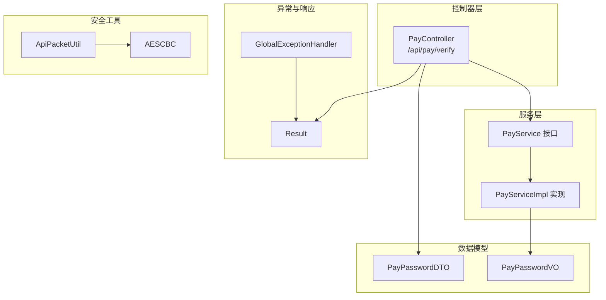
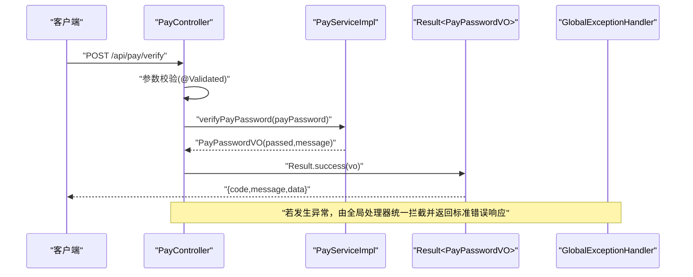
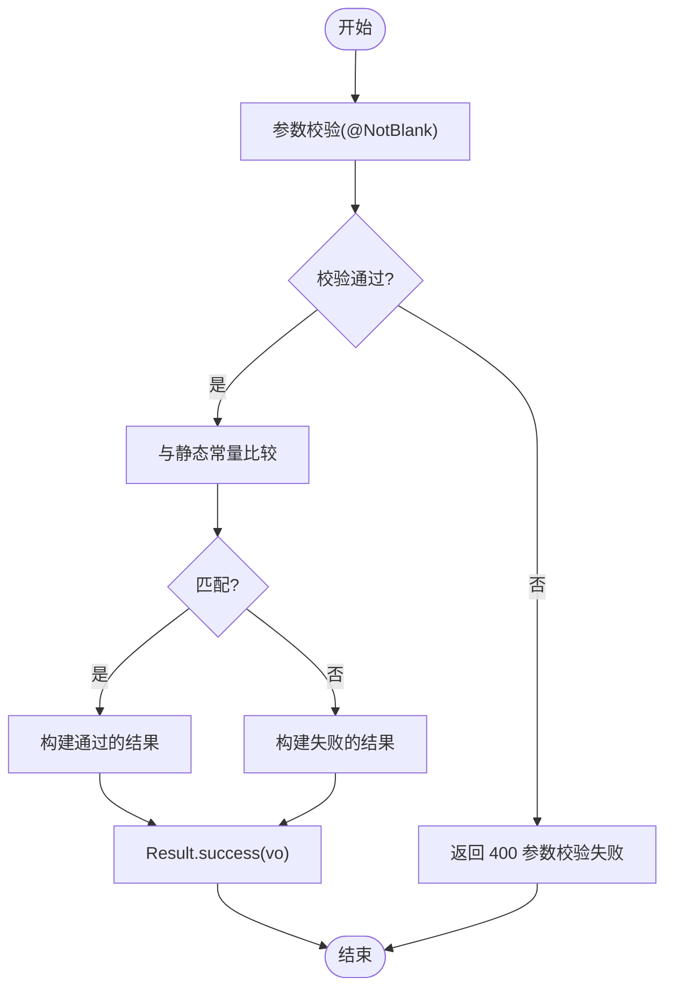
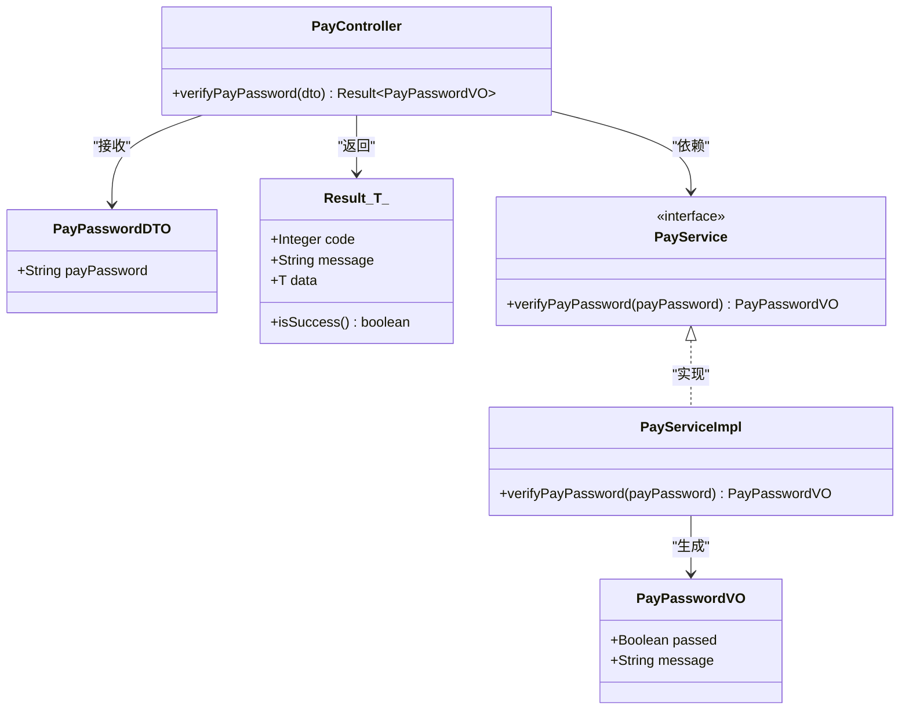
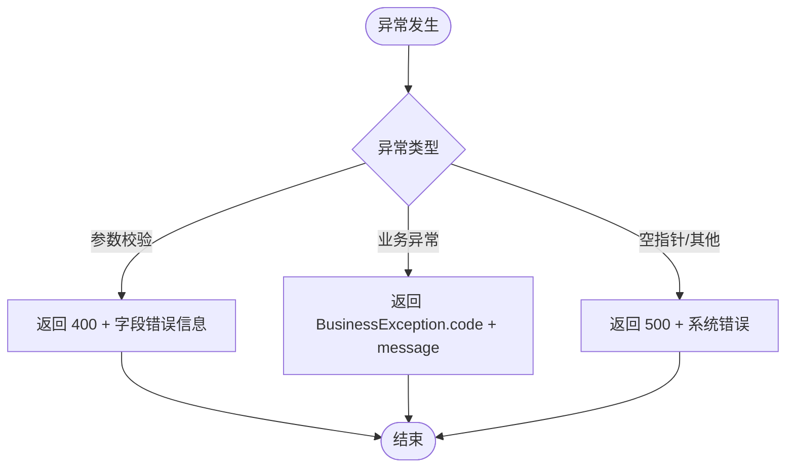
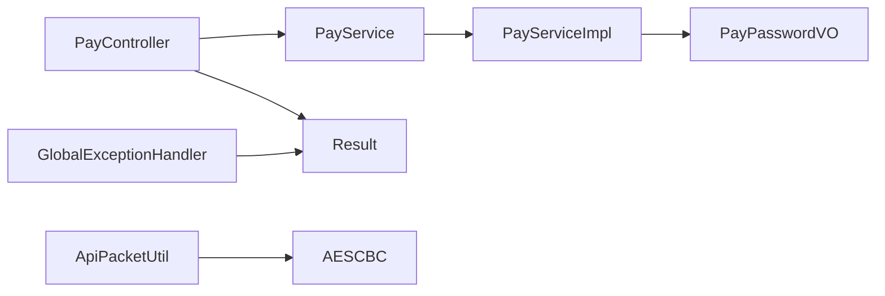

# 支付业务逻辑

<cite>
**本文引用的文件**
- [PayController.java](file://src/main/java/cn/linkfast/controller/PayController.java)
- [PayService.java](file://src/main/java/cn/linkfast/service/PayService.java)
- [PayServiceImpl.java](file://src/main/java/cn/linkfast/service/impl/PayServiceImpl.java)
- [PayPasswordDTO.java](file://src/main/java/cn/linkfast/dto/PayPasswordDTO.java)
- [PayPasswordVO.java](file://src/main/java/cn/linkfast/vo/PayPasswordVO.java)
- [Result.java](file://src/main/java/cn/linkfast/common/Result.java)
- [GlobalExceptionHandler.java](file://src/main/java/cn/linkfast/exception/GlobalExceptionHandler.java)
- [BusinessException.java](file://src/main/java/cn/linkfast/exception/BusinessException.java)
- [AESCBC.java](file://src/main/java/cn/linkfast/utils/AESCBC.java)
- [ApiPacketUtil.java](file://src/main/java/cn/linkfast/utils/ApiPacketUtil.java)
- [验证支付密码接口.md](file://docs/api/internal/验证支付密码接口.md)
- [PayControllerTest.java](file://src/test/java/cn/linkfast/controller/PayControllerTest.java)
- [test-api.http](file://test-api.http)
</cite>

## 目录
1. [简介](#简介)
2. [项目结构](#项目结构)
3. [核心组件](#核心组件)
4. [架构总览](#架构总览)
5. [详细组件分析](#详细组件分析)
6. [依赖分析](#依赖分析)
7. [性能考虑](#性能考虑)
8. [故障排查指南](#故障排查指南)
9. [结论](#结论)
10. [附录](#附录)

## 简介
本文件面向支付业务逻辑，聚焦“支付密码验证”能力，系统性阐述其数据模型、验证流程、安全策略、异常处理、扩展点与性能优化建议。当前实现采用明文静态常量进行密码比对，接口层负责参数校验与统一响应包装；同时提供通用的API数据包加解密工具与全局异常处理机制，便于在后续版本中接入更严格的密码存储与传输加密。

## 项目结构
围绕支付密码验证的关键模块分布如下：
- 控制器层：对外暴露 /api/pay/verify 接口，接收并校验请求体
- 服务层：抽象出支付密码校验接口，具体实现负责比较逻辑
- DTO/VO 层：定义请求参数与响应结果的数据结构
- 异常与统一响应：全局异常处理器与通用响应封装
- 安全工具：AES-CBC 加解密工具与 API 数据包加解密工具类
- 文档与测试：接口文档与控制器单元测试

图表来源
- [PayController.java:1-37](file://src/main/java/cn/linkfast/controller/PayController.java#L1-L37)
- [PayService.java:1-19](file://src/main/java/cn/linkfast/service/PayService.java#L1-L19)
- [PayServiceImpl.java:1-32](file://src/main/java/cn/linkfast/service/impl/PayServiceImpl.java#L1-L32)
- [PayPasswordDTO.java:1-24](file://src/main/java/cn/linkfast/dto/PayPasswordDTO.java#L1-L24)
- [PayPasswordVO.java:1-27](file://src/main/java/cn/linkfast/vo/PayPasswordVO.java#L1-L27)
- [GlobalExceptionHandler.java:1-90](file://src/main/java/cn/linkfast/exception/GlobalExceptionHandler.java#L1-L90)
- [Result.java:1-59](file://src/main/java/cn/linkfast/common/Result.java#L1-L59)
- [AESCBC.java:1-36](file://src/main/java/cn/linkfast/utils/AESCBC.java#L1-L36)
- [ApiPacketUtil.java:1-103](file://src/main/java/cn/linkfast/utils/ApiPacketUtil.java#L1-L103)

章节来源
- [PayController.java:1-37](file://src/main/java/cn/linkfast/controller/PayController.java#L1-L37)
- [验证支付密码接口.md:1-85](file://docs/api/internal/验证支付密码接口.md#L1-L85)

## 核心组件
- 控制器 PayController：负责接收请求体 PayPasswordDTO，调用服务层进行校验，并以 Result<PayPasswordVO> 统一返回
- 服务接口 PayService 与实现 PayServiceImpl：提供 verifyPayPassword 方法，当前使用静态常量进行比对
- 数据模型 PayPasswordDTO（请求）与 PayPasswordVO（响应）：分别承载输入参数与输出结果
- 统一响应 Result<T>：封装 code、message、data，isSuccess 判定成功与否
- 全局异常处理器 GlobalExceptionHandler：集中处理业务异常、参数异常、未捕获异常等
- 安全工具 AESCBC 与 ApiPacketUtil：提供 AES-CBC 加解密与 API 数据包加密封装/解封

章节来源
- [PayController.java:24-34](file://src/main/java/cn/linkfast/controller/PayController.java#L24-L34)
- [PayService.java:10-16](file://src/main/java/cn/linkfast/service/PayService.java#L10-L16)
- [PayServiceImpl.java:18-29](file://src/main/java/cn/linkfast/service/impl/PayServiceImpl.java#L18-L29)
- [PayPasswordDTO.java:17-21](file://src/main/java/cn/linkfast/dto/PayPasswordDTO.java#L17-L21)
- [PayPasswordVO.java:16-24](file://src/main/java/cn/linkfast/vo/PayPasswordVO.java#L16-L24)
- [Result.java:18-49](file://src/main/java/cn/linkfast/common/Result.java#L18-L49)
- [GlobalExceptionHandler.java:28-88](file://src/main/java/cn/linkfast/exception/GlobalExceptionHandler.java#L28-L88)
- [AESCBC.java:20-30](file://src/main/java/cn/linkfast/utils/AESCBC.java#L20-L30)
- [ApiPacketUtil.java:56-102](file://src/main/java/cn/linkfast/utils/ApiPacketUtil.java#L56-L102)

## 架构总览
下图展示支付密码验证端到端流程：客户端发起请求 → 控制器接收并参数校验 → 服务层执行校验 → 统一响应封装 → 全局异常处理兜底。

图表来源
- [PayController.java:30-34](file://src/main/java/cn/linkfast/controller/PayController.java#L30-L34)
- [PayServiceImpl.java:19-29](file://src/main/java/cn/linkfast/service/impl/PayServiceImpl.java#L19-L29)
- [Result.java:28-35](file://src/main/java/cn/linkfast/common/Result.java#L28-L35)
- [GlobalExceptionHandler.java:28-63](file://src/main/java/cn/linkfast/exception/GlobalExceptionHandler.java#L28-L63)

## 详细组件分析

### 支付密码验证流程
- 输入：PayPasswordDTO.payPassword（非空校验）
- 处理：PayServiceImpl 比较输入与静态常量，生成 PayPasswordVO
- 输出：Result.success(PayPasswordVO)，其中 data.passed 表示是否通过，data.message 为提示信息
- 异常：参数校验失败返回 400，其他异常返回 500

图表来源
- [PayPasswordDTO.java:20](file://src/main/java/cn/linkfast/dto/PayPasswordDTO.java#L20)
- [PayServiceImpl.java:19-29](file://src/main/java/cn/linkfast/service/impl/PayServiceImpl.java#L19-L29)
- [Result.java:28-35](file://src/main/java/cn/linkfast/common/Result.java#L28-L35)

章节来源
- [PayController.java:30-34](file://src/main/java/cn/linkfast/controller/PayController.java#L30-L34)
- [PayServiceImpl.java:18-29](file://src/main/java/cn/linkfast/service/impl/PayServiceImpl.java#L18-L29)
- [验证支付密码接口.md:14-83](file://docs/api/internal/验证支付密码接口.md#L14-L83)

### 数据模型设计
- PayPasswordDTO：请求体载体，包含必填字段 payPassword
- PayPasswordVO：响应体载体，包含 passed 与 message
- Result<T>：统一响应包装，包含 code、message、data，并提供 isSuccess 判定

图表来源
- [PayPasswordDTO.java:13-21](file://src/main/java/cn/linkfast/dto/PayPasswordDTO.java#L13-L21)
- [PayPasswordVO.java:12-24](file://src/main/java/cn/linkfast/vo/PayPasswordVO.java#L12-L24)
- [Result.java:12-49](file://src/main/java/cn/linkfast/common/Result.java#L12-L49)
- [PayController.java:30-34](file://src/main/java/cn/linkfast/controller/PayController.java#L30-L34)
- [PayService.java:8-16](file://src/main/java/cn/linkfast/service/PayService.java#L8-L16)
- [PayServiceImpl.java:11-29](file://src/main/java/cn/linkfast/service/impl/PayServiceImpl.java#L11-L29)

章节来源
- [PayPasswordDTO.java:17-21](file://src/main/java/cn/linkfast/dto/PayPasswordDTO.java#L17-L21)
- [PayPasswordVO.java:16-24](file://src/main/java/cn/linkfast/vo/PayPasswordVO.java#L16-L24)
- [Result.java:18-49](file://src/main/java/cn/linkfast/common/Result.java#L18-L49)

### 异常处理机制
- 参数校验异常：MethodArgumentNotValidException/BindException → 统一返回 400，message 包含字段级错误
- 业务异常 BusinessException：按异常内 code 返回对应错误码
- 运行时异常：NullPointerException 等 → 统一返回 500
- 未捕获异常：统一返回 500，message 为“系统繁忙，请稍后再试”

图表来源
- [GlobalExceptionHandler.java:69-88](file://src/main/java/cn/linkfast/exception/GlobalExceptionHandler.java#L69-L88)
- [GlobalExceptionHandler.java:28-63](file://src/main/java/cn/linkfast/exception/GlobalExceptionHandler.java#L28-L63)
- [BusinessException.java:6-36](file://src/main/java/cn/linkfast/exception/BusinessException.java#L6-L36)

章节来源
- [GlobalExceptionHandler.java:28-88](file://src/main/java/cn/linkfast/exception/GlobalExceptionHandler.java#L28-L88)
- [BusinessException.java:9-27](file://src/main/java/cn/linkfast/exception/BusinessException.java#L9-L27)

### 安全策略与传输加密
- 当前实现：支付密码验证未启用传输加密，仅做本地明文比对
- 可选增强方案：
  - 传输加密：使用 ApiPacketUtil 对请求体进行 AES-CBC 加密与 Base64 编码，响应侧同样解密
  - 存储加密：将静态常量替换为从数据库或配置中心加载的密文与盐值，服务层采用恒定时长比较避免计时侧信道
  - 防重放：引入随机数/时间戳与签名机制，结合幂等键限制重复提交
  - 会话与令牌：在网关或服务层引入短期令牌与访问控制，限制高频调用

章节来源
- [ApiPacketUtil.java:56-102](file://src/main/java/cn/linkfast/utils/ApiPacketUtil.java#L56-L102)
- [AESCBC.java:20-30](file://src/main/java/cn/linkfast/utils/AESCBC.java#L20-L30)

### 扩展点说明
- 支持多种支付方式：通过 PayService 抽象扩展不同校验策略（如指纹、短信验证码、生物识别），并在控制器层按路由或参数选择
- 自定义验证规则：在 DTO 层增加更严格的校验注解（长度、正则），在服务层实现差异化逻辑
- 多租户与动态配置：将“正确密码”从静态常量迁移至配置中心或数据库，按用户/租户维度下发

章节来源
- [PayService.java:8-16](file://src/main/java/cn/linkfast/service/PayService.java#L8-L16)
- [PayPasswordDTO.java:20](file://src/main/java/cn/linkfast/dto/PayPasswordDTO.java#L20)

### 并发与性能优化
- 并发安全：当前字符串比较为 O(1) 操作，天然线程安全；建议在高并发场景下避免频繁创建 VO 对象，可复用或缓存轻量结构
- 响应优化：Result<T> 已统一返回结构，减少分支判断开销；可在网关层开启压缩与连接复用
- 限流与熔断：在网关或控制器层增加限流策略，防止恶意刷接口；对下游依赖（如配置中心）设置熔断与降级

章节来源
- [Result.java:12-49](file://src/main/java/cn/linkfast/common/Result.java#L12-L49)

## 依赖分析
- 控制器依赖服务接口，服务实现依赖 VO；控制器与服务均依赖统一响应 Result
- 全局异常处理器独立于业务层，向上游返回标准错误
- 安全工具 AESCBC 与 ApiPacketUtil 作为通用组件被 ApiPacketUtil 使用

图表来源
- [PayController.java:22](file://src/main/java/cn/linkfast/controller/PayController.java#L22)
- [PayService.java:8](file://src/main/java/cn/linkfast/service/PayService.java#L8)
- [PayServiceImpl.java:11](file://src/main/java/cn/linkfast/service/impl/PayServiceImpl.java#L11)
- [PayPasswordVO.java:12](file://src/main/java/cn/linkfast/vo/PayPasswordVO.java#L12)
- [Result.java:12](file://src/main/java/cn/linkfast/common/Result.java#L12)
- [GlobalExceptionHandler.java:20](file://src/main/java/cn/linkfast/exception/GlobalExceptionHandler.java#L20)
- [ApiPacketUtil.java:73-77](file://src/main/java/cn/linkfast/utils/ApiPacketUtil.java#L73-L77)
- [AESCBC.java:21](file://src/main/java/cn/linkfast/utils/AESCBC.java#L21)

章节来源
- [PayController.java:22](file://src/main/java/cn/linkfast/controller/PayController.java#L22)
- [PayServiceImpl.java:11](file://src/main/java/cn/linkfast/service/impl/PayServiceImpl.java#L11)
- [ApiPacketUtil.java:73-77](file://src/main/java/cn/linkfast/utils/ApiPacketUtil.java#L73-L77)

## 性能考虑
- 字符串比较：当前为常量时间比较，复杂度 O(n)，在高并发下建议避免不必要的对象创建
- 序列化与反序列化：统一使用 Result<T>，减少分支判断；如需进一步优化，可在网关层启用 GZIP 压缩
- 缓存与限流：对热点接口增加限流与缓存策略，降低后端压力

## 故障排查指南
- 参数校验失败：检查请求体是否包含 payPassword 且非空；参考接口文档中的错误示例
- 业务异常：确认 BusinessException 的 code/message 是否符合预期
- 服务器异常：查看全局异常处理器日志，定位未捕获异常来源
- 单元测试：可通过 PayControllerTest 验证正确与错误密码的返回值

章节来源
- [验证支付密码接口.md:65-83](file://docs/api/internal/验证支付密码接口.md#L65-L83)
- [GlobalExceptionHandler.java:28-63](file://src/main/java/cn/linkfast/exception/GlobalExceptionHandler.java#L28-L63)
- [PayControllerTest.java:52-86](file://src/test/java/cn/linkfast/controller/PayControllerTest.java#L52-L86)

## 结论
当前支付密码验证模块结构清晰、职责单一，具备良好的可扩展性。建议在后续版本中引入传输加密、动态配置与更强的防重放与限流策略，以满足生产环境的安全与稳定性要求。

## 附录
- 接口文档：参见 [验证支付密码接口.md](file://docs/api/internal/验证支付密码接口.md)
- 示例请求：参见 [test-api.http](file://test-api.http)