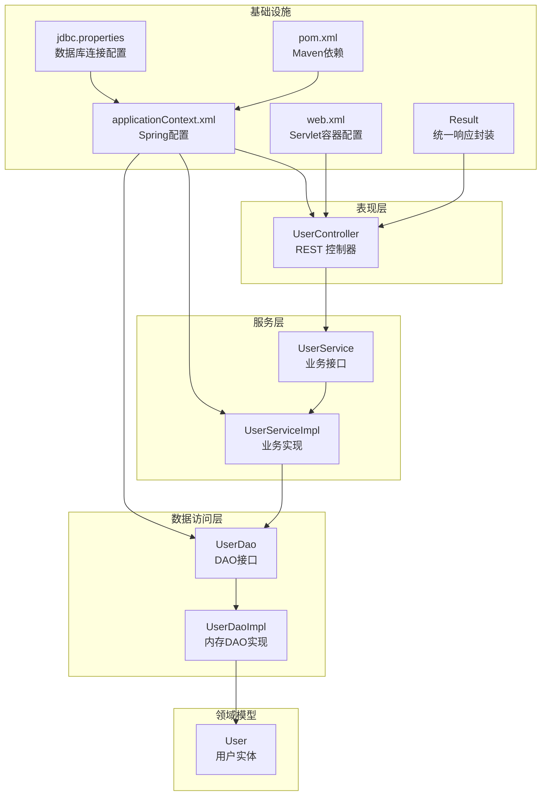
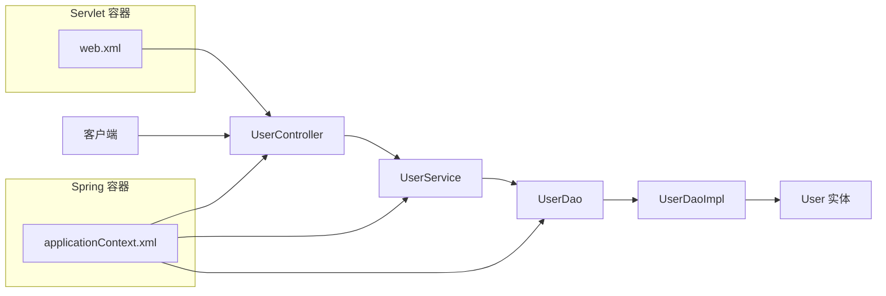
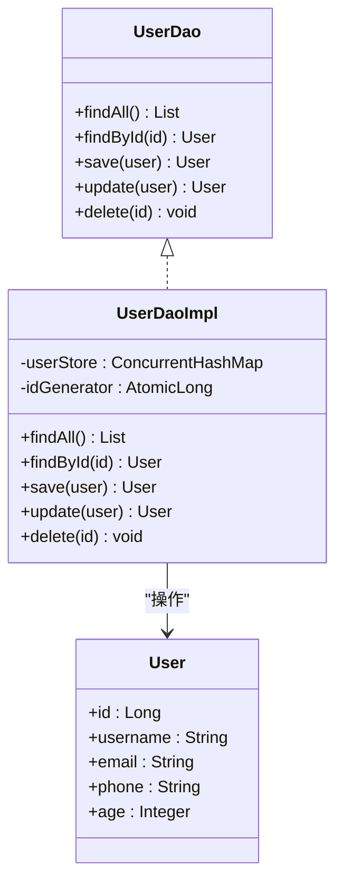
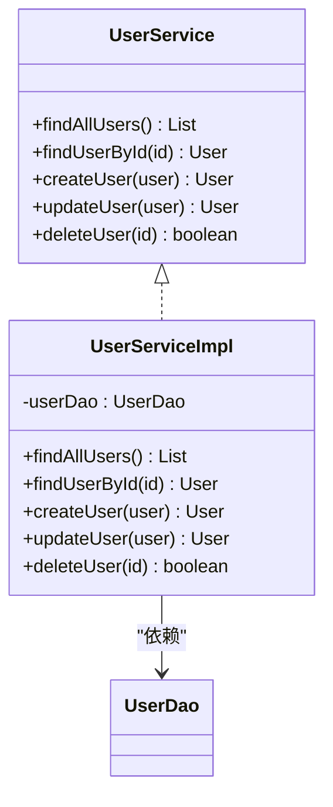
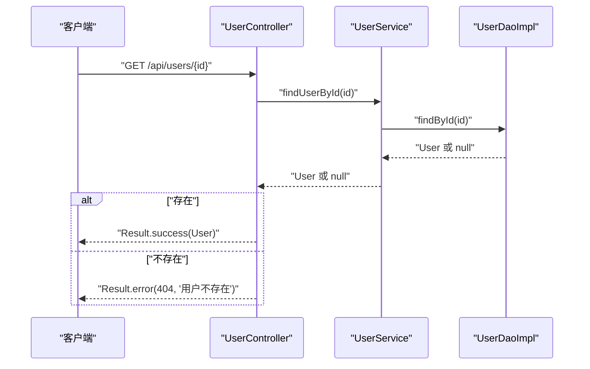
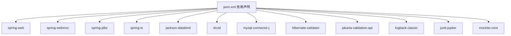

# 用户业务逻辑

<cite>
**本文引用的文件**
- [UserController.java](file://src/main/java/cn/linkfast/controller/UserController.java)
- [UserService.java](file://src/main/java/cn/linkfast/service/UserService.java)
- [UserServiceImpl.java](file://src/main/java/cn/linkfast/service/impl/UserServiceImpl.java)
- [UserDao.java](file://src/main/java/cn/linkfast/dao/UserDao.java)
- [UserDaoImpl.java](file://src/main/java/cn/linkfast/dao/impl/UserDaoImpl.java)
- [User.java](file://src/main/java/cn/linkfast/entity/User.java)
- [Result.java](file://src/main/java/cn/linkfast/common/Result.java)
- [applicationContext.xml](file://src/main/resources/applicationContext.xml)
- [web.xml](file://src/main/webapp/WEB-INF/web.xml)
- [pom.xml](file://pom.xml)
- [jdbc.properties](file://src/main/resources/jdbc.properties)
- [UserServiceTest.java](file://src/test/java/cn/linkfast/service/UserServiceTest.java)
</cite>

## 目录
1. [引言](#引言)
2. [项目结构](#项目结构)
3. [核心组件](#核心组件)
4. [架构总览](#架构总览)
5. [详细组件分析](#详细组件分析)
6. [依赖分析](#依赖分析)
7. [性能考虑](#性能考虑)
8. [故障排除指南](#故障排除指南)
9. [结论](#结论)
10. [附录](#附录)

## 引言
本文件面向开发者与运维人员，系统化梳理用户业务逻辑在该代码库中的实现与扩展点，覆盖以下主题：
- 用户信息查询、状态管理与权限控制现状与建议
- 用户数据模型设计、角色权限与安全策略
- 用户业务的验证机制（认证、权限检查、数据校验）
- 用户信息的缓存策略与同步机制
- 多租户与自定义用户属性的扩展方向
- 用户数据的安全保护与隐私处理
- 功能扩展与安全配置指导

当前仓库实现了基础的用户增删改查能力，并通过 Spring MVC 提供 REST 接口；但未内置认证、授权与角色权限体系。后续可在现有基础上按“安全增强 + 扩展点”两条主线演进。

## 项目结构
用户模块采用经典的分层架构：Controller → Service → DAO → Entity，配合 Spring XML 配置与 Maven 依赖管理，形成可测试、可部署的最小闭环。

**图表来源**
- [UserController.java:16-85](file://src/main/java/cn/linkfast/controller/UserController.java#L16-L85)
- [UserService.java:9-35](file://src/main/java/cn/linkfast/service/UserService.java#L9-L35)
- [UserServiceImpl.java:15-55](file://src/main/java/cn/linkfast/service/impl/UserServiceImpl.java#L15-L55)
- [UserDao.java:9-35](file://src/main/java/cn/linkfast/dao/UserDao.java#L9-L35)
- [UserDaoImpl.java:16-55](file://src/main/java/cn/linkfast/dao/impl/UserDaoImpl.java#L16-L55)
- [User.java:6-74](file://src/main/java/cn/linkfast/entity/User.java#L6-L74)
- [applicationContext.xml:14-67](file://src/main/resources/applicationContext.xml#L14-L67)
- [web.xml:23-40](file://src/main/webapp/WEB-INF/web.xml#L23-L40)
- [jdbc.properties:1-34](file://src/main/resources/jdbc.properties#L1-L34)
- [pom.xml:22-131](file://pom.xml#L22-L131)
- [Result.java:10-59](file://src/main/java/cn/linkfast/common/Result.java#L10-L59)

**章节来源**
- [UserController.java:16-85](file://src/main/java/cn/linkfast/controller/UserController.java#L16-L85)
- [UserServiceImpl.java:15-55](file://src/main/java/cn/linkfast/service/impl/UserServiceImpl.java#L15-L55)
- [UserDaoImpl.java:16-55](file://src/main/java/cn/linkfast/dao/impl/UserDaoImpl.java#L16-L55)
- [applicationContext.xml:14-67](file://src/main/resources/applicationContext.xml#L14-L67)
- [web.xml:23-40](file://src/main/webapp/WEB-INF/web.xml#L23-L40)
- [pom.xml:22-131](file://pom.xml#L22-L131)

## 核心组件
- 用户实体 User：承载用户标识与基本信息（用户名、邮箱、电话、年龄等），提供标准的 getter/setter 与 toString。
- DAO 层：UserDao 定义 CRUD 接口；UserDaoImpl 基于内存 ConcurrentHashMap 模拟持久化，适合演示与测试。
- 服务层：UserService 抽象用户业务；UserServiceImpl 实现查询、创建、更新、删除，并声明事务。
- 控制器：UserController 提供 /api/users 的 REST 接口，统一使用 Result 封装响应。
- 基础设施：Spring XML 配置数据源、JdbcTemplate、事务管理器；web.xml 配置 DispatcherServlet、字符集过滤与 Session Cookie 安全参数；Maven 引入 Spring、Jackson、Druid、MySQL 驱动等。

**章节来源**
- [User.java:6-74](file://src/main/java/cn/linkfast/entity/User.java#L6-L74)
- [UserDao.java:9-35](file://src/main/java/cn/linkfast/dao/UserDao.java#L9-L35)
- [UserDaoImpl.java:16-55](file://src/main/java/cn/linkfast/dao/impl/UserDaoImpl.java#L16-L55)
- [UserService.java:9-35](file://src/main/java/cn/linkfast/service/UserService.java#L9-L35)
- [UserServiceImpl.java:15-55](file://src/main/java/cn/linkfast/service/impl/UserServiceImpl.java#L15-L55)
- [UserController.java:16-85](file://src/main/java/cn/linkfast/controller/UserController.java#L16-L85)
- [Result.java:10-59](file://src/main/java/cn/linkfast/common/Result.java#L10-L59)
- [applicationContext.xml:14-67](file://src/main/resources/applicationContext.xml#L14-L67)
- [web.xml:23-66](file://src/main/webapp/WEB-INF/web.xml#L23-L66)
- [pom.xml:22-131](file://pom.xml#L22-L131)

## 架构总览
用户模块遵循分层与依赖倒置原则：Controller 仅依赖 Service 接口；Service 仅依赖 DAO 接口；DAO 实现可替换（当前为内存实现）。Spring XML 负责装配与事务管理；web.xml 负责 Servlet 初始化与编码过滤。

**图表来源**
- [UserController.java:16-85](file://src/main/java/cn/linkfast/controller/UserController.java#L16-L85)
- [UserServiceImpl.java:15-55](file://src/main/java/cn/linkfast/service/impl/UserServiceImpl.java#L15-L55)
- [UserDaoImpl.java:16-55](file://src/main/java/cn/linkfast/dao/impl/UserDaoImpl.java#L16-L55)
- [applicationContext.xml:14-67](file://src/main/resources/applicationContext.xml#L14-L67)
- [web.xml:23-40](file://src/main/webapp/WEB-INF/web.xml#L23-L40)

## 详细组件分析

### 用户实体与数据模型
- 字段设计：包含主键 id、用户名、邮箱、手机号、年龄等基础属性，满足常见用户画像场景。
- 设计建议：若引入认证与权限，建议补充登录凭据字段（如加密后的密码哈希）、状态字段（启用/禁用/锁定）、创建/更新时间戳、租户标识等。
- 复杂度：实体为简单 POJO，无复杂算法或数据结构，时间/空间复杂度不适用。

**章节来源**
- [User.java:6-74](file://src/main/java/cn/linkfast/entity/User.java#L6-L74)

### DAO 层：内存实现与持久化抽象
- 内存存储：UserDaoImpl 使用并发安全的内存映射表模拟数据库，提供基本的 CRUD 能力，适合本地开发与单元测试。
- 可替换性：通过 UserDao 接口隔离实现细节，便于后续接入真实数据库（MySQL/Redis 等）。
- 并发与一致性：内存实现具备基本的并发写入能力，但不具备持久化与强一致事务语义；生产环境必须替换为可靠存储。

**图表来源**
- [UserDao.java:9-35](file://src/main/java/cn/linkfast/dao/UserDao.java#L9-L35)
- [UserDaoImpl.java:16-55](file://src/main/java/cn/linkfast/dao/impl/UserDaoImpl.java#L16-L55)
- [User.java:6-74](file://src/main/java/cn/linkfast/entity/User.java#L6-L74)

**章节来源**
- [UserDao.java:9-35](file://src/main/java/cn/linkfast/dao/UserDao.java#L9-L35)
- [UserDaoImpl.java:16-55](file://src/main/java/cn/linkfast/dao/impl/UserDaoImpl.java#L16-L55)

### 服务层：业务编排与事务控制
- 职责：封装用户业务规则，协调 DAO 层完成查询、创建、更新、删除。
- 事务：基于注解的声明式事务，保证业务原子性。
- 错误处理：当更新/删除的目标不存在时返回空或布尔值，由上层控制器进行响应封装。

**图表来源**
- [UserService.java:9-35](file://src/main/java/cn/linkfast/service/UserService.java#L9-L35)
- [UserServiceImpl.java:15-55](file://src/main/java/cn/linkfast/service/impl/UserServiceImpl.java#L15-L55)

**章节来源**
- [UserService.java:9-35](file://src/main/java/cn/linkfast/service/UserService.java#L9-L35)
- [UserServiceImpl.java:15-55](file://src/main/java/cn/linkfast/service/impl/UserServiceImpl.java#L15-L55)

### 控制器层：REST 接口与统一响应
- 接口：提供 GET /api/users、GET /api/users/{id}、POST /api/users、PUT /api/users/{id}、DELETE /api/users/{id}。
- 统一响应：Result 类型封装 code/message/data，控制器负责将业务结果转换为统一格式。
- 错误处理：当资源不存在时返回 404 错误信息。

**图表来源**
- [UserController.java:36-45](file://src/main/java/cn/linkfast/controller/UserController.java#L36-L45)
- [UserServiceImpl.java:27-30](file://src/main/java/cn/linkfast/service/impl/UserServiceImpl.java#L27-L30)
- [UserDaoImpl.java:28-31](file://src/main/java/cn/linkfast/dao/impl/UserDaoImpl.java#L28-L31)
- [Result.java:10-59](file://src/main/java/cn/linkfast/common/Result.java#L10-L59)

**章节来源**
- [UserController.java:16-85](file://src/main/java/cn/linkfast/controller/UserController.java#L16-L85)
- [Result.java:10-59](file://src/main/java/cn/linkfast/common/Result.java#L10-L59)

### 验证机制与安全现状
- 数据校验：当前未见显式的参数校验注解（如 @Valid/@NotBlank 等）；建议在 DTO/Controller 入参处增加校验以提升健壮性。
- 认证与授权：未发现登录、令牌颁发、权限拦截等机制；当前接口未做身份校验与角色限制。
- 密码与敏感信息：未见密码字段与加密策略；建议引入安全存储与传输（如 HTTPS、密钥管理、密码哈希）。
- 会话与 Cookie：web.xml 中设置了 Session 超时与 HttpOnly Cookie，建议进一步启用 HTTPS 与 Secure Cookie。

**章节来源**
- [UserController.java:16-85](file://src/main/java/cn/linkfast/controller/UserController.java#L16-L85)
- [web.xml:60-66](file://src/main/webapp/WEB-INF/web.xml#L60-L66)

### 缓存策略与同步机制
- 当前实现：DAO 层为内存实现，未引入外部缓存（如 Redis）。
- 建议方案：
  - 读路径：查询优先命中缓存，未命中再回源 DAO；热点用户信息可设置 TTL。
  - 写路径：更新/删除后主动失效相关缓存键，确保一致性。
  - 同步：结合 MQ 或事件总线，异步同步用户变更到缓存与下游系统。

（本节为概念性建议，不涉及具体代码文件）

### 扩展点说明：多租户与自定义属性
- 多租户：
  - 在 User 实体中新增 tenant_id 字段，并在 DAO/Service 层默认按租户过滤。
  - 在控制器层支持租户维度的鉴权与隔离。
- 自定义属性：
  - 引入用户扩展属性表或 JSON 字段，支持动态扩展。
  - 在 Service 层提供合并/拆分逻辑，保持与核心字段的解耦。

（本节为概念性建议，不涉及具体代码文件）

## 依赖分析
- Spring 生态：spring-web、spring-webmvc、spring-jdbc、spring-tx、spring-test。
- JSON 处理：Jackson 核心与注解库。
- HTTP 客户端：Apache HttpClient5。
- 数据库连接池：Druid。
- MySQL 驱动：mysql-connector-j。
- 校验框架：Jakarta Bean Validation 3.0 + Hibernate Validator 8.x。
- 日志：SLF4J + Logback。
- 测试：JUnit 5 + Mockito。

**图表来源**
- [pom.xml:22-131](file://pom.xml#L22-L131)

**章节来源**
- [pom.xml:22-131](file://pom.xml#L22-L131)

## 性能考虑
- DAO 层内存实现适合小规模数据与测试；生产环境应替换为 MySQL，并开启连接池优化（已在 applicationContext.xml 中配置 Druid）。
- 事务管理：通过注解驱动的事务管理器保证一致性，建议对长事务进行拆分与超时控制。
- 序列化：Jackson 默认配置已满足一般场景，注意避免大对象序列化带来的内存压力。
- 并发：内存 DAO 已使用并发安全结构，但不具备持久化能力；生产需依赖数据库的并发控制与索引优化。

**章节来源**
- [applicationContext.xml:14-67](file://src/main/resources/applicationContext.xml#L14-L67)
- [UserDaoImpl.java:16-55](file://src/main/java/cn/linkfast/dao/impl/UserDaoImpl.java#L16-L55)

## 故障排除指南
- 接口 404：当查询/更新/删除的用户不存在时，控制器返回 404 错误信息。请确认传入的用户 ID 是否正确。
- DAO 空指针：内存 DAO 在更新/删除不存在的用户时返回空或 false，请在调用方做好判空处理。
- 事务异常：若业务流程中出现异常，声明式事务会回滚；请检查异常类型与事务传播行为。
- 编码问题：web.xml 已强制 UTF-8 编码，若仍出现乱码，请检查客户端请求头与数据库字符集。
- 数据库连接：applicationContext.xml 已配置 Druid 连接池与健康检测策略；如遇连接泄漏或超时，请检查超时参数与连接回收配置。

**章节来源**
- [UserController.java:36-45](file://src/main/java/cn/linkfast/controller/UserController.java#L36-L45)
- [UserServiceImpl.java:37-54](file://src/main/java/cn/linkfast/service/impl/UserServiceImpl.java#L37-L54)
- [web.xml:42-58](file://src/main/webapp/WEB-INF/web.xml#L42-L58)
- [applicationContext.xml:14-67](file://src/main/resources/applicationContext.xml#L14-L67)

## 结论
该用户模块提供了清晰的分层结构与可测试性，能够支撑基础的用户 CRUD 场景。当前缺少认证、授权、权限控制与缓存同步等企业级能力。建议按以下路线演进：
- 安全增强：引入 Spring Security（认证、授权、密码策略、HTTPS、Cookie 安全标志）。
- 权限体系：设计角色/权限模型，结合注解与拦截器实现细粒度控制。
- 缓存与同步：接入 Redis 缓存，完善读写一致性与异步同步。
- 多租户与扩展：在实体与服务层扩展租户字段与自定义属性。
- 数据校验：在 DTO/Controller 层增加参数校验，提升健壮性。

## 附录

### 用户接口一览（基于当前实现）
- GET /api/users：查询所有用户
- GET /api/users/{id}：按 ID 查询用户
- POST /api/users：创建用户
- PUT /api/users/{id}：更新用户
- DELETE /api/users/{id}：删除用户

**章节来源**
- [UserController.java:26-84](file://src/main/java/cn/linkfast/controller/UserController.java#L26-L84)

### 测试参考
- 单元测试示例：UserServiceTest 展示了如何使用 Mockito 对 UserService 进行行为模拟与断言。

**章节来源**
- [UserServiceTest.java:10-59](file://src/test/java/cn/linkfast/service/UserServiceTest.java#L10-L59)