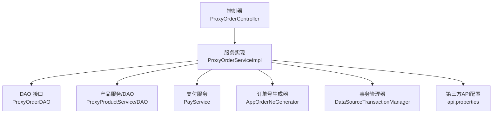
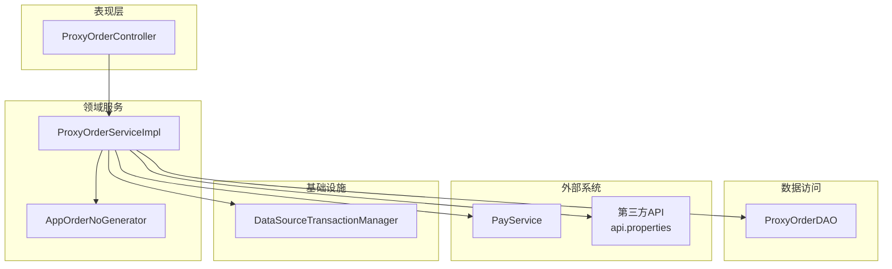
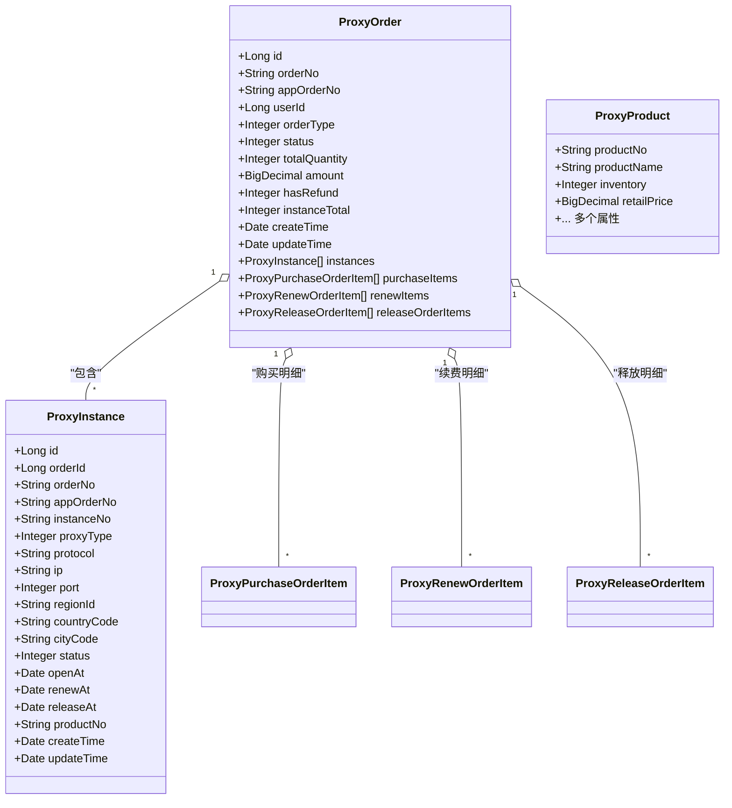
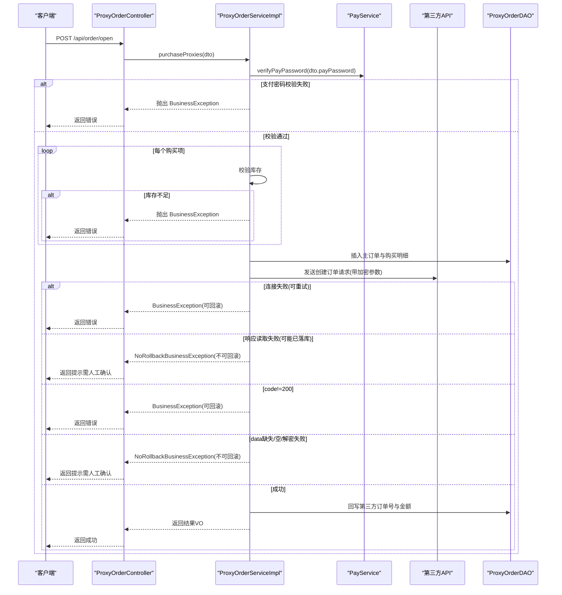
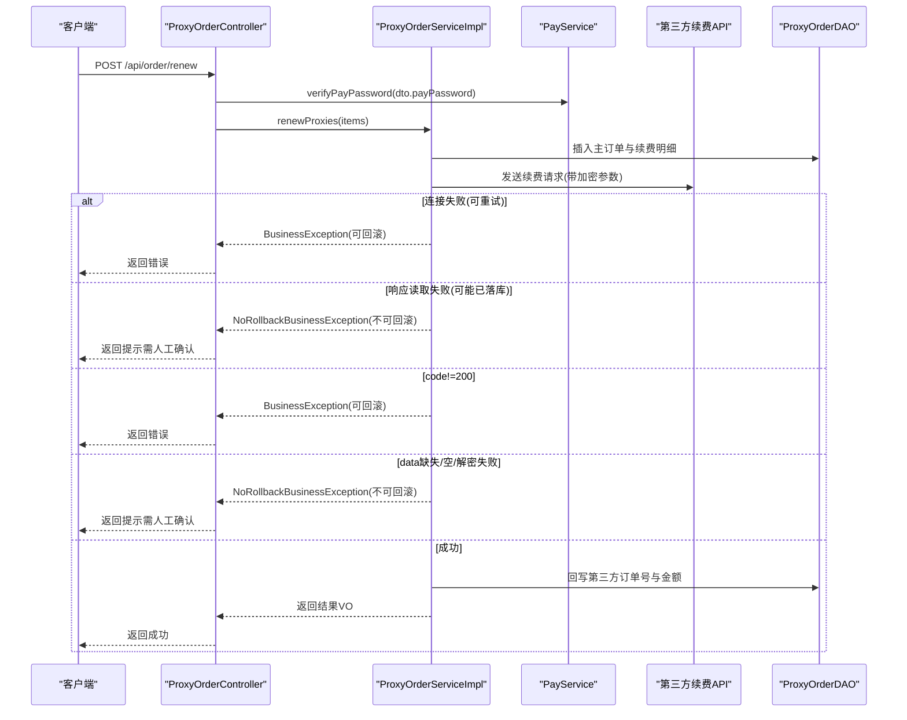
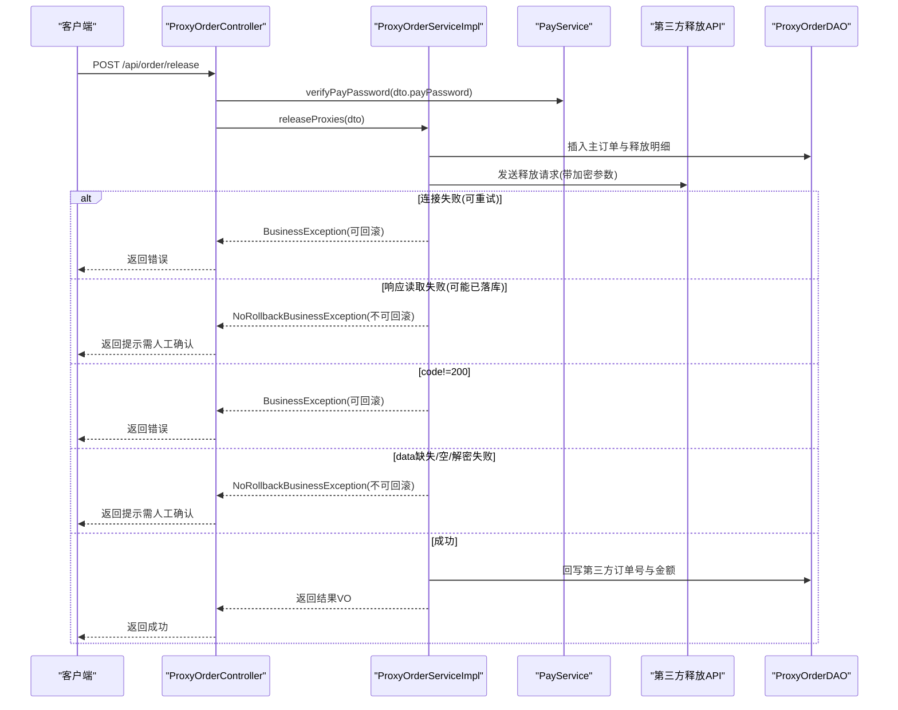
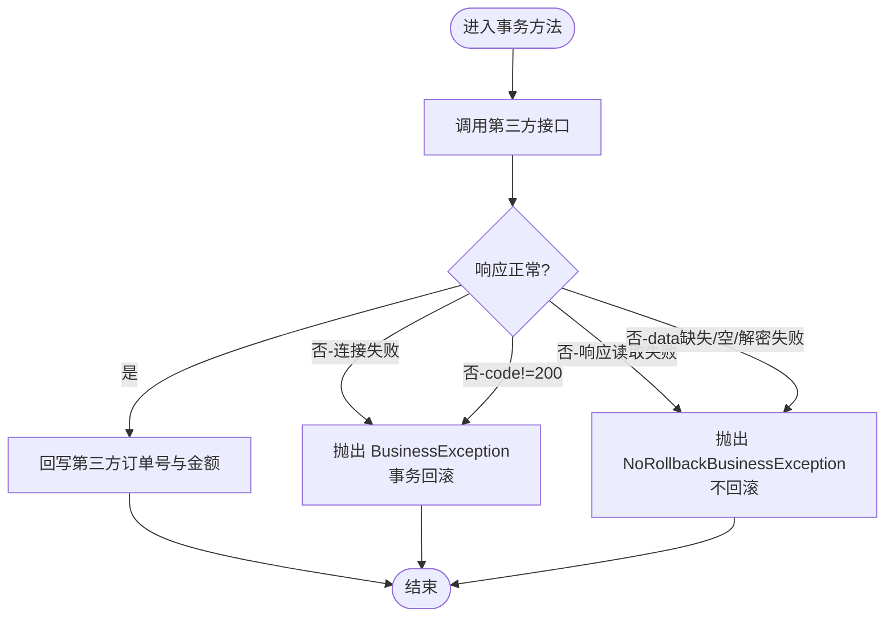
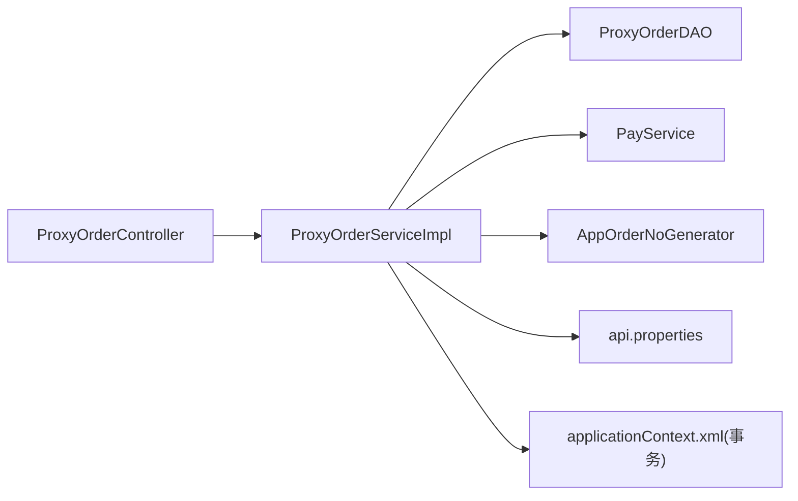

# 订单业务规则

<cite>
**本文引用的文件**
- [ProxyOrder.java](file://src/main/java/cn/linkfast/entity/ProxyOrder.java)
- [ProxyInstance.java](file://src/main/java/cn/linkfast/entity/ProxyInstance.java)
- [ProxyProduct.java](file://src/main/java/cn/linkfast/entity/ProxyProduct.java)
- [ProxyOrderService.java](file://src/main/java/cn/linkfast/service/ProxyOrderService.java)
- [ProxyOrderServiceImpl.java](file://src/main/java/cn/linkfast/service/impl/ProxyOrderServiceImpl.java)
- [ProxyOrderDAO.java](file://src/main/java/cn/linkfast/dao/ProxyOrderDAO.java)
- [ProxyOrderController.java](file://src/main/java/cn/linkfast/controller/ProxyOrderController.java)
- [BusinessException.java](file://src/main/java/cn/linkfast/exception/BusinessException.java)
- [NoRollbackBusinessException.java](file://src/main/java/cn/linkfast/exception/NoRollbackBusinessException.java)
- [ProxyPurchaseDTO.java](file://src/main/java/cn/linkfast/dto/ProxyPurchaseDTO.java)
- [ProxyRenewDTO.java](file://src/main/java/cn/linkfast/dto/ProxyRenewDTO.java)
- [ProxyReleaseDTO.java](file://src/main/java/cn/linkfast/dto/ProxyReleaseDTO.java)
- [AppOrderNoGenerator.java](file://src/main/java/cn/linkfast/utils/AppOrderNoGenerator.java)
- [applicationContext.xml](file://src/main/resources/applicationContext.xml)
- [api.properties](file://src/main/resources/api.properties)
- [ProxyOrderIT.java](file://src/test/java/cn/linkfast/service/Impl/ProxyOrderIT.java)
</cite>

## 目录
1. [简介](#简介)
2. [项目结构](#项目结构)
3. [核心组件](#核心组件)
4. [架构总览](#架构总览)
5. [详细组件分析](#详细组件分析)
6. [依赖分析](#依赖分析)
7. [性能考虑](#性能考虑)
8. [故障排查指南](#故障排查指南)
9. [结论](#结论)
10. [附录](#附录)

## 简介
本文件面向订单业务规则的实现与维护，系统性梳理购买、续费、释放三类订单的核心业务规则与约束，包括库存检查、支付验证、第三方接口交互、订单状态流转、异常处理与事务策略、幂等性保障与重复请求处理、扩展点与自定义规则实现建议，以及验证与测试最佳实践。目标是帮助开发者在不破坏一致性前提下扩展与演进订单能力。

## 项目结构
围绕订单域的关键模块如下：
- 控制层：对外暴露订单查询、购买、续费、释放接口
- 服务层：封装订单业务规则、事务控制、第三方交互与异常策略
- 数据访问层：订单主表与明细表的持久化操作
- 实体与DTO/VO：订单、实例、产品、购买/续费/释放明细及传输对象
- 工具与配置：订单号生成器、Spring事务与数据源配置、第三方API路径配置

图表来源
- [ProxyOrderController.java:1-88](file://src/main/java/cn/linkfast/controller/ProxyOrderController.java#L1-L88)
- [ProxyOrderServiceImpl.java:1-782](file://src/main/java/cn/linkfast/service/impl/ProxyOrderServiceImpl.java#L1-L782)
- [ProxyOrderDAO.java:1-102](file://src/main/java/cn/linkfast/dao/ProxyOrderDAO.java#L1-L102)
- [applicationContext.xml:59-67](file://src/main/resources/applicationContext.xml#L59-L67)
- [api.properties:1-31](file://src/main/resources/api.properties#L1-L31)

章节来源
- [ProxyOrderController.java:1-88](file://src/main/java/cn/linkfast/controller/ProxyOrderController.java#L1-L88)
- [ProxyOrderServiceImpl.java:1-782](file://src/main/java/cn/linkfast/service/impl/ProxyOrderServiceImpl.java#L1-L782)
- [ProxyOrderDAO.java:1-102](file://src/main/java/cn/linkfast/dao/ProxyOrderDAO.java#L1-L102)
- [applicationContext.xml:59-67](file://src/main/resources/applicationContext.xml#L59-L67)
- [api.properties:1-31](file://src/main/resources/api.properties#L1-L31)

## 核心组件
- 订单实体与状态
  - 订单类型：购买、续费、释放
  - 订单状态：待处理、处理中、处理成功、处理失败、部分完成
  - 订单明细：购买/续费/释放对应的明细项
- 订单号生成器：基于雪花算法生成购买/续费/释放三类订单号
- 事务管理：统一开启事务，区分可回滚与不可回滚异常
- 异常体系：业务异常与不可回滚业务异常，分别驱动回滚与不回滚策略

章节来源
- [ProxyOrder.java:11-45](file://src/main/java/cn/linkfast/entity/ProxyOrder.java#L11-L45)
- [ProxyOrderService.java:42-52](file://src/main/java/cn/linkfast/service/ProxyOrderService.java#L42-L52)
- [ProxyOrderServiceImpl.java:196-458](file://src/main/java/cn/linkfast/service/impl/ProxyOrderServiceImpl.java#L196-L458)
- [AppOrderNoGenerator.java:14-45](file://src/main/java/cn/linkfast/utils/AppOrderNoGenerator.java#L14-L45)
- [applicationContext.xml:59-67](file://src/main/resources/applicationContext.xml#L59-L67)

## 架构总览
订单域采用经典的分层架构：Controller负责参数校验与结果封装，Service承载业务规则与事务边界，DAO负责数据持久化，外部依赖通过第三方API与支付服务协同。

图表来源
- [ProxyOrderController.java:20-88](file://src/main/java/cn/linkfast/controller/ProxyOrderController.java#L20-L88)
- [ProxyOrderServiceImpl.java:34-782](file://src/main/java/cn/linkfast/service/impl/ProxyOrderServiceImpl.java#L34-L782)
- [ProxyOrderDAO.java:10-102](file://src/main/java/cn/linkfast/dao/ProxyOrderDAO.java#L10-L102)
- [applicationContext.xml:59-67](file://src/main/resources/applicationContext.xml#L59-L67)
- [api.properties:14-31](file://src/main/resources/api.properties#L14-L31)

## 详细组件分析

### 订单实体与状态模型
- 订单主表包含平台订单号、渠道商订单号、用户ID、订单类型、状态、数量、金额、是否退费、实例总数等字段
- 订单明细按类型拆分：购买、续费、释放
- 实例实体包含实例编号、协议、区域、到期时间、桥地址等

图表来源
- [ProxyOrder.java:11-45](file://src/main/java/cn/linkfast/entity/ProxyOrder.java#L11-L45)
- [ProxyInstance.java:9-57](file://src/main/java/cn/linkfast/entity/ProxyInstance.java#L9-L57)
- [ProxyProduct.java:13-99](file://src/main/java/cn/linkfast/entity/ProxyProduct.java#L13-L99)

章节来源
- [ProxyOrder.java:11-45](file://src/main/java/cn/linkfast/entity/ProxyOrder.java#L11-L45)
- [ProxyInstance.java:9-57](file://src/main/java/cn/linkfast/entity/ProxyInstance.java#L9-L57)
- [ProxyProduct.java:13-99](file://src/main/java/cn/linkfast/entity/ProxyProduct.java#L13-L99)

### 购买订单流程与规则
- 支付密码校验：调用支付服务验证
- 库存检查：逐项查询产品库存，不足则抛出业务异常
- 订单生成：生成渠道商订单号与平台订单号，写入主表与购买明细
- 第三方下单：加密参数调用第三方创建订单接口，重试3次
- 结果处理：根据响应状态与数据完整性判断是否回滚或保留本地数据
- 回写：成功后回写第三方返回的平台订单号与金额

图表来源
- [ProxyOrderController.java:39-45](file://src/main/java/cn/linkfast/controller/ProxyOrderController.java#L39-L45)
- [ProxyOrderServiceImpl.java:196-458](file://src/main/java/cn/linkfast/service/impl/ProxyOrderServiceImpl.java#L196-L458)
- [ProxyOrderDAO.java:37-47](file://src/main/java/cn/linkfast/dao/ProxyOrderDAO.java#L37-L47)
- [api.properties:16-17](file://src/main/resources/api.properties#L16-L17)

章节来源
- [ProxyOrderServiceImpl.java:196-458](file://src/main/java/cn/linkfast/service/impl/ProxyOrderServiceImpl.java#L196-L458)
- [ProxyOrderDAO.java:37-47](file://src/main/java/cn/linkfast/dao/ProxyOrderDAO.java#L37-L47)
- [ProxyOrderController.java:39-45](file://src/main/java/cn/linkfast/controller/ProxyOrderController.java#L39-L45)

### 续费订单流程与规则
- 支付密码校验：与购买一致
- 订单生成：生成渠道商/平台订单号，写入主表与续费明细
- 第三方续费：加密参数调用第三方续费接口，重试3次
- 结果处理：与购买类似，区分可回滚与不可回滚场景
- 回写：成功后回写第三方返回的平台订单号与金额

图表来源
- [ProxyOrderController.java:47-67](file://src/main/java/cn/linkfast/controller/ProxyOrderController.java#L47-L67)
- [ProxyOrderServiceImpl.java:469-635](file://src/main/java/cn/linkfast/service/impl/ProxyOrderServiceImpl.java#L469-L635)
- [ProxyOrderDAO.java:39](file://src/main/java/cn/linkfast/dao/ProxyOrderDAO.java#L39)
- [api.properties:28-29](file://src/main/resources/api.properties#L28-L29)

章节来源
- [ProxyOrderServiceImpl.java:469-635](file://src/main/java/cn/linkfast/service/impl/ProxyOrderServiceImpl.java#L469-L635)
- [ProxyOrderDAO.java:39](file://src/main/java/cn/linkfast/dao/ProxyOrderDAO.java#L39)
- [ProxyOrderController.java:47-67](file://src/main/java/cn/linkfast/controller/ProxyOrderController.java#L47-L67)

### 释放订单流程与规则
- 支付密码校验：与购买/续费一致
- 订单生成：生成渠道商/平台订单号，写入主表与释放明细
- 第三方释放：加密参数调用第三方释放接口，重试3次
- 结果处理：与购买/续费一致，区分可回滚与不可回滚场景
- 回写：成功后回写第三方返回的平台订单号与金额

图表来源
- [ProxyOrderController.java:69-85](file://src/main/java/cn/linkfast/controller/ProxyOrderController.java#L69-L85)
- [ProxyOrderServiceImpl.java:637-779](file://src/main/java/cn/linkfast/service/impl/ProxyOrderServiceImpl.java#L637-L779)
- [ProxyOrderDAO.java:93](file://src/main/java/cn/linkfast/dao/ProxyOrderDAO.java#L93)
- [api.properties:30-31](file://src/main/resources/api.properties#L30-L31)

章节来源
- [ProxyOrderServiceImpl.java:637-779](file://src/main/java/cn/linkfast/service/impl/ProxyOrderServiceImpl.java#L637-L779)
- [ProxyOrderDAO.java:93](file://src/main/java/cn/linkfast/dao/ProxyOrderDAO.java#L93)
- [ProxyOrderController.java:69-85](file://src/main/java/cn/linkfast/controller/ProxyOrderController.java#L69-L85)

### 库存检查与支付验证
- 库存检查：逐项查询产品库存，不足则立即抛出业务异常
- 支付验证：统一调用支付服务验证支付密码，失败即抛出业务异常

章节来源
- [ProxyOrderServiceImpl.java:206-237](file://src/main/java/cn/linkfast/service/impl/ProxyOrderServiceImpl.java#L206-L237)
- [ProxyOrderServiceImpl.java:639-643](file://src/main/java/cn/linkfast/service/impl/ProxyOrderServiceImpl.java#L639-L643)

### 订单状态转换
- 订单状态流转：创建订单时初始状态为“待处理”，第三方接口成功后由DAO回写平台订单号与金额，最终状态由后续同步或回调决定
- 状态字段：订单主表与实例实体均包含状态字段，支持后续状态变更

章节来源
- [ProxyOrder.java:24-35](file://src/main/java/cn/linkfast/entity/ProxyOrder.java#L24-L35)
- [ProxyInstance.java:33-44](file://src/main/java/cn/linkfast/entity/ProxyInstance.java#L33-L44)

### 异常处理与事务策略
- 事务策略
  - 购买/续费/释放均使用声明式事务，rollbackFor包含Exception，noRollbackFor包含NoRollbackBusinessException
  - 当发生可回滚异常时，事务自动回滚；当发生不可回滚异常时，事务不回滚
- 异常类型
  - BusinessException：通用业务异常，触发事务回滚
  - NoRollbackBusinessException：第三方已落库但我方处理失败，不触发回滚，需人工确认
- 控制器层捕获与兜底
  - 续费/释放控制器对BusinessException进行错误封装返回
  - 服务层对未预期异常统一包装为BusinessException

图表来源
- [ProxyOrderServiceImpl.java:343-451](file://src/main/java/cn/linkfast/service/impl/ProxyOrderServiceImpl.java#L343-L451)
- [ProxyOrderServiceImpl.java:521-634](file://src/main/java/cn/linkfast/service/impl/ProxyOrderServiceImpl.java#L521-L634)
- [ProxyOrderServiceImpl.java:679-778](file://src/main/java/cn/linkfast/service/impl/ProxyOrderServiceImpl.java#L679-L778)

章节来源
- [ProxyOrderService.java:42-52](file://src/main/java/cn/linkfast/service/ProxyOrderService.java#L42-L52)
- [ProxyOrderServiceImpl.java:343-451](file://src/main/java/cn/linkfast/service/impl/ProxyOrderServiceImpl.java#L343-L451)
- [ProxyOrderServiceImpl.java:521-634](file://src/main/java/cn/linkfast/service/impl/ProxyOrderServiceImpl.java#L521-L634)
- [ProxyOrderServiceImpl.java:679-778](file://src/main/java/cn/linkfast/service/impl/ProxyOrderServiceImpl.java#L679-L778)
- [BusinessException.java:1-36](file://src/main/java/cn/linkfast/exception/BusinessException.java#L1-L36)
- [NoRollbackBusinessException.java:1-27](file://src/main/java/cn/linkfast/exception/NoRollbackBusinessException.java#L1-L27)

### 幂等性保证与重复请求处理
- 订单号幂等：购买/续费/释放均通过AppOrderNoGenerator生成全局唯一渠道商订单号，避免重复下单
- 第三方幂等：调用第三方接口时，若出现“连接失败”场景（未到达第三方），可安全重试；若“请求已发送但响应读取失败”，属于“可能已落库”场景，不回滚
- 控制器幂等：当前控制器未显式实现请求去重（如Redis去重），建议在网关或控制器层增加基于渠道商订单号的幂等校验

章节来源
- [AppOrderNoGenerator.java:14-45](file://src/main/java/cn/linkfast/utils/AppOrderNoGenerator.java#L14-L45)
- [ProxyOrderServiceImpl.java:343-451](file://src/main/java/cn/linkfast/service/impl/ProxyOrderServiceImpl.java#L343-L451)
- [ProxyOrderServiceImpl.java:521-634](file://src/main/java/cn/linkfast/service/impl/ProxyOrderServiceImpl.java#L521-L634)
- [ProxyOrderServiceImpl.java:679-778](file://src/main/java/cn/linkfast/service/impl/ProxyOrderServiceImpl.java#L679-L778)

### 业务规则扩展点与自定义规则
- 新增订单类型：在服务层新增方法，遵循现有事务与异常策略；在DAO层扩展对应明细表写入与回写逻辑
- 自定义库存校验：可在库存检查阶段加入更细粒度的限制（如限购、黑名单等）
- 自定义支付校验：在支付验证环节接入更严格的风控策略
- 自定义第三方对接：在API路径与加解密工具处扩展，保持异常分支与回写逻辑一致

章节来源
- [ProxyOrderService.java:15-61](file://src/main/java/cn/linkfast/service/ProxyOrderService.java#L15-L61)
- [ProxyOrderDAO.java:10-102](file://src/main/java/cn/linkfast/dao/ProxyOrderDAO.java#L10-L102)
- [api.properties:14-31](file://src/main/resources/api.properties#L14-L31)

### 业务规则验证与测试最佳实践
- 集成测试：通过Mock第三方响应与解密工具，验证购买/续费/释放全流程，覆盖可回滚与不可回滚分支
- 事务验证：确保异常分支正确触发回滚或不回滚
- 幂等验证：模拟重复请求，验证渠道商订单号幂等与去重策略
- 参数校验：利用DTO注解与控制器层校验，确保必填字段与格式正确

章节来源
- [ProxyOrderIT.java:68-178](file://src/test/java/cn/linkfast/service/Impl/ProxyOrderIT.java#L68-L178)
- [ProxyPurchaseDTO.java:10-22](file://src/main/java/cn/linkfast/dto/ProxyPurchaseDTO.java#L10-L22)
- [ProxyRenewDTO.java:12-27](file://src/main/java/cn/linkfast/dto/ProxyRenewDTO.java#L12-L27)
- [ProxyReleaseDTO.java:12-27](file://src/main/java/cn/linkfast/dto/ProxyReleaseDTO.java#L12-L27)

## 依赖分析
- 控制器依赖服务实现，服务实现依赖DAO、支付服务、订单号生成器与第三方API配置
- 事务管理器由Spring XML配置，启用注解驱动事务

图表来源
- [ProxyOrderController.java:20-88](file://src/main/java/cn/linkfast/controller/ProxyOrderController.java#L20-L88)
- [ProxyOrderServiceImpl.java:34-782](file://src/main/java/cn/linkfast/service/impl/ProxyOrderServiceImpl.java#L34-L782)
- [ProxyOrderDAO.java:10-102](file://src/main/java/cn/linkfast/dao/ProxyOrderDAO.java#L10-L102)
- [applicationContext.xml:59-67](file://src/main/resources/applicationContext.xml#L59-L67)
- [api.properties:14-31](file://src/main/resources/api.properties#L14-L31)

章节来源
- [ProxyOrderController.java:20-88](file://src/main/java/cn/linkfast/controller/ProxyOrderController.java#L20-L88)
- [ProxyOrderServiceImpl.java:34-782](file://src/main/java/cn/linkfast/service/impl/ProxyOrderServiceImpl.java#L34-L782)
- [ProxyOrderDAO.java:10-102](file://src/main/java/cn/linkfast/dao/ProxyOrderDAO.java#L10-L102)
- [applicationContext.xml:59-67](file://src/main/resources/applicationContext.xml#L59-L67)
- [api.properties:14-31](file://src/main/resources/api.properties#L14-L31)

## 性能考虑
- 库存查询优化：购买流程中对每项产品进行查询，建议结合批量查询与缓存降低DB压力
- 异步更新：库存充足时异步更新产品信息，避免阻塞下单主流程
- 重试策略：对“连接失败”场景进行指数退避重试，减少抖动
- 日志与监控：对第三方接口耗时、成功率与异常类型进行埋点，便于定位瓶颈

## 故障排查指南
- “连接失败”：通常可安全重试，若多次失败，检查网络与第三方可达性
- “响应读取失败”：第三方可能已落库，保留本地数据，需人工确认
- “code!=200”：第三方业务失败，可回滚本地数据
- “data缺失/空/解密失败”：第三方可能已落库，不回滚，需人工确认
- 事务未回滚：确认是否抛出了NoRollbackBusinessException或被控制器捕获

章节来源
- [ProxyOrderServiceImpl.java:343-451](file://src/main/java/cn/linkfast/service/impl/ProxyOrderServiceImpl.java#L343-L451)
- [ProxyOrderServiceImpl.java:521-634](file://src/main/java/cn/linkfast/service/impl/ProxyOrderServiceImpl.java#L521-L634)
- [ProxyOrderServiceImpl.java:679-778](file://src/main/java/cn/linkfast/service/impl/ProxyOrderServiceImpl.java#L679-L778)
- [ProxyOrderController.java:50-84](file://src/main/java/cn/linkfast/controller/ProxyOrderController.java#L50-L84)

## 结论
本订单域通过清晰的业务规则、严谨的异常与事务策略、完善的第三方交互与回写机制，实现了购买、续费、释放三大核心流程的高可靠运行。建议在现有基础上进一步强化幂等性（如请求去重）、引入更细粒度的库存与风控策略，并持续完善测试覆盖与监控告警，以支撑业务的长期演进。

## 附录
- 订单号生成策略：购买/续费/释放三类前缀区分，基于雪花算法生成全局唯一ID
- 第三方API路径：通过配置文件集中管理，便于切换沙盒/生产环境
- DTO约束：购买/续费/释放DTO均包含支付密码与必填字段校验，确保入参合法性

章节来源
- [AppOrderNoGenerator.java:17-43](file://src/main/java/cn/linkfast/utils/AppOrderNoGenerator.java#L17-L43)
- [api.properties:14-31](file://src/main/resources/api.properties#L14-L31)
- [ProxyPurchaseDTO.java:10-22](file://src/main/java/cn/linkfast/dto/ProxyPurchaseDTO.java#L10-L22)
- [ProxyRenewDTO.java:12-27](file://src/main/java/cn/linkfast/dto/ProxyRenewDTO.java#L12-L27)
- [ProxyReleaseDTO.java:12-27](file://src/main/java/cn/linkfast/dto/ProxyReleaseDTO.java#L12-L27)