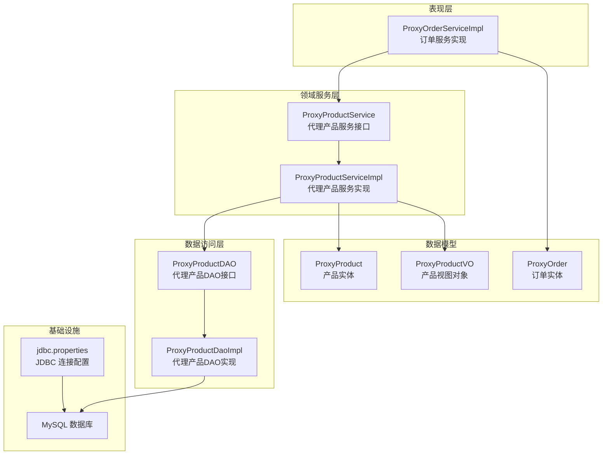
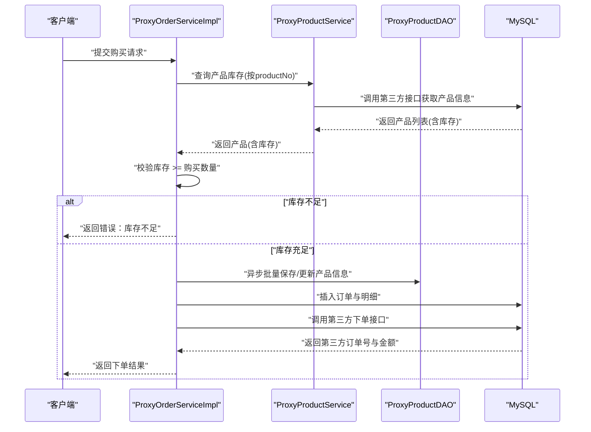
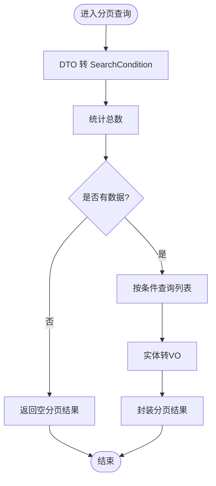
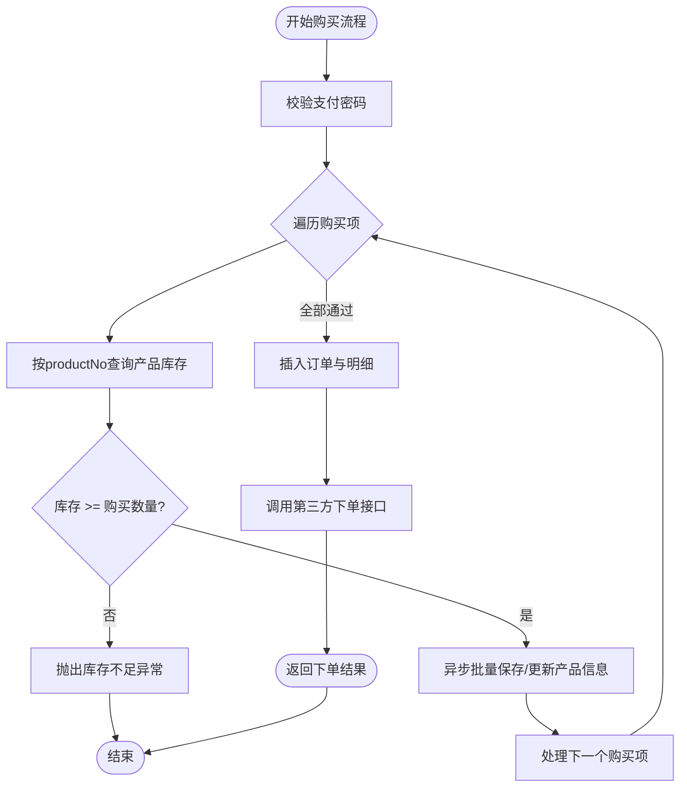
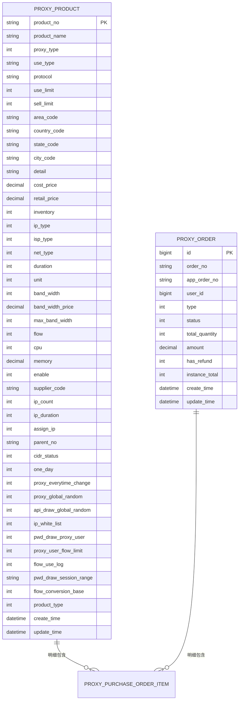
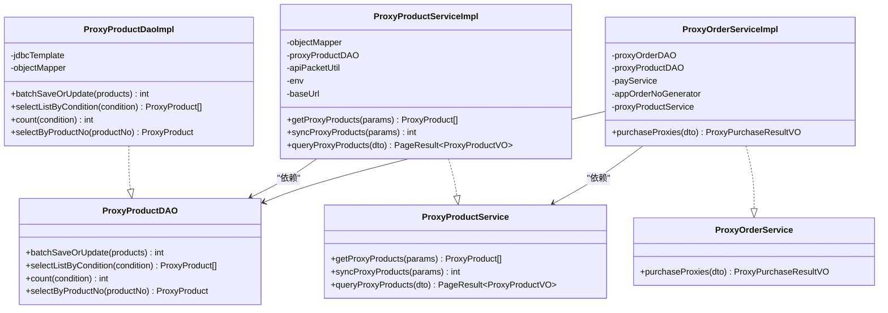
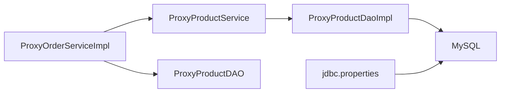

# 库存检查机制

<cite>
**本文引用的文件**
- [ProxyProductService.java](file://src/main/java/cn/linkfast/service/ProxyProductService.java)
- [ProxyProductServiceImpl.java](file://src/main/java/cn/linkfast/service/impl/ProxyProductServiceImpl.java)
- [ProxyProductDAO.java](file://src/main/java/cn/linkfast/dao/ProxyProductDAO.java)
- [ProxyProductDaoImpl.java](file://src/main/java/cn/linkfast/dao/impl/ProxyProductDaoImpl.java)
- [ProxyProduct.java](file://src/main/java/cn/linkfast/entity/ProxyProduct.java)
- [ProxyProductVO.java](file://src/main/java/cn/linkfast/vo/ProxyProductVO.java)
- [ProxyOrderService.java](file://src/main/java/cn/linkfast/service/ProxyOrderService.java)
- [ProxyOrderServiceImpl.java](file://src/main/java/cn/linkfast/service/impl/ProxyOrderServiceImpl.java)
- [ProxyProductQueryDTO.java](file://src/main/java/cn/linkfast/dto/ProxyProductQueryDTO.java)
- [ProxyProductSearchCondition.java](file://src/main/java/cn/linkfast/dto/ProxyProductSearchCondition.java)
- [ProxyPurchaseDTO.java](file://src/main/java/cn/linkfast/dto/ProxyPurchaseDTO.java)
- [ProxyOrder.java](file://src/main/java/cn/linkfast/entity/ProxyOrder.java)
- [jdbc.properties](file://src/main/resources/jdbc.properties)
</cite>

## 目录
1. [简介](#简介)
2. [项目结构](#项目结构)
3. [核心组件](#核心组件)
4. [架构总览](#架构总览)
5. [详细组件分析](#详细组件分析)
6. [依赖分析](#依赖分析)
7. [性能考虑](#性能考虑)
8. [故障排查指南](#故障排查指南)
9. [结论](#结论)
10. [附录](#附录)

## 简介
本文围绕“代理产品库存检查机制”进行系统化文档化，重点覆盖以下方面：
- 代理产品库存的实时检查流程：从订单创建前的库存校验，到库存数量的动态更新与持久化。
- 业务规则：最小库存阈值、库存扣减时机、并发场景下的库存保护机制。
- 与订单创建的协调机制：库存检查前置、异步库存更新以提升下单体验。
- 性能优化策略与缓存使用建议。

## 项目结构
本项目采用典型的分层架构：Controller → Service → DAO → 数据库。与库存检查相关的关键模块集中在 Service 和 DAO 层，涉及代理产品查询、库存校验、订单创建与异步库存刷新。

图表来源
- [ProxyOrderServiceImpl.java:196-458](file://src/main/java/cn/linkfast/service/impl/ProxyOrderServiceImpl.java#L196-L458)
- [ProxyProductServiceImpl.java:87-141](file://src/main/java/cn/linkfast/service/impl/ProxyProductServiceImpl.java#L87-L141)
- [ProxyProductDaoImpl.java:100-283](file://src/main/java/cn/linkfast/dao/impl/ProxyProductDaoImpl.java#L100-L283)
- [ProxyProduct.java:15-99](file://src/main/java/cn/linkfast/entity/ProxyProduct.java#L15-L99)
- [ProxyProductVO.java:14-31](file://src/main/java/cn/linkfast/vo/ProxyProductVO.java#L14-L31)
- [ProxyOrder.java:19-45](file://src/main/java/cn/linkfast/entity/ProxyOrder.java#L19-L45)
- [jdbc.properties:1-34](file://src/main/resources/jdbc.properties#L1-L34)

章节来源
- [ProxyOrderServiceImpl.java:196-458](file://src/main/java/cn/linkfast/service/impl/ProxyOrderServiceImpl.java#L196-L458)
- [ProxyProductServiceImpl.java:87-141](file://src/main/java/cn/linkfast/service/impl/ProxyProductServiceImpl.java#L87-L141)
- [ProxyProductDaoImpl.java:100-283](file://src/main/java/cn/linkfast/dao/impl/ProxyProductDaoImpl.java#L100-L283)
- [ProxyProduct.java:15-99](file://src/main/java/cn/linkfast/entity/ProxyProduct.java#L15-L99)
- [ProxyProductVO.java:14-31](file://src/main/java/cn/linkfast/vo/ProxyProductVO.java#L14-L31)
- [ProxyOrder.java:19-45](file://src/main/java/cn/linkfast/entity/ProxyOrder.java#L19-L45)
- [jdbc.properties:1-34](file://src/main/resources/jdbc.properties#L1-L34)

## 核心组件
- 代理产品服务接口与实现：负责对接第三方接口获取产品信息、解析与落库，以及分页查询本地产品列表。
- 代理产品DAO接口与实现：负责产品数据的批量保存/更新、按条件查询、计数与按编号查询。
- 订单服务实现：在购买流程中进行库存检查，库存充足时异步刷新本地产品数据，随后创建订单并调用第三方下单接口。
- 数据模型：ProxyProduct（库存字段）、ProxyProductVO（对外展示）、ProxyOrder（订单聚合根）。

章节来源
- [ProxyProductService.java:15-27](file://src/main/java/cn/linkfast/service/ProxyProductService.java#L15-L27)
- [ProxyProductServiceImpl.java:87-141](file://src/main/java/cn/linkfast/service/impl/ProxyProductServiceImpl.java#L87-L141)
- [ProxyProductDAO.java:8-24](file://src/main/java/cn/linkfast/dao/ProxyProductDAO.java#L8-L24)
- [ProxyProductDaoImpl.java:100-283](file://src/main/java/cn/linkfast/dao/impl/ProxyProductDaoImpl.java#L100-L283)
- [ProxyProduct.java:34-34](file://src/main/java/cn/linkfast/entity/ProxyProduct.java#L34-L34)
- [ProxyProductVO.java:30-30](file://src/main/java/cn/linkfast/vo/ProxyProductVO.java#L30-L30)
- [ProxyOrderService.java:15-61](file://src/main/java/cn/linkfast/service/ProxyOrderService.java#L15-L61)
- [ProxyOrderServiceImpl.java:196-458](file://src/main/java/cn/linkfast/service/impl/ProxyOrderServiceImpl.java#L196-L458)

## 架构总览
库存检查贯穿“订单创建 → 库存校验 → 异步刷新 → 订单落库 → 第三方下单”的链路。系统通过服务层封装业务规则，DAO 层承担数据持久化，数据库承载库存数据。

图表来源
- [ProxyOrderServiceImpl.java:196-458](file://src/main/java/cn/linkfast/service/impl/ProxyOrderServiceImpl.java#L196-L458)
- [ProxyProductServiceImpl.java:87-141](file://src/main/java/cn/linkfast/service/impl/ProxyProductServiceImpl.java#L87-L141)
- [ProxyProductDaoImpl.java:100-190](file://src/main/java/cn/linkfast/dao/impl/ProxyProductDaoImpl.java#L100-L190)

## 详细组件分析

### 代理产品库存查询与分页
- 服务层提供分页查询本地产品列表的能力，内部将 DTO 转为 DAO 查询条件，先查总数再查列表，最后将实体转换为 VO 返回。
- DAO 层支持按国家/城市/代理类型等条件过滤，并通过 LIMIT/OFFSET 实现分页。

图表来源
- [ProxyProductServiceImpl.java:121-141](file://src/main/java/cn/linkfast/service/impl/ProxyProductServiceImpl.java#L121-L141)
- [ProxyProductDaoImpl.java:192-214](file://src/main/java/cn/linkfast/dao/impl/ProxyProductDaoImpl.java#L192-L214)
- [ProxyProductQueryDTO.java:17-51](file://src/main/java/cn/linkfast/dto/ProxyProductQueryDTO.java#L17-L51)
- [ProxyProductSearchCondition.java:11-17](file://src/main/java/cn/linkfast/dto/ProxyProductSearchCondition.java#L11-L17)

章节来源
- [ProxyProductServiceImpl.java:121-141](file://src/main/java/cn/linkfast/service/impl/ProxyProductServiceImpl.java#L121-L141)
- [ProxyProductDaoImpl.java:192-214](file://src/main/java/cn/linkfast/dao/impl/ProxyProductDaoImpl.java#L192-L214)
- [ProxyProductQueryDTO.java:17-51](file://src/main/java/cn/linkfast/dto/ProxyProductQueryDTO.java#L17-L51)
- [ProxyProductSearchCondition.java:11-17](file://src/main/java/cn/linkfast/dto/ProxyProductSearchCondition.java#L11-L17)

### 订单创建中的库存检查与异步更新
- 在购买流程中，服务层对每个购买项执行库存检查：调用产品服务获取产品信息，读取库存字段并与购买数量比较。
- 若库存充足，立即异步触发产品信息的批量保存/更新，避免阻塞当前下单线程；随后继续订单落库与第三方下单。
- 若库存不足，直接抛出业务异常，阻止下单。

图表来源
- [ProxyOrderServiceImpl.java:196-458](file://src/main/java/cn/linkfast/service/impl/ProxyOrderServiceImpl.java#L196-L458)
- [ProxyProductServiceImpl.java:87-141](file://src/main/java/cn/linkfast/service/impl/ProxyProductServiceImpl.java#L87-L141)
- [ProxyProductDaoImpl.java:100-190](file://src/main/java/cn/linkfast/dao/impl/ProxyProductDaoImpl.java#L100-L190)

章节来源
- [ProxyOrderServiceImpl.java:196-458](file://src/main/java/cn/linkfast/service/impl/ProxyOrderServiceImpl.java#L196-L458)
- [ProxyProductServiceImpl.java:87-141](file://src/main/java/cn/linkfast/service/impl/ProxyProductServiceImpl.java#L87-L141)
- [ProxyProductDaoImpl.java:100-190](file://src/main/java/cn/linkfast/dao/impl/ProxyProductDaoImpl.java#L100-L190)

### 数据模型与库存字段
- 产品实体包含库存字段，用于库存检查与展示。
- 产品视图对象包含库存字段，用于对外展示。
- 订单实体作为聚合根，包含购买明细，明细中会补充产品属性（如成本价、零售价等）。

图表来源
- [ProxyProduct.java:15-99](file://src/main/java/cn/linkfast/entity/ProxyProduct.java#L15-L99)
- [ProxyOrder.java:19-45](file://src/main/java/cn/linkfast/entity/ProxyOrder.java#L19-L45)

章节来源
- [ProxyProduct.java:34-34](file://src/main/java/cn/linkfast/entity/ProxyProduct.java#L34-L34)
- [ProxyProductVO.java:30-30](file://src/main/java/cn/linkfast/vo/ProxyProductVO.java#L30-L30)
- [ProxyOrder.java:39-44](file://src/main/java/cn/linkfast/entity/ProxyOrder.java#L39-L44)

### 类关系与依赖

图表来源
- [ProxyProductService.java:15-27](file://src/main/java/cn/linkfast/service/ProxyProductService.java#L15-L27)
- [ProxyProductServiceImpl.java:30-45](file://src/main/java/cn/linkfast/service/impl/ProxyProductServiceImpl.java#L30-L45)
- [ProxyProductDAO.java:8-24](file://src/main/java/cn/linkfast/dao/ProxyProductDAO.java#L8-L24)
- [ProxyProductDaoImpl.java:32-35](file://src/main/java/cn/linkfast/dao/impl/ProxyProductDaoImpl.java#L32-L35)
- [ProxyOrderService.java:15-61](file://src/main/java/cn/linkfast/service/ProxyOrderService.java#L15-L61)
- [ProxyOrderServiceImpl.java:37-45](file://src/main/java/cn/linkfast/service/impl/ProxyOrderServiceImpl.java#L37-L45)

章节来源
- [ProxyProductService.java:15-27](file://src/main/java/cn/linkfast/service/ProxyProductService.java#L15-L27)
- [ProxyProductServiceImpl.java:30-45](file://src/main/java/cn/linkfast/service/impl/ProxyProductServiceImpl.java#L30-L45)
- [ProxyProductDAO.java:8-24](file://src/main/java/cn/linkfast/dao/ProxyProductDAO.java#L8-L24)
- [ProxyProductDaoImpl.java:32-35](file://src/main/java/cn/linkfast/dao/impl/ProxyProductDaoImpl.java#L32-L35)
- [ProxyOrderService.java:15-61](file://src/main/java/cn/linkfast/service/ProxyOrderService.java#L15-L61)
- [ProxyOrderServiceImpl.java:37-45](file://src/main/java/cn/linkfast/service/impl/ProxyOrderServiceImpl.java#L37-L45)

## 依赖分析
- 服务层依赖 DAO 层进行数据持久化；DAO 层依赖 JDBC 模板与 MySQL 数据库。
- 订单服务在购买流程中同时依赖产品服务与产品 DAO，用于库存检查与产品信息补全。
- JDBC 连接配置启用批处理与预编译语句缓存，有助于批量写入性能。

图表来源
- [ProxyOrderServiceImpl.java:37-45](file://src/main/java/cn/linkfast/service/impl/ProxyOrderServiceImpl.java#L37-L45)
- [ProxyProductServiceImpl.java:38-41](file://src/main/java/cn/linkfast/service/impl/ProxyProductServiceImpl.java#L38-L41)
- [ProxyProductDaoImpl.java:34-35](file://src/main/java/cn/linkfast/dao/impl/ProxyProductDaoImpl.java#L34-L35)
- [jdbc.properties:1-34](file://src/main/resources/jdbc.properties#L1-L34)

章节来源
- [ProxyOrderServiceImpl.java:37-45](file://src/main/java/cn/linkfast/service/impl/ProxyOrderServiceImpl.java#L37-L45)
- [ProxyProductServiceImpl.java:38-41](file://src/main/java/cn/linkfast/service/impl/ProxyProductServiceImpl.java#L38-L41)
- [ProxyProductDaoImpl.java:34-35](file://src/main/java/cn/linkfast/dao/impl/ProxyProductDaoImpl.java#L34-L35)
- [jdbc.properties:1-34](file://src/main/resources/jdbc.properties#L1-L34)

## 性能考虑
- 批量写入优化：DAO 层使用批量 SQL 与批处理设置，减少往返次数，提高入库效率。
- 连接池与超时：JDBC 配置开启批处理与预编译缓存，设置合理的连接与 Socket 超时，降低慢查询风险。
- 异步刷新：库存检查通过异步任务刷新产品信息，避免阻塞下单主流程，提升用户体验。
- 缓存建议（概念性）：可在应用层引入本地缓存（如 Caffeine）存放热点产品信息，结合失效策略与一致性保障，进一步降低数据库压力。注意：当前代码未实现本地缓存，此为优化建议。

章节来源
- [ProxyProductDaoImpl.java:100-190](file://src/main/java/cn/linkfast/dao/impl/ProxyProductDaoImpl.java#L100-L190)
- [jdbc.properties:10-17](file://src/main/resources/jdbc.properties#L10-L17)
- [ProxyOrderServiceImpl.java:228-237](file://src/main/java/cn/linkfast/service/impl/ProxyOrderServiceImpl.java#L228-L237)

## 故障排查指南
- 库存不足异常：当产品库存为空或小于购买数量时，服务层会抛出业务异常。排查要点：确认第三方接口返回的库存值是否正确、本地是否及时异步刷新。
- 第三方接口异常：若库存查询或下单阶段出现连接失败、响应为空、JSON 非法、解密失败等情况，服务层会区分“可回滚”与“不可回滚”两类场景，分别进行回滚或保留本地数据。
- 数据库异常：批量写入失败时会记录错误日志并抛出异常，需检查 SQL 语法、索引与约束、事务隔离级别与锁竞争。

章节来源
- [ProxyOrderServiceImpl.java:205-237](file://src/main/java/cn/linkfast/service/impl/ProxyOrderServiceImpl.java#L205-L237)
- [ProxyProductServiceImpl.java:155-172](file://src/main/java/cn/linkfast/service/impl/ProxyProductServiceImpl.java#L155-L172)
- [ProxyProductDaoImpl.java:100-190](file://src/main/java/cn/linkfast/dao/impl/ProxyProductDaoImpl.java#L100-L190)

## 结论
本项目的库存检查机制以“订单前置校验 + 异步库存刷新”为核心设计，既保证了下单流程的高可用与低延迟，又通过批量写入与连接配置提升了整体性能。当前实现未包含本地缓存，建议在业务高峰期引入本地缓存与一致性策略，进一步增强系统的稳定性与吞吐能力。

## 附录
- 关键字段说明
  - 产品实体库存字段：用于库存检查与展示。
  - 购买 DTO：包含支付密码与购买项列表，驱动库存检查与下单流程。
- 业务规则摘要
  - 最小库存阈值：当前实现以“库存 ≥ 购买数量”为准；如需引入安全库存或预警阈值，可在服务层扩展。
  - 库存扣减时机：当前实现未在下单时直接扣减库存，而是在第三方下单成功后再异步刷新本地库存；如需强一致扣减，需引入分布式锁与原子操作。
  - 并发保护：当前未见显式的分布式锁或版本号控制；建议在需要强一致扣减时增加乐观锁或分布式锁。

章节来源
- [ProxyProduct.java:34-34](file://src/main/java/cn/linkfast/entity/ProxyProduct.java#L34-L34)
- [ProxyPurchaseDTO.java:10-19](file://src/main/java/cn/linkfast/dto/ProxyPurchaseDTO.java#L10-L19)
- [ProxyOrderServiceImpl.java:205-237](file://src/main/java/cn/linkfast/service/impl/ProxyOrderServiceImpl.java#L205-L237)