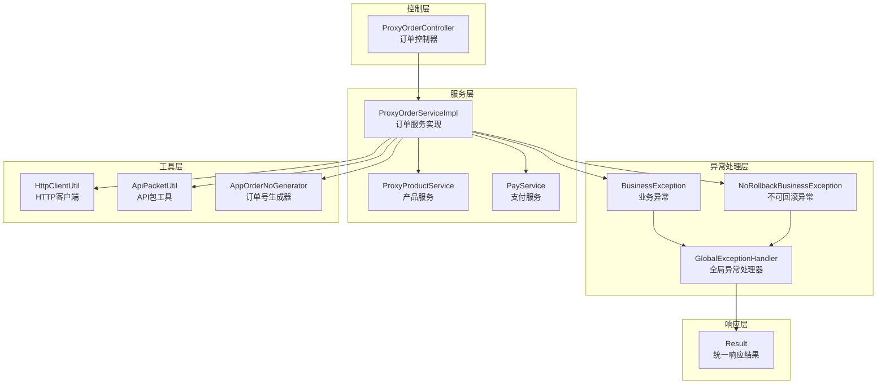
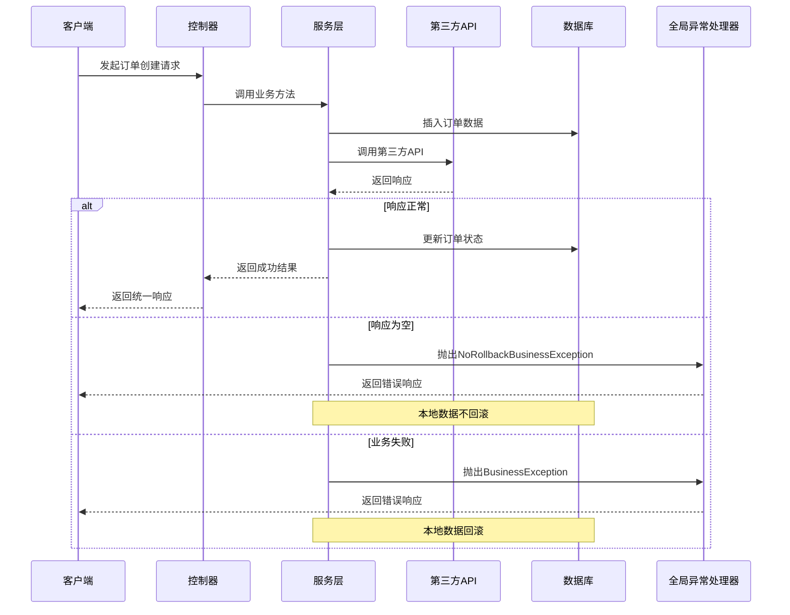
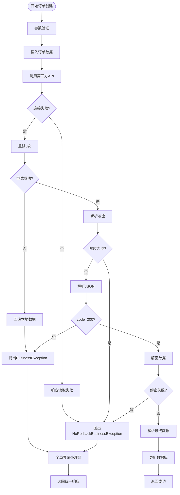
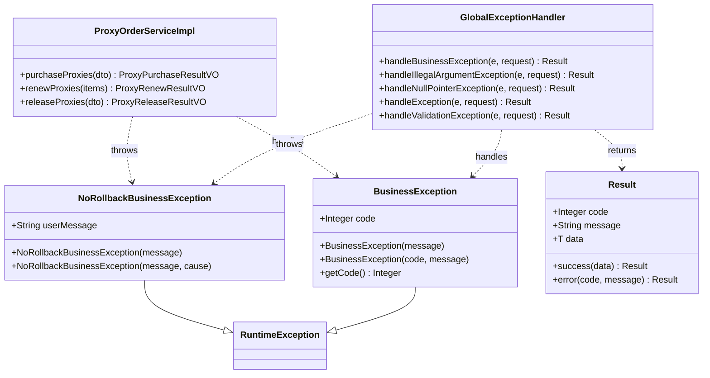

# 异常处理机制

<cite>
**本文档引用的文件**
- [BusinessException.java](file://src/main/java/cn/linkfast/exception/BusinessException.java)
- [NoRollbackBusinessException.java](file://src/main/java/cn/linkfast/exception/NoRollbackBusinessException.java)
- [GlobalExceptionHandler.java](file://src/main/java/cn/linkfast/exception/GlobalExceptionHandler.java)
- [ProxyOrderServiceImpl.java](file://src/main/java/cn/linkfast/service/impl/ProxyOrderServiceImpl.java)
- [ProxyOrderController.java](file://src/main/java/cn/linkfast/controller/ProxyOrderController.java)
- [Result.java](file://src/main/java/cn/linkfast/common/Result.java)
- [HttpClientUtil.java](file://src/main/java/cn/linkfast/utils/HttpClientUtil.java)
- [ProxyOrderServiceImplTest.java](file://src/test/java/cn/linkfast/service/Impl/ProxyOrderServiceImplTest.java)
- [ProxyOrderControllerTest.java](file://src/test/java/cn/linkfast/controller/ProxyOrderControllerTest.java)
</cite>

## 目录
1. [引言](#引言)
2. [项目结构](#项目结构)
3. [核心组件](#核心组件)
4. [架构概览](#架构概览)
5. [详细组件分析](#详细组件分析)
6. [依赖关系分析](#依赖关系分析)
7. [性能考虑](#性能考虑)
8. [故障排除指南](#故障排除指南)
9. [结论](#结论)

## 引言

本文件详细阐述了Link-Fast项目中的异常处理机制，重点分析订单创建过程中的异常分类和处理策略。该系统实现了完善的异常管理体系，包括业务异常、不可回滚异常以及全局异常处理器的统一处理机制。通过对第三方API调用失败、数据验证错误和系统内部异常的处理策略进行深入分析，为开发者提供了全面的异常处理最佳实践指导。

## 项目结构

异常处理机制在项目中的分布如下：

**图表来源**
- [BusinessException.java:1-36](file://src/main/java/cn/linkfast/exception/BusinessException.java#L1-L36)
- [NoRollbackBusinessException.java:1-27](file://src/main/java/cn/linkfast/exception/NoRollbackBusinessException.java#L1-L27)
- [GlobalExceptionHandler.java:1-90](file://src/main/java/cn/linkfast/exception/GlobalExceptionHandler.java#L1-L90)
- [ProxyOrderServiceImpl.java:1-782](file://src/main/java/cn/linkfast/service/impl/ProxyOrderServiceImpl.java#L1-L782)

**章节来源**
- [BusinessException.java:1-36](file://src/main/java/cn/linkfast/exception/BusinessException.java#L1-L36)
- [NoRollbackBusinessException.java:1-27](file://src/main/java/cn/linkfast/exception/NoRollbackBusinessException.java#L1-L27)
- [GlobalExceptionHandler.java:1-90](file://src/main/java/cn/linkfast/exception/GlobalExceptionHandler.java#L1-L90)

## 核心组件

### 业务异常类 BusinessException

BusinessException是系统中最常用的异常类型，用于表示业务层面的错误情况。该类继承自RuntimeException，支持多种构造方式，允许自定义错误码和错误信息。

**主要特性：**
- 支持自定义错误码（默认500）
- 支持嵌套异常（cause）
- 提供标准的getter/setter方法
- 与全局异常处理器无缝集成

### 不可回滚异常类 NoRollbackBusinessException

NoRollbackBusinessException专门用于处理第三方系统已落库但本方响应处理失败的场景。这类异常不会触发Spring事务回滚，确保本地数据的一致性。

**关键设计：**
- 继承自RuntimeException
- 包含用户友好的错误消息
- 与@Transactional注解的noRollbackFor配置配合使用
- 适用于"请求已发送但响应处理失败"的场景

### 全局异常处理器 GlobalExceptionHandler

全局异常处理器采用@ControllerAdvice注解，提供统一的异常处理机制，确保所有异常都能得到规范化的处理和响应。

**处理策略：**
- 业务异常：返回自定义错误码和消息
- 参数异常：返回400状态码和参数错误信息
- 空指针异常：返回500状态码和系统内部错误
- 其他异常：返回通用的系统繁忙提示
- 参数校验异常：统一格式化错误信息

**章节来源**
- [BusinessException.java:6-36](file://src/main/java/cn/linkfast/exception/BusinessException.java#L6-L36)
- [NoRollbackBusinessException.java:11-27](file://src/main/java/cn/linkfast/exception/NoRollbackBusinessException.java#L11-L27)
- [GlobalExceptionHandler.java:20-90](file://src/main/java/cn/linkfast/exception/GlobalExceptionHandler.java#L20-L90)

## 架构概览

异常处理机制的整体架构体现了分层设计和职责分离的原则：

**图表来源**
- [ProxyOrderController.java:42-45](file://src/main/java/cn/linkfast/controller/ProxyOrderController.java#L42-L45)
- [ProxyOrderServiceImpl.java:197-458](file://src/main/java/cn/linkfast/service/impl/ProxyOrderServiceImpl.java#L197-L458)
- [GlobalExceptionHandler.java:28-33](file://src/main/java/cn/linkfast/exception/GlobalExceptionHandler.java#L28-L33)

## 详细组件分析

### 订单创建流程中的异常处理

订单创建过程涉及复杂的异常处理策略，特别是在与第三方API交互时：

#### 事务控制策略

**图表来源**
- [ProxyOrderServiceImpl.java:343-458](file://src/main/java/cn/linkfast/service/impl/ProxyOrderServiceImpl.java#L343-L458)
- [ProxyOrderServiceImpl.java:469-635](file://src/main/java/cn/linkfast/service/impl/ProxyOrderServiceImpl.java#L469-L635)

#### 事务注解配置分析

系统在关键业务方法上使用了精确的事务配置：

**@Transactional配置要点：**
- `rollbackFor = Exception.class`：捕获所有异常进行回滚
- `noRollbackFor = NoRollbackBusinessException.class`：排除不可回滚异常
- 确保业务异常触发回滚，而第三方系统已落库的情况不回滚

**章节来源**
- [ProxyOrderServiceImpl.java:197-198](file://src/main/java/cn/linkfast/service/impl/ProxyOrderServiceImpl.java#L197-L198)
- [ProxyOrderServiceImpl.java:469-469](file://src/main/java/cn/linkfast/service/impl/ProxyOrderServiceImpl.java#L469-L469)
- [ProxyOrderServiceImpl.java:637-637](file://src/main/java/cn/linkfast/service/impl/ProxyOrderServiceImpl.java#L637-L637)

### 异常分类与处理策略

#### 业务异常 BusinessException

业务异常用于处理所有业务层面的错误情况，如参数验证失败、库存不足、支付密码错误等。

**典型场景：**
- 支付密码验证失败
- 产品库存不足
- 订单参数不完整
- 业务规则违反

**处理特点：**
- 支持自定义错误码
- 通过全局异常处理器统一响应
- 触发事务回滚

#### 不可回滚异常 NoRollbackBusinessException

不可回滚异常专门处理第三方系统已接收请求但本方无法正确处理响应的情况。

**适用场景：**
- 请求已发送但响应读取失败
- 第三方API响应为空
- 响应JSON格式异常
- 解密过程失败

**处理特点：**
- 不触发事务回滚
- 保留本地已插入的数据
- 提供用户友好的错误消息

#### 全局异常处理器

全局异常处理器提供了一站式的异常处理解决方案：

**异常处理层次：**
1. **业务异常**：返回自定义错误码和消息
2. **参数异常**：返回400状态码和参数错误信息
3. **空指针异常**：返回500状态码
4. **其他异常**：返回通用系统错误
5. **参数校验异常**：统一格式化错误信息

**章节来源**
- [BusinessException.java:9-27](file://src/main/java/cn/linkfast/exception/BusinessException.java#L9-L27)
- [NoRollbackBusinessException.java:16-24](file://src/main/java/cn/linkfast/exception/NoRollbackBusinessException.java#L16-L24)
- [GlobalExceptionHandler.java:28-88](file://src/main/java/cn/linkfast/exception/GlobalExceptionHandler.java#L28-L88)

### 第三方API调用异常处理

系统对第三方API调用进行了全面的异常处理设计：

#### 连接失败场景

当第三方API完全不可达时，系统会进行最多3次重试：

**重试策略：**
- 最多重试3次
- 指数级延迟（1秒、2秒、3秒）
- 连接建立失败时可安全重试
- 重试失败时回滚本地数据

#### 响应处理异常

当连接建立但响应处理失败时，系统采用不可回滚策略：

**异常场景：**
- 响应读取超时
- 响应内容为空
- JSON格式解析失败
- 数据解密异常

**处理策略：**
- 不回滚本地数据
- 抛出不可回滚业务异常
- 提供详细的错误信息

#### 业务逻辑异常

当第三方API返回业务错误时，系统进行相应的处理：

**处理流程：**
- 检查响应码是否为200
- 非200状态码时抛出业务异常
- 记录详细的错误日志
- 触发事务回滚

**章节来源**
- [ProxyOrderServiceImpl.java:343-458](file://src/main/java/cn/linkfast/service/impl/ProxyOrderServiceImpl.java#L343-L458)
- [ProxyOrderServiceImpl.java:521-635](file://src/main/java/cn/linkfast/service/impl/ProxyOrderServiceImpl.java#L521-L635)
- [HttpClientUtil.java:27-44](file://src/main/java/cn/linkfast/utils/HttpClientUtil.java#L27-L44)

### 数据验证错误处理

系统采用了多层次的数据验证机制：

#### 参数校验异常

使用Spring Validation框架进行参数校验：

**校验异常类型：**
- `MethodArgumentNotValidException`：POST JSON参数校验
- `BindException`：GET/表单参数校验

**统一处理：**
- 提取所有字段的错误信息
- 格式化为统一的错误消息
- 返回400状态码

#### 控制器层验证

控制器层使用`@Validated`注解进行参数验证：

**验证策略：**
- 自动校验必传参数
- 支付密码二次验证
- 参数完整性检查

**章节来源**
- [ProxyOrderController.java:34-45](file://src/main/java/cn/linkfast/controller/ProxyOrderController.java#L34-L45)
- [ProxyOrderController.java:52-66](file://src/main/java/cn/linkfast/controller/ProxyOrderController.java#L52-L66)
- [ProxyOrderControllerTest.java:58-100](file://src/test/java/cn/linkfast/controller/ProxyOrderControllerTest.java#L58-L100)

### 系统内部异常处理

对于未预期的系统内部异常，系统提供了兜底处理机制：

#### 异常传播机制

系统通过精确的异常类型区分来实现正确的异常传播：

**异常传播链：**
1. 业务异常 → 事务回滚 → 全局异常处理器
2. 不可回滚异常 → 事务不回滚 → 全局异常处理器
3. 其他异常 → 事务回滚 → 全局异常处理器

#### 日志记录策略

系统实现了完整的日志记录机制：

**日志级别：**
- 错误日志：记录异常详情和请求信息
- 警告日志：记录重试和警告信息
- 信息日志：记录正常流程和调试信息

**日志内容：**
- 请求URL和参数
- 异常堆栈信息
- 处理结果和状态

**章节来源**
- [GlobalExceptionHandler.java:30-63](file://src/main/java/cn/linkfast/exception/GlobalExceptionHandler.java#L30-L63)
- [ProxyOrderServiceImpl.java:351-367](file://src/main/java/cn/linkfast/service/impl/ProxyOrderServiceImpl.java#L351-L367)

## 依赖关系分析

异常处理机制的依赖关系体现了清晰的分层架构：

**图表来源**
- [BusinessException.java:6-36](file://src/main/java/cn/linkfast/exception/BusinessException.java#L6-L36)
- [NoRollbackBusinessException.java:12-26](file://src/main/java/cn/linkfast/exception/NoRollbackBusinessException.java#L12-L26)
- [GlobalExceptionHandler.java:20-90](file://src/main/java/cn/linkfast/exception/GlobalExceptionHandler.java#L20-L90)
- [ProxyOrderServiceImpl.java:37-782](file://src/main/java/cn/linkfast/service/impl/ProxyOrderServiceImpl.java#L37-L782)
- [Result.java:12-59](file://src/main/java/cn/linkfast/common/Result.java#L12-L59)

**章节来源**
- [ProxyOrderServiceImpl.java:8-16](file://src/main/java/cn/linkfast/service/impl/ProxyOrderServiceImpl.java#L8-L16)
- [GlobalExceptionHandler.java:3-14](file://src/main/java/cn/linkfast/exception/GlobalExceptionHandler.java#L3-L14)

## 性能考虑

异常处理机制在保证正确性的同时，也充分考虑了性能影响：

### 事务性能优化

**事务配置优化：**
- 精确指定rollbackFor和noRollbackFor，避免不必要的回滚
- 在订单创建过程中合理使用不可回滚异常，减少数据一致性问题
- 通过重试机制提高第三方API调用的成功率

### 异常处理性能

**性能优化策略：**
- 全局异常处理器只处理已知异常类型，避免过度匹配
- 参数校验异常的统一处理减少了重复代码
- 日志记录采用异步方式，减少对主线程的影响

### 缓存和重试机制

**性能提升措施：**
- 第三方API调用的重试机制避免了频繁的失败重试
- 产品库存信息的异步更新不影响订单创建的实时性
- 错误码的标准化减少了客户端的处理开销

## 故障排除指南

### 常见异常场景诊断

#### 第三方API调用失败

**诊断步骤：**
1. 检查网络连接和DNS解析
2. 验证API密钥和签名
3. 查看第三方API的响应状态码
4. 检查请求参数的完整性和正确性

**解决建议：**
- 实施指数退避重试策略
- 添加超时和熔断机制
- 记录详细的请求和响应日志

#### 数据库事务冲突

**诊断方法：**
1. 检查并发访问模式
2. 分析锁等待情况
3. 查看事务隔离级别设置
4. 监控数据库性能指标

**解决方案：**
- 优化事务范围和持续时间
- 实施乐观锁或悲观锁策略
- 调整数据库连接池配置

#### 参数验证失败

**排查流程：**
1. 检查请求格式和Content-Type
2. 验证必填参数的存在性
3. 确认参数类型的正确性
4. 校验参数值的业务规则

**修复方案：**
- 完善前端参数校验
- 增强后端参数验证
- 提供更详细的错误信息

### 调试技巧

#### 日志分析

**有效日志记录：**
- 记录请求ID和用户ID
- 包含完整的请求和响应数据
- 记录异常发生的时间和上下文
- 添加性能指标和监控数据

#### 异常追踪

**异常追踪策略：**
- 使用统一的异常包装机制
- 实施分布式追踪ID
- 建立异常统计和报警机制
- 定期分析异常趋势和模式

**章节来源**
- [ProxyOrderServiceImplTest.java:79-88](file://src/test/java/cn/linkfast/service/Impl/ProxyOrderServiceImplTest.java#L79-L88)
- [ProxyOrderControllerTest.java:58-176](file://src/test/java/cn/linkfast/controller/ProxyOrderControllerTest.java#L58-L176)

## 结论

Link-Fast项目的异常处理机制展现了现代Java应用的最佳实践。通过精心设计的异常分类、精确的事务控制和统一的异常处理策略，系统能够在复杂业务场景中提供可靠的服务保障。

### 主要优势

1. **清晰的异常分类**：业务异常和不可回滚异常的明确区分
2. **精确的事务控制**：基于场景的事务回滚策略
3. **统一的异常处理**：全局异常处理器确保响应格式的一致性
4. **完善的日志记录**：详细的异常信息和上下文记录
5. **健壮的第三方集成**：针对不同失败场景的差异化处理

### 最佳实践总结

1. **异常分类原则**：根据业务影响程度和处理策略进行分类
2. **事务设计原则**：在保证数据一致性的前提下，最大化业务可用性
3. **错误信息设计**：提供用户友好且技术准确的错误信息
4. **日志记录原则**：平衡信息完整性和性能影响
5. **监控和报警**：建立完善的异常监控和快速响应机制

这套异常处理机制为类似的企业级应用提供了宝贵的参考，展示了如何在复杂的业务环境中实现高可用性和可维护性的系统架构。