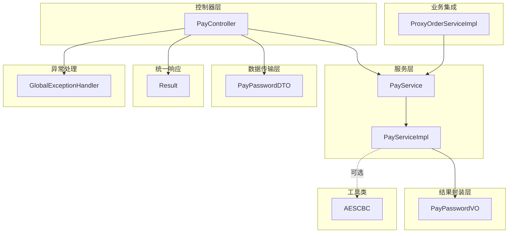
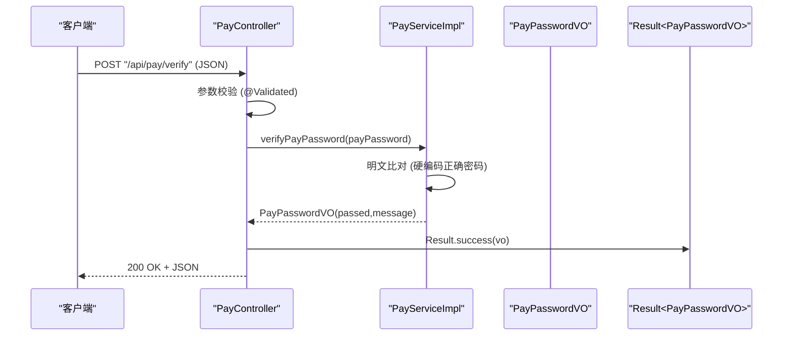
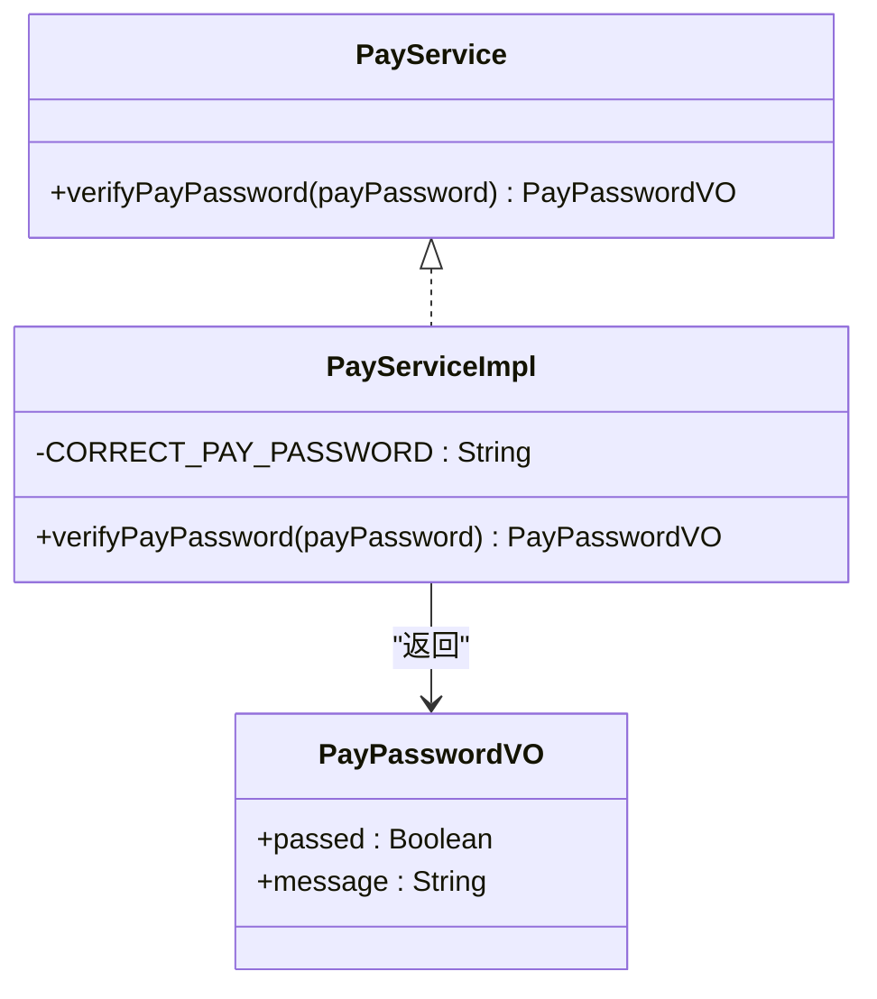
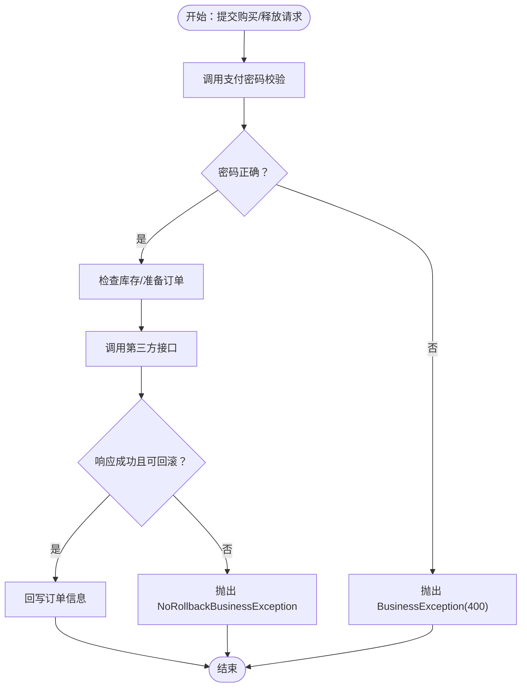
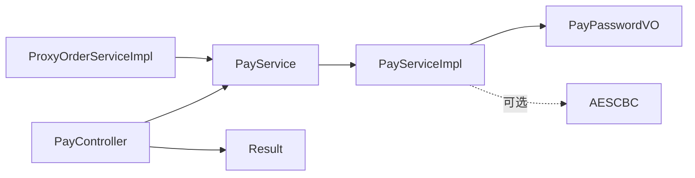

# 支付密码验证

<cite>
**本文引用的文件**
- [PayPasswordDTO.java](file://src/main/java/cn/linkfast/dto/PayPasswordDTO.java)
- [PayPasswordVO.java](file://src/main/java/cn/linkfast/vo/PayPasswordVO.java)
- [PayService.java](file://src/main/java/cn/linkfast/service/PayService.java)
- [PayServiceImpl.java](file://src/main/java/cn/linkfast/service/impl/PayServiceImpl.java)
- [PayController.java](file://src/main/java/cn/linkfast/controller/PayController.java)
- [Result.java](file://src/main/java/cn/linkfast/common/Result.java)
- [GlobalExceptionHandler.java](file://src/main/java/cn/linkfast/exception/GlobalExceptionHandler.java)
- [AESCBC.java](file://src/main/java/cn/linkfast/utils/AESCBC.java)
- [ProxyOrderService.java](file://src/main/java/cn/linkfast/service/ProxyOrderService.java)
- [ProxyOrderServiceImpl.java](file://src/main/java/cn/linkfast/service/impl/ProxyOrderServiceImpl.java)
- [ProxyOrder.java](file://src/main/java/cn/linkfast/entity/ProxyOrder.java)
- [ProxyOrderDAO.java](file://src/main/java/cn/linkfast/dao/ProxyOrderDAO.java)
- [验证支付密码接口.md](file://docs/api/internal/验证支付密码接口.md)
- [创建代理订单接口.md](file://docs/api/internal/创建代理订单接口.md)
- [释放代理实例接口.md](file://docs/api/internal/释放代理实例接口.md)
- [PayControllerIT.java](file://src/test/java/cn/linkfast/controller/PayControllerIT.java)
- [AESCBCTest.java](file://src/test/java/cn/linkfast/utils/AESCBCTest.java)
</cite>

## 目录
1. [简介](#简介)
2. [项目结构](#项目结构)
3. [核心组件](#核心组件)
4. [架构总览](#架构总览)
5. [详细组件分析](#详细组件分析)
6. [依赖分析](#依赖分析)
7. [性能考虑](#性能考虑)
8. [故障排查指南](#故障排查指南)
9. [结论](#结论)
10. [附录](#附录)

## 简介
本文件围绕“支付密码验证”功能进行系统化文档化，覆盖以下方面：
- 参数校验：PayPasswordDTO 的字段约束与校验规则
- 服务实现：PayService 接口与 PayServiceImpl 的验证逻辑
- 结果封装：PayPasswordVO 的返回结构与语义
- 安全机制：当前实现采用明文比对；同时介绍 AES-CBC 工具类以支撑后续加密改造
- 业务集成：在订单创建、续费、释放等关键流程中如何使用支付密码校验
- 事务管理：结合 @Transactional 与自定义异常，确保数据一致性
- 异常处理：全局异常处理器对参数校验与运行时异常的统一处理
- 配置与扩展：如何配置与自定义验证规则（如从配置中心或数据库加载正确密码）

## 项目结构
支付密码验证涉及的模块与文件分布如下：
- 控制器层：PayController 提供 /api/pay/verify 接口
- 服务层：PayService 定义接口，PayServiceImpl 实现验证逻辑
- 数据传输层：PayPasswordDTO 作为请求参数载体
- 结果封装层：PayPasswordVO 作为返回载体
- 统一响应：Result<T> 统一封装 HTTP 响应
- 全局异常：GlobalExceptionHandler 统一处理校验与运行时异常
- 工具类：AESCBC 提供 AES-CBC 加解密能力（为后续安全升级做准备）
- 业务集成：ProxyOrderServiceImpl 在购买、释放等流程中调用支付密码校验

图表来源
- [PayController.java:17-37](file://src/main/java/cn/linkfast/controller/PayController.java#L17-L37)
- [PayService.java:8-18](file://src/main/java/cn/linkfast/service/PayService.java#L8-L18)
- [PayServiceImpl.java:10-32](file://src/main/java/cn/linkfast/service/impl/PayServiceImpl.java#L10-L32)
- [PayPasswordDTO.java:12-24](file://src/main/java/cn/linkfast/dto/PayPasswordDTO.java#L12-L24)
- [PayPasswordVO.java:11-27](file://src/main/java/cn/linkfast/vo/PayPasswordVO.java#L11-L27)
- [Result.java:10-59](file://src/main/java/cn/linkfast/common/Result.java#L10-L59)
- [GlobalExceptionHandler.java:20-90](file://src/main/java/cn/linkfast/exception/GlobalExceptionHandler.java#L20-L90)
- [AESCBC.java:19-36](file://src/main/java/cn/linkfast/utils/AESCBC.java#L19-L36)
- [ProxyOrderServiceImpl.java:37-782](file://src/main/java/cn/linkfast/service/impl/ProxyOrderServiceImpl.java#L37-L782)

章节来源
- [PayController.java:17-37](file://src/main/java/cn/linkfast/controller/PayController.java#L17-L37)
- [PayService.java:8-18](file://src/main/java/cn/linkfast/service/PayService.java#L8-L18)
- [PayServiceImpl.java:10-32](file://src/main/java/cn/linkfast/service/impl/PayServiceImpl.java#L10-L32)
- [PayPasswordDTO.java:12-24](file://src/main/java/cn/linkfast/dto/PayPasswordDTO.java#L12-L24)
- [PayPasswordVO.java:11-27](file://src/main/java/cn/linkfast/vo/PayPasswordVO.java#L11-L27)
- [Result.java:10-59](file://src/main/java/cn/linkfast/common/Result.java#L10-L59)
- [GlobalExceptionHandler.java:20-90](file://src/main/java/cn/linkfast/exception/GlobalExceptionHandler.java#L20-L90)
- [AESCBC.java:19-36](file://src/main/java/cn/linkfast/utils/AESCBC.java#L19-L36)
- [ProxyOrderServiceImpl.java:37-782](file://src/main/java/cn/linkfast/service/impl/ProxyOrderServiceImpl.java#L37-L782)

## 核心组件
- 参数校验模型 PayPasswordDTO
  - 字段：payPassword（必填，非空校验）
  - 作用：接收前端传入的支付密码，经 Spring MVC 校验后进入服务层
- 服务接口与实现 PayService/PayServiceImpl
  - 接口：verifyPayPassword(String payPassword) → PayPasswordVO
  - 实现：当前版本硬编码正确密码，进行明文比对并返回通过/失败及提示信息
- 结果封装 PayPasswordVO
  - 字段：passed（布尔）、message（字符串）
  - 作用：标准化返回校验结果
- 控制器 PayController
  - 路径：/api/pay/verify
  - 方法：POST，接收 JSON，返回 Result<PayPasswordVO>
- 统一响应 Result<T>
  - 字段：code、message、data
  - 成功：code=200，message="success"
- 全局异常处理 GlobalExceptionHandler
  - 处理参数校验异常、业务异常、运行时异常，统一返回 Result<String> 或 Result<T>

章节来源
- [PayPasswordDTO.java:12-24](file://src/main/java/cn/linkfast/dto/PayPasswordDTO.java#L12-L24)
- [PayService.java:8-18](file://src/main/java/cn/linkfast/service/PayService.java#L8-L18)
- [PayServiceImpl.java:10-32](file://src/main/java/cn/linkfast/service/impl/PayServiceImpl.java#L10-L32)
- [PayPasswordVO.java:11-27](file://src/main/java/cn/linkfast/vo/PayPasswordVO.java#L11-L27)
- [PayController.java:17-37](file://src/main/java/cn/linkfast/controller/PayController.java#L17-L37)
- [Result.java:10-59](file://src/main/java/cn/linkfast/common/Result.java#L10-L59)
- [GlobalExceptionHandler.java:20-90](file://src/main/java/cn/linkfast/exception/GlobalExceptionHandler.java#L20-L90)

## 架构总览
支付密码验证在系统中的位置与交互如下：

图表来源
- [PayController.java:30-34](file://src/main/java/cn/linkfast/controller/PayController.java#L30-L34)
- [PayServiceImpl.java:18-29](file://src/main/java/cn/linkfast/service/impl/PayServiceImpl.java#L18-L29)
- [PayPasswordVO.java:11-27](file://src/main/java/cn/linkfast/vo/PayPasswordVO.java#L11-L27)
- [Result.java:28-35](file://src/main/java/cn/linkfast/common/Result.java#L28-L35)

章节来源
- [PayController.java:30-34](file://src/main/java/cn/linkfast/controller/PayController.java#L30-L34)
- [PayServiceImpl.java:18-29](file://src/main/java/cn/linkfast/service/impl/PayServiceImpl.java#L18-L29)
- [PayPasswordVO.java:11-27](file://src/main/java/cn/linkfast/vo/PayPasswordVO.java#L11-L27)
- [Result.java:28-35](file://src/main/java/cn/linkfast/common/Result.java#L28-L35)

## 详细组件分析

### 参数校验模型 PayPasswordDTO
- 字段定义与校验
  - payPassword：@NotBlank，确保非空
- 用途
  - 作为控制器方法参数的载体，配合 @Validated 触发校验
- 复杂度
  - 校验为 O(1)，内存占用极小

章节来源
- [PayPasswordDTO.java:12-24](file://src/main/java/cn/linkfast/dto/PayPasswordDTO.java#L12-L24)

### 服务接口与实现 PayService/PayServiceImpl
- 接口职责
  - verifyPayPassword(String payPassword)：对外暴露校验能力
- 实现策略
  - 当前版本：硬编码正确密码，进行字符串相等比较
  - 返回：构造 PayPasswordVO，设置 passed 与 message
- 安全性现状
  - 明文比对，未做哈希或加盐处理
  - 未引入随机盐或动态密钥，存在安全风险
- 可扩展性
  - 可替换为从配置中心或数据库加载正确密码
  - 可接入 AES-CBC 工具类进行加密/解密对比

图表来源
- [PayService.java:8-18](file://src/main/java/cn/linkfast/service/PayService.java#L8-L18)
- [PayServiceImpl.java:10-32](file://src/main/java/cn/linkfast/service/impl/PayServiceImpl.java#L10-L32)
- [PayPasswordVO.java:11-27](file://src/main/java/cn/linkfast/vo/PayPasswordVO.java#L11-L27)

章节来源
- [PayService.java:8-18](file://src/main/java/cn/linkfast/service/PayService.java#L8-L18)
- [PayServiceImpl.java:10-32](file://src/main/java/cn/linkfast/service/impl/PayServiceImpl.java#L10-L32)
- [PayPasswordVO.java:11-27](file://src/main/java/cn/linkfast/vo/PayPasswordVO.java#L11-L27)

### 结果封装 PayPasswordVO
- 字段
  - passed：校验是否通过（true/false）
  - message：提示信息（例如“支付密码正确/错误”）
- 用途
  - 作为服务层返回值，被控制器包装为 Result<PayPasswordVO>

章节来源
- [PayPasswordVO.java:11-27](file://src/main/java/cn/linkfast/vo/PayPasswordVO.java#L11-L27)

### 控制器 PayController
- 路径与方法
  - POST /api/pay/verify
  - 参数：@RequestBody @Validated PayPasswordDTO
  - 返回：Result<PayPasswordVO>
- 校验链路
  - DTO 层：@NotBlank
  - 控制器层：@Validated
  - 服务层：业务校验（明文比对）
- 统一响应
  - 使用 Result.success(vo) 返回标准结构

章节来源
- [PayController.java:17-37](file://src/main/java/cn/linkfast/controller/PayController.java#L17-L37)
- [Result.java:28-35](file://src/main/java/cn/linkfast/common/Result.java#L28-L35)

### 安全机制与加密工具
- 当前实现
  - 明文比对，未使用加密算法
- 加密工具 AESCBC
  - 提供 AES/CBC/PKCS5Padding 的加解密方法
  - 可用于后续将“正确密码”与“用户输入”进行加密后比对
- 建议
  - 将正确密码以密文形式存储
  - 输入密码同样进行加密处理后比对
  - 使用随机 IV 与固定密钥（或从配置中心加载）

章节来源
- [AESCBC.java:19-36](file://src/main/java/cn/linkfast/utils/AESCBC.java#L19-L36)

### 业务集成：在订单流程中的应用
- 购买代理（ProxyOrderServiceImpl.purchaseProxies）
  - 步骤：校验支付密码 → 校验库存 → 生成订单 → 调用第三方接口 → 回写订单
  - 若密码错误，抛出 BusinessException(code=400)
- 释放代理（ProxyOrderServiceImpl.releaseProxies）
  - 步骤：校验支付密码 → 生成释放订单 → 调用第三方接口 → 回写订单
  - 若密码错误，抛出 BusinessException(code=400)
- 续费代理（renewProxies）
  - 该流程未直接使用支付密码校验（当前版本）

图表来源
- [ProxyOrderServiceImpl.java:196-458](file://src/main/java/cn/linkfast/service/impl/ProxyOrderServiceImpl.java#L196-L458)
- [ProxyOrderServiceImpl.java:637-779](file://src/main/java/cn/linkfast/service/impl/ProxyOrderServiceImpl.java#L637-L779)

章节来源
- [ProxyOrderServiceImpl.java:196-458](file://src/main/java/cn/linkfast/service/impl/ProxyOrderServiceImpl.java#L196-L458)
- [ProxyOrderServiceImpl.java:637-779](file://src/main/java/cn/linkfast/service/impl/ProxyOrderServiceImpl.java#L637-L779)

### 事务管理与数据一致性
- 购买/释放流程使用 @Transactional
  - rollbackFor = Exception.class：默认异常触发回滚
  - noRollbackFor = NoRollbackBusinessException.class：特定业务异常不回滚
- 第三方接口调用的容错策略
  - 连接失败（未收到请求）：可安全重试并回滚
  - 请求已发送但响应读取失败：不可回滚，抛出 NoRollbackBusinessException
  - 响应非法/数据缺失：不可回滚，抛出 NoRollbackBusinessException
- 支付密码错误：直接抛出 BusinessException(400)，不涉及第三方调用，可安全回滚

章节来源
- [ProxyOrderServiceImpl.java:42-52](file://src/main/java/cn/linkfast/service/impl/ProxyOrderServiceImpl.java#L42-L52)
- [ProxyOrderServiceImpl.java:340-451](file://src/main/java/cn/linkfast/service/impl/ProxyOrderServiceImpl.java#L340-L451)
- [ProxyOrderServiceImpl.java:674-778](file://src/main/java/cn/linkfast/service/impl/ProxyOrderServiceImpl.java#L674-L778)

### 异常处理与统一响应
- 全局异常处理器
  - 参数校验异常：统一返回 Result.error(400, "参数校验失败: ...")
  - 业务异常 BusinessException：返回 Result.error(e.getCode(), e.getMessage())
  - 运行时异常：返回 Result.error(500, "系统繁忙，请稍后再试")
- 支付密码接口
  - 参数校验失败：返回 400
  - 业务异常（密码错误）：返回 400
  - 服务器异常：返回 500

章节来源
- [GlobalExceptionHandler.java:20-90](file://src/main/java/cn/linkfast/exception/GlobalExceptionHandler.java#L20-L90)
- [Result.java:37-44](file://src/main/java/cn/linkfast/common/Result.java#L37-L44)

## 依赖分析
- 控制器依赖服务：PayController 依赖 PayService
- 服务实现依赖接口：PayServiceImpl 实现 PayService
- 结果封装依赖：PayServiceImpl 返回 PayPasswordVO，控制器包装为 Result<PayPasswordVO>
- 业务集成依赖：ProxyOrderServiceImpl 依赖 PayService 进行密码校验
- 工具类依赖：AESCBC 为可选依赖，用于后续加密改造

图表来源
- [PayController.java:22-34](file://src/main/java/cn/linkfast/controller/PayController.java#L22-L34)
- [PayService.java:8-18](file://src/main/java/cn/linkfast/service/PayService.java#L8-L18)
- [PayServiceImpl.java:10-32](file://src/main/java/cn/linkfast/service/impl/PayServiceImpl.java#L10-L32)
- [PayPasswordVO.java:11-27](file://src/main/java/cn/linkfast/vo/PayPasswordVO.java#L11-L27)
- [Result.java:10-59](file://src/main/java/cn/linkfast/common/Result.java#L10-L59)
- [ProxyOrderServiceImpl.java:37-782](file://src/main/java/cn/linkfast/service/impl/ProxyOrderServiceImpl.java#L37-L782)
- [AESCBC.java:19-36](file://src/main/java/cn/linkfast/utils/AESCBC.java#L19-L36)

章节来源
- [PayController.java:22-34](file://src/main/java/cn/linkfast/controller/PayController.java#L22-L34)
- [PayService.java:8-18](file://src/main/java/cn/linkfast/service/PayService.java#L8-L18)
- [PayServiceImpl.java:10-32](file://src/main/java/cn/linkfast/service/impl/PayServiceImpl.java#L10-L32)
- [PayPasswordVO.java:11-27](file://src/main/java/cn/linkfast/vo/PayPasswordVO.java#L11-L27)
- [Result.java:10-59](file://src/main/java/cn/linkfast/common/Result.java#L10-L59)
- [ProxyOrderServiceImpl.java:37-782](file://src/main/java/cn/linkfast/service/impl/ProxyOrderServiceImpl.java#L37-L782)
- [AESCBC.java:19-36](file://src/main/java/cn/linkfast/utils/AESCBC.java#L19-L36)

## 性能考虑
- 支付密码校验为 O(1) 比较，开销极低
- DTO 校验与控制器绑定，避免无效请求进入服务层
- 业务流程中的第三方调用采用重试与不可回滚场景分离，减少不必要的回滚成本
- 建议
  - 将正确密码改为密文存储，避免明文泄露
  - 使用缓存（如 Redis）短期缓存正确密码，降低数据库/配置中心访问频率
  - 对频繁调用的接口增加限流与防刷策略

## 故障排查指南
- 参数校验失败
  - 现象：返回 400，message 包含具体字段错误
  - 排查：确认 payPassword 是否为空或格式不符
- 支付密码错误
  - 现象：返回 200，data.passed=false，message="支付密码错误"
  - 排查：确认输入密码与硬编码正确密码一致
- 服务器异常
  - 现象：返回 500，message="系统繁忙，请稍后再试"
  - 排查：查看日志，定位异常栈；关注第三方接口调用与解密过程
- 集成测试参考
  - 错误密码测试：期望 data.passed=false
  - 正确密码测试：期望 data.passed=true

章节来源
- [GlobalExceptionHandler.java:68-88](file://src/main/java/cn/linkfast/exception/GlobalExceptionHandler.java#L68-L88)
- [验证支付密码接口.md:63-85](file://docs/api/internal/验证支付密码接口.md#L63-L85)
- [PayControllerIT.java:52-86](file://src/test/java/cn/linkfast/controller/PayControllerIT.java#L52-L86)

## 结论
- 当前支付密码验证采用明文比对，简单可靠但安全性有限
- 通过 AESCBC 工具类可平滑过渡到加密比对方案
- 在购买与释放等关键业务流程中，支付密码校验前置，结合事务与不可回滚异常，保障数据一致性
- 建议尽快引入加密存储与传输、缓存与限流等安全与性能措施

## 附录

### 接口文档要点
- 接口路径：/api/pay/verify
- 请求体：PayPasswordDTO.payPassword（必填）
- 成功响应：Result.success(PayPasswordVO)
- 错误响应：参数校验失败（400）、业务异常（400）、服务器异常（500）

章节来源
- [验证支付密码接口.md:1-85](file://docs/api/internal/验证支付密码接口.md#L1-L85)

### 业务流程中的支付密码使用
- 创建代理订单：需支付密码校验通过后方可继续
- 释放代理实例：需支付密码校验通过后方可继续
- 续费代理实例：当前版本未使用支付密码校验

章节来源
- [创建代理订单接口.md:1-125](file://docs/api/internal/创建代理订单接口.md#L1-L125)
- [释放代理实例接口.md:1-60](file://docs/api/internal/释放代理实例接口.md#L1-L60)
- [ProxyOrderServiceImpl.java:196-458](file://src/main/java/cn/linkfast/service/impl/ProxyOrderServiceImpl.java#L196-L458)
- [ProxyOrderServiceImpl.java:637-779](file://src/main/java/cn/linkfast/service/impl/ProxyOrderServiceImpl.java#L637-L779)

### 配置选项与自定义验证规则
- 正确密码来源
  - 当前：硬编码于 PayServiceImpl
  - 建议：从配置中心或数据库加载，支持热更新
- 校验规则扩展
  - 支持长度、字符集、复杂度等规则
  - 可引入密码强度评估与历史密码比对
- 加密改造
  - 使用 AESCBC 对正确密码与输入密码进行加密后比对
  - 使用随机 IV 与固定密钥（或轮换密钥）

章节来源
- [PayServiceImpl.java:14-16](file://src/main/java/cn/linkfast/service/impl/PayServiceImpl.java#L14-L16)
- [AESCBC.java:19-36](file://src/main/java/cn/linkfast/utils/AESCBC.java#L19-L36)