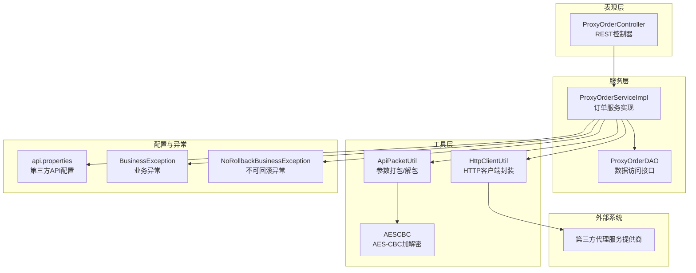
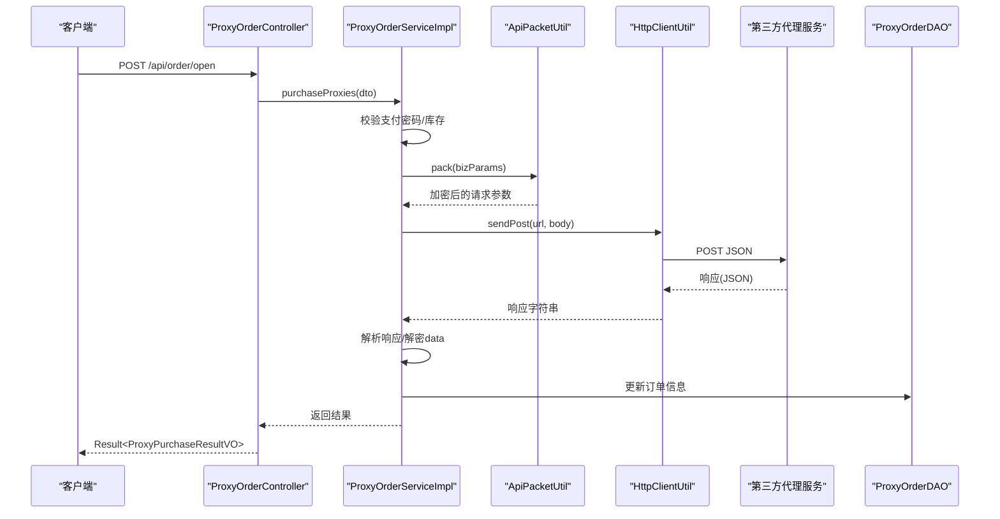
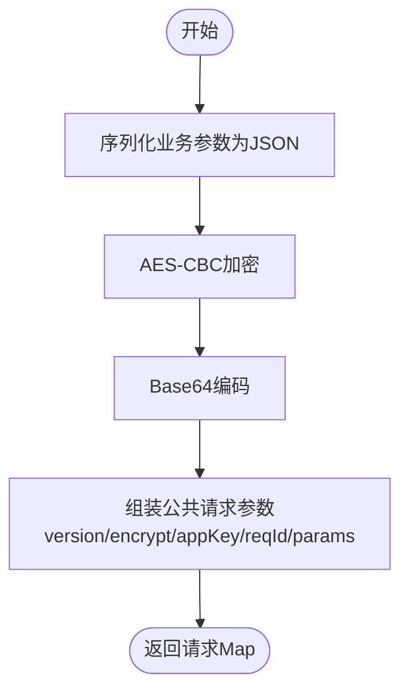
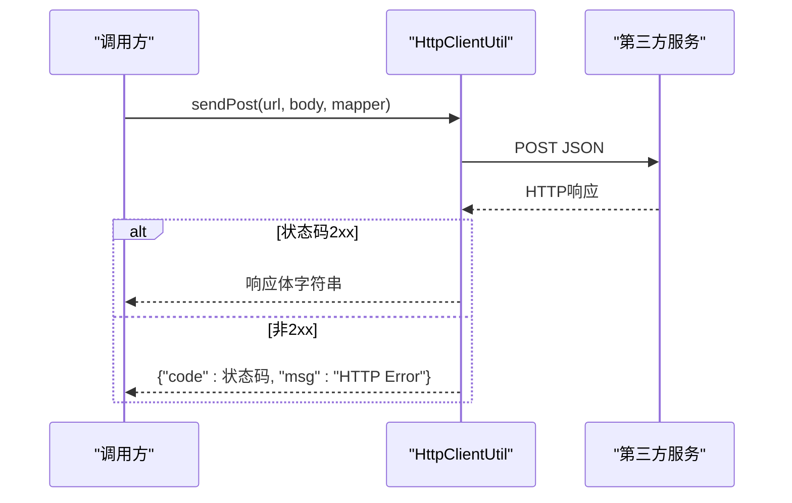
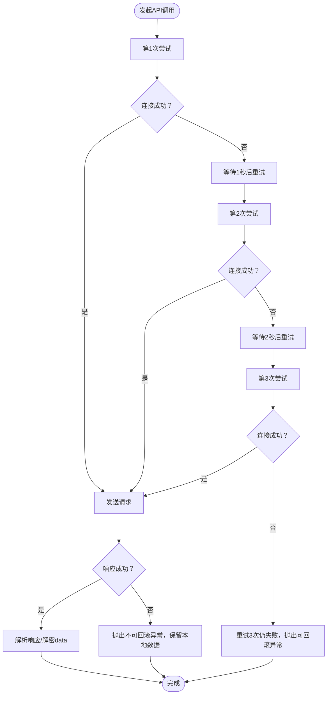
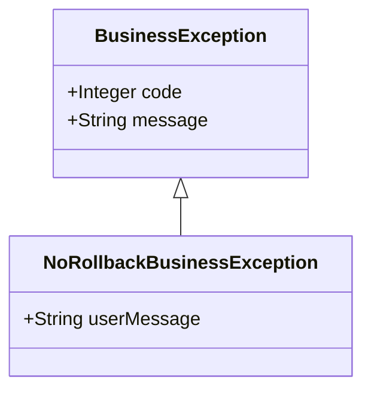
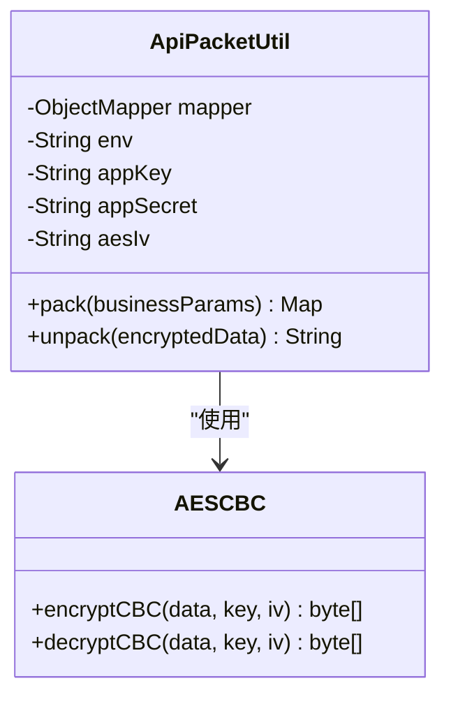
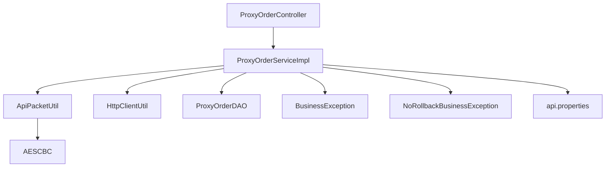

# 第三方API集成

<cite>
**本文档引用的文件**
- [ApiPacketUtil.java](file://src/main/java/cn/linkfast/utils/ApiPacketUtil.java)
- [HttpClientUtil.java](file://src/main/java/cn/linkfast/utils/HttpClientUtil.java)
- [AESCBC.java](file://src/main/java/cn/linkfast/utils/AESCBC.java)
- [ProxyOrderServiceImpl.java](file://src/main/java/cn/linkfast/service/impl/ProxyOrderServiceImpl.java)
- [ProxyOrderController.java](file://src/main/java/cn/linkfast/controller/ProxyOrderController.java)
- [api.properties](file://src/main/resources/api.properties)
- [NoRollbackBusinessException.java](file://src/main/java/cn/linkfast/exception/NoRollbackBusinessException.java)
- [BusinessException.java](file://src/main/java/cn/linkfast/exception/BusinessException.java)
- [ProxyOrderDAO.java](file://src/main/java/cn/linkfast/dao/ProxyOrderDAO.java)
- [logback.xml](file://src/main/resources/logback.xml)
- [创建代理订单接口-第三方.md](file://docs/api/third-party/创建代理订单接口-第三方.md)
</cite>

## 目录
1. [简介](#简介)
2. [项目结构](#项目结构)
3. [核心组件](#核心组件)
4. [架构概览](#架构概览)
5. [详细组件分析](#详细组件分析)
6. [依赖分析](#依赖分析)
7. [性能考虑](#性能考虑)
8. [故障排查指南](#故障排查指南)
9. [结论](#结论)
10. [附录](#附录)

## 简介
本文档详细阐述了系统与第三方代理服务提供商的API集成方案。重点解释了以下关键能力：
- ApiPacketUtil的参数加密打包机制
- HttpClientUtil的HTTP请求处理与响应解析
- API调用的重试策略设计（连接失败重试、响应异常处理、幂等性保证）
- 加密通信的安全机制（AES-CBC加密、数据完整性校验）
- 异常分类处理（可回滚与不可回滚场景）
- 监控指标、日志记录与故障排查方法

## 项目结构
系统采用分层架构，围绕代理订单管理的核心业务展开，第三方API集成位于服务层与工具层之间，形成清晰的职责边界。

**图表来源**
- [ProxyOrderController.java:1-88](file://src/main/java/cn/linkfast/controller/ProxyOrderController.java#L1-L88)
- [ProxyOrderServiceImpl.java:1-782](file://src/main/java/cn/linkfast/service/impl/ProxyOrderServiceImpl.java#L1-L782)
- [ApiPacketUtil.java:1-106](file://src/main/java/cn/linkfast/utils/ApiPacketUtil.java#L1-L106)
- [HttpClientUtil.java:1-46](file://src/main/java/cn/linkfast/utils/HttpClientUtil.java#L1-L46)
- [AESCBC.java:1-36](file://src/main/java/cn/linkfast/utils/AESCBC.java#L1-L36)
- [api.properties:1-31](file://src/main/resources/api.properties#L1-L31)
- [BusinessException.java:1-36](file://src/main/java/cn/linkfast/exception/BusinessException.java#L1-L36)
- [NoRollbackBusinessException.java:1-27](file://src/main/java/cn/linkfast/exception/NoRollbackBusinessException.java#L1-L27)

**章节来源**
- [ProxyOrderController.java:1-88](file://src/main/java/cn/linkfast/controller/ProxyOrderController.java#L1-L88)
- [ProxyOrderServiceImpl.java:1-782](file://src/main/java/cn/linkfast/service/impl/ProxyOrderServiceImpl.java#L1-L782)
- [api.properties:1-31](file://src/main/resources/api.properties#L1-L31)

## 核心组件
本节深入分析第三方API集成的关键组件，包括参数打包、HTTP通信、加解密与异常处理。

- **ApiPacketUtil**：负责将业务参数序列化为JSON，进行AES-CBC加密，Base64编码，并组装公共请求参数（版本、加密方式、appKey、reqId等）。同时提供响应数据解包功能，确保数据完整性与机密性。
- **HttpClientUtil**：基于Apache HttpClient 5封装POST请求，统一处理HTTP状态码与响应体解析，返回标准JSON字符串供上层业务解析。
- **AESCBC**：提供AES-CBC模式的加解密实现，使用PKCS5Padding填充，密钥与IV来源于第三方配置。
- **ProxyOrderServiceImpl**：核心业务实现，包含订单同步、创建、续费、释放等操作，内置重试策略与异常分类处理，确保幂等性与一致性。
- **ProxyOrderController**：对外暴露REST接口，调用服务层完成业务处理，统一返回Result包装结果。
- **api.properties**：集中管理第三方API的环境配置（沙盒/生产）、基础URL、接口路径与密钥信息。
- **异常体系**：BusinessException用于可回滚的业务异常；NoRollbackBusinessException用于不可回滚场景，配合事务配置避免误回滚本地数据。

**章节来源**
- [ApiPacketUtil.java:14-106](file://src/main/java/cn/linkfast/utils/ApiPacketUtil.java#L14-L106)
- [HttpClientUtil.java:15-46](file://src/main/java/cn/linkfast/utils/HttpClientUtil.java#L15-L46)
- [AESCBC.java:13-36](file://src/main/java/cn/linkfast/utils/AESCBC.java#L13-L36)
- [ProxyOrderServiceImpl.java:34-782](file://src/main/java/cn/linkfast/service/impl/ProxyOrderServiceImpl.java#L34-L782)
- [ProxyOrderController.java:17-88](file://src/main/java/cn/linkfast/controller/ProxyOrderController.java#L17-L88)
- [api.properties:1-31](file://src/main/resources/api.properties#L1-L31)
- [BusinessException.java:1-36](file://src/main/java/cn/linkfast/exception/BusinessException.java#L1-L36)
- [NoRollbackBusinessException.java:1-27](file://src/main/java/cn/linkfast/exception/NoRollbackBusinessException.java#L1-L27)

## 架构概览
系统通过控制器接收请求，服务层协调工具层完成参数打包与HTTP通信，DAO层持久化业务数据。异常分类确保在不同场景下正确回滚或保留本地数据。

**图表来源**
- [ProxyOrderController.java:42-45](file://src/main/java/cn/linkfast/controller/ProxyOrderController.java#L42-L45)
- [ProxyOrderServiceImpl.java:198-458](file://src/main/java/cn/linkfast/service/impl/ProxyOrderServiceImpl.java#L198-L458)
- [ApiPacketUtil.java:58-92](file://src/main/java/cn/linkfast/utils/ApiPacketUtil.java#L58-L92)
- [HttpClientUtil.java:27-44](file://src/main/java/cn/linkfast/utils/HttpClientUtil.java#L27-L44)
- [ProxyOrderDAO.java:37-48](file://src/main/java/cn/linkfast/dao/ProxyOrderDAO.java#L37-L48)

## 详细组件分析

### 参数加密打包（ApiPacketUtil）
- **职责**：将业务参数序列化为JSON，使用AES-CBC加密，Base64编码，并附加公共请求头（版本、加密方式、appKey、reqId）。
- **环境选择**：根据api.properties中的env选择沙盒或生产密钥与IV。
- **IV生成**：从appSecret取前16字符作为IV，确保与第三方约定一致。
- **解包机制**：对响应中的data字段进行Base64解码与AES-CBC解密，返回明文JSON供业务解析。

**图表来源**
- [ApiPacketUtil.java:58-92](file://src/main/java/cn/linkfast/utils/ApiPacketUtil.java#L58-L92)

**章节来源**
- [ApiPacketUtil.java:14-106](file://src/main/java/cn/linkfast/utils/ApiPacketUtil.java#L14-L106)
- [AESCBC.java:19-30](file://src/main/java/cn/linkfast/utils/AESCBC.java#L19-L30)

### HTTP请求处理与响应解析（HttpClientUtil）
- **职责**：封装POST请求，统一处理HTTP状态码，返回包含状态码的JSON字符串以便上层按业务code解析。
- **错误处理**：非2xx状态码返回包含状态码的JSON，便于业务侧识别网络层错误。

**图表来源**
- [HttpClientUtil.java:27-44](file://src/main/java/cn/linkfast/utils/HttpClientUtil.java#L27-L44)

**章节来源**
- [HttpClientUtil.java:15-46](file://src/main/java/cn/linkfast/utils/HttpClientUtil.java#L15-L46)

### API调用重试策略与幂等性保证
服务层针对不同场景设计了重试与异常处理策略，确保在连接失败、响应异常等情况下维持数据一致性与幂等性。

**图表来源**
- [ProxyOrderServiceImpl.java:343-373](file://src/main/java/cn/linkfast/service/impl/ProxyOrderServiceImpl.java#L343-L373)
- [ProxyOrderServiceImpl.java:521-550](file://src/main/java/cn/linkfast/service/impl/ProxyOrderServiceImpl.java#L521-L550)
- [ProxyOrderServiceImpl.java:679-704](file://src/main/java/cn/linkfast/service/impl/ProxyOrderServiceImpl.java#L679-L704)

**章节来源**
- [ProxyOrderServiceImpl.java:338-458](file://src/main/java/cn/linkfast/service/impl/ProxyOrderServiceImpl.java#L338-L458)
- [ProxyOrderServiceImpl.java:515-635](file://src/main/java/cn/linkfast/service/impl/ProxyOrderServiceImpl.java#L515-L635)
- [ProxyOrderServiceImpl.java:674-779](file://src/main/java/cn/linkfast/service/impl/ProxyOrderServiceImpl.java#L674-L779)

### 异常分类处理（可回滚 vs 不可回滚）
- **可回滚场景**：连接建立失败（ConnectException/UnknownHostException）且响应未到达第三方，或第三方返回非200业务码，或响应JSON非法等。此类异常抛出BusinessException，配合@Transactional自动回滚本地数据。
- **不可回滚场景**：请求已发送至第三方但响应读取失败、响应为空、data节点缺失或为空、解密失败、解析失败等。此类异常抛出NoRollbackBusinessException，配合noRollbackFor配置避免本地数据被回滚。

**图表来源**
- [BusinessException.java:6-36](file://src/main/java/cn/linkfast/exception/BusinessException.java#L6-L36)
- [NoRollbackBusinessException.java:12-27](file://src/main/java/cn/linkfast/exception/NoRollbackBusinessException.java#L12-L27)

**章节来源**
- [ProxyOrderServiceImpl.java:351-373](file://src/main/java/cn/linkfast/service/impl/ProxyOrderServiceImpl.java#L351-L373)
- [ProxyOrderServiceImpl.java:393-406](file://src/main/java/cn/linkfast/service/impl/ProxyOrderServiceImpl.java#L393-L406)
- [ProxyOrderServiceImpl.java:529-550](file://src/main/java/cn/linkfast/service/impl/ProxyOrderServiceImpl.java#L529-L550)
- [ProxyOrderServiceImpl.java:570-583](file://src/main/java/cn/linkfast/service/impl/ProxyOrderServiceImpl.java#L570-L583)
- [ProxyOrderServiceImpl.java:686-704](file://src/main/java/cn/linkfast/service/impl/ProxyOrderServiceImpl.java#L686-L704)
- [ProxyOrderServiceImpl.java:719-735](file://src/main/java/cn/linkfast/service/impl/ProxyOrderServiceImpl.java#L719-L735)

### 加密通信与数据完整性校验
- **AES-CBC加密**：使用AES/CBC/PKCS5Padding模式，密钥来自第三方配置，IV取密钥前16字符，确保与第三方约定一致。
- **Base64编码**：对加密后的字节数组进行Base64编码，便于在网络传输中安全传递。
- **数据完整性校验**：通过解密与JSON解析双重校验，确保响应数据未被篡改且格式正确。

**图表来源**
- [ApiPacketUtil.java:24-53](file://src/main/java/cn/linkfast/utils/ApiPacketUtil.java#L24-L53)
- [AESCBC.java:20-30](file://src/main/java/cn/linkfast/utils/AESCBC.java#L20-L30)

**章节来源**
- [ApiPacketUtil.java:58-106](file://src/main/java/cn/linkfast/utils/ApiPacketUtil.java#L58-L106)
- [AESCBC.java:19-36](file://src/main/java/cn/linkfast/utils/AESCBC.java#L19-L36)

### API集成监控指标与日志记录
- **日志配置**：使用Logback将业务日志输出到独立文件（linkfast-business.log），并按日期滚动，便于问题定位与审计。
- **关键日志点**：请求URL、请求参数、原始响应、解密成功、异常信息等均记录详细日志，支持快速追踪问题。
- **建议监控指标**：
  - API调用成功率（2xx/非2xx）
  - 响应时间分布（P50/P95/P99）
  - 重试次数统计
  - 异常类型分布（连接失败、业务失败、解密失败等）
  - 第三方接口耗时与错误率

**章节来源**
- [logback.xml:6-47](file://src/main/resources/logback.xml#L6-L47)
- [ProxyOrderServiceImpl.java:100-101](file://src/main/java/cn/linkfast/service/impl/ProxyOrderServiceImpl.java#L100-L101)
- [ProxyOrderServiceImpl.java:348-349](file://src/main/java/cn/linkfast/service/impl/ProxyOrderServiceImpl.java#L348-L349)

## 依赖分析
第三方API集成涉及的依赖关系如下：

**图表来源**
- [ProxyOrderController.java:25-26](file://src/main/java/cn/linkfast/controller/ProxyOrderController.java#L25-L26)
- [ProxyOrderServiceImpl.java:41-45](file://src/main/java/cn/linkfast/service/impl/ProxyOrderServiceImpl.java#L41-L45)
- [ApiPacketUtil.java:18-36](file://src/main/java/cn/linkfast/utils/ApiPacketUtil.java#L18-L36)
- [HttpClientUtil.java:18-22](file://src/main/java/cn/linkfast/utils/HttpClientUtil.java#L18-L22)
- [ProxyOrderDAO.java:10-102](file://src/main/java/cn/linkfast/dao/ProxyOrderDAO.java#L10-L102)
- [BusinessException.java:6-36](file://src/main/java/cn/linkfast/exception/BusinessException.java#L6-L36)
- [NoRollbackBusinessException.java:12-27](file://src/main/java/cn/linkfast/exception/NoRollbackBusinessException.java#L12-L27)
- [api.properties:1-31](file://src/main/resources/api.properties#L1-L31)

**章节来源**
- [ProxyOrderServiceImpl.java:1-782](file://src/main/java/cn/linkfast/service/impl/ProxyOrderServiceImpl.java#L1-L782)

## 性能考虑
- **重试退避策略**：采用线性退避（1秒、2秒、3秒），减少对第三方服务的压力峰值。
- **异步库存更新**：在下单流程中对产品库存信息进行异步更新，避免阻塞主线程。
- **连接池与超时**：建议在HttpClientUtil中引入连接池与合理超时配置，提升吞吐量与稳定性。
- **批量操作优化**：对于续费与释放等批量操作，尽量合并请求参数，减少网络往返。

## 故障排查指南
- **连接失败（ConnectException/UnknownHostException）**：
  - 检查网络连通性与DNS解析
  - 确认api.properties中的环境配置（prod/sandbox）与URL正确
  - 查看日志中重试记录，确认是否达到最大重试次数
- **响应读取失败**：
  - 检查第三方服务健康状态
  - 关注不可回滚异常日志，避免本地数据被回滚
- **业务失败（code!=200）**：
  - 查看响应中的错误码与消息，确认业务参数合法性
- **解密失败或JSON解析异常**：
  - 确认密钥与IV配置一致
  - 检查响应data字段是否存在且非空
- **幂等性问题**：
  - 确保appOrderNo唯一且幂等检查逻辑正确
  - 参考第三方接口文档关于幂等性的约束

**章节来源**
- [ProxyOrderServiceImpl.java:351-373](file://src/main/java/cn/linkfast/service/impl/ProxyOrderServiceImpl.java#L351-L373)
- [ProxyOrderServiceImpl.java:393-406](file://src/main/java/cn/linkfast/service/impl/ProxyOrderServiceImpl.java#L393-L406)
- [ProxyOrderServiceImpl.java:413-420](file://src/main/java/cn/linkfast/service/impl/ProxyOrderServiceImpl.java#L413-L420)
- [ProxyOrderServiceImpl.java:529-550](file://src/main/java/cn/linkfast/service/impl/ProxyOrderServiceImpl.java#L529-L550)
- [ProxyOrderServiceImpl.java:570-583](file://src/main/java/cn/linkfast/service/impl/ProxyOrderServiceImpl.java#L570-L583)
- [ProxyOrderServiceImpl.java:590-597](file://src/main/java/cn/linkfast/service/impl/ProxyOrderServiceImpl.java#L590-L597)
- [ProxyOrderServiceImpl.java:686-704](file://src/main/java/cn/linkfast/service/impl/ProxyOrderServiceImpl.java#L686-L704)
- [ProxyOrderServiceImpl.java:719-735](file://src/main/java/cn/linkfast/service/impl/ProxyOrderServiceImpl.java#L719-L735)
- [ProxyOrderServiceImpl.java:737-743](file://src/main/java/cn/linkfast/service/impl/ProxyOrderServiceImpl.java#L737-L743)

## 结论
本集成方案通过参数加密打包、HTTP通信封装、完善的重试与异常分类处理，以及明确的幂等性设计，有效保障了与第三方代理服务提供商的稳定交互。配合标准化的日志与监控指标，能够快速定位问题并持续优化性能与可靠性。

## 附录
- **第三方接口文档参考**：[创建代理订单接口-第三方.md](file://docs/api/third-party/创建代理订单接口-第三方.md)
- **配置文件**：[api.properties:1-31](file://src/main/resources/api.properties#L1-L31)
- **测试用例**：[test-api.http:1-3](file://test-api.http#L1-L3)