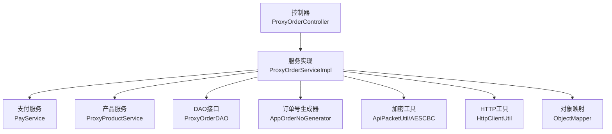
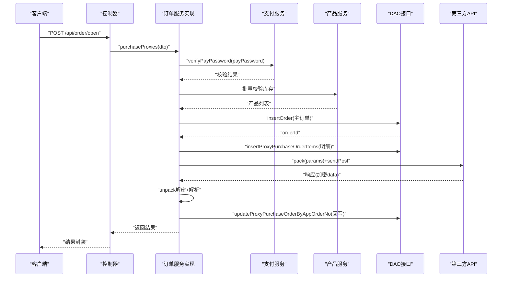
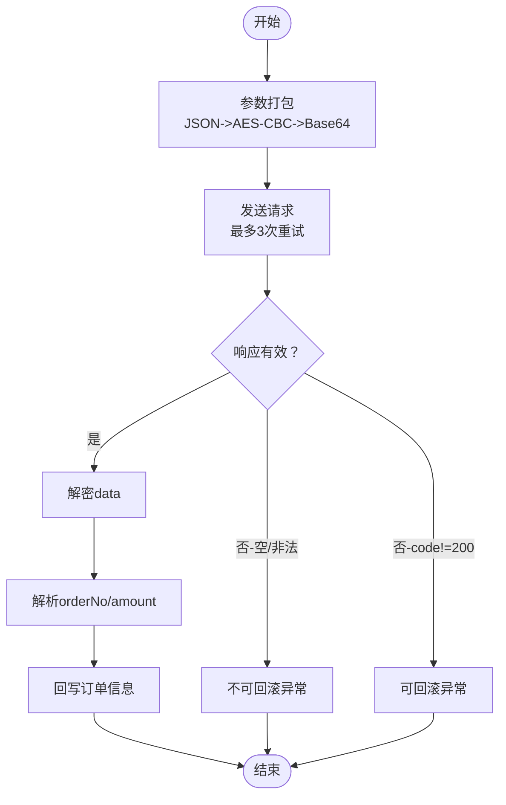
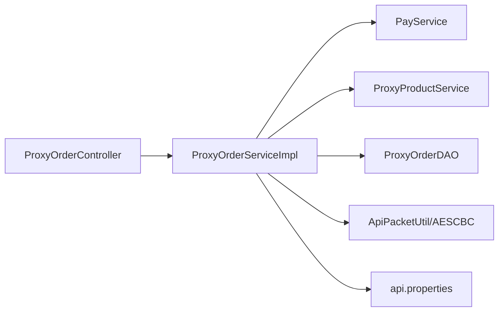

# 订单创建管理

<cite>
**本文引用的文件**
- [ProxyOrderServiceImpl.java](file://src/main/java/cn/linkfast/service/impl/ProxyOrderServiceImpl.java)
- [ProxyOrderController.java](file://src/main/java/cn/linkfast/controller/ProxyOrderController.java)
- [ProxyPurchaseDTO.java](file://src/main/java/cn/linkfast/dto/ProxyPurchaseDTO.java)
- [ProxyPurchaseItemDTO.java](file://src/main/java/cn/linkfast/dto/ProxyPurchaseItemDTO.java)
- [ProxyOrder.java](file://src/main/java/cn/linkfast/entity/ProxyOrder.java)
- [ProxyPurchaseOrderItem.java](file://src/main/java/cn/linkfast/entity/ProxyPurchaseOrderItem.java)
- [ProxyOrderDAO.java](file://src/main/java/cn/linkfast/dao/ProxyOrderDAO.java)
- [ApiPacketUtil.java](file://src/main/java/cn/linkfast/utils/ApiPacketUtil.java)
- [AESCBC.java](file://src/main/java/cn/linkfast/utils/AESCBC.java)
- [AppOrderNoGenerator.java](file://src/main/java/cn/linkfast/utils/AppOrderNoGenerator.java)
- [NoRollbackBusinessException.java](file://src/main/java/cn/linkfast/exception/NoRollbackBusinessException.java)
- [api.properties](file://src/main/resources/api.properties)
- [创建代理订单接口-第三方.md](file://docs/api/third-party/创建代理订单接口-第三方.md)
- [创建代理订单接口.md](file://docs/api/internal/创建代理订单接口.md)
- [ProxyOrderIT.java](file://src/test/java/cn/linkfast/service/Impl/ProxyOrderIT.java)
</cite>

## 目录
1. [简介](#简介)
2. [项目结构](#项目结构)
3. [核心组件](#核心组件)
4. [架构总览](#架构总览)
5. [详细组件分析](#详细组件分析)
6. [依赖分析](#依赖分析)
7. [性能考虑](#性能考虑)
8. [故障排查指南](#故障排查指南)
9. [结论](#结论)
10. [附录](#附录)

## 简介
本文档围绕“代理购买订单”的完整创建流程进行系统化说明，覆盖支付密码验证、库存检查、订单持久化、ProxyPurchaseDTO到数据库实体的转换、订单明细的批量插入、第三方API加密通信与重试机制、订单状态管理策略、异常处理与回滚控制，以及扩展点与自定义业务规则的实现指导。目标读者包括后端开发者、测试工程师与运维人员。

## 项目结构
- 控制器层：对外暴露订单相关接口，负责参数接收与结果封装。
- 服务层：实现订单创建、续费、释放等核心业务逻辑，协调支付密码校验、库存检查、第三方API调用与数据库持久化。
- DAO层：抽象数据库访问接口，提供订单主表与明细表的插入与更新能力。
- 工具层：提供加密通信、订单号生成、HTTP请求封装等支撑能力。
- 文档与配置：提供第三方接口规范、内部接口文档与运行环境配置。

图表来源
- [ProxyOrderController.java:1-88](file://src/main/java/cn/linkfast/controller/ProxyOrderController.java#L1-L88)
- [ProxyOrderServiceImpl.java:1-782](file://src/main/java/cn/linkfast/service/impl/ProxyOrderServiceImpl.java#L1-L782)
- [ProxyOrderDAO.java:1-102](file://src/main/java/cn/linkfast/dao/ProxyOrderDAO.java#L1-L102)
- [ApiPacketUtil.java:1-106](file://src/main/java/cn/linkfast/utils/ApiPacketUtil.java#L1-L106)
- [AESCBC.java:1-36](file://src/main/java/cn/linkfast/utils/AESCBC.java#L1-L36)
- [AppOrderNoGenerator.java:1-45](file://src/main/java/cn/linkfast/utils/AppOrderNoGenerator.java#L1-L45)

章节来源
- [ProxyOrderController.java:1-88](file://src/main/java/cn/linkfast/controller/ProxyOrderController.java#L1-L88)
- [ProxyOrderServiceImpl.java:1-782](file://src/main/java/cn/linkfast/service/impl/ProxyOrderServiceImpl.java#L1-L782)
- [ProxyOrderDAO.java:1-102](file://src/main/java/cn/linkfast/dao/ProxyOrderDAO.java#L1-L102)
- [ApiPacketUtil.java:1-106](file://src/main/java/cn/linkfast/utils/ApiPacketUtil.java#L1-L106)
- [AESCBC.java:1-36](file://src/main/java/cn/linkfast/utils/AESCBC.java#L1-L36)
- [AppOrderNoGenerator.java:1-45](file://src/main/java/cn/linkfast/utils/AppOrderNoGenerator.java#L1-L45)

## 核心组件
- 订单控制器：提供对外接口，负责参数校验与结果封装。
- 订单服务实现：实现支付密码验证、库存检查、订单持久化、第三方API调用与重试、状态管理与异常处理。
- DTO与实体：定义请求参数结构与数据库实体字段映射。
- DAO接口：抽象订单主表与明细表的插入与更新操作。
- 加密与订单号工具：提供AES-CBC加解密、IV派生、请求参数打包与订单号生成。
- 异常体系：区分可回滚与不可回滚异常，确保在不同场景下正确处理事务。

章节来源
- [ProxyOrderController.java:28-45](file://src/main/java/cn/linkfast/controller/ProxyOrderController.java#L28-L45)
- [ProxyOrderServiceImpl.java:196-458](file://src/main/java/cn/linkfast/service/impl/ProxyOrderServiceImpl.java#L196-L458)
- [ProxyPurchaseDTO.java:1-22](file://src/main/java/cn/linkfast/dto/ProxyPurchaseDTO.java#L1-L22)
- [ProxyPurchaseItemDTO.java:1-25](file://src/main/java/cn/linkfast/dto/ProxyPurchaseItemDTO.java#L1-L25)
- [ProxyOrder.java:1-45](file://src/main/java/cn/linkfast/entity/ProxyOrder.java#L1-L45)
- [ProxyPurchaseOrderItem.java:1-158](file://src/main/java/cn/linkfast/entity/ProxyPurchaseOrderItem.java#L1-L158)
- [ProxyOrderDAO.java:1-102](file://src/main/java/cn/linkfast/dao/ProxyOrderDAO.java#L1-L102)
- [ApiPacketUtil.java:58-92](file://src/main/java/cn/linkfast/utils/ApiPacketUtil.java#L58-L92)
- [AESCBC.java:20-30](file://src/main/java/cn/linkfast/utils/AESCBC.java#L20-L30)
- [AppOrderNoGenerator.java:27-28](file://src/main/java/cn/linkfast/utils/AppOrderNoGenerator.java#L27-L28)
- [NoRollbackBusinessException.java:11-26](file://src/main/java/cn/linkfast/exception/NoRollbackBusinessException.java#L11-L26)

## 架构总览
订单创建采用“控制器-服务-DAO-第三方API”分层架构，服务层承担核心业务编排与异常治理，DAO层负责数据库持久化，工具层提供加密与订单号生成能力。服务层通过事务注解控制回滚策略，针对第三方API调用失败的不同阶段采用差异化处理。

图表来源
- [ProxyOrderController.java:42-45](file://src/main/java/cn/linkfast/controller/ProxyOrderController.java#L42-L45)
- [ProxyOrderServiceImpl.java:196-458](file://src/main/java/cn/linkfast/service/impl/ProxyOrderServiceImpl.java#L196-L458)
- [ProxyOrderDAO.java:37-72](file://src/main/java/cn/linkfast/dao/ProxyOrderDAO.java#L37-L72)
- [ApiPacketUtil.java:58-92](file://src/main/java/cn/linkfast/utils/ApiPacketUtil.java#L58-L92)

## 详细组件分析

### 1) 支付密码验证与参数校验
- 控制器层对请求参数进行基础校验，随后调用服务层执行业务逻辑。
- 服务层调用支付服务验证支付密码，失败则抛出业务异常，触发事务回滚。

章节来源
- [ProxyOrderController.java:42-45](file://src/main/java/cn/linkfast/controller/ProxyOrderController.java#L42-L45)
- [ProxyOrderServiceImpl.java:200-203](file://src/main/java/cn/linkfast/service/impl/ProxyOrderServiceImpl.java#L200-L203)

### 2) 库存检查与产品信息补全
- 服务层遍历购买明细，基于产品编号查询产品库存与详情。
- 当库存不足或产品不存在时，立即抛出业务异常，阻止后续流程。
- 通过异步任务更新产品信息，避免阻塞下单主线程。

章节来源
- [ProxyOrderServiceImpl.java:205-237](file://src/main/java/cn/linkfast/service/impl/ProxyOrderServiceImpl.java#L205-L237)

### 3) 订单持久化与明细批量插入
- 生成渠道商订单号与平台订单号，设置订单初始状态为“待处理”，插入主订单表。
- 将购买明细转换为数据库实体，批量插入明细表。
- 通过DAO接口的批量插入方法，确保明细与主订单的原子性。

章节来源
- [ProxyOrderServiceImpl.java:242-255](file://src/main/java/cn/linkfast/service/impl/ProxyOrderServiceImpl.java#L242-L255)
- [ProxyOrderServiceImpl.java:256-311](file://src/main/java/cn/linkfast/service/impl/ProxyOrderServiceImpl.java#L256-L311)
- [ProxyOrderDAO.java:64-72](file://src/main/java/cn/linkfast/dao/ProxyOrderDAO.java#L64-L72)

### 4) ProxyPurchaseDTO到数据库实体的转换
- DTO中的购买明细逐条映射到数据库实体，补充产品维度的属性（如协议、带宽、IP类型等）。
- 通过DAO查询产品详情并回填到明细实体，确保后续第三方请求与本地记录一致。

章节来源
- [ProxyOrderServiceImpl.java:256-308](file://src/main/java/cn/linkfast/service/impl/ProxyOrderServiceImpl.java#L256-L308)
- [ProxyPurchaseItemDTO.java:1-25](file://src/main/java/cn/linkfast/dto/ProxyPurchaseItemDTO.java#L1-L25)
- [ProxyPurchaseOrderItem.java:1-158](file://src/main/java/cn/linkfast/entity/ProxyPurchaseOrderItem.java#L1-L158)

### 5) 第三方API加密通信与请求重试
- 请求参数通过工具类进行JSON序列化、AES-CBC加密、Base64编码与公共参数组装。
- 服务层对网络连接异常进行最多3次重试，每次等待递增；对已建立连接但响应读取失败的场景抛出不可回滚异常。
- 响应体解析遵循严格的状态机：空响应、非法JSON、code非200、data缺失/为空、解密失败等均视为“对方已落库”，不回滚本地数据。

图表来源
- [ApiPacketUtil.java:58-92](file://src/main/java/cn/linkfast/utils/ApiPacketUtil.java#L58-L92)
- [ProxyOrderServiceImpl.java:338-451](file://src/main/java/cn/linkfast/service/impl/ProxyOrderServiceImpl.java#L338-L451)
- [api.properties:16-17](file://src/main/resources/api.properties#L16-L17)
- [创建代理订单接口-第三方.md:100-110](file://docs/api/third-party/创建代理订单接口-第三方.md#L100-L110)

章节来源
- [ApiPacketUtil.java:58-92](file://src/main/java/cn/linkfast/utils/ApiPacketUtil.java#L58-L92)
- [ProxyOrderServiceImpl.java:338-451](file://src/main/java/cn/linkfast/service/impl/ProxyOrderServiceImpl.java#L338-L451)
- [api.properties:16-17](file://src/main/resources/api.properties#L16-L17)
- [创建代理订单接口-第三方.md:100-110](file://docs/api/third-party/创建代理订单接口-第三方.md#L100-L110)

### 6) 订单状态管理策略
- 订单状态枚举：1=待处理、2=处理中、3=处理成功、4=处理失败、5=部分完成。
- 创建流程中，主订单初始状态为“待处理”，第三方返回成功后再回写平台订单号与金额，最终状态由后续同步流程决定。
- 服务层通过DAO回写方法更新主订单与明细表，确保状态一致性。

章节来源
- [ProxyOrder.java:24-26](file://src/main/java/cn/linkfast/entity/ProxyOrder.java#L24-L26)
- [ProxyOrderServiceImpl.java:250-251](file://src/main/java/cn/linkfast/service/impl/ProxyOrderServiceImpl.java#L250-L251)
- [ProxyOrderDAO.java:37-37](file://src/main/java/cn/linkfast/dao/ProxyOrderDAO.java#L37-L37)

### 7) 异常处理与事务回滚控制
- 可回滚场景：第三方返回非200、响应为空、响应JSON非法、data缺失/为空、解密失败等被判定为“对方未落库”，抛出业务异常触发事务回滚。
- 不可回滚场景：连接建立失败但响应读取异常、已发送请求但读取失败等被判定为“对方可能已落库”，抛出不可回滚异常，保留本地数据。
- 服务层通过事务注解与异常类型组合，精确控制回滚行为。

章节来源
- [ProxyOrderServiceImpl.java:343-451](file://src/main/java/cn/linkfast/service/impl/ProxyOrderServiceImpl.java#L343-L451)
- [NoRollbackBusinessException.java:11-26](file://src/main/java/cn/linkfast/exception/NoRollbackBusinessException.java#L11-L26)

### 8) 订单创建流程扩展点与自定义业务规则
- 支付密码校验：可在支付服务中扩展校验策略（如多因子、限额控制）。
- 库存检查：可在产品服务中加入更细粒度的库存策略（如分仓、预留锁）。
- 第三方API：可通过配置文件切换环境与接口路径，便于灰度与测试。
- 订单号生成：可替换雪花算法实现或引入业务前缀规则。
- 异常策略：可根据业务需要调整“可回滚/不可回滚”的判定边界。

章节来源
- [api.properties:1-31](file://src/main/resources/api.properties#L1-L31)
- [AppOrderNoGenerator.java:17-43](file://src/main/java/cn/linkfast/utils/AppOrderNoGenerator.java#L17-L43)
- [ProxyOrderServiceImpl.java:196-458](file://src/main/java/cn/linkfast/service/impl/ProxyOrderServiceImpl.java#L196-L458)

## 依赖分析
- 组件耦合：服务层依赖支付、产品、DAO、工具与HTTP工具；DAO接口为纯抽象，降低与具体实现的耦合。
- 外部依赖：第三方API的URL、路径与密钥通过配置文件注入，便于环境隔离与安全管控。
- 循环依赖：未发现循环依赖迹象，职责清晰。

图表来源
- [ProxyOrderController.java:25-26](file://src/main/java/cn/linkfast/controller/ProxyOrderController.java#L25-L26)
- [ProxyOrderServiceImpl.java:43-45](file://src/main/java/cn/linkfast/service/impl/ProxyOrderServiceImpl.java#L43-L45)
- [api.properties:1-31](file://src/main/resources/api.properties#L1-L31)

章节来源
- [ProxyOrderController.java:25-26](file://src/main/java/cn/linkfast/controller/ProxyOrderController.java#L25-L26)
- [ProxyOrderServiceImpl.java:43-45](file://src/main/java/cn/linkfast/service/impl/ProxyOrderServiceImpl.java#L43-L45)
- [api.properties:1-31](file://src/main/resources/api.properties#L1-L31)

## 性能考虑
- 异步更新产品信息：避免阻塞下单主线程，提升吞吐。
- 批量插入明细：减少多次往返，提高数据库写入效率。
- 重试策略：对连接失败进行指数退避重试，平衡成功率与资源消耗。
- 日志与监控：建议在关键节点埋点，结合链路追踪定位瓶颈。

## 故障排查指南
- 支付密码错误：检查支付服务返回状态与消息，确认调用方参数是否正确。
- 库存不足：核对产品库存与购买数量，确认产品状态是否下架。
- 第三方API连接失败：检查网络连通性与证书配置，确认环境变量与URL正确。
- 响应为空或非法：确认第三方返回格式与加密参数，排查解密流程。
- 不可回滚异常：核对异常日志与第三方回调，避免重复处理。

章节来源
- [ProxyOrderServiceImpl.java:343-451](file://src/main/java/cn/linkfast/service/impl/ProxyOrderServiceImpl.java#L343-L451)
- [ProxyOrderIT.java:68-177](file://src/test/java/cn/linkfast/service/Impl/ProxyOrderIT.java#L68-L177)

## 结论
本文档系统梳理了代理购买订单的创建流程，明确了从支付密码验证、库存检查、订单持久化到第三方API加密通信与重试机制的关键环节，并给出了状态管理、异常处理与扩展点的实践指导。通过严格的事务控制与异常分类，系统能够在不同失败场景下做出合理决策，保障数据一致性与用户体验。

## 附录
- 内部接口文档：[创建代理订单接口.md](file://docs/api/internal/创建代理订单接口.md)
- 第三方接口文档：[创建代理订单接口-第三方.md](file://docs/api/third-party/创建代理订单接口-第三方.md)
- 集成测试参考：[ProxyOrderIT.java:68-177](file://src/test/java/cn/linkfast/service/Impl/ProxyOrderIT.java#L68-L177)