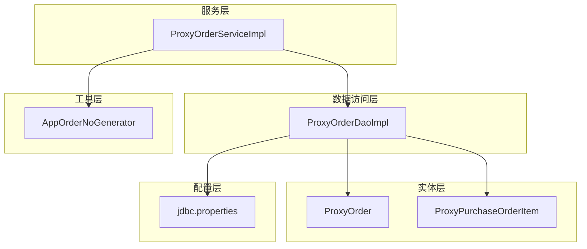
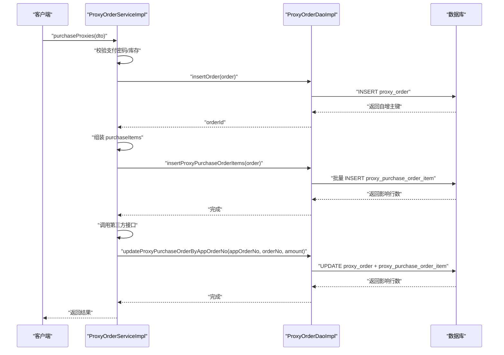
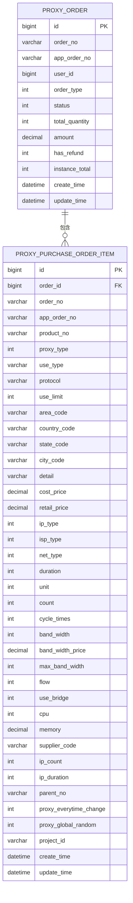
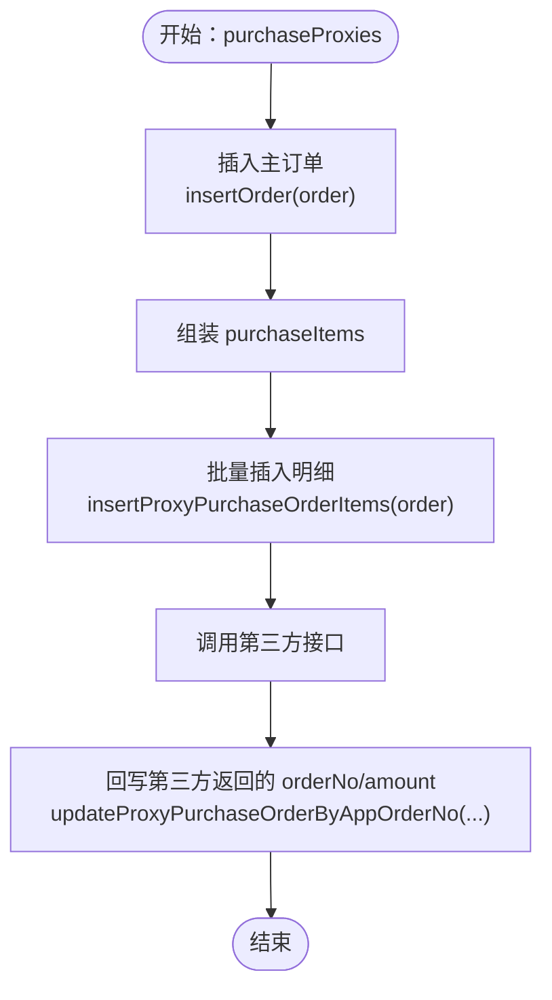
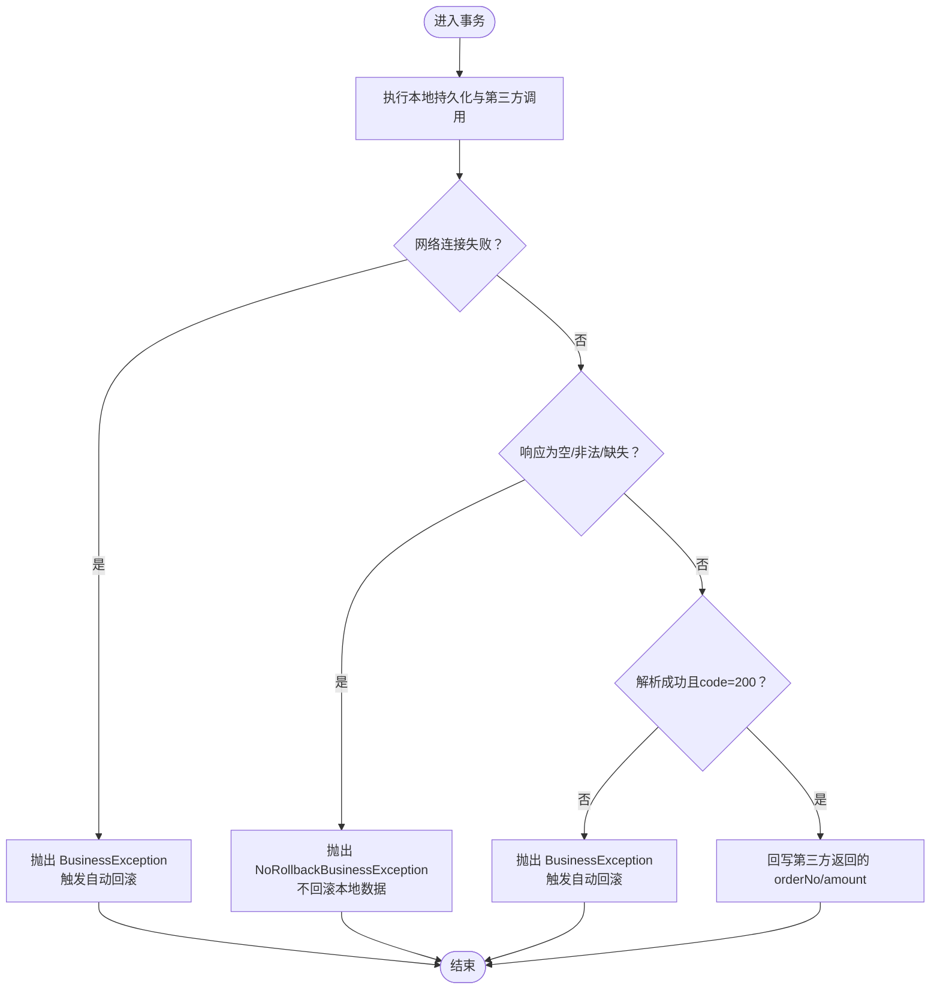
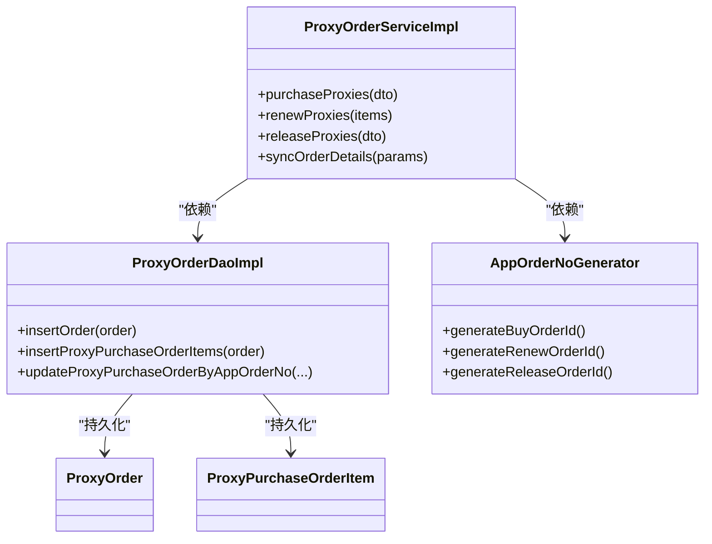

# 订单持久化

<cite>
**本文引用的文件**
- [ProxyOrder.java](file://src/main/java/cn/linkfast/entity/ProxyOrder.java)
- [ProxyPurchaseOrderItem.java](file://src/main/java/cn/linkfast/entity/ProxyPurchaseOrderItem.java)
- [ProxyOrderDAO.java](file://src/main/java/cn/linkfast/dao/ProxyOrderDAO.java)
- [ProxyOrderDaoImpl.java](file://src/main/java/cn/linkfast/dao/impl/ProxyOrderDaoImpl.java)
- [ProxyOrderService.java](file://src/main/java/cn/linkfast/service/ProxyOrderService.java)
- [ProxyOrderServiceImpl.java](file://src/main/java/cn/linkfast/service/impl/ProxyOrderServiceImpl.java)
- [AppOrderNoGenerator.java](file://src/main/java/cn/linkfast/utils/AppOrderNoGenerator.java)
- [jdbc.properties](file://src/main/resources/jdbc.properties)
- [ProxyOrderQueryDTO.java](file://src/main/java/cn/linkfast/dto/ProxyOrderQueryDTO.java)
- [ProxyOrderIT.java](file://src/test/java/cn/linkfast/service/Impl/ProxyOrderIT.java)
- [ProxyOrderServiceImplTest.java](file://src/test/java/cn/linkfast/service/Impl/ProxyOrderServiceImplTest.java)
</cite>

## 目录
1. [简介](#简介)
2. [项目结构](#项目结构)
3. [核心组件](#核心组件)
4. [架构总览](#架构总览)
5. [详细组件分析](#详细组件分析)
6. [依赖关系分析](#依赖关系分析)
7. [性能考量](#性能考量)
8. [故障排查指南](#故障排查指南)
9. [结论](#结论)
10. [附录](#附录)

## 简介
本文档聚焦于“代理购买订单”的数据库持久化流程，系统性阐述 ProxyOrder 主订单与 ProxyPurchaseOrderItem 明细订单的批量插入机制，解释订单实体映射关系（主从表、外键约束与索引设计）、事务管理策略（事务边界、回滚机制与异常处理）、订单号生成策略、数据完整性保障与并发插入解决方案，并给出性能优化建议与批量操作最佳实践。

## 项目结构
围绕订单持久化的关键模块如下：
- 实体层：ProxyOrder、ProxyPurchaseOrderItem 等
- DAO 层：ProxyOrderDAO 接口与 ProxyOrderDaoImpl 实现
- Service 层：ProxyOrderService 接口与 ProxyOrderServiceImpl 实现
- 工具层：AppOrderNoGenerator（基于雪花算法生成业务订单号）
- 配置层：jdbc.properties（MySQL 连接与批处理优化参数）

图表来源
- [ProxyOrderServiceImpl.java:196-458](file://src/main/java/cn/linkfast/service/impl/ProxyOrderServiceImpl.java#L196-L458)
- [ProxyOrderDaoImpl.java:28-444](file://src/main/java/cn/linkfast/dao/impl/ProxyOrderDaoImpl.java#L28-L444)
- [ProxyOrder.java:19-45](file://src/main/java/cn/linkfast/entity/ProxyOrder.java#L19-L45)
- [ProxyPurchaseOrderItem.java:19-158](file://src/main/java/cn/linkfast/entity/ProxyPurchaseOrderItem.java#L19-L158)
- [AppOrderNoGenerator.java:16-44](file://src/main/java/cn/linkfast/utils/AppOrderNoGenerator.java#L16-L44)
- [jdbc.properties:5-17](file://src/main/resources/jdbc.properties#L5-L17)

章节来源
- [ProxyOrderServiceImpl.java:196-458](file://src/main/java/cn/linkfast/service/impl/ProxyOrderServiceImpl.java#L196-L458)
- [ProxyOrderDaoImpl.java:28-444](file://src/main/java/cn/linkfast/dao/impl/ProxyOrderDaoImpl.java#L28-L444)
- [ProxyOrder.java:19-45](file://src/main/java/cn/linkfast/entity/ProxyOrder.java#L19-L45)
- [ProxyPurchaseOrderItem.java:19-158](file://src/main/java/cn/linkfast/entity/ProxyPurchaseOrderItem.java#L19-L158)
- [AppOrderNoGenerator.java:16-44](file://src/main/java/cn/linkfast/utils/AppOrderNoGenerator.java#L16-L44)
- [jdbc.properties:5-17](file://src/main/resources/jdbc.properties#L5-L17)

## 核心组件
- ProxyOrder：主订单实体，封装订单基础信息与明细集合（购买、续费、释放等）
- ProxyPurchaseOrderItem：代理购买订单明细实体，承载购买维度的详细规格
- ProxyOrderDAO：定义订单主从表的 CRUD 与批量插入接口
- ProxyOrderDaoImpl：基于 JdbcTemplate 的实现，提供批量插入、回写与查询能力
- ProxyOrderServiceImpl：业务编排层，负责事务控制、订单号生成、第三方交互与回写
- AppOrderNoGenerator：基于 Snowflake 的业务订单号生成器（购买/续费/释放三类前缀）
- jdbc.properties：MySQL 连接与批处理优化参数（rewriteBatchedStatements、allowMultiQueries 等）

章节来源
- [ProxyOrder.java:19-45](file://src/main/java/cn/linkfast/entity/ProxyOrder.java#L19-L45)
- [ProxyPurchaseOrderItem.java:19-158](file://src/main/java/cn/linkfast/entity/ProxyPurchaseOrderItem.java#L19-L158)
- [ProxyOrderDAO.java:10-102](file://src/main/java/cn/linkfast/dao/ProxyOrderDAO.java#L10-L102)
- [ProxyOrderDaoImpl.java:28-444](file://src/main/java/cn/linkfast/dao/impl/ProxyOrderDaoImpl.java#L28-L444)
- [ProxyOrderService.java:15-61](file://src/main/java/cn/linkfast/service/ProxyOrderService.java#L15-L61)
- [ProxyOrderServiceImpl.java:37-782](file://src/main/java/cn/linkfast/service/impl/ProxyOrderServiceImpl.java#L37-L782)
- [AppOrderNoGenerator.java:16-44](file://src/main/java/cn/linkfast/utils/AppOrderNoGenerator.java#L16-L44)
- [jdbc.properties:5-17](file://src/main/resources/jdbc.properties#L5-L17)

## 架构总览
订单持久化采用“服务层编排 + DAO 层持久化 + 工具层生成”的分层架构。购买订单流程的关键路径如下：

图表来源
- [ProxyOrderServiceImpl.java:196-458](file://src/main/java/cn/linkfast/service/impl/ProxyOrderServiceImpl.java#L196-L458)
- [ProxyOrderDaoImpl.java:265-355](file://src/main/java/cn/linkfast/dao/impl/ProxyOrderDaoImpl.java#L265-L355)
- [ProxyOrderDaoImpl.java:173-204](file://src/main/java/cn/linkfast/dao/impl/ProxyOrderDaoImpl.java#L173-L204)

章节来源
- [ProxyOrderServiceImpl.java:196-458](file://src/main/java/cn/linkfast/service/impl/ProxyOrderServiceImpl.java#L196-L458)
- [ProxyOrderDaoImpl.java:265-355](file://src/main/java/cn/linkfast/dao/impl/ProxyOrderDaoImpl.java#L265-L355)
- [ProxyOrderDaoImpl.java:173-204](file://src/main/java/cn/linkfast/dao/impl/ProxyOrderDaoImpl.java#L173-L204)

## 详细组件分析

### 1) 实体与映射关系
- ProxyOrder（主表）
  - 字段：主键自增 id、平台订单号 orderNo、渠道商订单号 appOrderNo、用户 id、订单类型、状态、总量、金额、是否退费、实例总数、创建/更新时间
  - 关联：purchaseItems（购买明细）、renewItems（续费明细）、releaseOrderItems（释放明细）、instances（实例）
- ProxyPurchaseOrderItem（明细表）
  - 字段：自增 id、主订单 id、主订单号、渠道商订单号、产品编号、代理类型、使用方式、协议、使用限制、区域/国家/州省/城市代码、商品描述、成本/零售价、IP 类型、ISP 类型、网络类型、时长、单位、购买数量、周期次数、带宽/额外带宽价格/最大带宽、流量、是否使用桥接、CPU、内存、父产品编号、动态代理特性、产品类型、项目 code、创建/更新时间

图表来源
- [ProxyOrder.java:19-45](file://src/main/java/cn/linkfast/entity/ProxyOrder.java#L19-L45)
- [ProxyPurchaseOrderItem.java:19-158](file://src/main/java/cn/linkfast/entity/ProxyPurchaseOrderItem.java#L19-L158)

章节来源
- [ProxyOrder.java:19-45](file://src/main/java/cn/linkfast/entity/ProxyOrder.java#L19-L45)
- [ProxyPurchaseOrderItem.java:19-158](file://src/main/java/cn/linkfast/entity/ProxyPurchaseOrderItem.java#L19-L158)

### 2) 批量插入机制（购买订单）
- 主订单插入：通过 insertOrder 返回自增主键，供明细表使用
- 明细批量插入：通过 insertProxyPurchaseOrderItems 将 purchaseItems 批量写入 proxy_purchase_order_item
- 批处理优化：DAO 层使用 JdbcTemplate.batchUpdate，配合 jdbc.properties 的 rewriteBatchedStatements=true 提升批量写入效率

图表来源
- [ProxyOrderServiceImpl.java:254-311](file://src/main/java/cn/linkfast/service/impl/ProxyOrderServiceImpl.java#L254-L311)
- [ProxyOrderDaoImpl.java:265-355](file://src/main/java/cn/linkfast/dao/impl/ProxyOrderDaoImpl.java#L265-L355)

章节来源
- [ProxyOrderServiceImpl.java:254-311](file://src/main/java/cn/linkfast/service/impl/ProxyOrderServiceImpl.java#L254-L311)
- [ProxyOrderDaoImpl.java:295-355](file://src/main/java/cn/linkfast/dao/impl/ProxyOrderDaoImpl.java#L295-L355)

### 3) 事务管理策略
- 事务注解：@Transactional(rollbackFor = Exception.class, noRollbackFor = NoRollbackBusinessException.class)
- 事务边界：
  - 购买：insertOrder + insertProxyPurchaseOrderItems + 第三方调用 + 回写
  - 续费：insertOrder + insertProxyRenewOrderItems + 第三方调用 + 回写
  - 释放：insertOrder + insertProxyReleaseOrderItems + 第三方调用 + 回写
- 回滚机制：
  - 连接建立失败（网络未到达第三方）：可安全回滚，抛出 BusinessException 触发自动回滚
  - 连接已建立但响应读取失败/响应为空/非法JSON/data缺失/解密失败/解析失败：抛出 NoRollbackBusinessException，不回滚本地数据，提示人工确认
- 异常处理：
  - 对方返回非200：可回滚
  - 对方已落库场景：不回滚，透传异常

图表来源
- [ProxyOrderServiceImpl.java:343-451](file://src/main/java/cn/linkfast/service/impl/ProxyOrderServiceImpl.java#L343-L451)
- [ProxyOrderServiceImpl.java:521-634](file://src/main/java/cn/linkfast/service/impl/ProxyOrderServiceImpl.java#L521-L634)
- [ProxyOrderServiceImpl.java:680-778](file://src/main/java/cn/linkfast/service/impl/ProxyOrderServiceImpl.java#L680-L778)

章节来源
- [ProxyOrderService.java:42-52](file://src/main/java/cn/linkfast/service/ProxyOrderService.java#L42-L52)
- [ProxyOrderServiceImpl.java:343-451](file://src/main/java/cn/linkfast/service/impl/ProxyOrderServiceImpl.java#L343-L451)
- [ProxyOrderServiceImpl.java:521-634](file://src/main/java/cn/linkfast/service/impl/ProxyOrderServiceImpl.java#L521-L634)
- [ProxyOrderServiceImpl.java:680-778](file://src/main/java/cn/linkfast/service/impl/ProxyOrderServiceImpl.java#L680-L778)

### 4) 订单号生成策略
- 生成器：AppOrderNoGenerator 基于 Snowflake
- 前缀规则：
  - 购买：P + Snowflake
  - 续费：R + Snowflake
  - 释放：F + Snowflake
- 并发与唯一性：Snowflake 保证全局唯一，避免并发冲突

章节来源
- [AppOrderNoGenerator.java:16-44](file://src/main/java/cn/linkfast/utils/AppOrderNoGenerator.java#L16-L44)

### 5) 数据完整性与并发插入
- 主从一致性：先插入主订单获取主键，再将主键写入明细表，确保外键一致性
- 批量插入：JDBC 批处理 + MySQL 批改写优化参数，减少往返与锁竞争
- 并发插入：通过生成器唯一性与批处理原子性降低冲突概率；若出现重复键，使用 ON DUPLICATE KEY UPDATE 保证幂等更新
- 实例回写：updateProxyPurchaseOrderByAppOrderNo 同时更新主表与实例表，确保数据一致性

章节来源
- [ProxyOrderDaoImpl.java:33-76](file://src/main/java/cn/linkfast/dao/impl/ProxyOrderDaoImpl.java#L33-L76)
- [ProxyOrderDaoImpl.java:265-355](file://src/main/java/cn/linkfast/dao/impl/ProxyOrderDaoImpl.java#L265-L355)
- [jdbc.properties:10-11](file://src/main/resources/jdbc.properties#L10-L11)

### 6) 查询与分页
- 条件查询：selectListByCondition 支持按状态、订单类型、订单号过滤
- 分页：通过 offset/limit 实现，配合 countByCondition 获取总数
- 参数安全：使用占位符与参数列表，避免 SQL 注入

章节来源
- [ProxyOrderDaoImpl.java:85-154](file://src/main/java/cn/linkfast/dao/impl/ProxyOrderDaoImpl.java#L85-L154)
- [ProxyOrderQueryDTO.java:18-57](file://src/main/java/cn/linkfast/dto/ProxyOrderQueryDTO.java#L18-L57)

## 依赖关系分析
- 服务层依赖 DAO 层与工具层（订单号生成器）
- DAO 层依赖 JDBC 配置与实体模型
- 实体间通过主从关系耦合，明细表外键指向主表

图表来源
- [ProxyOrderServiceImpl.java:37-782](file://src/main/java/cn/linkfast/service/impl/ProxyOrderServiceImpl.java#L37-L782)
- [ProxyOrderDaoImpl.java:28-444](file://src/main/java/cn/linkfast/dao/impl/ProxyOrderDaoImpl.java#L28-L444)
- [AppOrderNoGenerator.java:16-44](file://src/main/java/cn/linkfast/utils/AppOrderNoGenerator.java#L16-L44)
- [ProxyOrder.java:19-45](file://src/main/java/cn/linkfast/entity/ProxyOrder.java#L19-L45)
- [ProxyPurchaseOrderItem.java:19-158](file://src/main/java/cn/linkfast/entity/ProxyPurchaseOrderItem.java#L19-L158)

章节来源
- [ProxyOrderServiceImpl.java:37-782](file://src/main/java/cn/linkfast/service/impl/ProxyOrderServiceImpl.java#L37-L782)
- [ProxyOrderDaoImpl.java:28-444](file://src/main/java/cn/linkfast/dao/impl/ProxyOrderDaoImpl.java#L28-L444)
- [AppOrderNoGenerator.java:16-44](file://src/main/java/cn/linkfast/utils/AppOrderNoGenerator.java#L16-L44)
- [ProxyOrder.java:19-45](file://src/main/java/cn/linkfast/entity/ProxyOrder.java#L19-L45)
- [ProxyPurchaseOrderItem.java:19-158](file://src/main/java/cn/linkfast/entity/ProxyPurchaseOrderItem.java#L19-L158)

## 性能考量
- 批处理优化
  - jdbc.properties 启用 rewriteBatchedStatements=true，允许 MySQL 批改写，显著提升批量插入性能
  - allowMultiQueries=true 支持多语句合并，减少网络往返
- 连接池与超时
  - socketTimeout、connectTimeout、autoReconnect 等参数提升连接稳定性与超时控制
- 批量大小与分片
  - 建议将大订单拆分为合理批次，避免单次批量过大导致锁竞争与内存压力
- 并发控制
  - 使用订单号生成器保证唯一性，结合数据库索引与幂等更新策略降低冲突
- 日志与监控
  - DAO 层对批量操作与回写操作输出日志，便于定位性能瓶颈与异常

章节来源
- [jdbc.properties:10-17](file://src/main/resources/jdbc.properties#L10-L17)
- [ProxyOrderDaoImpl.java:295-355](file://src/main/java/cn/linkfast/dao/impl/ProxyOrderDaoImpl.java#L295-L355)
- [ProxyOrderDaoImpl.java:368-444](file://src/main/java/cn/linkfast/dao/impl/ProxyOrderDaoImpl.java#L368-L444)

## 故障排查指南
- 购买订单
  - 连接建立失败（网络未到达第三方）：检查网络连通性与超时配置，重试后可安全回滚
  - 响应读取失败/空响应/非法JSON：第三方可能已落库，保留本地数据，需人工核对
  - 对方返回非200：可回滚
  - 解密/解析失败：第三方可能已落库，保留本地数据，需人工核对
- 续费/释放
  - 同购买流程类似，遵循“连接失败可回滚、已发送但失败不可回滚”的原则
- 数据一致性
  - 若出现重复键，使用 ON DUPLICATE KEY UPDATE 幂等更新；若主从不一致，检查主键生成与明细写入顺序
- 日志定位
  - 关注 DAO 层日志输出，定位批量插入与回写阶段的异常

章节来源
- [ProxyOrderServiceImpl.java:343-451](file://src/main/java/cn/linkfast/service/impl/ProxyOrderServiceImpl.java#L343-L451)
- [ProxyOrderServiceImpl.java:521-634](file://src/main/java/cn/linkfast/service/impl/ProxyOrderServiceImpl.java#L521-L634)
- [ProxyOrderServiceImpl.java:680-778](file://src/main/java/cn/linkfast/service/impl/ProxyOrderServiceImpl.java#L680-L778)
- [ProxyOrderDaoImpl.java:33-76](file://src/main/java/cn/linkfast/dao/impl/ProxyOrderDaoImpl.java#L33-L76)

## 结论
本方案以清晰的分层架构与严格的事务策略，实现了代理购买订单的高可靠持久化。通过 Snowflake 订单号生成、JDBC 批处理与幂等更新，兼顾了性能与一致性；通过区分“可回滚”与“不可回滚”场景，有效规避了第三方系统落库风险。建议在生产环境中结合监控与限流策略，进一步提升吞吐与稳定性。

## 附录
- 测试参考
  - 集成测试：ProxyOrderIT 验证真实持久化与 ON DUPLICATE KEY UPDATE 的行为
  - 单元测试：ProxyOrderServiceImplTest 验证 JSON 解析与异常分支

章节来源
- [ProxyOrderIT.java:68-178](file://src/test/java/cn/linkfast/service/Impl/ProxyOrderIT.java#L68-L178)
- [ProxyOrderServiceImplTest.java:45-89](file://src/test/java/cn/linkfast/service/Impl/ProxyOrderServiceImplTest.java#L45-L89)