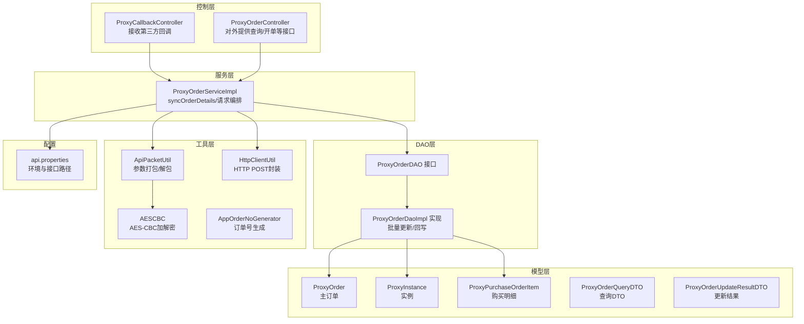
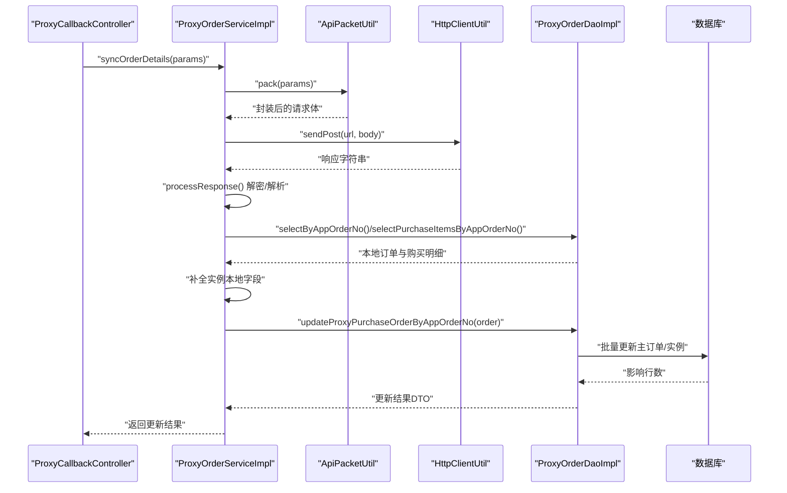
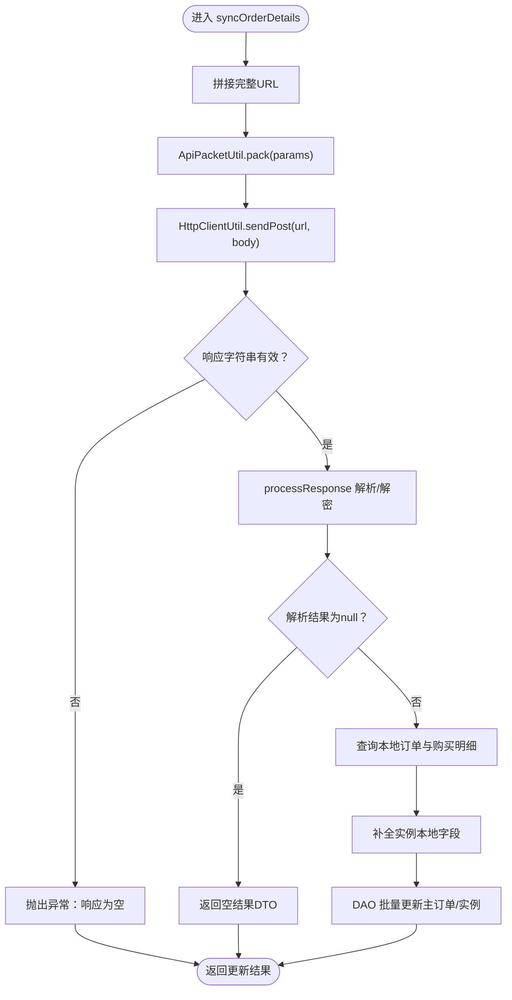
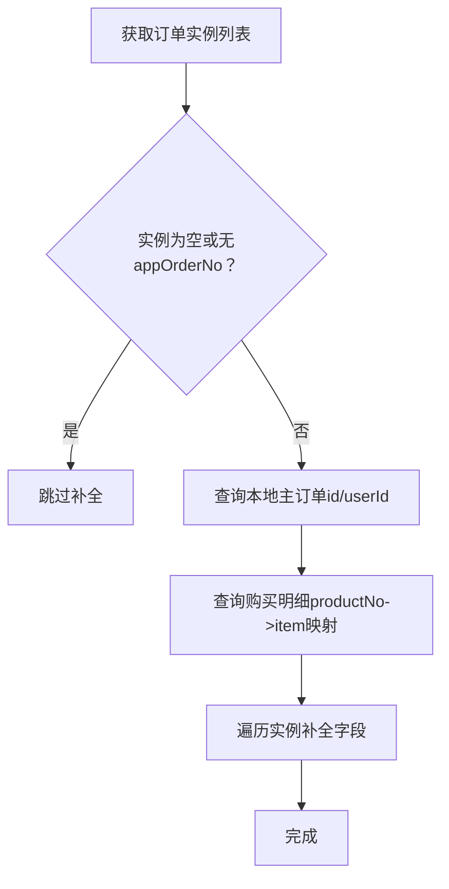
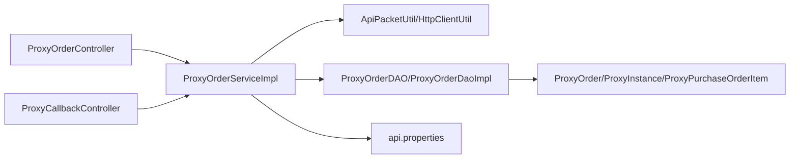

# 订单同步管理

<cite>
**本文引用的文件**
- [ProxyOrderServiceImpl.java](file://src/main/java/cn/linkfast/service/impl/ProxyOrderServiceImpl.java)
- [ProxyOrderDAO.java](file://src/main/java/cn/linkfast/dao/ProxyOrderDAO.java)
- [ProxyOrderDaoImpl.java](file://src/main/java/cn/linkfast/dao/impl/ProxyOrderDaoImpl.java)
- [ProxyOrder.java](file://src/main/java/cn/linkfast/entity/ProxyOrder.java)
- [ProxyInstance.java](file://src/main/java/cn/linkfast/entity/ProxyInstance.java)
- [ProxyPurchaseOrderItem.java](file://src/main/java/cn/linkfast/entity/ProxyPurchaseOrderItem.java)
- [ProxyOrderQueryDTO.java](file://src/main/java/cn/linkfast/dto/ProxyOrderQueryDTO.java)
- [ProxyOrderUpdateResultDTO.java](file://src/main/java/cn/linkfast/dto/ProxyOrderUpdateResultDTO.java)
- [ApiPacketUtil.java](file://src/main/java/cn/linkfast/utils/ApiPacketUtil.java)
- [AESCBC.java](file://src/main/java/cn/linkfast/utils/AESCBC.java)
- [HttpClientUtil.java](file://src/main/java/cn/linkfast/utils/HttpClientUtil.java)
- [AppOrderNoGenerator.java](file://src/main/java/cn/linkfast/utils/AppOrderNoGenerator.java)
- [ProxyOrderController.java](file://src/main/java/cn/linkfast/controller/ProxyOrderController.java)
- [ProxyCallbackController.java](file://src/main/java/cn/linkfast/controller/ProxyCallbackController.java)
- [api.properties](file://src/main/resources/api.properties)
</cite>

## 目录
1. [简介](#简介)
2. [项目结构](#项目结构)
3. [核心组件](#核心组件)
4. [架构总览](#架构总览)
5. [详细组件分析](#详细组件分析)
6. [依赖分析](#依赖分析)
7. [性能考量](#性能考量)
8. [故障排查指南](#故障排查指南)
9. [结论](#结论)
10. [附录](#附录)

## 简介
本文档围绕“订单同步管理”功能，系统性阐述第三方订单状态同步的实现机制，覆盖从API请求、响应解密、数据解析到本地数据库更新的完整链路。重点解析syncOrderDetails方法的工作流程，说明订单实例本地字段补全逻辑（appOrderNo、orderId、userId、unit、duration等），并总结批量实例处理的性能优化策略与内存管理要点。同时给出同步失败的处理机制与重试策略，以及面向开发者的监控与调试建议。

## 项目结构
围绕订单同步的关键模块与文件如下：
- 控制器层：接收外部回调或主动触发同步
- 服务层：编排请求、调用第三方API、解密与解析、本地更新
- DAO层：封装数据库操作，支持批量更新与回写
- 工具层：加密/解密、HTTP客户端、订单号生成
- 实体与DTO：订单、实例、明细、查询与结果封装

图表来源
- [ProxyCallbackController.java:34-77](file://src/main/java/cn/linkfast/controller/ProxyCallbackController.java#L34-L77)
- [ProxyOrderController.java:17-88](file://src/main/java/cn/linkfast/controller/ProxyOrderController.java#L17-L88)
- [ProxyOrderServiceImpl.java:89-136](file://src/main/java/cn/linkfast/service/impl/ProxyOrderServiceImpl.java#L89-L136)
- [ProxyOrderDAO.java:10-102](file://src/main/java/cn/linkfast/dao/ProxyOrderDAO.java#L10-L102)
- [ProxyOrderDaoImpl.java:33-76](file://src/main/java/cn/linkfast/dao/impl/ProxyOrderDaoImpl.java#L33-L76)
- [ApiPacketUtil.java:55-106](file://src/main/java/cn/linkfast/utils/ApiPacketUtil.java#L55-L106)
- [AESCBC.java:19-36](file://src/main/java/cn/linkfast/utils/AESCBC.java#L19-L36)
- [HttpClientUtil.java:27-45](file://src/main/java/cn/linkfast/utils/HttpClientUtil.java#L27-L45)
- [AppOrderNoGenerator.java:14-45](file://src/main/java/cn/linkfast/utils/AppOrderNoGenerator.java#L14-L45)
- [ProxyOrder.java:11-45](file://src/main/java/cn/linkfast/entity/ProxyOrder.java#L11-L45)
- [ProxyInstance.java:9-57](file://src/main/java/cn/linkfast/entity/ProxyInstance.java#L9-L57)
- [ProxyPurchaseOrderItem.java:10-158](file://src/main/java/cn/linkfast/entity/ProxyPurchaseOrderItem.java#L10-L158)
- [ProxyOrderQueryDTO.java:11-57](file://src/main/java/cn/linkfast/dto/ProxyOrderQueryDTO.java#L11-L57)
- [ProxyOrderUpdateResultDTO.java:5-39](file://src/main/java/cn/linkfast/dto/ProxyOrderUpdateResultDTO.java#L5-L39)
- [api.properties:1-31](file://src/main/resources/api.properties#L1-L31)

章节来源
- [ProxyOrderServiceImpl.java:89-136](file://src/main/java/cn/linkfast/service/impl/ProxyOrderServiceImpl.java#L89-L136)
- [ProxyOrderDAO.java:10-102](file://src/main/java/cn/linkfast/dao/ProxyOrderDAO.java#L10-L102)
- [ProxyOrderDaoImpl.java:33-76](file://src/main/java/cn/linkfast/dao/impl/ProxyOrderDaoImpl.java#L33-L76)
- [ProxyOrder.java:11-45](file://src/main/java/cn/linkfast/entity/ProxyOrder.java#L11-L45)
- [ProxyInstance.java:9-57](file://src/main/java/cn/linkfast/entity/ProxyInstance.java#L9-L57)
- [ProxyPurchaseOrderItem.java:10-158](file://src/main/java/cn/linkfast/entity/ProxyPurchaseOrderItem.java#L10-L158)
- [ProxyOrderQueryDTO.java:11-57](file://src/main/java/cn/linkfast/dto/ProxyOrderQueryDTO.java#L11-L57)
- [ProxyOrderUpdateResultDTO.java:5-39](file://src/main/java/cn/linkfast/dto/ProxyOrderUpdateResultDTO.java#L5-L39)
- [ApiPacketUtil.java:55-106](file://src/main/java/cn/linkfast/utils/ApiPacketUtil.java#L55-L106)
- [AESCBC.java:19-36](file://src/main/java/cn/linkfast/utils/AESCBC.java#L19-L36)
- [HttpClientUtil.java:27-45](file://src/main/java/cn/linkfast/utils/HttpClientUtil.java#L27-L45)
- [AppOrderNoGenerator.java:14-45](file://src/main/java/cn/linkfast/utils/AppOrderNoGenerator.java#L14-L45)
- [ProxyOrderController.java:17-88](file://src/main/java/cn/linkfast/controller/ProxyOrderController.java#L17-L88)
- [ProxyCallbackController.java:34-77](file://src/main/java/cn/linkfast/controller/ProxyCallbackController.java#L34-L77)
- [api.properties:1-31](file://src/main/resources/api.properties#L1-L31)

## 核心组件
- 订单同步服务：负责拼装请求、调用第三方API、解密响应、解析数据、补全实例本地字段并批量更新数据库。
- DAO层：提供主订单与实例的批量更新能力，支持回写第三方返回的平台订单号与金额。
- 工具层：统一封装参数打包、AES-CBC加解密、HTTP POST请求。
- 实体与DTO：定义订单、实例、明细的数据结构，以及查询与结果封装对象。

章节来源
- [ProxyOrderServiceImpl.java:89-136](file://src/main/java/cn/linkfast/service/impl/ProxyOrderServiceImpl.java#L89-L136)
- [ProxyOrderDAO.java:10-102](file://src/main/java/cn/linkfast/dao/ProxyOrderDAO.java#L10-L102)
- [ProxyOrderDaoImpl.java:33-76](file://src/main/java/cn/linkfast/dao/impl/ProxyOrderDaoImpl.java#L33-L76)
- [ApiPacketUtil.java:55-106](file://src/main/java/cn/linkfast/utils/ApiPacketUtil.java#L55-L106)
- [HttpClientUtil.java:27-45](file://src/main/java/cn/linkfast/utils/HttpClientUtil.java#L27-L45)
- [ProxyOrder.java:11-45](file://src/main/java/cn/linkfast/entity/ProxyOrder.java#L11-L45)
- [ProxyInstance.java:9-57](file://src/main/java/cn/linkfast/entity/ProxyInstance.java#L9-L57)
- [ProxyPurchaseOrderItem.java:10-158](file://src/main/java/cn/linkfast/entity/ProxyPurchaseOrderItem.java#L10-L158)
- [ProxyOrderQueryDTO.java:11-57](file://src/main/java/cn/linkfast/dto/ProxyOrderQueryDTO.java#L11-L57)
- [ProxyOrderUpdateResultDTO.java:5-39](file://src/main/java/cn/linkfast/dto/ProxyOrderUpdateResultDTO.java#L5-L39)

## 架构总览
订单同步从回调入口进入，经服务层编排，通过工具层完成加密与HTTP请求，再由DAO层执行数据库批量更新。

图表来源
- [ProxyCallbackController.java:66-77](file://src/main/java/cn/linkfast/controller/ProxyCallbackController.java#L66-L77)
- [ProxyOrderServiceImpl.java:89-136](file://src/main/java/cn/linkfast/service/impl/ProxyOrderServiceImpl.java#L89-L136)
- [ApiPacketUtil.java:55-106](file://src/main/java/cn/linkfast/utils/ApiPacketUtil.java#L55-L106)
- [HttpClientUtil.java:27-45](file://src/main/java/cn/linkfast/utils/HttpClientUtil.java#L27-L45)
- [ProxyOrderDaoImpl.java:33-76](file://src/main/java/cn/linkfast/dao/impl/ProxyOrderDaoImpl.java#L33-L76)

## 详细组件分析

### syncOrderDetails 方法工作流
- 请求组装：根据环境配置拼接完整URL，使用ApiPacketUtil对业务参数进行加密与封装。
- HTTP请求：通过HttpClientUtil发送POST请求，返回响应字符串。
- 响应处理：processResponse解析响应，校验code，解密data节点，反序列化为ProxyOrder对象。
- 实例补全：基于appOrderNo一次性查询本地主订单与购买明细，构建productNo到明细的映射，遍历实例补全本地字段（appOrderNo、orderId、userId、unit、duration）。
- 数据更新：调用DAO批量更新主订单与实例，返回更新结果DTO。

图表来源
- [ProxyOrderServiceImpl.java:89-136](file://src/main/java/cn/linkfast/service/impl/ProxyOrderServiceImpl.java#L89-L136)
- [ProxyOrderServiceImpl.java:173-194](file://src/main/java/cn/linkfast/service/impl/ProxyOrderServiceImpl.java#L173-L194)
- [ProxyOrderDaoImpl.java:33-76](file://src/main/java/cn/linkfast/dao/impl/ProxyOrderDaoImpl.java#L33-L76)

章节来源
- [ProxyOrderServiceImpl.java:89-136](file://src/main/java/cn/linkfast/service/impl/ProxyOrderServiceImpl.java#L89-L136)
- [ProxyOrderServiceImpl.java:173-194](file://src/main/java/cn/linkfast/service/impl/ProxyOrderServiceImpl.java#L173-L194)
- [ProxyOrderDaoImpl.java:33-76](file://src/main/java/cn/linkfast/dao/impl/ProxyOrderDaoImpl.java#L33-L76)

### 订单实例本地字段补全逻辑
- 关键字段关联更新：
  - appOrderNo：若实例未填充，则从订单复制。
  - orderId：来自本地主订单的id。
  - userId：来自本地主订单的userId。
  - unit/duration：来自购买明细（按productNo映射）。
- 查询策略：
  - 一次查询本地主订单，获取id与userId。
  - 一次查询购买明细，构建productNo到明细的映射，随后单次遍历完成所有实例字段补全。
- 作用范围：仅当订单包含实例且appOrderNo存在时生效。

图表来源
- [ProxyOrderServiceImpl.java:106-133](file://src/main/java/cn/linkfast/service/impl/ProxyOrderServiceImpl.java#L106-L133)
- [ProxyOrderDAO.java:96-101](file://src/main/java/cn/linkfast/dao/ProxyOrderDAO.java#L96-L101)
- [ProxyOrderDaoImpl.java:360-364](file://src/main/java/cn/linkfast/dao/impl/ProxyOrderDaoImpl.java#L360-L364)

章节来源
- [ProxyOrderServiceImpl.java:106-133](file://src/main/java/cn/linkfast/service/impl/ProxyOrderServiceImpl.java#L106-L133)
- [ProxyOrderDAO.java:96-101](file://src/main/java/cn/linkfast/dao/ProxyOrderDAO.java#L96-L101)
- [ProxyOrderDaoImpl.java:360-364](file://src/main/java/cn/linkfast/dao/impl/ProxyOrderDaoImpl.java#L360-L364)

### 批量实例处理的性能优化与内存管理
- 批量更新：DAO层使用JDBC批处理更新实例表，减少往返次数，提升吞吐。
- 单次遍历：在服务层对实例集合进行一次遍历完成字段补全，避免多次扫描。
- 内存友好：使用流式收集与映射，避免大对象重复拷贝；JSON序列化仅在必要时进行。
- 数据一致性：事务边界内完成主订单与实例的更新，保证原子性。

章节来源
- [ProxyOrderDaoImpl.java:58-75](file://src/main/java/cn/linkfast/dao/impl/ProxyOrderDaoImpl.java#L58-L75)
- [ProxyOrderServiceImpl.java:118-132](file://src/main/java/cn/linkfast/service/impl/ProxyOrderServiceImpl.java#L118-L132)

### 同步失败处理机制与重试策略
- 请求阶段重试：
  - 对于连接建立失败（如ConnectException/UnknownHostException），允许最多3次重试，每次等待递增。
  - 若重试后仍失败，判定为可回滚场景，抛出业务异常并回滚本地事务。
- 响应阶段容错：
  - 响应为空、JSON非法、code非200、data缺失或为空、解密失败等均视为不可回滚场景，抛出NoRollbackBusinessException，保留本地数据以便人工核对。
- 异常分类：
  - 可回滚：本地未落库，异常由@Transactional自动回滚。
  - 不可回滚：本地可能已落库，需保留数据并提示人工确认。

章节来源
- [ProxyOrderServiceImpl.java:344-373](file://src/main/java/cn/linkfast/service/impl/ProxyOrderServiceImpl.java#L344-L373)
- [ProxyOrderServiceImpl.java:377-420](file://src/main/java/cn/linkfast/service/impl/ProxyOrderServiceImpl.java#L377-L420)
- [ProxyOrderServiceImpl.java:442-451](file://src/main/java/cn/linkfast/service/impl/ProxyOrderServiceImpl.java#L442-L451)

### 监控与调试指导
- 日志输出：
  - 请求与响应：记录URL、参数、原始响应与解密后数据，便于定位问题。
  - 更新统计：记录主订单、实例、明细的更新行数，辅助评估批量效果。
- 关键断点：
  - 参数打包前后对比，确认appKey、reqId、params是否正确。
  - 响应code与data节点存在性检查，关注解密与JSON解析异常。
  - 补全字段是否完整，特别是unit/duration映射是否命中。
- 环境配置：
  - api.properties中env/sandbox/prod切换、接口路径与密钥配置需与第三方约定一致。

章节来源
- [ProxyOrderServiceImpl.java:100-101](file://src/main/java/cn/linkfast/service/impl/ProxyOrderServiceImpl.java#L100-L101)
- [ProxyOrderServiceImpl.java:178-186](file://src/main/java/cn/linkfast/service/impl/ProxyOrderServiceImpl.java#L178-L186)
- [ProxyOrderDaoImpl.java:48-75](file://src/main/java/cn/linkfast/dao/impl/ProxyOrderDaoImpl.java#L48-L75)
- [api.properties:1-31](file://src/main/resources/api.properties#L1-L31)

## 依赖分析
- 服务层依赖工具层与DAO层，DAO层依赖JDBC模板与实体模型。
- 控制器层通过服务层暴露REST接口，回调控制器触发同步。
- 配置文件决定环境与接口路径，影响运行时行为。

图表来源
- [ProxyOrderController.java:17-88](file://src/main/java/cn/linkfast/controller/ProxyOrderController.java#L17-L88)
- [ProxyCallbackController.java:34-77](file://src/main/java/cn/linkfast/controller/ProxyCallbackController.java#L34-L77)
- [ProxyOrderServiceImpl.java:89-136](file://src/main/java/cn/linkfast/service/impl/ProxyOrderServiceImpl.java#L89-L136)
- [ProxyOrderDAO.java:10-102](file://src/main/java/cn/linkfast/dao/ProxyOrderDAO.java#L10-L102)
- [ProxyOrderDaoImpl.java:33-76](file://src/main/java/cn/linkfast/dao/impl/ProxyOrderDaoImpl.java#L33-L76)
- [ProxyOrder.java:11-45](file://src/main/java/cn/linkfast/entity/ProxyOrder.java#L11-L45)
- [ProxyInstance.java:9-57](file://src/main/java/cn/linkfast/entity/ProxyInstance.java#L9-L57)
- [ProxyPurchaseOrderItem.java:10-158](file://src/main/java/cn/linkfast/entity/ProxyPurchaseOrderItem.java#L10-L158)
- [api.properties:1-31](file://src/main/resources/api.properties#L1-L31)

章节来源
- [ProxyOrderServiceImpl.java:89-136](file://src/main/java/cn/linkfast/service/impl/ProxyOrderServiceImpl.java#L89-L136)
- [ProxyOrderDAO.java:10-102](file://src/main/java/cn/linkfast/dao/ProxyOrderDAO.java#L10-L102)
- [ProxyOrderDaoImpl.java:33-76](file://src/main/java/cn/linkfast/dao/impl/ProxyOrderDaoImpl.java#L33-L76)
- [ProxyOrder.java:11-45](file://src/main/java/cn/linkfast/entity/ProxyOrder.java#L11-L45)
- [ProxyInstance.java:9-57](file://src/main/java/cn/linkfast/entity/ProxyInstance.java#L9-L57)
- [ProxyPurchaseOrderItem.java:10-158](file://src/main/java/cn/linkfast/entity/ProxyPurchaseOrderItem.java#L10-L158)
- [ProxyOrderController.java:17-88](file://src/main/java/cn/linkfast/controller/ProxyOrderController.java#L17-L88)
- [ProxyCallbackController.java:34-77](file://src/main/java/cn/linkfast/controller/ProxyCallbackController.java#L34-L77)
- [api.properties:1-31](file://src/main/resources/api.properties#L1-L31)

## 性能考量
- 批量更新：DAO层采用JDBC批处理，显著降低网络往返与SQL解析开销。
- 单次查询：通过一次查询本地主订单与购买明细，避免多次DB往返。
- 流式处理：使用Stream与Collector进行映射与收集，减少中间对象创建。
- 事务粒度：将主订单与实例更新置于同一事务，确保一致性与原子性。

章节来源
- [ProxyOrderDaoImpl.java:58-75](file://src/main/java/cn/linkfast/dao/impl/ProxyOrderDaoImpl.java#L58-L75)
- [ProxyOrderServiceImpl.java:114-132](file://src/main/java/cn/linkfast/service/impl/ProxyOrderServiceImpl.java#L114-L132)

## 故障排查指南
- 常见问题定位：
  - 响应为空：检查网络连通性与第三方可用性，确认重试策略是否生效。
  - code非200：核对业务参数与权限，查看第三方返回的具体错误信息。
  - 解密失败：确认appSecret长度与IV截取位置，确保与第三方一致。
  - JSON解析异常：检查解密后数据结构是否符合预期。
- 事务回滚：
  - 对于可回滚场景，异常会触发事务回滚；对于不可回滚场景，需人工核对并修正数据。
- 日志与指标：
  - 结合请求日志、解密日志与更新统计，快速定位问题环节。

章节来源
- [ProxyOrderServiceImpl.java:344-420](file://src/main/java/cn/linkfast/service/impl/ProxyOrderServiceImpl.java#L344-L420)
- [ProxyOrderServiceImpl.java:442-451](file://src/main/java/cn/linkfast/service/impl/ProxyOrderServiceImpl.java#L442-L451)
- [ProxyOrderDaoImpl.java:48-75](file://src/main/java/cn/linkfast/dao/impl/ProxyOrderDaoImpl.java#L48-L75)

## 结论
订单同步管理通过清晰的服务编排、严格的异常分类与重试策略、以及高效的批量更新机制，实现了从第三方API到本地数据库的可靠闭环。开发者在接入与维护时，应重点关注参数打包、响应解析、字段补全与事务边界，结合日志与监控，确保同步过程的稳定性与可观测性。

## 附录
- 关键配置项参考：
  - 环境与接口路径：见api.properties中的env、url、appKey、appSecret与各接口path。
  - 订单号生成：使用Snowflake算法生成唯一标识，区分购买/续费/释放三类业务前缀。
- 相关实体与DTO：
  - 订单：ProxyOrder
  - 实例：ProxyInstance
  - 明细：ProxyPurchaseOrderItem
  - 查询：ProxyOrderQueryDTO
  - 结果：ProxyOrderUpdateResultDTO

章节来源
- [api.properties:1-31](file://src/main/resources/api.properties#L1-L31)
- [AppOrderNoGenerator.java:14-45](file://src/main/java/cn/linkfast/utils/AppOrderNoGenerator.java#L14-L45)
- [ProxyOrder.java:11-45](file://src/main/java/cn/linkfast/entity/ProxyOrder.java#L11-L45)
- [ProxyInstance.java:9-57](file://src/main/java/cn/linkfast/entity/ProxyInstance.java#L9-L57)
- [ProxyPurchaseOrderItem.java:10-158](file://src/main/java/cn/linkfast/entity/ProxyPurchaseOrderItem.java#L10-L158)
- [ProxyOrderQueryDTO.java:11-57](file://src/main/java/cn/linkfast/dto/ProxyOrderQueryDTO.java#L11-L57)
- [ProxyOrderUpdateResultDTO.java:5-39](file://src/main/java/cn/linkfast/dto/ProxyOrderUpdateResultDTO.java#L5-L39)