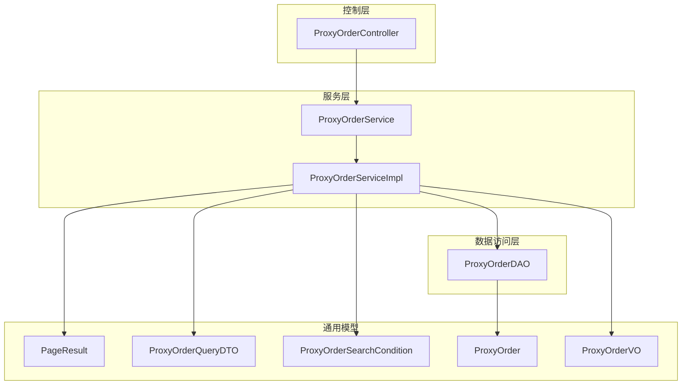
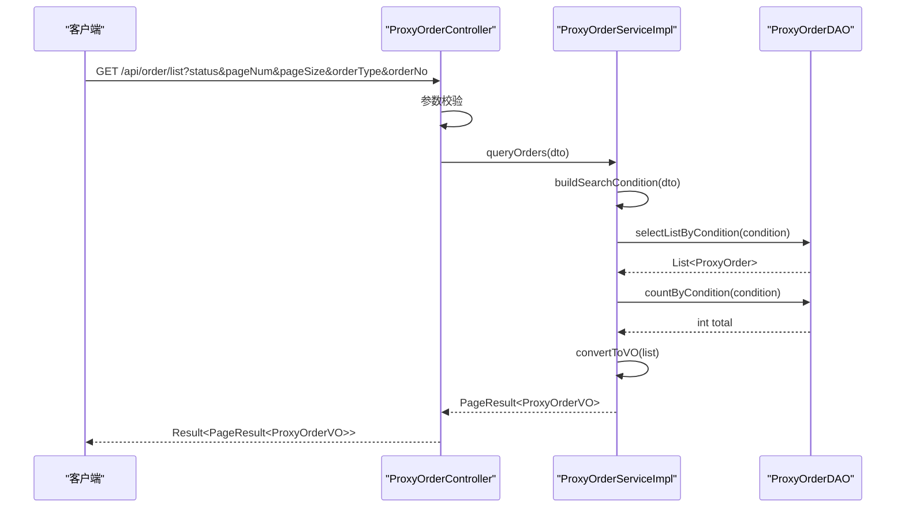
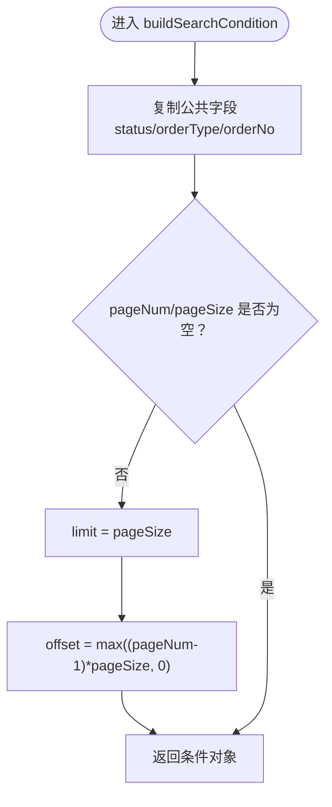
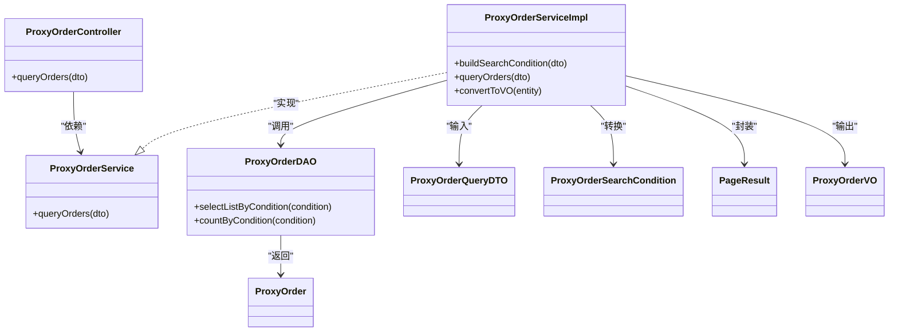

# 订单查询管理

<cite>
**本文引用的文件**
- [ProxyOrderQueryDTO.java](file://src/main/java/cn/linkfast/dto/ProxyOrderQueryDTO.java)
- [ProxyOrderSearchCondition.java](file://src/main/java/cn/linkfast/dto/ProxyOrderSearchCondition.java)
- [PageResult.java](file://src/main/java/cn/linkfast/common/PageResult.java)
- [ProxyOrderController.java](file://src/main/java/cn/linkfast/controller/ProxyOrderController.java)
- [ProxyOrderService.java](file://src/main/java/cn/linkfast/service/ProxyOrderService.java)
- [ProxyOrderServiceImpl.java](file://src/main/java/cn/linkfast/service/impl/ProxyOrderServiceImpl.java)
- [ProxyOrderDAO.java](file://src/main/java/cn/linkfast/dao/ProxyOrderDAO.java)
- [ProxyOrder.java](file://src/main/java/cn/linkfast/entity/ProxyOrder.java)
- [ProxyOrderVO.java](file://src/main/java/cn/linkfast/vo/ProxyOrderVO.java)
- [获取代理订单列表接口.md](file://docs/api/internal/获取代理订单列表接口.md)
- [ProxyOrderControllerTest.java](file://src/test/java/cn/linkfast/controller/ProxyOrderControllerTest.java)
- [ProxyOrderServiceImplTest.java](file://src/test/java/cn/linkfast/service/Impl/ProxyOrderServiceImplTest.java)
- [jdbc.properties](file://src/main/resources/jdbc.properties)
</cite>

## 目录
1. [简介](#简介)
2. [项目结构](#项目结构)
3. [核心组件](#核心组件)
4. [架构概览](#架构概览)
5. [详细组件分析](#详细组件分析)
6. [依赖分析](#依赖分析)
7. [性能考虑](#性能考虑)
8. [故障排查指南](#故障排查指南)
9. [结论](#结论)
10. [附录](#附录)

## 简介
本文档围绕订单查询管理功能进行深入解析，涵盖分页查询、条件过滤与排序机制，重点阐述 ProxyOrderQueryDTO 到 ProxyOrderSearchCondition 的转换逻辑、分页参数的计算公式与边界处理、查询条件构建过程（包括日期范围、订单状态、用户ID等多维筛选）、PageResult 分页结果封装机制与性能优化策略，并提供查询接口的使用示例、最佳实践以及扩展与自定义查询条件的指导原则。

## 项目结构
订单查询功能位于典型的分层架构中，涉及控制层、服务层、数据访问层与通用模型：
- 控制层：负责接收前端请求、参数校验与响应封装
- 服务层：执行业务逻辑，包括 DTO 到 DAO 条件的转换、DAO 查询与结果封装
- DAO 层：面向数据库的查询接口（列表与计数）
- 通用模型：分页结果封装 PageResult、查询 DTO 与 DAO 条件对象

图表来源
- [ProxyOrderController.java:1-88](file://src/main/java/cn/linkfast/controller/ProxyOrderController.java#L1-88)
- [ProxyOrderService.java:1-61](file://src/main/java/cn/linkfast/service/ProxyOrderService.java#L1-61)
- [ProxyOrderServiceImpl.java:1-782](file://src/main/java/cn/linkfast/service/impl/ProxyOrderServiceImpl.java#L1-782)
- [ProxyOrderDAO.java:1-102](file://src/main/java/cn/linkfast/dao/ProxyOrderDAO.java#L1-102)
- [PageResult.java:1-37](file://src/main/java/cn/linkfast/common/PageResult.java#L1-37)
- [ProxyOrderQueryDTO.java:1-57](file://src/main/java/cn/linkfast/dto/ProxyOrderQueryDTO.java#L1-57)
- [ProxyOrderSearchCondition.java:1-42](file://src/main/java/cn/linkfast/dto/ProxyOrderSearchCondition.java#L1-42)
- [ProxyOrder.java:1-45](file://src/main/java/cn/linkfast/entity/ProxyOrder.java#L1-45)
- [ProxyOrderVO.java:1-47](file://src/main/java/cn/linkfast/vo/ProxyOrderVO.java#L1-47)

章节来源
- [ProxyOrderController.java:1-88](file://src/main/java/cn/linkfast/controller/ProxyOrderController.java#L1-L88)
- [ProxyOrderService.java:1-61](file://src/main/java/cn/linkfast/service/ProxyOrderService.java#L1-L61)
- [ProxyOrderServiceImpl.java:1-782](file://src/main/java/cn/linkfast/service/impl/ProxyOrderServiceImpl.java#L1-L782)
- [ProxyOrderDAO.java:1-102](file://src/main/java/cn/linkfast/dao/ProxyOrderDAO.java#L1-L102)
- [PageResult.java:1-37](file://src/main/java/cn/linkfast/common/PageResult.java#L1-L37)
- [ProxyOrderQueryDTO.java:1-57](file://src/main/java/cn/linkfast/dto/ProxyOrderQueryDTO.java#L1-L57)
- [ProxyOrderSearchCondition.java:1-42](file://src/main/java/cn/linkfast/dto/ProxyOrderSearchCondition.java#L1-L42)
- [ProxyOrder.java:1-45](file://src/main/java/cn/linkfast/entity/ProxyOrder.java#L1-L45)
- [ProxyOrderVO.java:1-47](file://src/main/java/cn/linkfast/vo/ProxyOrderVO.java#L1-L47)

## 核心组件
- ProxyOrderQueryDTO：前端查询参数载体，包含订单状态、页码、每页条数、订单号、订单类型等字段，并带有参数校验注解
- ProxyOrderSearchCondition：DAO 层使用的查询条件对象，包含分页偏移量、限制条数、订单状态、订单类型、订单号等
- PageResult：分页结果封装容器，包含总记录数、总页数、当前页数据列表、当前页码与每页条数
- ProxyOrderController：REST 控制器，提供 GET /api/order/list 接口，负责参数校验与响应封装
- ProxyOrderService/Impl：服务层，负责将 DTO 转换为 DAO 条件、调用 DAO 查询、实体转 VO、封装分页结果
- ProxyOrderDAO：DAO 接口，提供按条件查询列表与计数的方法
- ProxyOrder/VO：实体与展示对象，承载订单数据与前端所需字段

章节来源
- [ProxyOrderQueryDTO.java:18-57](file://src/main/java/cn/linkfast/dto/ProxyOrderQueryDTO.java#L18-L57)
- [ProxyOrderSearchCondition.java:12-42](file://src/main/java/cn/linkfast/dto/ProxyOrderSearchCondition.java#L12-L42)
- [PageResult.java:16-37](file://src/main/java/cn/linkfast/common/PageResult.java#L16-L37)
- [ProxyOrderController.java:24-37](file://src/main/java/cn/linkfast/controller/ProxyOrderController.java#L24-L37)
- [ProxyOrderService.java:15-61](file://src/main/java/cn/linkfast/service/ProxyOrderService.java#L15-L61)
- [ProxyOrderServiceImpl.java:62-74](file://src/main/java/cn/linkfast/service/impl/ProxyOrderServiceImpl.java#L62-L74)
- [ProxyOrderDAO.java:10-102](file://src/main/java/cn/linkfast/dao/ProxyOrderDAO.java#L10-L102)
- [ProxyOrder.java:19-45](file://src/main/java/cn/linkfast/entity/ProxyOrder.java#L19-L45)
- [ProxyOrderVO.java:14-47](file://src/main/java/cn/linkfast/vo/ProxyOrderVO.java#L14-L47)

## 架构概览
订单查询的端到端流程如下：
- 控制层接收 GET /api/order/list，参数自动校验
- 服务层将 ProxyOrderQueryDTO 转换为 ProxyOrderSearchCondition（含分页计算）
- 调用 DAO 查询列表与总数
- 实体转换为 VO
- 封装为 PageResult 返回

图表来源
- [ProxyOrderController.java:34-37](file://src/main/java/cn/linkfast/controller/ProxyOrderController.java#L34-L37)
- [ProxyOrderServiceImpl.java:138-154](file://src/main/java/cn/linkfast/service/impl/ProxyOrderServiceImpl.java#L138-L154)
- [ProxyOrderDAO.java:24-32](file://src/main/java/cn/linkfast/dao/ProxyOrderDAO.java#L24-L32)

## 详细组件分析

### DTO 到 DAO 条件转换（ProxyOrderQueryDTO → ProxyOrderSearchCondition）
- 字段映射：将 ProxyOrderQueryDTO 的字段复制到 ProxyOrderSearchCondition
- 分页参数计算：
  - limit = pageSize
  - offset = Math.max((pageNum - 1) * pageSize, 0)，确保非负
- 边界处理：当 pageNum 或 pageSize 为空时跳过分页计算，避免错误的 offset

图表来源
- [ProxyOrderServiceImpl.java:62-74](file://src/main/java/cn/linkfast/service/impl/ProxyOrderServiceImpl.java#L62-L74)
- [ProxyOrderQueryDTO.java:32-42](file://src/main/java/cn/linkfast/dto/ProxyOrderQueryDTO.java#L32-L42)
- [ProxyOrderSearchCondition.java:19-24](file://src/main/java/cn/linkfast/dto/ProxyOrderSearchCondition.java#L19-L24)

章节来源
- [ProxyOrderServiceImpl.java:62-74](file://src/main/java/cn/linkfast/service/impl/ProxyOrderServiceImpl.java#L62-L74)
- [ProxyOrderQueryDTO.java:24-57](file://src/main/java/cn/linkfast/dto/ProxyOrderQueryDTO.java#L24-L57)
- [ProxyOrderSearchCondition.java:12-42](file://src/main/java/cn/linkfast/dto/ProxyOrderSearchCondition.java#L12-L42)

### 分页参数计算与边界处理
- 计算公式：offset = (pageNum - 1) × pageSize；limit = pageSize
- 边界处理：offset 通过 Math.max(...) 确保非负，防止 pageNum 传入 0 或负数导致异常
- 最大页大小限制：ProxyOrderQueryDTO 对 pageSize 设置最大值 100，避免一次性返回过多数据

章节来源
- [ProxyOrderServiceImpl.java:67-72](file://src/main/java/cn/linkfast/service/impl/ProxyOrderServiceImpl.java#L67-L72)
- [ProxyOrderQueryDTO.java:39-42](file://src/main/java/cn/linkfast/dto/ProxyOrderQueryDTO.java#L39-L42)

### 查询条件构建与过滤
- 支持的过滤维度：
  - 订单状态：status（1=待处理, 2=处理中, 3=处理成功, 4=处理失败, 5=部分完成）
  - 订单类型：orderType（1=新建, 2=续费, 3=释放）
  - 订单号：orderNo（模糊匹配）
  - 页码与每页条数：pageNum、pageSize（必填且带校验）
- 实际 SQL 构建：DAO 接口声明了按条件查询列表与计数的方法，具体 SQL 由实现类完成（此处为接口契约）

章节来源
- [ProxyOrderQueryDTO.java:24-57](file://src/main/java/cn/linkfast/dto/ProxyOrderQueryDTO.java#L24-L57)
- [ProxyOrderSearchCondition.java:26-39](file://src/main/java/cn/linkfast/dto/ProxyOrderSearchCondition.java#L26-L39)
- [ProxyOrderDAO.java:24-32](file://src/main/java/cn/linkfast/dao/ProxyOrderDAO.java#L24-L32)

### PageResult 分页结果封装机制
- 字段含义：
  - total：总记录数
  - totalPages：总页数，计算公式：total % pageSize == 0 ? total / pageSize : total / pageSize + 1
  - pageNum、pageSize：当前页码与每页条数
  - list：当前页数据列表
- 构造方式：服务层在查询完成后，以 total、list、pageNum、pageSize 构造 PageResult 返回

章节来源
- [PageResult.java:21-36](file://src/main/java/cn/linkfast/common/PageResult.java#L21-L36)
- [ProxyOrderServiceImpl.java:151-152](file://src/main/java/cn/linkfast/service/impl/ProxyOrderServiceImpl.java#L151-L152)

### 排序功能
- 当前实现：服务层未显式设置排序字段与顺序
- 建议：如需稳定排序，可在 DAO 条件中增加 orderBy 子句（例如按 createTime DESC），并在 ProxyOrderSearchCondition 中新增排序字段与方向

章节来源
- [ProxyOrderServiceImpl.java:138-154](file://src/main/java/cn/linkfast/service/impl/ProxyOrderServiceImpl.java#L138-L154)

### 控制器与服务层交互
- 控制器：接收 GET /api/order/list，参数自动校验，调用服务层查询并封装响应
- 服务层：执行 DTO→条件转换、DAO 查询、实体→VO 转换、PageResult 封装

章节来源
- [ProxyOrderController.java:34-37](file://src/main/java/cn/linkfast/controller/ProxyOrderController.java#L34-L37)
- [ProxyOrderService.java:27](file://src/main/java/cn/linkfast/service/ProxyOrderService.java#L27)
- [ProxyOrderServiceImpl.java:138-154](file://src/main/java/cn/linkfast/service/impl/ProxyOrderServiceImpl.java#L138-L154)

### 实体与 VO 转换
- 服务层将 ProxyOrder 列表转换为 ProxyOrderVO 列表，使用 BeanUtils 进行同名字段拷贝
- VO 仅包含前端展示所需字段，避免泄露敏感信息

章节来源
- [ProxyOrderServiceImpl.java:159-164](file://src/main/java/cn/linkfast/service/impl/ProxyOrderServiceImpl.java#L159-L164)
- [ProxyOrder.java:19-45](file://src/main/java/cn/linkfast/entity/ProxyOrder.java#L19-L45)
- [ProxyOrderVO.java:14-47](file://src/main/java/cn/linkfast/vo/ProxyOrderVO.java#L14-L47)

## 依赖分析
- 控制器依赖服务层接口
- 服务实现依赖 DAO 接口与通用模型
- DAO 接口依赖实体与条件对象
- 通用模型被服务层广泛使用

图表来源
- [ProxyOrderController.java:24-37](file://src/main/java/cn/linkfast/controller/ProxyOrderController.java#L24-L37)
- [ProxyOrderService.java:15-61](file://src/main/java/cn/linkfast/service/ProxyOrderService.java#L15-L61)
- [ProxyOrderServiceImpl.java:62-74](file://src/main/java/cn/linkfast/service/impl/ProxyOrderServiceImpl.java#L62-L74)
- [ProxyOrderDAO.java:24-32](file://src/main/java/cn/linkfast/dao/ProxyOrderDAO.java#L24-L32)
- [PageResult.java:16-37](file://src/main/java/cn/linkfast/common/PageResult.java#L16-L37)
- [ProxyOrderQueryDTO.java:18-57](file://src/main/java/cn/linkfast/dto/ProxyOrderQueryDTO.java#L18-L57)
- [ProxyOrderSearchCondition.java:12-42](file://src/main/java/cn/linkfast/dto/ProxyOrderSearchCondition.java#L12-L42)
- [ProxyOrder.java:19-45](file://src/main/java/cn/linkfast/entity/ProxyOrder.java#L19-L45)
- [ProxyOrderVO.java:14-47](file://src/main/java/cn/linkfast/vo/ProxyOrderVO.java#L14-L47)

## 性能考虑
- 分页参数限制：pageSize 最大 100，避免一次性返回过多数据，降低内存压力与网络开销
- offset 非负：通过 Math.max(...) 防止异常 offset 导致的无效扫描
- 总页数计算：采用整除与余数判断，避免重复计算
- 数据库层面：建议在常用过滤字段（如 status、orderType、orderNo、userId、createTime）上建立合适索引，提升查询效率
- I/O 优化：DAO 层分别执行“查询列表”和“统计总数”，避免不必要的全表扫描

章节来源
- [ProxyOrderQueryDTO.java:39-42](file://src/main/java/cn/linkfast/dto/ProxyOrderQueryDTO.java#L39-L42)
- [ProxyOrderServiceImpl.java:67-72](file://src/main/java/cn/linkfast/service/impl/ProxyOrderServiceImpl.java#L67-L72)
- [PageResult.java:30-36](file://src/main/java/cn/linkfast/common/PageResult.java#L30-L36)
- [ProxyOrderDAO.java:24-32](file://src/main/java/cn/linkfast/dao/ProxyOrderDAO.java#L24-L32)

## 故障排查指南
- 参数校验失败（400）：pageNum、pageSize 缺失或越界，或 status 缺失
- 系统异常（500）：服务层内部异常或 DAO 查询异常
- 建议排查步骤：
  - 检查请求参数是否符合接口文档要求
  - 确认数据库连接配置与可用性
  - 查看服务层日志，定位异常发生点
  - 在测试环境中复现问题，使用单元测试验证各组件行为

章节来源
- [ProxyOrderController.java:34-37](file://src/main/java/cn/linkfast/controller/ProxyOrderController.java#L34-L37)
- [ProxyOrderControllerTest.java:58-100](file://src/test/java/cn/linkfast/controller/ProxyOrderControllerTest.java#L58-L100)
- [ProxyOrderServiceImplTest.java:47-89](file://src/test/java/cn/linkfast/service/Impl/ProxyOrderServiceImplTest.java#L47-L89)
- [获取代理订单列表接口.md:100-122](file://docs/api/internal/获取代理订单列表接口.md#L100-L122)

## 结论
订单查询管理功能通过清晰的分层设计实现了参数校验、DTO→DAO 条件转换、DAO 查询与分页封装。当前实现支持订单状态、类型与订单号的过滤，以及标准分页参数与边界处理。为进一步增强稳定性与性能，建议在 DAO 层补充排序与索引优化，并在必要时扩展更多过滤维度（如用户 ID、日期范围）。

## 附录

### 查询接口使用示例与最佳实践
- 基本分页查询
  - 示例：GET /api/order/list?status=3&pageNum=1&pageSize=10
  - 说明：查询状态为“处理成功”的订单，第1页，每页10条
- 组合条件查询
  - 示例：GET /api/order/list?status=1&pageNum=1&pageSize=10&orderType=1&orderNo=P2026
  - 说明：查询状态为“待处理”、类型为“新建”、订单号包含 P2026 的订单
- 最佳实践
  - 优先使用精确过滤字段（如 status、orderType）减少扫描范围
  - 控制 pageSize，避免过大导致内存与网络压力
  - 如需稳定排序，建议在 DAO 条件中增加 orderBy 子句
  - 在高频查询字段上建立索引，提升查询性能

章节来源
- [获取代理订单列表接口.md:24-32](file://docs/api/internal/获取代理订单列表接口.md#L24-L32)
- [ProxyOrderQueryDTO.java:24-57](file://src/main/java/cn/linkfast/dto/ProxyOrderQueryDTO.java#L24-L57)

### 扩展与自定义查询条件指导
- 新增过滤维度
  - 在 ProxyOrderQueryDTO 中添加新字段（如 userId、startDate、endDate）
  - 在 ProxyOrderSearchCondition 中添加对应字段
  - 在 DAO 接口中扩展查询方法（selectListByCondition/ countByCondition），并在实现中拼接 SQL
- 排序扩展
  - 在 ProxyOrderSearchCondition 中新增 orderBy 与 direction 字段
  - 在 DAO 实现中将排序子句拼接到 SQL
- 索引优化建议
  - 常用过滤字段：status、orderType、orderNo、userId、createTime
  - 复合索引：如 status+createTime、orderType+status 等组合
  - 注意避免过度索引，平衡写入性能与查询性能

章节来源
- [ProxyOrderQueryDTO.java:18-57](file://src/main/java/cn/linkfast/dto/ProxyOrderQueryDTO.java#L18-L57)
- [ProxyOrderSearchCondition.java:12-42](file://src/main/java/cn/linkfast/dto/ProxyOrderSearchCondition.java#L12-L42)
- [ProxyOrderDAO.java:24-32](file://src/main/java/cn/linkfast/dao/ProxyOrderDAO.java#L24-L32)
- [jdbc.properties:1-34](file://src/main/resources/jdbc.properties#L1-L34)