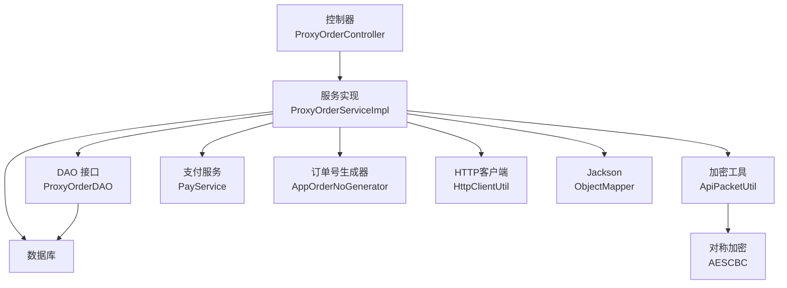
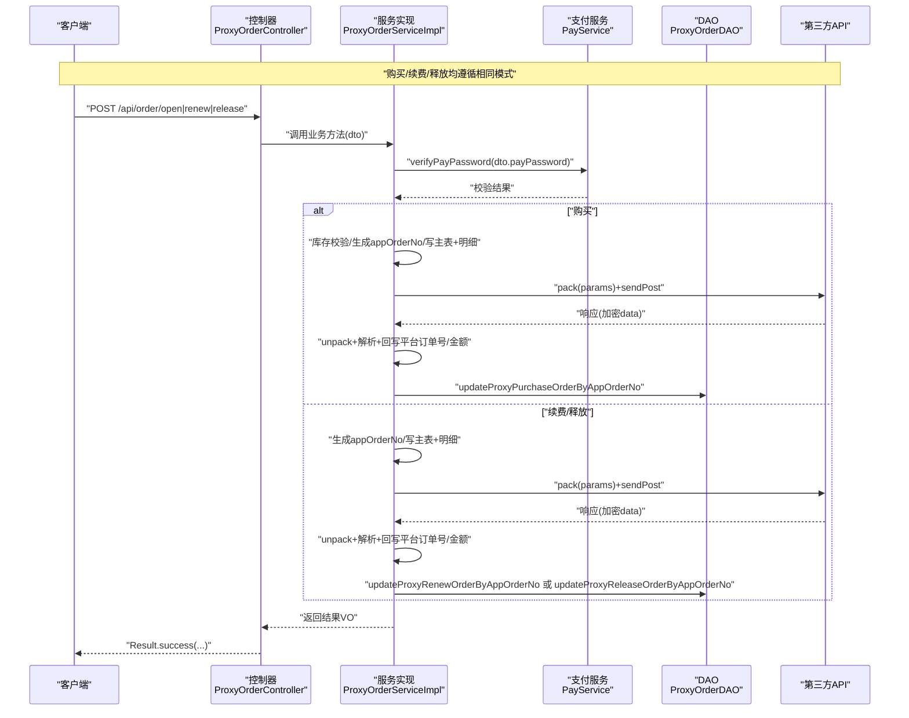
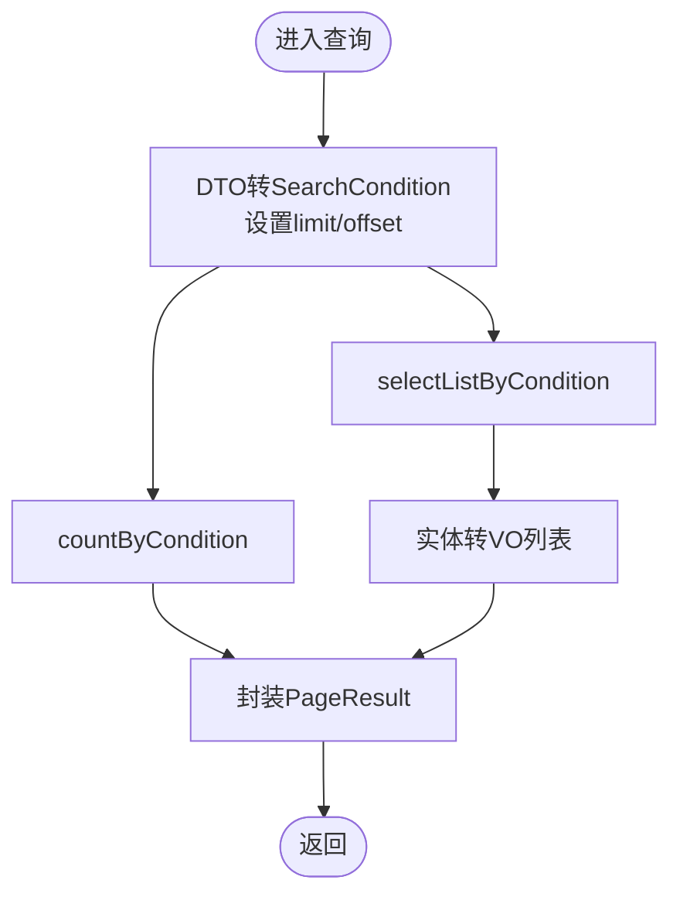
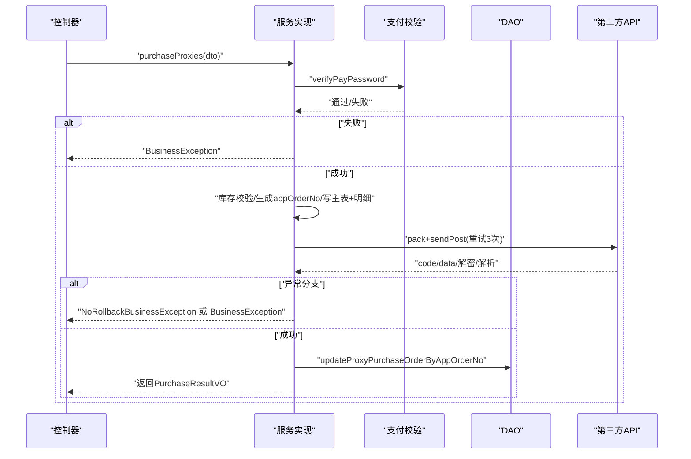
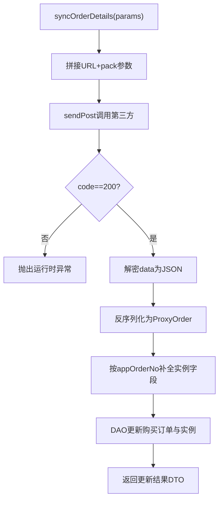
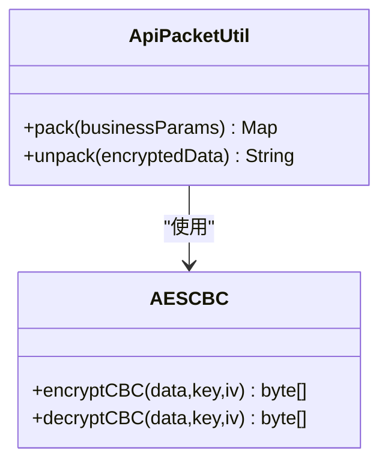
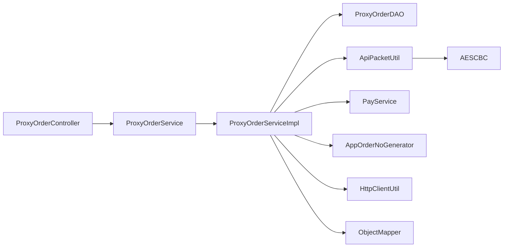

# 订单管理业务逻辑

<cite>
**本文引用的文件**
- [ProxyOrderController.java](file://src/main/java/cn/linkfast/controller/ProxyOrderController.java)
- [ProxyOrderService.java](file://src/main/java/cn/linkfast/service/ProxyOrderService.java)
- [ProxyOrderServiceImpl.java](file://src/main/java/cn/linkfast/service/impl/ProxyOrderServiceImpl.java)
- [ProxyOrder.java](file://src/main/java/cn/linkfast/entity/ProxyOrder.java)
- [ProxyOrderVO.java](file://src/main/java/cn/linkfast/vo/ProxyOrderVO.java)
- [ProxyOrderQueryDTO.java](file://src/main/java/cn/linkfast/dto/ProxyOrderQueryDTO.java)
- [ProxyOrderSearchCondition.java](file://src/main/java/cn/linkfast/dto/ProxyOrderSearchCondition.java)
- [ProxyOrderDAO.java](file://src/main/java/cn/linkfast/dao/ProxyOrderDAO.java)
- [ApiPacketUtil.java](file://src/main/java/cn/linkfast/utils/ApiPacketUtil.java)
- [AESCBC.java](file://src/main/java/cn/linkfast/utils/AESCBC.java)
- [api.properties](file://src/main/resources/api.properties)
- [BusinessException.java](file://src/main/java/cn/linkfast/exception/BusinessException.java)
- [NoRollbackBusinessException.java](file://src/main/java/cn/linkfast/exception/NoRollbackBusinessException.java)
- [创建代理订单接口-第三方.md](file://docs/api/third-party/创建代理订单接口-第三方.md)
- [代理续费接口-第三方.md](file://docs/api/third-party/代理续费接口-第三方.md)
</cite>

## 目录
1. [引言](#引言)
2. [项目结构](#项目结构)
3. [核心组件](#核心组件)
4. [架构总览](#架构总览)
5. [详细组件分析](#详细组件分析)
6. [依赖分析](#依赖分析)
7. [性能考虑](#性能考虑)
8. [故障排查指南](#故障排查指南)
9. [结论](#结论)
10. [附录](#附录)

## 引言
本文件面向订单管理业务，系统性阐述代理订单的完整生命周期：订单查询、创建（购买）、同步、续费与释放。文档重点覆盖以下方面：
- 订单状态转换机制与事务策略
- 异常处理与幂等性保障
- 订单数据模型从实体到VO的映射规则
- 第三方API集成的加密通信机制（参数打包、解密与响应处理）
- 业务规则：库存检查、支付验证、幂等性
- 查询分页实现、搜索条件构建与性能优化
- 扩展与定制指导原则

## 项目结构
围绕“控制器-服务-DAO-工具-实体-VO-DTO-异常-配置”的分层组织，核心模块如下：
- 控制器层：对外暴露REST接口，负责参数接收与结果封装
- 服务层：编排业务流程、事务控制、第三方通信与异常策略
- DAO层：数据库访问与批量写入
- 工具层：加密通信、HTTP调用、订单号生成
- 实体与VO/DTO：数据模型与前后端传输模型
- 配置：第三方接口域名、路径、密钥等
- 文档：第三方接口规范与业务约束

图表来源
- [ProxyOrderController.java:1-86](file://src/main/java/cn/linkfast/controller/ProxyOrderController.java#L1-L86)
- [ProxyOrderServiceImpl.java:1-820](file://src/main/java/cn/linkfast/service/impl/ProxyOrderServiceImpl.java#L1-L820)
- [ProxyOrderDAO.java:1-102](file://src/main/java/cn/linkfast/dao/ProxyOrderDAO.java#L1-L102)
- [ApiPacketUtil.java:1-103](file://src/main/java/cn/linkfast/utils/ApiPacketUtil.java#L1-L103)
- [AESCBC.java:1-36](file://src/main/java/cn/linkfast/utils/AESCBC.java#L1-L36)

章节来源
- [ProxyOrderController.java:1-86](file://src/main/java/cn/linkfast/controller/ProxyOrderController.java#L1-L86)
- [ProxyOrderServiceImpl.java:1-820](file://src/main/java/cn/linkfast/service/impl/ProxyOrderServiceImpl.java#L1-L820)
- [ProxyOrderDAO.java:1-102](file://src/main/java/cn/linkfast/dao/ProxyOrderDAO.java#L1-L102)
- [ApiPacketUtil.java:1-103](file://src/main/java/cn/linkfast/utils/ApiPacketUtil.java#L1-L103)
- [AESCBC.java:1-36](file://src/main/java/cn/linkfast/utils/AESCBC.java#L1-L36)

## 核心组件
- 控制器：提供订单列表查询、购买、续费、释放接口，统一返回Result包装
- 服务接口与实现：定义事务边界、幂等与异常策略，编排第三方通信
- DAO：提供订单主表与明细表的插入、更新、查询能力
- 工具：参数打包/解密、AES-CBC加解密、HTTP调用
- 数据模型：实体ProxyOrder承载订单与明细聚合；VO用于列表展示；DTO用于查询与入参

章节来源
- [ProxyOrderController.java:1-86](file://src/main/java/cn/linkfast/controller/ProxyOrderController.java#L1-L86)
- [ProxyOrderService.java:1-60](file://src/main/java/cn/linkfast/service/ProxyOrderService.java#L1-L60)
- [ProxyOrderServiceImpl.java:1-820](file://src/main/java/cn/linkfast/service/impl/ProxyOrderServiceImpl.java#L1-L820)
- [ProxyOrderDAO.java:1-102](file://src/main/java/cn/linkfast/dao/ProxyOrderDAO.java#L1-L102)
- [ProxyOrder.java:1-45](file://src/main/java/cn/linkfast/entity/ProxyOrder.java#L1-L45)
- [ProxyOrderVO.java:1-47](file://src/main/java/cn/linkfast/vo/ProxyOrderVO.java#L1-L47)
- [ProxyOrderQueryDTO.java:1-57](file://src/main/java/cn/linkfast/dto/ProxyOrderQueryDTO.java#L1-L57)
- [ProxyOrderSearchCondition.java:1-42](file://src/main/java/cn/linkfast/dto/ProxyOrderSearchCondition.java#L1-L42)

## 架构总览
订单生命周期的关键交互如下：

图表来源
- [ProxyOrderController.java:1-86](file://src/main/java/cn/linkfast/controller/ProxyOrderController.java#L1-L86)
- [ProxyOrderServiceImpl.java:1-820](file://src/main/java/cn/linkfast/service/impl/ProxyOrderServiceImpl.java#L1-L820)
- [ProxyOrderDAO.java:1-102](file://src/main/java/cn/linkfast/dao/ProxyOrderDAO.java#L1-L102)

## 详细组件分析

### 订单查询（分页、搜索条件、性能）
- 查询入口：控制器接收ProxyOrderQueryDTO，服务层将其转换为ProxyOrderSearchCondition
- 分页逻辑：仅当pageNum与pageSize均存在时生效，计算limit与offset，避免无效分页
- 查询执行：DAO返回列表与总数，服务层将实体转换为ProxyOrderVO并封装PageResult
- 性能要点：
  - 条件过滤：status、orderType、orderNo等作为查询条件，建议在数据库建立索引
  - 分页参数校验：pageNum≥1、pageSize∈[1,100]，防止超大页参数
  - 聚合查询：一次性count与select，减少往返

图表来源
- [ProxyOrderServiceImpl.java:138-154](file://src/main/java/cn/linkfast/service/impl/ProxyOrderServiceImpl.java#L138-L154)
- [ProxyOrderDAO.java:24-32](file://src/main/java/cn/linkfast/dao/ProxyOrderDAO.java#L24-L32)

章节来源
- [ProxyOrderQueryDTO.java:1-57](file://src/main/java/cn/linkfast/dto/ProxyOrderQueryDTO.java#L1-L57)
- [ProxyOrderSearchCondition.java:1-42](file://src/main/java/cn/linkfast/dto/ProxyOrderSearchCondition.java#L1-L42)
- [ProxyOrderServiceImpl.java:138-154](file://src/main/java/cn/linkfast/service/impl/ProxyOrderServiceImpl.java#L138-L154)
- [ProxyOrderDAO.java:24-32](file://src/main/java/cn/linkfast/dao/ProxyOrderDAO.java#L24-L32)

### 订单创建（购买）——完整流程与幂等性
- 支付密码校验：通过PayService验证，失败抛出业务异常
- 库存检查：逐项查询产品库存，不足则抛出业务异常
- 订单号生成：使用AppOrderNoGenerator生成唯一appOrderNo
- 主表与明细写入：先insertOrder，再批量insert明细
- 第三方调用：
  - pack业务参数（版本、加密方式、appKey、reqId、params）
  - sendPost发送请求，重试3次（连接失败场景）
  - 解析响应：code!=200、data缺失/为空、解密失败、解析失败等均按策略处理
- 结果回写：解析出orderNo与amount，回写至数据库
- 幂等性：appOrderNo作为幂等键，第三方侧保证同一订单号不重复处理

图表来源
- [ProxyOrderServiceImpl.java:196-458](file://src/main/java/cn/linkfast/service/impl/ProxyOrderServiceImpl.java#L196-L458)
- [ProxyOrderDAO.java:37-48](file://src/main/java/cn/linkfast/dao/ProxyOrderDAO.java#L37-L48)

章节来源
- [ProxyOrderServiceImpl.java:196-458](file://src/main/java/cn/linkfast/service/impl/ProxyOrderServiceImpl.java#L196-L458)
- [ProxyOrderDAO.java:37-48](file://src/main/java/cn/linkfast/dao/ProxyOrderDAO.java#L37-L48)
- [创建代理订单接口-第三方.md:1-110](file://docs/api/third-party/创建代理订单接口-第三方.md#L1-L110)

### 订单同步（从第三方拉取完整信息）
- 环境选择：根据api.properties中的env选择沙盒/生产URL
- 请求构造：pack业务参数，sendPost发送
- 响应处理：processResponse解析code与data，解密后反序列化为ProxyOrder
- 本地补全：根据appOrderNo查询本地订单与购买明细，补全实例的orderId、userId、unit、duration等字段
- 更新持久化：调用DAO更新购买订单与实例信息

图表来源
- [ProxyOrderServiceImpl.java:89-136](file://src/main/java/cn/linkfast/service/impl/ProxyOrderServiceImpl.java#L89-L136)
- [ApiPacketUtil.java:94-102](file://src/main/java/cn/linkfast/utils/ApiPacketUtil.java#L94-L102)

章节来源
- [ProxyOrderServiceImpl.java:89-136](file://src/main/java/cn/linkfast/service/impl/ProxyOrderServiceImpl.java#L89-L136)
- [ApiPacketUtil.java:94-102](file://src/main/java/cn/linkfast/utils/ApiPacketUtil.java#L94-L102)

### 订单续费
- 支付密码校验
- 生成appOrderNo与订单明细（实例号、时长、周期数等）
- pack+sendPost调用续费接口，重试3次
- 解析响应并回写平台订单号与金额
- 事务策略：noRollbackFor包含NoRollbackBusinessException，确保第三方已落库场景不回滚

章节来源
- [ProxyOrderServiceImpl.java:469-673](file://src/main/java/cn/linkfast/service/impl/ProxyOrderServiceImpl.java#L469-L673)
- [ProxyOrderDAO.java:39](file://src/main/java/cn/linkfast/dao/ProxyOrderDAO.java#L39)
- [代理续费接口-第三方.md:1-31](file://docs/api/third-party/代理续费接口-第三方.md#L1-L31)

### 订单释放
- 支付密码校验
- 生成appOrderNo与释放明细（实例号列表）
- pack+sendPost调用释放接口，重试3次
- 解析响应并回写平台订单号与金额
- 事务策略：同续费

章节来源
- [ProxyOrderServiceImpl.java:675-820](file://src/main/java/cn/linkfast/service/impl/ProxyOrderServiceImpl.java#L675-L820)
- [ProxyOrderDAO.java:93](file://src/main/java/cn/linkfast/dao/ProxyOrderDAO.java#L93)

### 订单状态转换机制与事务管理
- 订单状态：1=待处理、2=处理中、3=处理成功、4=处理失败、5=部分完成
- 事务策略：
  - 购买/续费/释放均使用@Transactional，rollbackFor=Exception，noRollbackFor=NoRollbackBusinessException
  - 对于第三方已落库但我方响应失败的场景，抛出NoRollbackBusinessException，避免重复处理
- 异常处理：
  - BusinessException：可回滚场景，统一返回错误
  - NoRollbackBusinessException：不可回滚场景，透传给上层

章节来源
- [ProxyOrder.java:24-35](file://src/main/java/cn/linkfast/entity/ProxyOrder.java#L24-L35)
- [ProxyOrderService.java:41-51](file://src/main/java/cn/linkfast/service/ProxyOrderService.java#L41-L51)
- [ProxyOrderServiceImpl.java:196-458](file://src/main/java/cn/linkfast/service/impl/ProxyOrderServiceImpl.java#L196-L458)
- [BusinessException.java:1-36](file://src/main/java/cn/linkfast/exception/BusinessException.java#L1-L36)
- [NoRollbackBusinessException.java:1-27](file://src/main/java/cn/linkfast/exception/NoRollbackBusinessException.java#L1-L27)

### 订单数据模型与VO映射
- 实体ProxyOrder：包含订单主表字段与聚合的实例/明细集合
- VO ProxyOrderVO：仅包含前端展示所需字段（平台订单号、类型、金额、实例总数、用户ID、创建时间）
- 映射规则：使用BeanUtils复制同名字段，避免敏感信息泄露与冗余字段暴露

章节来源
- [ProxyOrder.java:1-45](file://src/main/java/cn/linkfast/entity/ProxyOrder.java#L1-L45)
- [ProxyOrderVO.java:1-47](file://src/main/java/cn/linkfast/vo/ProxyOrderVO.java#L1-L47)
- [ProxyOrderServiceImpl.java:159-164](file://src/main/java/cn/linkfast/service/impl/ProxyOrderServiceImpl.java#L159-L164)

### 第三方API加密通信机制
- 参数打包：ApiPacketUtil.pack将业务参数序列化后AES-CBC加密，Base64编码，附加公共字段（version、encrypt、appKey、reqId）
- 环境与密钥：根据api.properties中的env选择沙盒/生产appKey与appSecret，并从secret派生IV
- 响应解密：ApiPacketUtil.unpack对data进行Base64解码与AES-CBC解密
- AES实现：AESCBC封装Cipher的加密/解密操作

图表来源
- [ApiPacketUtil.java:1-103](file://src/main/java/cn/linkfast/utils/ApiPacketUtil.java#L1-L103)
- [AESCBC.java:1-36](file://src/main/java/cn/linkfast/utils/AESCBC.java#L1-L36)

章节来源
- [ApiPacketUtil.java:56-90](file://src/main/java/cn/linkfast/utils/ApiPacketUtil.java#L56-L90)
- [ApiPacketUtil.java:95-102](file://src/main/java/cn/linkfast/utils/ApiPacketUtil.java#L95-L102)
- [AESCBC.java:20-30](file://src/main/java/cn/linkfast/utils/AESCBC.java#L20-L30)
- [api.properties:1-31](file://src/main/resources/api.properties#L1-L31)

### 业务规则与幂等性
- 支付验证：所有关键操作均需通过支付密码校验
- 库存检查：购买前逐项校验产品库存，不足则拒绝
- 幂等性：appOrderNo作为幂等键，第三方侧保证同一订单号不重复处理
- 时长与周期：购买/续费使用cycleTimes与duration/unit组合表达最小购买时长

章节来源
- [ProxyOrderServiceImpl.java:199-237](file://src/main/java/cn/linkfast/service/impl/ProxyOrderServiceImpl.java#L199-L237)
- [ProxyOrderServiceImpl.java:315-337](file://src/main/java/cn/linkfast/service/impl/ProxyOrderServiceImpl.java#L315-L337)
- [ProxyOrderServiceImpl.java:509-544](file://src/main/java/cn/linkfast/service/impl/ProxyOrderServiceImpl.java#L509-L544)
- [创建代理订单接口-第三方.md:59-110](file://docs/api/third-party/创建代理订单接口-第三方.md#L59-L110)
- [代理续费接口-第三方.md:8-31](file://docs/api/third-party/代理续费接口-第三方.md#L8-L31)

## 依赖分析
- 控制器依赖服务接口，服务实现依赖DAO、工具类与支付服务
- 工具类之间无循环依赖，职责清晰
- DAO接口与实现分离，便于替换与测试

图表来源
- [ProxyOrderController.java:1-86](file://src/main/java/cn/linkfast/controller/ProxyOrderController.java#L1-L86)
- [ProxyOrderService.java:1-60](file://src/main/java/cn/linkfast/service/ProxyOrderService.java#L1-L60)
- [ProxyOrderServiceImpl.java:1-820](file://src/main/java/cn/linkfast/service/impl/ProxyOrderServiceImpl.java#L1-L820)
- [ProxyOrderDAO.java:1-102](file://src/main/java/cn/linkfast/dao/ProxyOrderDAO.java#L1-L102)
- [ApiPacketUtil.java:1-103](file://src/main/java/cn/linkfast/utils/ApiPacketUtil.java#L1-L103)
- [AESCBC.java:1-36](file://src/main/java/cn/linkfast/utils/AESCBC.java#L1-L36)

章节来源
- [ProxyOrderController.java:1-86](file://src/main/java/cn/linkfast/controller/ProxyOrderController.java#L1-L86)
- [ProxyOrderService.java:1-60](file://src/main/java/cn/linkfast/service/ProxyOrderService.java#L1-L60)
- [ProxyOrderServiceImpl.java:1-820](file://src/main/java/cn/linkfast/service/impl/ProxyOrderServiceImpl.java#L1-L820)
- [ProxyOrderDAO.java:1-102](file://src/main/java/cn/linkfast/dao/ProxyOrderDAO.java#L1-L102)
- [ApiPacketUtil.java:1-103](file://src/main/java/cn/linkfast/utils/ApiPacketUtil.java#L1-L103)
- [AESCBC.java:1-36](file://src/main/java/cn/linkfast/utils/AESCBC.java#L1-L36)

## 性能考虑
- 分页参数校验与上限：pageNum≥1、pageSize∈[1,100]，避免超大页参数导致扫描过多
- 批量写入：购买/续费/释放明细采用批量插入，降低IO次数
- 异步库存刷新：购买流程中对产品信息的异步更新，避免阻塞下单主链路
- 重试策略：对连接失败场景进行指数退避重试，提升成功率
- 缓存与索引：建议在status、orderType、orderNo、appOrderNo等字段建立索引

## 故障排查指南
- 第三方响应为空或非法JSON：判定为第三方已落库场景，抛出NoRollbackBusinessException，需人工核对订单结果
- 解密失败：检查appKey/appSecret与IV派生逻辑，确认环境配置正确
- code!=200：记录第三方返回的错误码与消息，定位业务失败原因
- 连接失败：检查网络连通性与DNS解析，必要时切换环境或调整超时
- 事务回滚：确认异常类型与noRollbackFor配置，避免误回滚

章节来源
- [ProxyOrderServiceImpl.java:377-451](file://src/main/java/cn/linkfast/service/impl/ProxyOrderServiceImpl.java#L377-L451)
- [ProxyOrderServiceImpl.java:586-672](file://src/main/java/cn/linkfast/service/impl/ProxyOrderServiceImpl.java#L586-L672)
- [ProxyOrderServiceImpl.java:744-800](file://src/main/java/cn/linkfast/service/impl/ProxyOrderServiceImpl.java#L744-L800)
- [ApiPacketUtil.java:40-51](file://src/main/java/cn/linkfast/utils/ApiPacketUtil.java#L40-L51)
- [api.properties:1-31](file://src/main/resources/api.properties#L1-L31)

## 结论
本系统通过清晰的分层设计与严格的事务/异常策略，实现了代理订单从查询、创建、同步、续费到释放的全生命周期管理。加密通信与幂等性设计有效提升了安全性与可靠性。建议在生产环境中持续完善索引、监控与告警体系，并基于现有扩展点进行定制化增强。

## 附录
- 扩展与定制指导原则
  - 新增订单类型：在实体与DAO中补充相应明细表与映射，服务层扩展对应流程
  - 自定义加密算法：替换ApiPacketUtil与AESCBC实现，确保与第三方一致
  - 自定义重试策略：根据第三方SLA调整重试次数与退避策略
  - 自定义索引：针对高频查询字段建立复合索引，提升分页查询性能