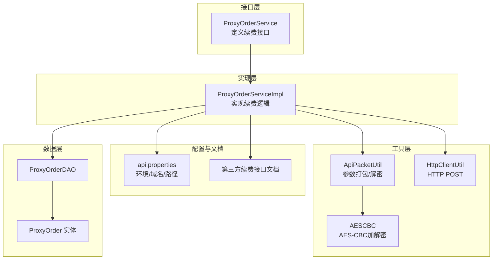
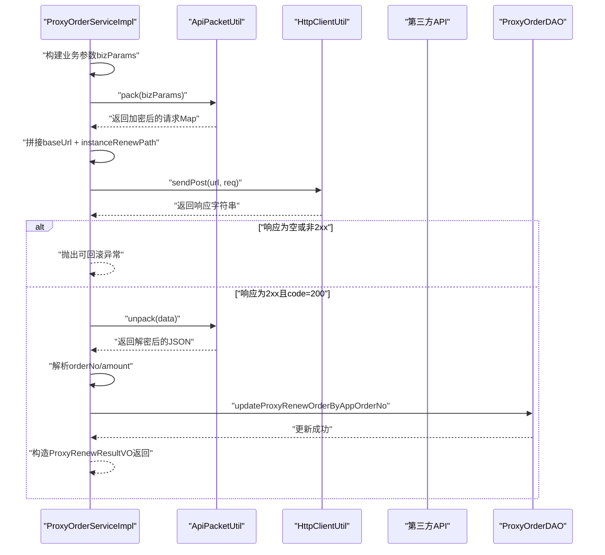
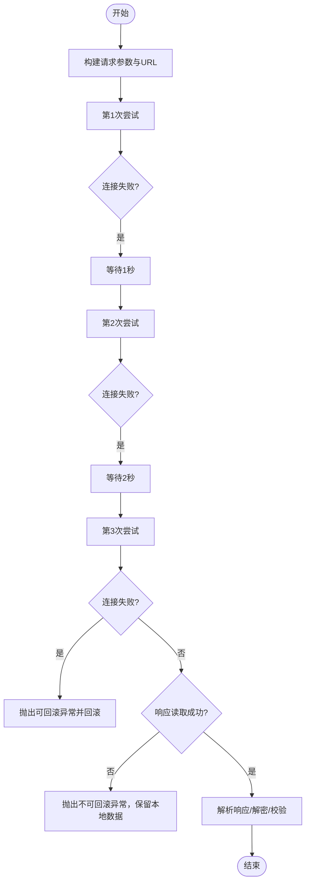
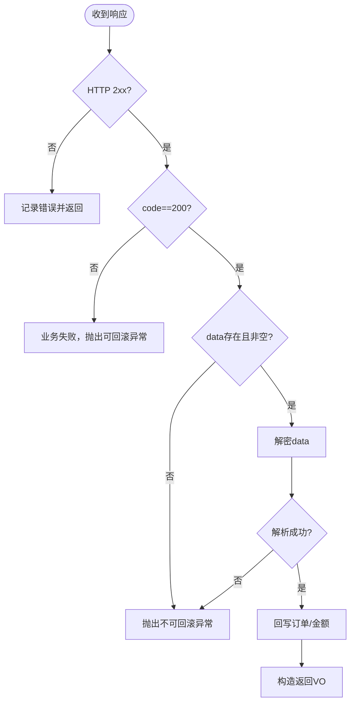
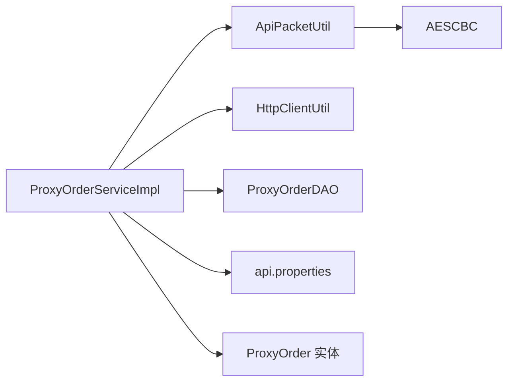

# 续费API集成

<cite>
**本文引用的文件**
- [ProxyOrderService.java](file://src/main/java/cn/linkfast/service/ProxyOrderService.java)
- [ProxyOrderServiceImpl.java](file://src/main/java/cn/linkfast/service/impl/ProxyOrderServiceImpl.java)
- [ProxyRenewDTO.java](file://src/main/java/cn/linkfast/dto/ProxyRenewDTO.java)
- [ProxyRenewItemDTO.java](file://src/main/java/cn/linkfast/dto/ProxyRenewItemDTO.java)
- [ProxyRenewResultVO.java](file://src/main/java/cn/linkfast/vo/ProxyRenewResultVO.java)
- [ApiPacketUtil.java](file://src/main/java/cn/linkfast/utils/ApiPacketUtil.java)
- [AESCBC.java](file://src/main/java/cn/linkfast/utils/AESCBC.java)
- [HttpClientUtil.java](file://src/main/java/cn/linkfast/utils/HttpClientUtil.java)
- [api.properties](file://src/main/resources/api.properties)
- [代理续费接口-第三方.md](file://docs/api/third-party/代理续费接口-第三方.md)
- [NoRollbackBusinessException.java](file://src/main/java/cn/linkfast/exception/NoRollbackBusinessException.java)
- [ProxyOrder.java](file://src/main/java/cn/linkfast/entity/ProxyOrder.java)
- [ProxyOrderDAO.java](file://src/main/java/cn/linkfast/dao/ProxyOrderDAO.java)
- [test-api.http](file://test-api.http)
</cite>

## 目录
1. [简介](#简介)
2. [项目结构](#项目结构)
3. [核心组件](#核心组件)
4. [架构总览](#架构总览)
5. [详细组件分析](#详细组件分析)
6. [依赖分析](#依赖分析)
7. [性能考虑](#性能考虑)
8. [故障排查指南](#故障排查指南)
9. [结论](#结论)
10. [附录](#附录)

## 简介
本文档面向开发者，系统化阐述“续费API集成”的完整实现，覆盖从请求参数构建、加密打包、HTTP调用、重试策略、响应处理、异常分类与回滚控制，到安全机制与调试优化建议。重点围绕以下要点展开：
- 续费请求到第三方API的完整调用链路
- instanceRenewPath 的使用与API端点配置
- 重试机制与最大重试次数限制
- 响应处理流程：状态检查、数据解密与结果解析
- 异常处理策略：可回滚与不可回滚场景
- 安全机制：参数加密与解密
- 调试技巧与性能优化建议

## 项目结构
与续费API集成直接相关的核心模块与文件如下：
- 接口与实现：ProxyOrderService、ProxyOrderServiceImpl
- DTO/VO：ProxyRenewDTO、ProxyRenewItemDTO、ProxyRenewResultVO
- 工具类：ApiPacketUtil（加密/解密）、AESCBC（AES-CBC）、HttpClientUtil（HTTP POST）
- 配置：api.properties（环境、域名、各接口路径）
- 文档：第三方接口文档（续费接口）
- 异常：NoRollbackBusinessException（不可回滚异常）
- 数据访问：ProxyOrderDAO、实体ProxyOrder
- 测试：test-api.http（示例）

图表来源
- [ProxyOrderService.java:15-61](file://src/main/java/cn/linkfast/service/ProxyOrderService.java#L15-L61)
- [ProxyOrderServiceImpl.java:500-635](file://src/main/java/cn/linkfast/service/impl/ProxyOrderServiceImpl.java#L500-L635)
- [ApiPacketUtil.java:1-106](file://src/main/java/cn/linkfast/utils/ApiPacketUtil.java#L1-L106)
- [AESCBC.java:1-36](file://src/main/java/cn/linkfast/utils/AESCBC.java#L1-L36)
- [HttpClientUtil.java:1-46](file://src/main/java/cn/linkfast/utils/HttpClientUtil.java#L1-L46)
- [api.properties:1-31](file://src/main/resources/api.properties#L1-L31)
- [ProxyOrderDAO.java:1-102](file://src/main/java/cn/linkfast/dao/ProxyOrderDAO.java#L1-L102)
- [ProxyOrder.java:1-45](file://src/main/java/cn/linkfast/entity/ProxyOrder.java#L1-L45)
- [代理续费接口-第三方.md:1-31](file://docs/api/third-party/代理续费接口-第三方.md#L1-L31)

章节来源
- [ProxyOrderService.java:15-61](file://src/main/java/cn/linkfast/service/ProxyOrderService.java#L15-L61)
- [ProxyOrderServiceImpl.java:500-635](file://src/main/java/cn/linkfast/service/impl/ProxyOrderServiceImpl.java#L500-L635)
- [api.properties:1-31](file://src/main/resources/api.properties#L1-L31)

## 核心组件
- 续费服务接口与实现
  - 接口定义了续费事务注解与方法签名，实现类负责参数构建、加密、HTTP调用、重试、响应解析与回写。
- DTO/VO
  - ProxyRenewDTO：包含支付密码与续费项列表
  - ProxyRenewItemDTO：单个实例续费参数
  - ProxyRenewResultVO：返回给前端的续费结果
- 工具类
  - ApiPacketUtil：统一进行参数加密、Base64编码与公共字段组装
  - AESCBC：AES-CBC加解密实现
  - HttpClientUtil：基于Apache HttpClient 5的POST封装
- 配置
  - api.properties：环境、域名、各接口路径（含续费路径）
- 异常
  - NoRollbackBusinessException：不可回滚异常，用于“请求已发送但响应读取失败”等场景
- 数据访问
  - ProxyOrderDAO：写入续费结果（平台订单号、金额），持久化续费明细

章节来源
- [ProxyOrderService.java:42-43](file://src/main/java/cn/linkfast/service/ProxyOrderService.java#L42-L43)
- [ProxyOrderServiceImpl.java:500-635](file://src/main/java/cn/linkfast/service/impl/ProxyOrderServiceImpl.java#L500-L635)
- [ProxyRenewDTO.java:12-26](file://src/main/java/cn/linkfast/dto/ProxyRenewDTO.java#L12-L26)
- [ProxyRenewItemDTO.java:12-18](file://src/main/java/cn/linkfast/dto/ProxyRenewItemDTO.java#L12-L18)
- [ProxyRenewResultVO.java:12-19](file://src/main/java/cn/linkfast/vo/ProxyRenewResultVO.java#L12-L19)
- [ApiPacketUtil.java:58-92](file://src/main/java/cn/linkfast/utils/ApiPacketUtil.java#L58-L92)
- [AESCBC.java:19-30](file://src/main/java/cn/linkfast/utils/AESCBC.java#L19-L30)
- [HttpClientUtil.java:27-44](file://src/main/java/cn/linkfast/utils/HttpClientUtil.java#L27-L44)
- [api.properties:28-29](file://src/main/resources/api.properties#L28-L29)
- [NoRollbackBusinessException.java:11-26](file://src/main/java/cn/linkfast/exception/NoRollbackBusinessException.java#L11-L26)
- [ProxyOrderDAO.java:39-39](file://src/main/java/cn/linkfast/dao/ProxyOrderDAO.java#L39-L39)

## 架构总览
下图展示了从服务层到第三方API的调用链与关键处理步骤。

图表来源
- [ProxyOrderServiceImpl.java:502-630](file://src/main/java/cn/linkfast/service/impl/ProxyOrderServiceImpl.java#L502-L630)
- [ApiPacketUtil.java:58-92](file://src/main/java/cn/linkfast/utils/ApiPacketUtil.java#L58-L92)
- [HttpClientUtil.java:27-44](file://src/main/java/cn/linkfast/utils/HttpClientUtil.java#L27-L44)
- [ProxyOrderDAO.java:39-39](file://src/main/java/cn/linkfast/dao/ProxyOrderDAO.java#L39-L39)

## 详细组件分析

### 续费请求参数构建与加密打包
- 业务参数构建
  - 从续费项列表组装实例数组，包含实例编号、时长、周期数等字段
  - 附加渠道商订单号（appOrderNo），作为幂等与对账依据
- 加密打包
  - 使用ApiPacketUtil对业务参数进行JSON序列化、AES-CBC加密、Base64编码
  - 统一添加版本号、加密方式、appKey、随机reqId等公共字段
- HTTP请求发送
  - 使用HttpClientUtil以JSON方式POST至拼接后的URL

章节来源
- [ProxyOrderServiceImpl.java:502-520](file://src/main/java/cn/linkfast/service/impl/ProxyOrderServiceImpl.java#L502-L520)
- [ApiPacketUtil.java:58-92](file://src/main/java/cn/linkfast/utils/ApiPacketUtil.java#L58-L92)
- [HttpClientUtil.java:27-44](file://src/main/java/cn/linkfast/utils/HttpClientUtil.java#L27-L44)

### API端点配置与instanceRenewPath
- 环境与域名
  - 通过api.properties配置环境（prod/sandbox）、生产/沙箱域名
- 接口路径
  - 续费接口路径：api.ipv.path.instance_renew=/api/open/app/instance/renew/v2
- URL拼接
  - baseUrl + instanceRenewPath构成最终请求URL

章节来源
- [api.properties:28-29](file://src/main/resources/api.properties#L28-L29)
- [ProxyOrderServiceImpl.java:518-518](file://src/main/java/cn/linkfast/service/impl/ProxyOrderServiceImpl.java#L518-L518)

### 重试机制与最大重试次数
- 重试策略
  - 最大重试3次
  - 连接失败（ConnectException/UnknownHostException）：可安全重试，带递增延迟
  - 请求已发送但响应读取失败：不可回滚，抛出不可回滚异常
- 回滚控制
  - 事务注解：@Transactional(rollbackFor = Exception.class, noRollbackFor = NoRollbackBusinessException.class)
  - 重试3次仍失败：抛出可回滚异常，触发本地数据回滚

图表来源
- [ProxyOrderServiceImpl.java:522-550](file://src/main/java/cn/linkfast/service/impl/ProxyOrderServiceImpl.java#L522-L550)
- [ProxyOrderServiceImpl.java:540-544](file://src/main/java/cn/linkfast/service/impl/ProxyOrderServiceImpl.java#L540-L544)
- [ProxyOrderServiceImpl.java:547-550](file://src/main/java/cn/linkfast/service/impl/ProxyOrderServiceImpl.java#L547-L550)
- [NoRollbackBusinessException.java:11-26](file://src/main/java/cn/linkfast/exception/NoRollbackBusinessException.java#L11-L26)

章节来源
- [ProxyOrderServiceImpl.java:522-550](file://src/main/java/cn/linkfast/service/impl/ProxyOrderServiceImpl.java#L522-L550)
- [ProxyOrderServiceImpl.java:540-544](file://src/main/java/cn/linkfast/service/impl/ProxyOrderServiceImpl.java#L540-L544)
- [ProxyOrderServiceImpl.java:547-550](file://src/main/java/cn/linkfast/service/impl/ProxyOrderServiceImpl.java#L547-L550)
- [ProxyOrderService.java:42-43](file://src/main/java/cn/linkfast/service/ProxyOrderService.java#L42-L43)

### 响应处理流程
- 响应状态检查
  - 非2xx：返回包含状态码的JSON，便于按业务code解析
  - 2xx：进入业务解析
- 数据解密
  - 从响应中提取data字段，Base64解码后AES-CBC解密
- 结果解析
  - 提取平台订单号（orderNo）、金额（amount），回写数据库
  - 构造返回VO供上层使用

图表来源
- [HttpClientUtil.java:32-42](file://src/main/java/cn/linkfast/utils/HttpClientUtil.java#L32-L42)
- [ProxyOrderServiceImpl.java:560-630](file://src/main/java/cn/linkfast/service/impl/ProxyOrderServiceImpl.java#L560-L630)
- [ApiPacketUtil.java:97-105](file://src/main/java/cn/linkfast/utils/ApiPacketUtil.java#L97-L105)

章节来源
- [HttpClientUtil.java:32-42](file://src/main/java/cn/linkfast/utils/HttpClientUtil.java#L32-L42)
- [ProxyOrderServiceImpl.java:560-630](file://src/main/java/cn/linkfast/service/impl/ProxyOrderServiceImpl.java#L560-L630)
- [ApiPacketUtil.java:97-105](file://src/main/java/cn/linkfast/utils/ApiPacketUtil.java#L97-L105)

### 异常处理策略与回滚控制
- 可回滚场景
  - 连接失败重试3次仍失败
  - 响应非2xx或业务code!=200
  - 响应为空字符串
- 不可回滚场景
  - 请求已发送但响应读取失败（第三方可能已落库）
  - 响应JSON非法
  - data缺失/为空
  - 解密失败
  - 解密后数据解析失败（如缺少orderNo/amount）
- 事务控制
  - 使用noRollbackFor指定不可回滚异常类型，确保第三方已落库时保留本地数据

章节来源
- [ProxyOrderServiceImpl.java:540-544](file://src/main/java/cn/linkfast/service/impl/ProxyOrderServiceImpl.java#L540-L544)
- [ProxyOrderServiceImpl.java:555-558](file://src/main/java/cn/linkfast/service/impl/ProxyOrderServiceImpl.java#L555-L558)
- [ProxyOrderServiceImpl.java:564-568](file://src/main/java/cn/linkfast/service/impl/ProxyOrderServiceImpl.java#L564-L568)
- [ProxyOrderServiceImpl.java:580-588](file://src/main/java/cn/linkfast/service/impl/ProxyOrderServiceImpl.java#L580-L588)
- [ProxyOrderServiceImpl.java:590-597](file://src/main/java/cn/linkfast/service/impl/ProxyOrderServiceImpl.java#L590-L597)
- [ProxyOrderServiceImpl.java:617-620](file://src/main/java/cn/linkfast/service/impl/ProxyOrderServiceImpl.java#L617-L620)
- [ProxyOrderService.java:42-43](file://src/main/java/cn/linkfast/service/ProxyOrderService.java#L42-L43)
- [NoRollbackBusinessException.java:11-26](file://src/main/java/cn/linkfast/exception/NoRollbackBusinessException.java#L11-L26)

### 安全机制：参数加密与签名验证
- 参数加密
  - 使用AES-CBC对业务参数进行加密，IV来自appSecret前16位
  - Base64编码后作为请求体的一部分
- 签名验证
  - 当前实现未见显式签名字段生成与校验逻辑
  - 若第三方需要签名，请在ApiPacketUtil中扩展签名字段并校验

章节来源
- [ApiPacketUtil.java:58-92](file://src/main/java/cn/linkfast/utils/ApiPacketUtil.java#L58-L92)
- [AESCBC.java:19-30](file://src/main/java/cn/linkfast/utils/AESCBC.java#L19-L30)
- [api.properties:26-31](file://src/main/resources/api.properties#L26-L31)

### 数据模型与DAO交互
- 续费结果回写
  - 通过ProxyOrderDAO.updateProxyRenewOrderByAppOrderNo写入平台订单号与金额
- 续费明细持久化
  - 在事务内先插入主订单，再批量插入续费明细项

章节来源
- [ProxyOrderDAO.java:39-39](file://src/main/java/cn/linkfast/dao/ProxyOrderDAO.java#L39-L39)
- [ProxyOrderServiceImpl.java:500-501](file://src/main/java/cn/linkfast/service/impl/ProxyOrderServiceImpl.java#L500-L501)

## 依赖分析
- 组件耦合
  - ProxyOrderServiceImpl依赖ApiPacketUtil、HttpClientUtil、ProxyOrderDAO、api.properties
  - ApiPacketUtil依赖AESCBC与配置（appKey/appSecret）
- 外部依赖
  - Apache HttpClient 5（HTTP客户端）
  - Jackson（JSON解析）
- 潜在循环依赖
  - 未发现循环依赖迹象

图表来源
- [ProxyOrderServiceImpl.java:500-635](file://src/main/java/cn/linkfast/service/impl/ProxyOrderServiceImpl.java#L500-L635)
- [ApiPacketUtil.java:1-106](file://src/main/java/cn/linkfast/utils/ApiPacketUtil.java#L1-L106)
- [AESCBC.java:1-36](file://src/main/java/cn/linkfast/utils/AESCBC.java#L1-L36)
- [HttpClientUtil.java:1-46](file://src/main/java/cn/linkfast/utils/HttpClientUtil.java#L1-L46)
- [ProxyOrderDAO.java:1-102](file://src/main/java/cn/linkfast/dao/ProxyOrderDAO.java#L1-L102)
- [ProxyOrder.java:1-45](file://src/main/java/cn/linkfast/entity/ProxyOrder.java#L1-L45)
- [api.properties:1-31](file://src/main/resources/api.properties#L1-L31)

章节来源
- [ProxyOrderServiceImpl.java:500-635](file://src/main/java/cn/linkfast/service/impl/ProxyOrderServiceImpl.java#L500-L635)
- [ApiPacketUtil.java:1-106](file://src/main/java/cn/linkfast/utils/ApiPacketUtil.java#L1-L106)
- [HttpClientUtil.java:1-46](file://src/main/java/cn/linkfast/utils/HttpClientUtil.java#L1-L46)
- [ProxyOrderDAO.java:1-102](file://src/main/java/cn/linkfast/dao/ProxyOrderDAO.java#L1-L102)

## 性能考虑
- 重试延迟策略
  - 采用递增等待（1s、2s、3s）降低第三方压力，避免雪崩
- HTTP连接复用
  - 使用默认客户端，建议结合连接池与超时配置优化吞吐
- 日志与监控
  - 关键路径增加埋点（请求耗时、重试次数、解密成功率）
- 批量与并发
  - 单笔续费为串行，若需批量，建议在上层控制并发度并做好幂等

## 故障排查指南
- 常见问题定位
  - 连接失败：检查网络、DNS、防火墙与代理
  - 响应为空：确认第三方是否已落库，必要时通过回调或查询接口核对
  - 解密失败：核对appKey/appSecret与IV（appSecret前16位）
  - 业务失败：检查appOrderNo是否重复、实例编号是否有效
- 调试建议
  - 打开HTTP与JSON日志，记录请求/响应体
  - 使用test-api.http模拟请求，逐步缩小范围
  - 对比第三方文档与实际请求参数结构

章节来源
- [ProxyOrderServiceImpl.java:522-550](file://src/main/java/cn/linkfast/service/impl/ProxyOrderServiceImpl.java#L522-L550)
- [ProxyOrderServiceImpl.java:555-558](file://src/main/java/cn/linkfast/service/impl/ProxyOrderServiceImpl.java#L555-L558)
- [ProxyOrderServiceImpl.java:590-597](file://src/main/java/cn/linkfast/service/impl/ProxyOrderServiceImpl.java#L590-L597)
- [test-api.http:1-3](file://test-api.http#L1-L3)

## 结论
续费API集成通过清晰的参数构建、统一的加密打包、稳健的重试与异常处理策略，实现了与第三方API的可靠对接。借助不可回滚异常与事务控制，系统在“请求已发送但响应失败”的高风险场景下仍能保证数据一致性。建议在现有基础上补充签名机制与连接池配置，并持续完善监控与告警体系。

## 附录
- 第三方接口文档（续费）
  - 请求路径：/api/open/app/instance/renew/v2
  - 请求参数：appOrderNo、instances（含instanceNo、duration、cycleTimes）
  - 返回字段：orderNo、appOrderNo、amount
- 示例HTTP请求
  - 可参考test-api.http中的请求格式进行续费接口联调

章节来源
- [代理续费接口-第三方.md:1-31](file://docs/api/third-party/代理续费接口-第三方.md#L1-L31)
- [test-api.http:1-3](file://test-api.http#L1-L3)