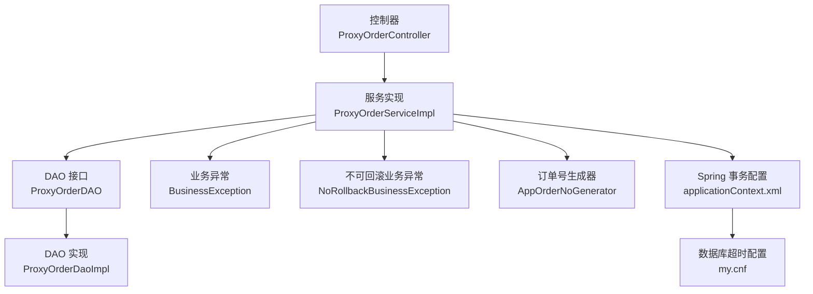
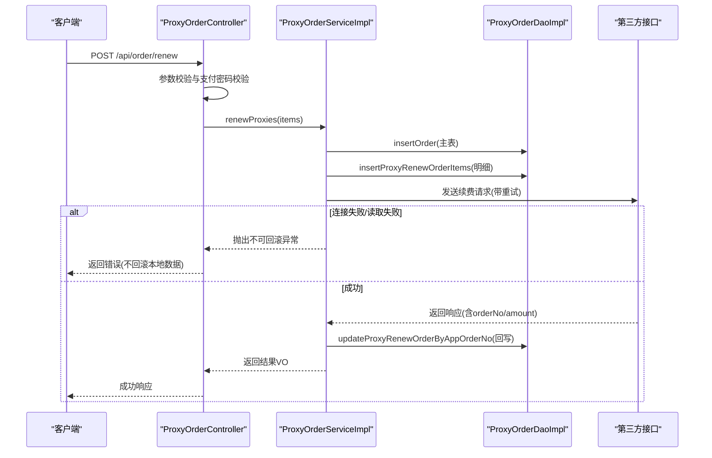
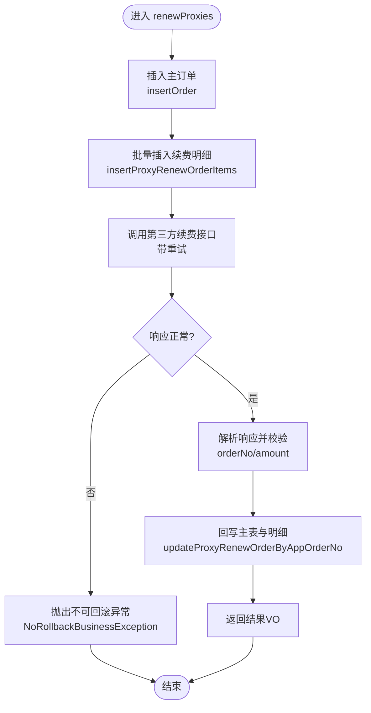
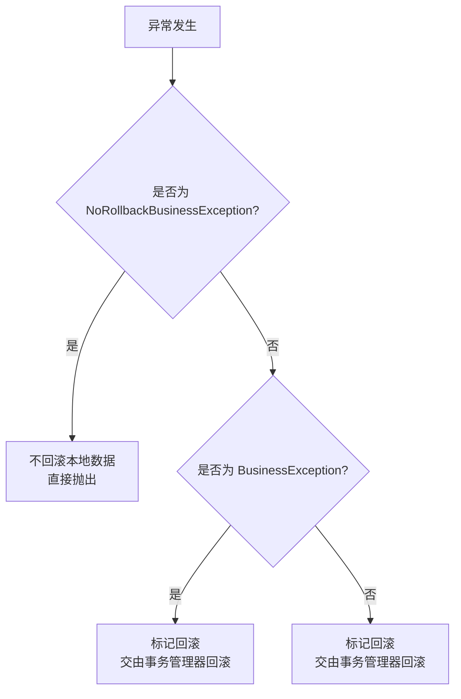
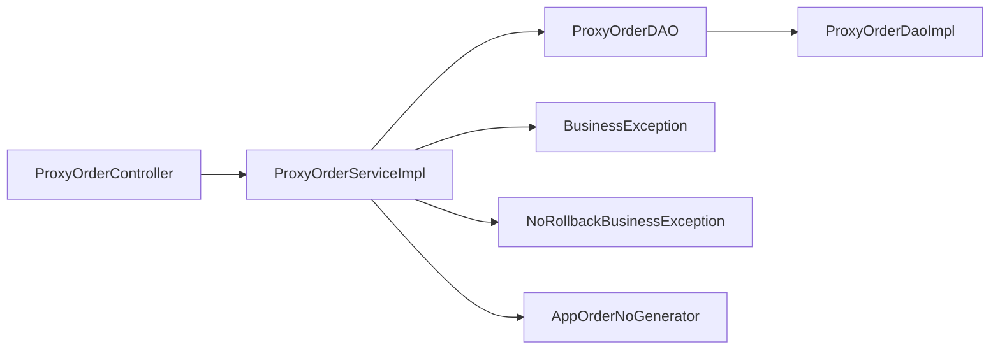

# 续费事务管理

<cite>
**本文引用的文件**
- [ProxyOrderService.java](file://src/main/java/cn/linkfast/service/ProxyOrderService.java)
- [ProxyOrderServiceImpl.java](file://src/main/java/cn/linkfast/service/impl/ProxyOrderServiceImpl.java)
- [ProxyOrderController.java](file://src/main/java/cn/linkfast/controller/ProxyOrderController.java)
- [ProxyRenewDTO.java](file://src/main/java/cn/linkfast/dto/ProxyRenewDTO.java)
- [ProxyRenewItemDTO.java](file://src/main/java/cn/linkfast/dto/ProxyRenewItemDTO.java)
- [ProxyRenewResultVO.java](file://src/main/java/cn/linkfast/vo/ProxyRenewResultVO.java)
- [BusinessException.java](file://src/main/java/cn/linkfast/exception/BusinessException.java)
- [NoRollbackBusinessException.java](file://src/main/java/cn/linkfast/exception/NoRollbackBusinessException.java)
- [ProxyOrderDAO.java](file://src/main/java/cn/linkfast/dao/ProxyOrderDAO.java)
- [ProxyOrderDaoImpl.java](file://src/main/java/cn/linkfast/dao/impl/ProxyOrderDaoImpl.java)
- [AppOrderNoGenerator.java](file://src/main/java/cn/linkfast/utils/AppOrderNoGenerator.java)
- [applicationContext.xml](file://src/main/resources/applicationContext.xml)
- [my.cnf](file://docs/database/my.cnf)
</cite>

## 目录
1. [简介](#简介)
2. [项目结构](#项目结构)
3. [核心组件](#核心组件)
4. [架构总览](#架构总览)
5. [详细组件分析](#详细组件分析)
6. [依赖分析](#依赖分析)
7. [性能考量](#性能考量)
8. [故障排查指南](#故障排查指南)
9. [结论](#结论)
10. [附录](#附录)

## 简介
本文件围绕“续费事务管理”主题，系统化阐述续费流程中的事务边界、事务传播行为、异常分类与处理策略、事务回滚触发条件与范围、以及与之配套的连接池与数据库超时配置。文档以代码为依据，结合序列图与流程图，帮助开发者快速理解并正确使用事务注解，确保数据一致性与业务完整性。

## 项目结构
与续费事务管理直接相关的模块与文件如下：
- 控制层：ProxyOrderController 提供对外接口，负责参数校验与异常兜底
- 服务层：ProxyOrderServiceImpl 实现续费主流程，包含事务注解与第三方交互
- 异常体系：BusinessException（可回滚）、NoRollbackBusinessException（不可回滚）
- DAO 层：ProxyOrderDAO/ProxyOrderDaoImpl 负责数据库持久化
- 工具与配置：AppOrderNoGenerator 生成订单号；Spring 事务与连接池配置位于 applicationContext.xml；数据库超时参数位于 my.cnf

图表来源
- [ProxyOrderController.java:47-67](file://src/main/java/cn/linkfast/controller/ProxyOrderController.java#L47-L67)
- [ProxyOrderServiceImpl.java:469-635](file://src/main/java/cn/linkfast/service/impl/ProxyOrderServiceImpl.java#L469-L635)
- [ProxyOrderDAO.java:39-39](file://src/main/java/cn/linkfast/dao/ProxyOrderDAO.java#L39-L39)
- [ProxyOrderDaoImpl.java:191-204](file://src/main/java/cn/linkfast/dao/impl/ProxyOrderDaoImpl.java#L191-L204)
- [BusinessException.java:6-36](file://src/main/java/cn/linkfast/exception/BusinessException.java#L6-L36)
- [NoRollbackBusinessException.java:12-26](file://src/main/java/cn/linkfast/exception/NoRollbackBusinessException.java#L12-L26)
- [AppOrderNoGenerator.java:34-36](file://src/main/java/cn/linkfast/utils/AppOrderNoGenerator.java#L34-L36)
- [applicationContext.xml:59-66](file://src/main/resources/applicationContext.xml#L59-L66)
- [my.cnf:32-42](file://docs/database/my.cnf#L32-L42)

章节来源
- [ProxyOrderController.java:47-67](file://src/main/java/cn/linkfast/controller/ProxyOrderController.java#L47-L67)
- [ProxyOrderServiceImpl.java:469-635](file://src/main/java/cn/linkfast/service/impl/ProxyOrderServiceImpl.java#L469-L635)
- [ProxyOrderDAO.java:39-39](file://src/main/java/cn/linkfast/dao/ProxyOrderDAO.java#L39-L39)
- [ProxyOrderDaoImpl.java:191-204](file://src/main/java/cn/linkfast/dao/impl/ProxyOrderDaoImpl.java#L191-L204)
- [BusinessException.java:6-36](file://src/main/java/cn/linkfast/exception/BusinessException.java#L6-L36)
- [NoRollbackBusinessException.java:12-26](file://src/main/java/cn/linkfast/exception/NoRollbackBusinessException.java#L12-L26)
- [AppOrderNoGenerator.java:34-36](file://src/main/java/cn/linkfast/utils/AppOrderNoGenerator.java#L34-L36)
- [applicationContext.xml:59-66](file://src/main/resources/applicationContext.xml#L59-L66)
- [my.cnf:32-42](file://docs/database/my.cnf#L32-L42)

## 核心组件
- 续费服务接口与实现
  - 接口定义：在接口上声明事务注解，明确回滚范围与传播行为
  - 实现类：具体实现续费流程，包含本地数据持久化与第三方交互
- DTO/VO
  - 输入 DTO：ProxyRenewDTO、ProxyRenewItemDTO
  - 输出 VO：ProxyRenewResultVO
- 异常体系
  - BusinessException：可回滚的业务异常
  - NoRollbackBusinessException：不可回滚的业务异常，用于“对方已落库”的场景
- DAO 层
  - 续费专用更新方法：updateProxyRenewOrderByAppOrderNo
  - 续费明细批量插入：insertProxyRenewOrderItems
- 订单号生成器
  - generateRenewOrderId：生成续费订单号，确保幂等与可追踪
- Spring 事务与连接池配置
  - 事务管理器与注解驱动
  - 连接池保活、回收与泄露检测
- 数据库超时参数
  - wait_timeout、connect_timeout、net_read_timeout、net_write_timeout

章节来源
- [ProxyOrderService.java:42-43](file://src/main/java/cn/linkfast/service/ProxyOrderService.java#L42-L43)
- [ProxyOrderServiceImpl.java:469-635](file://src/main/java/cn/linkfast/service/impl/ProxyOrderServiceImpl.java#L469-L635)
- [ProxyRenewDTO.java:13-25](file://src/main/java/cn/linkfast/dto/ProxyRenewDTO.java#L13-L25)
- [ProxyRenewItemDTO.java:13-18](file://src/main/java/cn/linkfast/dto/ProxyRenewItemDTO.java#L13-L18)
- [ProxyRenewResultVO.java:13-18](file://src/main/java/cn/linkfast/vo/ProxyRenewResultVO.java#L13-L18)
- [ProxyOrderDAO.java:39-39](file://src/main/java/cn/linkfast/dao/ProxyOrderDAO.java#L39-L39)
- [ProxyOrderDaoImpl.java:191-204](file://src/main/java/cn/linkfast/dao/impl/ProxyOrderDaoImpl.java#L191-L204)
- [AppOrderNoGenerator.java:34-36](file://src/main/java/cn/linkfast/utils/AppOrderNoGenerator.java#L34-L36)
- [applicationContext.xml:59-66](file://src/main/resources/applicationContext.xml#L59-L66)
- [my.cnf:32-42](file://docs/database/my.cnf#L32-L42)

## 架构总览
续费事务管理采用“服务层事务边界 + DAO 层原子持久化”的设计，确保在第三方交互失败时，本地数据要么全部成功，要么全部回滚。对于“对方已落库”的场景，通过不可回滚异常避免误回滚本地已插入数据。

图表来源
- [ProxyOrderController.java:47-67](file://src/main/java/cn/linkfast/controller/ProxyOrderController.java#L47-L67)
- [ProxyOrderServiceImpl.java:469-635](file://src/main/java/cn/linkfast/service/impl/ProxyOrderServiceImpl.java#L469-L635)
- [ProxyOrderDaoImpl.java:191-204](file://src/main/java/cn/linkfast/dao/impl/ProxyOrderDaoImpl.java#L191-L204)

## 详细组件分析

### 续费事务边界与传播行为
- 事务注解位置与作用域
  - 接口层：@Transactional(rollbackFor = Exception.class, noRollbackFor = NoRollbackBusinessException.class)
  - 实现层：renewProxies 方法被标注，覆盖接口层定义
- 传播行为
  - 默认传播行为为 REQUIRED，即若当前存在事务则加入，否则新建事务
- 回滚范围
  - rollbackFor = Exception.class：任何运行时异常均触发回滚
  - noRollbackFor = NoRollbackBusinessException.class：此类异常不触发回滚

图表来源
- [ProxyOrderService.java:42-43](file://src/main/java/cn/linkfast/service/ProxyOrderService.java#L42-L43)
- [ProxyOrderServiceImpl.java:469-635](file://src/main/java/cn/linkfast/service/impl/ProxyOrderServiceImpl.java#L469-L635)
- [ProxyOrderDaoImpl.java:191-204](file://src/main/java/cn/linkfast/dao/impl/ProxyOrderDaoImpl.java#L191-L204)

章节来源
- [ProxyOrderService.java:42-43](file://src/main/java/cn/linkfast/service/ProxyOrderService.java#L42-L43)
- [ProxyOrderServiceImpl.java:469-635](file://src/main/java/cn/linkfast/service/impl/ProxyOrderServiceImpl.java#L469-L635)

### 可回滚与不可回滚异常处理策略
- BusinessException（可回滚）
  - 触发条件：连接未建立、第三方返回非200、响应为空、响应JSON非法、解密失败、orderNo/amount缺失等场景
  - 处理方式：@Transactional 自动回滚本地数据
- NoRollbackBusinessException（不可回滚）
  - 触发条件：请求已发送但响应读取失败，第三方可能已落库
  - 处理方式：不回滚本地数据，直接向上抛出，由控制器返回错误提示
- 控制器兜底
  - 对于 BusinessException：记录错误并返回通用错误消息
  - 对于其他异常：记录异常并返回兜底错误消息

图表来源
- [ProxyOrderServiceImpl.java:540-544](file://src/main/java/cn/linkfast/service/impl/ProxyOrderServiceImpl.java#L540-L544)
- [ProxyOrderServiceImpl.java:547-550](file://src/main/java/cn/linkfast/service/impl/ProxyOrderServiceImpl.java#L547-L550)
- [ProxyOrderController.java:60-66](file://src/main/java/cn/linkfast/controller/ProxyOrderController.java#L60-L66)

章节来源
- [BusinessException.java:6-36](file://src/main/java/cn/linkfast/exception/BusinessException.java#L6-L36)
- [NoRollbackBusinessException.java:12-26](file://src/main/java/cn/linkfast/exception/NoRollbackBusinessException.java#L12-L26)
- [ProxyOrderServiceImpl.java:540-544](file://src/main/java/cn/linkfast/service/impl/ProxyOrderServiceImpl.java#L540-L544)
- [ProxyOrderServiceImpl.java:547-550](file://src/main/java/cn/linkfast/service/impl/ProxyOrderServiceImpl.java#L547-L550)
- [ProxyOrderController.java:60-66](file://src/main/java/cn/linkfast/controller/ProxyOrderController.java#L60-L66)

### 事务回滚触发条件与回滚范围
- 触发条件
  - 运行时异常：默认回滚
  - 显式抛出 BusinessException：回滚
  - 显式抛出 NoRollbackBusinessException：不回滚
- 回滚范围
  - 仅限当前事务内的数据库操作（主表与明细表）
  - 若第三方已落库，通过不可回滚异常避免误回滚本地数据

章节来源
- [ProxyOrderService.java:42-43](file://src/main/java/cn/linkfast/service/ProxyOrderService.java#L42-L43)
- [ProxyOrderServiceImpl.java:540-544](file://src/main/java/cn/linkfast/service/impl/ProxyOrderServiceImpl.java#L540-L544)
- [ProxyOrderServiceImpl.java:547-550](file://src/main/java/cn/linkfast/service/impl/ProxyOrderServiceImpl.java#L547-L550)

### 续费流程中的数据一致性保障
- 本地持久化顺序
  - 先插入主订单表，再批量插入续费明细表
  - 成功后回写第三方返回的 orderNo 与 amount
- 并发控制
  - 通过数据库唯一索引与 ON DUPLICATE KEY UPDATE 保证幂等
  - 通过事务隔离级别与锁机制避免脏读与幻读

章节来源
- [ProxyOrderServiceImpl.java:484-500](file://src/main/java/cn/linkfast/service/impl/ProxyOrderServiceImpl.java#L484-L500)
- [ProxyOrderDaoImpl.java:191-204](file://src/main/java/cn/linkfast/dao/impl/ProxyOrderDaoImpl.java#L191-L204)

### 事务超时与并发控制策略
- 事务超时
  - 当前代码未显式设置超时，遵循 Spring 默认行为
  - 如需显式超时，可在 @Transactional(timeout = N) 中配置
- 并发控制
  - 连接池保活与空闲回收：减少连接失效导致的重试与回滚
  - 泄露检测：防止长时间占用连接导致资源枯竭
  - 数据库层面：通过唯一约束与批量更新保证幂等

章节来源
- [applicationContext.xml:29-52](file://src/main/resources/applicationContext.xml#L29-L52)
- [my.cnf:32-42](file://docs/database/my.cnf#L32-L42)

## 依赖分析
- 控制器依赖服务层，服务层依赖 DAO 层与工具类
- 服务层对异常类型有明确区分，确保事务回滚策略正确
- DAO 层提供续费专用的回写与批量插入方法

图表来源
- [ProxyOrderController.java:25-26](file://src/main/java/cn/linkfast/controller/ProxyOrderController.java#L25-L26)
- [ProxyOrderServiceImpl.java:39-45](file://src/main/java/cn/linkfast/service/impl/ProxyOrderServiceImpl.java#L39-L45)
- [ProxyOrderDAO.java:39-39](file://src/main/java/cn/linkfast/dao/ProxyOrderDAO.java#L39-L39)
- [ProxyOrderDaoImpl.java:191-204](file://src/main/java/cn/linkfast/dao/impl/ProxyOrderDaoImpl.java#L191-L204)
- [BusinessException.java:6-36](file://src/main/java/cn/linkfast/exception/BusinessException.java#L6-L36)
- [NoRollbackBusinessException.java:12-26](file://src/main/java/cn/linkfast/exception/NoRollbackBusinessException.java#L12-L26)
- [AppOrderNoGenerator.java:34-36](file://src/main/java/cn/linkfast/utils/AppOrderNoGenerator.java#L34-L36)

章节来源
- [ProxyOrderController.java:25-26](file://src/main/java/cn/linkfast/controller/ProxyOrderController.java#L25-L26)
- [ProxyOrderServiceImpl.java:39-45](file://src/main/java/cn/linkfast/service/impl/ProxyOrderServiceImpl.java#L39-L45)
- [ProxyOrderDAO.java:39-39](file://src/main/java/cn/linkfast/dao/ProxyOrderDAO.java#L39-L39)
- [ProxyOrderDaoImpl.java:191-204](file://src/main/java/cn/linkfast/dao/impl/ProxyOrderDaoImpl.java#L191-L204)
- [BusinessException.java:6-36](file://src/main/java/cn/linkfast/exception/BusinessException.java#L6-L36)
- [NoRollbackBusinessException.java:12-26](file://src/main/java/cn/linkfast/exception/NoRollbackBusinessException.java#L12-L26)
- [AppOrderNoGenerator.java:34-36](file://src/main/java/cn/linkfast/utils/AppOrderNoGenerator.java#L34-L36)

## 性能考量
- 连接池优化
  - 保活与空闲回收策略降低连接失效概率，减少重试次数
  - 泄露检测与超时配置避免资源浪费
- 批量操作
  - 批量插入续费明细，减少往返次数
  - 使用 ON DUPLICATE KEY UPDATE 保证幂等
- 超时与重试
  - 对第三方接口进行有限重试，避免长时间占用事务
  - 对于“已发送但读取失败”的场景，采用不可回滚策略，避免无效重试

章节来源
- [applicationContext.xml:29-52](file://src/main/resources/applicationContext.xml#L29-L52)
- [ProxyOrderDaoImpl.java:418-444](file://src/main/java/cn/linkfast/dao/impl/ProxyOrderDaoImpl.java#L418-L444)
- [ProxyOrderServiceImpl.java:524-544](file://src/main/java/cn/linkfast/service/impl/ProxyOrderServiceImpl.java#L524-L544)

## 故障排查指南
- 常见问题定位
  - 连接失败：检查网络与第三方可达性，关注重试日志
  - 响应为空/非法：检查第三方返回格式与解密逻辑
  - 对方已落库但我方失败：确认是否抛出不可回滚异常
- 日志与告警
  - 服务层记录关键步骤与异常堆栈
  - 控制器记录错误信息并返回统一格式
- 事务与连接池
  - 检查事务管理器配置与注解驱动是否生效
  - 检查连接池保活与泄露检测配置是否合理

章节来源
- [ProxyOrderServiceImpl.java:540-544](file://src/main/java/cn/linkfast/service/impl/ProxyOrderServiceImpl.java#L540-L544)
- [ProxyOrderServiceImpl.java:547-550](file://src/main/java/cn/linkfast/service/impl/ProxyOrderServiceImpl.java#L547-L550)
- [ProxyOrderController.java:60-66](file://src/main/java/cn/linkfast/controller/ProxyOrderController.java#L60-L66)
- [applicationContext.xml:59-66](file://src/main/resources/applicationContext.xml#L59-L66)

## 结论
续费事务管理通过“接口层事务注解 + 服务层异常策略 + DAO 层原子持久化”的组合，实现了在复杂第三方交互场景下的数据一致性与业务完整性。对于“对方已落库”的风险场景，采用不可回滚异常避免误回滚本地数据；对于可恢复的异常，利用事务回滚保证数据一致性。配合合理的连接池与数据库超时配置，可进一步提升系统的稳定性与性能。

## 附录
- 续费输入输出
  - 输入：ProxyRenewDTO（支付密码 + 续费项列表）
  - 输出：ProxyRenewResultVO（appOrderNo、orderNo、status、amount）
- 关键方法路径
  - 接口：renewProxies（@Transactional）
  - 实现：renewProxies（本地持久化 + 第三方交互 + 回写）
  - DAO：insertProxyRenewOrderItems、updateProxyRenewOrderByAppOrderNo

章节来源
- [ProxyRenewDTO.java:13-25](file://src/main/java/cn/linkfast/dto/ProxyRenewDTO.java#L13-L25)
- [ProxyRenewItemDTO.java:13-18](file://src/main/java/cn/linkfast/dto/ProxyRenewItemDTO.java#L13-L18)
- [ProxyRenewResultVO.java:13-18](file://src/main/java/cn/linkfast/vo/ProxyRenewResultVO.java#L13-L18)
- [ProxyOrderService.java:42-43](file://src/main/java/cn/linkfast/service/ProxyOrderService.java#L42-L43)
- [ProxyOrderServiceImpl.java:469-635](file://src/main/java/cn/linkfast/service/impl/ProxyOrderServiceImpl.java#L469-L635)
- [ProxyOrderDaoImpl.java:191-204](file://src/main/java/cn/linkfast/dao/impl/ProxyOrderDaoImpl.java#L191-L204)