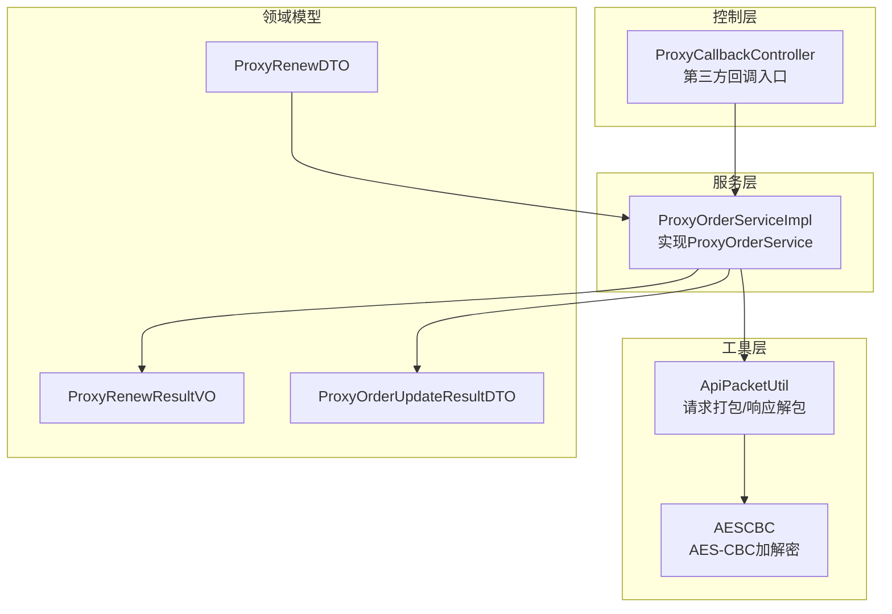
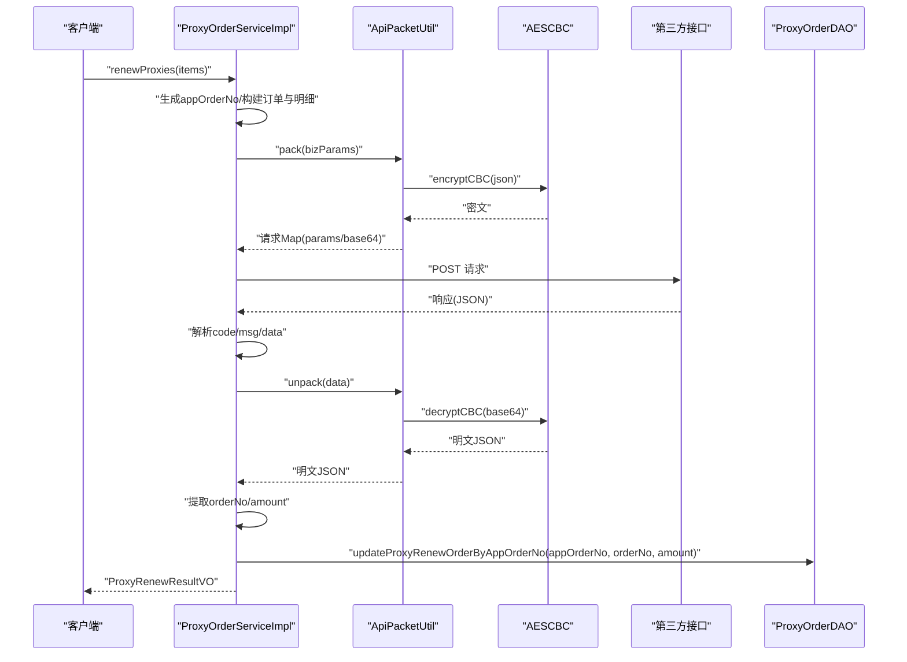
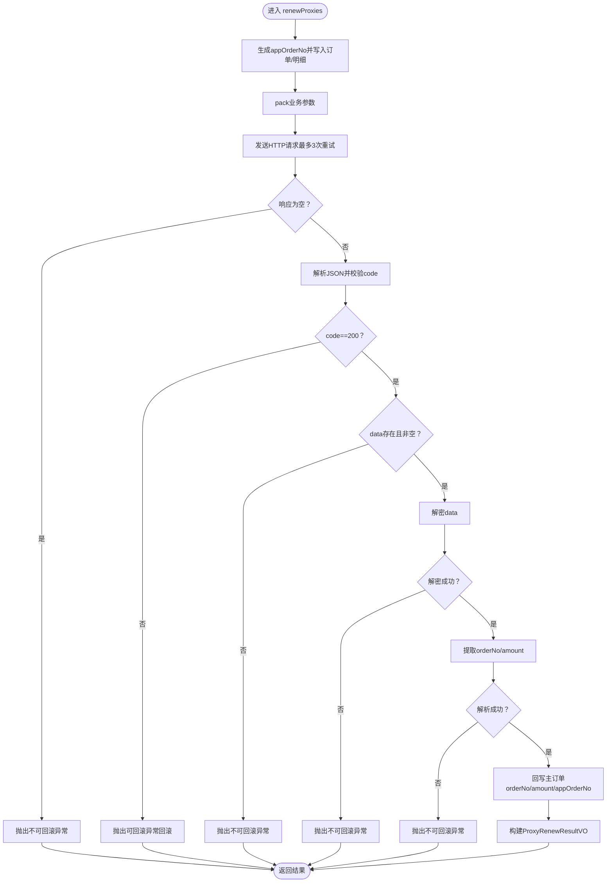
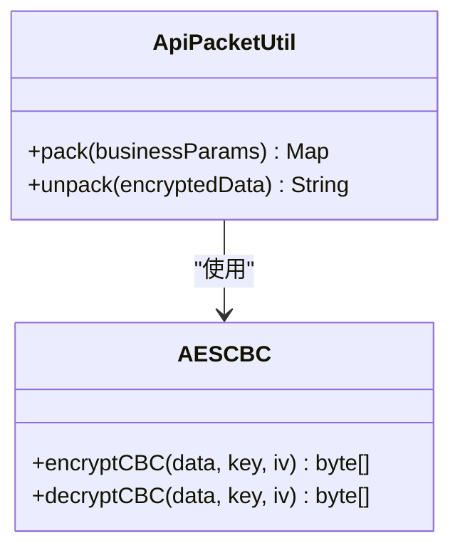
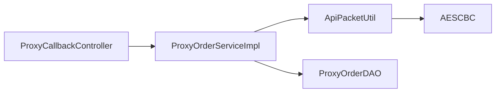

# 续费响应处理

<cite>
**本文引用的文件**
- [ProxyOrderService.java](file://src/main/java/cn/linkfast/service/ProxyOrderService.java)
- [ProxyOrderServiceImpl.java](file://src/main/java/cn/linkfast/service/impl/ProxyOrderServiceImpl.java)
- [ProxyRenewResultVO.java](file://src/main/java/cn/linkfast/vo/ProxyRenewResultVO.java)
- [ProxyRenewDTO.java](file://src/main/java/cn/linkfast/dto/ProxyRenewDTO.java)
- [ApiPacketUtil.java](file://src/main/java/cn/linkfast/utils/ApiPacketUtil.java)
- [AESCBC.java](file://src/main/java/cn/linkfast/utils/AESCBC.java)
- [ProxyCallbackController.java](file://src/main/java/cn/linkfast/controller/ProxyCallbackController.java)
- [ProxyOrderUpdateResultDTO.java](file://src/main/java/cn/linkfast/dto/ProxyOrderUpdateResultDTO.java)
</cite>

## 目录
1. [简介](#简介)
2. [项目结构](#项目结构)
3. [核心组件](#核心组件)
4. [架构总览](#架构总览)
5. [详细组件分析](#详细组件分析)
6. [依赖分析](#依赖分析)
7. [性能考虑](#性能考虑)
8. [故障排查指南](#故障排查指南)
9. [结论](#结论)
10. [附录](#附录)

## 简介
本文档围绕“续费响应处理”功能进行系统化说明，覆盖第三方API响应解析与处理流程、状态码校验、数据解密、业务逻辑验证、续费结果回写（orderNo与amount字段提取与更新）、ProxyRenewResultVO构建与返回值封装、异常场景与恢复策略、数据一致性保障、状态更新与业务状态转换，以及扩展点与自定义处理指导。目标是帮助开发者快速理解并正确扩展续费相关能力。

## 项目结构
与续费响应处理直接相关的模块与文件如下：
- 接口与实现：ProxyOrderService、ProxyOrderServiceImpl
- 响应封装：ProxyRenewResultVO
- 输入参数：ProxyRenewDTO、ProxyRenewItemDTO
- 加解密工具：ApiPacketUtil、AESCBC
- 回调入口：ProxyCallbackController（用于第三方回调，非续费主流程，但体现统一处理风格）
- 订单更新结果：ProxyOrderUpdateResultDTO（用于其他场景）

图表来源
- [ProxyOrderServiceImpl.java:470-635](file://src/main/java/cn/linkfast/service/impl/ProxyOrderServiceImpl.java#L470-L635)
- [ApiPacketUtil.java:58-105](file://src/main/java/cn/linkfast/utils/ApiPacketUtil.java#L58-L105)
- [AESCBC.java:19-36](file://src/main/java/cn/linkfast/utils/AESCBC.java#L19-L36)
- [ProxyRenewResultVO.java:12-19](file://src/main/java/cn/linkfast/vo/ProxyRenewResultVO.java#L12-L19)
- [ProxyRenewDTO.java:12-26](file://src/main/java/cn/linkfast/dto/ProxyRenewDTO.java#L12-L26)
- [ProxyOrderUpdateResultDTO.java:12-38](file://src/main/java/cn/linkfast/dto/ProxyOrderUpdateResultDTO.java#L12-L38)
- [ProxyCallbackController.java:28-94](file://src/main/java/cn/linkfast/controller/ProxyCallbackController.java#L28-L94)

章节来源
- [ProxyOrderServiceImpl.java:470-635](file://src/main/java/cn/linkfast/service/impl/ProxyOrderServiceImpl.java#L470-L635)
- [ApiPacketUtil.java:58-105](file://src/main/java/cn/linkfast/utils/ApiPacketUtil.java#L58-L105)
- [AESCBC.java:19-36](file://src/main/java/cn/linkfast/utils/AESCBC.java#L19-L36)
- [ProxyRenewResultVO.java:12-19](file://src/main/java/cn/linkfast/vo/ProxyRenewResultVO.java#L12-L19)
- [ProxyRenewDTO.java:12-26](file://src/main/java/cn/linkfast/dto/ProxyRenewDTO.java#L12-L26)
- [ProxyOrderUpdateResultDTO.java:12-38](file://src/main/java/cn/linkfast/dto/ProxyOrderUpdateResultDTO.java#L12-L38)
- [ProxyCallbackController.java:28-94](file://src/main/java/cn/linkfast/controller/ProxyCallbackController.java#L28-L94)

## 核心组件
- 续费服务实现：负责续费请求构建、调用第三方接口、响应解析、解密、字段提取与回写、结果封装。
- 加解密工具：统一封装请求打包与响应解包，使用AES-CBC对称加密。
- 结果封装VO：ProxyRenewResultVO承载appOrderNo、orderNo、status、amount等返回字段。
- 输入参数DTO：ProxyRenewDTO定义支付密码与续费实例列表；ProxyRenewItemDTO定义单个实例续费参数。
- 回调控制器：ProxyCallbackController提供第三方回调统一入口，体现一致的处理风格与返回规范。

章节来源
- [ProxyOrderServiceImpl.java:470-635](file://src/main/java/cn/linkfast/service/impl/ProxyOrderServiceImpl.java#L470-L635)
- [ApiPacketUtil.java:58-105](file://src/main/java/cn/linkfast/utils/ApiPacketUtil.java#L58-L105)
- [ProxyRenewResultVO.java:12-19](file://src/main/java/cn/linkfast/vo/ProxyRenewResultVO.java#L12-L19)
- [ProxyRenewDTO.java:12-26](file://src/main/java/cn/linkfast/dto/ProxyRenewDTO.java#L12-L26)
- [ProxyCallbackController.java:28-94](file://src/main/java/cn/linkfast/controller/ProxyCallbackController.java#L28-L94)

## 架构总览
续费响应处理遵循“请求构建—加密打包—HTTP调用—响应解析—解密—字段提取—回写—封装返回”的闭环流程。服务层通过事务控制与异常分类，确保在不同网络与业务异常场景下具备可恢复性与数据一致性。

图表来源
- [ProxyOrderServiceImpl.java:470-635](file://src/main/java/cn/linkfast/service/impl/ProxyOrderServiceImpl.java#L470-L635)
- [ApiPacketUtil.java:58-105](file://src/main/java/cn/linkfast/utils/ApiPacketUtil.java#L58-L105)
- [AESCBC.java:19-36](file://src/main/java/cn/linkfast/utils/AESCBC.java#L19-L36)

## 详细组件分析

### 续费服务实现（ProxyOrderServiceImpl.renewProxies）
- 流程要点
  - 生成appOrderNo，构建主订单与续费明细，插入数据库。
  - 构建业务参数（appOrderNo、instances），调用pack进行加密打包。
  - 发送HTTP请求至续费路径，重试3次以应对连接失败。
  - 解析响应：校验code、data节点存在性与非空；解密data；提取orderNo与amount。
  - 回写主订单：updateProxyRenewOrderByAppOrderNo。
  - 构建ProxyRenewResultVO并返回。
- 异常与恢复
  - 连接失败（Connect/UnknownHost）：重试3次，仍失败则抛出可回滚异常，触发本地事务回滚。
  - 响应读取失败：判定对方可能已落库，抛出不可回滚异常，保留本地数据。
  - 响应为空：判定对方可能已落库，抛出不可回滚异常。
  - 非200业务码：抛出可回滚异常，回滚本地数据。
  - data缺失/为空：判定对方可能已落库，抛出不可回滚异常。
  - 解密失败：判定对方可能已落库，抛出不可回滚异常。
  - 解析失败（orderNo/amount缺失）：判定对方可能已落库，抛出不可回滚异常。
- 数据一致性
  - 使用带noRollbackFor的事务注解，区分可回滚与不可回滚场景，确保幂等与一致性。
  - 通过appOrderNo作为回写键，避免重复更新与错配。

图表来源
- [ProxyOrderServiceImpl.java:470-635](file://src/main/java/cn/linkfast/service/impl/ProxyOrderServiceImpl.java#L470-L635)

章节来源
- [ProxyOrderServiceImpl.java:470-635](file://src/main/java/cn/linkfast/service/impl/ProxyOrderServiceImpl.java#L470-L635)

### 加解密工具（ApiPacketUtil + AESCBC）
- pack：将业务参数序列化为JSON，使用AES-CBC加密，Base64编码，附加公共字段（version、encrypt、appKey、reqId），返回请求Map。
- unpack：对响应中的data字段进行Base64解码与AES-CBC解密，返回明文JSON。
- AESCBC：提供对称加解密实现，使用PKCS5Padding与IV。

图表来源
- [ApiPacketUtil.java:58-105](file://src/main/java/cn/linkfast/utils/ApiPacketUtil.java#L58-L105)
- [AESCBC.java:19-36](file://src/main/java/cn/linkfast/utils/AESCBC.java#L19-L36)

章节来源
- [ApiPacketUtil.java:58-105](file://src/main/java/cn/linkfast/utils/ApiPacketUtil.java#L58-L105)
- [AESCBC.java:19-36](file://src/main/java/cn/linkfast/utils/AESCBC.java#L19-L36)

### 结果封装（ProxyRenewResultVO）
- 字段：appOrderNo、orderNo、status、amount。
- 用途：封装续费结果供前端展示与后续流程使用。

章节来源
- [ProxyRenewResultVO.java:12-19](file://src/main/java/cn/linkfast/vo/ProxyRenewResultVO.java#L12-L19)

### 输入参数（ProxyRenewDTO / ProxyRenewItemDTO）
- ProxyRenewDTO：包含支付密码与续费实例列表。
- ProxyRenewItemDTO：包含单个实例续费所需的实例编号、时长、周期等。

章节来源
- [ProxyRenewDTO.java:12-26](file://src/main/java/cn/linkfast/dto/ProxyRenewDTO.java#L12-L26)

### 回调入口（ProxyCallbackController）
- 提供第三方回调统一入口，按type分发处理（产品/订单/实例），体现统一日志与返回规范。
- 与续费主流程职责分离，但处理风格一致（记录日志、捕获异常、返回Result.success）。

章节来源
- [ProxyCallbackController.java:28-94](file://src/main/java/cn/linkfast/controller/ProxyCallbackController.java#L28-L94)

## 依赖分析
- 续费实现依赖工具层（ApiPacketUtil、AESCBC）完成加密与解密。
- 服务层通过DAO层回写订单信息，确保数据持久化。
- 控制层通过统一返回Result，保证对外输出的一致性。

图表来源
- [ProxyOrderServiceImpl.java:470-635](file://src/main/java/cn/linkfast/service/impl/ProxyOrderServiceImpl.java#L470-L635)
- [ApiPacketUtil.java:58-105](file://src/main/java/cn/linkfast/utils/ApiPacketUtil.java#L58-L105)
- [AESCBC.java:19-36](file://src/main/java/cn/linkfast/utils/AESCBC.java#L19-L36)
- [ProxyCallbackController.java:28-94](file://src/main/java/cn/linkfast/controller/ProxyCallbackController.java#L28-L94)

章节来源
- [ProxyOrderServiceImpl.java:470-635](file://src/main/java/cn/linkfast/service/impl/ProxyOrderServiceImpl.java#L470-L635)
- [ApiPacketUtil.java:58-105](file://src/main/java/cn/linkfast/utils/ApiPacketUtil.java#L58-L105)
- [AESCBC.java:19-36](file://src/main/java/cn/linkfast/utils/AESCBC.java#L19-L36)
- [ProxyCallbackController.java:28-94](file://src/main/java/cn/linkfast/controller/ProxyCallbackController.java#L28-L94)

## 性能考虑
- 重试策略：对连接失败场景进行最多3次指数退避式重试，降低瞬时网络波动影响。
- 异步更新：在购买流程中对产品库存信息采用异步更新，避免阻塞下单主链路。
- 日志与可观测：对关键步骤（请求、响应、解密、回写）记录日志，便于定位问题与性能分析。

## 故障排查指南
- 常见异常与定位
  - 响应为空：检查第三方接口连通性与超时设置；若出现此类异常，按不可回滚处理，需人工核对订单状态。
  - 非200业务码：检查业务参数与权限；此类异常可回滚，事务自动回滚本地数据。
  - JSON解析失败：检查第三方响应格式是否符合约定；若已落库，按不可回滚处理。
  - 解密失败：核对appSecret与IV生成逻辑；确保环境配置正确。
  - orderNo/amount缺失：核对第三方返回结构与字段命名；若已落库，按不可回滚处理。
- 恢复机制
  - 连接失败：重试后成功则继续流程；仍失败则回滚本地数据。
  - 响应读取失败：判定对方可能已落库，保留本地数据，等待后续对账或回调同步。
  - 不可回滚异常：通过回调或对账接口同步状态，确保数据一致性。
- 建议
  - 在生产环境开启回调同步（如订单/实例变更），定期对账。
  - 对关键日志增加traceId，便于跨系统追踪。

章节来源
- [ProxyOrderServiceImpl.java:470-635](file://src/main/java/cn/linkfast/service/impl/ProxyOrderServiceImpl.java#L470-L635)

## 结论
续费响应处理通过清晰的流程划分、严格的异常分类与恢复策略、以及完善的加解密与回写机制，实现了在复杂网络与业务异常下的稳健运行。开发者可在现有框架基础上，按需扩展业务规则、接入新的回调类型或优化重试策略，同时保持数据一致性与可恢复性。

## 附录
- 关键流程路径参考
  - 续费主流程：[ProxyOrderServiceImpl.renewProxies:470-635](file://src/main/java/cn/linkfast/service/impl/ProxyOrderServiceImpl.java#L470-L635)
  - 响应解析与回写：[ProxyOrderServiceImpl.renewProxies:515-635](file://src/main/java/cn/linkfast/service/impl/ProxyOrderServiceImpl.java#L515-L635)
  - 加密打包：[ApiPacketUtil.pack:58-92](file://src/main/java/cn/linkfast/utils/ApiPacketUtil.java#L58-L92)
  - 解密响应：[ApiPacketUtil.unpack:94-105](file://src/main/java/cn/linkfast/utils/ApiPacketUtil.java#L94-L105)
  - 结果封装：[ProxyRenewResultVO:12-19](file://src/main/java/cn/linkfast/vo/ProxyRenewResultVO.java#L12-L19)
  - 回调入口：[ProxyCallbackController.handleNotify:42-94](file://src/main/java/cn/linkfast/controller/ProxyCallbackController.java#L42-L94)