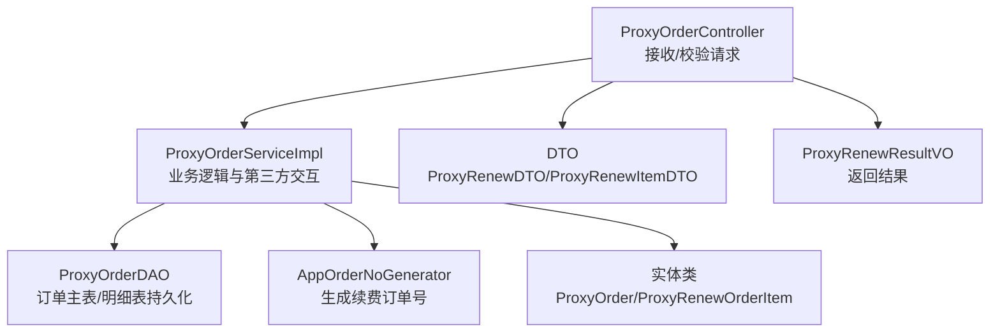
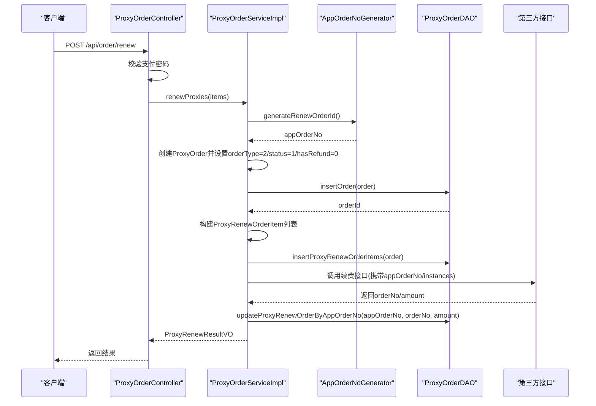
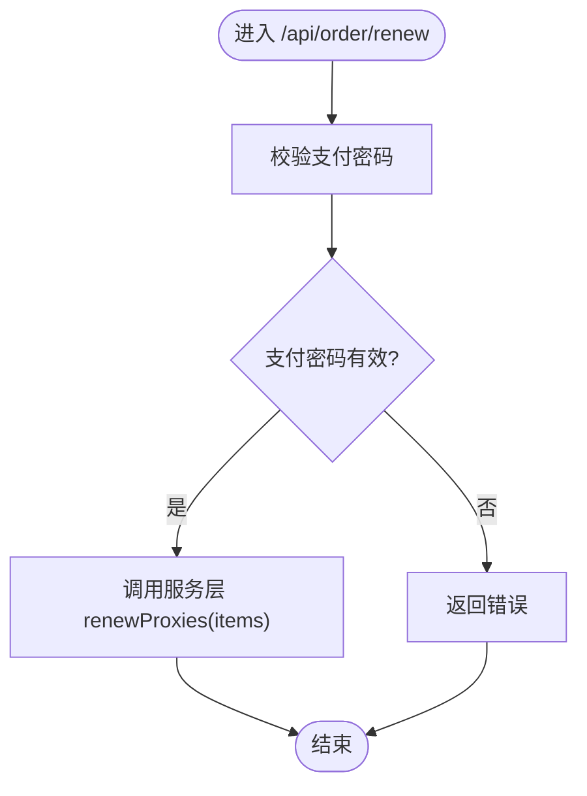
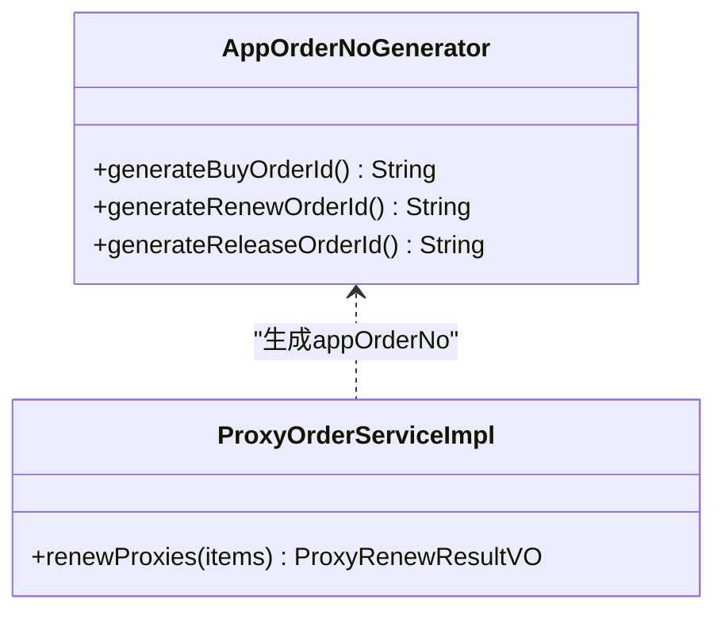
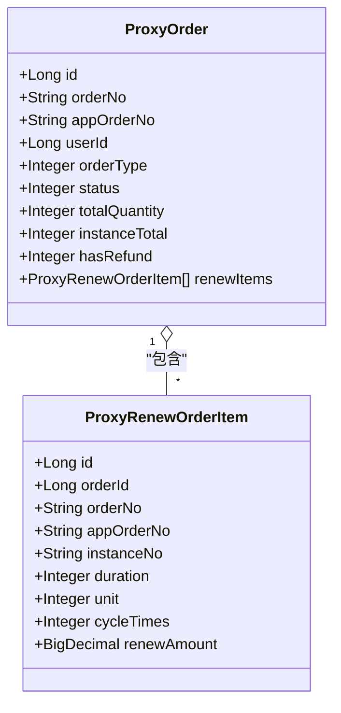
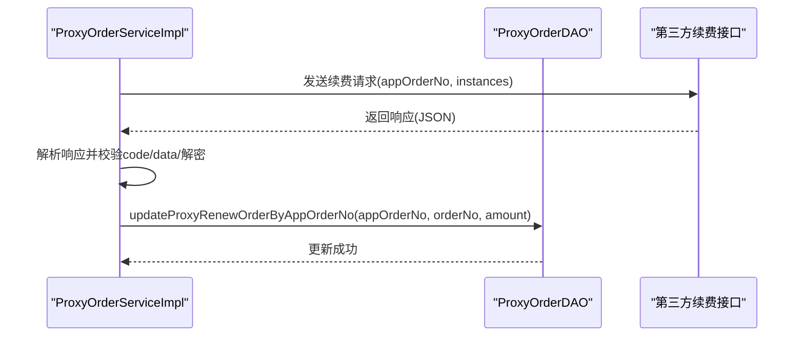
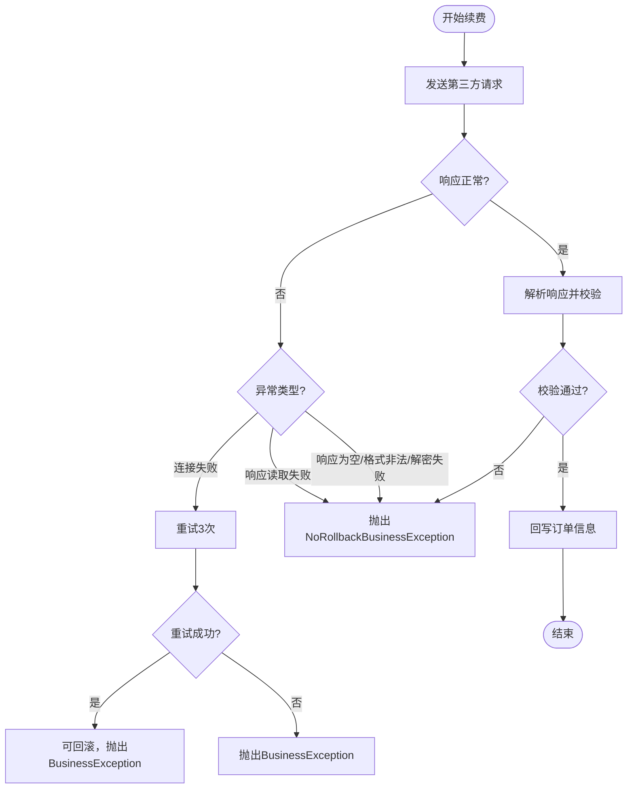
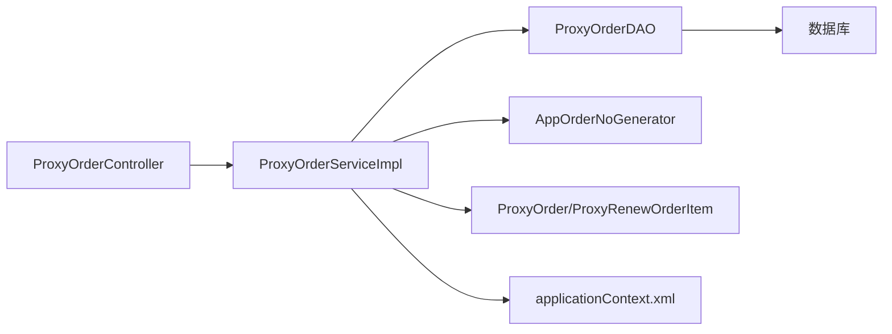

# 续费订单创建

<cite>
**本文引用的文件**
- [ProxyOrderServiceImpl.java](file://src/main/java/cn/linkfast/service/impl/ProxyOrderServiceImpl.java)
- [ProxyOrderController.java](file://src/main/java/cn/linkfast/controller/ProxyOrderController.java)
- [ProxyRenewDTO.java](file://src/main/java/cn/linkfast/dto/ProxyRenewDTO.java)
- [ProxyRenewItemDTO.java](file://src/main/java/cn/linkfast/dto/ProxyRenewItemDTO.java)
- [ProxyRenewOrderItem.java](file://src/main/java/cn/linkfast/entity/ProxyRenewOrderItem.java)
- [ProxyOrder.java](file://src/main/java/cn/linkfast/entity/ProxyOrder.java)
- [ProxyRenewResultVO.java](file://src/main/java/cn/linkfast/vo/ProxyRenewResultVO.java)
- [AppOrderNoGenerator.java](file://src/main/java/cn/linkfast/utils/AppOrderNoGenerator.java)
- [ProxyOrderDAO.java](file://src/main/java/cn/linkfast/dao/ProxyOrderDAO.java)
- [applicationContext.xml](file://src/main/resources/applicationContext.xml)
</cite>

## 目录
1. [简介](#简介)
2. [项目结构](#项目结构)
3. [核心组件](#核心组件)
4. [架构概览](#架构概览)
5. [详细组件分析](#详细组件分析)
6. [依赖分析](#依赖分析)
7. [性能考虑](#性能考虑)
8. [故障排除指南](#故障排除指南)
9. [结论](#结论)
10. [附录](#附录)

## 简介
本文档详细阐述了续费订单创建功能的完整实现，涵盖从请求参数到数据库持久化的全流程。重点包括：
- ProxyRenewDTO到ProxyOrder实体的转换过程
- 订单类型设置为2的业务含义
- 续费订单明细的构建逻辑（ProxyRenewItemDTO到ProxyRenewOrderItem的映射）
- 订单号生成机制及AppOrderNoGenerator的作用
- 初始化状态设置（status=1和hasRefund=0的业务意义）
- 参数验证规则与异常处理机制
- 扩展与自定义实现指导

## 项目结构
续费订单相关代码主要分布在以下层次：
- 控制器层：接收HTTP请求并进行基础参数校验
- 服务层：执行业务逻辑，包括订单创建、第三方接口调用、状态回写
- 数据访问层：负责订单主表与明细表的持久化
- 实体与DTO：定义数据模型与传输对象
- 工具类：订单号生成器
- 配置：Spring事务与数据源配置

**图表来源**
- [ProxyOrderController.java:47-67](file://src/main/java/cn/linkfast/controller/ProxyOrderController.java#L47-L67)
- [ProxyOrderServiceImpl.java:469-635](file://src/main/java/cn/linkfast/service/impl/ProxyOrderServiceImpl.java#L469-L635)
- [ProxyOrderDAO.java:10-102](file://src/main/java/cn/linkfast/dao/ProxyOrderDAO.java#L10-L102)
- [AppOrderNoGenerator.java:14-45](file://src/main/java/cn/linkfast/utils/AppOrderNoGenerator.java#L14-L45)

**章节来源**
- [ProxyOrderController.java:17-87](file://src/main/java/cn/linkfast/controller/ProxyOrderController.java#L17-L87)
- [ProxyOrderServiceImpl.java:34-782](file://src/main/java/cn/linkfast/service/impl/ProxyOrderServiceImpl.java#L34-L782)

## 核心组件
- ProxyOrderController：对外提供POST /api/order/renew接口，负责支付密码校验与调用服务层
- ProxyOrderServiceImpl：实现续费订单创建的核心逻辑，包括订单号生成、主表与明细入库、第三方接口调用、状态回写
- ProxyRenewDTO/ProxyRenewItemDTO：请求参数的数据载体，包含支付密码与续费实例列表
- ProxyRenewOrderItem：续费订单明细实体，对应数据库表proxy_renew_order_item
- ProxyOrder：订单主表实体，包含订单类型、状态、退款标记等
- AppOrderNoGenerator：基于Snowflake算法生成唯一订单号，区分购买/续费/释放三类前缀
- ProxyOrderDAO：订单主表与明细表的持久化接口

**章节来源**
- [ProxyOrderController.java:47-67](file://src/main/java/cn/linkfast/controller/ProxyOrderController.java#L47-L67)
- [ProxyOrderServiceImpl.java:469-635](file://src/main/java/cn/linkfast/service/impl/ProxyOrderServiceImpl.java#L469-L635)
- [ProxyRenewDTO.java:9-26](file://src/main/java/cn/linkfast/dto/ProxyRenewDTO.java#L9-L26)
- [ProxyRenewItemDTO.java:5-18](file://src/main/java/cn/linkfast/dto/ProxyRenewItemDTO.java#L5-L18)
- [ProxyRenewOrderItem.java:10-47](file://src/main/java/cn/linkfast/entity/ProxyRenewOrderItem.java#L10-L47)
- [ProxyOrder.java:11-45](file://src/main/java/cn/linkfast/entity/ProxyOrder.java#L11-L45)
- [AppOrderNoGenerator.java:14-45](file://src/main/java/cn/linkfast/utils/AppOrderNoGenerator.java#L14-L45)
- [ProxyOrderDAO.java:10-102](file://src/main/java/cn/linkfast/dao/ProxyOrderDAO.java#L10-L102)

## 架构概览
续费订单创建采用典型的三层架构：
- 表现层：Controller接收请求并进行基础校验
- 业务层：Service执行复杂业务逻辑，包含事务控制、第三方接口调用与异常处理
- 数据访问层：DAO负责数据库操作，支持主表与明细表的批量插入与回写

**图表来源**
- [ProxyOrderController.java:47-67](file://src/main/java/cn/linkfast/controller/ProxyOrderController.java#L47-L67)
- [ProxyOrderServiceImpl.java:469-635](file://src/main/java/cn/linkfast/service/impl/ProxyOrderServiceImpl.java#L469-L635)
- [AppOrderNoGenerator.java:31-43](file://src/main/java/cn/linkfast/utils/AppOrderNoGenerator.java#L31-L43)
- [ProxyOrderDAO.java:39-93](file://src/main/java/cn/linkfast/dao/ProxyOrderDAO.java#L39-L93)

## 详细组件分析

### 1. 参数验证与请求入口
- Controller层对续费请求进行基础校验：支付密码必填且通过校验后才调用服务层
- DTO层定义了续费请求的结构：支付密码必填、续费实例列表必填且至少一项

**图表来源**
- [ProxyOrderController.java:50-67](file://src/main/java/cn/linkfast/controller/ProxyOrderController.java#L50-L67)
- [ProxyRenewDTO.java:15-25](file://src/main/java/cn/linkfast/dto/ProxyRenewDTO.java#L15-L25)

**章节来源**
- [ProxyOrderController.java:47-67](file://src/main/java/cn/linkfast/controller/ProxyOrderController.java#L47-L67)
- [ProxyRenewDTO.java:9-26](file://src/main/java/cn/linkfast/dto/ProxyRenewDTO.java#L9-L26)

### 2. 订单类型与初始化状态
- 订单类型设置为2：表示“续费”类型，与购买(1)、释放(3)区分
- 初始化状态status=1：表示“待处理”，后续由第三方接口回写实际状态
- hasRefund=0：表示该订单尚未发生退费

这些字段在服务层创建主订单时一次性设置，确保后续状态流转与业务逻辑的一致性。

**章节来源**
- [ProxyOrderServiceImpl.java:477-482](file://src/main/java/cn/linkfast/service/impl/ProxyOrderServiceImpl.java#L477-L482)
- [ProxyOrder.java:24-31](file://src/main/java/cn/linkfast/entity/ProxyOrder.java#L24-L31)

### 3. 订单号生成机制
- AppOrderNoGenerator提供generateRenewOrderId()方法，基于Snowflake算法生成全局唯一ID
- 订单号前缀区分业务类型：购买(P)、续费(R)、释放(F)
- 续费订单号生成后立即用于主订单与明细表的关联

**图表来源**
- [AppOrderNoGenerator.java:14-45](file://src/main/java/cn/linkfast/utils/AppOrderNoGenerator.java#L14-L45)
- [ProxyOrderServiceImpl.java:470-473](file://src/main/java/cn/linkfast/service/impl/ProxyOrderServiceImpl.java#L470-L473)

**章节来源**
- [AppOrderNoGenerator.java:17-43](file://src/main/java/cn/linkfast/utils/AppOrderNoGenerator.java#L17-L43)
- [ProxyOrderServiceImpl.java:470-473](file://src/main/java/cn/linkfast/service/impl/ProxyOrderServiceImpl.java#L470-L473)

### 4. 主订单与明细构建
- 主订单ProxyOrder：设置appOrderNo、userId、orderType=2、status=1、hasRefund=0、实例总数等
- 明细ProxyRenewOrderItem：每个续费实例对应一条明细，包含instanceNo、duration、unit、cycleTimes等
- 通过DAO批量插入明细表，保证数据一致性

**图表来源**
- [ProxyOrder.java:19-45](file://src/main/java/cn/linkfast/entity/ProxyOrder.java#L19-L45)
- [ProxyRenewOrderItem.java:18-47](file://src/main/java/cn/linkfast/entity/ProxyRenewOrderItem.java#L18-L47)

**章节来源**
- [ProxyOrderServiceImpl.java:474-500](file://src/main/java/cn/linkfast/service/impl/ProxyOrderServiceImpl.java#L474-L500)
- [ProxyOrderDAO.java:74-88](file://src/main/java/cn/linkfast/dao/ProxyOrderDAO.java#L74-L88)

### 5. 第三方接口调用与状态回写
- 构造业务参数：appOrderNo + instances（包含instanceNo、duration、cycleTimes）
- 发送请求至第三方续费接口，支持最多3次连接重试
- 成功后解析响应，提取orderNo与amount，回写至数据库

**图表来源**
- [ProxyOrderServiceImpl.java:502-513](file://src/main/java/cn/linkfast/service/impl/ProxyOrderServiceImpl.java#L502-L513)
- [ProxyOrderServiceImpl.java:515-635](file://src/main/java/cn/linkfast/service/impl/ProxyOrderServiceImpl.java#L515-L635)
- [ProxyOrderDAO.java:39-93](file://src/main/java/cn/linkfast/dao/ProxyOrderDAO.java#L39-L93)

**章节来源**
- [ProxyOrderServiceImpl.java:502-635](file://src/main/java/cn/linkfast/service/impl/ProxyOrderServiceImpl.java#L502-L635)
- [ProxyOrderDAO.java:39-93](file://src/main/java/cn/linkfast/dao/ProxyOrderDAO.java#L39-L93)

### 6. 异常处理与事务控制
- 事务注解：@Transactional(rollbackFor = Exception.class, noRollbackFor = NoRollbackBusinessException.class)
- 异常分类：
  - 可回滚异常：第三方接口连接失败（重试3次仍失败）或业务失败（code!=200）
  - 不回滚异常：请求已发送但响应读取失败、响应为空、响应格式非法、解密失败等
- 通过NoRollbackBusinessException标识“对方可能已落库”的场景，避免重复回滚

**图表来源**
- [ProxyOrderServiceImpl.java:515-635](file://src/main/java/cn/linkfast/service/impl/ProxyOrderServiceImpl.java#L515-L635)

**章节来源**
- [ProxyOrderServiceImpl.java:515-635](file://src/main/java/cn/linkfast/service/impl/ProxyOrderServiceImpl.java#L515-L635)

## 依赖分析
- 控制器依赖服务层：Controller仅负责参数校验与调用
- 服务层依赖DAO与工具类：生成订单号、持久化主表与明细、调用第三方接口
- DAO依赖数据库：提供订单主表与明细表的CRUD能力
- 配置依赖：Spring事务管理器与数据源配置

**图表来源**
- [ProxyOrderController.java:24-26](file://src/main/java/cn/linkfast/controller/ProxyOrderController.java#L24-L26)
- [ProxyOrderServiceImpl.java:39-45](file://src/main/java/cn/linkfast/service/impl/ProxyOrderServiceImpl.java#L39-L45)
- [ProxyOrderDAO.java:10-102](file://src/main/java/cn/linkfast/dao/ProxyOrderDAO.java#L10-L102)
- [applicationContext.xml:59-67](file://src/main/resources/applicationContext.xml#L59-L67)

**章节来源**
- [applicationContext.xml:14-67](file://src/main/resources/applicationContext.xml#L14-L67)

## 性能考虑
- 批量插入：明细表采用批量插入，减少多次往返开销
- 连接重试：对连接失败场景进行指数退避重试，提升成功率
- 异步优化：购买流程中对产品库存更新采用异步处理，避免阻塞下单线程
- 事务边界：明确的事务范围与异常分类，避免不必要的回滚

[本节为通用性能建议，无需特定文件引用]

## 故障排除指南
- 支付密码校验失败：检查支付密码是否正确，或服务层校验逻辑
- 订单号生成异常：确认AppOrderNoGenerator配置与Snowflake节点ID
- 第三方接口连接失败：查看重试日志，确认网络连通性与接口可达性
- 响应格式异常：检查第三方返回的JSON结构与加密数据
- 解密失败：确认加密参数与密钥配置
- 业务失败(code!=200)：根据第三方返回的错误信息定位问题

**章节来源**
- [ProxyOrderController.java:50-67](file://src/main/java/cn/linkfast/controller/ProxyOrderController.java#L50-L67)
- [ProxyOrderServiceImpl.java:515-635](file://src/main/java/cn/linkfast/service/impl/ProxyOrderServiceImpl.java#L515-L635)

## 结论
续费订单创建功能通过清晰的分层设计与完善的异常处理机制，实现了从请求到落库再到第三方回写的完整闭环。关键点在于：
- 明确的订单类型与初始化状态
- 唯一订单号生成与主/明细表一致性
- 严谨的参数校验与第三方接口交互
- 面向“可能已落库”场景的不回滚策略

[本节为总结性内容，无需特定文件引用]

## 附录

### A. 参数验证规则
- 支付密码：必填，不能为空
- 续费实例列表：必填，至少包含一个实例

**章节来源**
- [ProxyRenewDTO.java:15-25](file://src/main/java/cn/linkfast/dto/ProxyRenewDTO.java#L15-L25)

### B. 订单号生成规则
- 前缀：R（续费）
- 后缀：Snowflake算法生成的唯一ID
- 作用：作为渠道商订单号，贯穿主表与明细表

**章节来源**
- [AppOrderNoGenerator.java:17-43](file://src/main/java/cn/linkfast/utils/AppOrderNoGenerator.java#L17-L43)

### C. 订单类型与状态语义
- 订单类型：1=购买，2=续费，3=释放
- 初始化状态：1=待处理
- 退款标记：0=无退费

**章节来源**
- [ProxyOrder.java:24-31](file://src/main/java/cn/linkfast/entity/ProxyOrder.java#L24-L31)

### D. 扩展与自定义实现指导
- 新增续费周期单位：在DTO与实体中增加unit字段，并在服务层映射
- 自定义订单号规则：替换AppOrderNoGenerator实现或扩展生成策略
- 第三方接口适配：在服务层调整请求参数与响应解析逻辑
- 事务与异常策略：根据业务需求调整noRollbackFor与rollbackFor配置

[本节为通用扩展建议，无需特定文件引用]