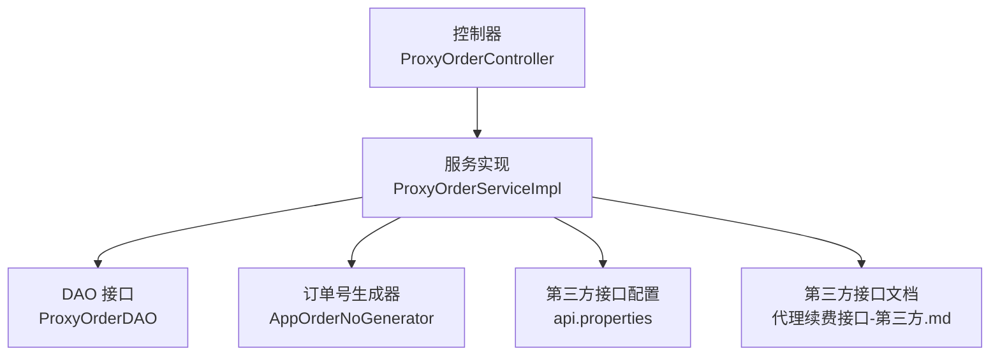
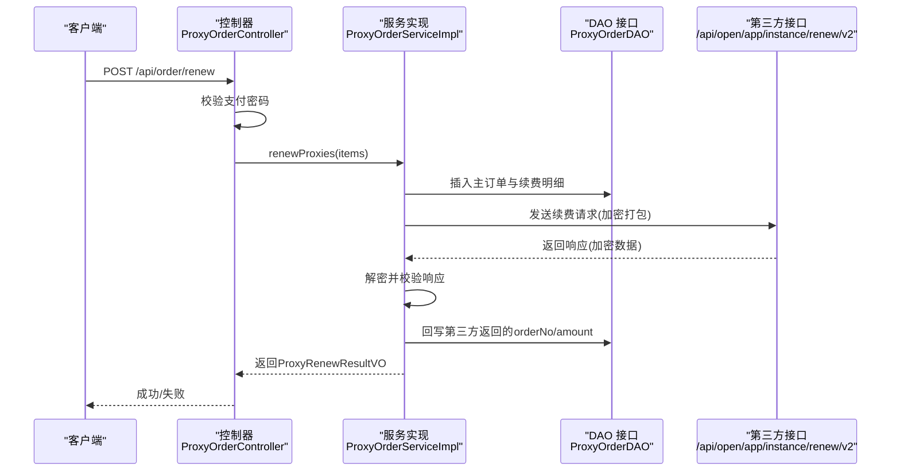
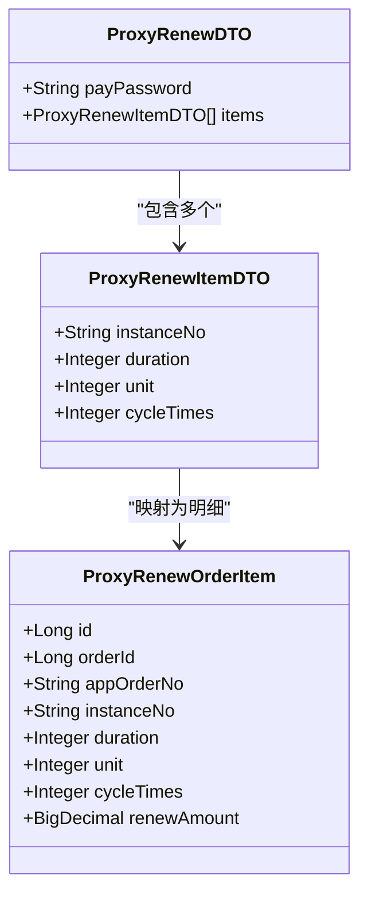
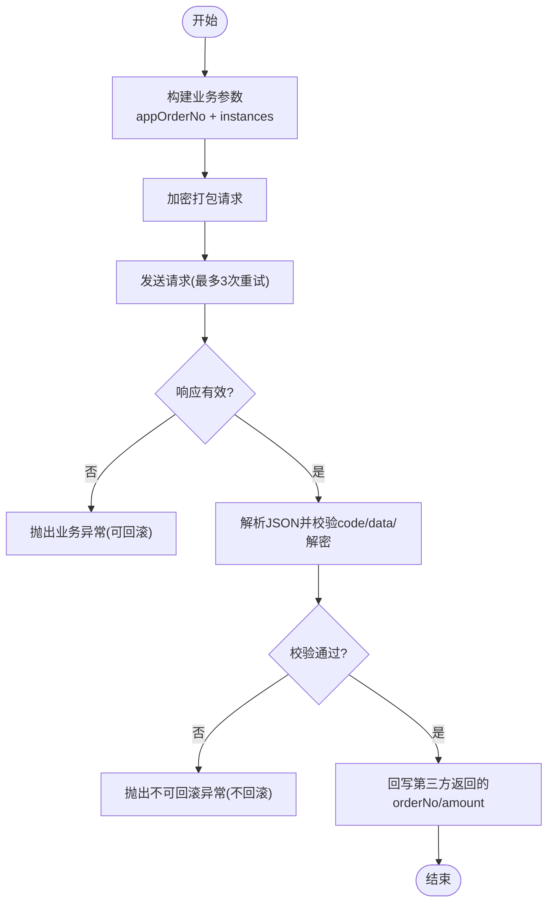
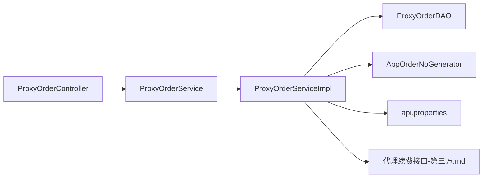

# 订单续费管理

<cite>
**本文引用的文件**
- [ProxyOrderController.java](file://src/main/java/cn/linkfast/controller/ProxyOrderController.java)
- [ProxyOrderService.java](file://src/main/java/cn/linkfast/service/ProxyOrderService.java)
- [ProxyOrderServiceImpl.java](file://src/main/java/cn/linkfast/service/impl/ProxyOrderServiceImpl.java)
- [ProxyRenewDTO.java](file://src/main/java/cn/linkfast/dto/ProxyRenewDTO.java)
- [ProxyRenewItemDTO.java](file://src/main/java/cn/linkfast/dto/ProxyRenewItemDTO.java)
- [ProxyRenewOrderItem.java](file://src/main/java/cn/linkfast/entity/ProxyRenewOrderItem.java)
- [ProxyRenewResultVO.java](file://src/main/java/cn/linkfast/vo/ProxyRenewResultVO.java)
- [AppOrderNoGenerator.java](file://src/main/java/cn/linkfast/utils/AppOrderNoGenerator.java)
- [ProxyOrderDAO.java](file://src/main/java/cn/linkfast/dao/ProxyOrderDAO.java)
- [NoRollbackBusinessException.java](file://src/main/java/cn/linkfast/exception/NoRollbackBusinessException.java)
- [api.properties](file://src/main/resources/api.properties)
- [代理续费接口-第三方.md](file://docs/api/third-party/代理续费接口-第三方.md)
</cite>

## 目录
1. [简介](#简介)
2. [项目结构](#项目结构)
3. [核心组件](#核心组件)
4. [架构总览](#架构总览)
5. [详细组件分析](#详细组件分析)
6. [依赖分析](#依赖分析)
7. [性能考虑](#性能考虑)
8. [故障排查指南](#故障排查指南)
9. [结论](#结论)
10. [附录](#附录)

## 简介
本文件围绕“订单续费管理”功能，系统化阐述代理实例续费的完整业务流程，包括：
- 续费订单创建与本地持久化
- 支付密码校验与参数构建
- 第三方API调用与重试机制
- 续费周期计算与参数组合规则（duration、unit、cycleTimes）
- 异常处理策略与事务控制（可回滚/不可回滚）
- 续费结果回写与状态更新
- 扩展点与自定义续费规则的实现建议

## 项目结构
围绕续费功能的关键模块如下：
- 控制器层：接收HTTP请求，进行基础校验并委派服务层
- 服务层：封装事务、参数构建、第三方调用、异常处理与回写
- DAO层：负责订单主表与明细表的持久化与回写
- DTO/VO/Entity：承载请求参数、返回结果与数据库实体
- 工具类：订单号生成、加密打包、HTTP调用
- 配置与第三方接口文档：环境配置、接口路径、参数规范

图表来源
- [ProxyOrderController.java:1-88](file://src/main/java/cn/linkfast/controller/ProxyOrderController.java#L1-L88)
- [ProxyOrderServiceImpl.java:1-782](file://src/main/java/cn/linkfast/service/impl/ProxyOrderServiceImpl.java#L1-L782)
- [ProxyOrderDAO.java:1-102](file://src/main/java/cn/linkfast/dao/ProxyOrderDAO.java#L1-L102)
- [AppOrderNoGenerator.java:1-45](file://src/main/java/cn/linkfast/utils/AppOrderNoGenerator.java#L1-L45)
- [api.properties:1-31](file://src/main/resources/api.properties#L1-L31)
- [代理续费接口-第三方.md:1-31](file://docs/api/third-party/代理续费接口-第三方.md#L1-L31)

章节来源
- [ProxyOrderController.java:1-88](file://src/main/java/cn/linkfast/controller/ProxyOrderController.java#L1-L88)
- [ProxyOrderServiceImpl.java:1-782](file://src/main/java/cn/linkfast/service/impl/ProxyOrderServiceImpl.java#L1-L782)
- [ProxyOrderDAO.java:1-102](file://src/main/java/cn/linkfast/dao/ProxyOrderDAO.java#L1-L102)
- [AppOrderNoGenerator.java:1-45](file://src/main/java/cn/linkfast/utils/AppOrderNoGenerator.java#L1-L45)
- [api.properties:1-31](file://src/main/resources/api.properties#L1-L31)
- [代理续费接口-第三方.md:1-31](file://docs/api/third-party/代理续费接口-第三方.md#L1-L31)

## 核心组件
- 控制器：负责接收续费请求、校验支付密码、调用服务层并返回结果
- 服务实现：完成订单创建、参数构建、第三方调用、重试与异常处理、回写
- DAO接口：负责订单主表与续费明细表的插入与回写
- DTO/VO/Entity：承载请求参数、返回结果与数据库实体
- 工具类：订单号生成、参数加密打包、HTTP调用
- 异常：区分可回滚与不可回滚两类异常，配合事务注解控制回滚行为

章节来源
- [ProxyOrderController.java:47-67](file://src/main/java/cn/linkfast/controller/ProxyOrderController.java#L47-L67)
- [ProxyOrderService.java:42-61](file://src/main/java/cn/linkfast/service/ProxyOrderService.java#L42-L61)
- [ProxyOrderServiceImpl.java:469-635](file://src/main/java/cn/linkfast/service/impl/ProxyOrderServiceImpl.java#L469-L635)
- [ProxyOrderDAO.java:39-88](file://src/main/java/cn/linkfast/dao/ProxyOrderDAO.java#L39-L88)
- [ProxyRenewDTO.java:1-27](file://src/main/java/cn/linkfast/dto/ProxyRenewDTO.java#L1-L27)
- [ProxyRenewItemDTO.java:1-19](file://src/main/java/cn/linkfast/dto/ProxyRenewItemDTO.java#L1-L19)
- [ProxyRenewOrderItem.java:1-47](file://src/main/java/cn/linkfast/entity/ProxyRenewOrderItem.java#L1-L47)
- [ProxyRenewResultVO.java:1-20](file://src/main/java/cn/linkfast/vo/ProxyRenewResultVO.java#L1-L20)
- [AppOrderNoGenerator.java:24-43](file://src/main/java/cn/linkfast/utils/AppOrderNoGenerator.java#L24-L43)
- [NoRollbackBusinessException.java:1-27](file://src/main/java/cn/linkfast/exception/NoRollbackBusinessException.java#L1-L27)

## 架构总览
续费流程从HTTP入口开始，经控制器、服务层、DAO层，最终调用第三方接口并回写结果。

图表来源
- [ProxyOrderController.java:47-67](file://src/main/java/cn/linkfast/controller/ProxyOrderController.java#L47-L67)
- [ProxyOrderServiceImpl.java:469-635](file://src/main/java/cn/linkfast/service/impl/ProxyOrderServiceImpl.java#L469-L635)
- [ProxyOrderDAO.java:39-88](file://src/main/java/cn/linkfast/dao/ProxyOrderDAO.java#L39-L88)
- [api.properties:28-29](file://src/main/resources/api.properties#L28-L29)
- [代理续费接口-第三方.md:1-31](file://docs/api/third-party/代理续费接口-第三方.md#L1-L31)

## 详细组件分析

### 续费请求模型与转换
- 输入模型：ProxyRenewDTO（支付密码 + 续费项列表）
- 续费项模型：ProxyRenewItemDTO（实例编号、时长、单位、周期次数）
- 服务层内部实体：ProxyRenewOrderItem（持久化字段：orderId、appOrderNo、instanceNo、duration、unit、cycleTimes、renewAmount等）

转换逻辑要点：
- 服务层将ProxyRenewItemDTO映射为ProxyRenewOrderItem，填充orderId、appOrderNo、instanceNo、duration、unit、cycleTimes
- 生成渠道商订单号（R开头），设置订单类型为2（续费），状态为1（待处理）

图表来源
- [ProxyRenewDTO.java:1-27](file://src/main/java/cn/linkfast/dto/ProxyRenewDTO.java#L1-L27)
- [ProxyRenewItemDTO.java:1-19](file://src/main/java/cn/linkfast/dto/ProxyRenewItemDTO.java#L1-L19)
- [ProxyRenewOrderItem.java:1-47](file://src/main/java/cn/linkfast/entity/ProxyRenewOrderItem.java#L1-L47)

章节来源
- [ProxyOrderServiceImpl.java:469-500](file://src/main/java/cn/linkfast/service/impl/ProxyOrderServiceImpl.java#L469-L500)
- [ProxyRenewDTO.java:1-27](file://src/main/java/cn/linkfast/dto/ProxyRenewDTO.java#L1-L27)
- [ProxyRenewItemDTO.java:1-19](file://src/main/java/cn/linkfast/dto/ProxyRenewItemDTO.java#L1-L19)
- [ProxyRenewOrderItem.java:1-47](file://src/main/java/cn/linkfast/entity/ProxyRenewOrderItem.java#L1-L47)

### 续费周期计算与参数组合规则
- duration：时长数值（可选，默认1）
- unit：周期单位（可选，如天、月等）
- cycleTimes：周期次数（可选，默认1）
- 组合规则：
  - 实际续费时长 = duration × cycleTimes
  - unit用于表达时间维度（如天、月），与duration共同决定续费周期
  - 若未提供duration或unit，则按默认值处理；若提供不合理的组合，以第三方接口校验为准

依据第三方接口文档：
- appOrderNo：渠道商订单号（幂等标识）
- instances：实例数组，每项包含instanceNo、duration、cycleTimes

章节来源
- [代理续费接口-第三方.md:8-28](file://docs/api/third-party/代理续费接口-第三方.md#L8-L28)
- [ProxyOrderServiceImpl.java:502-513](file://src/main/java/cn/linkfast/service/impl/ProxyOrderServiceImpl.java#L502-L513)

### 第三方API调用与重试机制
- 环境选择：根据配置选择沙盒或生产环境的基础URL
- 请求路径：/api/open/app/instance/renew/v2
- 参数打包：使用加密打包工具将bizParams加密后发送
- 重试策略：
  - 连接建立失败（Connect/UnknownHostException）：最多重试3次，每次间隔递增
  - 请求已发送但响应读取失败：视为对方可能已落库，抛出不可回滚异常
  - 响应为空字符串：视为对方可能已落库，抛出不可回滚异常
  - 响应非JSON或code!=200：可回滚，抛出业务异常
  - data缺失/为空或解密失败：视为对方可能已落库，抛出不可回滚异常
- 事务控制：使用noRollbackFor包含不可回滚异常，确保在特定场景不回滚本地数据

图表来源
- [ProxyOrderServiceImpl.java:515-635](file://src/main/java/cn/linkfast/service/impl/ProxyOrderServiceImpl.java#L515-L635)
- [api.properties:28-29](file://src/main/resources/api.properties#L28-L29)
- [NoRollbackBusinessException.java:1-27](file://src/main/java/cn/linkfast/exception/NoRollbackBusinessException.java#L1-L27)

章节来源
- [ProxyOrderServiceImpl.java:515-635](file://src/main/java/cn/linkfast/service/impl/ProxyOrderServiceImpl.java#L515-L635)
- [api.properties:1-31](file://src/main/resources/api.properties#L1-L31)
- [NoRollbackBusinessException.java:1-27](file://src/main/java/cn/linkfast/exception/NoRollbackBusinessException.java#L1-L27)

### 续费结果回写与状态更新
- 本地持久化：先插入主订单（orderType=2，status=1），再批量插入续费明细
- 回写逻辑：当第三方返回成功时，更新主订单的第三方平台订单号与金额
- 返回结果：ProxyRenewResultVO包含appOrderNo、orderNo、status、amount

章节来源
- [ProxyOrderServiceImpl.java:469-500](file://src/main/java/cn/linkfast/service/impl/ProxyOrderServiceImpl.java#L469-L500)
- [ProxyOrderServiceImpl.java:622-630](file://src/main/java/cn/linkfast/service/impl/ProxyOrderServiceImpl.java#L622-L630)
- [ProxyOrderDAO.java:39](file://src/main/java/cn/linkfast/dao/ProxyOrderDAO.java#L39)
- [ProxyRenewResultVO.java:1-20](file://src/main/java/cn/linkfast/vo/ProxyRenewResultVO.java#L1-L20)

### 扩展点与自定义续费规则
- 续费周期规则扩展：可在服务层增加对duration/unit/cycleTimes的校验与转换逻辑，支持更复杂的周期组合
- 参数校验增强：在控制器或服务层增加对instanceNo有效性、时长范围、单位合法性等校验
- 环境与接口扩展：通过配置文件切换不同环境与接口路径，便于灰度与多版本并行
- 事务与异常策略：根据业务风险调整noRollbackFor范围，确保在“请求已发送但响应异常”的场景不回滚本地数据

章节来源
- [ProxyOrderServiceImpl.java:469-635](file://src/main/java/cn/linkfast/service/impl/ProxyOrderServiceImpl.java#L469-L635)
- [api.properties:1-31](file://src/main/resources/api.properties#L1-L31)
- [ProxyOrderController.java:47-67](file://src/main/java/cn/linkfast/controller/ProxyOrderController.java#L47-L67)

## 依赖分析
- 控制器依赖服务层接口，服务层依赖DAO、工具类与第三方配置
- 服务层通过事务注解控制回滚策略，结合不可回滚异常避免重复处理
- DAO负责订单主表与明细表的插入与回写

图表来源
- [ProxyOrderController.java:1-88](file://src/main/java/cn/linkfast/controller/ProxyOrderController.java#L1-L88)
- [ProxyOrderService.java:1-61](file://src/main/java/cn/linkfast/service/ProxyOrderService.java#L1-L61)
- [ProxyOrderServiceImpl.java:1-782](file://src/main/java/cn/linkfast/service/impl/ProxyOrderServiceImpl.java#L1-L782)
- [ProxyOrderDAO.java:1-102](file://src/main/java/cn/linkfast/dao/ProxyOrderDAO.java#L1-L102)
- [AppOrderNoGenerator.java:1-45](file://src/main/java/cn/linkfast/utils/AppOrderNoGenerator.java#L1-L45)
- [api.properties:1-31](file://src/main/resources/api.properties#L1-L31)
- [代理续费接口-第三方.md:1-31](file://docs/api/third-party/代理续费接口-第三方.md#L1-L31)

章节来源
- [ProxyOrderController.java:1-88](file://src/main/java/cn/linkfast/controller/ProxyOrderController.java#L1-L88)
- [ProxyOrderService.java:1-61](file://src/main/java/cn/linkfast/service/ProxyOrderService.java#L1-L61)
- [ProxyOrderServiceImpl.java:1-782](file://src/main/java/cn/linkfast/service/impl/ProxyOrderServiceImpl.java#L1-L782)
- [ProxyOrderDAO.java:1-102](file://src/main/java/cn/linkfast/dao/ProxyOrderDAO.java#L1-L102)
- [AppOrderNoGenerator.java:1-45](file://src/main/java/cn/linkfast/utils/AppOrderNoGenerator.java#L1-L45)
- [api.properties:1-31](file://src/main/resources/api.properties#L1-L31)
- [代理续费接口-第三方.md:1-31](file://docs/api/third-party/代理续费接口-第三方.md#L1-L31)

## 性能考虑
- 批量插入：服务层对续费明细采用批量插入，减少多次往返
- 异步处理：购买流程中存在异步更新产品信息，续费流程可借鉴此模式优化非关键路径
- 重试退避：连接失败时采用递增等待，降低对第三方系统的冲击
- 日志与监控：建议在服务层增加关键链路耗时埋点，便于定位性能瓶颈

## 故障排查指南
- 支付密码校验失败：控制器会直接拒绝请求并返回错误信息
- 连接失败重试耗尽：服务层会抛出业务异常并回滚本地数据
- 响应读取失败：服务层抛出不可回滚异常，避免重复处理
- 响应为空或非法JSON：视为第三方可能已落库，抛出不可回滚异常
- code!=200或data缺失/为空：视为可回滚场景，抛出业务异常
- 解密失败或数据解析异常：视为第三方可能已落库，抛出不可回滚异常

章节来源
- [ProxyOrderController.java:50-66](file://src/main/java/cn/linkfast/controller/ProxyOrderController.java#L50-L66)
- [ProxyOrderServiceImpl.java:515-635](file://src/main/java/cn/linkfast/service/impl/ProxyOrderServiceImpl.java#L515-L635)
- [NoRollbackBusinessException.java:1-27](file://src/main/java/cn/linkfast/exception/NoRollbackBusinessException.java#L1-L27)

## 结论
续费功能通过清晰的分层设计与严谨的异常处理策略，实现了从请求接入、参数构建、第三方调用到结果回写的完整闭环。其重试与不可回滚异常机制有效平衡了可靠性与一致性，适合在高并发与跨系统交互场景中稳定运行。开发者可基于现有扩展点灵活定制续费规则与参数校验策略。

## 附录
- 第三方接口文档：续费接口路径与参数说明
- 配置文件：环境切换与接口路径
- 订单号生成器：保证渠道商订单号唯一性

章节来源
- [代理续费接口-第三方.md:1-31](file://docs/api/third-party/代理续费接口-第三方.md#L1-L31)
- [api.properties:1-31](file://src/main/resources/api.properties#L1-L31)
- [AppOrderNoGenerator.java:24-43](file://src/main/java/cn/linkfast/utils/AppOrderNoGenerator.java#L24-L43)