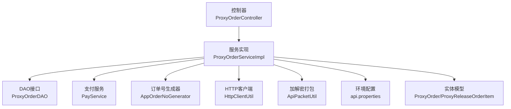
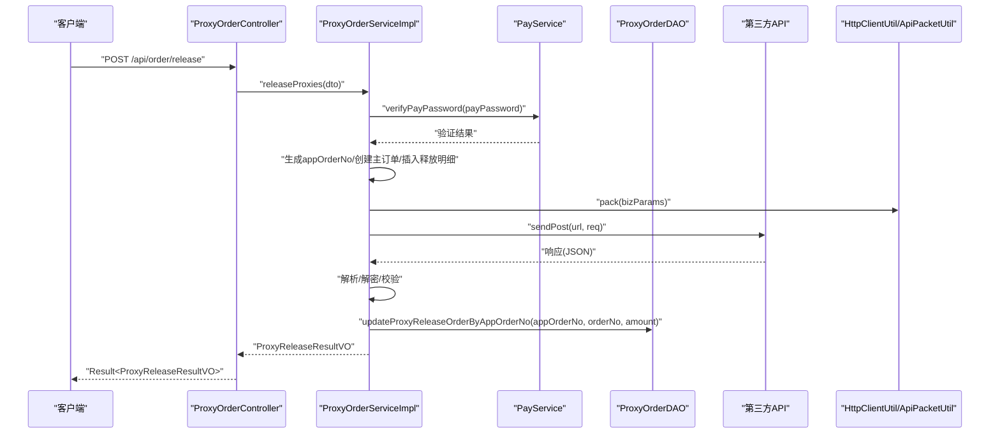
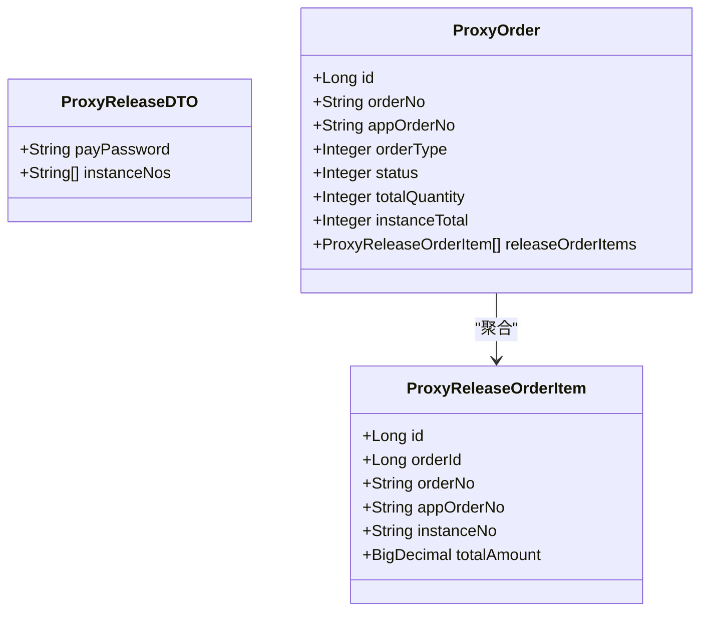
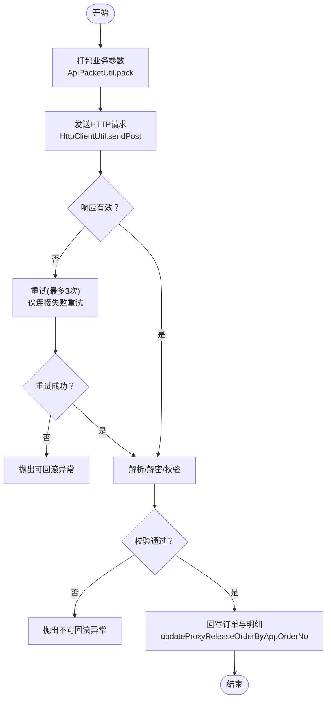
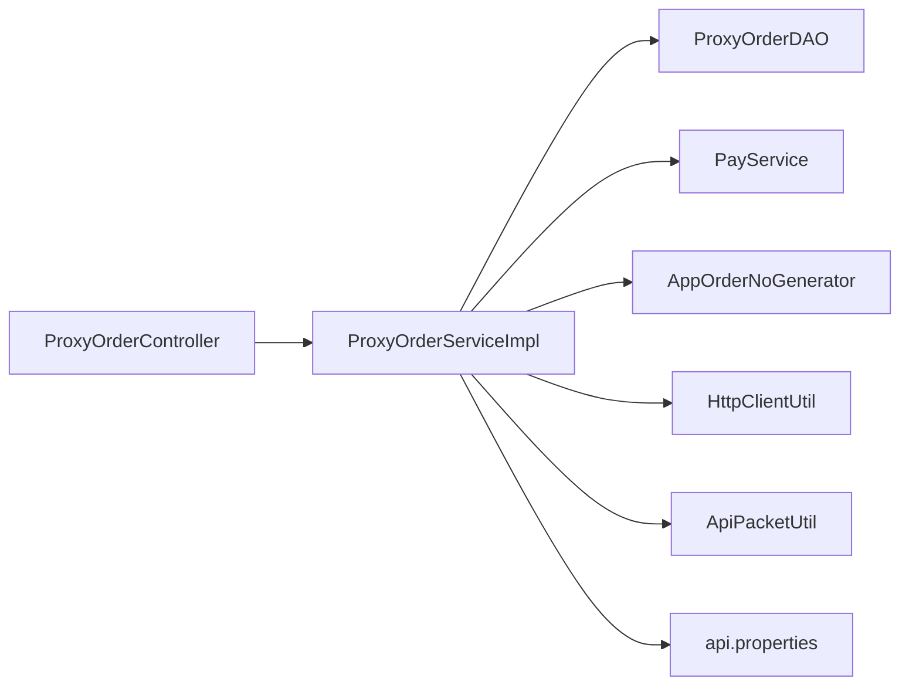

# 订单释放管理

<cite>
**本文引用的文件**
- [ProxyReleaseDTO.java](file://src/main/java/cn/linkfast/dto/ProxyReleaseDTO.java)
- [ProxyReleaseOrderItem.java](file://src/main/java/cn/linkfast/entity/ProxyReleaseOrderItem.java)
- [ProxyOrderServiceImpl.java](file://src/main/java/cn/linkfast/service/impl/ProxyOrderServiceImpl.java)
- [ProxyOrderController.java](file://src/main/java/cn/linkfast/controller/ProxyOrderController.java)
- [ProxyReleaseResultVO.java](file://src/main/java/cn/linkfast/vo/ProxyReleaseResultVO.java)
- [ProxyOrderDAO.java](file://src/main/java/cn/linkfast/dao/ProxyOrderDAO.java)
- [ProxyOrder.java](file://src/main/java/cn/linkfast/entity/ProxyOrder.java)
- [HttpClientUtil.java](file://src/main/java/cn/linkfast/utils/HttpClientUtil.java)
- [ApiPacketUtil.java](file://src/main/java/cn/linkfast/utils/ApiPacketUtil.java)
- [AppOrderNoGenerator.java](file://src/main/java/cn/linkfast/utils/AppOrderNoGenerator.java)
- [api.properties](file://src/main/resources/api.properties)
- [释放代理实例接口.md](file://docs/api/internal/释放代理实例接口.md)
- [ProxyOrderServiceImplTest.java](file://src/test/java/cn/linkfast/service/Impl/ProxyOrderServiceImplTest.java)
</cite>

## 目录
1. [简介](#简介)
2. [项目结构](#项目结构)
3. [核心组件](#核心组件)
4. [架构总览](#架构总览)
5. [详细组件分析](#详细组件分析)
6. [依赖分析](#依赖分析)
7. [性能考虑](#性能考虑)
8. [故障排查指南](#故障排查指南)
9. [结论](#结论)
10. [附录](#附录)

## 简介
本文档围绕“订单释放管理”功能，系统化阐述代理实例释放的完整业务流程，包括：
- 释放订单创建与持久化
- 支付密码验证
- 第三方API调用与重试机制
- 释放结果回写与状态更新
- 幂等性与并发控制策略
- 异常处理与恢复策略
- 扩展点与自定义释放规则的实现指导

目标是帮助开发者快速理解并安全地扩展释放能力。

## 项目结构
围绕释放功能的关键模块与职责如下：
- 控制器层：接收释放请求，进行基础校验并委派服务层
- 服务层：负责释放订单创建、支付验证、第三方API调用、重试与异常处理、结果回写
- DAO层：负责订单与明细的持久化与回写
- 工具层：HTTP客户端、加解密打包、订单号生成
- 配置与文档：第三方接口路径、环境配置、接口文档

图表来源
- [ProxyOrderController.java:1-88](file://src/main/java/cn/linkfast/controller/ProxyOrderController.java#L1-L88)
- [ProxyOrderServiceImpl.java:1-782](file://src/main/java/cn/linkfast/service/impl/ProxyOrderServiceImpl.java#L1-L782)
- [ProxyOrderDAO.java:1-102](file://src/main/java/cn/linkfast/dao/ProxyOrderDAO.java#L1-L102)
- [AppOrderNoGenerator.java:1-45](file://src/main/java/cn/linkfast/utils/AppOrderNoGenerator.java#L1-L45)
- [HttpClientUtil.java:1-46](file://src/main/java/cn/linkfast/utils/HttpClientUtil.java#L1-L46)
- [ApiPacketUtil.java:1-106](file://src/main/java/cn/linkfast/utils/ApiPacketUtil.java#L1-L106)
- [api.properties:1-31](file://src/main/resources/api.properties#L1-L31)
- [ProxyOrder.java:1-45](file://src/main/java/cn/linkfast/entity/ProxyOrder.java#L1-L45)
- [ProxyReleaseOrderItem.java:1-44](file://src/main/java/cn/linkfast/entity/ProxyReleaseOrderItem.java#L1-L44)

章节来源
- [ProxyOrderController.java:1-88](file://src/main/java/cn/linkfast/controller/ProxyOrderController.java#L1-L88)
- [ProxyOrderServiceImpl.java:1-782](file://src/main/java/cn/linkfast/service/impl/ProxyOrderServiceImpl.java#L1-L782)
- [ProxyOrderDAO.java:1-102](file://src/main/java/cn/linkfast/dao/ProxyOrderDAO.java#L1-L102)
- [AppOrderNoGenerator.java:1-45](file://src/main/java/cn/linkfast/utils/AppOrderNoGenerator.java#L1-L45)
- [HttpClientUtil.java:1-46](file://src/main/java/cn/linkfast/utils/HttpClientUtil.java#L1-L46)
- [ApiPacketUtil.java:1-106](file://src/main/java/cn/linkfast/utils/ApiPacketUtil.java#L1-L106)
- [api.properties:1-31](file://src/main/resources/api.properties#L1-L31)
- [ProxyOrder.java:1-45](file://src/main/java/cn/linkfast/entity/ProxyOrder.java#L1-L45)
- [ProxyReleaseOrderItem.java:1-44](file://src/main/java/cn/linkfast/entity/ProxyReleaseOrderItem.java#L1-L44)

## 核心组件
- 释放请求DTO：ProxyReleaseDTO，包含支付密码与实例编号列表
- 释放订单明细实体：ProxyReleaseOrderItem，对应数据库表proxy_release_order_item
- 释放结果VO：ProxyReleaseResultVO，对外返回appOrderNo、orderNo、status、amount
- 服务实现：ProxyOrderServiceImpl.releaseProxies，串联支付验证、订单创建、第三方调用、回写与异常处理
- 控制器：ProxyOrderController.releaseProxies，暴露REST接口
- DAO接口：ProxyOrderDAO.updateProxyReleaseOrderByAppOrderNo等，负责回写第三方返回的orderNo与amount
- 工具：HttpClientUtil、ApiPacketUtil、AppOrderNoGenerator、api.properties

章节来源
- [ProxyReleaseDTO.java:1-27](file://src/main/java/cn/linkfast/dto/ProxyReleaseDTO.java#L1-L27)
- [ProxyReleaseOrderItem.java:1-44](file://src/main/java/cn/linkfast/entity/ProxyReleaseOrderItem.java#L1-L44)
- [ProxyReleaseResultVO.java:1-21](file://src/main/java/cn/linkfast/vo/ProxyReleaseResultVO.java#L1-L21)
- [ProxyOrderServiceImpl.java:637-782](file://src/main/java/cn/linkfast/service/impl/ProxyOrderServiceImpl.java#L637-L782)
- [ProxyOrderController.java:69-85](file://src/main/java/cn/linkfast/controller/ProxyOrderController.java#L69-L85)
- [ProxyOrderDAO.java:90-93](file://src/main/java/cn/linkfast/dao/ProxyOrderDAO.java#L90-L93)
- [AppOrderNoGenerator.java:14-45](file://src/main/java/cn/linkfast/utils/AppOrderNoGenerator.java#L14-L45)
- [HttpClientUtil.java:15-46](file://src/main/java/cn/linkfast/utils/HttpClientUtil.java#L15-L46)
- [ApiPacketUtil.java:14-106](file://src/main/java/cn/linkfast/utils/ApiPacketUtil.java#L14-L106)
- [api.properties:14-31](file://src/main/resources/api.properties#L14-L31)

## 架构总览
释放流程的端到端交互如下：

图表来源
- [ProxyOrderController.java:69-85](file://src/main/java/cn/linkfast/controller/ProxyOrderController.java#L69-L85)
- [ProxyOrderServiceImpl.java:637-782](file://src/main/java/cn/linkfast/service/impl/ProxyOrderServiceImpl.java#L637-L782)
- [ProxyOrderDAO.java:90-93](file://src/main/java/cn/linkfast/dao/ProxyOrderDAO.java#L90-L93)
- [HttpClientUtil.java:27-44](file://src/main/java/cn/linkfast/utils/HttpClientUtil.java#L27-L44)
- [ApiPacketUtil.java:58-92](file://src/main/java/cn/linkfast/utils/ApiPacketUtil.java#L58-L92)

## 详细组件分析

### 1) 释放请求DTO与实体模型
- ProxyReleaseDTO：约束支付密码与实例编号列表非空
- ProxyReleaseOrderItem：释放订单明细字段（orderId、orderNo、appOrderNo、instanceNo、totalAmount等）
- ProxyOrder：订单主表与聚合的releaseOrderItems

图表来源
- [ProxyReleaseDTO.java:13-26](file://src/main/java/cn/linkfast/dto/ProxyReleaseDTO.java#L13-L26)
- [ProxyReleaseOrderItem.java:18-43](file://src/main/java/cn/linkfast/entity/ProxyReleaseOrderItem.java#L18-L43)
- [ProxyOrder.java:17-45](file://src/main/java/cn/linkfast/entity/ProxyOrder.java#L17-L45)

章节来源
- [ProxyReleaseDTO.java:1-27](file://src/main/java/cn/linkfast/dto/ProxyReleaseDTO.java#L1-L27)
- [ProxyReleaseOrderItem.java:1-44](file://src/main/java/cn/linkfast/entity/ProxyReleaseOrderItem.java#L1-L44)
- [ProxyOrder.java:1-45](file://src/main/java/cn/linkfast/entity/ProxyOrder.java#L1-L45)

### 2) 释放订单创建与转换逻辑
- 支付密码验证：通过PayService.verifyPayPassword进行校验
- 订单号生成：使用AppOrderNoGenerator生成以“F”开头的释放订单号
- 主订单与明细持久化：先insertOrder，再insertProxyReleaseOrderItems
- 实例释放列表构建：基于请求中的instanceNos逐条构造ProxyReleaseOrderItem

章节来源
- [ProxyOrderServiceImpl.java:637-667](file://src/main/java/cn/linkfast/service/impl/ProxyOrderServiceImpl.java#L637-L667)
- [AppOrderNoGenerator.java:38-43](file://src/main/java/cn/linkfast/utils/AppOrderNoGenerator.java#L38-L43)
- [ProxyOrderDAO.java:82-88](file://src/main/java/cn/linkfast/dao/ProxyOrderDAO.java#L82-L88)

### 3) 第三方API调用与重试机制
- 请求参数打包：使用ApiPacketUtil.pack对业务参数进行AES-CBC加密与Base64编码，并附加公共头
- 发送请求：通过HttpClientUtil.sendPost以JSON方式POST至baseUrl+instanceReleasePath
- 重试策略：最多3次，每次间隔递增；仅在网络连接失败（ConnectException/UnknownHostException）时重试，其余异常视为“请求已发送”，不回滚
- 响应解析：校验code=200、data节点存在且非空、解密成功、orderNo/amount解析成功后，方可回写

图表来源
- [ProxyOrderServiceImpl.java:674-779](file://src/main/java/cn/linkfast/service/impl/ProxyOrderServiceImpl.java#L674-L779)
- [ApiPacketUtil.java:58-92](file://src/main/java/cn/linkfast/utils/ApiPacketUtil.java#L58-L92)
- [HttpClientUtil.java:27-44](file://src/main/java/cn/linkfast/utils/HttpClientUtil.java#L27-L44)
- [ProxyOrderDAO.java:90-93](file://src/main/java/cn/linkfast/dao/ProxyOrderDAO.java#L90-L93)

章节来源
- [ProxyOrderServiceImpl.java:674-779](file://src/main/java/cn/linkfast/service/impl/ProxyOrderServiceImpl.java#L674-L779)
- [ApiPacketUtil.java:58-92](file://src/main/java/cn/linkfast/utils/ApiPacketUtil.java#L58-L92)
- [HttpClientUtil.java:27-44](file://src/main/java/cn/linkfast/utils/HttpClientUtil.java#L27-L44)
- [ProxyOrderDAO.java:90-93](file://src/main/java/cn/linkfast/dao/ProxyOrderDAO.java#L90-L93)

### 4) 释放结果回写与状态更新
- 回写方法：updateProxyReleaseOrderByAppOrderNo(appOrderNo, orderNo, amount)
- 返回VO：ProxyReleaseResultVO包含appOrderNo、orderNo、status、amount
- 状态约定：返回的status为1（待处理）

章节来源
- [ProxyOrderDAO.java:90-93](file://src/main/java/cn/linkfast/dao/ProxyOrderDAO.java#L90-L93)
- [ProxyReleaseResultVO.java:14-20](file://src/main/java/cn/linkfast/vo/ProxyReleaseResultVO.java#L14-L20)
- [ProxyOrderServiceImpl.java:766-773](file://src/main/java/cn/linkfast/service/impl/ProxyOrderServiceImpl.java#L766-L773)

### 5) 幂等性与并发控制
- 订单号幂等：AppOrderNoGenerator使用Snowflake生成全局唯一appOrderNo，避免重复
- 重试幂等：仅在“连接失败”场景重试，确保请求不会重复提交；其他异常视为“请求已发送”，不回滚
- 并发控制：服务层使用@Transactional标注，结合NoRollbackBusinessException区分可回滚与不可回滚场景，避免重复处理

章节来源
- [AppOrderNoGenerator.java:24-43](file://src/main/java/cn/linkfast/utils/AppOrderNoGenerator.java#L24-L43)
- [ProxyOrderServiceImpl.java:679-700](file://src/main/java/cn/linkfast/service/impl/ProxyOrderServiceImpl.java#L679-L700)
- [ProxyOrderServiceImpl.java:774-778](file://src/main/java/cn/linkfast/service/impl/ProxyOrderServiceImpl.java#L774-L778)

### 6) 异常处理策略
- 连接失败（可重试）：抛出业务异常，触发事务回滚
- 请求已发送但响应异常（不可回滚）：抛出NoRollbackBusinessException，保留本地数据，等待人工确认
- 响应为空/非法JSON/data缺失/解密失败/数据解析失败：均视为“对方可能已落库”，抛出不可回滚异常
- 兜底异常：捕获未知异常，统一包装为业务异常并回滚

章节来源
- [ProxyOrderServiceImpl.java:679-700](file://src/main/java/cn/linkfast/service/impl/ProxyOrderServiceImpl.java#L679-L700)
- [ProxyOrderServiceImpl.java:706-717](file://src/main/java/cn/linkfast/service/impl/ProxyOrderServiceImpl.java#L706-L717)
- [ProxyOrderServiceImpl.java:719-735](file://src/main/java/cn/linkfast/service/impl/ProxyOrderServiceImpl.java#L719-L735)
- [ProxyOrderServiceImpl.java:737-743](file://src/main/java/cn/linkfast/service/impl/ProxyOrderServiceImpl.java#L737-L743)
- [ProxyOrderServiceImpl.java:746-764](file://src/main/java/cn/linkfast/service/impl/ProxyOrderServiceImpl.java#L746-L764)
- [ProxyOrderServiceImpl.java:774-778](file://src/main/java/cn/linkfast/service/impl/ProxyOrderServiceImpl.java#L774-L778)

### 7) 扩展点与自定义释放规则
- 自定义释放规则：可在releaseProxies入口处增加前置校验（如实例状态检查、白名单过滤、风控策略）
- 自定义重试策略：调整重试次数与退避策略，或引入熔断降级
- 自定义回写策略：扩展DAO层回写逻辑，支持多维度状态同步
- 自定义异常策略：针对特定第三方错误码映射为业务语义，增强可观测性

章节来源
- [ProxyOrderServiceImpl.java:637-667](file://src/main/java/cn/linkfast/service/impl/ProxyOrderServiceImpl.java#L637-L667)
- [ProxyOrderDAO.java:90-93](file://src/main/java/cn/linkfast/dao/ProxyOrderDAO.java#L90-L93)

## 依赖分析
- 控制器依赖服务实现，服务实现依赖DAO、支付服务、订单号生成器、HTTP工具与加解密工具
- 服务实现依赖环境配置api.properties决定第三方基础URL与接口路径
- 测试覆盖了processResponse的映射与错误分支，有助于理解响应解析与异常处理

图表来源
- [ProxyOrderController.java:25-26](file://src/main/java/cn/linkfast/controller/ProxyOrderController.java#L25-L26)
- [ProxyOrderServiceImpl.java:39-45](file://src/main/java/cn/linkfast/service/impl/ProxyOrderServiceImpl.java#L39-L45)
- [ProxyOrderDAO.java:1-102](file://src/main/java/cn/linkfast/dao/ProxyOrderDAO.java#L1-L102)
- [AppOrderNoGenerator.java:14-45](file://src/main/java/cn/linkfast/utils/AppOrderNoGenerator.java#L14-L45)
- [HttpClientUtil.java:15-46](file://src/main/java/cn/linkfast/utils/HttpClientUtil.java#L15-L46)
- [ApiPacketUtil.java:14-106](file://src/main/java/cn/linkfast/utils/ApiPacketUtil.java#L14-L106)
- [api.properties:1-31](file://src/main/resources/api.properties#L1-L31)

章节来源
- [ProxyOrderServiceImplTest.java:45-89](file://src/test/java/cn/linkfast/service/Impl/ProxyOrderServiceImplTest.java#L45-L89)

## 性能考虑
- 异步更新：购买流程中对产品库存的异步更新避免阻塞下单主链路（可借鉴到释放流程的非关键路径）
- 批量处理：释放支持批量实例，减少多次第三方调用开销
- 重试退避：连接失败采用递增退避，降低对第三方的压力峰值
- 日志与监控：建议在关键节点埋点，结合响应时间与错误率进行容量评估

## 故障排查指南
- 支付密码错误：检查PayService返回的验证结果，确认DTO参数与服务端配置一致
- 连接失败：确认网络连通性与DNS解析；检查api.properties中的环境与URL配置
- 响应异常：关注日志中的HTTP状态码与第三方返回消息，必要时开启抓包定位
- 不可回滚异常：此类场景需人工核对第三方订单状态，避免重复释放
- 单元测试参考：通过测试用例验证processResponse的映射与错误分支行为

章节来源
- [ProxyOrderController.java:73-84](file://src/main/java/cn/linkfast/controller/ProxyOrderController.java#L73-L84)
- [ProxyOrderServiceImpl.java:637-779](file://src/main/java/cn/linkfast/service/impl/ProxyOrderServiceImpl.java#L637-L779)
- [ProxyOrderServiceImplTest.java:45-89](file://src/test/java/cn/linkfast/service/Impl/ProxyOrderServiceImplTest.java#L45-L89)

## 结论
释放管理功能通过清晰的分层设计与严谨的异常处理策略，实现了从请求到回写的闭环。其重试机制与不可回滚异常的区分，有效平衡了可靠性与一致性。建议在实际落地中结合业务规则扩展前置校验与回写策略，并持续完善监控与告警体系。

## 附录
- 接口文档：释放代理实例接口的请求与返回规范
- 配置项：第三方接口路径与环境开关

章节来源
- [释放代理实例接口.md:1-112](file://docs/api/internal/释放代理实例接口.md#L1-L112)
- [api.properties:14-31](file://src/main/resources/api.properties#L14-L31)