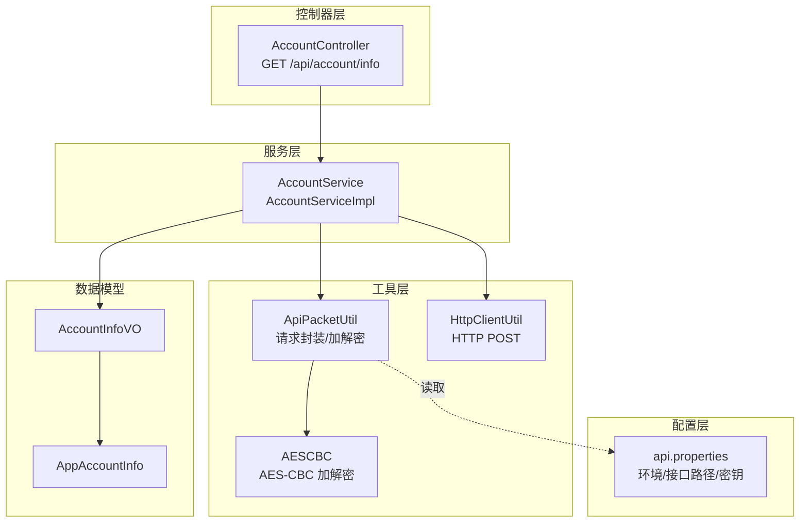
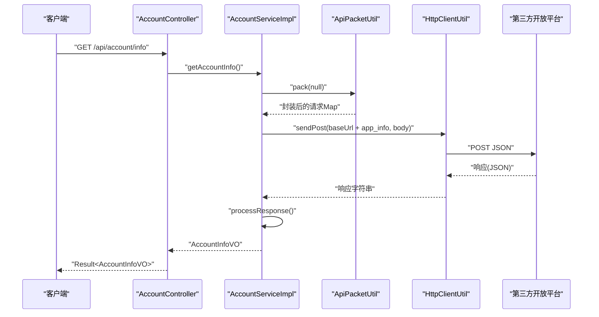
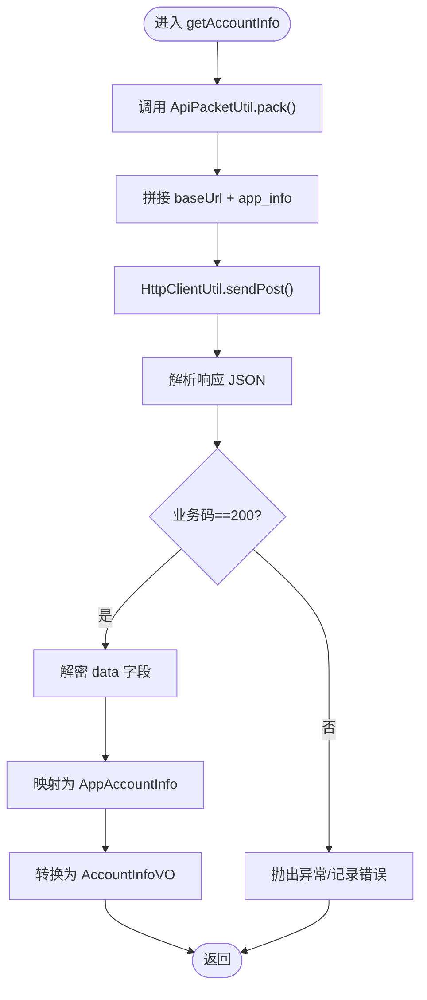
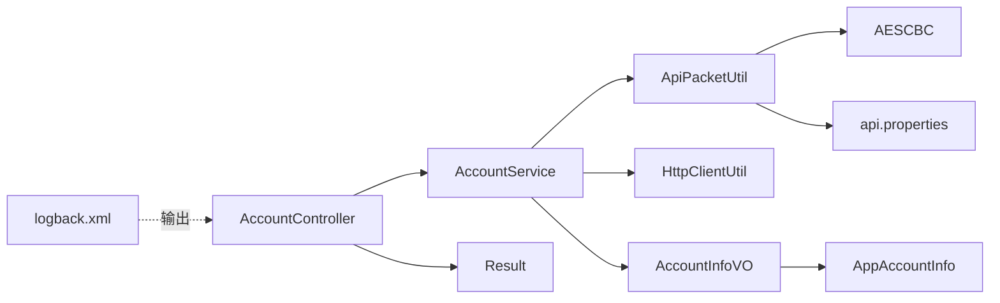

# 账户业务逻辑

<cite>
**本文引用的文件**
- [AccountController.java](file://src/main/java/cn/linkfast/controller/AccountController.java)
- [AccountService.java](file://src/main/java/cn/linkfast/service/AccountService.java)
- [AccountServiceImpl.java](file://src/main/java/cn/linkfast/service/impl/AccountServiceImpl.java)
- [AccountInfoVO.java](file://src/main/java/cn/linkfast/vo/AccountInfoVO.java)
- [AppAccountInfo.java](file://src/main/java/cn/linkfast/entity/AppAccountInfo.java)
- [ApiPacketUtil.java](file://src/main/java/cn/linkfast/utils/ApiPacketUtil.java)
- [HttpClientUtil.java](file://src/main/java/cn/linkfast/utils/HttpClientUtil.java)
- [AESCBC.java](file://src/main/java/cn/linkfast/utils/AESCBC.java)
- [api.properties](file://src/main/resources/api.properties)
- [Result.java](file://src/main/java/cn/linkfast/common/Result.java)
- [UserDao.java](file://src/main/java/cn/linkfast/dao/UserDao.java)
- [UserDaoImpl.java](file://src/main/java/cn/linkfast/dao/impl/UserDaoImpl.java)
- [User.java](file://src/main/java/cn/linkfast/entity/User.java)
- [logback.xml](file://src/main/resources/logback.xml)
</cite>

## 目录
1. [简介](#简介)
2. [项目结构](#项目结构)
3. [核心组件](#核心组件)
4. [架构总览](#架构总览)
5. [详细组件分析](#详细组件分析)
6. [依赖分析](#依赖分析)
7. [性能考虑](#性能考虑)
8. [故障排查指南](#故障排查指南)
9. [结论](#结论)
10. [附录](#附录)

## 简介
本文件聚焦账户业务逻辑，围绕账户信息查询、数据模型设计、安全策略、验证机制、缓存与实时同步、扩展点以及安全加固与审计日志进行系统化梳理。当前仓库中账户相关能力主要体现在“应用账户信息查询”能力，通过控制器暴露查询接口，服务层对接第三方开放平台，完成请求封装、加密、发送与响应解密、解析，最终返回账户余额与信用额度等关键信息。

## 项目结构
账户业务涉及的模块与文件分布如下：
- 控制器层：对外提供查询接口
- 服务层：封装业务流程与第三方交互
- 工具层：加密/解密、HTTP 客户端封装
- 配置层：环境与接口路径配置
- VO/Entity 层：数据传输与实体建模
- DAO 层：用户数据访问（与账户信息查询无直接耦合，但体现系统数据模型）

图表来源
- [AccountController.java:17-21](file://src/main/java/cn/linkfast/controller/AccountController.java#L17-L21)
- [AccountServiceImpl.java:44-64](file://src/main/java/cn/linkfast/service/impl/AccountServiceImpl.java#L44-L64)
- [ApiPacketUtil.java:58-92](file://src/main/java/cn/linkfast/utils/ApiPacketUtil.java#L58-L92)
- [HttpClientUtil.java:27-44](file://src/main/java/cn/linkfast/utils/HttpClientUtil.java#L27-L44)
- [AESCBC.java:20-30](file://src/main/java/cn/linkfast/utils/AESCBC.java#L20-L30)
- [api.properties:1-31](file://src/main/resources/api.properties#L1-L31)
- [AccountInfoVO.java:6-13](file://src/main/java/cn/linkfast/vo/AccountInfoVO.java#L6-L13)
- [AppAccountInfo.java:15-49](file://src/main/java/cn/linkfast/entity/AppAccountInfo.java#L15-L49)

章节来源
- [AccountController.java:1-24](file://src/main/java/cn/linkfast/controller/AccountController.java#L1-L24)
- [AccountService.java:1-9](file://src/main/java/cn/linkfast/service/AccountService.java#L1-L9)
- [AccountServiceImpl.java:1-83](file://src/main/java/cn/linkfast/service/impl/AccountServiceImpl.java#L1-L83)
- [AccountInfoVO.java:1-15](file://src/main/java/cn/linkfast/vo/AccountInfoVO.java#L1-L15)
- [AppAccountInfo.java:1-50](file://src/main/java/cn/linkfast/entity/AppAccountInfo.java#L1-L50)
- [ApiPacketUtil.java:1-106](file://src/main/java/cn/linkfast/utils/ApiPacketUtil.java#L1-L106)
- [HttpClientUtil.java:1-46](file://src/main/java/cn/linkfast/utils/HttpClientUtil.java#L1-L46)
- [AESCBC.java:1-36](file://src/main/java/cn/linkfast/utils/AESCBC.java#L1-L36)
- [api.properties:1-31](file://src/main/resources/api.properties#L1-L31)

## 核心组件
- 控制器：提供账户信息查询接口，返回统一结果包装。
- 服务：负责环境选择、请求封装、调用第三方接口、响应解密与解析。
- 工具：请求打包、AES-CBC 加解密、HTTP 客户端。
- 配置：环境切换、接口路径、应用密钥与密文。
- 数据模型：VO 用于对外返回，Entity 用于承载第三方返回的账户信息。

章节来源
- [AccountController.java:17-21](file://src/main/java/cn/linkfast/controller/AccountController.java#L17-L21)
- [AccountService.java:5-7](file://src/main/java/cn/linkfast/service/AccountService.java#L5-L7)
- [AccountServiceImpl.java:44-80](file://src/main/java/cn/linkfast/service/impl/AccountServiceImpl.java#L44-L80)
- [ApiPacketUtil.java:58-105](file://src/main/java/cn/linkfast/utils/ApiPacketUtil.java#L58-L105)
- [HttpClientUtil.java:27-44](file://src/main/java/cn/linkfast/utils/HttpClientUtil.java#L27-L44)
- [AccountInfoVO.java:6-13](file://src/main/java/cn/linkfast/vo/AccountInfoVO.java#L6-L13)
- [AppAccountInfo.java:15-49](file://src/main/java/cn/linkfast/entity/AppAccountInfo.java#L15-L49)
- [api.properties:1-31](file://src/main/resources/api.properties#L1-L31)

## 架构总览
账户信息查询的整体流程如下：
- 控制器接收请求，调用服务层。
- 服务层根据环境配置选择目标域名与接口路径。
- 使用工具类对请求参数进行序列化、AES-CBC 加密、Base64 编码，并组装公共参数。
- 通过 HTTP 客户端发送 POST 请求至第三方接口。
- 对响应进行解析，若业务码为 200，则解密 data 字段，映射为实体对象，再转换为 VO 返回。

图表来源
- [AccountController.java:17-21](file://src/main/java/cn/linkfast/controller/AccountController.java#L17-L21)
- [AccountServiceImpl.java:44-80](file://src/main/java/cn/linkfast/service/impl/AccountServiceImpl.java#L44-L80)
- [ApiPacketUtil.java:58-92](file://src/main/java/cn/linkfast/utils/ApiPacketUtil.java#L58-L92)
- [HttpClientUtil.java:27-44](file://src/main/java/cn/linkfast/utils/HttpClientUtil.java#L27-L44)
- [api.properties:26-27](file://src/main/resources/api.properties#L26-L27)

## 详细组件分析

### 控制器：AccountController
- 职责：暴露查询接口，调用服务层并返回统一结果包装。
- 关键点：接口路径为 /api/account/info，返回 Result<AccountInfoVO>。

章节来源
- [AccountController.java:17-21](file://src/main/java/cn/linkfast/controller/AccountController.java#L17-L21)
- [Result.java:28-35](file://src/main/java/cn/linkfast/common/Result.java#L28-L35)

### 服务：AccountService 与 AccountServiceImpl
- AccountService：定义 getAccountInfo() 查询方法。
- AccountServiceImpl：
  - 环境初始化：根据 api.properties 中的环境变量选择生产或沙箱域名。
  - 请求封装：调用 ApiPacketUtil.pack() 进行版本、加密方式、appKey、reqId 与 params（如有）组装。
  - HTTP 调用：使用 HttpClientUtil.sendPost() 发送请求。
  - 响应处理：解析 JSON，校验业务码，解密 data 并反序列化为 AppAccountInfo，再映射为 AccountInfoVO 返回。
  - 异常处理：捕获异常并记录日志，返回空值以供上层处理。

图表来源
- [AccountServiceImpl.java:44-80](file://src/main/java/cn/linkfast/service/impl/AccountServiceImpl.java#L44-L80)
- [ApiPacketUtil.java:58-105](file://src/main/java/cn/linkfast/utils/ApiPacketUtil.java#L58-L105)
- [HttpClientUtil.java:27-44](file://src/main/java/cn/linkfast/utils/HttpClientUtil.java#L27-L44)

章节来源
- [AccountService.java:5-7](file://src/main/java/cn/linkfast/service/AccountService.java#L5-L7)
- [AccountServiceImpl.java:35-80](file://src/main/java/cn/linkfast/service/impl/AccountServiceImpl.java#L35-L80)

### 工具：ApiPacketUtil 与 AESCBC
- ApiPacketUtil：
  - 初始化：根据环境变量选择 appKey 与 appSecret，并从密钥中截取 IV。
  - pack：将业务参数序列化为 JSON，AES-CBC 加密，Base64 编码，组装公共字段（version、encrypt、appKey、reqId、params）。
  - unpack：对响应中的 data 进行 Base64 解码与 AES-CBC 解密。
- AESCBC：提供 AES-CBC 加密与解密的底层实现。

章节来源
- [ApiPacketUtil.java:41-105](file://src/main/java/cn/linkfast/utils/ApiPacketUtil.java#L41-L105)
- [AESCBC.java:20-30](file://src/main/java/cn/linkfast/utils/AESCBC.java#L20-L30)

### 配置：api.properties
- 环境与域名：api.ipv.env、api.ipv.sandbox_url、api.ipv.prod_url。
- 应用凭证：api.ipv.sandbox.appKey、api.ipv.prod.appKey、api.ipv.sandbox.appSecret、api.ipv.prod.appSecret。
- 接口路径：api.ipv.path.app_info 等。

章节来源
- [api.properties:1-31](file://src/main/resources/api.properties#L1-L31)

### 数据模型：AccountInfoVO 与 AppAccountInfo
- AccountInfoVO：对外返回的账户信息 VO，包含 coin、credit 等字段。
- AppAccountInfo：第三方返回的账户信息实体，包含 appName、coin、credit、useBridge、callbackUrl、status 等字段，并忽略未知字段以提升兼容性。

章节来源
- [AccountInfoVO.java:6-13](file://src/main/java/cn/linkfast/vo/AccountInfoVO.java#L6-L13)
- [AppAccountInfo.java:15-49](file://src/main/java/cn/linkfast/entity/AppAccountInfo.java#L15-L49)

### 用户数据访问：UserDao 与 UserDaoImpl
- UserDao：定义用户 CRUD 接口。
- UserDaoImpl：基于并发安全的内存存储模拟数据库，提供查找、保存、更新、删除等操作。

章节来源
- [UserDao.java:9-35](file://src/main/java/cn/linkfast/dao/UserDao.java#L9-L35)
- [UserDaoImpl.java:17-55](file://src/main/java/cn/linkfast/dao/impl/UserDaoImpl.java#L17-L55)
- [User.java:6-74](file://src/main/java/cn/linkfast/entity/User.java#L6-L74)

## 依赖分析
- 控制器依赖服务接口 AccountService。
- 服务实现依赖 ApiPacketUtil、HttpClientUtil、ObjectMapper。
- ApiPacketUtil 依赖 AESCBC、api.properties。
- AccountServiceImpl 依赖 AppAccountInfo、AccountInfoVO。
- 日志配置 logback.xml 将业务日志与服务器日志分离输出。

图表来源
- [AccountController.java:1-24](file://src/main/java/cn/linkfast/controller/AccountController.java#L1-L24)
- [AccountServiceImpl.java:1-83](file://src/main/java/cn/linkfast/service/impl/AccountServiceImpl.java#L1-L83)
- [ApiPacketUtil.java:1-106](file://src/main/java/cn/linkfast/utils/ApiPacketUtil.java#L1-L106)
- [HttpClientUtil.java:1-46](file://src/main/java/cn/linkfast/utils/HttpClientUtil.java#L1-L46)
- [AESCBC.java:1-36](file://src/main/java/cn/linkfast/utils/AESCBC.java#L1-L36)
- [AccountInfoVO.java:1-15](file://src/main/java/cn/linkfast/vo/AccountInfoVO.java#L1-L15)
- [AppAccountInfo.java:1-50](file://src/main/java/cn/linkfast/entity/AppAccountInfo.java#L1-L50)
- [Result.java:1-59](file://src/main/java/cn/linkfast/common/Result.java#L1-L59)
- [logback.xml:1-48](file://src/main/resources/logback.xml#L1-L48)

章节来源
- [AccountController.java:1-24](file://src/main/java/cn/linkfast/controller/AccountController.java#L1-L24)
- [AccountServiceImpl.java:1-83](file://src/main/java/cn/linkfast/service/impl/AccountServiceImpl.java#L1-L83)
- [ApiPacketUtil.java:1-106](file://src/main/java/cn/linkfast/utils/ApiPacketUtil.java#L1-L106)
- [HttpClientUtil.java:1-46](file://src/main/java/cn/linkfast/utils/HttpClientUtil.java#L1-L46)
- [AESCBC.java:1-36](file://src/main/java/cn/linkfast/utils/AESCBC.java#L1-L36)
- [AccountInfoVO.java:1-15](file://src/main/java/cn/linkfast/vo/AccountInfoVO.java#L1-L15)
- [AppAccountInfo.java:1-50](file://src/main/java/cn/linkfast/entity/AppAccountInfo.java#L1-L50)
- [Result.java:1-59](file://src/main/java/cn/linkfast/common/Result.java#L1-L59)
- [logback.xml:1-48](file://src/main/resources/logback.xml#L1-L48)

## 性能考虑
- 网络调用：HTTP 客户端每次请求都会创建连接，建议结合连接池与超时策略优化（当前实现为默认客户端，未显式配置连接池参数）。
- 加解密开销：AES-CBC 在请求与响应两端均执行，建议评估批量请求合并与缓存策略以降低重复调用。
- 响应解析：使用 Jackson 进行 JSON 解析与映射，注意避免在高频路径中重复创建对象。
- 日志输出：业务日志单独落盘并按天滚动，避免频繁 IO 影响性能。

## 故障排查指南
- 环境配置问题：确认 api.properties 中的 api.ipv.env、域名与密钥配置正确。
- 加解密异常：检查 appSecret 长度与 IV 截取逻辑，确保密钥与加密参数一致。
- HTTP 错误：关注 HttpClientUtil 返回的状态码与错误日志，定位第三方接口异常。
- 业务码异常：AccountServiceImpl.processResponse 中当业务码非 200 时会抛出异常，需检查第三方返回 msg 与 code。
- 日志定位：业务日志输出到 linkfast-business.log，服务器日志输出到 linkfast-server.log，可通过日志快速定位问题。

章节来源
- [api.properties:1-31](file://src/main/resources/api.properties#L1-L31)
- [ApiPacketUtil.java:41-53](file://src/main/java/cn/linkfast/utils/ApiPacketUtil.java#L41-L53)
- [HttpClientUtil.java:34-42](file://src/main/java/cn/linkfast/utils/HttpClientUtil.java#L34-L42)
- [AccountServiceImpl.java:66-80](file://src/main/java/cn/linkfast/service/impl/AccountServiceImpl.java#L66-L80)
- [logback.xml:6-47](file://src/main/resources/logback.xml#L6-L47)

## 结论
账户业务当前以“应用账户信息查询”为核心，采用统一的请求封装与加解密机制对接第三方开放平台，返回关键资产指标。整体架构清晰、职责明确，具备良好的可扩展性与安全性基础。后续可在缓存与实时同步、权限控制、审计日志等方面进一步增强。

## 附录

### 账户数据模型设计
- AccountInfoVO：对外返回的最小必要字段集合，便于前端展示与集成。
- AppAccountInfo：承载第三方返回的完整账户信息，包含状态、回调地址、桥接开关等，便于后续扩展。

章节来源
- [AccountInfoVO.java:6-13](file://src/main/java/cn/linkfast/vo/AccountInfoVO.java#L6-L13)
- [AppAccountInfo.java:15-49](file://src/main/java/cn/linkfast/entity/AppAccountInfo.java#L15-L49)

### 验证机制与安全策略
- 身份认证：通过 appKey 与 appSecret 进行请求签名与解密，确保通信双方身份可信。
- 数据完整性：使用 AES-CBC 加密与 Base64 编码，防止中间环节篡改。
- 环境隔离：通过 api.ipv.env 切换生产/沙箱环境，避免误用。

章节来源
- [ApiPacketUtil.java:24-53](file://src/main/java/cn/linkfast/utils/ApiPacketUtil.java#L24-L53)
- [AESCBC.java:20-30](file://src/main/java/cn/linkfast/utils/AESCBC.java#L20-L30)
- [api.properties:1-31](file://src/main/resources/api.properties#L1-L31)

### 缓存策略与实时同步
- 当前实现为直连第三方实时查询，未内置本地缓存。
- 建议：引入本地缓存（如 Redis）与失效策略，结合定时刷新与事件驱动更新，降低外部依赖与延迟。

### 扩展点说明
- 多账户类型：可在 AppAccountInfo 中扩展更多账户维度字段，并在 AccountInfoVO 中按需暴露。
- 自定义字段：通过 ApiPacketUtil.pack 的参数 Map 扩展业务字段，保持与第三方接口协议一致。

### 审计日志与安全加固
- 审计日志：建议在 AccountServiceImpl 关键节点（请求发送、响应接收、解密成功）增加结构化日志，记录 reqId、耗时、状态等。
- 安全加固：限制日志中敏感信息输出，对密钥与凭证进行集中化管理与轮换，启用 HTTPS 与证书校验。