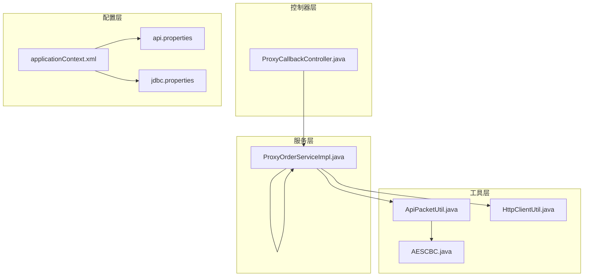
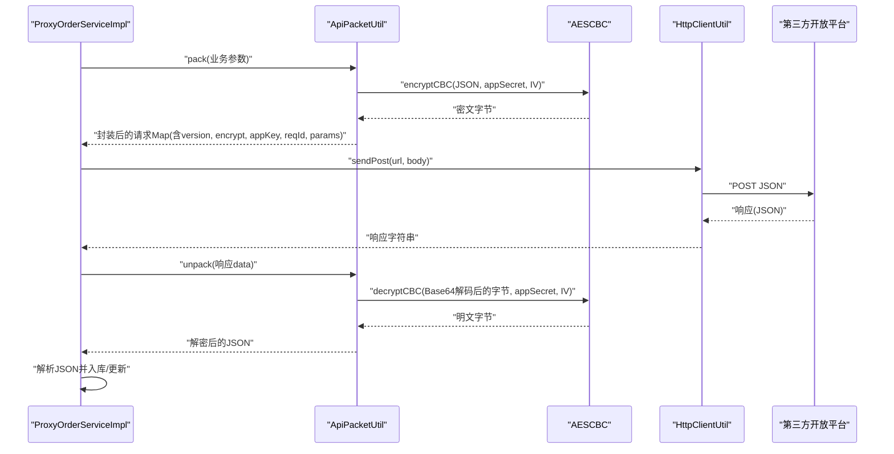
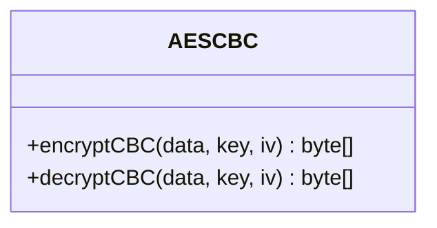
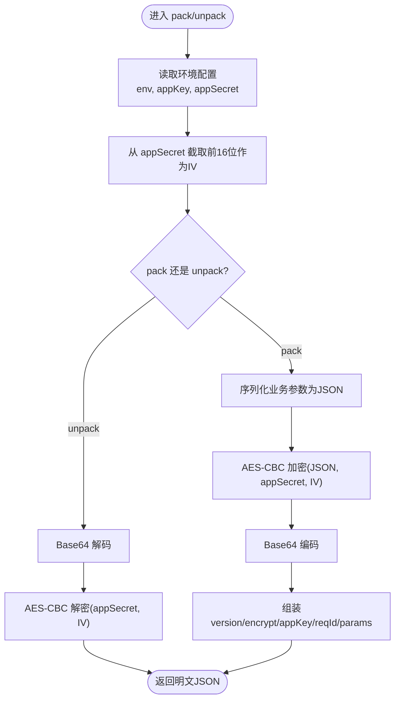
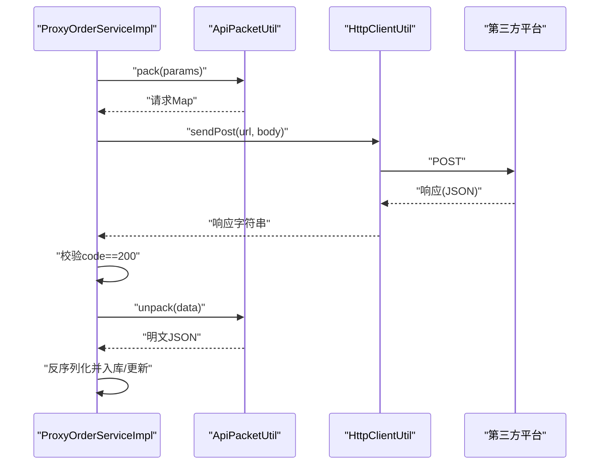
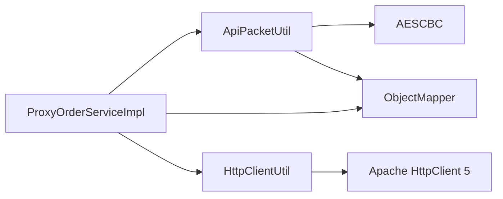

# 安全与加密机制

<cite>
**本文引用的文件**
- [AESCBC.java](file://src/main/java/cn/linkfast/utils/AESCBC.java)
- [ApiPacketUtil.java](file://src/main/java/cn/linkfast/utils/ApiPacketUtil.java)
- [HttpClientUtil.java](file://src/main/java/cn/linkfast/utils/HttpClientUtil.java)
- [ProxyOrderServiceImpl.java](file://src/main/java/cn/linkfast/service/impl/ProxyOrderServiceImpl.java)
- [ProxyCallbackController.java](file://src/main/java/cn/linkfast/controller/ProxyCallbackController.java)
- [api.properties](file://src/main/resources/api.properties)
- [applicationContext.xml](file://src/main/resources/applicationContext.xml)
- [jdbc.properties](file://src/main/resources/jdbc.properties)
- [AESCBCTest.java](file://src/test/java/cn/linkfast/utils/AESCBCTest.java)
</cite>

## 目录
1. [简介](#简介)
2. [项目结构](#项目结构)
3. [核心组件](#核心组件)
4. [架构总览](#架构总览)
5. [详细组件分析](#详细组件分析)
6. [依赖分析](#依赖分析)
7. [性能考虑](#性能考虑)
8. [故障排查指南](#故障排查指南)
9. [结论](#结论)
10. [附录](#附录)

## 简介
本文件面向 Link-Fast 项目，系统化梳理其安全与加密机制，重点覆盖以下方面：
- 加密解密流程：AES-CBC 算法实现、密钥与 IV 的来源与处理
- API 数据包安全传输：参数加密、响应解密、请求标识与防重放思路
- 配置文件中的敏感信息保护：密钥存储、环境隔离与访问控制现状
- 算法选择与安全性评估：为什么选 AES-CBC、潜在风险与性能影响
- 安全最佳实践：密钥轮换、访问日志与安全审计
- 常见威胁与应急响应：如何应对中间人、篡改、重放等威胁

## 项目结构
围绕“安全与加密”的关键模块分布如下：
- 工具层
  - AESCBC：对称加解密实现
  - ApiPacketUtil：业务参数打包、加密、Base64 编码、响应解密
  - HttpClientUtil：HTTP POST 请求封装
- 服务层
  - ProxyOrderServiceImpl：对外发起请求、接收响应并解密
- 控制器层
  - ProxyCallbackController：第三方回调入口
- 配置层
  - api.properties：环境与第三方接口参数
  - applicationContext.xml：属性占位符加载顺序
  - jdbc.properties：数据库凭据（非加密通道）

**图表来源**
- [AESCBC.java:1-36](file://src/main/java/cn/linkfast/utils/AESCBC.java#L1-L36)
- [ApiPacketUtil.java:1-103](file://src/main/java/cn/linkfast/utils/ApiPacketUtil.java#L1-L103)
- [HttpClientUtil.java:1-45](file://src/main/java/cn/linkfast/utils/HttpClientUtil.java#L1-L45)
- [ProxyOrderServiceImpl.java:1-200](file://src/main/java/cn/linkfast/service/impl/ProxyOrderServiceImpl.java#L1-L200)
- [ProxyCallbackController.java:1-92](file://src/main/java/cn/linkfast/controller/ProxyCallbackController.java#L1-L92)
- [api.properties:1-31](file://src/main/resources/api.properties#L1-L31)
- [applicationContext.xml:1-67](file://src/main/resources/applicationContext.xml#L1-L67)
- [jdbc.properties:1-39](file://src/main/resources/jdbc.properties#L1-L39)

**章节来源**
- [AESCBC.java:1-36](file://src/main/java/cn/linkfast/utils/AESCBC.java#L1-L36)
- [ApiPacketUtil.java:1-103](file://src/main/java/cn/linkfast/utils/ApiPacketUtil.java#L1-L103)
- [HttpClientUtil.java:1-45](file://src/main/java/cn/linkfast/utils/HttpClientUtil.java#L1-L45)
- [ProxyOrderServiceImpl.java:1-200](file://src/main/java/cn/linkfast/service/impl/ProxyOrderServiceImpl.java#L1-L200)
- [ProxyCallbackController.java:1-92](file://src/main/java/cn/linkfast/controller/ProxyCallbackController.java#L1-L92)
- [api.properties:1-31](file://src/main/resources/api.properties#L1-L31)
- [applicationContext.xml:1-67](file://src/main/resources/applicationContext.xml#L1-L67)
- [jdbc.properties:1-39](file://src/main/resources/jdbc.properties#L1-L39)

## 核心组件
- AESCBC：提供 AES/CBC/PKCS5Padding 的加解密能力，输入输出均为字节数组，供上层工具类调用
- ApiPacketUtil：负责业务参数序列化、AES-CBC 加密、Base64 编码、请求组装；同时负责响应 Base64 解码与 AES-CBC 解密
- HttpClientUtil：封装 HTTP POST 请求，统一处理状态码与响应体
- ProxyOrderServiceImpl：在对外请求前通过 ApiPacketUtil 打包参数，在收到响应后进行解密与结构化解析
- 配置加载：applicationContext.xml 中通过 property-placeholder 引入 api.properties 与 jdbc.properties，实现环境隔离与外部化配置

**章节来源**
- [AESCBC.java:19-30](file://src/main/java/cn/linkfast/utils/AESCBC.java#L19-L30)
- [ApiPacketUtil.java:56-102](file://src/main/java/cn/linkfast/utils/ApiPacketUtil.java#L56-L102)
- [HttpClientUtil.java:27-43](file://src/main/java/cn/linkfast/utils/HttpClientUtil.java#L27-L43)
- [ProxyOrderServiceImpl.java:96-194](file://src/main/java/cn/linkfast/service/impl/ProxyOrderServiceImpl.java#L96-L194)
- [applicationContext.xml:14-15](file://src/main/resources/applicationContext.xml#L14-L15)

## 架构总览
下图展示了“请求打包—发送—响应解密—业务处理”的整体流程。

**图表来源**
- [ProxyOrderServiceImpl.java:96-194](file://src/main/java/cn/linkfast/service/impl/ProxyOrderServiceImpl.java#L96-L194)
- [ApiPacketUtil.java:56-102](file://src/main/java/cn/linkfast/utils/ApiPacketUtil.java#L56-L102)
- [AESCBC.java:20-30](file://src/main/java/cn/linkfast/utils/AESCBC.java#L20-L30)
- [HttpClientUtil.java:27-43](file://src/main/java/cn/linkfast/utils/HttpClientUtil.java#L27-L43)

## 详细组件分析

### AESCBC 组件
- 算法与填充：AES/CBC/PKCS5Padding
- 密钥与 IV：由调用方提供，长度需满足 AES-128 要求（16 字节）
- 异常处理：对多种加解密异常进行抛出，便于上层捕获与记录

**图表来源**
- [AESCBC.java:19-30](file://src/main/java/cn/linkfast/utils/AESCBC.java#L19-L30)

**章节来源**
- [AESCBC.java:19-30](file://src/main/java/cn/linkfast/utils/AESCBC.java#L19-L30)
- [AESCBCTest.java:15-77](file://src/test/java/cn/linkfast/utils/AESCBCTest.java#L15-L77)

### ApiPacketUtil 组件
- 环境选择：根据 api.properties 中的 env 决定 appKey 与 appSecret
- IV 来源：从 appSecret 截取前 16 位作为 AES-CBC 的 IV
- 请求打包：将业务参数序列化为 JSON，AES-CBC 加密，再 Base64 编码，组装 version、encrypt、appKey、reqId、params
- 响应解包：对响应 data 进行 Base64 解码与 AES-CBC 解密

**图表来源**
- [ApiPacketUtil.java:39-102](file://src/main/java/cn/linkfast/utils/ApiPacketUtil.java#L39-L102)
- [api.properties:1-31](file://src/main/resources/api.properties#L1-L31)

**章节来源**
- [ApiPacketUtil.java:22-102](file://src/main/java/cn/linkfast/utils/ApiPacketUtil.java#L22-L102)
- [api.properties:1-31](file://src/main/resources/api.properties#L1-L31)

### HttpClientUtil 组件
- 统一封装 HTTP POST，使用 Jackson 序列化请求体
- 对非 2xx 状态码返回包含状态码的 JSON，便于上层按业务 code 解析

**章节来源**
- [HttpClientUtil.java:27-43](file://src/main/java/cn/linkfast/utils/HttpClientUtil.java#L27-L43)

### ProxyOrderServiceImpl 组件
- 请求阶段：调用 ApiPacketUtil.pack 组装请求，使用 HttpClientUtil.sendPost 发送
- 响应阶段：解析 JSON，当 code==200 时对 data 进行 ApiPacketUtil.unpack 解密，再反序列化为业务对象
- 错误处理：对解密失败、数据解析失败等场景抛出特定业务异常，避免回滚

**图表来源**
- [ProxyOrderServiceImpl.java:96-194](file://src/main/java/cn/linkfast/service/impl/ProxyOrderServiceImpl.java#L96-L194)
- [ApiPacketUtil.java:95-102](file://src/main/java/cn/linkfast/utils/ApiPacketUtil.java#L95-L102)
- [HttpClientUtil.java:27-43](file://src/main/java/cn/linkfast/utils/HttpClientUtil.java#L27-L43)

**章节来源**
- [ProxyOrderServiceImpl.java:96-194](file://src/main/java/cn/linkfast/service/impl/ProxyOrderServiceImpl.java#L96-L194)

### 配置与敏感信息保护
- 环境隔离：通过 api.properties 的 api.ipv.env 切换 sandbox/prod，分别加载不同的 appKey/appSecret
- 属性加载顺序：applicationContext.xml 中通过 property-placeholder 引入 api.properties 与 jdbc.properties，实现外部化配置
- 敏感信息现状：
  - api.properties 中包含 appKey/appSecret，属于敏感配置，建议通过环境变量或密钥管理服务注入
  - jdbc.properties 中包含数据库用户名与密码，建议迁移到只读权限与最小暴露面的外部化配置

**章节来源**
- [api.properties:1-31](file://src/main/resources/api.properties#L1-L31)
- [applicationContext.xml:14-15](file://src/main/resources/applicationContext.xml#L14-L15)
- [jdbc.properties:33-34](file://src/main/resources/jdbc.properties#L33-L34)

## 依赖分析
- 组件耦合
  - ProxyOrderServiceImpl 依赖 ApiPacketUtil 与 HttpClientUtil，形成“请求打包—网络发送—响应解密”的闭环
  - ApiPacketUtil 依赖 AESCBC 与 Jackson ObjectMapper，承担序列化与加解密职责
- 外部依赖
  - Spring 容器负责属性注入与组件生命周期管理
  - Apache HttpClient 5 负责 HTTP 通信
- 潜在风险
  - IV 来源于 appSecret 的固定前缀，若 appSecret 泄露或被预测，将影响机密性
  - 当前未实现签名与防重放机制，存在篡改与重放风险

**图表来源**
- [ProxyOrderServiceImpl.java:1-37](file://src/main/java/cn/linkfast/service/impl/ProxyOrderServiceImpl.java#L1-L37)
- [ApiPacketUtil.java:1-17](file://src/main/java/cn/linkfast/utils/ApiPacketUtil.java#L1-L17)
- [AESCBC.java:1-12](file://src/main/java/cn/linkfast/utils/AESCBC.java#L1-L12)
- [HttpClientUtil.java:1-14](file://src/main/java/cn/linkfast/utils/HttpClientUtil.java#L1-L14)

**章节来源**
- [ProxyOrderServiceImpl.java:1-37](file://src/main/java/cn/linkfast/service/impl/ProxyOrderServiceImpl.java#L1-L37)
- [ApiPacketUtil.java:1-17](file://src/main/java/cn/linkfast/utils/ApiPacketUtil.java#L1-L17)
- [AESCBC.java:1-12](file://src/main/java/cn/linkfast/utils/AESCBC.java#L1-L12)
- [HttpClientUtil.java:1-14](file://src/main/java/cn/linkfast/utils/HttpClientUtil.java#L1-L14)

## 性能考虑
- 加解密开销：AES-CBC 在 CPU 上开销较小，适合高并发场景；Base64 编码会增加约 33% 的体积
- 网络开销：POST JSON 的序列化与网络往返是主要瓶颈
- 建议优化
  - 合理设置连接池与超时参数（已在 HttpClientUtil 中体现）
  - 对频繁调用的接口可考虑缓存非敏感数据
  - 避免在热路径中重复序列化/反序列化

[本节为通用性能讨论，不直接分析具体文件]

## 故障排查指南
- 解密失败
  - 现象：收到 code==200 但解密抛异常
  - 排查：确认 appSecret 是否匹配、IV 是否来自 appSecret 前 16 位、Base64 是否完整
  - 参考位置：[ProxyOrderServiceImpl.java:413-420](file://src/main/java/cn/linkfast/service/impl/ProxyOrderServiceImpl.java#L413-L420)
- 响应为空或非 2xx
  - 现象：processResponse 抛出“第三方API响应为空”或返回错误
  - 排查：检查网络连通性、URL 正确性、第三方状态码映射
  - 参考位置：[ProxyOrderServiceImpl.java:173-194](file://src/main/java/cn/linkfast/service/impl/ProxyOrderServiceImpl.java#L173-L194)
- 参数长度异常
  - 现象：InvalidKeyException/InvalidAlgorithmParameterException
  - 排查：确认 key 长度为 16 字节，IV 长度为 16 字节
  - 参考位置：[AESCBCTest.java:58-77](file://src/test/java/cn/linkfast/utils/AESCBCTest.java#L58-L77)

**章节来源**
- [ProxyOrderServiceImpl.java:413-420](file://src/main/java/cn/linkfast/service/impl/ProxyOrderServiceImpl.java#L413-L420)
- [ProxyOrderServiceImpl.java:173-194](file://src/main/java/cn/linkfast/service/impl/ProxyOrderServiceImpl.java#L173-L194)
- [AESCBCTest.java:58-77](file://src/test/java/cn/linkfast/utils/AESCBCTest.java#L58-L77)

## 结论
- Link-Fast 已实现基于 AES-CBC 的参数加密与响应解密，配合 Base64 编码与请求标识，满足基本的机密性需求
- 当前缺少签名与防重放机制，建议补充 HMAC 签名与 reqId 时间戳/随机数组合的防重放策略
- 配置文件中的敏感信息应迁移至密钥管理服务或环境变量，避免硬编码
- 建议引入统一的日志审计与告警机制，强化安全运营

[本节为总结性内容，不直接分析具体文件]

## 附录

### 算法选择与安全性评估
- 选择 AES-CBC 的原因
  - 实现简单、兼容性强、广泛使用
  - 适合小到中等体量的业务参数加密
- 安全性评估
  - 优点：对称加密效率高、抗穷举能力强
  - 风险：IV 来自 appSecret 前缀，若 appSecret 泄露或被猜测，将破坏机密性；缺少完整性校验与防重放
- 性能影响
  - 加解密与 Base64 编解码开销较低，网络往返为主要瓶颈

[本节为概念性说明，不直接分析具体文件]

### 安全最佳实践
- 密钥轮换
  - 定期更换 appSecret，确保旧密钥在到期后立即失效
  - 采用 KMS 或密钥管理服务集中管理密钥
- 访问控制
  - 限制 api.properties 与 jdbc.properties 的文件权限
  - 通过环境变量注入敏感配置，避免提交到版本库
- 日志与审计
  - 记录请求标识 reqId、时间戳、IP、接口路径与关键字段摘要
  - 对异常与失败事件进行告警
- 防重放与签名
  - 引入 HMAC-SHA256 签名，参数参与签名并附带时间戳与随机数
  - 服务端校验时间窗口与随机数唯一性

[本节为通用最佳实践，不直接分析具体文件]

### 常见威胁与应急响应
- 中间人攻击
  - 建议启用 TLS 1.2+ 并校验证书链
- 参数篡改
  - 引入签名机制，服务端校验签名与参数一致性
- 重放攻击
  - 使用 reqId+时间戳+随机数，服务端维护短期去重表
- 应急响应
  - 发现异常立即冻结受影响的 appKey/appSecret，启动密钥轮换
  - 审计日志回溯可疑请求，必要时回滚或补偿

[本节为通用安全建议，不直接分析具体文件]