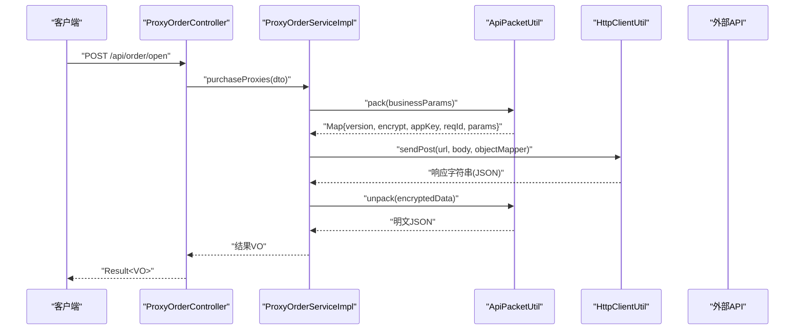
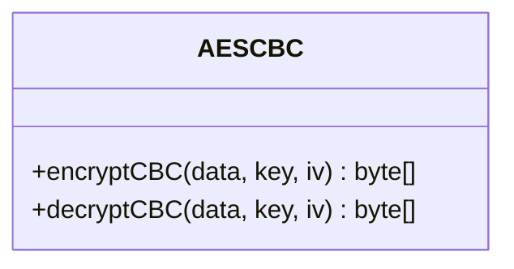
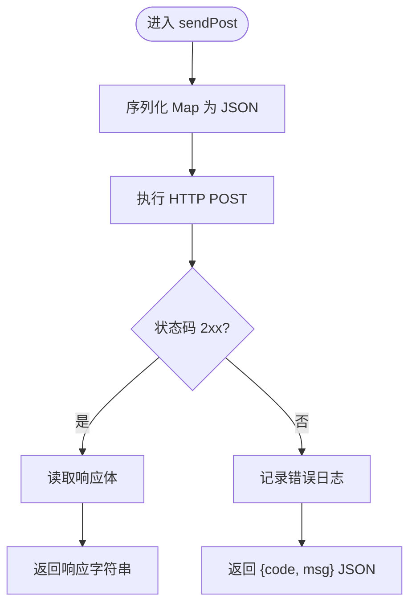
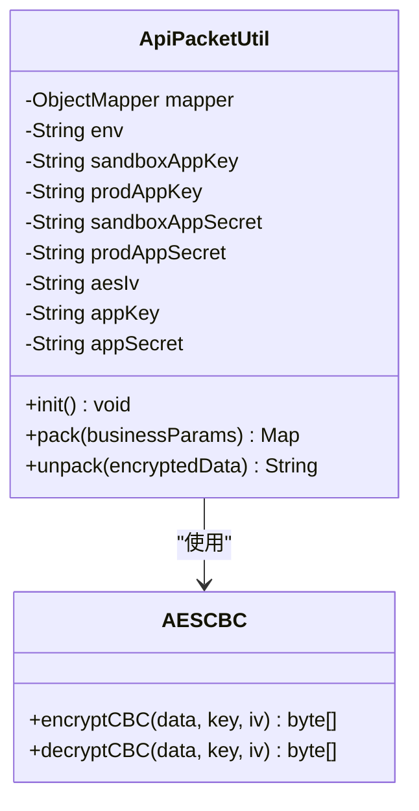
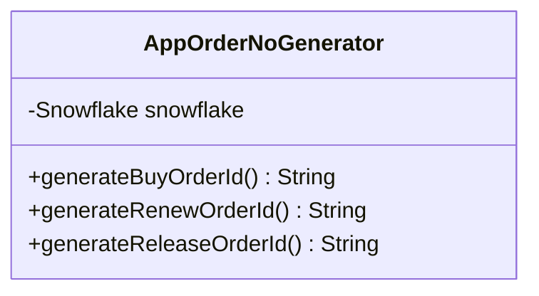
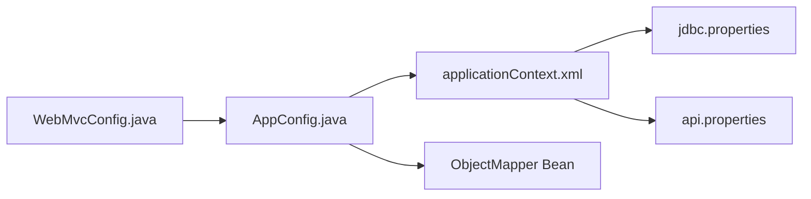
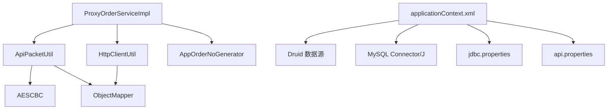

# 工具类与配置

<cite>
**本文引用的文件**
- [AESCBC.java](file://src/main/java/cn/linkfast/utils/AESCBC.java)
- [HttpClientUtil.java](file://src/main/java/cn/linkfast/utils/HttpClientUtil.java)
- [ApiPacketUtil.java](file://src/main/java/cn/linkfast/utils/ApiPacketUtil.java)
- [AppOrderNoGenerator.java](file://src/main/java/cn/linkfast/utils/AppOrderNoGenerator.java)
- [api.properties](file://src/main/resources/api.properties)
- [jdbc.properties](file://src/main/resources/jdbc.properties)
- [logback.xml](file://src/main/resources/logback.xml)
- [applicationContext.xml](file://src/main/resources/applicationContext.xml)
- [AppConfig.java](file://src/main/java/cn/linkfast/config/AppConfig.java)
- [WebMvcConfig.java](file://src/main/java/cn/linkfast/config/WebMvcConfig.java)
- [ProxyOrderServiceImpl.java](file://src/main/java/cn/linkfast/service/impl/ProxyOrderServiceImpl.java)
- [ProxyOrderController.java](file://src/main/java/cn/linkfast/controller/ProxyOrderController.java)
- [AESCBCTest.java](file://src/test/java/cn/linkfast/utils/AESCBCTest.java)
- [pom.xml](file://pom.xml)
</cite>

## 目录
1. [简介](#简介)
2. [项目结构](#项目结构)
3. [核心组件](#核心组件)
4. [架构总览](#架构总览)
5. [详细组件分析](#详细组件分析)
6. [依赖分析](#依赖分析)
7. [性能考量](#性能考量)
8. [故障排查指南](#故障排查指南)
9. [结论](#结论)
10. [附录](#附录)

## 简介
本文件聚焦 Link-Fast 项目的“工具类与配置”主题，系统化梳理以下内容：
- 核心工具类：API 加密工具（AESCBC）、HTTP 客户端工具（HttpClientUtil）、API 数据包处理工具（ApiPacketUtil）、订单号生成器（AppOrderNoGenerator）
- 配置体系：数据库连接配置、API 接口配置、日志配置、Spring 应用配置
- 使用示例与最佳实践：加密解密机制、网络请求处理、数据序列化方案
- 安全与运维：配置安全、环境变量、配置热更新可行性与建议

## 项目结构
项目采用基于包的分层组织方式，核心工具类位于 utils 包，配置集中在 resources 下的属性与 XML 文件中，Spring 配置通过 Java Config 与 XML 混合装配。

```mermaid
graph TB
subgraph "配置层"
A["applicationContext.xml<br/>数据源/事务/Druid"]
B["api.properties<br/>API 环境与接口路径"]
C["jdbc.properties<br/>数据库连接参数"]
D["logback.xml<br/>日志输出策略"]
E["AppConfig.java<br/>Spring 核心配置"]
F["WebMvcConfig.java<br/>MVC 配置"]
end
subgraph "工具层"
G["AESCBC.java<br/>AES-CBC 加解密"]
H["HttpClientUtil.java<br/>HTTP 客户端封装"]
I["ApiPacketUtil.java<br/>API 数据包打包/解包"]
J["AppOrderNoGenerator.java<br/>订单号生成"]
end
subgraph "业务层"
K["ProxyOrderServiceImpl.java<br/>订单服务实现"]
L["ProxyOrderController.java<br/>订单接口控制器"]
end
E --> A
F --> E
A --> C
A --> B
K --> I
K --> H
K --> J
L --> K
```

图表来源
- [applicationContext.xml:1-67](file://src/main/resources/applicationContext.xml#L1-L67)
- [api.properties:1-31](file://src/main/resources/api.properties#L1-L31)
- [jdbc.properties:1-39](file://src/main/resources/jdbc.properties#L1-L39)
- [logback.xml:1-49](file://src/main/resources/logback.xml#L1-L49)
- [AppConfig.java:1-36](file://src/main/java/cn/linkfast/config/AppConfig.java#L1-L36)
- [WebMvcConfig.java:1-62](file://src/main/java/cn/linkfast/config/WebMvcConfig.java#L1-L62)
- [AESCBC.java:1-36](file://src/main/java/cn/linkfast/utils/AESCBC.java#L1-L36)
- [HttpClientUtil.java:1-45](file://src/main/java/cn/linkfast/utils/HttpClientUtil.java#L1-L45)
- [ApiPacketUtil.java:1-103](file://src/main/java/cn/linkfast/utils/ApiPacketUtil.java#L1-L103)
- [AppOrderNoGenerator.java:1-45](file://src/main/java/cn/linkfast/utils/AppOrderNoGenerator.java#L1-L45)
- [ProxyOrderServiceImpl.java:1-200](file://src/main/java/cn/linkfast/service/impl/ProxyOrderServiceImpl.java#L1-L200)
- [ProxyOrderController.java:1-86](file://src/main/java/cn/linkfast/controller/ProxyOrderController.java#L1-L86)

章节来源
- [applicationContext.xml:1-67](file://src/main/resources/applicationContext.xml#L1-L67)
- [api.properties:1-31](file://src/main/resources/api.properties#L1-L31)
- [jdbc.properties:1-39](file://src/main/resources/jdbc.properties#L1-L39)
- [logback.xml:1-49](file://src/main/resources/logback.xml#L1-L49)
- [AppConfig.java:1-36](file://src/main/java/cn/linkfast/config/AppConfig.java#L1-L36)
- [WebMvcConfig.java:1-62](file://src/main/java/cn/linkfast/config/WebMvcConfig.java#L1-L62)
- [ProxyOrderServiceImpl.java:1-200](file://src/main/java/cn/linkfast/service/impl/ProxyOrderServiceImpl.java#L1-L200)
- [ProxyOrderController.java:1-86](file://src/main/java/cn/linkfast/controller/ProxyOrderController.java#L1-L86)

## 核心组件
本节概述四个工具类与 Spring 配置的关键职责与交互关系。

- AESCBC：提供 AES-CBC 模式的加解密能力，供 ApiPacketUtil 使用
- HttpClientUtil：基于 Apache HttpClient 5 的 HTTP POST 封装，负责发送 JSON 并解析响应
- ApiPacketUtil：负责业务参数的 JSON 序列化、AES-CBC 加密、Base64 编码、请求 Map 组装与响应解包
- AppOrderNoGenerator：基于 Snowflake 生成带业务前缀的订单号
- Spring 配置：通过 AppConfig 注入 ObjectMapper，通过 WebMvcConfig 配置消息转换器与 CORS；通过 applicationContext.xml 管理数据源、事务与 Druid 参数

章节来源
- [AESCBC.java:1-36](file://src/main/java/cn/linkfast/utils/AESCBC.java#L1-L36)
- [HttpClientUtil.java:1-45](file://src/main/java/cn/linkfast/utils/HttpClientUtil.java#L1-L45)
- [ApiPacketUtil.java:1-103](file://src/main/java/cn/linkfast/utils/ApiPacketUtil.java#L1-L103)
- [AppOrderNoGenerator.java:1-45](file://src/main/java/cn/linkfast/utils/AppOrderNoGenerator.java#L1-L45)
- [AppConfig.java:1-36](file://src/main/java/cn/linkfast/config/AppConfig.java#L1-L36)
- [WebMvcConfig.java:1-62](file://src/main/java/cn/linkfast/config/WebMvcConfig.java#L1-L62)
- [applicationContext.xml:1-67](file://src/main/resources/applicationContext.xml#L1-L67)

## 架构总览
下图展示了“控制器 → 服务 → 工具类 → 第三方 API”的典型调用链路，以及配置如何贯穿其中。

图表来源
- [ProxyOrderController.java:1-86](file://src/main/java/cn/linkfast/controller/ProxyOrderController.java#L1-L86)
- [ProxyOrderServiceImpl.java:1-200](file://src/main/java/cn/linkfast/service/impl/ProxyOrderServiceImpl.java#L1-L200)
- [ApiPacketUtil.java:1-103](file://src/main/java/cn/linkfast/utils/ApiPacketUtil.java#L1-L103)
- [HttpClientUtil.java:1-45](file://src/main/java/cn/linkfast/utils/HttpClientUtil.java#L1-L45)

## 详细组件分析

### AESCBC 加密工具
- 功能要点
  - 支持 AES/CBC/PKCS5Padding 模式
  - 提供 encryptCBC 与 decryptCBC 两个静态方法
  - 输入输出均为字节数组，便于与其他工具组合使用
- 使用场景
  - 与 ApiPacketUtil 配合完成业务参数的加密与解密
- 安全与复杂度
  - 时间复杂度近似 O(n)，空间复杂度 O(n)
  - 密钥与 IV 需满足 AES 长度规范（16/24/32 字节密钥，16 字节 IV）

图表来源
- [AESCBC.java:1-36](file://src/main/java/cn/linkfast/utils/AESCBC.java#L1-L36)

章节来源
- [AESCBC.java:1-36](file://src/main/java/cn/linkfast/utils/AESCBC.java#L1-L36)
- [ApiPacketUtil.java:1-103](file://src/main/java/cn/linkfast/utils/ApiPacketUtil.java#L1-L103)

### HTTP 客户端工具（HttpClientUtil）
- 功能要点
  - 基于 Apache HttpClient 5 的 POST JSON 封装
  - 使用 Jackson 将 Map 序列化为 JSON
  - 正常 2xx 返回响应体文本；非 2xx 返回包含状态码的 JSON，便于上层解析业务 code
- 性能与健壮性
  - 每次调用创建独立的 CloseableHttpClient，适合短连接场景
  - UTF-8 编码，避免乱码
- 错误处理
  - 非 2xx 状态记录错误日志并返回标准化 JSON

图表来源
- [HttpClientUtil.java:1-45](file://src/main/java/cn/linkfast/utils/HttpClientUtil.java#L1-L45)

章节来源
- [HttpClientUtil.java:1-45](file://src/main/java/cn/linkfast/utils/HttpClientUtil.java#L1-L45)

### API 数据包处理工具（ApiPacketUtil）
- 功能要点
  - 从 api.properties 注入环境、appKey、appSecret 与接口路径
  - 在初始化阶段根据环境选择 appKey/appSecret，并从 appSecret 截取 16 字节作为 AES IV
  - pack：将业务参数转 JSON，AES-CBC 加密，Base64 编码，组装公共字段（版本、加密方式、appKey、reqId、params）
  - unpack：对响应中的 data 字段进行 Base64 解码与 AES-CBC 解密
- 与 Spring 的集成
  - 作为 Spring 组件，通过 @Value 注入配置
  - 通过 @PostConstruct 在属性注入后计算 IV
- 与工具类协作
  - 依赖 AESCBC 进行加解密
  - 依赖 Jackson ObjectMapper 进行 JSON 序列化/反序列化

图表来源
- [ApiPacketUtil.java:1-103](file://src/main/java/cn/linkfast/utils/ApiPacketUtil.java#L1-L103)
- [AESCBC.java:1-36](file://src/main/java/cn/linkfast/utils/AESCBC.java#L1-L36)

章节来源
- [ApiPacketUtil.java:1-103](file://src/main/java/cn/linkfast/utils/ApiPacketUtil.java#L1-L103)
- [api.properties:1-31](file://src/main/resources/api.properties#L1-L31)

### 订单号生成器（AppOrderNoGenerator）
- 功能要点
  - 基于 Snowflake 生成全局唯一 ID
  - 为不同业务类型添加前缀：购买（P）、续费（R）、释放（F）
- 依赖与注入
  - 通过构造注入获取 Snowflake 实例
  - 作为 Spring 组件注册

图表来源
- [AppOrderNoGenerator.java:1-45](file://src/main/java/cn/linkfast/utils/AppOrderNoGenerator.java#L1-L45)

章节来源
- [AppOrderNoGenerator.java:1-45](file://src/main/java/cn/linkfast/utils/AppOrderNoGenerator.java#L1-L45)

### Spring 配置与应用上下文
- AppConfig
  - 扫描业务组件（排除 Controller）
  - 导入 applicationContext.xml
  - 定义 ObjectMapper Bean，统一日期格式与反序列化行为
- WebMvcConfig
  - 替代 XML 的 MVC 配置：消息转换器、CORS、默认 Servlet 处理
  - 注入 AppConfig 中的 ObjectMapper
- applicationContext.xml
  - property-placeholder 引入 jdbc.properties 与 api.properties
  - Druid 数据源配置：连接池大小、保活、空闲回收、泄露检测等
  - JdbcTemplate 与事务管理器装配

图表来源
- [AppConfig.java:1-36](file://src/main/java/cn/linkfast/config/AppConfig.java#L1-L36)
- [WebMvcConfig.java:1-62](file://src/main/java/cn/linkfast/config/WebMvcConfig.java#L1-L62)
- [applicationContext.xml:1-67](file://src/main/resources/applicationContext.xml#L1-L67)
- [jdbc.properties:1-39](file://src/main/resources/jdbc.properties#L1-L39)
- [api.properties:1-31](file://src/main/resources/api.properties#L1-L31)

章节来源
- [AppConfig.java:1-36](file://src/main/java/cn/linkfast/config/AppConfig.java#L1-L36)
- [WebMvcConfig.java:1-62](file://src/main/java/cn/linkfast/config/WebMvcConfig.java#L1-L62)
- [applicationContext.xml:1-67](file://src/main/resources/applicationContext.xml#L1-L67)

## 依赖分析
- 工具类之间
  - ApiPacketUtil 依赖 AESCBC 与 Jackson
  - HttpClientUtil 依赖 Jackson 与 Apache HttpClient 5
- 业务与工具
  - ProxyOrderServiceImpl 依赖 ApiPacketUtil、HttpClientUtil、AppOrderNoGenerator
- 配置与外部
  - applicationContext.xml 依赖 Druid、MySQL 驱动
  - api.properties 与 jdbc.properties 为外部依赖提供参数

图表来源
- [ProxyOrderServiceImpl.java:1-200](file://src/main/java/cn/linkfast/service/impl/ProxyOrderServiceImpl.java#L1-L200)
- [ApiPacketUtil.java:1-103](file://src/main/java/cn/linkfast/utils/ApiPacketUtil.java#L1-L103)
- [AESCBC.java:1-36](file://src/main/java/cn/linkfast/utils/AESCBC.java#L1-L36)
- [HttpClientUtil.java:1-45](file://src/main/java/cn/linkfast/utils/HttpClientUtil.java#L1-L45)
- [AppOrderNoGenerator.java:1-45](file://src/main/java/cn/linkfast/utils/AppOrderNoGenerator.java#L1-L45)
- [applicationContext.xml:1-67](file://src/main/resources/applicationContext.xml#L1-L67)
- [jdbc.properties:1-39](file://src/main/resources/jdbc.properties#L1-L39)
- [api.properties:1-31](file://src/main/resources/api.properties#L1-L31)

章节来源
- [ProxyOrderServiceImpl.java:1-200](file://src/main/java/cn/linkfast/service/impl/ProxyOrderServiceImpl.java#L1-L200)
- [applicationContext.xml:1-67](file://src/main/resources/applicationContext.xml#L1-L67)

## 性能考量
- 加密与序列化
  - AES-CBC 与 Base64 编解码为 CPU 密集型操作，建议在高频调用场景下评估批量处理与缓存策略
  - ObjectMapper 作为单例 Bean，避免重复创建带来的开销
- HTTP 客户端
  - HttpClientUtil 每次新建连接，适合短连接与低并发；高并发建议复用连接或引入连接池
- 数据库连接池
  - Druid 默认参数已覆盖基本保活与回收策略；可根据实际 QPS 调整 initialSize/minIdle/maxActive/maxWait 等
- 日志
  - 业务日志与服务器日志分离，避免 IO 抖动；控制台输出仅在开发环境使用

[本节为通用性能建议，不直接分析具体文件]

## 故障排查指南
- 加密/解密异常
  - 确认 appSecret 长度与 IV 截取逻辑一致（至少 16 字节）
  - 参考单元测试用例验证密钥长度与 IV 长度非法场景
- HTTP 请求失败
  - 检查状态码与返回的 JSON 结构，定位业务错误码
  - 确认目标 URL 与接口路径配置正确
- 响应解包失败
  - 确认响应中 data 字段存在且为 Base64 编码
  - 检查 appSecret 是否与第三方一致
- 数据库连接问题
  - 检查 jdbc.properties 中用户名/密码/URL 是否正确
  - 关注 Druid 的连接保活与回收策略是否合理
- 日志定位
  - 业务日志输出至 linkfast-business.log，服务器日志输出至 linkfast-server.log
  - 通过 LOG_PATH 系统属性调整日志目录

章节来源
- [AESCBCTest.java:1-78](file://src/test/java/cn/linkfast/utils/AESCBCTest.java#L1-L78)
- [ApiPacketUtil.java:1-103](file://src/main/java/cn/linkfast/utils/ApiPacketUtil.java#L1-L103)
- [HttpClientUtil.java:1-45](file://src/main/java/cn/linkfast/utils/HttpClientUtil.java#L1-L45)
- [applicationContext.xml:1-67](file://src/main/resources/applicationContext.xml#L1-L67)
- [logback.xml:1-49](file://src/main/resources/logback.xml#L1-L49)

## 结论
- 工具类设计清晰，职责单一，易于替换与扩展
- Spring 配置通过 XML 与 Java Config 协作，实现了数据源、事务与 MVC 的一体化管理
- 加密与网络处理流程完整，具备可测试性与可观测性
- 建议在高并发场景下优化 HTTP 客户端与加密策略，并完善配置热更新与密钥轮换机制

[本节为总结性内容，不直接分析具体文件]

## 附录

### 配置文件详解与调优参数
- 数据库连接配置（jdbc.properties）
  - 关键项：驱动、URL、用户名、密码、连接池参数（initialSize/minIdle/maxActive/maxWait）、保活与回收策略、泄露检测
  - 调优建议：根据峰值并发与慢查询情况调整 maxActive 与 maxWait；开启 keepAlive 与空闲回收降低连接抖动
- API 接口配置（api.properties）
  - 环境开关：api.ipv.env（prod/sandbox）
  - 基础地址：api.ipv.prod_url/api.ipv.sandbox_url
  - 凭据：appKey/appSecret（区分 prod 与 sandbox）
  - 接口路径：product_query/order_create/order_info/instance_query/city_list/area_list/app_info/instance_renew/instance_release
  - 调优建议：将敏感凭据置于环境变量或外部密管，避免硬编码
- 日志配置（logback.xml）
  - 输出：业务日志与服务器日志分离，控制台输出
  - 路径：通过 -DLOG_PATH 设置日志目录，默认 ./logs
  - 调优建议：生产环境限制日志级别，合理设置滚动周期与历史保留天数
- Spring 应用配置（AppConfig/WebMvcConfig）
  - ObjectMapper：统一日期格式、忽略未知属性
  - MVC：消息转换器、CORS、默认 Servlet 处理
  - 调优建议：在测试环境提升日志级别，开发环境开启控制台输出

章节来源
- [jdbc.properties:1-39](file://src/main/resources/jdbc.properties#L1-L39)
- [api.properties:1-31](file://src/main/resources/api.properties#L1-L31)
- [logback.xml:1-49](file://src/main/resources/logback.xml#L1-L49)
- [AppConfig.java:1-36](file://src/main/java/cn/linkfast/config/AppConfig.java#L1-L36)
- [WebMvcConfig.java:1-62](file://src/main/java/cn/linkfast/config/WebMvcConfig.java#L1-L62)

### 使用示例与最佳实践
- 加密解密机制
  - 使用 ApiPacketUtil.pack 生成请求 Map，内部完成 JSON 序列化、AES-CBC 加密与 Base64 编码
  - 使用 ApiPacketUtil.unpack 解密响应 data 字段
  - 注意：密钥与 IV 来源于 appSecret，长度与截取逻辑需严格一致
- 网络请求处理
  - 使用 HttpClientUtil.sendPost 发送 JSON 请求，接收字符串响应
  - 对非 2xx 状态返回标准化 JSON，便于上层解析业务 code
- 数据序列化方案
  - 使用 ObjectMapper 单例 Bean，避免重复创建
  - 在 WebMvcConfig 中统一配置消息转换器，确保日期格式一致
- 订单号生成
  - 使用 AppOrderNoGenerator 生成带业务前缀的全局唯一订单号
- 配置管理的安全考虑
  - 将敏感配置（如数据库密码、API 凭据）放入环境变量或外部密管
  - 生产环境禁用控制台输出，仅保留业务与服务器日志
- 环境变量与配置热更新
  - 当前配置通过 property-placeholder 注入，不支持运行时热更新
  - 建议引入 Spring Cloud Config 或外部配置中心，结合刷新端点实现热更新

章节来源
- [ApiPacketUtil.java:1-103](file://src/main/java/cn/linkfast/utils/ApiPacketUtil.java#L1-L103)
- [HttpClientUtil.java:1-45](file://src/main/java/cn/linkfast/utils/HttpClientUtil.java#L1-L45)
- [AppConfig.java:1-36](file://src/main/java/cn/linkfast/config/AppConfig.java#L1-L36)
- [WebMvcConfig.java:1-62](file://src/main/java/cn/linkfast/config/WebMvcConfig.java#L1-L62)
- [AppOrderNoGenerator.java:1-45](file://src/main/java/cn/linkfast/utils/AppOrderNoGenerator.java#L1-L45)
- [applicationContext.xml:1-67](file://src/main/resources/applicationContext.xml#L1-L67)