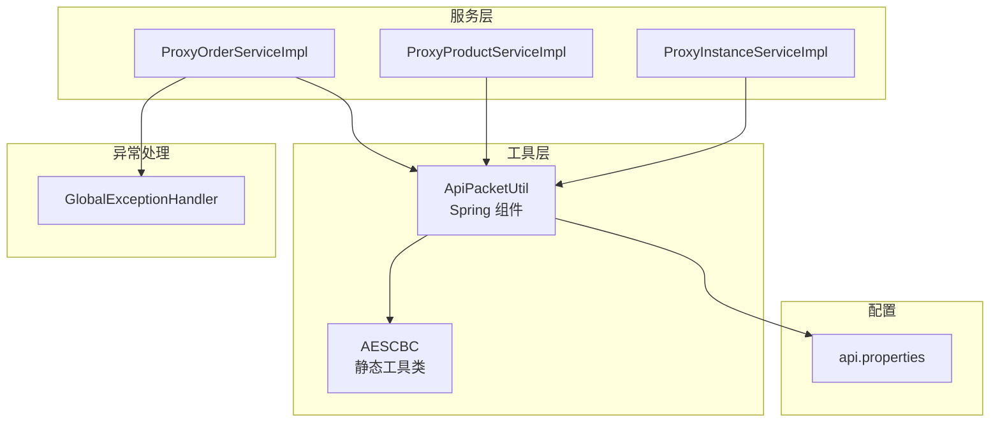
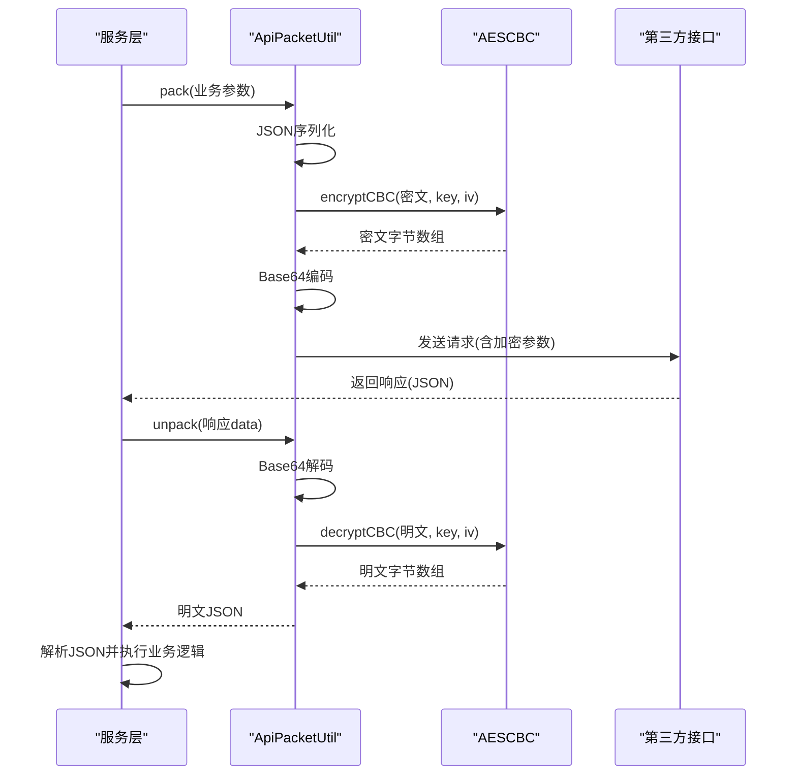
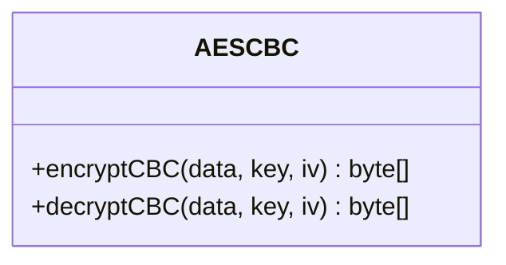
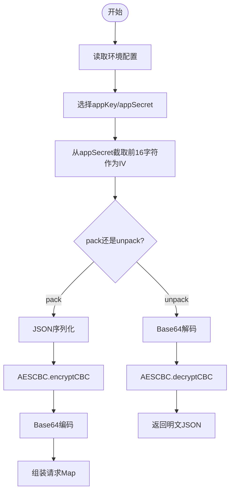
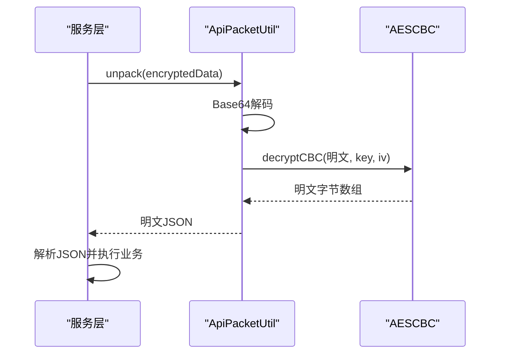
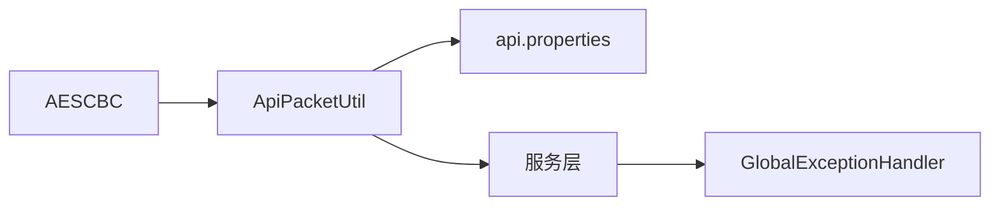

# AESCBC 加密工具类

<cite>
**本文档引用的文件**
- [AESCBC.java](file://src/main/java/cn/linkfast/utils/AESCBC.java)
- [ApiPacketUtil.java](file://src/main/java/cn/linkfast/utils/ApiPacketUtil.java)
- [AESCBCTest.java](file://src/test/java/cn/linkfast/utils/AESCBCTest.java)
- [ProxyOrderServiceImpl.java](file://src/main/java/cn/linkfast/service/impl/ProxyOrderServiceImpl.java)
- [ProxyProductServiceImpl.java](file://src/main/java/cn/linkfast/service/impl/ProxyProductServiceImpl.java)
- [ProxyInstanceServiceImpl.java](file://src/main/java/cn/linkfast/service/impl/ProxyInstanceServiceImpl.java)
- [api.properties](file://src/main/resources/api.properties)
- [GlobalExceptionHandler.java](file://src/main/java/cn/linkfast/exception/GlobalExceptionHandler.java)
</cite>

## 目录
1. [简介](#简介)
2. [项目结构](#项目结构)
3. [核心组件](#核心组件)
4. [架构总览](#架构总览)
5. [详细组件分析](#详细组件分析)
6. [依赖关系分析](#依赖关系分析)
7. [性能考量](#性能考量)
8. [故障排查指南](#故障排查指南)
9. [结论](#结论)
10. [附录](#附录)

## 简介
本文件面向 AESCBC 加密工具类，系统性阐述其在代理服务中的应用，包括：
- AES-CBC 加密与解密的实现原理与调用流程
- 密钥与初始化向量（IV）的生成与使用策略
- 异常处理机制与安全性最佳实践
- 在代理服务中的具体使用示例
- 性能优化建议与与其他加密方案的对比

## 项目结构
该项目采用标准的 Maven 结构，加密工具位于 utils 包中，配合服务层对第三方接口进行加密封装与解密处理。关键文件如下：
- AESCBC：纯静态工具类，提供 AES-CBC 加密与解密
- ApiPacketUtil：Spring 组件，负责业务参数的序列化、AES-CBC 加密、Base64 编码以及响应解密
- 服务层：ProxyOrderServiceImpl、ProxyProductServiceImpl、ProxyInstanceServiceImpl 等在处理第三方响应时调用 ApiPacketUtil.unpack 完成解密
- 配置：api.properties 提供环境与密钥配置
- 异常：全局异常处理器用于统一处理业务异常

图表来源
- [AESCBC.java:19-33](file://src/main/java/cn/linkfast/utils/AESCBC.java#L19-L33)
- [ApiPacketUtil.java:20-106](file://src/main/java/cn/linkfast/utils/ApiPacketUtil.java#L20-L106)
- [ProxyOrderServiceImpl.java:413-421](file://src/main/java/cn/linkfast/service/impl/ProxyOrderServiceImpl.java#L413-L421)
- [ProxyProductServiceImpl.java:155-172](file://src/main/java/cn/linkfast/service/impl/ProxyProductServiceImpl.java#L155-L172)
- [ProxyInstanceServiceImpl.java:207-232](file://src/main/java/cn/linkfast/service/impl/ProxyInstanceServiceImpl.java#L207-L232)
- [api.properties:1-31](file://src/main/resources/api.properties#L1-L31)
- [GlobalExceptionHandler.java:20-90](file://src/main/java/cn/linkfast/exception/GlobalExceptionHandler.java#L20-L90)

章节来源
- [AESCBC.java:19-33](file://src/main/java/cn/linkfast/utils/AESCBC.java#L19-L33)
- [ApiPacketUtil.java:20-106](file://src/main/java/cn/linkfast/utils/ApiPacketUtil.java#L20-L106)
- [ProxyOrderServiceImpl.java:413-421](file://src/main/java/cn/linkfast/service/impl/ProxyOrderServiceImpl.java#L413-L421)
- [ProxyProductServiceImpl.java:155-172](file://src/main/java/cn/linkfast/service/impl/ProxyProductServiceImpl.java#L155-L172)
- [ProxyInstanceServiceImpl.java:207-232](file://src/main/java/cn/linkfast/service/impl/ProxyInstanceServiceImpl.java#L207-L232)
- [api.properties:1-31](file://src/main/resources/api.properties#L1-L31)
- [GlobalExceptionHandler.java:20-90](file://src/main/java/cn/linkfast/exception/GlobalExceptionHandler.java#L20-L90)

## 核心组件
- AESCBC：提供 AES/CBC/PKCS5Padding 的静态加解密方法，入参为明文/密文、密钥与 IV，返回密文/明文字节数组。该类仅负责底层加解密，不做编码与业务封装。
- ApiPacketUtil：Spring 组件，负责业务参数的 JSON 序列化、AES-CBC 加密、Base64 编码、请求 Map 组装；同时负责响应数据的 Base64 解码与 AES-CBC 解密，输出明文 JSON 字符串。
- 服务层：在处理第三方接口响应时，先通过 ApiPacketUtil.unpack 解密 data 字段，再进行 JSON 解析与业务处理。

章节来源
- [AESCBC.java:19-33](file://src/main/java/cn/linkfast/utils/AESCBC.java#L19-L33)
- [ApiPacketUtil.java:58-105](file://src/main/java/cn/linkfast/utils/ApiPacketUtil.java#L58-L105)
- [ProxyOrderServiceImpl.java:413-421](file://src/main/java/cn/linkfast/service/impl/ProxyOrderServiceImpl.java#L413-L421)

## 架构总览
下图展示了代理服务中加密封装与解密的整体流程，从服务层发起请求，到第三方响应返回，再到解密与业务解析的全过程。

图表来源
- [ApiPacketUtil.java:58-105](file://src/main/java/cn/linkfast/utils/ApiPacketUtil.java#L58-L105)
- [AESCBC.java:20-30](file://src/main/java/cn/linkfast/utils/AESCBC.java#L20-L30)
- [ProxyOrderServiceImpl.java:413-421](file://src/main/java/cn/linkfast/service/impl/ProxyOrderServiceImpl.java#L413-L421)

## 详细组件分析

### AESCBC 类分析
- 功能定位：提供 AES-CBC 加密与解密的最小可用实现，使用 PKCS5Padding 填充。
- 关键点：
  - 加密模式：Cipher.ENCRYPT_MODE
  - 解密模式：Cipher.DECRYPT_MODE
  - 密钥规格：SecretKeySpec("AES")
  - IV 规格：IvParameterSpec
  - 异常传播：直接抛出 javax.crypto 包下的异常类型
- 复杂度：O(n)，n 为输入数据长度；加解密均为线性时间复杂度。
- 适用场景：与 ApiPacketUtil 协作完成业务参数的加密封装与响应解密。

图表来源
- [AESCBC.java:19-33](file://src/main/java/cn/linkfast/utils/AESCBC.java#L19-L33)

章节来源
- [AESCBC.java:19-33](file://src/main/java/cn/linkfast/utils/AESCBC.java#L19-L33)

### ApiPacketUtil 类分析
- 功能定位：Spring 组件，负责业务参数的加密封装与响应解密。
- 关键流程：
  - pack：JSON序列化 -> AESCBC.encryptCBC -> Base64编码 -> 组装请求Map
  - unpack：Base64解码 -> AESCBC.decryptCBC -> 返回明文JSON
- IV 生成策略：从 appSecret 中截取前 16 字节作为 AES-CBC 的 IV（16 字节对应 AES 块大小）。
- 配置来源：从 api.properties 读取环境、appKey、appSecret，并根据环境选择生产或沙箱密钥。
- 与服务层协作：服务层在处理第三方响应时调用 unpack 完成解密。

图表来源
- [ApiPacketUtil.java:41-53](file://src/main/java/cn/linkfast/utils/ApiPacketUtil.java#L41-L53)
- [ApiPacketUtil.java:58-105](file://src/main/java/cn/linkfast/utils/ApiPacketUtil.java#L58-L105)
- [AESCBC.java:20-30](file://src/main/java/cn/linkfast/utils/AESCBC.java#L20-L30)

章节来源
- [ApiPacketUtil.java:20-106](file://src/main/java/cn/linkfast/utils/ApiPacketUtil.java#L20-L106)
- [api.properties:1-31](file://src/main/resources/api.properties#L1-L31)

### 服务层集成与使用示例
- 订单开通与续费：服务层在收到第三方响应后，调用 ApiPacketUtil.unpack 解密 data 字段，再解析 JSON 并更新本地订单状态。
- 产品与实例查询：服务层在解析响应时同样依赖 ApiPacketUtil.unpack 完成解密，随后将明文 JSON 映射为领域对象。

图表来源
- [ProxyOrderServiceImpl.java:413-421](file://src/main/java/cn/linkfast/service/impl/ProxyOrderServiceImpl.java#L413-L421)
- [ProxyProductServiceImpl.java:155-172](file://src/main/java/cn/linkfast/service/impl/ProxyProductServiceImpl.java#L155-L172)
- [ProxyInstanceServiceImpl.java:207-232](file://src/main/java/cn/linkfast/service/impl/ProxyInstanceServiceImpl.java#L207-L232)
- [ApiPacketUtil.java:97-105](file://src/main/java/cn/linkfast/utils/ApiPacketUtil.java#L97-L105)

章节来源
- [ProxyOrderServiceImpl.java:413-421](file://src/main/java/cn/linkfast/service/impl/ProxyOrderServiceImpl.java#L413-L421)
- [ProxyProductServiceImpl.java:155-172](file://src/main/java/cn/linkfast/service/impl/ProxyProductServiceImpl.java#L155-L172)
- [ProxyInstanceServiceImpl.java:207-232](file://src/main/java/cn/linkfast/service/impl/ProxyInstanceServiceImpl.java#L207-L232)

## 依赖关系分析
- AESCBC 与 ApiPacketUtil：ApiPacketUtil 在 pack/unpack 中直接调用 AESCBC 的静态方法，形成紧密耦合。
- ApiPacketUtil 与 Spring 配置：通过 @Value 注入 api.properties 中的环境与密钥配置，依赖 Spring 容器生命周期。
- 服务层与 ApiPacketUtil：服务层在处理第三方响应时依赖 ApiPacketUtil 的解密能力，形成间接依赖。
- 异常处理：服务层在解密失败时抛出 NoRollbackBusinessException，由全局异常处理器统一处理。

图表来源
- [AESCBC.java:19-33](file://src/main/java/cn/linkfast/utils/AESCBC.java#L19-L33)
- [ApiPacketUtil.java:24-53](file://src/main/java/cn/linkfast/utils/ApiPacketUtil.java#L24-L53)
- [api.properties:1-31](file://src/main/resources/api.properties#L1-L31)
- [GlobalExceptionHandler.java:20-90](file://src/main/java/cn/linkfast/exception/GlobalExceptionHandler.java#L20-L90)

章节来源
- [AESCBC.java:19-33](file://src/main/java/cn/linkfast/utils/AESCBC.java#L19-L33)
- [ApiPacketUtil.java:20-106](file://src/main/java/cn/linkfast/utils/ApiPacketUtil.java#L20-L106)
- [api.properties:1-31](file://src/main/resources/api.properties#L1-L31)
- [GlobalExceptionHandler.java:20-90](file://src/main/java/cn/linkfast/exception/GlobalExceptionHandler.java#L20-L90)

## 性能考量
- 加密开销：AES-CBC 为流式加解密，时间复杂度 O(n)，n 为数据长度。对于小到中等规模的业务参数，性能影响可忽略。
- Base64 编解码：在 pack/unpack 中进行，CPU 开销与数据量线性相关。
- 线程安全：AESCBC 为静态工具类，Cipher 实例在方法内创建并销毁，避免共享状态，天然线程安全。
- 优化建议：
  - 合理复用对象：若频繁调用，可在 ApiPacketUtil 内部缓存 ObjectMapper 与 Cipher 实例（需注意线程安全与并发访问）。
  - 批量处理：对多个请求合并为批量请求，减少网络往返与加解密次数。
  - 压缩：对大体量 JSON 进行压缩后再加密，可降低带宽与 Base64 编码体积（需权衡 CPU 与内存）。
  - 异步：在网络 IO 密集场景，结合异步客户端提升吞吐。

[本节为通用性能讨论，无需特定文件来源]

## 故障排查指南
- 常见异常与处理策略：
  - InvalidKeyException：密钥长度不符合 AES 要求（16、24、32 字节）。检查 ApiPacketUtil 中 appSecret 的长度与来源。
  - InvalidAlgorithmParameterException：IV 长度不足 16 字节。确保从 appSecret 正确截取前 16 字符。
  - BadPaddingException/IllegalBlockSizeException：密文损坏或密钥/IV 不匹配。检查第三方接口返回的数据完整性与双方密钥一致性。
  - 解密失败：服务层在解密失败时抛出 NoRollbackBusinessException，避免对已落库的第三方数据进行回滚。
- 日志与监控：
  - ApiPacketUtil.unpack 会记录待解密数据与解密结果日志，便于问题定位。
  - 服务层在解密失败时记录详细上下文，便于审计与排查。
- 配置核对：
  - 确认 api.properties 中的环境配置与密钥是否正确。
  - 确认服务层调用的接口路径与参数是否与第三方约定一致。

章节来源
- [AESCBCTest.java:58-77](file://src/test/java/cn/linkfast/utils/AESCBCTest.java#L58-L77)
- [ProxyOrderServiceImpl.java:413-421](file://src/main/java/cn/linkfast/service/impl/ProxyOrderServiceImpl.java#L413-L421)
- [ApiPacketUtil.java:97-105](file://src/main/java/cn/linkfast/utils/ApiPacketUtil.java#L97-L105)
- [api.properties:1-31](file://src/main/resources/api.properties#L1-L31)

## 结论
AESCBC 与 ApiPacketUtil 构成了代理服务中加密封装与解密的核心链路。AESCBC 提供简洁可靠的底层加解密能力，ApiPacketUtil 则完成业务参数的序列化、加密、编码与响应解密，二者配合确保了与第三方接口通信的安全性与可靠性。在实际使用中，应严格遵循密钥与 IV 的长度要求，完善异常处理与日志记录，并结合服务层的幂等设计与不可回滚场景的处理策略，保障系统的稳定性与安全性。

[本节为总结性内容，无需特定文件来源]

## 附录

### 使用示例（基于现有代码）
- 服务层在处理第三方响应时，调用 ApiPacketUtil.unpack 完成解密与 JSON 解析，详见以下文件片段路径：
  - [ProxyOrderServiceImpl.java:413-421](file://src/main/java/cn/linkfast/service/impl/ProxyOrderServiceImpl.java#L413-L421)
  - [ProxyProductServiceImpl.java:155-172](file://src/main/java/cn/linkfast/service/impl/ProxyProductServiceImpl.java#L155-L172)
  - [ProxyInstanceServiceImpl.java:207-232](file://src/main/java/cn/linkfast/service/impl/ProxyInstanceServiceImpl.java#L207-L232)

### 安全性考虑与最佳实践
- 密钥管理：
  - 从 api.properties 中读取密钥，建议通过环境变量或密钥管理服务注入，避免硬编码。
  - 生产与沙箱密钥分离，确保测试环境不影响生产数据。
- IV 生成与使用：
  - 当前实现从 appSecret 截取前 16 字节作为 IV，适用于固定密钥场景；若密钥轮换频繁，建议为每次加密生成随机 IV 并随密文一起传输。
- 填充与数据完整性：
  - 使用 PKCS5Padding，确保解密时填充正确移除。
- 异常与日志：
  - 对解密失败进行明确的异常分类与日志记录，避免泄露敏感信息。
  - 全局异常处理器统一处理业务异常，保证对外响应的一致性。

章节来源
- [ApiPacketUtil.java:24-53](file://src/main/java/cn/linkfast/utils/ApiPacketUtil.java#L24-L53)
- [GlobalExceptionHandler.java:20-90](file://src/main/java/cn/linkfast/exception/GlobalExceptionHandler.java#L20-L90)

### 与其他加密工具的对比分析
- 与 ApiPacketUtil 的对比：
  - AESCBC：仅提供加解密能力，适合对已有加密流程进行模块化封装。
  - ApiPacketUtil：提供完整的业务参数封装与解密流程，包含 JSON 序列化、Base64 编解码与请求组装，适合与第三方接口对接。
- 与更高级加密方案的对比（概念性说明）：
  - AEAD（如 AES-GCM）：提供认证加密，可同时保证机密性与完整性，适合对数据完整性要求更高的场景。
  - 对称密钥轮换：在高安全场景中，建议定期更换密钥并采用随机 IV，以降低长期暴露风险。
  - 非对称加密：在密钥分发场景中，可结合 RSA 公钥加密对称密钥，再用对称密钥加密业务数据。

[本节为概念性对比，无需特定文件来源]