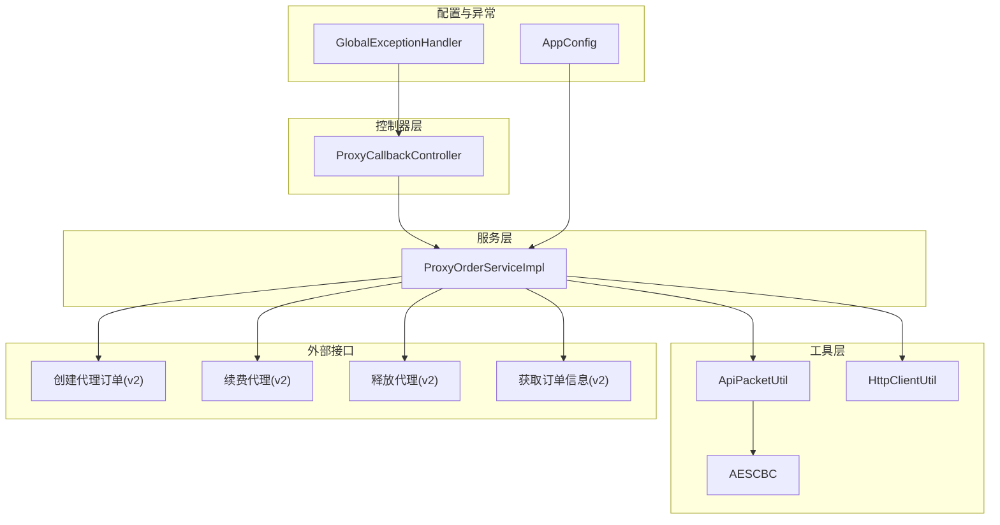
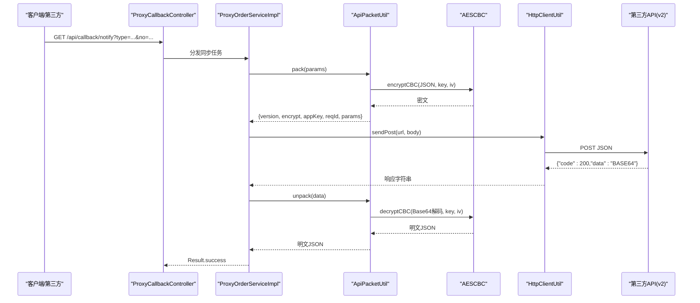
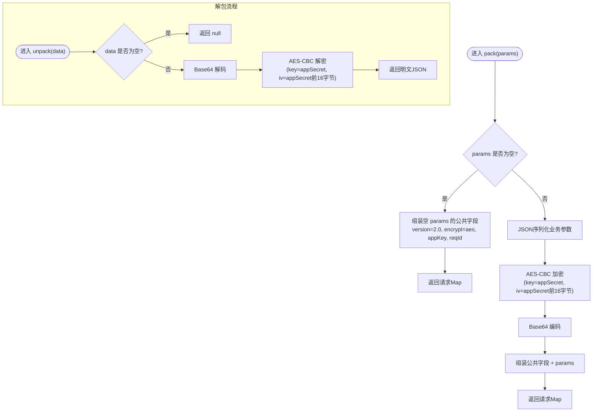
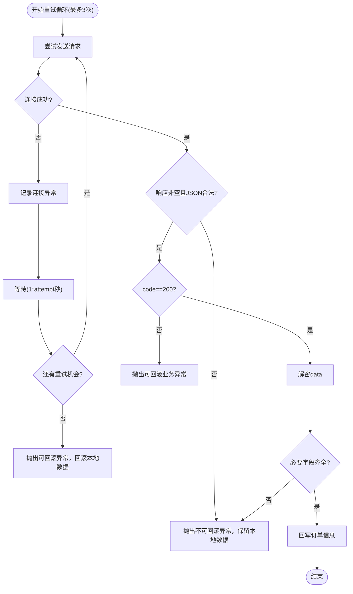
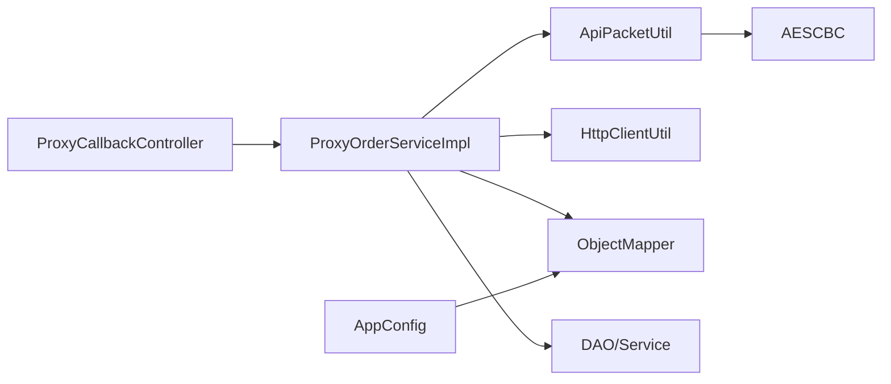

# API 数据包处理工具

<cite>
**本文引用的文件**   
- [ApiPacketUtil.java](file://src/main/java/cn/linkfast/utils/ApiPacketUtil.java)
- [AESCBC.java](file://src/main/java/cn/linkfast/utils/AESCBC.java)
- [HttpClientUtil.java](file://src/main/java/cn/linkfast/utils/HttpClientUtil.java)
- [ProxyOrderServiceImpl.java](file://src/main/java/cn/linkfast/service/impl/ProxyOrderServiceImpl.java)
- [ProxyCallbackController.java](file://src/main/java/cn/linkfast/controller/ProxyCallbackController.java)
- [Result.java](file://src/main/java/cn/linkfast/common/Result.java)
- [api.properties](file://src/main/resources/api.properties)
- [AppConfig.java](file://src/main/java/cn/linkfast/config/AppConfig.java)
- [GlobalExceptionHandler.java](file://src/main/java/cn/linkfast/exception/GlobalExceptionHandler.java)
- [创建代理订单接口-第三方.md](file://docs/api/third-party/创建代理订单接口-第三方.md)
- [代理续费接口-第三方.md](file://docs/api/third-party/代理续费接口-第三方.md)
- [释放代理接口-第三方.md](file://docs/api/third-party/释放代理接口-第三方.md)
- [获取订单信息接口-第三方.md](file://docs/api/third-party/获取订单信息接口-第三方.md)
- [test-api.http](file://test-api.http)
- [AESCBCTest.java](file://src/test/java/cn/linkfast/utils/AESCBCTest.java)
</cite>

## 目录
1. [简介](#简介)
2. [项目结构](#项目结构)
3. [核心组件](#核心组件)
4. [架构总览](#架构总览)
5. [详细组件分析](#详细组件分析)
6. [依赖分析](#依赖分析)
7. [性能考虑](#性能考虑)
8. [故障排查指南](#故障排查指南)
9. [结论](#结论)
10. [附录](#附录)

## 简介
本文件为“API 数据包处理工具”的综合技术文档，聚焦于以下目标：
- API 数据包的打包与解包机制：涵盖数据序列化、反序列化、加密与解密流程。
- 加密与解密在 API 通信中的应用：密钥管理、IV 计算、消息认证与完整性验证策略。
- 版本兼容性处理：协议版本升级与向后兼容策略。
- 第三方 API 集成示例：如何调用创建订单、续费、释放等接口。
- 错误处理与重试机制：网络异常、超时、数据校验失败的应对策略。
- 性能监控与调试技巧：日志记录、响应解析、异常处理与可观测性。

## 项目结构
该项目采用分层架构，主要模块包括：
- 控制器层：对外提供 REST 接口，接收第三方回调。
- 服务层：封装与第三方 API 的交互，负责数据打包、加密、请求发送、响应解析与解密。
- 工具层：提供通用的加密解密、HTTP 客户端封装、数据包工具。
- 配置层：Spring 配置、全局异常处理、Jackson ObjectMapper 配置。
- 文档与测试：第三方接口文档、单元测试与 HTTP 示例。

图表来源
- [ProxyCallbackController.java:1-95](file://src/main/java/cn/linkfast/controller/ProxyCallbackController.java#L1-95)
- [ProxyOrderServiceImpl.java:1-782](file://src/main/java/cn/linkfast/service/impl/ProxyOrderServiceImpl.java#L1-782)
- [ApiPacketUtil.java:1-106](file://src/main/java/cn/linkfast/utils/ApiPacketUtil.java#L1-106)
- [AESCBC.java:1-36](file://src/main/java/cn/linkfast/utils/AESCBC.java#L1-36)
- [HttpClientUtil.java:1-46](file://src/main/java/cn/linkfast/utils/HttpClientUtil.java#L1-46)
- [AppConfig.java:1-36](file://src/main/java/cn/linkfast/config/AppConfig.java#L1-36)
- [GlobalExceptionHandler.java:1-90](file://src/main/java/cn/linkfast/exception/GlobalExceptionHandler.java#L1-90)

章节来源
- [ProxyCallbackController.java:1-95](file://src/main/java/cn/linkfast/controller/ProxyCallbackController.java#L1-95)
- [ProxyOrderServiceImpl.java:1-782](file://src/main/java/cn/linkfast/service/impl/ProxyOrderServiceImpl.java#L1-782)
- [ApiPacketUtil.java:1-106](file://src/main/java/cn/linkfast/utils/ApiPacketUtil.java#L1-106)
- [AESCBC.java:1-36](file://src/main/java/cn/linkfast/utils/AESCBC.java#L1-36)
- [HttpClientUtil.java:1-46](file://src/main/java/cn/linkfast/utils/HttpClientUtil.java#L1-46)
- [AppConfig.java:1-36](file://src/main/java/cn/linkfast/config/AppConfig.java#L1-36)
- [GlobalExceptionHandler.java:1-90](file://src/main/java/cn/linkfast/exception/GlobalExceptionHandler.java#L1-90)

## 核心组件
- ApiPacketUtil：负责业务参数的 JSON 序列化、AES-CBC 加密、Base64 编码、请求 Map 组装；以及响应 data 字段的 Base64 解码与 AES-CBC 解密。
- AESCBC：提供 AES/CBC/PKCS5Padding 的加解密实现，使用 SecretKeySpec 与 IVParameterSpec。
- HttpClientUtil：基于 Apache HttpClient 5 的简单封装，支持 JSON POST 请求，非 2xx 状态码也返回包含状态码的 JSON，便于上层按业务 code 解析。
- ProxyOrderServiceImpl：核心服务，负责根据环境选择基础 URL、调用 ApiPacketUtil 打包请求、通过 HttpClientUtil 发送请求、解析响应并解密、回写本地订单信息；同时实现购买、续费、释放代理的完整流程与重试策略。
- ProxyCallbackController：接收第三方回调通知，按 type 分发到产品、订单、实例的同步逻辑。
- Result：统一响应结构，包含 code、message、data。
- api.properties：配置环境、第三方 API 基础地址、各接口路径、appKey/appSecret。
- AppConfig：提供全局 ObjectMapper Bean，用于 Jackson 序列化与反序列化。
- GlobalExceptionHandler：全局异常处理，将业务异常、参数异常、系统异常统一包装为 Result。

章节来源
- [ApiPacketUtil.java:1-106](file://src/main/java/cn/linkfast/utils/ApiPacketUtil.java#L1-106)
- [AESCBC.java:1-36](file://src/main/java/cn/linkfast/utils/AESCBC.java#L1-36)
- [HttpClientUtil.java:1-46](file://src/main/java/cn/linkfast/utils/HttpClientUtil.java#L1-46)
- [ProxyOrderServiceImpl.java:1-782](file://src/main/java/cn/linkfast/service/impl/ProxyOrderServiceImpl.java#L1-782)
- [ProxyCallbackController.java:1-95](file://src/main/java/cn/linkfast/controller/ProxyCallbackController.java#L1-95)
- [Result.java:1-59](file://src/main/java/cn/linkfast/common/Result.java#L1-59)
- [api.properties:1-31](file://src/main/resources/api.properties#L1-31)
- [AppConfig.java:1-36](file://src/main/java/cn/linkfast/config/AppConfig.java#L1-36)
- [GlobalExceptionHandler.java:1-90](file://src/main/java/cn/linkfast/exception/GlobalExceptionHandler.java#L1-90)

## 架构总览
系统围绕“服务层调用工具层，工具层封装第三方 API”展开，形成清晰的职责分离与可测试性。

图表来源
- [ProxyCallbackController.java:42-94](file://src/main/java/cn/linkfast/controller/ProxyCallbackController.java#L42-L94)
- [ProxyOrderServiceImpl.java:91-136](file://src/main/java/cn/linkfast/service/impl/ProxyOrderServiceImpl.java#L91-L136)
- [ApiPacketUtil.java:58-92](file://src/main/java/cn/linkfast/utils/ApiPacketUtil.java#L58-L92)
- [AESCBC.java:20-30](file://src/main/java/cn/linkfast/utils/AESCBC.java#L20-L30)
- [HttpClientUtil.java:27-44](file://src/main/java/cn/linkfast/utils/HttpClientUtil.java#L27-L44)

## 详细组件分析

### 数据包打包与解包机制
- 打包流程
  - 业务参数 Map 序列化为 JSON。
  - 使用 AES-CBC/PKCS5Padding 加密，IV 由 appSecret 的前 16 字节生成。
  - 密文进行 Base64 编码。
  - 组装公共字段：version、encrypt、appKey、reqId、params。
- 解包流程
  - 对响应中的 data 字段进行 Base64 解码。
  - 使用相同的 key 与 IV 执行 AES-CBC 解密。
  - 将明文 JSON 反序列化为业务实体。

图表来源
- [ApiPacketUtil.java:58-105](file://src/main/java/cn/linkfast/utils/ApiPacketUtil.java#L58-L105)
- [AESCBC.java:20-30](file://src/main/java/cn/linkfast/utils/AESCBC.java#L20-L30)

章节来源
- [ApiPacketUtil.java:58-105](file://src/main/java/cn/linkfast/utils/ApiPacketUtil.java#L58-L105)
- [AESCBC.java:19-36](file://src/main/java/cn/linkfast/utils/AESCBC.java#L19-L36)

### 加密与解密在 API 通信中的应用
- 密钥与 IV 管理
  - 通过 api.properties 注入 appKey 与 appSecret，按环境切换 prod/sandbox。
  - IV 由 appSecret 截取前 16 字节生成，保证与第三方约定一致。
- 消息认证与完整性
  - 本实现未包含签名或 MAC，仅提供对称加密保护传输机密性。
  - 建议在协议层面引入签名或摘要机制以增强完整性与抗抵赖能力。
- 与第三方接口的交互
  - 通过 HttpClientUtil 发送 JSON 请求，接收包含 code、msg、data 的响应。
  - data 字段为 Base64 编码的密文，需使用 ApiPacketUtil 解密后解析。

章节来源
- [ApiPacketUtil.java:24-53](file://src/main/java/cn/linkfast/utils/ApiPacketUtil.java#L24-L53)
- [api.properties:1-31](file://src/main/resources/api.properties#L1-L31)
- [HttpClientUtil.java:27-44](file://src/main/java/cn/linkfast/utils/HttpClientUtil.java#L27-L44)
- [ProxyOrderServiceImpl.java:169-194](file://src/main/java/cn/linkfast/service/impl/ProxyOrderServiceImpl.java#L169-L194)

### 版本兼容性处理机制
- 协议版本
  - 请求公共字段 version 固定为 2.0，对应第三方接口 v2。
- 向后兼容策略
  - 在购买流程中，明确 cycleTimes 为新增字段，duration 仍可兼容旧版本。
  - 产品购买支持两种方式：按 productNo 唯一定价，或按筛选条件组合购买，后者兼容历史调用。
- 接口路径与版本
  - api.properties 中集中维护各接口 v2 路径，便于升级与迁移。

章节来源
- [ApiPacketUtil.java:85-86](file://src/main/java/cn/linkfast/utils/ApiPacketUtil.java#L85-L86)
- [创建代理订单接口-第三方.md:59-74](file://docs/api/third-party/创建代理订单接口-第三方.md#L59-L74)
- [api.properties:14-31](file://src/main/resources/api.properties#L14-L31)

### 第三方 API 集成示例
- 创建代理订单
  - 服务层构建业务参数（appOrderNo、params 列表），调用 ApiPacketUtil.pack 打包，发送至 /api/open/app/instance/open/v2。
  - 解析响应 code=200 时，解密 data 并回写订单信息。
- 续费与释放
  - 续费：/api/open/app/instance/renew/v2；释放：/api/open/app/instance/release/v2。
  - 两者均遵循相同的打包、发送、解密与回写流程。
- 获取订单信息
  - /api/open/app/order/v2：用于查询订单详情与实例列表，配合解密流程解析响应。

章节来源
- [ProxyOrderServiceImpl.java:338-458](file://src/main/java/cn/linkfast/service/impl/ProxyOrderServiceImpl.java#L338-L458)
- [ProxyOrderServiceImpl.java:515-635](file://src/main/java/cn/linkfast/service/impl/ProxyOrderServiceImpl.java#L515-L635)
- [ProxyOrderServiceImpl.java:674-779](file://src/main/java/cn/linkfast/service/impl/ProxyOrderServiceImpl.java#L674-L779)
- [获取订单信息接口-第三方.md:1-49](file://docs/api/third-party/获取订单信息接口-第三方.md#L1-L49)

### 错误处理与重试机制
- 重试策略
  - 对于购买、续费、释放三类操作，均实现最多 3 次重试。
  - 仅在网络连接失败（ConnectException、UnknownHostException）时进行重试，避免对已发送请求重复投递。
  - 重试间隔采用指数退避（attempt × 1s）。
- 事务与幂等
  - 使用 @Transactional 控制本地事务；对“请求已发送但响应读取失败”等场景抛出 NoRollbackBusinessException，避免重复落库。
  - appOrderNo 作为幂等键，第三方侧据此去重。
- 响应解析与校验
  - 校验响应 code、data 节点是否存在与非空、解密是否成功、JSON 结构是否合法、必要字段（如 orderNo、amount）是否齐全。
  - 任一环节失败均记录详细日志并抛出相应异常，交由全局异常处理器统一返回。

图表来源
- [ProxyOrderServiceImpl.java:343-451](file://src/main/java/cn/linkfast/service/impl/ProxyOrderServiceImpl.java#L343-L451)
- [ProxyOrderServiceImpl.java:521-635](file://src/main/java/cn/linkfast/service/impl/ProxyOrderServiceImpl.java#L521-L635)
- [ProxyOrderServiceImpl.java:679-779](file://src/main/java/cn/linkfast/service/impl/ProxyOrderServiceImpl.java#L679-L779)

章节来源
- [ProxyOrderServiceImpl.java:343-451](file://src/main/java/cn/linkfast/service/impl/ProxyOrderServiceImpl.java#L343-L451)
- [ProxyOrderServiceImpl.java:521-635](file://src/main/java/cn/linkfast/service/impl/ProxyOrderServiceImpl.java#L521-L635)
- [ProxyOrderServiceImpl.java:679-779](file://src/main/java/cn/linkfast/service/impl/ProxyOrderServiceImpl.java#L679-L779)

### 第三方回调处理
- 回调入口：/api/callback/notify，支持 type=product/order/instance。
- 产品回调：触发产品同步。
- 订单回调：触发订单详情同步。
- 实例回调：触发实例同步。
- 统一返回 Result.success，确保第三方收到成功响应。

章节来源
- [ProxyCallbackController.java:42-94](file://src/main/java/cn/linkfast/controller/ProxyCallbackController.java#L42-L94)

### HTTP 客户端与统一响应
- HttpClientUtil
  - 使用 Apache HttpClient 5 发送 JSON POST。
  - 非 2xx 状态码也返回包含状态码的 JSON，便于上层按业务 code 解析。
- Result
  - 统一返回结构，包含 code、message、data。
  - isSuccess() 判断是否为 200。

章节来源
- [HttpClientUtil.java:27-44](file://src/main/java/cn/linkfast/utils/HttpClientUtil.java#L27-L44)
- [Result.java:12-59](file://src/main/java/cn/linkfast/common/Result.java#L12-L59)

## 依赖分析
- 组件耦合
  - ProxyOrderServiceImpl 依赖 ApiPacketUtil、HttpClientUtil、ObjectMapper、DAO 与服务层组件。
  - ApiPacketUtil 依赖 AESCBC 与 Jackson ObjectMapper。
  - ProxyCallbackController 依赖服务层组件。
- 外部依赖
  - 第三方 API v2 接口路径集中于 api.properties。
  - Jackson ObjectMapper 由 AppConfig 提供，贯穿服务层与测试环境。

图表来源
- [ProxyOrderServiceImpl.java:1-782](file://src/main/java/cn/linkfast/service/impl/ProxyOrderServiceImpl.java#L1-L782)
- [ApiPacketUtil.java:1-106](file://src/main/java/cn/linkfast/utils/ApiPacketUtil.java#L1-106)
- [AESCBC.java:1-36](file://src/main/java/cn/linkfast/utils/AESCBC.java#L1-36)
- [HttpClientUtil.java:1-46](file://src/main/java/cn/linkfast/utils/HttpClientUtil.java#L1-46)
- [AppConfig.java:29-35](file://src/main/java/cn/linkfast/config/AppConfig.java#L29-L35)
- [ProxyCallbackController.java:1-95](file://src/main/java/cn/linkfast/controller/ProxyCallbackController.java#L1-95)

章节来源
- [ProxyOrderServiceImpl.java:1-782](file://src/main/java/cn/linkfast/service/impl/ProxyOrderServiceImpl.java#L1-L782)
- [ApiPacketUtil.java:1-106](file://src/main/java/cn/linkfast/utils/ApiPacketUtil.java#L1-106)
- [AESCBC.java:1-36](file://src/main/java/cn/linkfast/utils/AESCBC.java#L1-36)
- [HttpClientUtil.java:1-46](file://src/main/java/cn/linkfast/utils/HttpClientUtil.java#L1-46)
- [AppConfig.java:29-35](file://src/main/java/cn/linkfast/config/AppConfig.java#L29-L35)
- [ProxyCallbackController.java:1-95](file://src/main/java/cn/linkfast/controller/ProxyCallbackController.java#L1-95)

## 性能考虑
- 序列化与反序列化
  - 使用 Jackson ObjectMapper，开启忽略未知属性配置，减少解析失败风险。
- 加密与解密
  - AES-CBC 为 CPU 密集型操作，建议在批量处理时评估并发与线程池配置。
- HTTP 请求
  - HttpClientUtil 对非 2xx 状态也返回 JSON，便于快速失败与降级。
- 日志与可观测性
  - 关键流程记录请求 URL、参数、响应与解密结果，便于定位问题。
- 缓存与批处理
  - 对高频查询（如产品列表）可引入缓存；对实例同步可采用分页与批处理降低压力。

章节来源
- [AppConfig.java:29-35](file://src/main/java/cn/linkfast/config/AppConfig.java#L29-L35)
- [ProxyOrderServiceImpl.java:169-194](file://src/main/java/cn/linkfast/service/impl/ProxyOrderServiceImpl.java#L169-L194)

## 故障排查指南
- 常见问题与定位
  - 响应为空或非 JSON：检查网络连通性与第三方服务状态，关注 NoRollbackBusinessException 场景。
  - code 非 200：核对业务参数与权限，查看 msg 字段。
  - data 缺失/为空：确认第三方是否已落库，避免重复处理。
  - 解密失败：核对 appKey/appSecret 与 IV 计算方式，确保与第三方一致。
  - 字段缺失：确认第三方接口文档版本与字段含义。
- 日志与异常
  - 全局异常处理器将业务异常、参数异常、系统异常统一包装为 Result，便于前端与第三方识别。
- 单元测试
  - AESCBCTest 验证加解密正确性与边界情况（空字符串、特殊字符等）。

章节来源
- [ProxyOrderServiceImpl.java:377-451](file://src/main/java/cn/linkfast/service/impl/ProxyOrderServiceImpl.java#L377-L451)
- [ProxyOrderServiceImpl.java:554-635](file://src/main/java/cn/linkfast/service/impl/ProxyOrderServiceImpl.java#L554-L635)
- [ProxyOrderServiceImpl.java:706-779](file://src/main/java/cn/linkfast/service/impl/ProxyOrderServiceImpl.java#L706-L779)
- [GlobalExceptionHandler.java:28-90](file://src/main/java/cn/linkfast/exception/GlobalExceptionHandler.java#L28-L90)
- [AESCBCTest.java:15-78](file://src/test/java/cn/linkfast/utils/AESCBCTest.java#L15-L78)

## 结论
本工具通过标准化的数据包打包与解包、对称加密与 HTTP 交互，实现了与第三方 API 的稳定对接。结合完善的重试与异常处理策略，能够在复杂网络环境下保障业务连续性。建议在现有基础上补充签名与摘要机制，进一步提升安全性与完整性保障。

## 附录
- API 调用示例（HTTP）
  - 使用 test-api.http 可快速验证产品列表查询等接口。
- 第三方接口文档
  - 创建代理订单、续费代理、释放代理、获取订单信息等接口文档位于 docs/api/third-party 目录。

章节来源
- [test-api.http:1-3](file://test-api.http#L1-L3)
- [创建代理订单接口-第三方.md:1-110](file://docs/api/third-party/创建代理订单接口-第三方.md#L1-L110)
- [代理续费接口-第三方.md:1-31](file://docs/api/third-party/代理续费接口-第三方.md#L1-L31)
- [释放代理接口-第三方.md:1-22](file://docs/api/third-party/释放代理接口-第三方.md#L1-L22)
- [获取订单信息接口-第三方.md:1-49](file://docs/api/third-party/获取订单信息接口-第三方.md#L1-L49)