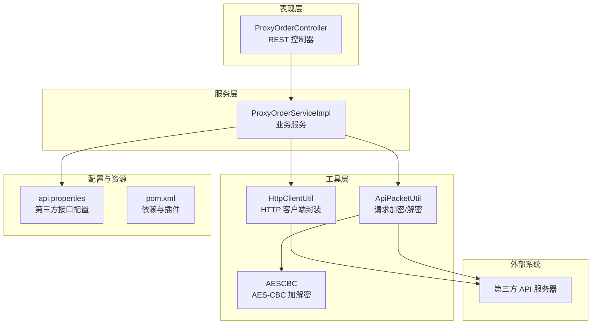
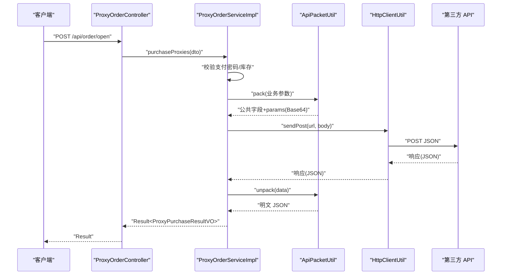
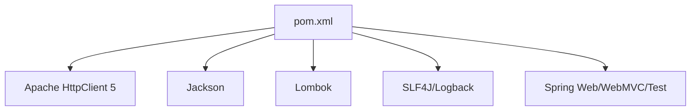

# HTTP 客户端工具

<cite>
**本文引用的文件**
- [HttpClientUtil.java](file://src/main/java/cn/linkfast/utils/HttpClientUtil.java)
- [ApiPacketUtil.java](file://src/main/java/cn/linkfast/utils/ApiPacketUtil.java)
- [AESCBC.java](file://src/main/java/cn/linkfast/utils/AESCBC.java)
- [ProxyOrderServiceImpl.java](file://src/main/java/cn/linkfast/service/impl/ProxyOrderServiceImpl.java)
- [ProxyOrderController.java](file://src/main/java/cn/linkfast/controller/ProxyOrderController.java)
- [Result.java](file://src/main/java/cn/linkfast/common/Result.java)
- [api.properties](file://src/main/resources/api.properties)
- [pom.xml](file://pom.xml)
- [test-api.http](file://test-api.http)
- [创建代理订单接口-第三方.md](file://docs/api/third-party/创建代理订单接口-第三方.md)
- [代理续费接口-第三方.md](file://docs/api/third-party/代理续费接口-第三方.md)
</cite>

## 目录
1. [简介](#简介)
2. [项目结构](#项目结构)
3. [核心组件](#核心组件)
4. [架构总览](#架构总览)
5. [详细组件分析](#详细组件分析)
6. [依赖分析](#依赖分析)
7. [性能考虑](#性能考虑)
8. [故障排查指南](#故障排查指南)
9. [结论](#结论)
10. [附录](#附录)

## 简介
本文件面向“HTTP 客户端工具”的技术文档，聚焦于以下目标：
- 深入解释 HTTP 请求构建机制，覆盖 GET、POST、PUT、DELETE 等常见方法的实现思路与扩展点
- 文档化响应处理流程，包括状态码解析、响应体处理与头部信息提取
- 详细说明错误处理机制，涵盖连接超时、网络异常、HTTP 错误码的策略
- 解释连接池管理与性能优化，包括连接复用、超时设置与并发控制
- 提供第三方 API 调用的实际示例，展示在代理服务中的应用场景
- 包含安全考虑，如 SSL/TLS 配置、证书验证与请求签名

## 项目结构
该项目采用典型的 Spring MVC + 服务层 + 工具层的分层组织方式，HTTP 客户端工具位于工具层，被服务层用于与第三方 API 交互。

图表来源
- [ProxyOrderController.java:1-88](file://src/main/java/cn/linkfast/controller/ProxyOrderController.java#L1-88)
- [ProxyOrderServiceImpl.java:1-782](file://src/main/java/cn/linkfast/service/impl/ProxyOrderServiceImpl.java#L1-782)
- [HttpClientUtil.java:1-46](file://src/main/java/cn/linkfast/utils/HttpClientUtil.java#L1-46)
- [ApiPacketUtil.java:1-106](file://src/main/java/cn/linkfast/utils/ApiPacketUtil.java#L1-106)
- [AESCBC.java:1-36](file://src/main/java/cn/linkfast/utils/AESCBC.java#L1-36)
- [api.properties:1-31](file://src/main/resources/api.properties#L1-31)
- [pom.xml:1-294](file://pom.xml#L1-294)

章节来源
- [ProxyOrderController.java:1-88](file://src/main/java/cn/linkfast/controller/ProxyOrderController.java#L1-L88)
- [ProxyOrderServiceImpl.java:1-782](file://src/main/java/cn/linkfast/service/impl/ProxyOrderServiceImpl.java#L1-L782)
- [HttpClientUtil.java:1-46](file://src/main/java/cn/linkfast/utils/HttpClientUtil.java#L1-L46)
- [ApiPacketUtil.java:1-106](file://src/main/java/cn/linkfast/utils/ApiPacketUtil.java#L1-L106)
- [AESCBC.java:1-36](file://src/main/java/cn/linkfast/utils/AESCBC.java#L1-L36)
- [api.properties:1-31](file://src/main/resources/api.properties#L1-L31)
- [pom.xml:1-294](file://pom.xml#L1-L294)

## 核心组件
- HTTP 客户端封装：基于 Apache HttpClient 5，提供简洁的 POST JSON 能力，并对非 2xx 状态进行统一兜底
- 请求加密工具：负责业务参数的 AES-CBC 加密、Base64 编码以及公共字段组装
- AES-CBC 实现：提供对称加解密能力，配合工具类完成请求签名与数据保护
- 业务服务：封装与第三方 API 的交互流程，包含重试、解密、响应解析与事务控制
- 控制器：对外暴露 REST 接口，调用服务层完成业务操作
- 统一响应：提供标准的 Result 结构，便于前端消费

章节来源
- [HttpClientUtil.java:15-46](file://src/main/java/cn/linkfast/utils/HttpClientUtil.java#L15-L46)
- [ApiPacketUtil.java:14-106](file://src/main/java/cn/linkfast/utils/ApiPacketUtil.java#L14-L106)
- [AESCBC.java:13-36](file://src/main/java/cn/linkfast/utils/AESCBC.java#L13-L36)
- [ProxyOrderServiceImpl.java:89-194](file://src/main/java/cn/linkfast/service/impl/ProxyOrderServiceImpl.java#L89-L194)
- [Result.java:6-59](file://src/main/java/cn/linkfast/common/Result.java#L6-L59)

## 架构总览
下图展示了从控制器到第三方 API 的完整调用链路，以及请求加密与响应解密的关键步骤。

图表来源
- [ProxyOrderController.java:42-45](file://src/main/java/cn/linkfast/controller/ProxyOrderController.java#L42-L45)
- [ProxyOrderServiceImpl.java:198-458](file://src/main/java/cn/linkfast/service/impl/ProxyOrderServiceImpl.java#L198-L458)
- [ApiPacketUtil.java:58-92](file://src/main/java/cn/linkfast/utils/ApiPacketUtil.java#L58-L92)
- [HttpClientUtil.java:27-44](file://src/main/java/cn/linkfast/utils/HttpClientUtil.java#L27-L44)

## 详细组件分析

### HTTP 客户端封装（Apache HttpClient 5）
- 设计要点
  - 使用默认客户端创建与自动关闭，确保资源释放
  - 通过 JSON 实体发送 POST 请求，Content-Type 设置为 application/json
  - 对响应状态进行判定：2xx 成功返回响应体；否则记录错误并返回包含状态码的 JSON，便于上层按业务 code 解析
- 扩展点
  - GET/PUT/DELETE 方法可通过新增静态方法实现，遵循相同的状态码判定与返回策略
  - 可引入连接池、超时配置、重试策略与自定义头部，以满足不同第三方 API 的要求
- 错误处理
  - 非 2xx 状态返回统一结构，避免上层重复判断
  - 异常传播交由调用方处理，便于业务层进行幂等与重试控制

章节来源
- [HttpClientUtil.java:15-46](file://src/main/java/cn/linkfast/utils/HttpClientUtil.java#L15-L46)

### 请求加密与签名（ApiPacketUtil + AESCBC）
- 设计要点
  - 在属性初始化阶段根据环境选择 appKey 与 appSecret，并从 appSecret 中派生 AES IV
  - pack：将业务参数序列化为 JSON，AES-CBC 加密，Base64 编码，附加公共字段（版本、加密方式、appKey、reqId）
  - unpack：对响应 data 字段进行 Base64 解码与 AES-CBC 解密
- 安全考虑
  - 使用对称加密保护敏感业务参数
  - 通过 appKey 与 reqId 辅助第三方侧的身份识别与去重
- 适用场景
  - 与第三方 API 交互时，所有请求均需按该协议打包；响应 data 需要解密后再解析

章节来源
- [ApiPacketUtil.java:14-106](file://src/main/java/cn/linkfast/utils/ApiPacketUtil.java#L14-L106)
- [AESCBC.java:13-36](file://src/main/java/cn/linkfast/utils/AESCBC.java#L13-L36)

### 业务服务（ProxyOrderServiceImpl）
- 环境与路径
  - 通过 api.properties 读取环境（prod/sandbox）、基础 URL 与各接口路径
- 重试与幂等
  - 对于连接建立失败（ConnectException、UnknownHostException），允许最多 3 次重试，并按指数退避等待
  - 对于连接已建立但响应读取失败的情况，抛出不可回滚异常，避免重复落库
- 响应解析与解密
  - 解析外层 JSON，校验 code=200；否则抛出业务异常
  - 对 data 字段进行解密与二次 JSON 解析，提取 orderNo、amount 等关键字段
- 事务控制
  - 使用 Spring 事务注解，结合不可回滚异常，确保在第三方已落库场景下不重复处理
- 典型流程（创建代理订单）
  - 组装业务参数 -> pack 加密 -> sendPost -> unpack 解密 -> 回写订单信息

章节来源
- [api.properties:1-31](file://src/main/resources/api.properties#L1-L31)
- [ProxyOrderServiceImpl.java:89-136](file://src/main/java/cn/linkfast/service/impl/ProxyOrderServiceImpl.java#L89-L136)
- [ProxyOrderServiceImpl.java:198-458](file://src/main/java/cn/linkfast/service/impl/ProxyOrderServiceImpl.java#L198-L458)

### 控制器（ProxyOrderController）
- 提供对外接口：查询订单列表、开通代理、续费代理、释放代理
- 统一返回 Result 结构，便于前端处理
- 与服务层协作，完成参数校验、异常捕获与结果封装

章节来源
- [ProxyOrderController.java:17-88](file://src/main/java/cn/linkfast/controller/ProxyOrderController.java#L17-L88)
- [Result.java:6-59](file://src/main/java/cn/linkfast/common/Result.java#L6-L59)

### 第三方 API 示例（创建代理订单）
- 请求路径与参数
  - 路径：/api/open/app/instance/open/v2
  - 业务参数包含 appOrderNo、params（产品编号、数量、周期等）
- 返回数据
  - orderNo、appOrderNo、amount 等
- 与项目集成
  - 业务服务通过 ApiPacketUtil.pack 打包参数，通过 HttpClientUtil.sendPost 发送请求，再通过 ApiPacketUtil.unpack 解密响应

章节来源
- [创建代理订单接口-第三方.md:1-110](file://docs/api/third-party/创建代理订单接口-第三方.md#L1-L110)
- [ProxyOrderServiceImpl.java:338-421](file://src/main/java/cn/linkfast/service/impl/ProxyOrderServiceImpl.java#L338-L421)

### 第三方 API 示例（代理续费）
- 请求路径与参数
  - 路径：/api/open/app/instance/renew/v2
  - 业务参数包含 appOrderNo、instances（实例编号、时长、周期等）
- 返回数据
  - orderNo、appOrderNo、amount 等
- 与项目集成
  - 业务服务通过 ApiPacketUtil.pack 打包参数，通过 HttpClientUtil.sendPost 发送请求，再通过 ApiPacketUtil.unpack 解密响应

章节来源
- [代理续费接口-第三方.md:1-31](file://docs/api/third-party/代理续费接口-第三方.md#L1-L31)
- [ProxyOrderServiceImpl.java:515-630](file://src/main/java/cn/linkfast/service/impl/ProxyOrderServiceImpl.java#L515-L630)

## 依赖分析
- Apache HttpClient 5：提供 HTTP 客户端能力，支持连接复用与异步特性
- Jackson：用于 JSON 序列化与反序列化
- Lombok：减少样板代码
- SLF4J/Logback：日志输出
- Spring 生态：Spring Web/WebMVC、Validation、Test 等

图表来源
- [pom.xml:22-131](file://pom.xml#L22-L131)

章节来源
- [pom.xml:1-294](file://pom.xml#L1-L294)

## 性能考虑
- 连接池与复用
  - 当前实现每次请求新建客户端并在 try-with-resources 中自动关闭，适合低频调用
  - 建议在生产环境中引入连接池（如 PoolingHttpClientConnectionManager），并设置合理的最大连接数、空闲超时与连接时长
- 超时设置
  - 建议分别配置连接超时、socket 超时与请求超时，针对不同第三方接口设置差异化阈值
- 并发控制
  - 对于高并发场景，建议引入限流与熔断策略，避免对第三方接口造成压力峰值
- 压缩与缓存
  - 若第三方接口支持 gzip/deflate，可在客户端启用压缩以降低带宽占用
  - 对于查询类接口，可结合业务场景引入缓存策略，减少重复请求

## 故障排查指南
- 连接建立失败（ConnectException/UnknownHostException）
  - 现象：重试多次后仍失败，抛出业务异常
  - 处理：检查网络连通性、DNS 解析、代理配置与防火墙规则
- 响应读取失败（连接已建立但读取异常）
  - 现象：第三方可能已落库，抛出不可回滚异常
  - 处理：人工核对订单状态，必要时进行补偿处理
- 响应为空或非法 JSON
  - 现象：第三方返回空字符串或非标准 JSON
  - 处理：记录完整响应并报警，避免重复处理
- code 非 200 或 data 缺失/为空
  - 现象：业务失败或数据不完整
  - 处理：根据 code 与 msg 进行提示或重试，确保幂等性
- 解密失败
  - 现象：appSecret 或 IV 配置错误导致解密异常
  - 处理：核对 api.properties 中的 appKey/appSecret 与 IV 派生逻辑

章节来源
- [ProxyOrderServiceImpl.java:346-451](file://src/main/java/cn/linkfast/service/impl/ProxyOrderServiceImpl.java#L346-L451)
- [ProxyOrderServiceImpl.java:524-634](file://src/main/java/cn/linkfast/service/impl/ProxyOrderServiceImpl.java#L524-L634)
- [ProxyOrderServiceImpl.java:681-778](file://src/main/java/cn/linkfast/service/impl/ProxyOrderServiceImpl.java#L681-L778)

## 结论
本项目通过简洁的 HTTP 客户端封装与完善的加密/解密工具，实现了与第三方 API 的稳定交互。业务服务层在重试、解密、响应解析与事务控制方面提供了健壮的错误处理策略。建议在生产环境中引入连接池、超时配置与并发控制，以进一步提升性能与可靠性。

## 附录

### HTTP 方法扩展建议
- GET：适用于查询类接口，建议封装为静态方法，支持查询参数拼接与响应解析
- POST：当前已实现 JSON POST，建议统一状态码处理与错误返回结构
- PUT/DELETE：建议参考 POST 的实现模式，统一异常与状态码处理

### SSL/TLS 与证书验证
- 建议在连接池层面配置 HTTPS 客户端，启用主机名验证与信任库校验
- 对于自签证书或内部 CA，需正确配置信任链与证书路径

### 请求签名与防重放
- 当前通过 appKey、reqId 与 AES-CBC 实现基本防护
- 建议引入时间戳与签名算法（如 HMAC-SHA256），并严格校验时间窗口

### 示例接口调用
- 使用内置测试脚本验证 GET 接口
  - [test-api.http:1-3](file://test-api.http#L1-L3)

章节来源
- [test-api.http:1-3](file://test-api.http#L1-L3)