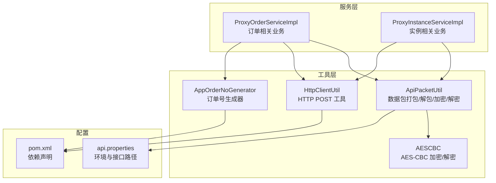
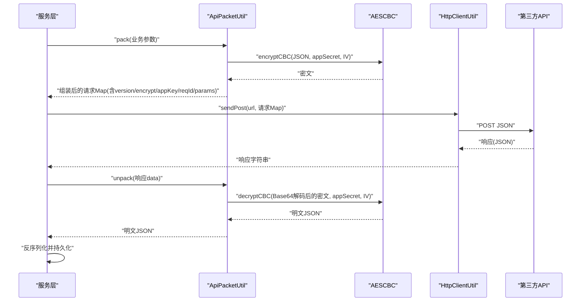
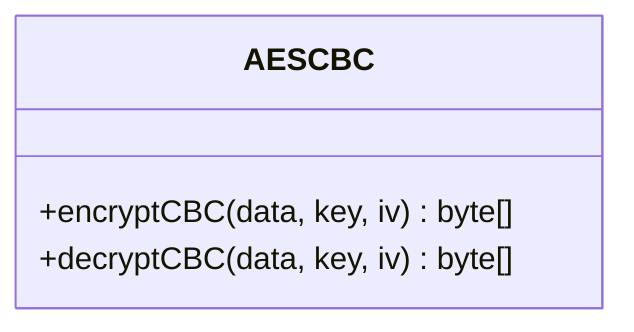
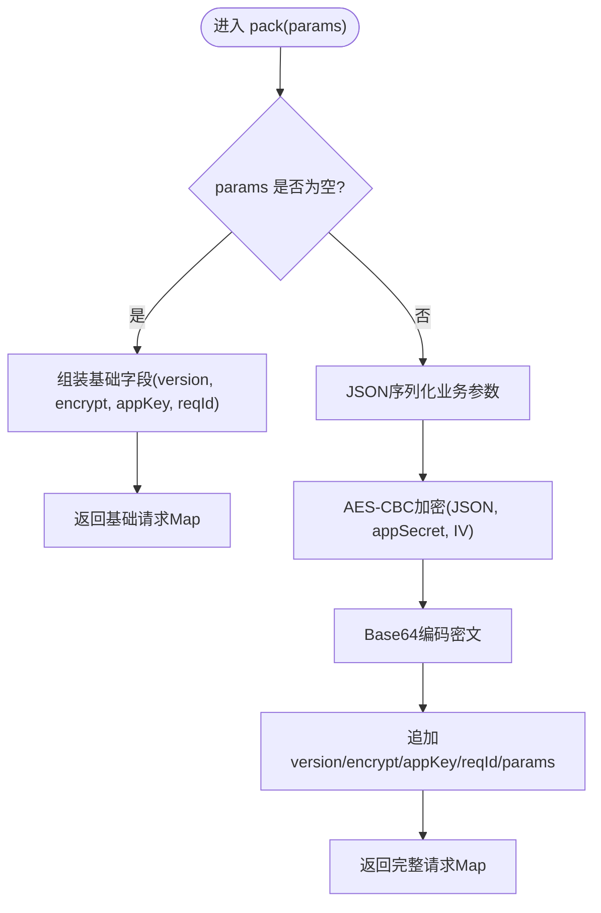
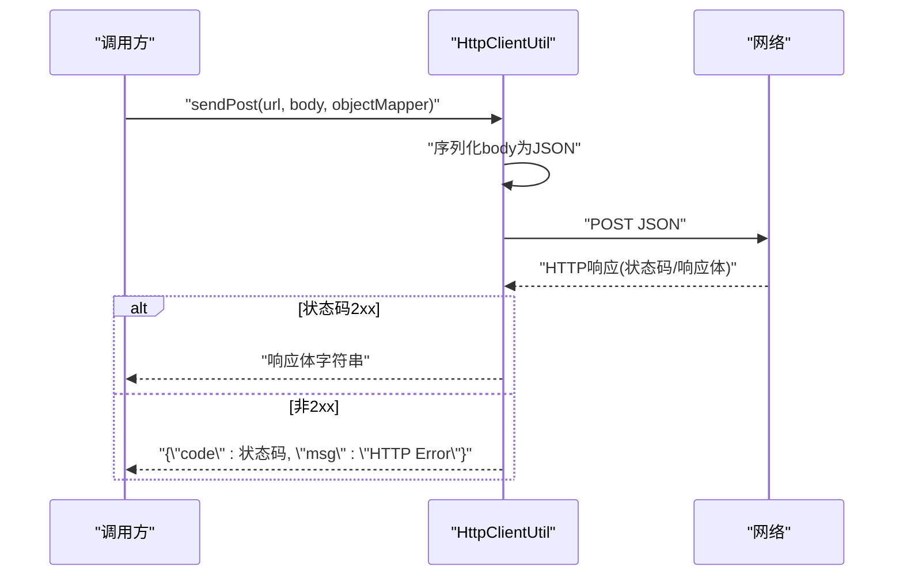
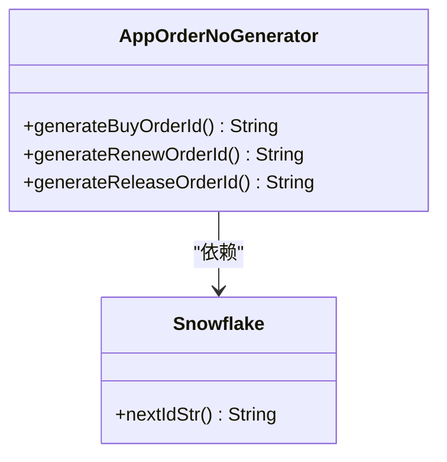
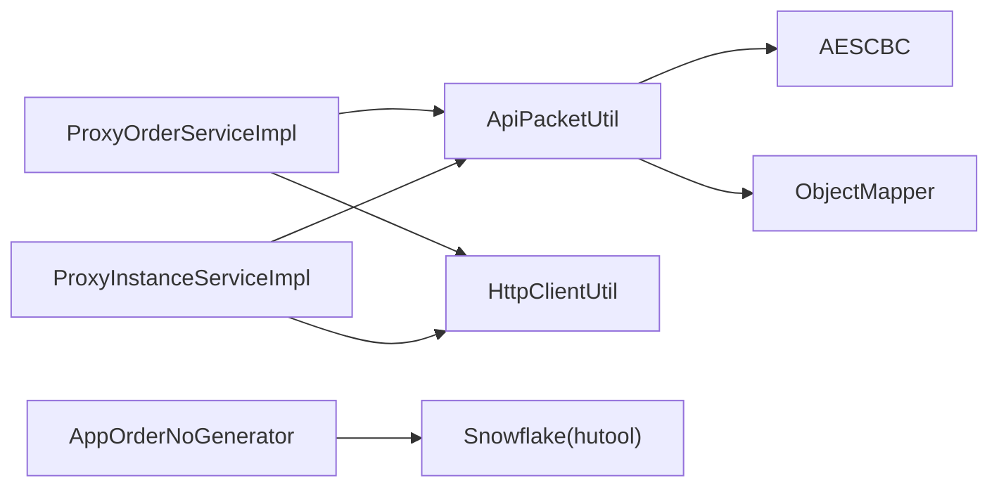

# 核心工具类

<cite>
**本文引用的文件**
- [AESCBC.java](file://src/main/java/cn/linkfast/utils/AESCBC.java)
- [ApiPacketUtil.java](file://src/main/java/cn/linkfast/utils/ApiPacketUtil.java)
- [AppOrderNoGenerator.java](file://src/main/java/cn/linkfast/utils/AppOrderNoGenerator.java)
- [HttpClientUtil.java](file://src/main/java/cn/linkfast/utils/HttpClientUtil.java)
- [ProxyOrderServiceImpl.java](file://src/main/java/cn/linkfast/service/impl/ProxyOrderServiceImpl.java)
- [ProxyInstanceServiceImpl.java](file://src/main/java/cn/linkfast/service/impl/ProxyInstanceServiceImpl.java)
- [AESCBCTest.java](file://src/test/java/cn/linkfast/utils/AESCBCTest.java)
- [api.properties](file://src/main/resources/api.properties)
- [pom.xml](file://pom.xml)
</cite>

## 目录
1. [简介](#简介)
2. [项目结构](#项目结构)
3. [核心组件](#核心组件)
4. [架构总览](#架构总览)
5. [详细组件分析](#详细组件分析)
6. [依赖分析](#依赖分析)
7. [性能考虑](#性能考虑)
8. [故障排查指南](#故障排查指南)
9. [结论](#结论)
10. [附录](#附录)

## 简介
本文件面向 Link-Fast 项目的核心工具类，系统性地文档化以下工具的实现原理、使用方法、协作关系与最佳实践：
- AESCBC：基于 Java JCE 的 AES-CBC 加密/解密工具
- ApiPacketUtil：API 数据包打包/解包与加密/解密工具，支持 Spring 注入与多环境配置
- HttpClientUtil：基于 Apache HttpClient 5 的简单 POST 工具，负责请求构建与响应处理
- AppOrderNoGenerator：基于 Snowflake 的订单号生成器，区分购买/续费/释放三类业务

同时给出性能优化建议、安全注意事项与常见问题排查方法，帮助开发者正确、高效且安全地使用这些工具。

## 项目结构
核心工具类位于 cn.linkfast.utils 包中，配合服务层在业务流程中完成“参数打包→HTTP 请求→响应解密→数据落库”的闭环。

图表来源
- [ApiPacketUtil.java:18-51](file://src/main/java/cn/linkfast/utils/ApiPacketUtil.java#L18-L51)
- [HttpClientUtil.java:19-44](file://src/main/java/cn/linkfast/utils/HttpClientUtil.java#L19-L44)
- [AppOrderNoGenerator.java:14-44](file://src/main/java/cn/linkfast/utils/AppOrderNoGenerator.java#L14-L44)
- [ProxyOrderServiceImpl.java:37-87](file://src/main/java/cn/linkfast/service/impl/ProxyOrderServiceImpl.java#L37-L87)
- [ProxyInstanceServiceImpl.java:38-69](file://src/main/java/cn/linkfast/service/impl/ProxyInstanceServiceImpl.java#L38-L69)
- [api.properties:1-31](file://src/main/resources/api.properties#L1-L31)
- [pom.xml:22-212](file://pom.xml#L22-L212)

章节来源
- [ApiPacketUtil.java:18-51](file://src/main/java/cn/linkfast/utils/ApiPacketUtil.java#L18-L51)
- [HttpClientUtil.java:19-44](file://src/main/java/cn/linkfast/utils/HttpClientUtil.java#L19-L44)
- [AppOrderNoGenerator.java:14-44](file://src/main/java/cn/linkfast/utils/AppOrderNoGenerator.java#L14-L44)
- [ProxyOrderServiceImpl.java:37-87](file://src/main/java/cn/linkfast/service/impl/ProxyOrderServiceImpl.java#L37-L87)
- [ProxyInstanceServiceImpl.java:38-69](file://src/main/java/cn/linkfast/service/impl/ProxyInstanceServiceImpl.java#L38-L69)
- [api.properties:1-31](file://src/main/resources/api.properties#L1-L31)
- [pom.xml:22-212](file://pom.xml#L22-L212)

## 核心组件
- AESCBC：提供对称加密/解密能力，采用 AES/CBC/PKCS5Padding 模式，输入输出均为字节数组，异常由调用方捕获处理。
- ApiPacketUtil：Spring 组件，负责业务参数序列化、AES-CBC 加密、Base64 编码、请求 Map 组装、响应 data 字段解密与还原。
- HttpClientUtil：静态工具类，封装 POST JSON 请求，自动处理状态码与错误响应，返回字符串供上层解析。
- AppOrderNoGenerator：基于 Snowflake 的分布式 ID 生成器，带业务前缀，分别生成购买/续费/释放订单号。

章节来源
- [AESCBC.java:19-30](file://src/main/java/cn/linkfast/utils/AESCBC.java#L19-L30)
- [ApiPacketUtil.java:18-103](file://src/main/java/cn/linkfast/utils/ApiPacketUtil.java#L18-L103)
- [HttpClientUtil.java:19-44](file://src/main/java/cn/linkfast/utils/HttpClientUtil.java#L19-L44)
- [AppOrderNoGenerator.java:14-44](file://src/main/java/cn/linkfast/utils/AppOrderNoGenerator.java#L14-L44)

## 架构总览
下图展示了“业务参数→数据包→HTTP 请求→响应解密→业务落库”的整体流程，以及各工具之间的协作关系。

图表来源
- [ProxyOrderServiceImpl.java:91-136](file://src/main/java/cn/linkfast/service/impl/ProxyOrderServiceImpl.java#L91-L136)
- [ProxyInstanceServiceImpl.java:71-88](file://src/main/java/cn/linkfast/service/impl/ProxyInstanceServiceImpl.java#L71-L88)
- [ApiPacketUtil.java:56-102](file://src/main/java/cn/linkfast/utils/ApiPacketUtil.java#L56-L102)
- [HttpClientUtil.java:27-43](file://src/main/java/cn/linkfast/utils/HttpClientUtil.java#L27-L43)
- [AESCBC.java:20-30](file://src/main/java/cn/linkfast/utils/AESCBC.java#L20-L30)

## 详细组件分析

### AESCBC 加密工具类
- 实现要点
  - 使用 AES/CBC/PKCS5Padding 模式进行对称加解密
  - 密钥长度必须满足 AES 支持的 16/24/32 字节
  - IV 长度固定为 16 字节（对应 AES 块大小）
  - 异常类型覆盖：算法/填充/密钥/参数/块/填充错误
- 关键方法
  - encryptCBC(data, key, iv)：返回密文字节数组
  - decryptCBC(data, key, iv)：返回明文字节数组
- 使用注意
  - 保证 key 与 iv 来源一致且长度合规
  - 与 ApiPacketUtil 的 appSecret 截取前 16 字节作为 IV 的约定保持一致
- 性能与安全
  - 仅做加解密，不涉及随机数生成，开销低
  - 建议在高并发场景复用 Cipher 实例（当前为每次调用新建）

图表来源
- [AESCBC.java:19-30](file://src/main/java/cn/linkfast/utils/AESCBC.java#L19-L30)

章节来源
- [AESCBC.java:19-30](file://src/main/java/cn/linkfast/utils/AESCBC.java#L19-L30)
- [AESCBCTest.java:15-77](file://src/test/java/cn/linkfast/utils/AESCBCTest.java#L15-L77)

### ApiPacketUtil API 数据包处理工具
- 功能概述
  - 业务参数对象序列化为 JSON
  - 使用 AES-CBC 对 JSON 进行加密
  - Base64 编码后放入请求 Map，附加版本号、加密方式、appKey、reqId
  - 响应 data 字段解密并还原为明文 JSON
- 配置与初始化
  - 通过 Spring 注入环境变量与 appKey/appSecret
  - 在 PostConstruct 中根据环境选择生产/沙箱配置，并从 appSecret 截取前 16 字节作为 AES IV
- 版本兼容性
  - version 固定为 2.0，与接口文档 v2 版本对应
  - encrypt 固定为 "aes"
- 错误处理
  - 参数为空时仍可返回基础请求 Map（用于无业务参数场景）
  - 解密空串直接返回 null，避免空指针

图表来源
- [ApiPacketUtil.java:56-90](file://src/main/java/cn/linkfast/utils/ApiPacketUtil.java#L56-L90)

章节来源
- [ApiPacketUtil.java:18-103](file://src/main/java/cn/linkfast/utils/ApiPacketUtil.java#L18-L103)
- [api.properties:1-31](file://src/main/resources/api.properties#L1-L31)

### HttpClientUtil HTTP 客户端工具
- 功能概述
  - 将 Map 序列化为 JSON 后发送 POST 请求
  - 正常响应（2xx）返回响应体字符串
  - 非 2xx 响应记录错误日志并返回包含状态码的 JSON 字符串，便于上层按业务 code 解析
- 使用注意
  - 该工具为静态方法，适合在服务层直接调用
  - 建议在高并发场景复用 HttpClient 实例（当前为每次调用创建默认客户端）

图表来源
- [HttpClientUtil.java:27-43](file://src/main/java/cn/linkfast/utils/HttpClientUtil.java#L27-L43)

章节来源
- [HttpClientUtil.java:19-44](file://src/main/java/cn/linkfast/utils/HttpClientUtil.java#L19-L44)

### AppOrderNoGenerator 订单号生成器
- 算法与规则
  - 基于 Snowflake 分布式 ID 生成器，生成全局唯一递增 ID
  - 业务前缀区分三类订单：
    - P：购买订单
    - R：续费订单
    - F：释放订单
- 使用建议
  - 生成的订单号字符串长度固定前缀 + 数字串，便于数据库索引与业务识别
  - 与服务层订单创建流程结合，确保幂等与一致性

图表来源
- [AppOrderNoGenerator.java:14-44](file://src/main/java/cn/linkfast/utils/AppOrderNoGenerator.java#L14-L44)

章节来源
- [AppOrderNoGenerator.java:14-44](file://src/main/java/cn/linkfast/utils/AppOrderNoGenerator.java#L14-L44)

## 依赖分析
- 组件耦合
  - ApiPacketUtil 依赖 AESCBC 与 Jackson ObjectMapper
  - 服务层（ProxyOrderServiceImpl、ProxyInstanceServiceImpl）依赖 ApiPacketUtil 与 HttpClientUtil
  - AppOrderNoGenerator 依赖 Snowflake（来自 hutool-all）
- 外部依赖
  - Jackson：JSON 序列化/反序列化
  - Apache HttpClient 5：HTTP 客户端
  - SLF4J/Logback：日志
  - Lombok：简化代码
  - Hutool：Snowflake 分布式 ID

图表来源
- [pom.xml:64-211](file://pom.xml#L64-L211)
- [ProxyOrderServiceImpl.java:13-45](file://src/main/java/cn/linkfast/service/impl/ProxyOrderServiceImpl.java#L13-L45)
- [ProxyInstanceServiceImpl.java:11-43](file://src/main/java/cn/linkfast/service/impl/ProxyInstanceServiceImpl.java#L11-L43)
- [AppOrderNoGenerator.java:3-5](file://src/main/java/cn/linkfast/utils/AppOrderNoGenerator.java#L3-L5)

章节来源
- [pom.xml:22-212](file://pom.xml#L22-L212)
- [ProxyOrderServiceImpl.java:13-45](file://src/main/java/cn/linkfast/service/impl/ProxyOrderServiceImpl.java#L13-L45)
- [ProxyInstanceServiceImpl.java:11-43](file://src/main/java/cn/linkfast/service/impl/ProxyInstanceServiceImpl.java#L11-L43)
- [AppOrderNoGenerator.java:3-5](file://src/main/java/cn/linkfast/utils/AppOrderNoGenerator.java#L3-L5)

## 性能考虑
- AESCBC
  - 当前每次调用都创建 Cipher 实例，建议在高并发场景复用 Cipher 或使用线程安全的工厂模式
  - 密钥与 IV 为字节数组，避免频繁转换可减少 GC 压力
- ApiPacketUtil
  - ObjectMapper 为单例（Spring 管理），无需重复创建
  - Base64 编解码与 AES 加解密为 CPU 密集型，建议批量处理或异步化
- HttpClientUtil
  - 每次调用创建默认 HttpClient，建议引入连接池与超时配置，提升吞吐与稳定性
- AppOrderNoGenerator
  - Snowflake 生成器为纯内存操作，性能优异；注意与数据库写入的顺序一致性

[本节为通用性能建议，不直接分析具体文件]

## 故障排查指南
- AESCBC 常见异常
  - InvalidKeyException：密钥长度不符合 AES 要求（16/24/32 字节）
  - InvalidAlgorithmParameterException：IV 长度不足 16 字节
  - BadPaddingException/IllegalBlockSizeException：密钥/IV 不匹配或数据损坏
  - 排查建议：核对 appSecret 与 IV 来源是否一致，确保 Base64 编解码链路无截断
- ApiPacketUtil
  - 空参数场景：确认基础字段 version/encrypt/appKey/reqId 是否正确组装
  - 解密失败：检查响应 data 是否为空或被截断，确认 appSecret 与 IV 未变更
- HttpClientUtil
  - 非 2xx 响应：查看返回的 JSON 中 code 字段，结合日志定位上游错误
  - 空响应：确认第三方接口可用性与网络连通性
- 订单号生成
  - 重复或冲突：确认 Snowflake 节点 ID 配置唯一性，避免多实例相同配置

章节来源
- [AESCBC.java:19-30](file://src/main/java/cn/linkfast/utils/AESCBC.java#L19-L30)
- [ApiPacketUtil.java:56-102](file://src/main/java/cn/linkfast/utils/ApiPacketUtil.java#L56-L102)
- [HttpClientUtil.java:27-43](file://src/main/java/cn/linkfast/utils/HttpClientUtil.java#L27-L43)
- [AESCBCTest.java:57-77](file://src/test/java/cn/linkfast/utils/AESCBCTest.java#L57-L77)

## 结论
上述工具类围绕“数据包封装→加密传输→HTTP 交互→响应解密→业务落库”形成闭环，具备明确职责与清晰边界。通过 Spring 注入与配置分离，实现了环境切换与密钥管理的灵活性；通过静态工具类与服务层协作，兼顾了易用性与可测试性。建议在生产环境中进一步完善连接池、超时与重试策略，并持续监控日志与指标，确保系统的稳定性与安全性。

[本节为总结性内容，不直接分析具体文件]

## 附录

### 使用示例（步骤说明）
- 使用 ApiPacketUtil 打包并发送请求
  - 在服务层构造业务参数 Map
  - 调用 ApiPacketUtil.pack(params) 获取最终请求 Map
  - 调用 HttpClientUtil.sendPost(url, finalRequest, objectMapper) 发送请求
  - 若响应 code=200，则调用 ApiPacketUtil.unpack(response.data) 还原明文 JSON 并反序列化
- 使用 AppOrderNoGenerator 生成订单号
  - 调用 generateBuyOrderId()/generateRenewOrderId()/generateReleaseOrderId() 获取不同业务类型的订单号
- 使用 AESCBC 进行加解密
  - 传入 data/key/iv（key 长度 16/24/32，iv 长度 16），调用 encryptCBC/decryptCBC

章节来源
- [ProxyOrderServiceImpl.java:91-136](file://src/main/java/cn/linkfast/service/impl/ProxyOrderServiceImpl.java#L91-L136)
- [ProxyInstanceServiceImpl.java:71-88](file://src/main/java/cn/linkfast/service/impl/ProxyInstanceServiceImpl.java#L71-L88)
- [ApiPacketUtil.java:56-102](file://src/main/java/cn/linkfast/utils/ApiPacketUtil.java#L56-L102)
- [HttpClientUtil.java:27-43](file://src/main/java/cn/linkfast/utils/HttpClientUtil.java#L27-L43)
- [AppOrderNoGenerator.java:27-43](file://src/main/java/cn/linkfast/utils/AppOrderNoGenerator.java#L27-L43)