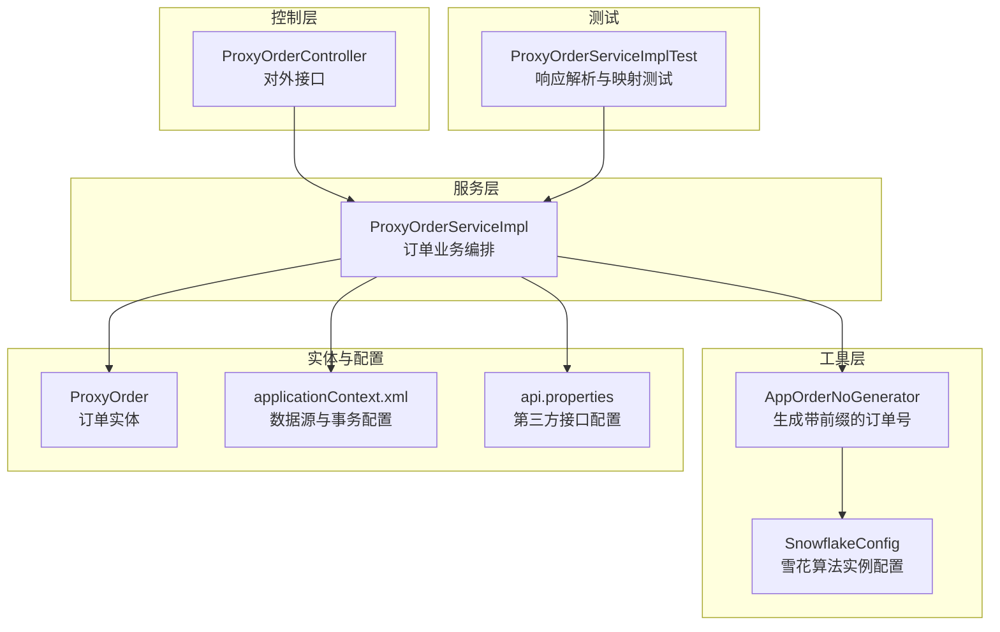
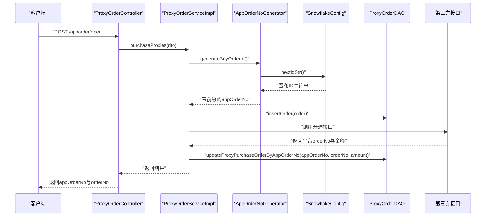
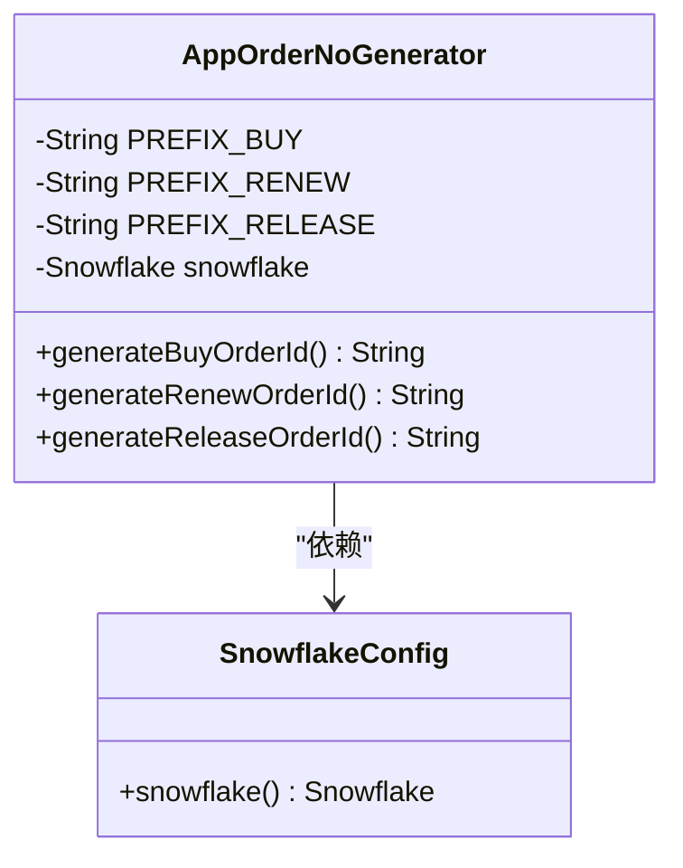
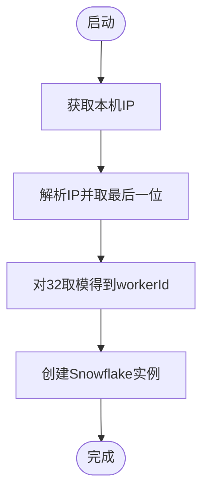
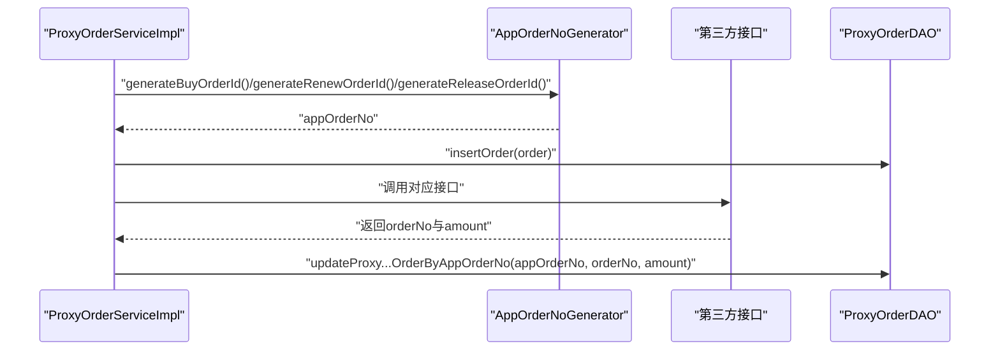
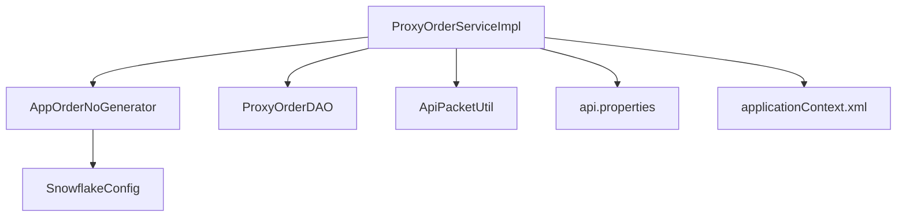

# 订单号生成器

<cite>
**本文引用的文件**
- [AppOrderNoGenerator.java](file://src/main/java/cn/linkfast/utils/AppOrderNoGenerator.java)
- [SnowflakeConfig.java](file://src/main/java/cn/linkfast/config/SnowflakeConfig.java)
- [ProxyOrderServiceImpl.java](file://src/main/java/cn/linkfast/service/impl/ProxyOrderServiceImpl.java)
- [ProxyOrder.java](file://src/main/java/cn/linkfast/entity/ProxyOrder.java)
- [ProxyOrderController.java](file://src/main/java/cn/linkfast/controller/ProxyOrderController.java)
- [ApiPacketUtil.java](file://src/main/java/cn/linkfast/utils/ApiPacketUtil.java)
- [applicationContext.xml](file://src/main/resources/applicationContext.xml)
- [api.properties](file://src/main/resources/api.properties)
- [ProxyOrderServiceImplTest.java](file://src/test/java/cn/linkfast/service/Impl/ProxyOrderServiceImplTest.java)
</cite>

## 目录
1. [简介](#简介)
2. [项目结构](#项目结构)
3. [核心组件](#核心组件)
4. [架构概览](#架构概览)
5. [详细组件分析](#详细组件分析)
6. [依赖分析](#依赖分析)
7. [性能考虑](#性能考虑)
8. [故障排查指南](#故障排查指南)
9. [结论](#结论)
10. [附录](#附录)

## 简介
本文档围绕“订单号生成器”展开，系统性阐述其设计原理、实现细节、分布式唯一性保障、格式规范与兼容性、使用示例、性能与扩展性考量，以及测试策略与验证方法。该生成器基于雪花算法（Snowflake）实现，结合业务前缀，确保在高并发与多实例环境下生成全局唯一且具备可读性的订单号。

## 项目结构
围绕订单号生成与使用的相关模块分布如下：
- 工具层：AppOrderNoGenerator 负责生成带业务前缀的订单号；SnowflakeConfig 提供雪花算法实例。
- 服务层：ProxyOrderServiceImpl 在创建购买、续费、释放等订单流程中调用订单号生成器。
- 控制器层：ProxyOrderController 提供对外接口，触发订单创建与续费等操作。
- 实体与配置：ProxyOrder 描述订单模型；applicationContext.xml 与 api.properties 提供基础运行配置。
- 测试：ProxyOrderServiceImplTest 验证响应解析与映射逻辑，间接覆盖订单号生成流程。

**图表来源**
- [AppOrderNoGenerator.java:1-45](file://src/main/java/cn/linkfast/utils/AppOrderNoGenerator.java#L1-L45)
- [SnowflakeConfig.java:1-49](file://src/main/java/cn/linkfast/config/SnowflakeConfig.java#L1-L49)
- [ProxyOrderServiceImpl.java:1-782](file://src/main/java/cn/linkfast/service/impl/ProxyOrderServiceImpl.java#L1-L782)
- [ProxyOrderController.java:1-88](file://src/main/java/cn/linkfast/controller/ProxyOrderController.java#L1-L88)
- [ProxyOrder.java:1-45](file://src/main/java/cn/linkfast/entity/ProxyOrder.java#L1-L45)
- [applicationContext.xml:1-67](file://src/main/resources/applicationContext.xml#L1-L67)
- [api.properties:1-31](file://src/main/resources/api.properties#L1-L31)
- [ProxyOrderServiceImplTest.java:1-89](file://src/test/java/cn/linkfast/service/Impl/ProxyOrderServiceImplTest.java#L1-L89)

**章节来源**
- [AppOrderNoGenerator.java:1-45](file://src/main/java/cn/linkfast/utils/AppOrderNoGenerator.java#L1-L45)
- [SnowflakeConfig.java:1-49](file://src/main/java/cn/linkfast/config/SnowflakeConfig.java#L1-L49)
- [ProxyOrderServiceImpl.java:1-782](file://src/main/java/cn/linkfast/service/impl/ProxyOrderServiceImpl.java#L1-L782)
- [ProxyOrderController.java:1-88](file://src/main/java/cn/linkfast/controller/ProxyOrderController.java#L1-L88)
- [ProxyOrder.java:1-45](file://src/main/java/cn/linkfast/entity/ProxyOrder.java#L1-L45)
- [applicationContext.xml:1-67](file://src/main/resources/applicationContext.xml#L1-L67)
- [api.properties:1-31](file://src/main/resources/api.properties#L1-L31)
- [ProxyOrderServiceImplTest.java:1-89](file://src/test/java/cn/linkfast/service/Impl/ProxyOrderServiceImplTest.java#L1-L89)

## 核心组件
- 订单号生成器 AppOrderNoGenerator
  - 作用：为购买、续费、释放三类订单分别生成带业务前缀的订单号。
  - 设计要点：通过雪花算法生成全局递增 ID，再拼接业务前缀（P/R/F），形成统一格式。
- 雪花算法配置 SnowflakeConfig
  - 作用：基于本机 IP 计算 workerId，数据中心 ID 固定为 0，确保多实例唯一性。
  - 依赖：Hutool 的 Snowflake 实现。
- 订单服务 ProxyOrderServiceImpl
  - 作用：在购买、续费、释放等业务流程中调用订单号生成器，生成渠道商订单号（appOrderNo），并与平台订单号（orderNo）进行关联。
- 订单实体 ProxyOrder
  - 作用：承载订单信息，包括 appOrderNo（渠道商订单号）、orderNo（平台订单号）、订单类型、状态等。
- 接口控制器 ProxyOrderController
  - 作用：提供对外接口，触发订单创建、续费、释放等操作，内部调用服务层完成业务编排。

**章节来源**
- [AppOrderNoGenerator.java:14-45](file://src/main/java/cn/linkfast/utils/AppOrderNoGenerator.java#L14-L45)
- [SnowflakeConfig.java:16-49](file://src/main/java/cn/linkfast/config/SnowflakeConfig.java#L16-L49)
- [ProxyOrderServiceImpl.java:242-244](file://src/main/java/cn/linkfast/service/impl/ProxyOrderServiceImpl.java#L242-L244)
- [ProxyOrder.java:17-45](file://src/main/java/cn/linkfast/entity/ProxyOrder.java#L17-L45)
- [ProxyOrderController.java:24-88](file://src/main/java/cn/linkfast/controller/ProxyOrderController.java#L24-L88)

## 架构概览
订单号生成贯穿于订单创建、续费、释放等关键业务流程，整体交互如下：

**图表来源**
- [ProxyOrderController.java:42-45](file://src/main/java/cn/linkfast/controller/ProxyOrderController.java#L42-L45)
- [ProxyOrderServiceImpl.java:198-458](file://src/main/java/cn/linkfast/service/impl/ProxyOrderServiceImpl.java#L198-L458)
- [AppOrderNoGenerator.java:24-43](file://src/main/java/cn/linkfast/utils/AppOrderNoGenerator.java#L24-L43)
- [SnowflakeConfig.java:44-47](file://src/main/java/cn/linkfast/config/SnowflakeConfig.java#L44-L47)

## 详细组件分析

### 订单号生成器 AppOrderNoGenerator
- 设计原理
  - 采用雪花算法生成全局唯一、单调递增的 ID，再拼接业务前缀，形成统一格式。
  - 前缀区分订单类型：P（购买）、R（续费）、F（释放）。
- 数据结构与复杂度
  - 生成逻辑为 O(1)，依赖雪花算法的常数时间特性。
  - 字符串拼接开销极低，整体复杂度 O(1)。
- 依赖链
  - 依赖 SnowflakeConfig 提供的雪花实例。
- 错误处理
  - 生成器本身无显式异常处理，异常由雪花算法或调用方捕获。
- 性能影响
  - 生成成本极低，对高并发场景友好。

**图表来源**
- [AppOrderNoGenerator.java:14-45](file://src/main/java/cn/linkfast/utils/AppOrderNoGenerator.java#L14-L45)
- [SnowflakeConfig.java:16-49](file://src/main/java/cn/linkfast/config/SnowflakeConfig.java#L16-L49)

**章节来源**
- [AppOrderNoGenerator.java:14-45](file://src/main/java/cn/linkfast/utils/AppOrderNoGenerator.java#L14-L45)
- [SnowflakeConfig.java:16-49](file://src/main/java/cn/linkfast/config/SnowflakeConfig.java#L16-L49)

### 雪花算法配置 SnowflakeConfig
- 设计要点
  - workerId 基于本机 IP 最后一段按 32 取模，确保不同服务器/实例唯一。
  - 数据中心 ID 固定为 0，便于集中管理。
  - 通过 Spring Bean 暴露 Snowflake 实例，供其他组件注入使用。
- 唯一性保障
  - 不同实例的 workerId 不同，避免 ID 冲突。
  - 配合时间戳与序列号，保证全局唯一。
- 性能与扩展性
  - 单实例内 ID 严格递增，适合高并发场景。
  - 支持水平扩展，多实例部署无需协调。

**图表来源**
- [SnowflakeConfig.java:34-47](file://src/main/java/cn/linkfast/config/SnowflakeConfig.java#L34-L47)

**章节来源**
- [SnowflakeConfig.java:16-49](file://src/main/java/cn/linkfast/config/SnowflakeConfig.java#L16-L49)

### 订单服务 ProxyOrderServiceImpl 中的订单号使用
- 购买订单
  - 生成 appOrderNo（渠道商订单号），设置订单类型为购买，初始状态为待处理。
  - 调用第三方接口获取平台 orderNo 与金额，回写至数据库。
- 续费订单
  - 生成 appOrderNo（续费），设置订单类型为续费，初始状态为待处理。
  - 调用第三方续费接口，回写平台 orderNo 与金额。
- 释放订单
  - 生成 appOrderNo（释放），设置订单类型为释放，初始状态为待处理。
  - 调用第三方释放接口，回写平台 orderNo 与金额。
- 异常处理与幂等
  - 对第三方接口调用失败进行重试与异常分类处理，避免重复落库或回滚不一致。
  - 对“已发送但响应读取失败”的场景，采用不可回滚策略，确保业务一致性。

**图表来源**
- [ProxyOrderServiceImpl.java:242-244](file://src/main/java/cn/linkfast/service/impl/ProxyOrderServiceImpl.java#L242-L244)
- [ProxyOrderServiceImpl.java:470-473](file://src/main/java/cn/linkfast/service/impl/ProxyOrderServiceImpl.java#L470-L473)
- [ProxyOrderServiceImpl.java:646-648](file://src/main/java/cn/linkfast/service/impl/ProxyOrderServiceImpl.java#L646-L648)

**章节来源**
- [ProxyOrderServiceImpl.java:198-458](file://src/main/java/cn/linkfast/service/impl/ProxyOrderServiceImpl.java#L198-L458)
- [ProxyOrderServiceImpl.java:470-635](file://src/main/java/cn/linkfast/service/impl/ProxyOrderServiceImpl.java#L470-L635)
- [ProxyOrderServiceImpl.java:637-779](file://src/main/java/cn/linkfast/service/impl/ProxyOrderServiceImpl.java#L637-L779)

### 订单实体与接口控制器
- 订单实体 ProxyOrder
  - 包含 appOrderNo（渠道商订单号）、orderNo（平台订单号）、订单类型、状态、数量、金额等字段。
- 接口控制器 ProxyOrderController
  - 提供查询订单列表、创建购买订单、续费、释放等接口，内部调用服务层完成业务处理。

**章节来源**
- [ProxyOrder.java:17-45](file://src/main/java/cn/linkfast/entity/ProxyOrder.java#L17-L45)
- [ProxyOrderController.java:24-88](file://src/main/java/cn/linkfast/controller/ProxyOrderController.java#L24-L88)

## 依赖分析
- 组件耦合
  - AppOrderNoGenerator 仅依赖 SnowflakeConfig，耦合度低，职责单一。
  - ProxyOrderServiceImpl 依赖 AppOrderNoGenerator、DAO、第三方接口工具与配置，承担业务编排职责。
- 外部依赖
  - Hutool Snowflake：提供雪花算法实现。
  - Spring 上下文：装配雪花实例与业务组件。
  - 第三方接口：通过 ApiPacketUtil 进行加解密与请求封装。
- 循环依赖
  - 未发现循环依赖，各组件职责清晰。

**图表来源**
- [AppOrderNoGenerator.java:22](file://src/main/java/cn/linkfast/utils/AppOrderNoGenerator.java#L22)
- [SnowflakeConfig.java:46](file://src/main/java/cn/linkfast/config/SnowflakeConfig.java#L46)
- [ProxyOrderServiceImpl.java:43-45](file://src/main/java/cn/linkfast/service/impl/ProxyOrderServiceImpl.java#L43-L45)
- [ApiPacketUtil.java:24-36](file://src/main/java/cn/linkfast/utils/ApiPacketUtil.java#L24-L36)
- [applicationContext.xml:14-67](file://src/main/resources/applicationContext.xml#L14-L67)
- [api.properties:1-31](file://src/main/resources/api.properties#L1-L31)

**章节来源**
- [AppOrderNoGenerator.java:14-45](file://src/main/java/cn/linkfast/utils/AppOrderNoGenerator.java#L14-L45)
- [ProxyOrderServiceImpl.java:1-782](file://src/main/java/cn/linkfast/service/impl/ProxyOrderServiceImpl.java#L1-L782)
- [ApiPacketUtil.java:18-106](file://src/main/java/cn/linkfast/utils/ApiPacketUtil.java#L18-L106)
- [applicationContext.xml:1-67](file://src/main/resources/applicationContext.xml#L1-L67)
- [api.properties:1-31](file://src/main/resources/api.properties#L1-L31)

## 性能考虑
- 生成效率
  - 雪花算法生成 ID 为 O(1)，拼接前缀几乎无额外开销，整体生成效率极高。
- 并发与扩展
  - workerId 基于 IP 计算，多实例部署天然避免冲突；雪花算法保证单调递增，适合高并发。
- 内存使用
  - 生成器与雪花实例均为轻量级对象，内存占用极少。
- 事务与持久化
  - 订单创建与第三方接口调用在事务中执行，失败自动回滚；对“已发送但响应读取失败”的场景采用不可回滚策略，避免重复落库。

[本节为通用性能讨论，不直接分析具体文件]

## 故障排查指南
- 订单号生成异常
  - 检查雪花实例是否正确装配（Spring 容器）。
  - 确认 workerId 计算逻辑是否符合预期（IP 最后一段取模）。
- 第三方接口调用失败
  - 观察重试次数与异常类型，区分“连接失败”与“响应读取失败”两类场景。
  - 对“已发送但响应读取失败”的场景，需人工核对订单结果，避免重复落库。
- 响应解析失败
  - 确认 ApiPacketUtil 的加解密配置（appKey、appSecret、IV）与 api.properties 一致。
  - 检查响应 JSON 结构与字段完整性，确保 orderNo、amount 等关键字段存在。

**章节来源**
- [ProxyOrderServiceImpl.java:344-373](file://src/main/java/cn/linkfast/service/impl/ProxyOrderServiceImpl.java#L344-L373)
- [ProxyOrderServiceImpl.java:521-550](file://src/main/java/cn/linkfast/service/impl/ProxyOrderServiceImpl.java#L521-L550)
- [ProxyOrderServiceImpl.java:680-704](file://src/main/java/cn/linkfast/service/impl/ProxyOrderServiceImpl.java#L680-L704)
- [ApiPacketUtil.java:41-53](file://src/main/java/cn/linkfast/utils/ApiPacketUtil.java#L41-L53)

## 结论
订单号生成器通过雪花算法与业务前缀组合，实现了在分布式与高并发场景下的全局唯一性与可读性。配合服务层的异常处理与幂等策略，确保了订单创建、续费、释放等关键流程的稳定性与一致性。整体设计简洁高效，易于扩展与维护。

[本节为总结性内容，不直接分析具体文件]

## 附录

### 订单号格式规范与长度限制
- 格式
  - 购买订单：P + 雪花ID字符串
  - 续费订单：R + 雪花ID字符串
  - 释放订单：F + 雪花ID字符串
- 长度
  - 雪花ID字符串长度取决于底层实现与时间戳位宽，通常在 17-19 位之间。
  - 前缀长度为 1，因此总长度约为 18-20 位。
- 兼容性
  - 前缀 P/R/F 便于快速识别订单类型，利于日志检索与业务统计。
  - 与业务系统对接时，建议在数据库层面为 appOrderNo 建立唯一索引，提升查询与去重效率。

**章节来源**
- [AppOrderNoGenerator.java:17-43](file://src/main/java/cn/linkfast/utils/AppOrderNoGenerator.java#L17-L43)

### 实际使用示例（场景说明）
- 订单创建（购买）
  - 生成 appOrderNo（渠道商订单号），写入订单表，调用第三方开通接口，回写平台 orderNo 与金额。
- 支付处理
  - 在支付回调中，可通过 appOrderNo 与平台 orderNo 进行对账与状态同步。
- 订单查询与续费
  - 通过 appOrderNo 查询订单详情，发起续费或释放流程，均沿用相同的订单号生成策略。

**章节来源**
- [ProxyOrderServiceImpl.java:198-458](file://src/main/java/cn/linkfast/service/impl/ProxyOrderServiceImpl.java#L198-L458)
- [ProxyOrderController.java:42-45](file://src/main/java/cn/linkfast/controller/ProxyOrderController.java#L42-L45)

### 测试策略与验证方法
- 单元测试
  - 验证响应解析与映射：对第三方接口返回的 JSON 进行解密与反序列化，断言关键字段（如 orderNo、amount、instances）正确解析。
  - 异常路径测试：对非 200 响应、空响应、非法 JSON、解密失败等场景进行断言。
- 集成测试
  - 通过 Mock 方式模拟第三方接口行为，验证订单创建、续费、释放全流程。
- 唯一性与冲突验证
  - 在多实例环境下并发生成大量订单号，检查是否存在重复或冲突。
  - 验证不同实例的 workerId 计算是否正确，避免 ID 冲突。

**章节来源**
- [ProxyOrderServiceImplTest.java:45-89](file://src/test/java/cn/linkfast/service/Impl/ProxyOrderServiceImplTest.java#L45-L89)