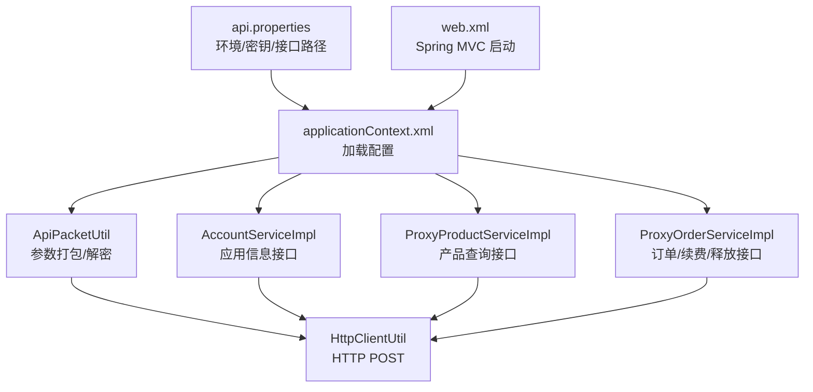
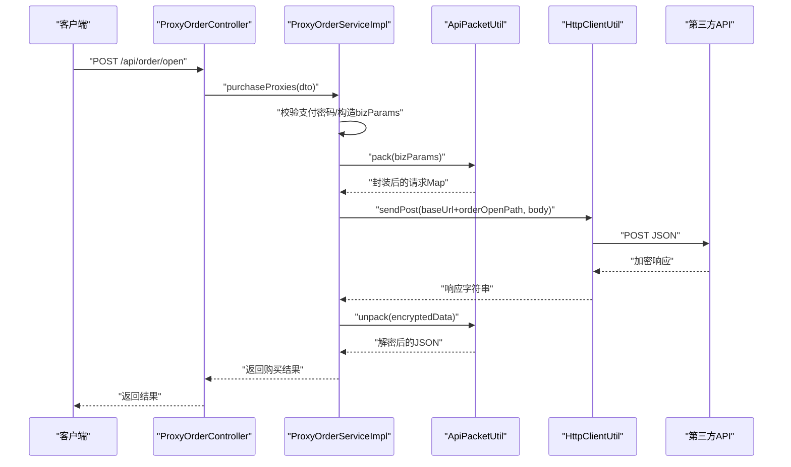
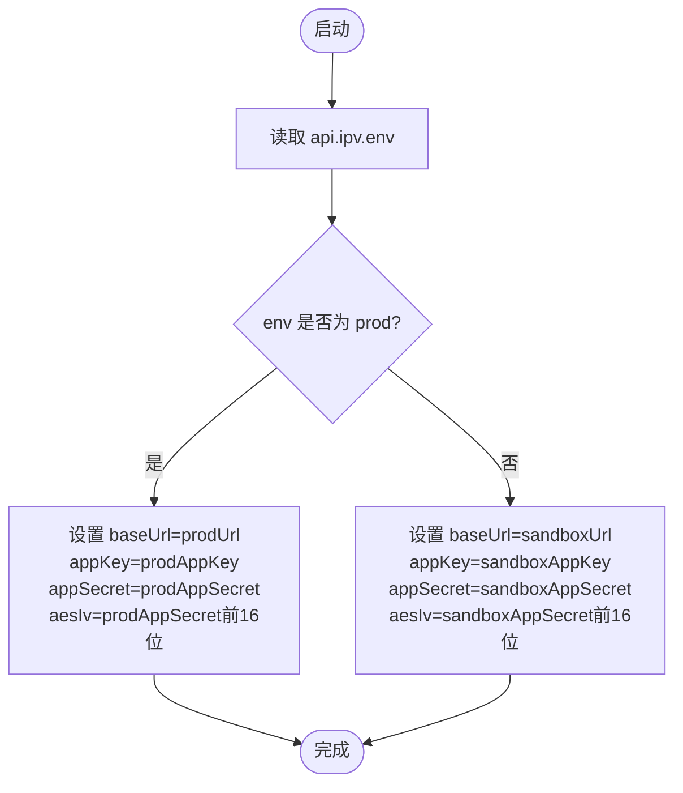
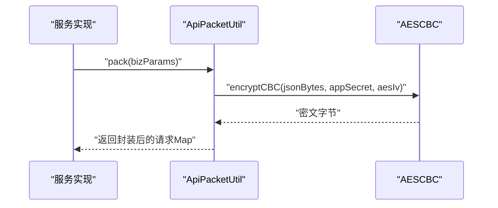
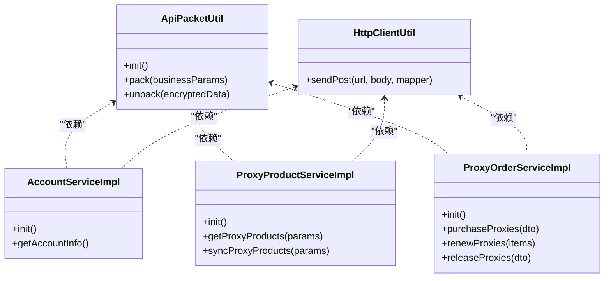
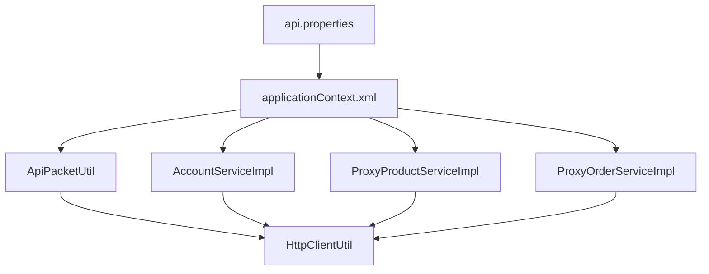

# API 接口配置

<cite>
**本文引用的文件**
- [api.properties](file://src/main/resources/api.properties)
- [applicationContext.xml](file://src/main/resources/applicationContext.xml)
- [ApiPacketUtil.java](file://src/main/java/cn/linkfast/utils/ApiPacketUtil.java)
- [HttpClientUtil.java](file://src/main/java/cn/linkfast/utils/HttpClientUtil.java)
- [AESCBC.java](file://src/main/java/cn/linkfast/utils/AESCBC.java)
- [AccountServiceImpl.java](file://src/main/java/cn/linkfast/service/impl/AccountServiceImpl.java)
- [ProxyProductServiceImpl.java](file://src/main/java/cn/linkfast/service/impl/ProxyProductServiceImpl.java)
- [ProxyOrderServiceImpl.java](file://src/main/java/cn/linkfast/service/impl/ProxyOrderServiceImpl.java)
- [ProxyOrderController.java](file://src/main/java/cn/linkfast/controller/ProxyOrderController.java)
- [web.xml](file://src/main/webapp/WEB-INF/web.xml)
</cite>

## 目录
1. [简介](#简介)
2. [项目结构](#项目结构)
3. [核心组件](#核心组件)
4. [架构总览](#架构总览)
5. [详细组件分析](#详细组件分析)
6. [依赖分析](#依赖分析)
7. [性能考虑](#性能考虑)
8. [故障排查指南](#故障排查指南)
9. [结论](#结论)
10. [附录](#附录)

## 简介
本文件面向 Link-Fast 项目的运维与开发人员，系统化说明 API 接口配置，重点覆盖以下方面：
- api.properties 的配置结构与各配置项作用
- 环境配置（api.ipv.env）在生产（prod）与测试（sandbox）之间的切换机制
- 应用密钥配置（appKey 与 appSecret）的来源、版本管理与安全存储建议
- 各核心 API 接口路径（产品查询、订单创建、实例管理等）的配置与使用
- 环境切换最佳实践、密钥管理安全建议、接口路径维护注意事项
- 配置验证方法与常见配置错误排查

## 项目结构
与 API 配置直接相关的资源与代码分布如下：
- 配置文件：src/main/resources/api.properties（包含环境、密钥、接口路径）
- Spring 上下文：src/main/resources/applicationContext.xml（加载 api.properties）
- 工具类：ApiPacketUtil（参数打包/解密）、HttpClientUtil（HTTP POST）、AESCBC（对称加解密）
- 服务实现：AccountServiceImpl（应用信息）、ProxyProductServiceImpl（产品查询）、ProxyOrderServiceImpl（订单/续费/释放）
- 控制器：ProxyOrderController（对外暴露订单相关接口）
- Web 容器：web.xml（Spring MVC 启动）

图表来源
- [api.properties:1-31](file://src/main/resources/api.properties#L1-L31)
- [applicationContext.xml:14-15](file://src/main/resources/applicationContext.xml#L14-L15)
- [ApiPacketUtil.java:24-52](file://src/main/java/cn/linkfast/utils/ApiPacketUtil.java#L24-L52)
- [HttpClientUtil.java:27-44](file://src/main/java/cn/linkfast/utils/HttpClientUtil.java#L27-L44)
- [AccountServiceImpl.java:25-42](file://src/main/java/cn/linkfast/service/impl/AccountServiceImpl.java#L25-L42)
- [ProxyProductServiceImpl.java:42-54](file://src/main/java/cn/linkfast/service/impl/ProxyProductServiceImpl.java#L42-L54)
- [ProxyOrderServiceImpl.java:46-60](file://src/main/java/cn/linkfast/service/impl/ProxyOrderServiceImpl.java#L46-L60)
- [web.xml:10-35](file://src/main/webapp/WEB-INF/web.xml#L10-L35)

章节来源
- [api.properties:1-31](file://src/main/resources/api.properties#L1-L31)
- [applicationContext.xml:14-15](file://src/main/resources/applicationContext.xml#L14-L15)
- [web.xml:10-35](file://src/main/webapp/WEB-INF/web.xml#L10-L35)

## 核心组件
- 配置加载
  - api.properties 通过 Spring 的 PropertyPlaceholderConfigurer 加载，供其他组件以 ${key} 形式注入使用
- 参数打包与加解密
  - ApiPacketUtil 负责将业务参数序列化、AES-CBC 加密、Base64 编码，并组装公共请求字段（version、encrypt、appKey、reqId）
  - AESCBC 提供底层 AES-CBC 加解密能力
- HTTP 客户端
  - HttpClientUtil 封装 Apache HttpClient 5 的 POST 请求，统一处理状态码与响应
- 服务层
  - AccountServiceImpl：根据 api.ipv.env 选择 prod/sandbox 基础 URL，调用 /api/open/app/info/v2 获取应用信息
  - ProxyProductServiceImpl：根据 api.ipv.env 选择 prod/sandbox 基础 URL，调用 /api/open/app/product/query/v2 查询产品
  - ProxyOrderServiceImpl：根据 api.ipv.env 选择 prod/sandbox 基础 URL，调用 /api/open/app/instance/open/v2 创建订单、/api/open/app/order/v2 查询订单、/api/open/app/instance/renew/v2 续费、/api/open/app/instance/release/v2 释放

章节来源
- [applicationContext.xml:14-15](file://src/main/resources/applicationContext.xml#L14-L15)
- [ApiPacketUtil.java:24-52](file://src/main/java/cn/linkfast/utils/ApiPacketUtil.java#L24-L52)
- [AESCBC.java:20-30](file://src/main/java/cn/linkfast/utils/AESCBC.java#L20-L30)
- [HttpClientUtil.java:27-44](file://src/main/java/cn/linkfast/utils/HttpClientUtil.java#L27-L44)
- [AccountServiceImpl.java:25-42](file://src/main/java/cn/linkfast/service/impl/AccountServiceImpl.java#L25-L42)
- [ProxyProductServiceImpl.java:42-54](file://src/main/java/cn/linkfast/service/impl/ProxyProductServiceImpl.java#L42-L54)
- [ProxyOrderServiceImpl.java:46-60](file://src/main/java/cn/linkfast/service/impl/ProxyOrderServiceImpl.java#L46-L60)

## 架构总览
下图展示了“配置 → 工具 → 服务 → 外部 API”的调用链路，以及环境与密钥如何影响请求行为。

图表来源
- [ProxyOrderController.java:42-45](file://src/main/java/cn/linkfast/controller/ProxyOrderController.java#L42-L45)
- [ProxyOrderServiceImpl.java:338-341](file://src/main/java/cn/linkfast/service/impl/ProxyOrderServiceImpl.java#L338-L341)
- [ApiPacketUtil.java:58-92](file://src/main/java/cn/linkfast/utils/ApiPacketUtil.java#L58-L92)
- [HttpClientUtil.java:27-44](file://src/main/java/cn/linkfast/utils/HttpClientUtil.java#L27-L44)

## 详细组件分析

### 配置文件 api.properties 结构与用途
- 环境与基础 URL
  - api.ipv.env：控制 prod/sandbox 环境切换
  - api.ipv.sandbox_url、api.ipv.prod_url：分别对应沙盒与生产的基础域名
- 应用密钥
  - api.ipv.sandbox.appKey、api.ipv.prod.appKey：沙盒/生产 appKey
  - api.ipv.sandbox.appSecret、api.ipv.prod.appSecret：沙盒/生产 appSecret（作为 AES 密钥与 IV 源）
- 接口路径
  - 产品查询：api.ipv.path.product_query
  - 订单创建：api.ipv.path.order_create
  - 订单查询：api.ipv.path.order_info
  - 实例查询：api.ipv.path.instance_query
  - 城市列表：api.ipv.path.city_list
  - 地域列表：api.ipv.path.area_list
  - 应用信息：api.ipv.path.app_info
  - 实例续费：api.ipv.path.instance_renew
  - 实例释放：api.ipv.path.instance_release

章节来源
- [api.properties:1-31](file://src/main/resources/api.properties#L1-L31)

### 环境配置（api.ipv.env）切换机制
- 生产与测试环境切换
  - 通过 api.ipv.env 设置为 prod 或 sandbox
  - 各服务在 @PostConstruct 中根据 env 选择 prodUrl 或 sandboxUrl 作为 baseUrl
  - ApiPacketUtil 在 init 中根据 env 选择对应的 appKey 与 appSecret，并从 appSecret 截取前 16 位作为 AES IV
- 切换流程示意

图表来源
- [ApiPacketUtil.java:41-52](file://src/main/java/cn/linkfast/utils/ApiPacketUtil.java#L41-L52)
- [AccountServiceImpl.java:35-42](file://src/main/java/cn/linkfast/service/impl/AccountServiceImpl.java#L35-L42)
- [ProxyProductServiceImpl.java:76-84](file://src/main/java/cn/linkfast/service/impl/ProxyProductServiceImpl.java#L76-L84)
- [ProxyOrderServiceImpl.java:79-87](file://src/main/java/cn/linkfast/service/impl/ProxyOrderServiceImpl.java#L79-L87)

章节来源
- [ApiPacketUtil.java:41-52](file://src/main/java/cn/linkfast/utils/ApiPacketUtil.java#L41-L52)
- [AccountServiceImpl.java:35-42](file://src/main/java/cn/linkfast/service/impl/AccountServiceImpl.java#L35-L42)
- [ProxyProductServiceImpl.java:76-84](file://src/main/java/cn/linkfast/service/impl/ProxyProductServiceImpl.java#L76-L84)
- [ProxyOrderServiceImpl.java:79-87](file://src/main/java/cn/linkfast/service/impl/ProxyOrderServiceImpl.java#L79-L87)

### 应用密钥配置（appKey 与 appSecret）
- 来源与作用
  - appKey：请求头中的 appKey，标识调用方身份
  - appSecret：用于 AES-CBC 加密的密钥，同时取其前 16 位作为 IV
- 版本管理与安全存储建议
  - 建议为 prod 与 sandbox 维护独立的密钥对，避免交叉使用
  - 密钥变更需同步更新 api.properties，并进行灰度发布与回归验证
  - 生产密钥建议通过密钥管理系统（如 KMS）或环境变量注入，避免硬编码在仓库中
- 密钥使用流程

图表来源
- [ApiPacketUtil.java:58-92](file://src/main/java/cn/linkfast/utils/ApiPacketUtil.java#L58-L92)
- [AESCBC.java:20-30](file://src/main/java/cn/linkfast/utils/AESCBC.java#L20-L30)

章节来源
- [ApiPacketUtil.java:24-52](file://src/main/java/cn/linkfast/utils/ApiPacketUtil.java#L24-L52)
- [AESCBC.java:20-30](file://src/main/java/cn/linkfast/utils/AESCBC.java#L20-L30)

### 核心 API 接口路径配置与使用
- 产品查询
  - 路径：api.ipv.path.product_query
  - 服务：ProxyProductServiceImpl.getProxyProducts/syncProxyProducts
- 订单创建
  - 路径：api.ipv.path.order_create
  - 服务：ProxyOrderServiceImpl.purchaseProxies
- 订单查询
  - 路径：api.ipv.path.order_info
  - 服务：ProxyOrderServiceImpl.syncOrderDetails
- 实例查询
  - 路径：api.ipv.path.instance_query
  - 服务：AccountServiceImpl.getAccountInfo（示例：应用信息接口，逻辑相同）
- 城市/地域列表
  - 路径：api.ipv.path.city_list、api.ipv.path.area_list
  - 服务：可通过类似模式扩展
- 应用信息
  - 路径：api.ipv.path.app_info
  - 服务：AccountServiceImpl.getAccountInfo
- 实例续费
  - 路径：api.ipv.path.instance_renew
  - 服务：ProxyOrderServiceImpl.renewProxies
- 实例释放
  - 路径：api.ipv.path.instance_release
  - 服务：ProxyOrderServiceImpl.releaseProxies

章节来源
- [api.properties:14-31](file://src/main/resources/api.properties#L14-L31)
- [ProxyProductServiceImpl.java:41-54](file://src/main/java/cn/linkfast/service/impl/ProxyProductServiceImpl.java#L41-L54)
- [ProxyOrderServiceImpl.java:46-60](file://src/main/java/cn/linkfast/service/impl/ProxyOrderServiceImpl.java#L46-L60)
- [AccountServiceImpl.java:31-32](file://src/main/java/cn/linkfast/service/impl/AccountServiceImpl.java#L31-L32)

### 类关系与依赖（代码级）

图表来源
- [ApiPacketUtil.java:20-52](file://src/main/java/cn/linkfast/utils/ApiPacketUtil.java#L20-L52)
- [HttpClientUtil.java:19-44](file://src/main/java/cn/linkfast/utils/HttpClientUtil.java#L19-L44)
- [AccountServiceImpl.java:21-42](file://src/main/java/cn/linkfast/service/impl/AccountServiceImpl.java#L21-L42)
- [ProxyProductServiceImpl.java:30-84](file://src/main/java/cn/linkfast/service/impl/ProxyProductServiceImpl.java#L30-L84)
- [ProxyOrderServiceImpl.java:34-87](file://src/main/java/cn/linkfast/service/impl/ProxyOrderServiceImpl.java#L34-L87)

## 依赖分析
- 配置加载依赖
  - applicationContext.xml 通过 PropertyPlaceholderConfigurer 加载 api.properties
- 组件依赖
  - ApiPacketUtil 依赖 Spring 注入的 env 与密钥配置
  - 服务实现依赖 ApiPacketUtil 进行参数打包与响应解密
  - 服务实现依赖 HttpClientUtil 发起 HTTP 请求
- 环境与密钥耦合点
  - 所有服务在初始化阶段根据 env 选择 baseUrl 与密钥
  - ApiPacketUtil 在初始化时计算 aesIv，确保加解密一致性

图表来源
- [applicationContext.xml:14-15](file://src/main/resources/applicationContext.xml#L14-L15)
- [ApiPacketUtil.java:24-52](file://src/main/java/cn/linkfast/utils/ApiPacketUtil.java#L24-L52)
- [HttpClientUtil.java:27-44](file://src/main/java/cn/linkfast/utils/HttpClientUtil.java#L27-L44)
- [AccountServiceImpl.java:25-42](file://src/main/java/cn/linkfast/service/impl/AccountServiceImpl.java#L25-L42)
- [ProxyProductServiceImpl.java:42-54](file://src/main/java/cn/linkfast/service/impl/ProxyProductServiceImpl.java#L42-L54)
- [ProxyOrderServiceImpl.java:46-60](file://src/main/java/cn/linkfast/service/impl/ProxyOrderServiceImpl.java#L46-L60)

章节来源
- [applicationContext.xml:14-15](file://src/main/resources/applicationContext.xml#L14-L15)
- [ApiPacketUtil.java:24-52](file://src/main/java/cn/linkfast/utils/ApiPacketUtil.java#L24-L52)
- [HttpClientUtil.java:27-44](file://src/main/java/cn/linkfast/utils/HttpClientUtil.java#L27-L44)
- [AccountServiceImpl.java:25-42](file://src/main/java/cn/linkfast/service/impl/AccountServiceImpl.java#L25-L42)
- [ProxyProductServiceImpl.java:42-54](file://src/main/java/cn/linkfast/service/impl/ProxyProductServiceImpl.java#L42-L54)
- [ProxyOrderServiceImpl.java:46-60](file://src/main/java/cn/linkfast/service/impl/ProxyOrderServiceImpl.java#L46-L60)

## 性能考虑
- 环境选择与密钥加载
  - 环境切换仅发生在初始化阶段，运行期无额外分支判断
- 加解密开销
  - AES-CBC 为轻量对称加密，单次请求开销可控
- HTTP 请求
  - HttpClientUtil 统一处理状态码与响应，避免重复解析
- 建议
  - 对高频接口可考虑连接池复用与超时合理设置
  - 对大响应体注意内存占用与流式处理

## 故障排查指南
- 常见配置错误
  - 环境未正确切换
    - 现象：请求发往错误域名或使用错误密钥
    - 排查：检查 api.ipv.env、api.ipv.sandbox_url、api.ipv.prod_url 是否一致
  - 密钥长度不足
    - 现象：无法生成有效的 AES IV
    - 排查：确认 appSecret 长度至少 16 字节
  - 接口路径错误
    - 现象：HTTP 404 或 500
    - 排查：核对 api.ipv.path.* 与实际第三方接口是否一致
- 配置验证方法
  - 环境验证：调用应用信息接口（/api/open/app/info/v2）确认 baseUrl 正确
  - 密钥验证：尝试调用任一受保护接口，观察是否返回业务错误而非网络错误
  - 路径验证：使用 curl 或 Postman 直连 baseUrl + path，确认接口可达
- 代码级定位
  - 环境与 URL：AccountServiceImpl、ProxyProductServiceImpl、ProxyOrderServiceImpl 的 @PostConstruct
  - 密钥与 IV：ApiPacketUtil.init
  - 请求封装：ApiPacketUtil.pack
  - 响应解密：ApiPacketUtil.unpack

章节来源
- [ApiPacketUtil.java:41-52](file://src/main/java/cn/linkfast/utils/ApiPacketUtil.java#L41-L52)
- [AccountServiceImpl.java:35-42](file://src/main/java/cn/linkfast/service/impl/AccountServiceImpl.java#L35-L42)
- [ProxyProductServiceImpl.java:76-84](file://src/main/java/cn/linkfast/service/impl/ProxyProductServiceImpl.java#L76-L84)
- [ProxyOrderServiceImpl.java:79-87](file://src/main/java/cn/linkfast/service/impl/ProxyOrderServiceImpl.java#L79-L87)

## 结论
- api.properties 是 Link-Fast 与第三方 API 交互的唯一可信配置源
- 通过 api.ipv.env 实现环境与密钥的集中管理，配合 ApiPacketUtil 的参数打包与解密，形成清晰的调用链
- 建议在生产环境中采用密钥管理系统与严格的变更流程，确保密钥安全与可追溯
- 接口路径维护需与第三方文档保持一致，并通过自动化测试与监控保障稳定性

## 附录
- 环境切换最佳实践
  - 在 CI/CD 中通过环境变量覆盖 api.ipv.env，避免直接修改仓库中的 api.properties
  - 对 prod 与 sandbox 的密钥与 URL 分离部署，禁止交叉使用
- 密钥管理安全建议
  - 生产密钥不入库，通过 KMS 或 Vault 注入
  - 定期轮换密钥，旧密钥保留过渡期，新旧并行验证后再下线
- 接口路径维护注意事项
  - 新增或变更路径需同步更新 api.properties 与服务实现中的常量引用
  - 引入接口契约文档与自动化校验，防止路径漂移