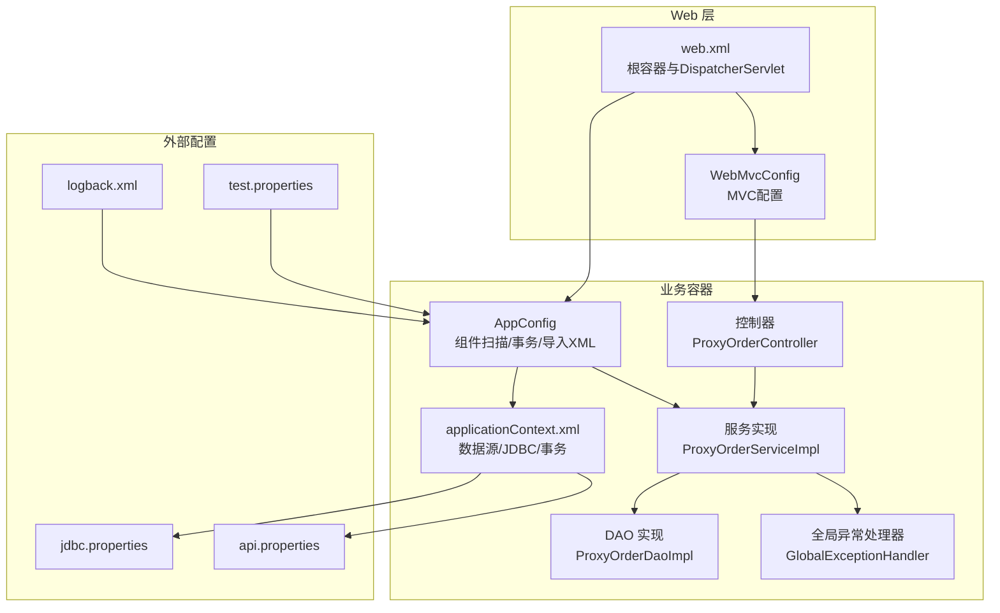
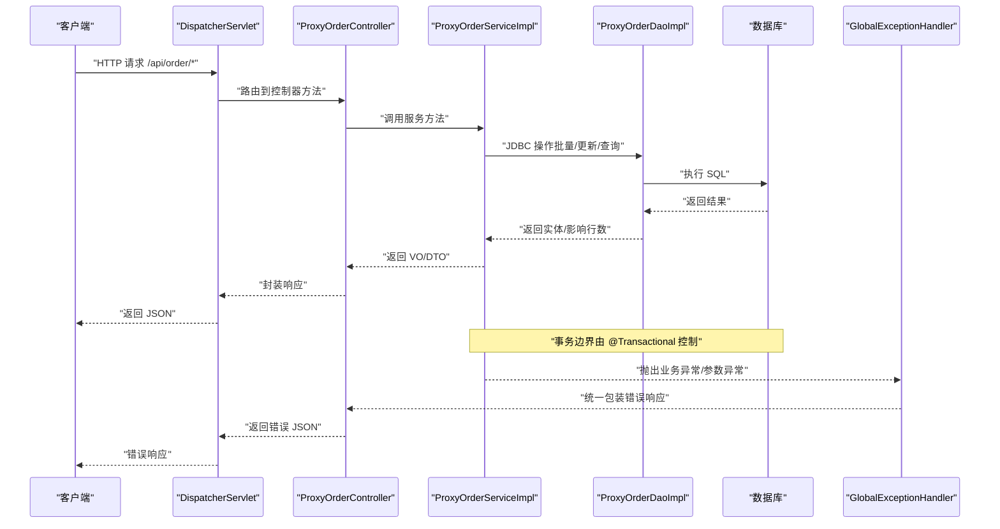
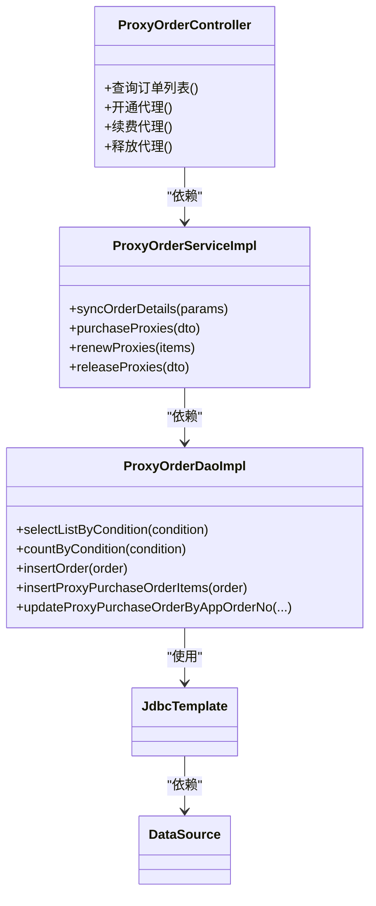
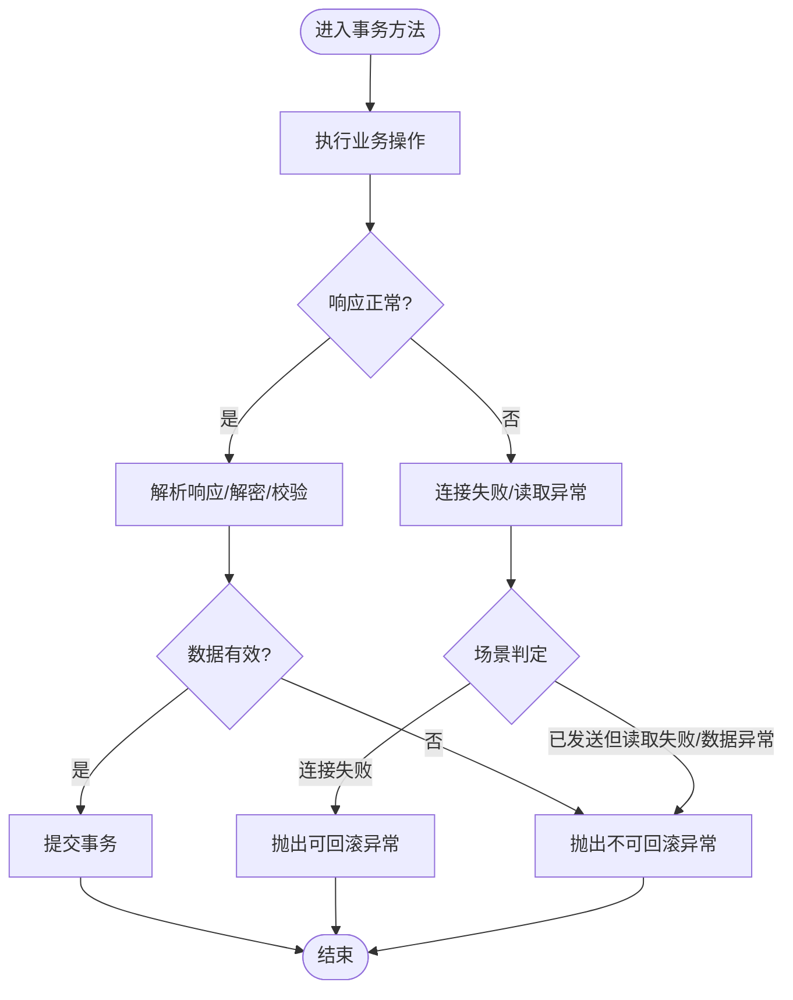
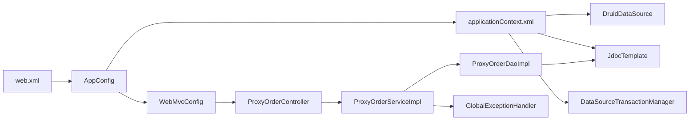

# Spring 应用配置

<cite>
**本文引用的文件**
- [applicationContext.xml](file://src/main/resources/applicationContext.xml)
- [jdbc.properties](file://src/main/resources/jdbc.properties)
- [api.properties](file://src/main/resources/api.properties)
- [AppConfig.java](file://src/main/java/cn/linkfast/config/AppConfig.java)
- [WebMvcConfig.java](file://src/main/java/cn/linkfast/config/WebMvcConfig.java)
- [web.xml](file://src/main/webapp/WEB-INF/web.xml)
- [ProxyOrderServiceImpl.java](file://src/main/java/cn/linkfast/service/impl/ProxyOrderServiceImpl.java)
- [ProxyOrderDaoImpl.java](file://src/main/java/cn/linkfast/dao/impl/ProxyOrderDaoImpl.java)
- [ProxyOrderController.java](file://src/main/java/cn/linkfast/controller/ProxyOrderController.java)
- [GlobalExceptionHandler.java](file://src/main/java/cn/linkfast/exception/GlobalExceptionHandler.java)
- [SnowflakeConfig.java](file://src/main/java/cn/linkfast/config/SnowflakeConfig.java)
- [AppOrderNoGenerator.java](file://src/main/java/cn/linkfast/utils/AppOrderNoGenerator.java)
- [logback.xml](file://src/main/resources/logback.xml)
- [test.properties](file://src/test/resources/test.properties)
</cite>

## 目录
1. [简介](#简介)
2. [项目结构](#项目结构)
3. [核心组件](#核心组件)
4. [架构总览](#架构总览)
5. [详细组件分析](#详细组件分析)
6. [依赖关系分析](#依赖关系分析)
7. [性能考量](#性能考量)
8. [故障排查指南](#故障排查指南)
9. [结论](#结论)
10. [附录](#附录)

## 简介
本文件面向 Link-Fast 项目的 Spring 应用配置，系统性梳理 applicationContext.xml 的容器与 Bean 配置、数据源与事务管理、Spring MVC 配置、异常处理、全局配置与最佳实践。文档以“从 XML 到 Java 配置”的演进视角，结合实际代码路径，帮助读者快速理解并维护该应用的 Spring 配置体系。

## 项目结构
- 配置文件组织
  - applicationContext.xml：Spring 容器与数据源、JDBC、事务管理的 XML 配置入口
  - jdbc.properties：数据库连接参数
  - api.properties：第三方接口环境与路径配置
  - logback.xml：日志配置
  - test.properties：测试环境开关（如禁用定时任务）
- Java 配置
  - AppConfig：启用事务与组件扫描，导入 XML 配置
  - WebMvcConfig：替代 spring-mvc.xml 的注解式 MVC 配置
  - SnowflakeConfig：分布式 ID 生成器配置
  - SchedulingConfig：定时任务开关
- 运行时入口
  - web.xml：声明 AnnotationConfigWebApplicationContext，分别加载根容器与 DispatcherServlet 的上下文

图表来源
- [web.xml:10-35](file://src/main/webapp/WEB-INF/web.xml#L10-L35)
- [AppConfig.java:14-25](file://src/main/java/cn/linkfast/config/AppConfig.java#L14-L25)
- [applicationContext.xml:14-67](file://src/main/resources/applicationContext.xml#L14-L67)
- [ProxyOrderDaoImpl.java:25-32](file://src/main/java/cn/linkfast/dao/impl/ProxyOrderDaoImpl.java#L25-L32)
- [ProxyOrderServiceImpl.java:34-46](file://src/main/java/cn/linkfast/service/impl/ProxyOrderServiceImpl.java#L34-L46)
- [ProxyOrderController.java:20-27](file://src/main/java/cn/linkfast/controller/ProxyOrderController.java#L20-L27)
- [GlobalExceptionHandler.java:20-23](file://src/main/java/cn/linkfast/exception/GlobalExceptionHandler.java#L20-L23)

章节来源
- [web.xml:10-35](file://src/main/webapp/WEB-INF/web.xml#L10-L35)
- [AppConfig.java:14-25](file://src/main/java/cn/linkfast/config/AppConfig.java#L14-L25)
- [applicationContext.xml:14-67](file://src/main/resources/applicationContext.xml#L14-L67)

## 核心组件
- 根容器（AppConfig）
  - 启用事务管理与组件扫描，排除 Controller，交由 WebMvcConfig 扫描
  - 导入 XML 配置，统一管理数据源、JDBC、事务
- Web 容器（WebMvcConfig）
  - 替代传统 spring-mvc.xml，启用注解驱动、组件扫描、消息转换器、跨域与默认 Servlet 处理
- 数据源与事务（applicationContext.xml）
  - Druid 数据源、JdbcTemplate、DataSourceTransactionManager
  - 启用注解驱动事务
- 异常处理（GlobalExceptionHandler）
  - 统一处理业务异常、参数异常、空指针、参数校验异常与通用异常
- 日志（logback.xml）
  - 分类输出业务日志与服务器日志，支持控制台与滚动文件

章节来源
- [AppConfig.java:14-36](file://src/main/java/cn/linkfast/config/AppConfig.java#L14-L36)
- [WebMvcConfig.java:19-62](file://src/main/java/cn/linkfast/config/WebMvcConfig.java#L19-L62)
- [applicationContext.xml:14-67](file://src/main/resources/applicationContext.xml#L14-L67)
- [GlobalExceptionHandler.java:17-90](file://src/main/java/cn/linkfast/exception/GlobalExceptionHandler.java#L17-L90)
- [logback.xml:1-49](file://src/main/resources/logback.xml#L1-49)

## 架构总览
下图展示了从浏览器请求到数据库写入的关键流程，以及异常处理与日志输出位置：

图表来源
- [web.xml:23-40](file://src/main/webapp/WEB-INF/web.xml#L23-L40)
- [ProxyOrderController.java:20-88](file://src/main/java/cn/linkfast/controller/ProxyOrderController.java#L20-L88)
- [ProxyOrderServiceImpl.java:89-136](file://src/main/java/cn/linkfast/service/impl/ProxyOrderServiceImpl.java#L89-L136)
- [ProxyOrderDaoImpl.java:33-76](file://src/main/java/cn/linkfast/dao/impl/ProxyOrderDaoImpl.java#L33-L76)
- [GlobalExceptionHandler.java:20-90](file://src/main/java/cn/linkfast/exception/GlobalExceptionHandler.java#L20-L90)

## 详细组件分析

### 数据源与连接池配置（applicationContext.xml）
- 属性加载
  - 通过 property-placeholder 加载 jdbc.properties、api.properties 与 test.properties，UTF-8 编码，忽略缺失资源
- Druid 数据源
  - 驱动、URL、用户名、密码来自属性文件
  - 连接池核心参数：初始大小、最小空闲、最大活跃、最大等待
  - 连接保活与健康检查：keepAlive、validationQuery、testWhileIdle
  - 空闲连接回收：timeBetweenEvictionRunsMillis、minEvictableIdleTimeMillis
  - 泄漏检测：removeAbandoned、removeAbandonedTimeout、logAbandoned
  - 容错：breakAfterAcquireFailure、maxWaitThreadCount
- JdbcTemplate
  - 注入 dataSource，供 DAO 使用
- 事务管理器
  - DataSourceTransactionManager，绑定 dataSource
- 事务注解驱动
  - 启用 @Transactional

章节来源
- [applicationContext.xml:14-67](file://src/main/resources/applicationContext.xml#L14-L67)
- [jdbc.properties:1-34](file://src/main/resources/jdbc.properties#L1-L34)
- [api.properties:1-31](file://src/main/resources/api.properties#L1-L31)

### Spring MVC 配置（WebMvcConfig）
- 注解式配置
  - @EnableWebMvc 对应 <mvc:annotation-driven/>
  - @ComponentScan 扫描控制器包
- 消息转换器
  - 注入 ObjectMapper，设置日期格式与未知属性忽略
- 跨域配置
  - 全局 CORS：/api/**、允许方法、头、凭据、缓存时间
- 默认 Servlet 处理
  - 允许静态资源转发至容器默认 Servlet

章节来源
- [WebMvcConfig.java:19-62](file://src/main/java/cn/linkfast/config/WebMvcConfig.java#L19-L62)

### 根容器与组件扫描（AppConfig）
- 事务与扫描
  - @EnableTransactionManagement、@ComponentScan，排除 Controller 与 WebMvcConfig
- 导入 XML
  - @ImportResource("classpath:applicationContext.xml")
- ObjectMapper
  - 在根容器暴露 ObjectMapper，便于 Service 与测试环境注入

章节来源
- [AppConfig.java:14-36](file://src/main/java/cn/linkfast/config/AppConfig.java#L14-L36)

### 控制器、服务与数据访问层
- 控制器（ProxyOrderController）
  - REST 控制器，请求路径 /api/order，方法内调用服务层
- 服务层（ProxyOrderServiceImpl）
  - 事务方法：syncOrderDetails、purchaseProxies、renewProxies、releaseProxies
  - rollbackFor 与 noRollbackFor 策略：区分可回滚与不可回滚异常
  - 与第三方接口交互，包含重试与异常分支处理
- 数据访问层（ProxyOrderDaoImpl）
  - 使用 JdbcTemplate 执行批量更新、插入与查询
  - JSON 字段序列化/反序列化辅助方法

图表来源
- [ProxyOrderController.java:20-88](file://src/main/java/cn/linkfast/controller/ProxyOrderController.java#L20-L88)
- [ProxyOrderServiceImpl.java:34-46](file://src/main/java/cn/linkfast/service/impl/ProxyOrderServiceImpl.java#L34-L46)
- [ProxyOrderDaoImpl.java:25-32](file://src/main/java/cn/linkfast/dao/impl/ProxyOrderDaoImpl.java#L25-L32)
- [applicationContext.xml:54-57](file://src/main/resources/applicationContext.xml#L54-L57)

章节来源
- [ProxyOrderController.java:20-88](file://src/main/java/cn/linkfast/controller/ProxyOrderController.java#L20-L88)
- [ProxyOrderServiceImpl.java:89-136](file://src/main/java/cn/linkfast/service/impl/ProxyOrderServiceImpl.java#L89-L136)
- [ProxyOrderDaoImpl.java:33-76](file://src/main/java/cn/linkfast/dao/impl/ProxyOrderDaoImpl.java#L33-L76)

### 事务管理与异常处理
- 事务传播与隔离
  - 采用 Spring 默认传播行为；隔离级别未显式指定，使用底层驱动默认
- 事务边界
  - @Transactional(rollbackFor = Exception.class) 包裹核心业务
  - noRollbackFor = NoRollbackBusinessException：当第三方已落库时，避免本地回滚
- 异常处理
  - GlobalExceptionHandler 统一封装业务异常、参数异常、空指针、参数校验异常与通用异常
- 服务层异常策略
  - 对连接失败、响应读取失败、响应为空、JSON 非法、data 缺失/为空、解密失败等场景进行分类
  - 对“可能已落库”场景抛出 NoRollbackBusinessException，避免重复操作

图表来源
- [ProxyOrderServiceImpl.java:196-237](file://src/main/java/cn/linkfast/service/impl/ProxyOrderServiceImpl.java#L196-L237)
- [ProxyOrderServiceImpl.java:343-451](file://src/main/java/cn/linkfast/service/impl/ProxyOrderServiceImpl.java#L343-L451)
- [GlobalExceptionHandler.java:20-90](file://src/main/java/cn/linkfast/exception/GlobalExceptionHandler.java#L20-L90)

章节来源
- [ProxyOrderServiceImpl.java:196-237](file://src/main/java/cn/linkfast/service/impl/ProxyOrderServiceImpl.java#L196-L237)
- [ProxyOrderServiceImpl.java:343-451](file://src/main/java/cn/linkfast/service/impl/ProxyOrderServiceImpl.java#L343-L451)
- [GlobalExceptionHandler.java:20-90](file://src/main/java/cn/linkfast/exception/GlobalExceptionHandler.java#L20-L90)

### 分布式 ID 与订单号生成
- SnowflakeConfig
  - 基于本机 IP 计算 workerId，数据中心 ID 固定
- AppOrderNoGenerator
  - 业务前缀区分购买/续费/释放，基于 Snowflake 生成唯一字符串

章节来源
- [SnowflakeConfig.java:16-49](file://src/main/java/cn/linkfast/config/SnowflakeConfig.java#L16-L49)
- [AppOrderNoGenerator.java:14-45](file://src/main/java/cn/linkfast/utils/AppOrderNoGenerator.java#L14-L45)

## 依赖关系分析
- 容器层次
  - web.xml 指定 AnnotationConfigWebApplicationContext，分别加载根容器（AppConfig）与 Web 容器（WebMvcConfig）
  - 根容器导入 applicationContext.xml，提供数据源、JDBC、事务
- 组件耦合
  - 控制器依赖服务；服务依赖 DAO；DAO 依赖 JdbcTemplate；JdbcTemplate 依赖 DataSource
  - 全局异常处理器对控制器开放，统一处理异常

图表来源
- [web.xml:10-35](file://src/main/webapp/WEB-INF/web.xml#L10-L35)
- [AppConfig.java:24](file://src/main/java/cn/linkfast/config/AppConfig.java#L24)
- [applicationContext.xml:17-62](file://src/main/resources/applicationContext.xml#L17-L62)
- [ProxyOrderController.java:20-27](file://src/main/java/cn/linkfast/controller/ProxyOrderController.java#L20-L27)
- [ProxyOrderServiceImpl.java:34-46](file://src/main/java/cn/linkfast/service/impl/ProxyOrderServiceImpl.java#L34-L46)
- [ProxyOrderDaoImpl.java:25-32](file://src/main/java/cn/linkfast/dao/impl/ProxyOrderDaoImpl.java#L25-L32)
- [GlobalExceptionHandler.java:20-23](file://src/main/java/cn/linkfast/exception/GlobalExceptionHandler.java#L20-L23)

章节来源
- [web.xml:10-35](file://src/main/webapp/WEB-INF/web.xml#L10-L35)
- [AppConfig.java:24](file://src/main/java/cn/linkfast/config/AppConfig.java#L24)
- [applicationContext.xml:17-62](file://src/main/resources/applicationContext.xml#L17-L62)

## 性能考量
- 连接池与健康检查
  - 空闲检测与回收策略平衡可用性与资源占用
  - 轻量检测 SQL 与超时控制降低无效 RTT
- 批量操作
  - DAO 层广泛使用批量更新与插入，减少往返次数
- 事务边界
  - 将网络调用与数据库操作置于同一事务，配合 noRollbackFor 策略避免重复操作
- 日志分级
  - 业务日志与服务器日志分离，避免 IO 抖动

章节来源
- [applicationContext.xml:23-52](file://src/main/resources/applicationContext.xml#L23-L52)
- [ProxyOrderDaoImpl.java:58-76](file://src/main/java/cn/linkfast/dao/impl/ProxyOrderDaoImpl.java#L58-L76)
- [logback.xml:6-48](file://src/main/resources/logback.xml#L6-L48)

## 故障排查指南
- 数据库连接问题
  - 检查 jdbc.properties 是否正确加载，URL/驱动/凭据是否匹配
  - 观察 Druid 连接池指标与泄漏日志
- 事务回滚异常
  - 确认 @Transactional 的 rollbackFor/noRollbackFor 设置是否符合预期
  - 对“可能已落库”场景，确保抛出 NoRollbackBusinessException
- 第三方接口异常
  - 关注连接失败、读取异常、响应为空、JSON 非法、data 缺失/为空、解密失败等分支
- 参数校验与全局异常
  - 统一由 GlobalExceptionHandler 返回标准错误格式，便于前端处理
- 日志定位
  - 业务日志输出到 linkfast-business.log，服务器日志输出到 linkfast-server.log

章节来源
- [jdbc.properties:1-34](file://src/main/resources/jdbc.properties#L1-L34)
- [applicationContext.xml:44-51](file://src/main/resources/applicationContext.xml#L44-L51)
- [ProxyOrderServiceImpl.java:343-451](file://src/main/java/cn/linkfast/service/impl/ProxyOrderServiceImpl.java#L343-L451)
- [GlobalExceptionHandler.java:20-90](file://src/main/java/cn/linkfast/exception/GlobalExceptionHandler.java#L20-L90)
- [logback.xml:6-48](file://src/main/resources/logback.xml#L6-L48)

## 结论
本项目采用“XML + Java 配置”的混合方式：applicationContext.xml 负责数据源、JDBC 与事务，AppConfig 负责业务层与导入 XML，WebMvcConfig 替代传统 XML MVC 配置。通过明确的事务边界、异常处理策略与日志分级，系统在复杂第三方接口交互场景下具备良好的稳定性与可观测性。建议在后续演进中逐步减少 XML，统一迁移到 Java 配置，提升可维护性。

## 附录

### 配置文件加载顺序与环境特定配置
- 加载顺序
  - web.xml 指定根容器与 DispatcherServlet 的上下文类与位置
  - 根容器加载 AppConfig，再导入 applicationContext.xml
  - Web 容器加载 WebMvcConfig
- 环境特定配置
  - jdbc.properties：数据库连接参数
  - api.properties：第三方接口环境与路径
  - test.properties：测试环境开关（如禁用定时任务）

章节来源
- [web.xml:10-35](file://src/main/webapp/WEB-INF/web.xml#L10-L35)
- [AppConfig.java:24](file://src/main/java/cn/linkfast/config/AppConfig.java#L24)
- [applicationContext.xml:14-15](file://src/main/resources/applicationContext.xml#L14-L15)
- [jdbc.properties:1-34](file://src/main/resources/jdbc.properties#L1-L34)
- [api.properties:1-31](file://src/main/resources/api.properties#L1-L31)
- [test.properties:1-3](file://src/test/resources/test.properties#L1-L3)