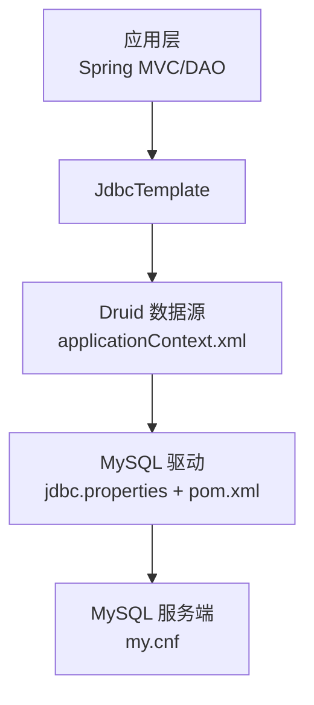
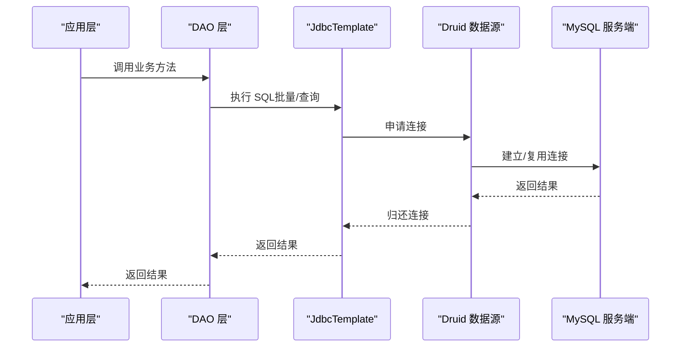
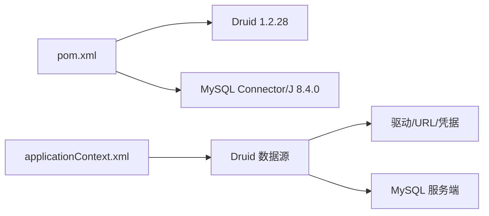

# 数据库连接配置

<cite>
**本文引用的文件**
- [jdbc.properties](file://src/main/resources/jdbc.properties)
- [applicationContext.xml](file://src/main/resources/applicationContext.xml)
- [my.cnf](file://docs/database/my.cnf)
- [ProxyInstanceDaoImpl.java](file://src/main/java/cn/linkfast/dao/impl/ProxyInstanceDaoImpl.java)
- [pom.xml](file://pom.xml)
</cite>

## 目录
1. [简介](#简介)
2. [项目结构](#项目结构)
3. [核心组件](#核心组件)
4. [架构总览](#架构总览)
5. [详细组件分析](#详细组件分析)
6. [依赖分析](#依赖分析)
7. [性能考量](#性能考量)
8. [故障排查指南](#故障排查指南)
9. [结论](#结论)
10. [附录](#附录)

## 简介
本文件面向 Link-Fast 项目的数据库连接配置，系统性说明 jdbc.properties 中的数据库连接参数、驱动与连接 URL 设置、连接属性、连接池配置项、认证配置、不同环境的最佳实践、连接池监控与性能调优、连接泄漏预防以及故障排查与优化建议。内容基于仓库中的实际配置文件与代码实现，确保可落地、可验证。

## 项目结构
与数据库连接配置直接相关的文件与位置如下：
- 连接参数与驱动配置：src/main/resources/jdbc.properties
- Spring 数据源与连接池配置：src/main/resources/applicationContext.xml
- MySQL 服务端配置（与连接超时、连接数等强相关）：docs/database/my.cnf
- DAO 层使用 JdbcTemplate 的示例：src/main/java/cn/linkfast/dao/impl/ProxyInstanceDaoImpl.java
- 依赖声明（Druid、MySQL Connector/J）：pom.xml

图表来源
- [applicationContext.xml:17-52](file://src/main/resources/applicationContext.xml#L17-L52)
- [jdbc.properties:1-34](file://src/main/resources/jdbc.properties#L1-L34)
- [my.cnf:27-68](file://docs/database/my.cnf#L27-L68)
- [pom.xml:99-111](file://pom.xml#L99-L111)

章节来源
- [jdbc.properties:1-34](file://src/main/resources/jdbc.properties#L1-L34)
- [applicationContext.xml:17-52](file://src/main/resources/applicationContext.xml#L17-L52)
- [my.cnf:27-68](file://docs/database/my.cnf#L27-L68)
- [pom.xml:99-111](file://pom.xml#L99-L111)

## 核心组件
- 数据库驱动与连接 URL
  - 驱动类名：由 jdbc.properties 提供，指向 MySQL Connector/J 的 JDBC 驱动实现。
  - 连接 URL：包含主机、端口、数据库名、字符集、时区、SSL、批处理、多语句、预编译缓存、超时等参数。
- Spring 数据源与连接池
  - 使用 Druid 连接池，通过 applicationContext.xml 完成初始化与参数配置。
  - 关键池参数：初始连接数、最小空闲、最大活跃、最大等待时间、空闲回收周期、保活策略、校验策略、异常处理等。
- 认证配置
  - 用户名与密码来自 jdbc.properties，用于连接数据库。
- DAO 层使用
  - DAO 层通过 JdbcTemplate 获取连接，执行批量更新、查询与计数等操作。

章节来源
- [jdbc.properties:1-34](file://src/main/resources/jdbc.properties#L1-L34)
- [applicationContext.xml:17-52](file://src/main/resources/applicationContext.xml#L17-L52)
- [ProxyInstanceDaoImpl.java:29-89](file://src/main/java/cn/linkfast/dao/impl/ProxyInstanceDaoImpl.java#L29-L89)

## 架构总览
下图展示从应用到数据库的连接链路，以及连接池与服务端参数的协同关系。

图表来源
- [applicationContext.xml:55-57](file://src/main/resources/applicationContext.xml#L55-L57)
- [ProxyInstanceDaoImpl.java:33-89](file://src/main/java/cn/linkfast/dao/impl/ProxyInstanceDaoImpl.java#L33-L89)
- [my.cnf:33-48](file://docs/database/my.cnf#L33-L48)

## 详细组件分析

### JDBC 参数与驱动配置
- 驱动类名
  - 由 jdbc.properties 指定，对应 MySQL Connector/J 的驱动实现。
- 连接 URL 关键参数
  - 字符集与时区：确保数据正确编码与时区一致。
  - SSL：关闭以简化部署，适用于受控网络环境。
  - 批处理与多语句：开启批处理与多语句支持，有利于批量写入与复杂查询。
  - 预编译缓存：开启预编译语句缓存，降低解析开销。
  - 公钥检索：允许公钥检索，便于某些认证场景。
  - 超时设置：连接超时与套接字超时，保障长事务与网络波动下的稳定性。
  - 自动重连：开启自动重连，增强网络抖动下的可用性。
- 认证参数
  - 用户名与密码在 jdbc.properties 中配置，用于连接数据库。

章节来源
- [jdbc.properties:1-34](file://src/main/resources/jdbc.properties#L1-L34)

### 连接池配置（Druid）
- 连接池核心参数
  - 初始连接数与最小空闲：保证启动后有足够连接可用。
  - 最大活跃连接数：限制并发连接上限，避免资源争抢。
  - 最大等待时间：控制获取连接的最长等待时间，防止线程长时间阻塞。
- 连接保活与校验
  - 保活开关与间隔：维持连接活性，减少被服务端回收。
  - 空闲检测：仅在空闲时检测，避免频繁 RTT。
  - 校验 SQL 与超时：使用轻量 SQL 进行健康检查，并限制超时。
- 空闲连接回收
  - 回收周期与最小存活时间：与服务端 wait_timeout 协同，避免连接被服务端回收。
- 异常与容错
  - 泄漏检测与移除：开启废弃连接检测与移除，记录日志便于定位问题。
  - 获取失败容错：不中断后续请求，提高稳定性。
  - 最大等待线程数：限制排队等待连接的线程数量，避免雪崩效应。

章节来源
- [applicationContext.xml:23-51](file://src/main/resources/applicationContext.xml#L23-L51)

### MySQL 服务端参数（my.cnf）
- 连接超时与空闲回收
  - wait_timeout 与 interactive_timeout：非交互式连接空闲超时较长，避免连接池连接被服务端回收。
  - connect_timeout、net_read_timeout、net_write_timeout：分别控制连接建立、读取与写入超时，适配批量场景。
- 连接数限制
  - max_connections 与 max_user_connections：为连接池预留足够连接，避免“连接池拿不到连接”的问题。
- 批量插入优化
  - max_allowed_packet：增大包大小，满足大批量数据传输。
  - InnoDB 缓冲池与日志参数：提升批量写入性能，权衡 ACID 与吞吐。

章节来源
- [my.cnf:33-68](file://docs/database/my.cnf#L33-L68)

### DAO 层使用示例
- 批量更新：使用 JdbcTemplate.batchUpdate 执行批量写入，适合大量实例状态更新。
- 查询与计数：使用 JdbcTemplate.query 与 queryForObject 执行查询与统计，记录耗时便于性能分析。
- 连接生命周期：DAO 不直接管理连接，由 Spring 管理，避免连接泄漏风险。

章节来源
- [ProxyInstanceDaoImpl.java:33-89](file://src/main/java/cn/linkfast/dao/impl/ProxyInstanceDaoImpl.java#L33-L89)

### 依赖与版本
- Druid 连接池：1.2.28 版本。
- MySQL Connector/J：8.4.0 版本。
- Spring JDBC 与事务：通过 ApplicationContext 配置 DataSourceTransactionManager 与注解驱动。

章节来源
- [pom.xml:99-111](file://pom.xml#L99-L111)
- [applicationContext.xml:55-65](file://src/main/resources/applicationContext.xml#L55-L65)

## 依赖分析
- 应用层依赖 Spring JDBC 与事务模块，通过 JdbcTemplate 与 DataSourceTransactionManager 管理连接与事务。
- 连接池依赖 Druid，通过 applicationContext.xml 注入驱动、URL、用户名、密码与池参数。
- 服务端依赖 MySQL，my.cnf 中的超时与连接数参数直接影响连接池稳定性与性能。

图表来源
- [pom.xml:99-111](file://pom.xml#L99-L111)
- [applicationContext.xml:17-52](file://src/main/resources/applicationContext.xml#L17-L52)
- [my.cnf:33-48](file://docs/database/my.cnf#L33-L48)

章节来源
- [pom.xml:99-111](file://pom.xml#L99-L111)
- [applicationContext.xml:17-52](file://src/main/resources/applicationContext.xml#L17-L52)
- [my.cnf:33-48](file://docs/database/my.cnf#L33-L48)

## 性能考量
- 连接池参数调优
  - 初始连接与最小空闲：根据启动后并发峰值设置，避免冷启动抖动。
  - 最大活跃连接：结合业务 QPS 与数据库 max_connections，留出安全余量。
  - 最大等待时间：根据业务容忍度设置，避免请求堆积。
  - 空闲回收周期与最小存活：与服务端 wait_timeout 协同，避免连接被回收。
  - 校验策略：仅空闲检测，避免跨公网频繁 RTT。
- 服务端参数协同
  - wait_timeout 与连接池回收周期匹配，避免连接被服务端回收。
  - 批量插入场景适当增大 max_allowed_packet，减少包拆分与 IO。
  - InnoDB 参数按批量写入场景优化，权衡吞吐与一致性。
- SQL 与批处理
  - 批量更新与多语句支持已在 URL 中开启，DAO 层配合使用可显著提升吞吐。
  - 记录查询耗时，识别慢查询并优化索引或 SQL 结构。

章节来源
- [applicationContext.xml:23-51](file://src/main/resources/applicationContext.xml#L23-L51)
- [my.cnf:50-68](file://docs/database/my.cnf#L50-L68)
- [ProxyInstanceDaoImpl.java:103-107](file://src/main/java/cn/linkfast/dao/impl/ProxyInstanceDaoImpl.java#L103-L107)

## 故障排查指南
- 连接池相关
  - “连接池拿不到连接”：检查 max_active 与 max_connections 是否匹配，适当增大池容量或数据库连接上限。
  - “连接被服务端回收”：确认服务端 wait_timeout 与连接池空闲回收周期是否匹配。
  - “连接泄漏”：开启 removeAbandoned 并关注日志，定位长时间占用连接的代码路径。
  - “获取连接超时”：检查 max_wait 与 max_wait_thread_count，必要时增加等待时间或线程数。
- 服务端相关
  - 连接超时：检查 connect_timeout、net_read_timeout、net_write_timeout 是否过小。
  - 连接数不足：检查 max_connections 与 max_user_connections，避免被服务端拒绝。
- 应用侧
  - SQL 性能：记录查询耗时，定位慢查询并优化。
  - 批量场景：确认 URL 中批处理与多语句参数已启用，DAO 层使用批量 API。

章节来源
- [applicationContext.xml:44-51](file://src/main/resources/applicationContext.xml#L44-L51)
- [my.cnf:33-48](file://docs/database/my.cnf#L33-L48)
- [ProxyInstanceDaoImpl.java:103-107](file://src/main/java/cn/linkfast/dao/impl/ProxyInstanceDaoImpl.java#L103-L107)

## 结论
本配置以 Druid 为核心，结合 MySQL 服务端参数与 JDBC URL 优化，形成稳定高效的数据库连接体系。通过合理的连接池参数、服务端协同与 DAO 层批处理策略，可在保证性能的同时提升可用性与可维护性。建议在不同环境按本文最佳实践进行差异化配置，并持续监控连接池与数据库指标，及时优化。

## 附录

### 不同环境下的连接配置最佳实践
- 开发环境
  - 连接池规模较小，便于快速启动与调试。
  - 服务端 wait_timeout 可适当缩短，便于快速回收空闲连接。
  - 可开启更宽松的日志级别，便于定位问题。
- 测试环境
  - 与生产接近的连接池参数，确保行为一致性。
  - 服务端参数与生产对齐，避免“本地正常、线上异常”的差异。
- 生产环境
  - 连接池参数与数据库 max_connections 匹配，留足安全余量。
  - 服务端超时与连接数参数按业务峰值设定，避免抖动。
  - 开启连接泄漏检测与日志记录，定期巡检。

章节来源
- [applicationContext.xml:23-51](file://src/main/resources/applicationContext.xml#L23-L51)
- [my.cnf:33-48](file://docs/database/my.cnf#L33-L48)

### 连接池监控与性能调优建议
- 监控维度
  - 连接池活跃数、空闲数、等待数、获取耗时、异常数。
  - 服务端连接数、连接状态分布、慢查询比例。
- 调优方向
  - 根据监控指标动态调整池大小与回收策略。
  - 优化慢查询与批量策略，减少连接占用时间。
  - 与服务端参数联动，避免两端瓶颈。

章节来源
- [applicationContext.xml:23-51](file://src/main/resources/applicationContext.xml#L23-L51)
- [my.cnf:33-48](file://docs/database/my.cnf#L33-L48)