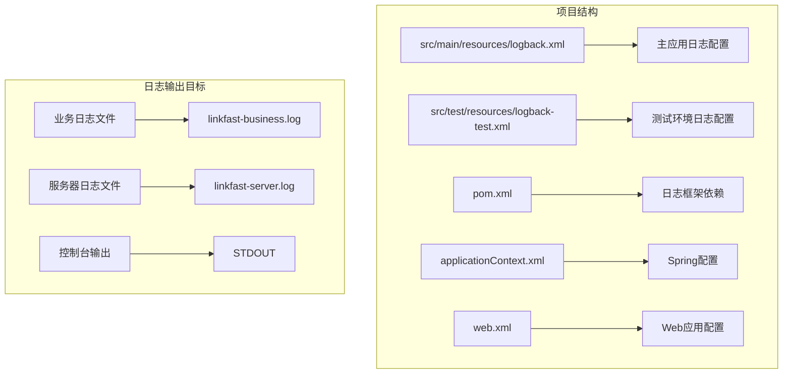
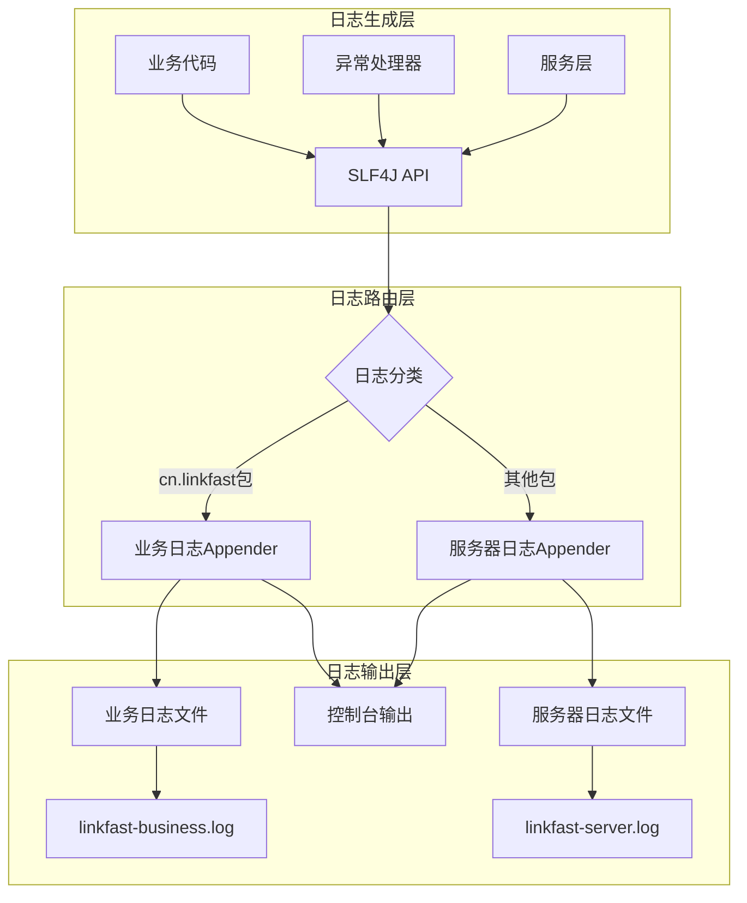
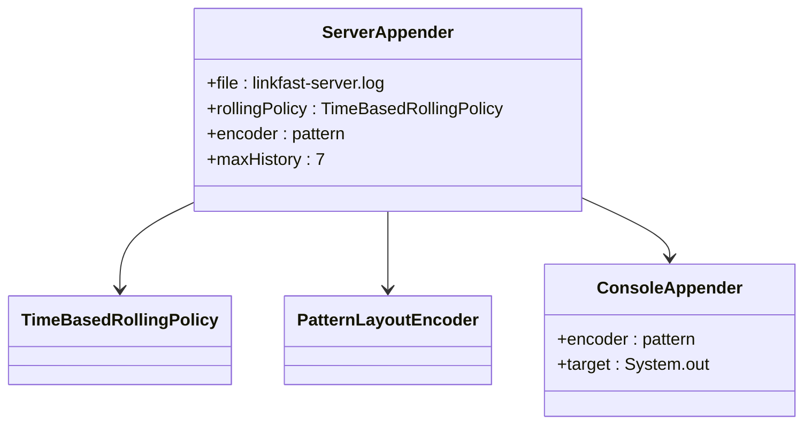
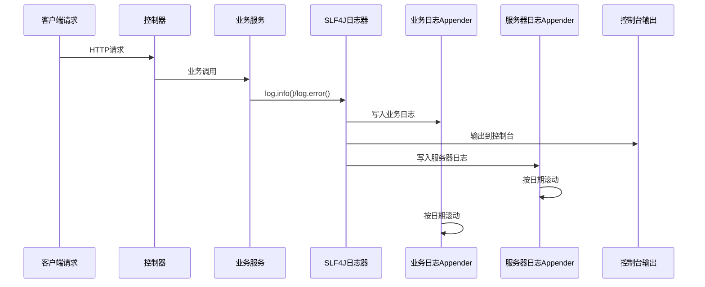
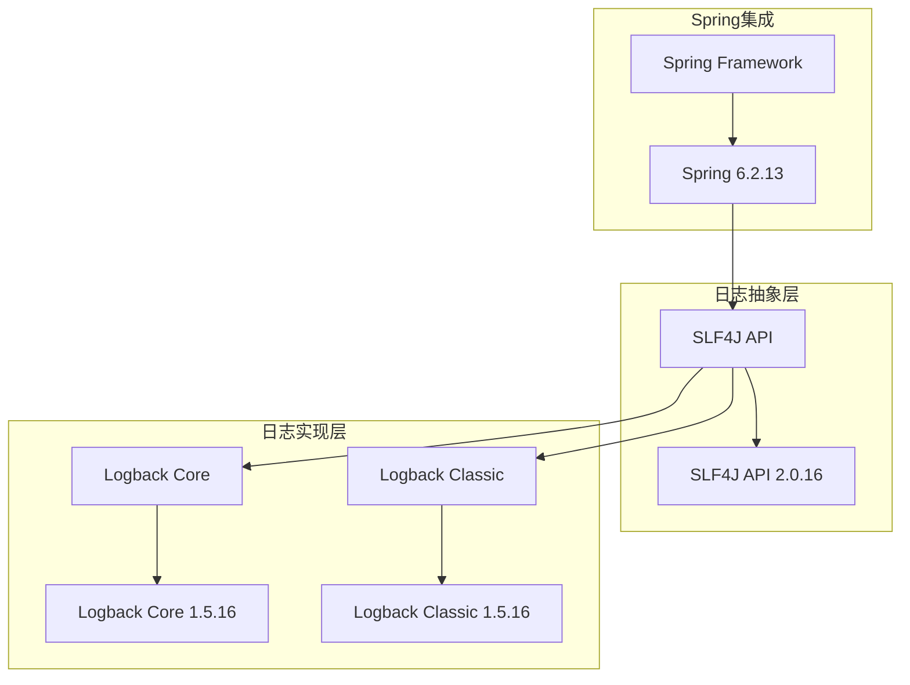
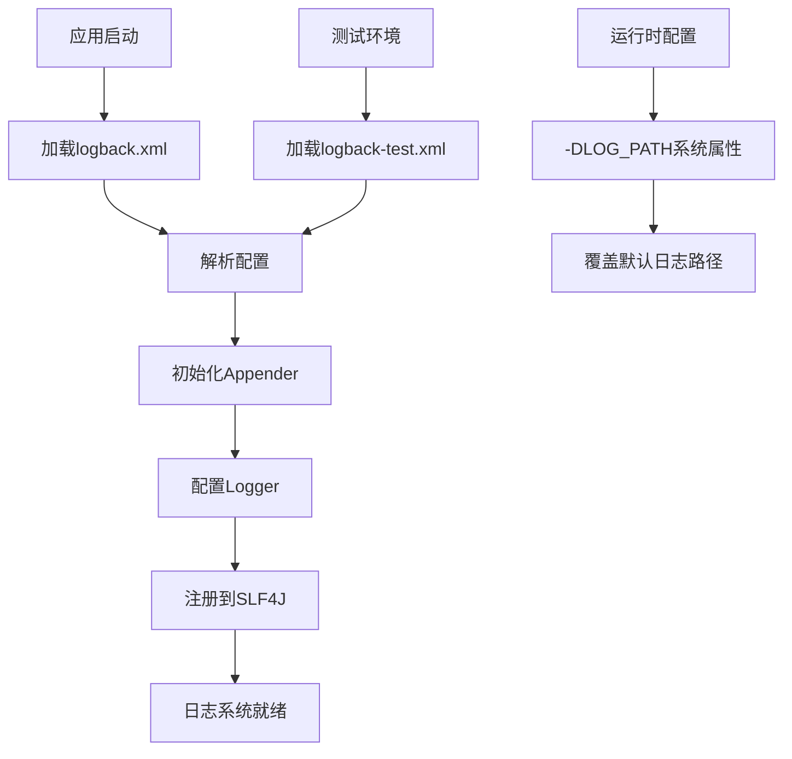
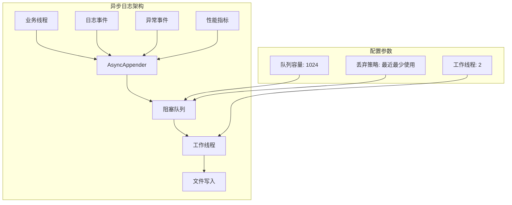
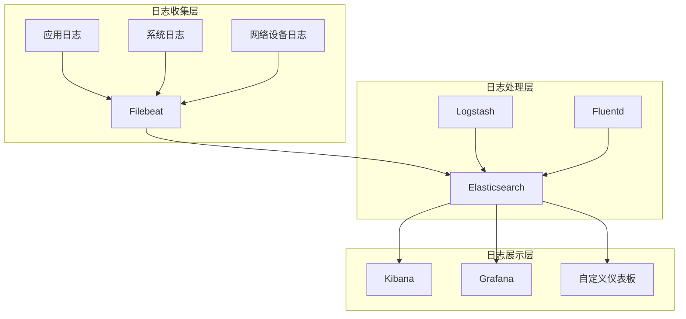

# 日志系统配置

<cite>
**本文档引用的文件**
- [logback.xml](file://src/main/resources/logback.xml)
- [logback-test.xml](file://src/test/resources/logback-test.xml)
- [pom.xml](file://pom.xml)
- [GlobalExceptionHandler.java](file://src/main/java/cn/linkfast/exception/GlobalExceptionHandler.java)
- [AccountServiceImpl.java](file://src/main/java/cn/linkfast/service/impl/AccountServiceImpl.java)
- [AppConfig.java](file://src/main/java/cn/linkfast/config/AppConfig.java)
- [applicationContext.xml](file://src/main/resources/applicationContext.xml)
- [web.xml](file://src/main/webapp/WEB-INF/web.xml)
- [api.properties](file://src/main/resources/api.properties)
</cite>

## 目录
1. [简介](#简介)
2. [项目结构](#项目结构)
3. [核心组件](#核心组件)
4. [架构概览](#架构概览)
5. [详细组件分析](#详细组件分析)
6. [依赖关系分析](#依赖关系分析)
7. [性能考虑](#性能考虑)
8. [故障排查指南](#故障排查指南)
9. [结论](#结论)

## 简介

Link-Fast项目采用Logback作为日志框架，实现了业务日志与系统日志的分离管理。该日志系统通过不同的Appender将业务日志和服务器日志分别输出到独立的文件中，同时支持控制台实时输出，便于开发调试和生产监控。

## 项目结构

项目采用标准的Maven结构，日志配置文件位于资源目录中：



**图表来源**
- [logback.xml:1-49](file://src/main/resources/logback.xml#L1-L49)
- [logback-test.xml:1-49](file://src/test/resources/logback-test.xml#L1-L49)

**章节来源**
- [logback.xml:1-49](file://src/main/resources/logback.xml#L1-L49)
- [logback-test.xml:1-49](file://src/test/resources/logback-test.xml#L1-L49)

## 核心组件

### 日志级别配置

项目采用分级的日志级别策略：

| 日志级别 | 数值等级 | 应用场景 | 配置位置 |
|---------|---------|---------|---------|
| TRACE | 5000 | 详细调试信息，开发阶段使用 | 业务日志 |
| DEBUG | 10000 | 一般调试信息，开发阶段使用 | 业务日志 |
| INFO | 20000 | 重要业务信息，生产默认级别 | 业务日志 |
| WARN | 30000 | 警告信息，潜在问题 | 所有日志 |
| ERROR | 40000 | 错误信息，异常情况 | 所有日志 |

### 日志输出格式

日志输出格式包含以下关键信息：

```mermaid
flowchart TD
A[日志输出格式] --> B[时间戳]
A --> C[线程信息]
A --> D[日志级别]
A --> E[类名信息]
A --> F[日志消息]
B --> B1[%d{yyyy-MM-dd HH:mm:ss.SSS}]
C --> C1[%thread]
D --> D1[%-5level]
E --> E1[%logger{50}]
F --> F1[%msg%n]
```

**图表来源**
- [logback.xml:13-15](file://src/main/resources/logback.xml#L13-L15)
- [logback.xml:25-27](file://src/main/resources/logback.xml#L25-L27)

**章节来源**
- [logback.xml:13-27](file://src/main/resources/logback.xml#L13-L27)

## 架构概览

### 日志系统架构



**图表来源**
- [logback.xml:37-47](file://src/main/resources/logback.xml#L37-L47)
- [GlobalExceptionHandler.java:23](file://src/main/java/cn/linkfast/exception/GlobalExceptionHandler.java#L23)

### 日志文件配置

| 配置项 | 生产环境 | 测试环境 | 默认值 |
|-------|---------|---------|--------|
| 文件路径 | ${LOG_PATH}/linkfast-business.log | ${java.io.tmpdir}/linkfast-test/linkfast-business.log | ./logs |
| 文件大小 | 按日期滚动 | 按日期滚动 | 无限制 |
| 保留天数 | 7天 | 3天 | 无限制 |
| 编码格式 | UTF-8 | UTF-8 | UTF-8 |
| 时间格式 | yyyy-MM-dd HH:mm:ss.SSS | yyyy-MM-dd HH:mm:ss.SSS | HH:mm:ss.SSS |

**章节来源**
- [logback.xml:7-16](file://src/main/resources/logback.xml#L7-L16)
- [logback-test.xml:6-16](file://src/test/resources/logback-test.xml#L6-L16)

## 详细组件分析

### 业务日志Appender

业务日志专门用于记录cn.linkfast包下的业务逻辑信息：

```mermaid
classDiagram
class BusinessAppender {
+file : linkfast-business.log
+rollingPolicy : TimeBasedRollingPolicy
+encoder : pattern
+maxHistory : 7
+additivity : false
}
class TimeBasedRollingPolicy {
+fileNamePattern : linkfast-business.%d{yyyy-MM-dd}.log
+maxHistory : 7
}
class PatternLayoutEncoder {
+pattern : %d{yyyy-MM-dd HH : mm : ss.SSS} [%thread] %-5level %logger{50} - %msg%n
}
BusinessAppender --> TimeBasedRollingPolicy
BusinessAppender --> PatternLayoutEncoder
```

**图表来源**
- [logback.xml:7-16](file://src/main/resources/logback.xml#L7-L16)

### 服务器日志Appender

服务器日志用于记录Spring框架、Tomcat服务器等系统级日志：



**图表来源**
- [logback.xml:19-28](file://src/main/resources/logback.xml#L19-L28)

### 日志记录器配置



**图表来源**
- [AccountServiceImpl.java:54](file://src/main/java/cn/linkfast/service/impl/AccountServiceImpl.java#L54)
- [GlobalExceptionHandler.java:31](file://src/main/java/cn/linkfast/exception/GlobalExceptionHandler.java#L31)

**章节来源**
- [logback.xml:37-47](file://src/main/resources/logback.xml#L37-L47)
- [AccountServiceImpl.java:54-61](file://src/main/java/cn/linkfast/service/impl/AccountServiceImpl.java#L54-L61)

## 依赖关系分析

### 日志框架依赖

项目使用SLF4J作为抽象层，Logback作为具体实现：



**图表来源**
- [pom.xml:120-130](file://pom.xml#L120-L130)

### 日志配置加载流程



**图表来源**
- [logback.xml:3](file://src/main/resources/logback.xml#L3)
- [logback-test.xml:8](file://src/test/resources/logback-test.xml#L8)

**章节来源**
- [pom.xml:120-130](file://pom.xml#L120-L130)
- [logback.xml:3](file://src/main/resources/logback.xml#L3)

## 性能考虑

### 日志性能优化建议

1. **异步日志配置**
   - 在高并发场景下，建议使用AsyncAppender包装器
   - 配置合适的队列容量和阻塞策略
   - 避免在日志中进行复杂的字符串拼接操作

2. **日志级别优化**
   - 生产环境建议使用INFO级别
   - 避免在高频调用中使用DEBUG级别
   - 合理使用TRACE级别进行深度调试

3. **文件滚动策略**
   - 当前配置按日期滚动，适合大多数场景
   - 对于极高吞吐量的应用，可考虑按大小滚动
   - 合理设置maxHistory，平衡存储空间和历史记录

4. **编码和格式化**
   - 使用紧凑的输出格式减少I/O开销
   - 避免在日志中序列化大型对象
   - 合理使用占位符避免不必要的字符串创建

### 异步日志配置示例



## 故障排查指南

### 常见日志问题及解决方案

#### 1. 日志文件无法写入

**问题症状**：
- 应用启动正常但无日志输出
- 控制台出现文件权限警告

**排查步骤**：
1. 检查LOG_PATH系统属性是否正确设置
2. 验证目标目录是否存在且具有写权限
3. 确认磁盘空间充足

**解决方案**：
```bash
# 设置日志路径
export LOG_PATH=/var/log/link-fast
# 或在启动参数中指定
-DLOG_PATH=/var/log/link-fast
```

#### 2. 日志级别不生效

**问题症状**：
- DEBUG级别日志仍然被输出
- INFO级别日志被过滤

**排查步骤**：
1. 检查logback.xml中的logger配置
2. 确认additivity属性设置
3. 验证日志调用的包名

**解决方案**：
```xml
<!-- 确保业务包使用独立的logger配置 -->
<logger name="cn.linkfast" level="INFO" additivity="false">
    <appender-ref ref="BUSINESS"/>
</logger>
```

#### 3. 日志文件过大

**问题症状**：
- 磁盘空间不足
- 日志文件超过预期大小

**解决方案**：
1. 调整maxHistory参数
2. 考虑增加文件大小限制
3. 实施外部日志轮转策略

### 日志监控和分析

#### 1. 日志监控指标

| 监控指标 | 目标值 | 警告阈值 | 错误阈值 |
|---------|--------|----------|----------|
| ERROR级别日志 | 0 | > 1条/小时 | > 10条/小时 |
| WARN级别日志 | 低频 | > 10条/小时 | > 100条/小时 |
| 业务异常率 | 0 | > 0.1% | > 1% |
| 响应时间 | 正常业务范围 | +50% | +200% |

#### 2. 日志分析工具推荐

1. **ELK Stack** (Elasticsearch, Logstash, Kibana)
2. **Graylog** - 开源日志管理平台
3. **Fluentd** - 日志收集器
4. **Promtail + Grafana** - 适用于监控场景

#### 3. 日志聚合方案



### 日志配置最佳实践

#### 1. 开发环境配置

```xml
<!-- 开发环境专用配置 -->
<configuration>
    <!-- 使用控制台输出便于调试 -->
    <appender name="STDOUT" class="ConsoleAppender">
        <encoder>
            <pattern>%d{HH:mm:ss.SSS} [%thread] %-5level %logger{36} - %msg%n</pattern>
        </encoder>
    </appender>
    
    <!-- 开启DEBUG级别以获取详细信息 -->
    <root level="DEBUG">
        <appender-ref ref="STDOUT"/>
    </root>
</configuration>
```

#### 2. 生产环境配置

```xml
<!-- 生产环境配置 -->
<configuration>
    <!-- 设置日志路径 -->
    <property name="LOG_PATH" value="/var/log/link-fast"/>
    
    <!-- 业务日志 -->
    <appender name="BUSINESS" class="RollingFileAppender">
        <file>${LOG_PATH}/business.log</file>
        <rollingPolicy class="TimeBasedRollingPolicy">
            <fileNamePattern>${LOG_PATH}/business.%d{yyyy-MM-dd}.log</fileNamePattern>
            <maxHistory>30</maxHistory>
        </rollingPolicy>
        <encoder>
            <pattern>%d{yyyy-MM-dd HH:mm:ss.SSS} %-5level %logger{36} - %msg%n</pattern>
        </encoder>
    </appender>
    
    <!-- 错误日志单独输出 -->
    <appender name="ERROR" class="RollingFileAppender">
        <file>${LOG_PATH}/error.log</file>
        <filter class="LevelFilter">
            <level>ERROR</level>
            <onMatch>ACCEPT</onMatch>
            <onMismatch>DENY</onMismatch>
        </filter>
        <rollingPolicy class="TimeBasedRollingPolicy">
            <fileNamePattern>${LOG_PATH}/error.%d{yyyy-MM-dd}.log</fileNamePattern>
            <maxHistory>30</maxHistory>
        </rollingPolicy>
        <encoder>
            <pattern>%d{yyyy-MM-dd HH:mm:ss.SSS} %-5level %logger{36} - %msg%n</pattern>
        </encoder>
    </appender>
    
    <root level="INFO">
        <appender-ref ref="BUSINESS"/>
        <appender-ref ref="ERROR"/>
    </root>
</configuration>
```

#### 3. 异步日志配置

```xml
<!-- 异步日志配置 -->
<configuration>
    <!-- 异步Appender -->
    <appender name="ASYNC_BUSINESS" class="AsyncAppender">
        <queueSize>1024</queueSize>
        <discardingThreshold>0</discardingThreshold>
        <includeCallerData>false</includeCallerData>
        <appender-ref ref="BUSINESS"/>
    </appender>
    
    <!-- 业务日志使用异步输出 -->
    <logger name="cn.linkfast" level="INFO" additivity="false">
        <appender-ref ref="ASYNC_BUSINESS"/>
    </logger>
</configuration>
```

**章节来源**
- [logback.xml:3](file://src/main/resources/logback.xml#L3)
- [logback-test.xml:8](file://src/test/resources/logback-test.xml#L8)
- [GlobalExceptionHandler.java:31](file://src/main/java/cn/linkfast/exception/GlobalExceptionHandler.java#L31)

## 结论

Link-Fast项目的日志系统设计合理，实现了业务日志与系统日志的有效分离。通过清晰的日志级别配置、标准化的输出格式和灵活的文件滚动策略，为开发调试和生产监控提供了良好的支持。

建议在生产环境中进一步完善异步日志配置、实施日志聚合方案，并建立完善的日志监控体系，以提升系统的可观测性和运维效率。