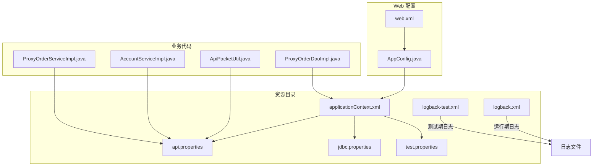
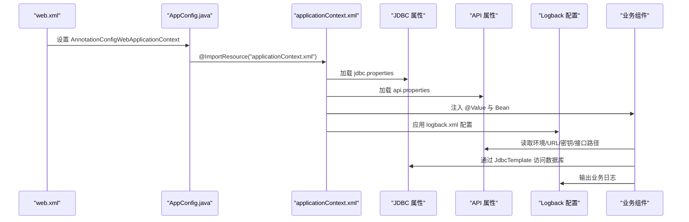
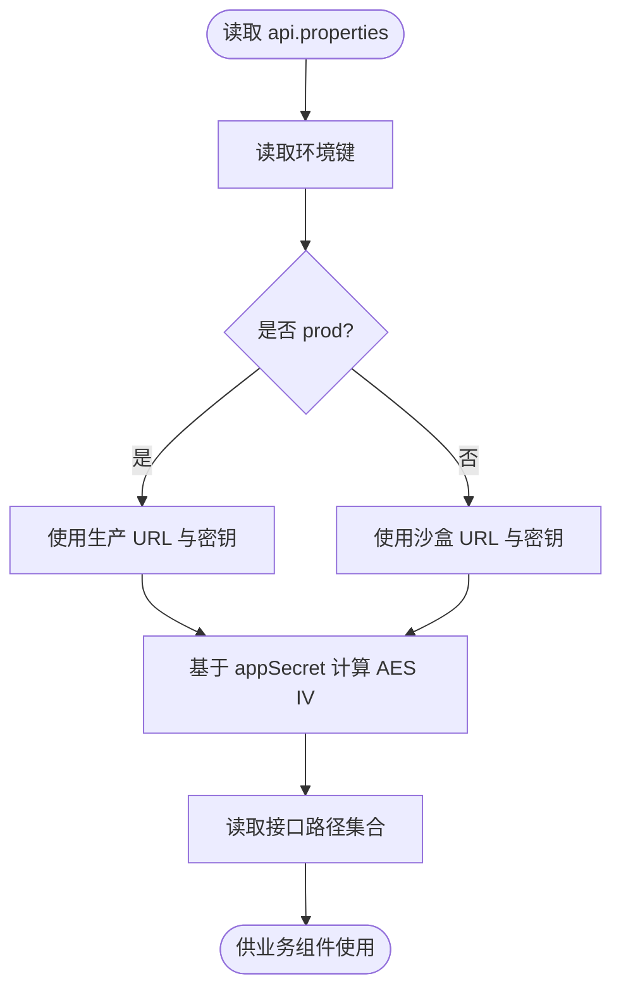
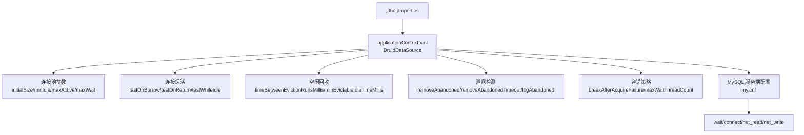
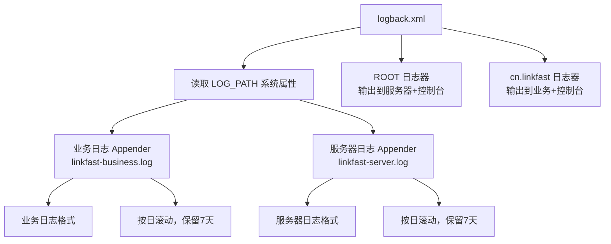
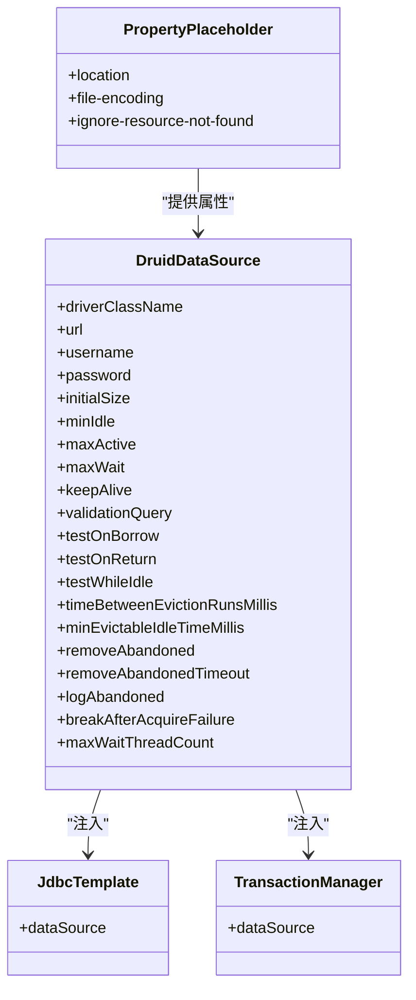
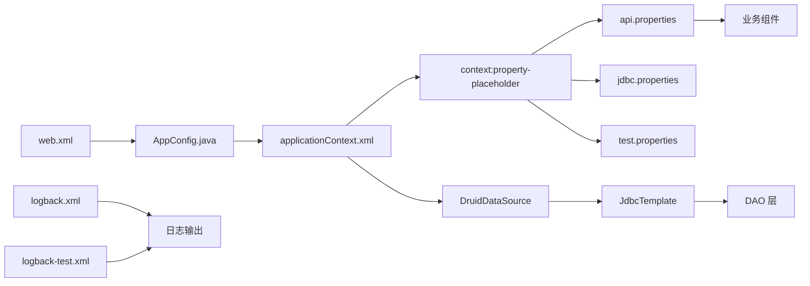

# 配置文件管理

<cite>
**本文引用的文件**
- [api.properties](file://src/main/resources/api.properties)
- [jdbc.properties](file://src/main/resources/jdbc.properties)
- [logback.xml](file://src/main/resources/logback.xml)
- [applicationContext.xml](file://src/main/resources/applicationContext.xml)
- [web.xml](file://src/main/webapp/WEB-INF/web.xml)
- [AppConfig.java](file://src/main/java/cn/linkfast/config/AppConfig.java)
- [ApiPacketUtil.java](file://src/main/java/cn/linkfast/utils/ApiPacketUtil.java)
- [AccountServiceImpl.java](file://src/main/java/cn/linkfast/service/impl/AccountServiceImpl.java)
- [ProxyOrderServiceImpl.java](file://src/main/java/cn/linkfast/service/impl/ProxyOrderServiceImpl.java)
- [my.cnf](file://docs/database/my.cnf)
- [test.properties](file://src/test/resources/test.properties)
- [logback-test.xml](file://src/test/resources/logback-test.xml)
</cite>

## 目录
1. [简介](#简介)
2. [项目结构](#项目结构)
3. [核心组件](#核心组件)
4. [架构总览](#架构总览)
5. [详细组件分析](#详细组件分析)
6. [依赖关系分析](#依赖关系分析)
7. [性能考虑](#性能考虑)
8. [故障排查指南](#故障排查指南)
9. [结论](#结论)
10. [附录](#附录)

## 简介
本文件面向 Link-Fast 项目的配置文件管理，系统性说明以下配置文件的结构、用途与关键配置项：
- api.properties：第三方 API 接口配置（环境切换、应用密钥与密钥管理）
- jdbc.properties：数据库连接配置（连接池、超时参数、连接属性）
- logback.xml：日志配置（日志级别、输出格式、文件滚动策略）
- applicationContext.xml：Spring 应用配置（Bean 定义、数据源、事务管理）

并补充：
- 配置文件的环境适配与安全配置
- 性能调优建议
- 配置加载顺序、优先级与覆盖机制

## 项目结构
配置文件主要位于资源目录，Spring 配置通过 web.xml 与 AppConfig 导入，DAO/Service 通过注解与 @Value 注入配置。

图表来源
- [web.xml:10-35](file://src/main/webapp/WEB-INF/web.xml#L10-L35)
- [AppConfig.java:24-25](file://src/main/java/cn/linkfast/config/AppConfig.java#L24-L25)
- [applicationContext.xml:14-15](file://src/main/resources/applicationContext.xml#L14-L15)
- [api.properties:1-31](file://src/main/resources/api.properties#L1-L31)
- [jdbc.properties:1-39](file://src/main/resources/jdbc.properties#L1-L39)
- [logback.xml:1-49](file://src/main/resources/logback.xml#L1-L49)
- [test.properties:1-3](file://src/test/resources/test.properties#L1-L3)
- [logback-test.xml:1-49](file://src/test/resources/logback-test.xml#L1-L49)

章节来源
- [web.xml:10-35](file://src/main/webapp/WEB-INF/web.xml#L10-L35)
- [AppConfig.java:24-25](file://src/main/java/cn/linkfast/config/AppConfig.java#L24-L25)
- [applicationContext.xml:14-15](file://src/main/resources/applicationContext.xml#L14-L15)

## 核心组件
- API 配置组件：ApiPacketUtil 与 AccountServiceImpl/ProxyOrderServiceImpl 通过 @Value 注入 api.properties 的环境、URL、应用密钥与接口路径，实现环境切换与请求参数打包。
- 数据库配置组件：applicationContext.xml 通过 context:property-placeholder 引入 jdbc.properties 与 api.properties，并以 DruidDataSource 作为数据源，配置连接池与检测策略。
- 日志配置组件：logback.xml 分别为业务代码与服务器框架日志配置独立的 RollingFileAppender，控制输出位置、滚动策略与格式；测试环境使用 logback-test.xml 覆盖。
- Web/Spring 启动：web.xml 指定 AnnotationConfigWebApplicationContext 与 AppConfig，导入 applicationContext.xml 并启用字符集过滤与会话配置。

章节来源
- [ApiPacketUtil.java:20-51](file://src/main/java/cn/linkfast/utils/ApiPacketUtil.java#L20-L51)
- [AccountServiceImpl.java:25-43](file://src/main/java/cn/linkfast/service/impl/AccountServiceImpl.java#L25-L43)
- [ProxyOrderServiceImpl.java:46-87](file://src/main/java/cn/linkfast/service/impl/ProxyOrderServiceImpl.java#L46-L87)
- [applicationContext.xml:14-66](file://src/main/resources/applicationContext.xml#L14-L66)
- [logback.xml:6-47](file://src/main/resources/logback.xml#L6-L47)
- [web.xml:10-66](file://src/main/webapp/WEB-INF/web.xml#L10-L66)

## 架构总览
配置文件在系统中的作用链路如下：

图表来源
- [web.xml:10-35](file://src/main/webapp/WEB-INF/web.xml#L10-L35)
- [AppConfig.java:24-25](file://src/main/java/cn/linkfast/config/AppConfig.java#L24-L25)
- [applicationContext.xml:14-66](file://src/main/resources/applicationContext.xml#L14-L66)
- [logback.xml:6-47](file://src/main/resources/logback.xml#L6-L47)

## 详细组件分析

### api.properties 配置详解
- 环境切换
  - 通过环境键控制生产/沙盒环境，决定基础 URL 与密钥对的选择。
- 应用密钥与密钥管理
  - 生产与沙盒分别配置 appKey 与 appSecret，初始化时根据环境选择对应密钥，并基于 appSecret 计算 AES IV。
- 接口路径
  - 定义各接口的相对路径，业务组件通过 baseUrl + 路径拼接完整 URL。

图表来源
- [api.properties:1-31](file://src/main/resources/api.properties#L1-L31)
- [ApiPacketUtil.java:39-51](file://src/main/java/cn/linkfast/utils/ApiPacketUtil.java#L39-L51)
- [AccountServiceImpl.java:35-43](file://src/main/java/cn/linkfast/service/impl/AccountServiceImpl.java#L35-L43)
- [ProxyOrderServiceImpl.java:79-87](file://src/main/java/cn/linkfast/service/impl/ProxyOrderServiceImpl.java#L79-L87)

章节来源
- [api.properties:1-31](file://src/main/resources/api.properties#L1-L31)
- [ApiPacketUtil.java:20-51](file://src/main/java/cn/linkfast/utils/ApiPacketUtil.java#L20-L51)
- [AccountServiceImpl.java:25-43](file://src/main/java/cn/linkfast/service/impl/AccountServiceImpl.java#L25-L43)
- [ProxyOrderServiceImpl.java:46-87](file://src/main/java/cn/linkfast/service/impl/ProxyOrderServiceImpl.java#L46-L87)

### jdbc.properties 配置详解
- 连接驱动与 URL
  - 驱动类与 MySQL JDBC URL，包含时区、字符集、SSL、批处理、多查询、预编译缓存、超时与自动重连等参数。
- 用户名与密码
  - 数据库访问凭据。
- 连接池与超时
  - 通过 applicationContext.xml 的 DruidDataSource 配置连接池大小、等待时间、空闲回收与泄露检测等；MySQL 侧 my.cnf 配置 wait_timeout、connect_timeout、net_read/write_timeout 等，需与连接池策略匹配。

图表来源
- [jdbc.properties:1-39](file://src/main/resources/jdbc.properties#L1-L39)
- [applicationContext.xml:17-52](file://src/main/resources/applicationContext.xml#L17-L52)
- [my.cnf:32-48](file://docs/database/my.cnf#L32-L48)

章节来源
- [jdbc.properties:1-39](file://src/main/resources/jdbc.properties#L1-L39)
- [applicationContext.xml:17-52](file://src/main/resources/applicationContext.xml#L17-L52)
- [my.cnf:32-48](file://docs/database/my.cnf#L32-L48)

### logback.xml 配置详解
- 日志路径
  - 通过系统属性 LOG_PATH 控制日志输出目录，默认 ./logs。
- 日志分类
  - 业务代码（cn.linkfast 包）：单独输出到 linkfast-business.log，并控制 additivity=false 避免冒泡。
  - 服务器/框架日志：输出到 linkfast-server.log。
  - 控制台输出：统一格式，便于开发调试。
- 滚动策略
  - 基于日期的 TimeBasedRollingPolicy，保留历史日志天数。
- 测试环境
  - logback-test.xml 使用系统临时目录，保留天数更短，避免磁盘占用。

图表来源
- [logback.xml:3-47](file://src/main/resources/logback.xml#L3-L47)
- [logback-test.xml:3-47](file://src/test/resources/logback-test.xml#L3-L47)

章节来源
- [logback.xml:1-49](file://src/main/resources/logback.xml#L1-L49)
- [logback-test.xml:1-49](file://src/test/resources/logback-test.xml#L1-L49)

### applicationContext.xml 配置详解
- 属性占位符
  - 通过 context:property-placeholder 引入 jdbc.properties、api.properties 与 test.properties，UTF-8 编码，忽略不存在资源。
- 数据源
  - DruidDataSource：驱动、URL、用户名、密码；连接池核心参数；连接保活与检测策略；空闲回收；泄露检测；容错与等待线程数上限。
- JdbcTemplate
  - 注入 dataSource，供 DAO 使用。
- 事务管理
  - DataSourceTransactionManager 与 @EnableTransactionManagement，结合 @Transactional 使用。

图表来源
- [applicationContext.xml:14-66](file://src/main/resources/applicationContext.xml#L14-L66)

章节来源
- [applicationContext.xml:14-66](file://src/main/resources/applicationContext.xml#L14-L66)

## 依赖关系分析
- 配置加载顺序与覆盖
  - web.xml 指定 AnnotationConfigWebApplicationContext 与 AppConfig。
  - AppConfig 通过 @ImportResource 导入 applicationContext.xml。
  - applicationContext.xml 使用 context:property-placeholder 引入多个属性文件，按 location 列表顺序加载，后者可覆盖前者同名键。
  - test.properties 通过 classpath*:test.properties 引入，测试环境可覆盖通用配置。
- 组件依赖
  - ApiPacketUtil、AccountServiceImpl、ProxyOrderServiceImpl 依赖 api.properties 的环境、URL、密钥与接口路径。
  - DAO 依赖 JdbcTemplate，JdbcTemplate 依赖 dataSource，dataSource 来自 jdbc.properties。
  - 日志依赖 logback.xml（测试环境使用 logback-test.xml）。

图表来源
- [web.xml:10-35](file://src/main/webapp/WEB-INF/web.xml#L10-L35)
- [AppConfig.java:24-25](file://src/main/java/cn/linkfast/config/AppConfig.java#L24-L25)
- [applicationContext.xml:14-15](file://src/main/resources/applicationContext.xml#L14-L15)
- [test.properties:1-3](file://src/test/resources/test.properties#L1-L3)

章节来源
- [web.xml:10-35](file://src/main/webapp/WEB-INF/web.xml#L10-L35)
- [AppConfig.java:24-25](file://src/main/java/cn/linkfast/config/AppConfig.java#L24-L25)
- [applicationContext.xml:14-15](file://src/main/resources/applicationContext.xml#L14-L15)
- [test.properties:1-3](file://src/test/resources/test.properties#L1-L3)

## 性能考虑
- 连接池与数据库超时
  - 连接池参数（initialSize/minIdle/maxActive/maxWait）与 Druid 检测策略（testOnBorrow/testWhileIdle）需与 MySQL 的 wait_timeout、connect_timeout、net_read/write_timeout 协调，避免连接被 MySQL 主动回收导致抖动。
  - 建议将连接池空闲回收间隔与最小空闲时间设置为小于 wait_timeout，确保连接在被回收前保持活跃。
- 批量操作
  - JDBC URL 中开启 rewriteBatchedStatements、allowMultiQueries、cachePrepStmts，有助于提升批量写入与多查询性能。
- 网络与重试
  - 业务层对第三方 API 的请求采用有限重试策略，区分“连接失败”和“已发送但响应失败”的场景，避免重复落库与数据不一致。
- 日志滚动
  - 生产环境按日滚动并保留7天，测试环境按日滚动并保留3天，减少磁盘压力。

章节来源
- [applicationContext.xml:23-52](file://src/main/resources/applicationContext.xml#L23-L52)
- [jdbc.properties:10-17](file://src/main/resources/jdbc.properties#L10-L17)
- [my.cnf:32-48](file://docs/database/my.cnf#L32-L48)
- [logback.xml:9-11](file://src/main/resources/logback.xml#L9-L11)
- [logback-test.xml:9-11](file://src/test/resources/logback-test.xml#L9-L11)

## 故障排查指南
- API 环境与密钥问题
  - 确认 api.ipv.env 是否正确指向 prod 或 sandbox；检查对应 appKey/appSecret 是否有效；确认 AES IV 计算依赖的 appSecret 长度满足要求。
- 数据库连接失败
  - 检查 jdbc.properties 的 driver/url/username/password；核对 MySQL 服务端 wait_timeout、connect_timeout、net_read/write_timeout；观察连接池等待线程数与最大等待时间。
- 日志定位
  - 生产环境查看 LOG_PATH 下的日志文件；测试环境查看 logback-test.xml 指定的临时目录；关注业务日志与服务器日志的分离输出。
- 事务与回滚
  - 确认 @EnableTransactionManagement 与 @Transactional 的使用；注意 NoRollbackBusinessException 的场景，避免误回滚本地数据。

章节来源
- [ApiPacketUtil.java:39-51](file://src/main/java/cn/linkfast/utils/ApiPacketUtil.java#L39-L51)
- [applicationContext.xml:59-66](file://src/main/resources/applicationContext.xml#L59-L66)
- [logback.xml:37-47](file://src/main/resources/logback.xml#L37-L47)
- [logback-test.xml:3-47](file://src/test/resources/logback-test.xml#L3-L47)

## 结论
- api.properties 提供了清晰的环境切换与密钥管理机制，配合业务组件的参数打包与 URL 拼接，保证了与第三方 API 的稳定对接。
- jdbc.properties 与 applicationContext.xml 的 Druid 配置共同构成了高性能、可维护的数据库连接层，需与 MySQL 服务端超时参数协同优化。
- logback.xml 通过业务与服务器日志分离、按日滚动与控制台输出，提升了可观测性与运维效率。
- 配置加载顺序明确，优先级可通过 property-placeholder 的 location 列表与测试覆盖实现，建议在不同环境使用独立的覆盖文件。

## 附录
- 环境适配建议
  - 开发/测试：使用 test.properties 覆盖关键行为（如禁用定时任务），并通过 logback-test.xml 控制日志输出。
  - 生产：确保 api.properties 的 prod 环境启用，jdbc.properties 的连接参数与 MySQL 服务端参数匹配，日志滚动策略与磁盘容量规划一致。
- 安全配置建议
  - 密钥与密码建议通过外部机密管理（如环境变量或 Vault）注入，避免硬编码在配置文件中。
  - HTTPS 与 SSL 参数已在 JDBC URL 中配置，确保网络传输安全。
- 性能调优清单
  - 连接池：根据峰值并发调整 initialSize/minIdle/maxActive/maxWait，监控等待线程数。
  - 检测策略：testOnBorrow/testWhileIdle 与 MySQL wait_timeout 平衡，避免频繁重建连接。
  - 批处理：合理使用 rewriteBatchedStatements 与 allowMultiQueries，避免过度使用导致 SQL 复杂度上升。
  - 日志：按日滚动与保留策略，定期清理与归档，避免磁盘空间不足。